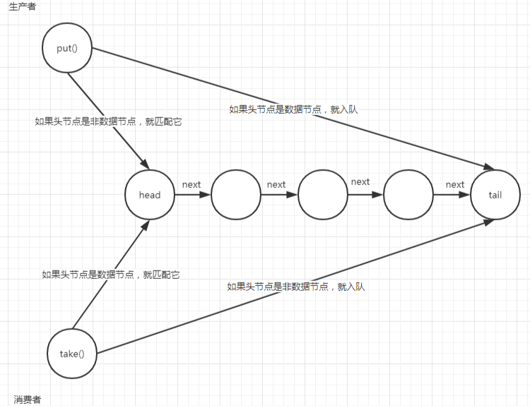

# LinkedTransferQueue

## Field
```java
	// 多核时为真
	private static final boolean MP =
        Runtime.getRuntime().availableProcessors() > 1;

    /**
     * The number of times to spin (with randomly interspersed calls
     * to Thread.yield) on multiprocessor before blocking when a node
     * is apparently the first waiter in the queue. 
     */
    private static final int FRONT_SPINS   = 1 << 7;

    /**
     * The number of times to spin before blocking when a node is
     * preceded by another node that is apparently spinning.  Also
     * serves as an increment to FRONT_SPINS on phase changes, and as
     * base average frequency for yielding during spins. Must be a
     * power of two.
     */
    private static final int CHAINED_SPINS = FRONT_SPINS >>> 1;

    /**
     * The maximum number of estimated removal failures (sweepVotes)
     * to tolerate before sweeping through the queue unlinking
     * cancelled nodes that were not unlinked upon initial
     * removal. See above for explanation. The value must be at least
     * two to avoid useless sweeps when removing trailing nodes.
     */
    static final int SWEEP_THRESHOLD = 32;
	// 头结点
    transient volatile Node head;
	
    // 尾节点
    private transient volatile Node tail;

    /** The number of apparent failures to unsplice removed nodes */
    private transient volatile int sweepVotes;
	// 立即返回,不阻塞
    private static final int NOW   = 0; // for untimed poll, tryTransfer
	// 异步,不阻塞
    private static final int ASYNC = 1; // for offer, put, add
	// 阻塞
    private static final int SYNC  = 2; // for transfer, take
	// 有超时时间
    private static final int TIMED = 3; // for timed poll, tryTransfer
	// CAS操作
    private static final sun.misc.Unsafe UNSAFE;
    private static final long headOffset;
    private static final long tailOffset;
    private static final long sweepVotesOffset;
```
静态初始化:
```java
    static {
        try {
            UNSAFE = sun.misc.Unsafe.getUnsafe();
            Class<?> k = LinkedTransferQueue.class;
            headOffset = UNSAFE.objectFieldOffset
                (k.getDeclaredField("head"));
            tailOffset = UNSAFE.objectFieldOffset
                (k.getDeclaredField("tail"));
            sweepVotesOffset = UNSAFE.objectFieldOffset
                (k.getDeclaredField("sweepVotes"));
        } catch (Exception e) {
            throw new Error(e);
        }
    }
```

存储结构:

```java
    static final class Node {
        final boolean isData;   // false if this is a request node
        volatile Object item;   // 存储的元素
        volatile Node next;	// 下一个节点
        volatile Thread waiter; // null until waiting  // 等待的线程
        
        Node(Object item, boolean isData) {
            UNSAFE.putObject(this, itemOffset, item); // relaxed write
            this.isData = isData;
        }
        ..... // CAS操作
    }

```

## 构造器
```java
    public LinkedTransferQueue() {
    }
```

## 添加元素

### put

```java
    public void put(E e) {
        xfer(e, true, ASYNC, 0);
    }
```

### offer

```java
    public boolean offer(E e) {
        xfer(e, true, ASYNC, 0);
        return true;
    }
```


### add

```java
    public boolean add(E e) {
        xfer(e, true, ASYNC, 0);
        return true;
    }
```


## 获取元素

### take

```java
    public E take() throws InterruptedException {
        // 获取元素,SYNC 阻塞
        E e = xfer(null, false, SYNC, 0);
        if (e != null)
            return e;
        Thread.interrupted();
        throw new InterruptedException();
    }
```

### poll

```java
    public E poll() {
        // 获取元素,NOW 不阻塞
        return xfer(null, false, NOW, 0);
    }
```

### peek

```java
    public E peek() {
        return firstDataItem();
    }
```

```java
    private E firstDataItem() {
        // 从链表头开始遍历,并返回第一个 数值节点的元素值
        for (Node p = head; p != null; p = succ(p)) {
            Object item = p.item;
            if (p.isData) {
                if (item != null && item != p)
                    return LinkedTransferQueue.<E>cast(item);
            }
            else if (item == null)
                return null;
        }
        return null;
    }
```

注意: LinkedTransferQueue是双重队列,也就是 1) 数据元素队列  2) 等待节点队列; 但是同时有且只有一个元素.



也就是会分为下面几种情况:

1) 生产者放入数据节点

1. 如果是数据队列,则在队列尾部添加节点
2. 如果是非数据队列,则进行匹配

2) 消费者消费节点

1. 如果是数据队列,则进行匹配
2. 如果是非数据队列,则在尾部添加节点

可以看到,添加元素,以及poll和take都是基于xfer实现, 来看一下这个神奇的函数:


```java
    private E xfer(E e, boolean haveData, int how, long nanos) {
        if (haveData && (e == null))
            throw new NullPointerException();
        Node s = null;                        // the node to append, if needed
        retry:
        for (;;) {                            // restart on append race
            // 从头开始尝试匹配,如果节点被其他线程先一步匹配了
            // 就尝试其下一个,直到匹配为止,或者到队列中没有元素为止
            for (Node h = head, p = h; p != null;) { // find & match first node
                // p节点模式
                boolean isData = p.isData;
                // p节点元素值
                Object item = p.item;
                // p没有被匹配到
                if (item != p && (item != null) == isData) { // unmatched
                    // 如果两个模式一样,则不能匹配,跳出循环尝试入队
                    if (isData == haveData)   // can't match
                        break;
                    // 如果两者模式不一样，则尝试匹配
                    // 把p的值设置为e(如果是取元素则e是null,如果是放元素,则e是元素值)
                    if (p.casItem(item, e)) { // match
                        // 匹配成功
                        // 这里for循环用于控制多线程同时取元素时出现竞争的情况
                        for (Node q = p; q != h;) {
                            // 到这里可能头结点已经被匹配,然后p会变成h的下一个节点
                            Node n = q.next;  // update by 2 unless singleton
                            // 如果head没有变,就把q或者n变为head节点
                            // 并把h删除(forgetNext()就是把next指向自己,也就是把自己从队列中删除)
                            // 这时为什么要把head设置为n?因为到这里,肯定head本身已经被匹配掉了
                            // 而上面的p.casitem也成功了,说明p也被匹配掉了
                            // 所以需要把他们俩都出列,让其他线程可以从真正的头开始
                            if (head == h && casHead(h, n == null ? q : n)) {
                                h.forgetNext();
                                break;
                            }                 // advance and retry
                            // 如果头节点为空,或者next为空,或者其next未匹配,就重试
                            if ((h = head)   == null ||
                                (q = h.next) == null || !q.isMatched())
                                break;        // unless slack < 2
                        }
                        // 唤醒p等待的线程
                        LockSupport.unpark(p.waiter);
                        // 返回匹配到的元素
                        return LinkedTransferQueue.<E>cast(item);
                    }
                }
                Node n = p.next;
                p = (p != n) ? n : (h = head); // Use head if p offlist
            }
			// 到这里说明队列中存储的节点类型和自己一样
            // 或者队列中没有元素了,就入队(不管村元素,还是取元素都要入队,只是节点不同而已)
            // 入队也分为四种情况:
            // NOW  立即返回,没有匹配到就立即返回,不做入队操作
            // ASYNC 异步,元素入队,但当前线程不会阻塞
            // SYNC 同步,元素入队后当前线程阻塞,等待被匹配到
            // TIMED 有超时,元素入队后等待一段时间被匹配,时间到了还没匹配就返回元素本身
            if (how != NOW) {                 // No matches available
                if (s == null)
                    // 新建节点
                    s = new Node(e, haveData); // 创建节点封装要放入的元素值
                // 尝试入队操作
                Node pred = tryAppend(s, haveData);
                // 再次尝试
                if (pred == null)
                    continue retry;           // lost race vs opposite mode
                // 如果不是异步,就等待被匹配
                if (how != ASYNC)
                    return awaitMatch(s, pred, e, (how == TIMED), nanos);
            }
            return e; // not waiting
        }
    }
```

添加节点:

```java
    private Node tryAppend(Node s, boolean haveData) {
        // 从尾部添加
        for (Node t = tail, p = t;;) {        // move p to last node and append
            Node n, u;                        // temps for reads of next & tail
            // 如果队列为空,则直接在最后添加在head节点就可以了
            if (p == null && (p = head) == null) {
                if (casHead(null, s))
                    return s;                 // initialize
            }
            else if (p.cannotPrecede(haveData))
                // 如果p无法处理,则返回null
                // 这里无法处理的意思是,p和s的节点类型不一样,不允许s入队
                // 比如:其他线程先入队了一个数据节点,这时候要入队一个非数据节点,就不允许
                // 返回null后,外面方法会再次重新匹配和重新入队
                return null;                  // lost race vs opposite mode
            else if ((n = p.next) != null)    // not last; keep traversing
                // 如果p的next不为null,说明不是最后一个节点
                // 则让p重新指向最后一个节点
                p = p != t && t != (u = tail) ? (t = u) : // stale tail
                    (p != n) ? n : null;      // restart if off list
            else if (!p.casNext(null, s))  // 这里会把s设置为p的next,也就是入队
                // 如果CAS更新s为p的next失败,
                // 说明其他线程先异步更新p的next了
                // 就让p指向p的next,重新让s尝试入队
                p = p.next;                   // re-read on CAS failure
            else {
                // 到这里说明s成功入队了
                // 如果p等于t,就更新tail指针
                // 还记得上面插入第一个元素时,tail指针并没有指向新元素
                // 这里就是跟新tail指针的
                if (p != t) {                 // update if slack now >= 2
                    while ((tail != t || !casTail(t, s)) &&
                           (t = tail)   != null &&
                           (s = t.next) != null && // advance and retry
                           (s = s.next) != null && s != t);
                }
                // 返回添加的节点
                return p;
            }
        }
    }
```

等待匹配:

```java
     /* @param s the waiting node
     * @param pred the predecessor of s, or s itself if it has no
     * predecessor, or null if unknown (the null case does not occur
     * in any current calls but may in possible future extensions)
     * @param e the comparison value for checking match
     * @param timed if true, wait only until timeout elapses
     * @param nanos timeout in nanosecs, used only if timed is true
     */
	private E awaitMatch(Node s, Node pred, E e, boolean timed, long nanos) {
        // 根据是否设置超时,得到一个超时时间
        final long deadline = timed ? System.nanoTime() + nanos : 0L;
        Thread w = Thread.currentThread();
        int spins = -1; // initialized after first item and cancel checks
        ThreadLocalRandom randomYields = null; // bound if needed
        for (;;) {
            Object item = s.item;
            // 不相等就匹配到了
            if (item != e) {                  // matched
                // assert item != s;
                s.forgetContents();           // avoid garbage
                return LinkedTransferQueue.<E>cast(item);
            }
            // 如果线程被中断了,或者时间到了
            // 则删除s节点
            if ((w.isInterrupted() || (timed && nanos <= 0)) &&
                    s.casItem(e, s)) {        // cancel
                unsplice(pred, s);
                return e;
            }

            if (spins < 0) {                  // establish spins at/near front
                // 如果前面有节点,则返回0
                // 如果前面有节点且正在匹配就返回一定的次数
                if ((spins = spinsFor(pred, s.isData)) > 0)
                    randomYields = ThreadLocalRandom.current();
            }
            else if (spins > 0) {             // spin
                // 自旋
                --spins;
                // 随机让出CPU
                if (randomYields.nextInt(CHAINED_SPINS) == 0)
                    Thread.yield();           // occasionally yield
            }
            // 当前节点的等待线程设置为当前线程
            else if (s.waiter == null) {
                s.waiter = w;                 // request unpark then recheck
            }
            // 如果设置了超时时间,则阻塞线程
            else if (timed) {
                nanos = deadline - System.nanoTime();
                if (nanos > 0L)
                    LockSupport.parkNanos(this, nanos);
            }
            else {
                // 阻塞线程
                LockSupport.park(this);
            }
        }
    }
```


## 删除元素

```java
    public boolean remove(Object o) {
        return findAndRemove(o);
    }
```

```java
    private boolean findAndRemove(Object e) {
        if (e != null) {
            for (Node pred = null, p = head; p != null; ) {
                Object item = p.item;
                if (p.isData) {
                    if (item != null && item != p && e.equals(item) &&
                        p.tryMatchData()) {
                        unsplice(pred, p);
                        return true;
                    }
                }
                else if (item == null)
                    break;
                pred = p;
                if ((p = p.next) == pred) { // stale
                    pred = null;
                    p = head;
                }
            }
        }
        return false;
    }
```


## 遍历元素

```java
    public Iterator<E> iterator() {
        return new Itr();
    }
```

```java
    final class Itr implements Iterator<E> {
        private Node nextNode;   // next node to return item for
        private E nextItem;      // the corresponding item
        private Node lastRet;    // last returned node, to support remove
        private Node lastPred;   // predecessor to unlink lastRet
		
        private void advance(Node prev) {
            Node r, b; // reset lastPred upon possible deletion of lastRet
            if ((r = lastRet) != null && !r.isMatched())
                lastPred = r;    // next lastPred is old lastRet
            else if ((b = lastPred) == null || b.isMatched())
                lastPred = null; // at start of list
            else {
                Node s, n;       // help with removal of lastPred.next
                while ((s = b.next) != null &&
                       s != b && s.isMatched() &&
                       (n = s.next) != null && n != s)
                    b.casNext(s, n);
            }
            this.lastRet = prev;
            // 遍历获取下一次要遍历的元素
            for (Node p = prev, s, n;;) {
                s = (p == null) ? head : p.next;
                if (s == null)
                    break;
                else if (s == p) {
                    p = null;
                    continue;
                }
                Object item = s.item;
                // 如果队列是数据队列,则记录item和node
                if (s.isData) {
                    if (item != null && item != s) {
                        nextItem = LinkedTransferQueue.<E>cast(item);
                        nextNode = s;
                        return;
                    }
                }
                else if (item == null)
                    break;
                // assert s.isMatched();
                if (p == null)
                    p = s;
                else if ((n = s.next) == null)
                    break;
                else if (s == n)
                    p = null;
                else
                    p.casNext(s, n);
            }
            nextNode = null;
            nextItem = null;
        }

        Itr() {
            advance(null);
        }
		// 是否有下一个
        public final boolean hasNext() {
            return nextNode != null;
        }
		// 下一个节点
        public final E next() {
            Node p = nextNode;
            if (p == null) throw new NoSuchElementException();
            E e = nextItem;
            advance(p);
            return e;
        }

        public final void remove() {
            final Node lastRet = this.lastRet;
            if (lastRet == null)
                throw new IllegalStateException();
            this.lastRet = null;
            if (lastRet.tryMatchData())
                unsplice(lastPred, lastRet);
        }
    }
```

