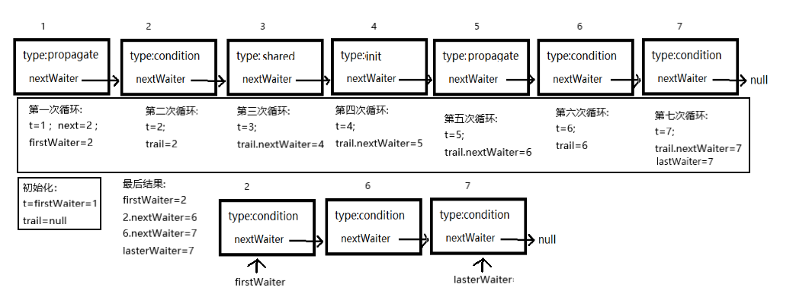

# ReentrantLock中Condition使用

ReentrantLock中Condition中具体实现方法都在AQS实现了，故在ReentrantLock中只是使用。

本篇就是借ReentrantLock中的Condition的使用来探究一下AQS中的Condition的实现原理。

Condition的await()，signal()和signalAll()有点类似于Object中的wait()，notify()和notifyAll()的使用，不同Condition实例可以把不同的任务放到不同的任务队列中，这样唤醒时只是唤醒对应队列中的任务，而object只有一个队列，所以唤醒任务时是所有任务都唤醒。相比之下，Condition的使用会更加的便捷。

## 具体的field

```java
        // 通过此两个变量来维持一个等待队列
		/**条件等待队列的第一个等待者*/
        private transient Node firstWaiter;
        /** 条件等待队列的最后一个等待者*/
        private transient Node lastWaiter;

		// 从等待中唤醒的线程的两种模式
        /**唤醒时，再执行一次中断操作 */
        private static final int REINTERRUPT =  1;
        /**唤醒时抛出中断异常InterruptedException*/
        private static final int THROW_IE    = -1;
```


## await函数具体做了什么？

下面的代码分析流程主要是根据await函数的一个调用过程进行的。

```java
public final void await() throws InterruptedException {
    		// 如果线程中断过，则抛出中断异常
            if (Thread.interrupted())
                throw new InterruptedException();
    		// 添加当前线程到等待队列中
            Node node = addConditionWaiter();
    		// 此处的fullRelease 是释放锁的操作,并保存之前锁的重入状态
            int savedState = fullyRelease(node);
            int interruptMode = 0;
    		// 如果不在同步队列上，则把当前线程阻塞
            while (!isOnSyncQueue(node)) {
                LockSupport.park(this);
                // 如果线程中断过，则跳出循环
                if ((interruptMode = checkInterruptWhileWaiting(node)) != 0)
                    break;
            }
    		// 中断过，并且不是要抛出异常
            if (acquireQueued(node, savedState) && interruptMode != THROW_IE)
                // 设置模式为再次执行一次中断
                interruptMode = REINTERRUPT;
            if (node.nextWaiter != null) // clean up if cancelled
                unlinkCancelledWaiters();
            if (interruptMode != 0)
                reportInterruptAfterWait(interruptMode);
        }
		// 向等待队列中添加新的等待节点
        private Node addConditionWaiter() {
            Node t = lastWaiter;
            if (t != null && t.waitStatus != Node.CONDITION) {
                // 如果lasterWaiter不为null并且等待条件不为CONDITION，则清除等待队列中不符合条件的节点
                unlinkCancelledWaiters();
                t = lastWaiter;
            }
            // 新创一个condition节点，并添加到condition等待队列中
            Node node = new Node(Thread.currentThread(), Node.CONDITION);
            if (t == null)
                firstWaiter = node;
            else
                t.nextWaiter = node;
            lastWaiter = node;
            return node;
        }
		// 把等待队列中的canceled节点去除
        private void unlinkCancelledWaiters() {
            Node t = firstWaiter;
            // trail是中间节点，相当于每次都设置好符合条件的node的nextWaiter值
            Node trail = null;
            while (t != null) {
                Node next = t.nextWaiter;
                if (t.waitStatus != Node.CONDITION) {
                    t.nextWaiter = null;
                    if (trail == null)
                        firstWaiter = next;
                    else
                        trail.nextWaiter = next;
                    if (next == null)
                        lastWaiter = trail;
                }
                else
                    trail = t;
                t = next;
            }
        }

    final int fullyRelease(Node node) {
        boolean failed = true;
        try {
            // 获取当前state的值
            int savedState = getState();
            if (release(savedState)) {// 如果state值为0，则返回savedState的值
                failed = false;
                return savedState;
            } else {
                throw new IllegalMonitorStateException();
            }
        } finally {
            if (failed)
                node.waitStatus = Node.CANCELLED;
        }
    }
	
    public final boolean release(int arg) {
        // 给state减arg值
        if (tryRelease(arg)) {
            // 如果state等于0，则获取头节点
            Node h = head;
            if (h != null && h.waitStatus != 0)
                // 如果头节点不为null，并且等待值不为0， 则唤醒同步队列中的一个值
                unparkSuccessor(h);
            return true;
        }
        return false;
    }
	// 把state变量的值减去releases
    protected final boolean tryRelease(int releases) {
        int c = getState() - releases;
        if (Thread.currentThread() != getExclusiveOwnerThread())
            throw new IllegalMonitorStateException();
        boolean free = false;
        if (c == 0) {
            free = true;
            setExclusiveOwnerThread(null);
        }
        setState(c);
        return free;
    }
	// 唤醒节点的操作
    private void unparkSuccessor(Node node) {
        int ws = node.waitStatus;
        // 如果head节点的状态小于0，则设置为0
        if (ws < 0)
            compareAndSetWaitStatus(node, ws, 0);
        // 获取head的下一个节点，进行唤醒
        Node s = node.next;
        // 如果下一个节点为null或者等待状态大于0， 则从尾部开始遍历获取一个不为null且状态小于0的节点
        if (s == null || s.waitStatus > 0) {
            s = null;
            for (Node t = tail; t != null && t != node; t = t.prev)
                if (t.waitStatus <= 0)
                    s = t;
        }
        // 唤醒找到的节点
        if (s != null)
            LockSupport.unpark(s.thread);
    }


    final boolean isOnSyncQueue(Node node) {
        // 如果node节点是condition，并且前节点为null，则当前节点不是在同步队列上
        if (node.waitStatus == Node.CONDITION || node.prev == null)
            return false;
        // 如果node的下一个节点不为null，则是在同步队列上
        if (node.next != null) // If has successor, it must be on queue
            return true;
		// 从同步队列尾部开始遍历，查看node节点是否在同步队列上
        return findNodeFromTail(node);
    }
	// 从同步队列的尾节点开始遍历，看看当前node节点是否在同步队列上.
    private boolean findNodeFromTail(Node node) {
        Node t = tail;
        for (;;) {
            if (t == node)
                return true;
            if (t == null)
                return false;
            t = t.prev;
        }
    }

    private int checkInterruptWhileWaiting(Node node) {
        // 如果线程中断过，并且设置线程node等待值为0，返回THROW_IE
        // 如果线程中断过，并且设置线程node等待值为0失败，返回REINTERRUPT
        // 如果线程没有中断过，返回0
        return Thread.interrupted() ?
            (transferAfterCancelledWait(node) ? THROW_IE : REINTERRUPT) :
        0;
    }

    final boolean transferAfterCancelledWait(Node node) {
        if (compareAndSetWaitStatus(node, Node.CONDITION, 0)) {
            // 把node节点状态设置为0，设置成功则把node节点添加到同步队列中，并返回true
            enq(node);
            return true;
        }
        // 如果node节点没有在同步队列上，则暂停线程， 并返回false
        while (!isOnSyncQueue(node))
            Thread.yield();
        return false;
    }
	// 死循环获取锁，并返回是否中断标志
    final boolean acquireQueued(final Node node, int arg) {
        boolean failed = true;
        try {
            boolean interrupted = false;
            for (;;) {
                final Node p = node.predecessor();
                if (p == head && tryAcquire(arg)) {
                    setHead(node);
                    p.next = null; // help GC
                    failed = false;
                    return interrupted;
                }
                if (shouldParkAfterFailedAcquire(p, node) &&
                    parkAndCheckInterrupt())
                    interrupted = true;
            }
        } finally {
            if (failed)
                cancelAcquire(node);
        }
    }
	// 唤醒后报告中断状态
    private void reportInterruptAfterWait(int interruptMode)
        throws InterruptedException {
        // 如果模式是抛出异常，则抛出中断异常
        if (interruptMode == THROW_IE)
            throw new InterruptedException();
        // 如果是执行中断， 则执行一次中断操作
        else if (interruptMode == REINTERRUPT)
            selfInterrupt();
    }
```




## singal函数具体做了什么？

```java
    public final void signal() {
        // 如果当前线程没有持有锁，抛出异常
        if (!isHeldExclusively())
            throw new IllegalMonitorStateException();
        // 获取都一个等待的node，如果node不为null，则唤醒它
        Node first = firstWaiter;
        if (first != null)
            doSignal(first);
    }

    private void doSignal(Node first) {
        // 循环唤醒等待队列中的一个线程
        do {
            if ( (firstWaiter = first.nextWaiter) == null)
                lastWaiter = null;
            first.nextWaiter = null;
        } while (!transferForSignal(first) &&
                 (first = firstWaiter) != null);
    }
    final boolean transferForSignal(Node node) {
		// 如果不能把node的状态从condition修改为0，则返回false
        if (!compareAndSetWaitStatus(node, Node.CONDITION, 0))
            return false;

	   // node状态修改为0成功后，添加到同步队列
        Node p = enq(node);
        int ws = p.waitStatus;
        // 如果同步队列中node的前节点等待状态大于0 或者 把前一个状态修改为singal失败
        if (ws > 0 || !compareAndSetWaitStatus(p, ws, Node.SIGNAL))
            // 那么唤醒node节点的线程
            LockSupport.unpark(node.thread);
        return true;
    }
```


## singalAll函数具体做了什么?

```java
        public final void signalAll() {
            // 如果当前线程没有持有锁，抛出异常
            if (!isHeldExclusively())
                throw new IllegalMonitorStateException();
            Node first = firstWaiter;
            // 如果等待队列不为null，则唤醒等待队列中的所有线程
            if (first != null)
                doSignalAll(first);
        }

        private void doSignalAll(Node first) {
            lastWaiter = firstWaiter = null;
            // 循环唤醒等待队列中的所有线程
            do {
                Node next = first.nextWaiter;
                first.nextWaiter = null;
                transferForSignal(first);
                first = next;
            } while (first != null);
        }
```

