# G1垃圾收集器

## 概述

看一个回收机制大概图:

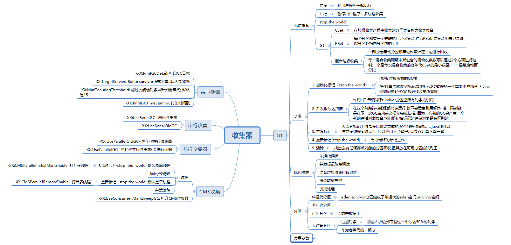

G1将堆拆分成一系列的分区，这样再一个时间段内，大部分的垃圾收集器操作就只是再一个分区内执行，而不是整个堆或整个代。

再G1里，年轻代就是一系列的内存分区，这意味者不用再要求年轻代是一个连续的内存块。类似的，老年代也是一些列分区组成，这样JVM运行时也就不需要思考哪些分区时老年代，哪些时年轻代。

事实上，G1通常的运行状态是映射G1分区的虚拟内存随着时间的推移在不同的年代之间前后切换。一个G1分区最初被指定为年轻代，经过一次年轻代的回收后，整个年轻代分区被划入未被使用的分区中，也它也就是可以被使用在别的地方了。

***可用分区***：用来定义那些未被使用且可以被G1使用的分区。一个可用分区可被用于或指定为年轻代或老年代分区。

G1的年轻代收集方式是并行stop the world，一旦发生年轻代垃圾收集，整个年轻代都会被回收。

G1的老年代收集器有极大不同，老年代的收集不会为了释放老年代的空间就要求堆整个老年代做回收，相反，在任一时刻只有一部分老年嗲会被回收，并且这部分老年代将与一次年轻代收集一起收集，此称之为***混合收集***。老年代收集在其占用堆容量超过阈值时，G1就会启动一次老年代收集。要组注意一点，*那就是G1中的堆占用值时根据老年代占用空间与整个java堆空间比较得出的。*

### 垃圾收集时机

#### 年轻代

当JVM从eden分区中分配失败，也就是说eden分区已经被完全占满，这时会触发一次年轻代收集，垃圾收集器就开始释放空间。年轻代收集首先会把所有存活对象从eden分区转移到survivor分区中，也会有一些对象晋升到老年代。

**TLAB**: 此区域就在年轻代中。因为独享的Java线程可以使用无锁的方式进行空间分配，所以TLAB的分配速度会更快一些。

#### 老年代

当老年代空间占据整个Java堆空间超过阈值时，就会进行收集。对象晋升到survivor分区或老年嗲分区的过程是在GC线程的晋升本地分配缓冲器(promotion local allocation buffer,PLAB)中进行的。 无论是survivor分区还是老年代分区，每个GC线程都有一个PLAB。

## 垃圾收集各个阶段

### 初始标记(stop the world)

初始标记阶段的目的时收集所有的GC根。根是对象图的起点。为了从应用线程中收集根引用，必须先暂停这个应用线程，所以初始标记阶段是stop the world方式的。在G1里，完场初始标记是年轻代GC暂停的一个组成部分，因为无论如何年轻代GC都必须收集所有根。

### 并发标记阶段

#### 并发根分区扫描

并发根分区扫面就是扫面个跟踪survivor分区里所有对象的引用。此阶段，所有java线程允许运行，所以不会发生暂停。 唯一的限制就是下一次GC启动前必须先完成扫面。这样做的原因是一次新的GC会产生一个新的存活集合，它们根初始标记的存活对象是有区别的。

#### 并发标记

大部分标记工作是在并发标记阶段完成的。多个线程协同标示存活对象图，所有java线程都可以与并发线程同时运行，所以应用就不存在暂停，尽管会受到吞吐量下降的影响。

### 重新标记(stop the world)

以stop the world方式来最终完成所有的工作。

### 清除

在这个阶段，找出的那些内有任何存活对象的分区将被回收。因为没有任何存活对象，这个写分区也不会被包含在年轻代或混合GC中，他们会被添加到可用分区的队列里。

**转移失败**：有时，G1试图从一个年轻代分区中拷贝存活对象或从一个老年代分区中转移存活对象，无法找到可用的空闲分区。这种失败在GC日志里被记录为to-space-exhausted，该错误的持续时间会在日志中显示为Exacuation Failure时间。还有*一种情况*就是：分配巨型对象时在老年代中无法找到足够的连续分区。  在这个时候，G1垃圾收集器会尝试增加它的Java堆的使用量。如果Java堆空间的扩展不成功，G1就会触发安全措施机制，同时求助与串行（单线程）full收集。

在full收集过程中，一个单线程会对整个对各个代的所有分区（不论是开销是否昂贵）做标记，清除以及压缩操作。收集结束之后，现在的对就纯粹包含存活对象，同时所有的代都被完全压缩过了。

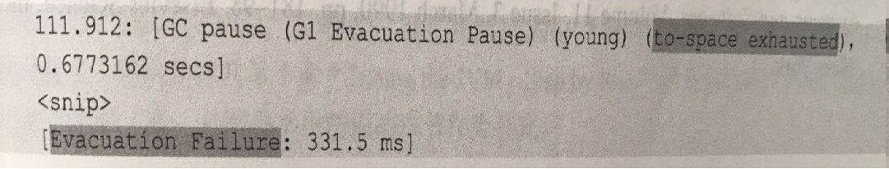

## 堆空间调整

增加java堆空间的情况：

* 在一次full GC中，基于堆尺寸的计算结果会调整堆的空间。
* 当发生年轻代收集或混合收集，G1会计算执行GC所花费的时间以及java应用所花费的时间。根据-XX:GCTimeRatio，如果太多的时间花费在垃圾收集上，Java堆尺寸就会增加。这个情况下增加Java堆尺寸，其背后的想法就是允许GC减少发生频率。G1中：-XX:GCTimeRatio默认是9。
* 如果一个对象分配失败了(甚至做了一次GC之后)，G1会尝试通过增加堆尺寸来满足对象分配，而不是马上退回去做一次full GC。
* 如果一个巨型对象分配无法找到足够的连续分配分区来容纳这个对象，G1会尝试扩展Java堆来获取更多可用空间，而不是做一次full GC。
* 当GC需要一个新的分区来转移对象时，G1更倾向于通过增加Java堆空间来获得一个新的分区，而不是通过返回GC失败并开始做一次full GC来找到一个可用分区。


## 日志分析及优化
### 日志分析

下面分析一段GC日志，启动参数如下：

```shell
JAVA_OPTS="-XX:+UseG1GC -XX:+PrintGCDetails -Xloggc:jdk8u45_h2.log"
-XX:+UseG1GC  : 使用G1收集器
-XX:+PrintGCDetails : 打印日志
-Xloggc:jdk8u45_h2.log : 日志存放文件
```

日志片段:

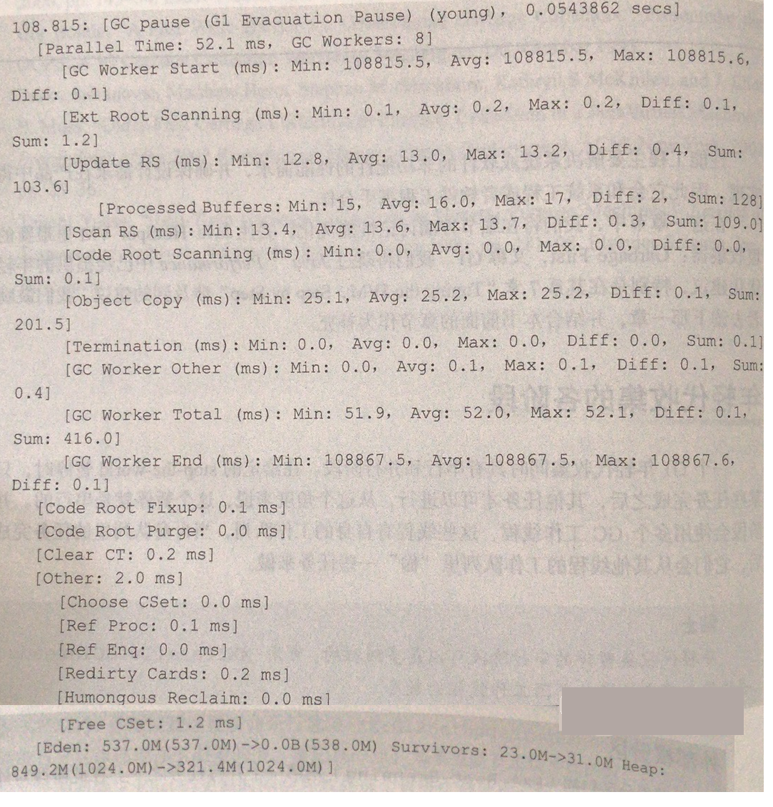

#### 标识是什么收集

在日志的第一行可以看出来这是年轻代收集(G1 Evacuation Pause)和(young).

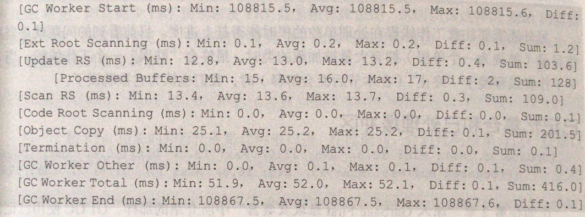

#### 所有活动开始

第二行显示了并行阶段所花费的总时间和GC总做线程数:

```shell
[Parallel Time:52.1 ms, GC workers:8]
```

下面几行展示了主要的并行工作,由8个工作线程同时执行:


GC worker start和GC worker end时为每个并行阶段打上开始和结束时间戳的标签。GC Worker start的Min时间戳时第一个工作线程开始工作的时间节点，类似的GC Worker end的Max时间戳为最后的工作线程结束它所有任务的时间节点。还包括以毫秒为单位的Avg和Diff值。

* Diff理想值是0，离0有多远
* Max，Min或者Avg是否存在一些重大偏差，者表明工作线程无法在同一时间开始或结束它们的并行工作。这意味着某些队列处理存在问题，需要在并行阶段进一步观察并行工作，做进一步分析。

#### 外部根分区

```shell
[Ext Root Scanning (ms):Min: 0.1, Avg:0.2, Max:0.2, Diff:0.1, Sum:1.2]
```

外部根分区扫描(Ext Root Scanning)是第一个并行任务之一。 在此阶段对外部的(堆外)根进行扫描，如JVM的系统目录，VM数据结构，JNI线程句柄，硬件寄存器，全局变量和线程堆栈根，通过扫描来发现有没有进入到当前暂停收集集合(CSet)。

#### 已记忆集合和已处理缓冲区

```shell
[Update RS (ms):Min:12.8, Avg:13.0, Max:13.2, Diff:0.4, Sum:103.6]
[Processed Buffers:Min:15, Avg:16, Max:17, Diff:2, Sum:128]
```

负责对脏卡片的分区进行扫描更新日志缓冲区和更新RSet。作为并发优化线程所开展工作的补充，所有被优化线程记录但是还没有被处理的剩余缓冲区，都会在收集暂停的并行阶段被工作线程处理。 这些缓冲区也就是在日志片段中所说的已处理缓冲区(Processed Buffers)。-XX:MaxGCPauseMilles可以设置一个目标时间作为暂停时间目标，默认是10%，也就是将暂停时间的10%用在更新RSet上。-XX:G1RSetUpdatingPauseTimePercent来更改百分比。

如果更新日志缓冲区的数目不改变，在收集暂停时间减少RSet的更新时间会导致在这个暂停中被处理的缓冲区减少。这将会把日志缓冲区更新工作推到并发优化线程上，于是增加并发工作以及与Java应用线程共享资源。最糟糕的情况下，并发线程跟不上日志缓冲区的更新速度，java应用线程必须介入协助处理---最好避免此情景。

RSet扫面:

```shell
[Scan RS(ms):Min:13.4, Avg:13.6, Max:13.7, Diff:0.3, Sum:109]
```

和RSet相关的代码根扫描,在此期间,会对代码根集合进行扫描以查找当前CSet的对内引用:

```shell
[Code Root Scanning(ms):Min:0.0, Avg:0.0, Max:0.0, Diff:0.0543862, Sum:0.1]
```


##### 已记忆集合总结

选项-XX:+G1SummariesRSetState 可以用来为RSet粗化总数提供一个窗口，来帮助确定并发优化线程是否能够处理更新缓冲区以及是否能收集更多信息。这个选项每经历n个GC暂停就总结一次RSet统计数据，其中n有选项-XX:G1SummarizeRSetStatesPeriod=n进行设置。

**注意**：-XX:G1SummarizeRSetStatesPeriod是一个诊断选项，必须添加-XX:UnlockDiagnosticVMOptions到命令行来激活。

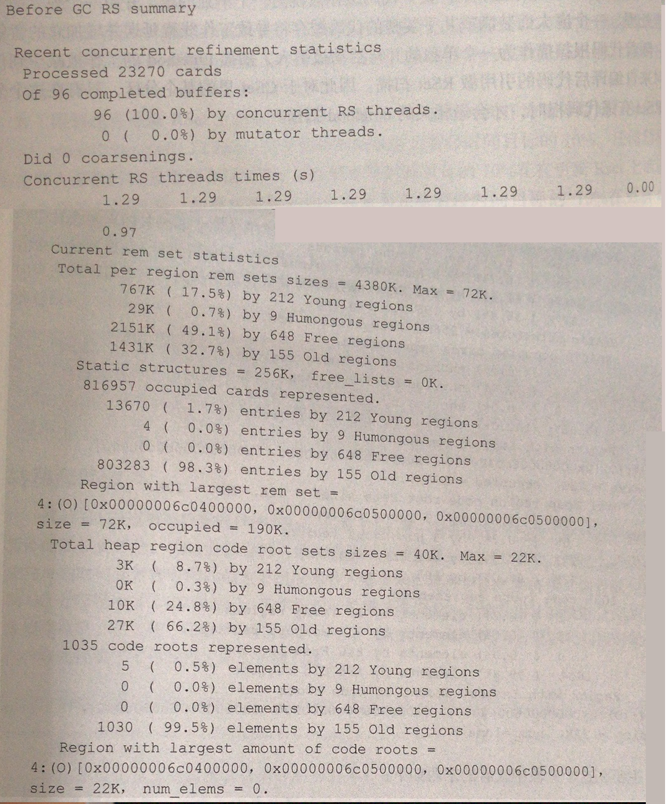

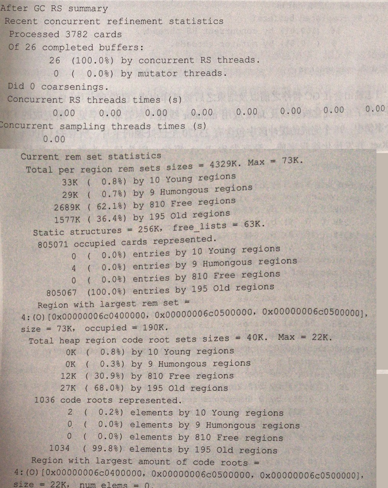

主要就看这个地方:

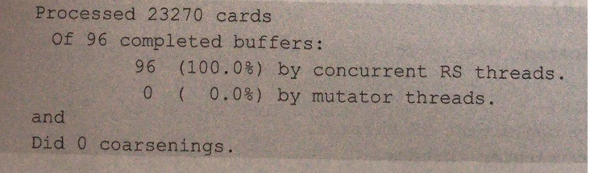

已处理卡片(Processed cards)标签总结了并发优化线程以及Java应用mutator线程所完成的工作。在这个案例中，96个完成的缓冲区中包含有23270个卡片，所有的工作都由RSet并发优化线程完成。没有发生Rset粗化，因为做了0粗化（Did 0 coarsenings）。

日志输出其他部分描述了RSet时间和目前RSet统计信息，包括他们的大小以及在每个分区类型（年轻代分区，空闲分区，巨型分区或者老年代分区）中使用卡片的情况。

对潜在提升性能的4个领域(RSet粗化，更新RSet，扫描RSet，扫面nmethod引用的RSet)的可视化，将有效的理解你的应用程序。

#### 转移和回收

理论上说，对象拷贝的时间是暂停时间的最主要组成部分。需要被转移的存活对象将拷贝到目标分区中的GC分配缓冲区。

```shell
[Object Copy(ms):Min:25.1, Avg:25.2, Max:25.2, Diff:0.1, Sum:201.5]
```


#### 终止

在完成刚才所描述的任务后，如果工作线程的工作队列已经清空，则工作线程会要求终止。一个线程的要求终止会检查其他线程的工作队列并尝试窃取，如果没有工作可做，则线程终止。终止也标记了每个工作线程在此终止协议所花费的时间。一个卷入单独根扫描的GC工作线程会来不及完成队列中的所有任务，并最终因此晚于终止。

```shell
[Termination(ms):Min:0.0, Avg:0.0, Max:0.0, Diff:0.0, Sum:0.1]
```

#### GC外部的并行活动

终止标志着转移/收集暂停工作线程并行活动的结束。在日志片段下一行，即标记为GC Worker Other，它是花费在并行阶段的时间，但不是任何到目前为止所描述的通常的活动。虽然归于GC时间，但它很容易被放生在GC外的事占用。

```shell
[GC Worker Other(ms):Min:0.0, Avg:0.1, Max:0.1, Diff:0.1, Sum:0.4]
```

#### 所有并行活动总结

是通常的和不寻常的GC工作线程的总时长。

```shell
[GC Worker Total(ms):Min:51.9, Avg:52.0, Max:52.1, Diff:0.1, Sum:416.0]
```

#### 所有串行活动的启动

并行阶段结束后，串行阶段就开始了，即那些标有Code Root Fixup，Code Root Purge和Clear CT的行。在这些时间里，主GC线程根据转移对象的新位置更新代码根。

```shell
[Code Root Fixup:0.1ms]
[Code Root Purge: 0.0 ms]
[Clear CT:0.2 ms]
```

#### 其他串行活动

标记为Other部分。包括：为收集选择CSet，引用处理和排队，卡片重新脏化，回收空间巨型分区，以及在收集完成后史释放CSet。

```shell
[Other :2.0ms]
	[Choose CSet: 0.0 ms]
	[Ref Proc: 0.1 ms]
	[Ref Enq:0.0 ms]
	[Redirty Cards: 0.2 ms]
	[Humongous Reclaim:0.0 ms]
	[Free CSet: 1.2 ms]
```


### 年轻代调优

理解这个默认值对回收算法产生的效果:

```shell
-XX:MaxGCPauseMills: 最大暂停时间，默认200ms
-XX:G1NewSizePercent:初始化年轻代占用百分比，默认5%
-XX:G1MaxNewSizePercent:最大年轻代占用百分比，默认60%
-XX:+PrintAdaptiveSizePolicy:打印自适应策略日志
```

如果对工作负荷有很好的了解，同时能够预见到避免自适应调整尺寸所带来的收益(例如：如果你看到预估时间和实际时间有极大差异)，你可以调整默认值，副作用就是放弃自适应调整。

看一个调整实例：

调整前：

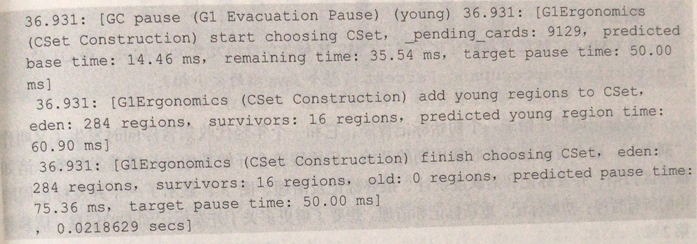

从时间戳36.931，最后一条看到，预测时间是75.36，目标时间是50ms，实际时间是21.8629。

把分区调大后看一下：

调整后：

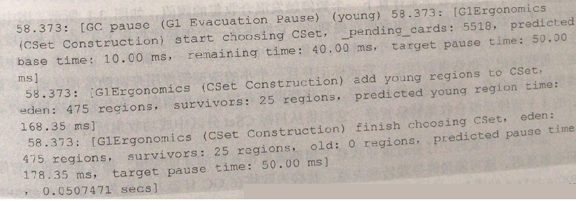

现在看到预测时间是178.35ms，目标时间是50ms，实际时间是50.74毫秒。调整后暂停时间和目标时间差不多。

### 并发标记阶段调优

* 将标识阈值设置为适合应用程序静态短暂存活数据需要的值。如果设置的值过大，将面临转移失败的风险。如果设置的值过低，则会过早的引发并发周期，并有很大可能收不到空间。
* 如果认为设置的阈值时正确的，但并发周期仍然花费太长时间，你的混合收集回收分区以“losing the race" 告终， 并触发转移失败。可以尝试增加并发线程数。-XX:ConcGCThreads 默认是-XX:ParallelGCThreads的四分之一，可以直接增加并发线程数，或者直接增加并行GC线程数。

### 混合垃圾收集阶段

#### 混合收集回顾

看一段混合回收日志：

启动参数如下:

```shell
JAVA_OPTS="-XX:+UseG1GC -XX:+PrintGCDetails -XX:+PrintAdaptiveSizePolicy -Xloggc:jdk8u45.log"
```

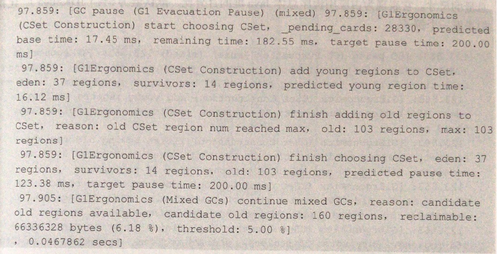

第一行告诉我们这是混合收集，同时还描述了CSet的选择，添加年轻代分区和老年代分区到CSet中这些活动的预测时间。

第五个时间戳标记为Mixed GCs的时间戳，你可以看到G1决定继续执行混合收集，因为依然还有可用的候选分区以及可回收的字节仍高于5%的默认值。

#### 混合收集调优

* 调整-XX:G1HeapWastePercent参数，设置可以容忍的垃圾总量尺寸。
* -XX:G1MixedGCCountTarget 设置每个混合收集暂停的CSet中包含了老年代分区数量的最小值

### 避免转移失败

* 堆尺寸大小。确保在Java堆中可以容纳所有的静态短暂数据以及短生命周期和中等生命周期的应用数据。还需要保留一些余量，可用余量越多，就越是能提高吞吐量，降低延迟
* 避免过度调整JVM默认参数
* 有时候转移失败是survivor分区没有足够空间容纳新晋升对象。可以试着增加-XX:G1ReservePercent。

### 引用处理

```shell
[Other :2.0ms]
	[Choose CSet: 0.0 ms]
	[Ref Proc: 0.1 ms]
	[Ref Enq:0.0 ms]
	[Redirty Cards: 0.2 ms]
	[Humongous Reclaim:0.0 ms]
	[Free CSet: 1.2 ms]
```

Ref Proc是处理引用对象所花的时间，Ref Enq是引用对象排队时所花费的时间。一般花在Ref Enq上的时间很少和Ref Proc一样。使用 -XX:+PrintReferenceGC来打印处理引用的日志;

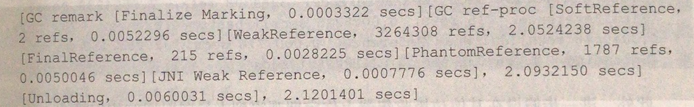

#### 引用处理调优

* -XX:+ParalleRefProcEnable: 激活多线程的引用处理.
* -XX:SoftRefLRUPolicyMSPerMB=1000; 此是默认值. 此参数意味着最后一次访问时间超过 1000*Java堆可用空间(兆字节为单位),那么软引用将被清除并可以被回收。如：XX:SoftRefLRUPolicyMSPerMB=1000，可用空间为1G。任何软引用在过去1024 * 1000=1024000ms，即1024s，即17分钟内没有访问过，那么就可以被JVM清除和回收。


## 调整参数

```shell
-XX:PrintGCDetails: 打印日志
-XX:+UseG1GC  : 使用G1回收器
-XX:ConcGCThreads : 并发执行GC的线程数
-XX:G1HeapRegionSize: 设置G1每个Region的大小
-xx:G1HeapWastePercent : G1不会回收的内存大小,默认是5%
-XX:G1MixedGCCountTarget :设置并行循环之后需要有多少个混合GC启动,默认是8
-XX:+G1PrintRegionLivenessInfo: 诊断参数. 开启了,VM会打印堆内存里每个Region的存活对象信息.该信息包含了对象的具体使用,可记忆化集合大小,以及很有价值的GC效率统计值.
-XX:G1ReservePercent: 此值是G1为了保留一些空间用于年代之间的提升,默认是10%
-XX:+G1SummarizeRSetStates:诊断参数,开启了,会在虚拟机退出时打印可记忆化集合的详细统计信息
-XX:G1SummarizeRSetStatePeriod:诊断选项.只能和G1SummarizeRSetStates一起使用.虚拟机将打印每n次GC后可记忆化集合的详细统计信息.
-xx:+G1TraceConcRefinement:诊断参数.启动该参数启动后,多线的并发执行优化的具体信息会被输出到日志信息中
-XX:+G1UseAdaptiveConcRefinement:该参数每次GC之后动态重新计算
-XX:GCTimeRatio: 这个参数设置花在Java应用程序上和花在GC线程上的时间比率
-XX:+HeapDumpBeforeFullGC:这个参数让虚拟机在每次全GC之前创建hprof文件
-XX:+HeapDumpAfterFullGC: 这个参数让虚拟机在每次全GC之后创建hprof文件,文件位于虚拟机启动目录中
-XX:InitiatingHeapOccupancyPercent:这个理解为老年代空间占用的空间,GC收集后要低于此值.这个参数主要是为了决定什么时间启动老年代的并行回收循环.
-XX:+UseStringDeduplication: 告诉虚拟机其哟个字符串去重功能
-XX:StringDeduplicationAgeThreshold: 设定字符串被考虑去重所需要满足的生存时间,生存时间指对象存活多少垃圾回收
-XX:+PrintStringDeduplicationStatistics: 启动打印字符串去重功能的统计信息
-XX:MaxGCPauseMills: 设置G1允许的最大暂停时间目标
-XX:MinHeapFreeRatio: 设定堆中允许空闲最小比例
-XX:MaxHeapFreeRatio: 设定堆中允许空闲的空闲最大比例,默认是70%
-XX:+PrintAdaptiveSizePolicy:启动堆大小变化日志输出
-XX:+ResizePLAB: 设定是否需要动态调整线程局部提升缓存还是使用固定大小
-XX:+ResizeTLAB:动态调整线程局部分配缓存
-XX:+ClassUnloadingWithConcurrentMark:在G1老年代的并发循环回收中启动对象下载功能
-XX:+ClassUnloading:卸载对象开关,默认启动卸载功能
-XX:+UnlockDiagnosticVMOptions:该参数设定是否允许使用诊断类参数.


```


