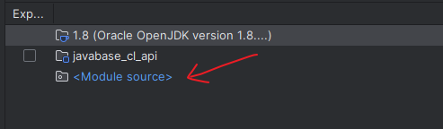

---
tags:
  - JVM
  - class_load
---
一般情况下, 当我们要对使用的框架进行一些增强或修改,  会采用一下集中方式:
1. 继承要修改的类,  覆写父类方法
2. 使用`装饰器`模式,  针对要修改的类方法, 进行修改
3. 创建一个 同package name, 同 classname 的类在当前项目, 此时jvm会记载我们创建的相同类, 以此方式达到修改的目的.  

> 针对第三种方法的生效, 为什么是加载我们编写的类,  而不是框架中的类?

这其实是跟jvm的class记载顺序有关,  此处关于双亲委托就不多说了.  针对此情况其实跟classpath中的jar顺序有关, 当把我们的业务包放到框架的jar包前面, 那么就会先加载自己编写的类, 如果顺序相反, 那么就会有问题了.

具体参考此example:
[classLoader](https://gitee.com/empwang/JavaBase/tree/master/javabase_cl/src/main/java/com/wk/demo)

 当 `Module source` 在依赖下面, 那么就是使用的框架中的实现,  当`Module source`在上面, 那么就会使用自己编写的实现.
 

