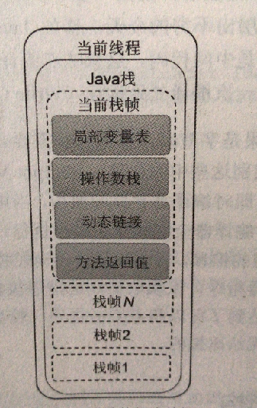

# HotSpot栈帧组成

## 栈帧

在JVM虚拟机规范中，Java栈也可以被称为Java虚拟机栈，它同PC一样都是线程私有的，并且声明周期与线程的声明周期保持一致。Java栈主要用于存储栈帧，而栈帧中则负责存储局部变量表，操作数栈，动态链接，方法返回值等信息。

简单来说，栈帧时一种用于支持JVM调用/执行程序方法的数据结构，它是方法的执行环境，每一个方法被调用时都会创建一个独立的栈帧以便维系所需的各种数据信息，栈帧伴随着方法的调用而创建，伴随着方法的执行结束而销毁，那么每一个方法从调用到执行结束的过程，就对应着Java栈中一个栈帧从入栈到出栈的过程，并且无论方法的调用状态是否正常都算作方法结束。并且不同线程所包含的栈帧是不允许存在互相引用的。

在栈帧中，局部变量表和操作数栈所需的容量大小在编译时期就可以完全被确定下来，并保存在方法的Code属性中，也就是说，栈帧究竟需要分配多大的内存空间完全取决于具体的JVM实现和方法调用时分配的实际内存。在一条活动的线程中，只有当前正在执行的方法的栈帧(栈顶栈帧)是有效的，这个栈帧也被称之位当前栈帧，于当前栈帧对应的就是当前方法，定义这个方法的就是当前类。



既然一个线程中只有一个当前正在执行的方法的栈帧才是当前栈帧，那么如果当前方法在执行过程中调用了另外一个新的方法呢，栈帧会发生变化吗？

会有一个新方法的的新栈帧作为当前栈帧被创建，不过当新方法完成并返回后，其对应的栈帧随之被丢弃，前一个栈帧又重新变为当前栈帧。

### 局部变量表

局部变量也可以称为本地变量表，它包含在一个独立的栈帧中，用于存储方法参数和定义在方法体内的局部变量，这些数据类型包括原始数据类型，对象引用以及returnAddress类型。局部变量表所需的大小在编译器就可以完全确定下来，并保存在方法的Code属性中。原始数据类型的成员变量不只是作用域发生了变化，更重要的是，其值也并非还是存储在局部变量表里，而是存储在对象内存空间的实例数据中，整体来看既存储在Java堆区内。也就是于线程上下文有关的数据存储在Java栈，反之存储在堆中。

局部变量表可以看作是专门存储局部变量数据的一种类似线性表的数据结构，参考Java虚拟机规范，局部变量表中最小的存储单元是slot，一个slot可以存储一个类型为boolean，byte，short，float，reference以及returnAddress小于等于32bit的值，2个slot可以存储一个类型为long或double的64bit值。JVM会为每一个slot都分配一个访问索引，通过这个索引即可成功访问到局部变量表中指定的局部变量值，访问索引从0开始到小于局部变量表达最大长度。

注意，long和double虽然是占据2个slot，但是访问时著需要一个索引就可，也就是取值时，只需根据索引n便可以成功取出n和n+1的值。

JVM使用局部变量表来完成方法调用时的参数传递，当一个实例方法被调用的时候，它的方法参数和方法体内部定义的局部变量将会按照顺序复制到局部变量表中的每一个slot上。索引为0的slot一定是存储的是与被调实例方法相对应的对象引用(通过this访问)，后续的其他方法参数和方法体内定义的成员变量则会按照顺序从局部变量表中索引为1的slot位置开始赋值。

### 操作数栈

每一个独立栈帧中除了包含局部变量表以外，还包含一个后进先出的操作数栈，也称为表达式栈。操作数栈所需的大小在编译器就可以被完全确定下来，并保存在方法的Code属性中。简单说，操作数栈就是JVM执行引擎的一个工作区，当一个方法被调用的时候，一个新的栈帧也会随之被创建出来，但这个时候栈帧中的操作数却是空的，只有方法在执行的过程中，才会又各种各样的字节码指令往操作数栈中执行入栈和出栈操作。如:

```java
public void testAddOperation():
	Code:
0: bipush	15  # 把数值15从byte转换为int类型后压入操作数栈顶中
2: istore_1		# 负责将栈顶元素出栈并保存在局部变量中slot为1上
3: bipush	8	# 将数值8转换为int类型后压入栈顶
5: istore_2		# 把栈顶元素出栈并保存在局部变量表索引为2的slot上
6: iload_1		# 将索引为1的slot值压入栈
7: iload_2		# 将索引为2的slot值压入栈
8: iadd			# 将这2个数值相加
9: istore_3		# 将运算结果出栈并保存在局部变量表索引为3的slot上
10: return		# 方法执行完后的返回操作
```

### 动态链接

每一个栈帧内部除了包含局部变量表和操作数栈外，还包含一个指向运行时常量池中该栈帧所属方法的引用，包含了这个引用的目的就是为了支持当前方法的代码能够实现动态链接。一个有效的字节码文件除了包含类的版本信息，字段，方法以及接口等描述信息完，还包含一项信息，就是**常量池表**(Constant Pool Table)，那么**运行时常量池**就是字节码文件中常量池表的运行表示形式。在一个字节码文件中，描述一个方法调用了另外其他方法时，就是通过**常量池中指向方法的符号引用**(Symbolic Reference)来表示的，那么动态链接的作用就是为了将这些符号引用转换为调用方法的直接引用。

当一个字节码文件被装载进JVM内部时，如果被调用的目标方法在编译期可知，且运行期保持不变时，那么在这种情况下将调用的符号引用转换为直接引用的过程称为**静态链接**。相反如果被调用的方法在编译器无法被确定下来，只能在程序运行期将调用方法的符号引用转换为直接引用，称为**动态链接**。

在Java中一种由两种绑定，分别是**早期绑定和晚期绑定**。**早期绑定**就是被调用的目标方法如果在编译期可知，且运行期不变，即可将这个方法与所属的类型进行绑定，也就可以使用静态链接的方式将符号引用转换为直接引用。如果在编译期无法确定，只能够在运行期根据实际的类型绑定相关的方法，这种绑定称为晚期绑定。

### 方法返回值

 返回在执行过程中会产生两种调用结果，一种是方法**正常调用完成**，另一中是**方法异常调用完成**。

方法正常调用完成，意味着被调用方法在执行过程中将不会由任何的异常被抛出，并且方法在执行的过程中一旦遇见字节码返回指令时，就将返回值返回给调用者。字节码指令中，返回指令包含ireturn（返回值时boolean，byte，char，short和int），lreturn，freturn，dreturn以及areturn，另外一个时return提供声明为void的方，实例初始化方法，类和机构的初始化方法使用。

方法异常调用意味着当前方法在执行过程中可能会因为某些错误的指令导致JVM抛出了异常，并且这些异常在当前方法中没有方法方法进行处理，或方法在执行过程中遇见了athrow指令显示抛出异常，并且在当前方法内部没有捕获这个异常。总之如果一个方法在执行过程中抛出了异常，那么这个方法在调用完成后将不会再有任何的返回值返回给调用者。

无论方法是正常还是异常，在方法执行完成之后都需要返回到之前被调用的位置上，那么这个时候当前栈帧就承担着恢复调用者状态的责任。当方法调用完成后，当前栈帧随之被丢弃，前一个栈帧又重新变为了当前栈帧，而被调用的方法如果又返回值的话，其返回值将会被压入当前栈帧的操作数栈中，并更新PC寄存器中下一条需要执行的字节码指令。