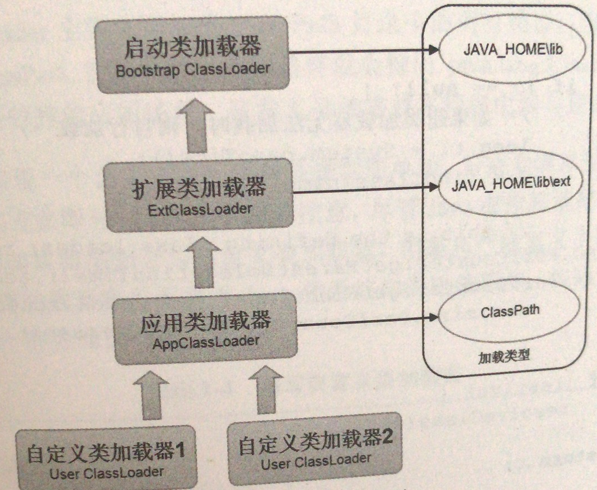
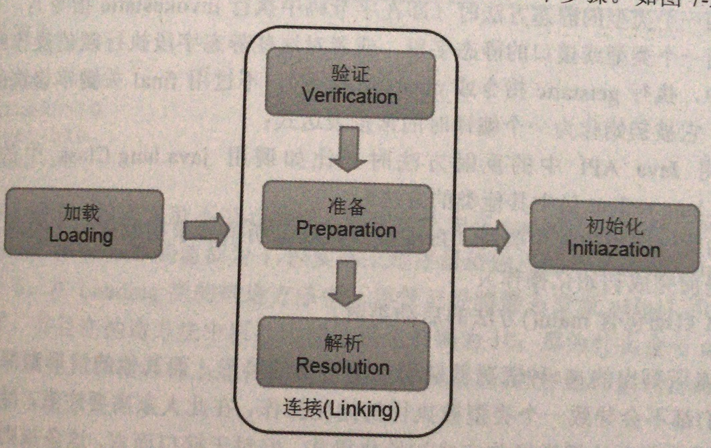

# 类加载过程解析

任何一个类型在使用之前都必须经历过完整的加载，连接和初始化这个3个加载步骤。一旦一个类成功经历过这3个步骤之后，它就可以随时随地被使用了，开发人员可以在程序中访问和调用它的静态成员信息，或者使用new关键字为其创建对象实例。当然从一个类型进JVM中开始算起，直至被卸载出内存为止，它的整个生命周期也就随之而结束了。

## JVM默认类加载器

* Bootstrap ClassLoader
* ExtClassLoader
* AppClassLoader

Bootstrap ClassLoader也称之为启动类加载器，它由C++语言编写并嵌套在JVM内部，主要负责加载JAVA_HOME/lib 目录中的所有类型，或者由选项 -Xbootclasspath 指定路径中的所有类型。ExtClassLoader和AppClassLoader派生于ClassLoader，并且都是采用Java语言编写的。ExtClassLoader主要负责加载 JAVA_HOME/lib/ext 扩展目录中所有类型，AppCLassLoader则主要负责加载ClassPath目录中所有类型。

### 双亲委派模型

JVM虚拟机通过一种称为双亲委派模型来约定类加载器的加载过程，按照双亲委派模型的规则，除了启动类加载器之外，程序中每一个类加载器都拥有也给超类加载器，比如 AppClaaLoader的超类是ExtClassLoader，而开发人员自己编写的自定义类加载器就是AppClassLoader。那么当一个类加载器接收到一个类加载的任务时，它并不会立即展开加载，而是委派给超类去执行，每一层的类加载都是如此，直至委派给最顶层启动类加载器为止。如果超类无法加载委派给它的类时，便会将类的加载任务返回给它的下一级类加载器去完成。

使用双亲委派模型的优点就是能够有效地确保一个类的全局唯一性。

看一下大概流程：

## 类加载过程

类加载器的主要任务就是根据一个类的权限定名来读取此类的二进制字节流到JVM内部,然后转换为一个与目标类对应的java.lang.Class对象实例。类加载所执行的加载操作只是属于JVM中类加载的一个阶段，一个完成的类加载过程必须经历加载，连接和初始化这3个步骤。

类加载器的主要任务就是根据一个类的全限定名来读取此类

那今天来说一下JVM类加载的一个过程是怎样的.

类加载过程分为:

1. 加载字节码
2. 验证阶段
3. 准备阶段
4. 解析阶段
5. 初始化阶段

**类加载阶段**就是由类加载器负责根据一个类的全限定名类读取此类的二进制字节流到JVM内部，并存储在运行时内存区中的方法区，然后将其转换成一个与目标类型对应的java.lang.Class对象实例(Java虚拟机规范并没有明确要求一定要存储在Java堆区中，因此HotSpot选择将Class对象存储在方法区内)，这个Class对象在日后就会作为方法区中该类的各种数据的访问入口。**链接阶段**要做的使用就是将已经加载到JVM中的二进制流的类数据信息合并到JVM的运行时状态中，然而**链接阶段由验证，准备和解析3个阶段构成**。**验证阶段**主要任务就是验证类数据信息是否符合JVM规范，是否是一个有效的字节码文件，而验证的内容则涵盖了类数据信息的格式验证，语义分析，操作验证等；**准备阶段**的主要任务就是为类中的所有静态变量分配内存空间，并为其设置一个初始值(由于还没有产生对象，因此实例变量将不再此操作范围内)；**解析阶段**的主要任务就是将常量池中所有的符号引用全部转换为直接引用。不过Java虚拟机规范没有明确要求解析阶段一定要按照顺序执行，因此解析阶段可以等到初始化之后再执行。类加载过程的最后一个阶段就是**初始化**，在这个阶段，JVM会将一个类中所有被static关键字修饰的代码统统执行一遍，如果执行的是静态变量，那么就会使用用户指定的值覆盖掉之前在准备阶段中JVM为其设置的初始值，如果没有为静态变量显示指定赋值操作，那么所持有的值仍然是之前的初始值；反之如果执行的是静态代码块，那么在初始化阶段中，JVM就将会执行static代码块中定义的所有操作。

Java虚拟机规范在类加载和链接的时机上提供了较大的灵活性，但Java虚拟机规范却明确定义了类初始化时机，也就是说一个类或接口应该在首次主动使用时执行初始化操作：

* 为一个类创建一个新的对象实例时(比如new关键字，反射或序列化)
* 调用一个类型的静态方法时(即在字节码中执行invokestatic指令)
* 调用一个类型或接口的静态字节，或者对这些静态字段执行赋值操作时(即在字节码中，执行getstatic指令或pushstatic指令)，不过用final关键字修饰的静态字段除外，它被初始化为一个编译时的常量表达式
* 调用Java API中的反射方法时(比如调用java.lang.Class中的方法，或者java.lang.Reflect包中的其他类方法)
* 初始化一个类的派生类时(Java虚拟机规范明确要求初始化一个类时,它的超类必须提前完成初始化操作)
* JVM启动包含了main()方法的启动类时

这是6中主动调用的情形，其他的情形则都不属于主动调用，因此它们都不会导致一个类型被执行初始化操作。注意一点：尽管一个类在初始化之前必须要求它的超类提前完成初始化操作，但对接口而言，这条规则显得不适用。***只有在某个接口中声明的非常量字段被使用时，该接口才会被初始化，而不会因为实现了这个接口的派生类要初始化而被初始化，也就是说，接口并不要求在执行初始化操作时，它的超类接口必须提前完成初始化操作。***

