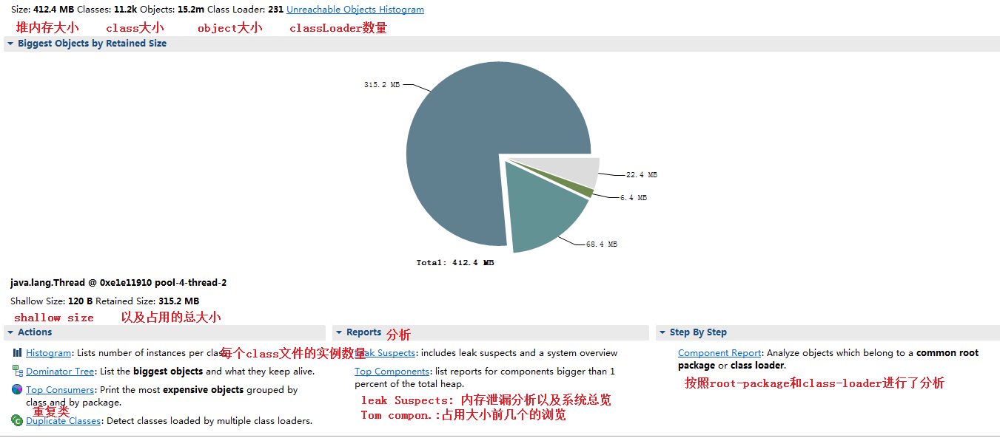
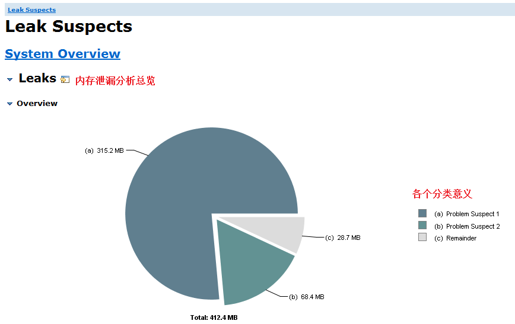
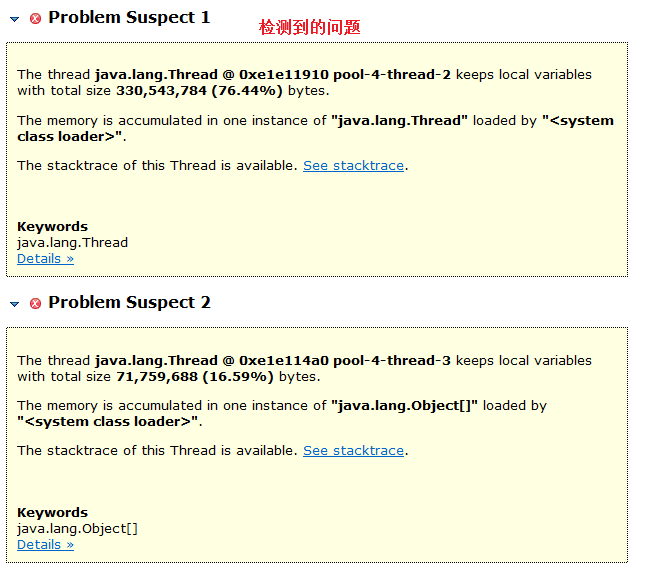
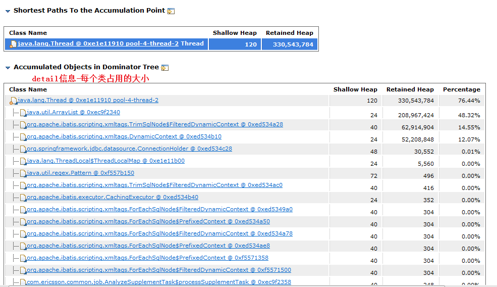
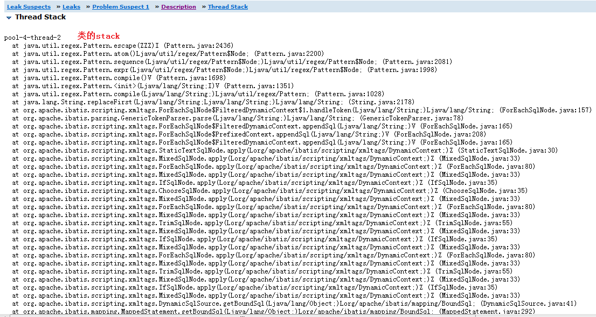

# 记一次OOM分析

记录一次OOM的分析以及解决。

情景描述：

设置的启动参数如下：

```shell
-XX:+HeapDumpOnOutOfMemoryError -XX:HeapDumpPath=${BASE}/../logs/dump.hprof   # 打印dump文件
-XX:OnOutOfMemoryError="sh -x ${BASE}/start.sh restart"    # oom时运行一些命令, 此处是重启
```

错误描述：程序在正常运行时，发现会出现dump文件，并且会重启(重启貌似没有成功)。以此判断是发生了OOM，故从服务器拿下来 dump文件进行分析一下。

分析工具: ecplise 的 MAT工具。

## 第一步：

打开dump文件，显示如下：



显示如上，可以看到MAT工具还是非常强大的，里面有很多的功能。咱们这个只是使用到 Reports下的Leak Suspects功能。

## 第二步:

查看内存泄漏分析：



如图所示，往下拉可以看到有分析出的问题，如下：



## 第三步

从上可以看到分析出了两个内存泄漏问题，而且可以查看每个问题的 stack以及 具体问题的detail信息。咱们看一下第一个问题的stack以及detail：

detail信息：

可以看到每个class占用的具体的大小：从这个可以看出一个问题，其中有一个ArrayList占用200+M的大小，那么这肯定不正常。嗯，所以这里可以猜测出第一个问题。



stack信息：

可以看到类的调用关系，也就是说这个ArrayList是在哪里使用的：



大概问题确定了Arraylist这个容器有问题，从stack可以看出这个list是从在哪里使用的。那么咱们就可以根据stack查看源代码了。

```java
class processSupplementTask implements Runnable{
    private List<AlarmSequenceAnalyze> lists ;
    private List<Integer> losts = new ArrayList<>();
    private String sourceId;
    private List<AlarmSupplementMonitor> supplementTasks;
    private Integer lastSeq ;
    private String insertTableLockPath = "/lock/am_controller/sourceMonitorUpdate/lock";

    public processSupplementTask(List<AlarmSequenceAnalyze> lists,String sourceId) {
        this.lists = lists;
        this.sourceId = sourceId;
        this.supplementTasks = new ArrayList<>();	// 容器是一个类实例变量,属于全局使用的
        this.lastSeq = lists.get(lists.size()-1).getAlarmSeq();
    }
    if (supplementTasks != null && supplementTasks.size() > 0){
        if (log.isDebugEnabled()){
            log.debug("analyse supplementTasks :{}",JSONUtil.beanToJson(supplementTasks));
        }
        alarmSupplementMonitorService.insertBatch(supplementTasks);
        supplementTasks.clear();	// 在这里使用,使用完使用clear释放容器中的对象
    }
    .....
}
```

从代码可以看，此容器保存要入库的对象，但是使用完之后就直接clear了，发现没有生效。此类是一个Runnable类型的类，运行在线程池中，不知道是不是跟此有关系。(这里可以留个问号?????).

进行修改：

```java
 if (supplementTasks != null && supplementTasks.size() > 0){
        if (log.isDebugEnabled()){
            log.debug("analyse supplementTasks :{}",JSONUtil.beanToJson(supplementTasks));
        }
        alarmSupplementMonitorService.insertBatch(supplementTasks);
        supplementTasks = null;	// help gc
    }
// 此处直接修改为null，进行释放
```

