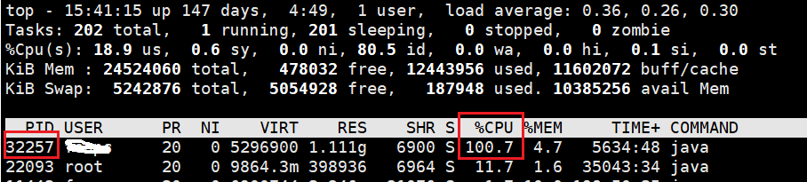
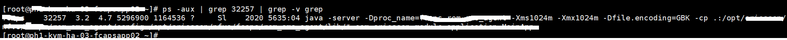
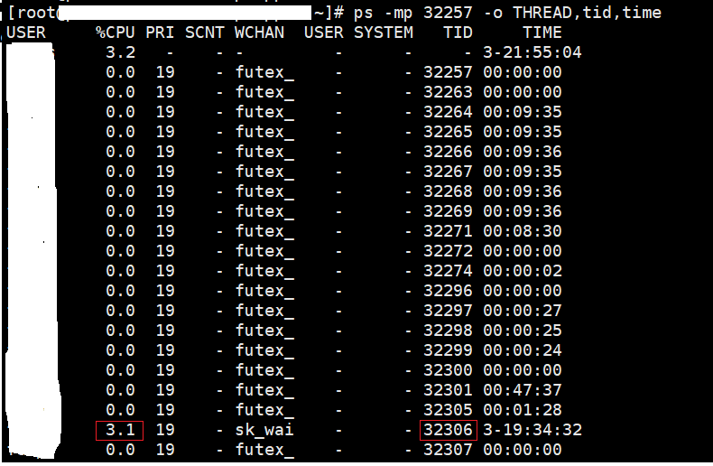
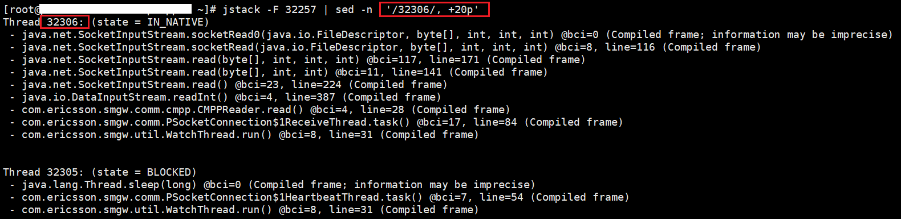

# 线上定位jvm某个线程资源占用过高

针对线上jvm资源占用过高(cpu占用过高, 内存占用过高)情况如何去分析呢?

简单说就是找到此jvm进程下占用资源过高的那个线程, 然后看一下此线程的调用栈, 根据此调用栈再去源码中查找具体的原因.

## 1. 查看占用资源高的进程

1. 根据`top`命令查看占用资源高的进程
2. 之后使用`ps -aux |  grep pid ` 查看此进程占用的资源情况
3. 也可以使用`top -H -p pid`查看资源

找到资源占用高的进程后, 继续分析此进程下具体那一个线程占用资源高.





## 2. 查看此进程下的线程

通过`ps -mp pid -o THREAD,tid,time` 查看此进程下各个线程的信息, 从这些信息中可以查看具体占用资源高的线程tid. 

```shell
# 把此线程的tid转换为 16进制
[root~]# printf "%x\n" 32306
7e32
```



## 3. 得到线程tid

通过上面的ps命令得到占用资源高的线程tid的16进制表示.


## 4. 查看jvm对应的线程栈

使用`jstack -ml jvmpid  | sed -n '/tid/, +50p'` 得到此线程的调用栈信息, 通过这些信息可以去源码中查看具体占用资源高的原因.

`jstack -ml jvmpid  | grep tid -A 50`

```shell
grep 
Context control:
-B, --before-context=NUM print NUM lines of leading context
-A, --after-context=NUM print NUM lines of trailing context
```




## 5. 根据线程栈查看code

最后根据上面的函数调用栈, 去查看此调用过程中存在占用资源多的问题. 


## 6. proc查看占用资源

除了上面使用的`ps`以及`top`查看对用进程的资源占用情况, 在 `/proc` 下也可以看到此进程占用的资源情况:

如:

```shell
# cat /proc/32257/status 
Name:	java
Umask:	0002
State:	S (sleeping)
Tgid:	32257
Ngid:	0
Pid:	32257
PPid:	1
TracerPid:	0
Uid:	1101	1101	1101	1101
Gid:	1101	1101	1101	1101
FDSize:	64
Groups:	994 1001 1101 
VmPeak:	 5362436 kB
VmSize:	 5296900 kB
VmLck:	       0 kB
VmPin:	       0 kB
VmHWM:	 1168204 kB
VmRSS:	 1164672 kB		# 内存
RssAnon:	 1157592 kB
RssFile:	    7080 kB
RssShmem:	       0 kB
VmData:	 5146676 kB
VmStk:	     132 kB
VmExe:	       4 kB
VmLib:	   16872 kB
VmPTE:	    2652 kB
VmSwap:	     364 kB   # swap空间
Threads:	40		# 线程数
SigQ:	4/95710
SigPnd:	0000000000000000
ShdPnd:	0000000000000000
SigBlk:	0000000000000000
SigIgn:	0000000000000003
SigCgt:	2000000181005ccc
CapInh:	0000000000000000
CapPrm:	0000000000000000
CapEff:	0000000000000000
CapBnd:	0000001fffffffff
CapAmb:	0000000000000000
Seccomp:	0
Cpus_allowed:	3f
Cpus_allowed_list:	0-5
Mems_allowed:	00000000,00000000,00000000,00000000,00000000,00000000,00000000,00000000,00000000,00000000,00000000,00000000,00000000,00000000,00000000,00000000,00000000,00000000,00000000,00000000,00000000,00000000,00000000,00000000,00000000,00000000,00000000,00000000,00000000,00000000,00000000,00000001
Mems_allowed_list:	0
voluntary_ctxt_switches:	21
nonvoluntary_ctxt_switches:	2
```


