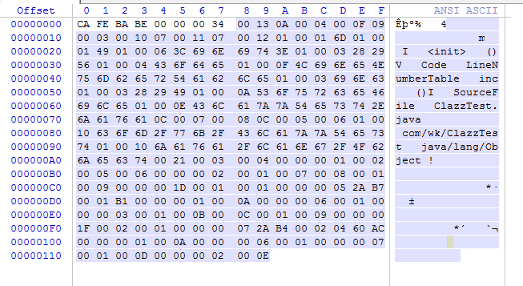

# 解析一个class文件exampl

此篇根据前面一篇具体去分析一个编译后的源码文件。

```java
package com.wk;

public class ClazzTest {
    private int m;

    public int inc(){
        return m + 1;
    }
}
```

```shell
# 编译命令
javac ClazzTest.java
# 查看字节码
javap -v ClazzTest.class
```

编译后的class文件:



字节码文件:

```shell
Classfile /F:/github_code/Mine/JavaBase/JavaBaseProject/src/main/java/com/wk/ClazzTest.class
  Last modified 2019-8-21; size 282 bytes
  MD5 checksum d7b7b18c148301b758e07b403594bf51
  Compiled from "ClazzTest.java"
public class com.wk.ClazzTest
  minor version: 0
  major version: 52
  flags: ACC_PUBLIC, ACC_SUPER
Constant pool:					##-- 常量池
   #1 = Methodref          #4.#15         // java/lang/Object."<init>":()V
   #2 = Fieldref           #3.#16         // com/wk/ClazzTest.m:I
   #3 = Class              #17            // com/wk/ClazzTest
   #4 = Class              #18            // java/lang/Object
   #5 = Utf8               m
   #6 = Utf8               I
   #7 = Utf8               <init>
   #8 = Utf8               ()V
   #9 = Utf8               Code
  #10 = Utf8               LineNumberTable
  #11 = Utf8               inc
  #12 = Utf8               ()I
  #13 = Utf8               SourceFile
  #14 = Utf8               ClazzTest.java
  #15 = NameAndType        #7:#8          // "<init>":()V
  #16 = NameAndType        #5:#6          // m:I
  #17 = Utf8               com/wk/ClazzTest
  #18 = Utf8               java/lang/Object
{
  public com.wk.ClazzTest();
    descriptor: ()V				# 描述符
    flags: ACC_PUBLIC			## access_flag
    Code:					   ## code属性
      stack=1, locals=1, args_size=1
         0: aload_0
         1: invokespecial #1                  // Method java/lang/Object."<init>":()V
         4: return
      LineNumberTable:				# LineNumberTable属性
        line 3: 0

  public int inc();
    descriptor: ()I					# 描述符
    flags: ACC_PUBLIC
    Code:							# code属性
      stack=2, locals=1, args_size=1
         0: aload_0
         1: getfield      #2                  // Field m:I
         4: iconst_1
         5: iadd
         6: ireturn
      LineNumberTable:
        line 7: 0
}
SourceFile: "ClazzTest.java"		# sourceFile 属性

```

基本环境就准备好了，接下来咱们对class二进制文件挨个字节进行分析。也对应class文件的结构，去分析。

## 1. 魔数

从class文件结构中，看到魔数是一个u4类型，也就是占用4个字节，看二进制中的前四个字节：

0000000-00000003: CAFEBABE ，这就是class文件的魔数。

## 2. 版本号

接下来4个字节分别是副版本号和主版本号。可以看到:

00000004-00000005(minor version): 00 00

00000006-00000007(major version):00 34

主版本号为52，副版本号为0，当前编译使用的是jdk8。

## 3. 常量池

接下来两位为常量池中item数量: 00 13，值为19，也就是常量池中有18个item，因此常量池从1开始的嘛。

第一个：

0000000A :地址值为:0A，也就是10，对应的常量属性为constant_methodref_info，也就是类方法的符号引用。

0000000B--0000000C : 00 04，值就是4，此处为index，指向常量池中一个constant_class_info的索引项

0000000D--0000000E: 00 0F，值为15，此处为index，指向常量池中constant_NameAndType的索引项

第二个:

0000000F: 09，值为9，表示一个 constant_FieldRef_info

00000010--00000011:00 03，值为3，此处为一个index，指向声明字段的类或接口描述符constant_class_info

00000012--00000013: 00 10，值为16，此处也为一个index，指向字段描述符constant_nameAndType的索引项

第三个:

00000014: 07，表示为constant_Class_info 类或接口的符号引用

00000015--00000016:00 11，值为17，指向全限定名常量项索引

第四个:

00000017: 07, 表示为constant_Class_info 类或接口的符号引用

00000018--00000019: 00 12，值为18，指向全限定名常量项索引

第五个:

0000001A:01，表示一个UTF-8编码的字符串

0000001B--000001C:00 01，表示UTF8编码的字符串占用了的字节数

0000001D: 6D，表示字符m

第六个:

0000001E: 01，表示一个UTF-8编码的字符串

0000001F--00000020:00 01，表示UTF8编码的字符串占用了的字节数

00000021:49，表示字符 I(大写的i)

第七个:

00000022: 01，表示一个UTF-8编码的字符串

00000023--00000024: 00 06，表示UTF8编码的字符串占用了的字节数

00000025--0000002A: 3C 69 6E 69 74 3E，表示字符串 <init>

第八个:

0000002B: 01，表示一个UTF-8编码的字符串

0000002C--0000002D:00 03，表示UTF8编码的字符串占用了的字节数

0000002E--00000030:28 29 56，表示字符串 ()

第九个:

00000031:01，表示一个UTF-8编码的字符串

00000032--00000033:00 04，表示UTF8编码的字符串占用了的字节数

00000034--00000037:43 6F 64 65，表示字符串 Code

第十个:

00000038: 01，表示一个UTF-8编码的字符串

00000039--0000003A:00 0F，值为15，表示UTF8编码的字符串占用了的字节数

0000003B--00000049:4C 69 6E 65 4E 75 6D 62 65 72 54 61 62 6C 65，表示字符串LineNumberTable

第十一个:

0000004A:01，表示一个UTF-8编码的字符串

0000004B--0000004C:00 03，值为3，表示UTF8编码的字符串占用了的字节数

0000004D--0000004F: 69 6E 63，表示字符串inc

第十二个:

00000050: 01，表示一个UTF-8编码的字符串

00000051--00000052: 00 03，表示UTF8编码的字符串占用了的字节数

00000053--00000055:28 29 49 ,表示 ()I  ，此处是大写的i

第十三个:

00000056:01，表示一个UTF-8编码的字符串

00000057--00000058:00 0A，表示UTF8编码的字符串占用了的字节数

00000059--00000062:53 6F 75 72 63 65 46 69 6C 65，表示字符串SourceFile

第十四个:

00000063:01，表示一个UTF-8编码的字符串

00000064--00000065:00 0E,表示UTF8编码的字符串占用了的字节数

00000066--00000073:43 6C 61 7A 71 54 65 73 74 2E 6A 61 76 61，表示字符串ClazzTest.java

第十五个:

00000074:0C，constant_NameAndType_info, 字段或方法的部分符号引用

00000075--00000076:00 07,指向该字段或方法名称常量项的索引

00000077--00000078:00 08  指向该字段或方法描述符常量项的索引

第十六个:

00000079:0C，constant_NameAndType_info, 字段或方法的部分符号引用

0000007A--0000007B:00 05,指向该字段或方法名称常量项的索引

0000007C--0000007D:00 06   指向该字段或方法描述符常量项的索引

第十七个:

0000007E: 01,表示一个UTF-8编码的字符串

0000007F--00000080: 00 10 ,值为16，表示UTF8编码的字符串占用了的字节数

00000081--00000090:63 6F 6D 2F 77 6B 2F 43 6C 61 7A 7A 54 65 73 74,表示字符串 com/wk/ClazzTest

第十八个:

00000091:01,表示一个UTF-8编码的字符串

00000092--00000093:00 10,值为16，表示UTF8编码的字符串占用了的字节数

00000094--000000A3:6A 61 76 6A 2F 6C 61 6E 67 2F 4F 62 6A 65 63 74，表示字符串 java/lang/Object

## 4. 类文件的access_flags

接下来2个字节为access_flag:

000000A4--000000A5:00 21 ，表示修饰符为: ACC_SUPER  | ACC_PUBLIC == 0021

## 5. this_class

000000A6--000000A7:00 03, 指向常量池中一个 constant_class_info 项

## 6. super_class

000000A8--000000A9: 00 004，指向常量池中一个constant_class_info项

## 7. interface_count

000000AA-000000AB: 00 00, 表示没有实现接口

## 8. interfaces

此示例没有实现接口

## 9. fields_count

000000AC--000000AD:00 01,表示有一个field

## 10. fields

000000AE--000000AF: 00 02，此处表示access_flags, 为:ACC_PRIVATE

000000B0--000000B1:00 05，此处表示name_index，也就是名字索引，constant_utf8_info

000000B2--000000B3:00 06,  描述符索引

000000B4--000000B5:00 00  , 属性个数，此处为0，表示没有其他属性

## 11. methods_count

000000B6--000000B7:00 02 .表示有两个方法

## 12. methods

000000B8--000000B9:00 01,表示 access_flags

000000BA--000000BB:00 07, 表示name_index

000000BC--000000BD:00 08, 表示 descriptor_index

000000BE--000000BF: 00 01 表示 attribute 数量

方法属性:

000000C0--000000C1:00 09,(attribute_name_index)属性的名字的索引值，可以看到此处为Code，表示这是code属性

000000C2--000000C5:00 00 00 1D,(attribute_length) 属性值长度，此处为 29

000000C6--000000C7:00 01, (max_stack) 最大栈深度

000000C8--000000C9:00 01 ,(max_locals) 最大本地变量数量

000000CA-000000CD:00 00 00 05, (code length) code的长度

000000CE--0000D2:2A B7 00 01 B1, (code)表示虚拟机指令码

000000D3--000000D4:00 00 , (exception_table_length) 没有异常

000000D5--000000D6:00 01 ,表示有一个属性

000000D7-000000D8: 00 0A ,(attribute_name_index)为LineNumberTable

000000D9-000000DC：00 00 00 06 ，(attribute_length),属性长度

000000DD-000000DE:00 01 表示 line_number_info的个数

000000DF-000000E2:00 00 00 03 ,表示start_pc==0  对应 line_number=3

第二个方法：

000000E3-000000E4: 00 01 表示 access_flags

000000E5-000000E6: 00 0B 表示name_index,表示inc

000000E7-000000E8:00 0C 表示descriptor_index ,为  ()I  (此处为大写的i)

000000E9-000000EA:00 01  attribute_count  表示有一个属性

000000EB-000000EC:00 09,attribute_name_index,表示Code，表示此为一个code属性

000000ED-000000F0: 00 00 00 1F, 属性长度为31

000000F1-000000F2: 00 02  max_stack 最大为2

000000F3-000000F4: 00 01  max_locals 为1

000000F5-000000F8: 00 00 00 07 ,code_length 表示code长度，为7

000000F9-000000FF: 2A B4 00 02 04 60 AC ,对应的虚拟机的指令

00000100-00000101:00 00  表示exception_table_count 为0

00000102-00000103: 00 01 表示有一个属性

下一个属性

00000104-00000105: 00 0A ,attribute_name_index,表示LineNumberTable

00000106-00000109: 00 00 00 06 ,表示 attribute_length 属性长度

0000010A-0000010B:00 01, line_number_table_length, 表示line_number_info的个数,有一个

0000010C-0000010F:00 00 00 07 表示start_pc=00  line_number=7

## 13. attributes_count

00000110-0000111:00 01 表示属性有一个

## 14. attributes

00000112-00000113:00 0D,attribute_name_index为SourceFile

00000114-00000117:00 00 00 02  attribute_length为2

00000118-0000119:00 0E sourcefile_index,常量池中的索引，此处值为 ClazzTest.java


到此一个简单的class文件就分析完成了。虽然有些枯燥，但还是有些价值的。