[TOC]

# class文件结构

此篇分析一下关于java编译后的class文件的结构，此是了解jvm内部结构必需的一个步骤。当然了纯纯分析数据结构比较枯燥，不过没关系，前面介绍理论知识，后面给出一个具体分析文件的示例，争取以简单直接的白话叙述清楚。

## 1. 总体结构

class文件是一组8字节为基础单位的二进制流，各个数据项目严格按照顺序紧凑的排列在class文件之中，中间没有添加任何分隔符，使得整个class文件中存储的内容几乎全部都是程序运行的必要数据，没有空隙存在。当遇到8位字节以上空间的数据项时，则会按照高位在前的方式分隔成若干个8位字节进行存储。

按照虚拟机规定，class文件采用一种类似c语言结构体的伪结构来存储，这种伪结构只有两种数据类型：**无符号数和表**。**无符号数：**是属于基本的数据类型，以u1，u2，u4，u8来分别代表1个字节，2个字节，4个字节，8个字节；无符号数可以用来描述数字，索引引用，数量值或者按照UTF-8编码构成字符串值。

**表：**是由多个无符号数或其他表作为数据项构成的复合数据类型，所有表都习惯性的以"_info"结尾。class文件本质上就是一张有层次关系的表。

class文件格式:

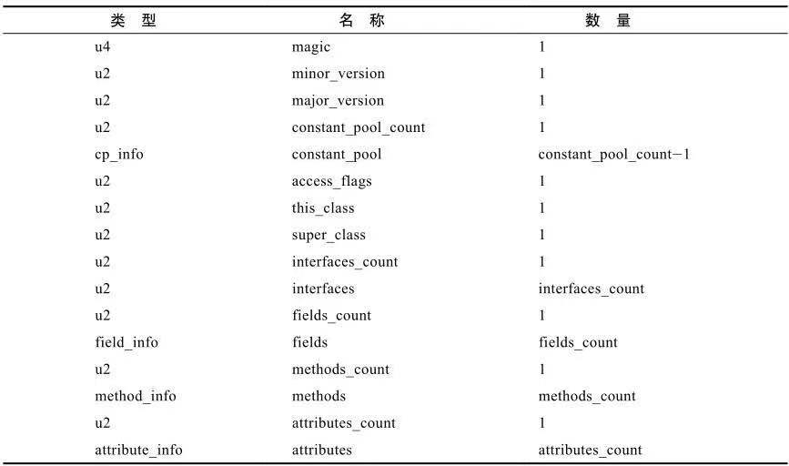

由图可知，一个class文件有上面16个item组成，其中要描述的同一类型的多个数据时，都设置了一个前置计数器。像上图中constant_pool_count 和 constant_pool，以及接口，fields，method，attribute都是这样。这涉及到程序的设计，因此java从没有约定编写一个类只可以有固定数量的field，或方法等硬性要求，大家平时也都是需要什么，就定义什么，所以数量都是不确定的。

接下来咱们一个一个分析class文件中的这些item。

### 1.1 魔数

class文件中的魔数是固定的，作用是用于确定这个文件是否为一个能被虚拟机接收的class文件。固定为:0xCAFEBABE。

### 1.2 版本号

minor_version表示次版本号，major_version 表示主版本号。Java的版本号是从45开始的，高版本的JDK能向下兼容以前版本的class文件。下面是各个jdk支持的version号:

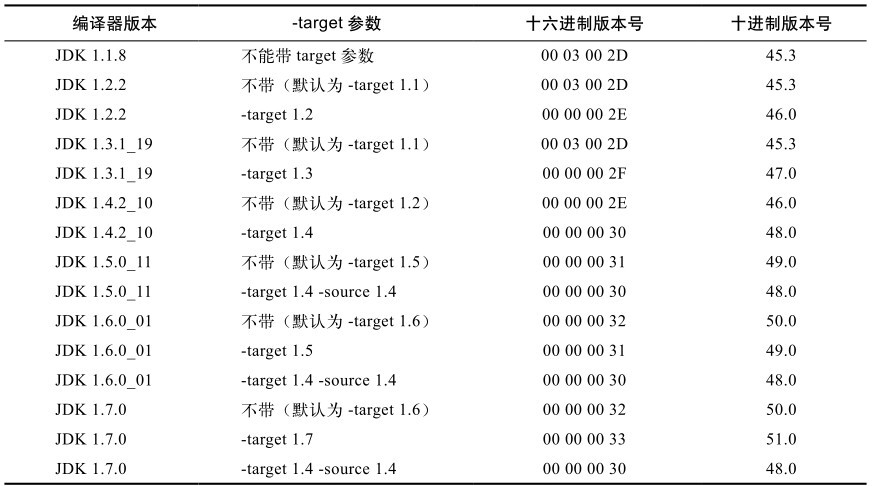

### 1.3 常量池

关于常量池有关的item，constant_pool_count 和 constant_pool。因此常量池中的数量也是不确定的，所以定义了一个前置计数器；常量池计数器从1开始，0作为保留，作为表达"不引用任何一个常量池项目"。

常量池中主要存放两大类常量：字面常量(Litera)和符号引用(reference)。**字面常量**接近java语言层面的常量概念，如文本字符串，被声明为final的常量值。

符号引用属于编译原理方面的概念，包括三类常量：

1. 类和接口的全限定名(full qualified)
2. 字段的名称和描述符(descriptor)
3. 方法的名称和描述符

Java代码在进行javac编译的时候，不进行连接，而是在虚拟机加载class文件的时候进行动态连接。在虚拟机运行时，需要从常量池获得对应的符号引用，再在类创建时或运行时解析并翻译到具体的内存地址之中。

常量池中的每一项常量都是一个表，共有11种结构，这11种表都有一个共同的特点，就是表开始的第一位是一个u1类型的标志位(tag,取值为1至12，缺少标志2的数据类型)，代表当前这个常量属于哪种常量类型。

11种常量类型如下:

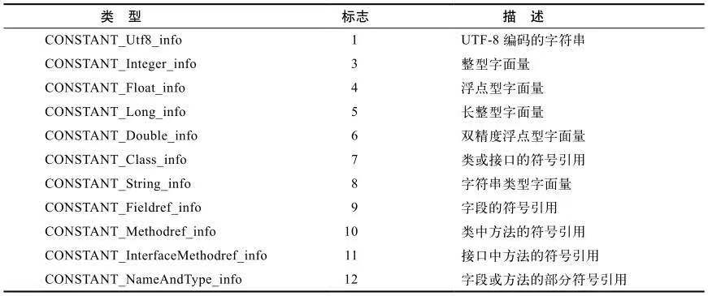

11种常量类型的结构总表：

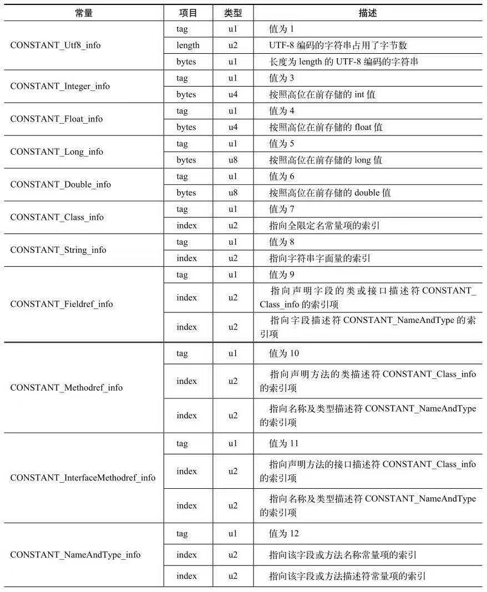

### 1.4 access_flags

此标志用于识别一些类或接口层次的访问信息，包括这个class是类还是接口；是否定义为public类型；是否定义为abstract类型；是否被声明为final。

具体标志为如下：

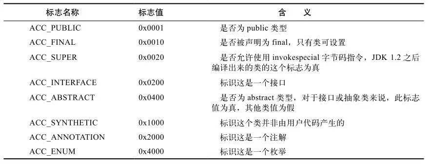

### 1.5 this_class, super_class, interface

类索引(this_class)和父类索引(super_class)都是一个u2类型数据，而interfaces是一组u2类型的数据集合，class文件中由这个三项数据来确定这个类的继承关系。

**类索引:**用于确定这个类的全限定名。

**父类索引:**用于确定这个类的父类的全限定名。由于java不允许多继承，所以了除了Object之外，其他类都有一个父类。

**接口索引：**用于描述这个类实现了哪些接口，这些被实现的接口按照implements语句后的接口顺序从左到右排列在接口索引中（如果这个类本身是一个接口，则应当是extends）。

类索引和父类索引都是指向一个类型为constant_class_info的类描述符常量，通过constant_class_info类型的常量中的索引值找到定义在constant_utf8_info类型的常量中的全限定名字符串。

### 1.6 fields

字段表(field_info)用于描述接口或类中声明的变量。字段包括了类级变量或实例级变量。

字段表结构如下:

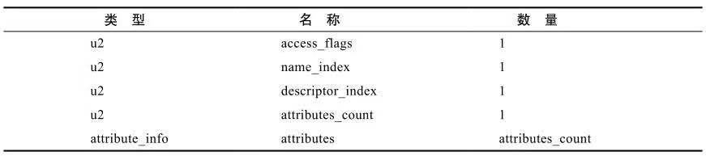

字段访问标志

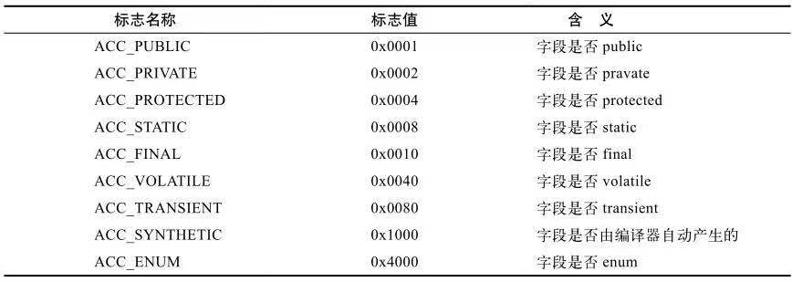

跟随access_flag标志的是两个索引值:name_index和descriptor_index。它们都是对常量池的引用，分别代表着字段的**简单名称**和字段和**方法的描述符**。解释一下简单名称，描述符，全限定名概念：

全限定名：如 "org/apache/clazz/testClass" 是类的全限定名，就是把类全名中的 "." 替换为了 "/"。为了使连续的多个全限定名之间不产生混淆，在使用时最后一般会加入一个 ";" 表示全限定名结束。

简单名称：简单名称就是没有类型的参数修饰的方法或字段名称。如方法名为 void inc()方法的简单名称就是  inc

描述符：描述符的作用是用来描述字段的数据类型、方法的参数列表(包括数量，类型以及顺序)和返回值。

基本数据类型(byte short int long double float char boolean) 以及代表无返回值的void类型都用一个大写字母表示，对象类型使用字符L加对象的全限定名类表示。

描述符：

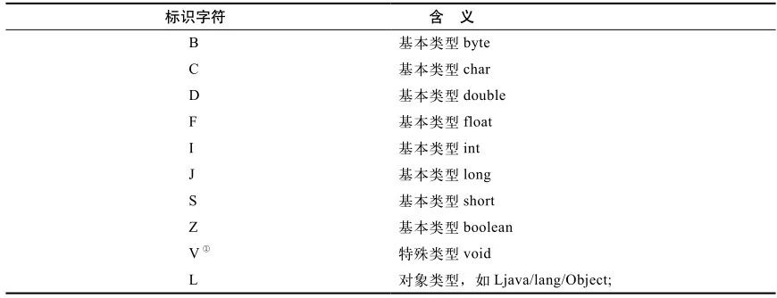

示例:

```shell
# 对于数组类型，每一维度使用一个前置的 "[" 字符来描述
java.lang.String [][] 二维数组，表示为: [[Ljava/lang/String
int[]  表示为: [I
# 描述符描述方法时，按照先参数列表后返回值的顺序描述，参数列表按照参数的严格顺序放在一组小括号"()"之内。
void int()   表示为:   ()V
java.lang.String toString()   表示为   ()Ljava/lang/String
int indexOf(char[] source,int sourceOffset,int sourceCount,char[] target,int targetOffset,int targetCount,int formIndex)  表示为：
						([CII[CIII)I
```

### 1.7 methods

方法表结构如同字段表一样，一次包括了访问标志(access_flag)、名称索引(name_index)、描述符索引(descriptor_index)、属性表集合(attributes)几项。

方法表结构:

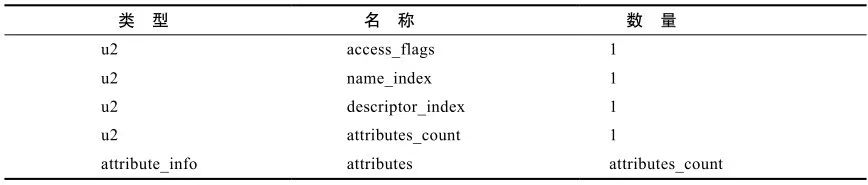

方法访问标志:

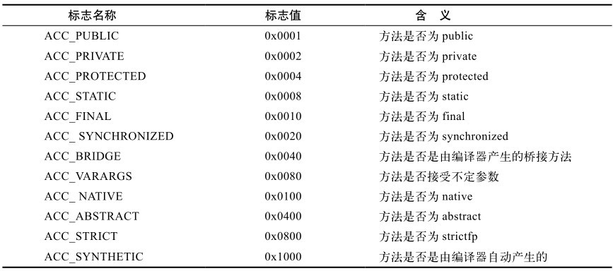

方法里的java代码，经过编译器编译成字节码指令之后，存放在方法属性表集合中一个名为"code"的属性里面。

在java中，重载一个函数就是除了与原方法有相同的简单名称外，还要求拥有一个与原方法不同的**特征签名**，**特征签名**就是一个方法中各个参数在常量池中的字段符号引用的集合，也就是因为返回值不会包含在特征前面之中，因此java语言里面是无法仅仅依靠返回值的不同来对一个已有方法进行重载的。 但是在class文件中，特征签名的范围更大一些，只要描述符不是完全一致的两个方法也可以共存。也就是说，如果两个方法有相同的名称和特征签名，但返回值不同，那么也是可以合法共存于同一个class文件中的。

### 1.8 attributes

在class文件、字段表、方法表中都可以携带自己的属性表集合，以用于描述某些场景专有的信息。

与class文件中其他的数据项目要求严格的顺序、长度和内容不同，属性表集合的限制稍微宽松一些，不再要求各个属性表具有颜色的顺序，并且只要不与已有的属性名重复，任何人实现的编译器都可以向属性表中写入自定义的属性信息，java虚拟机运行时会忽略掉它不认识的属性。

虚拟机规范定义的属性:

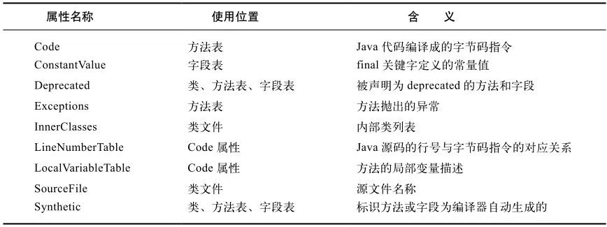

#### 1.8.1 code属性

java程序方法体里面的代码经过javac编译器处理之后，最终变为字节码指令存储在code属性里面。

Code属性出现在方法表的属性集合中，但并非所有的方法表都必须存在这个属性，譬如接口或抽象类中的方法就不存在code属性。

属性表结构：

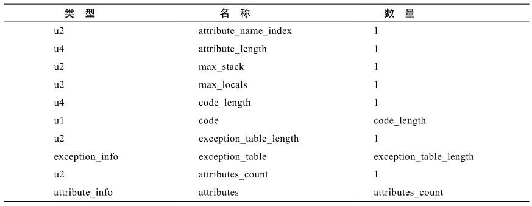

attribute_name_index：是一项指向constant_utf8_info型常量的索引，常量值固定为"code"，代表了该属性的属性名称，attribute_length指示了属性值的长度，由于属性名称索引与属性长度一共是6个字节，所以属性值的长度固定为整个属性表的长度减去6个字节。

max_stack：代表了操作数栈(operand stacks)深度的最大值。在方法执行的任意时刻，操作数栈都不会超过这个深度。虚拟机运行的时候需要根据这个值来分配栈帧(frame)中的操作栈深度

max_locals：代表了局部变量表所需的存储空间。在这里，max_locals的单位是slot，slot是虚拟机为局部变量分配内存所使用的最小单位。对于byte、char、short、int、boolean、reference和returnAddress等长度不超过32为的数据类型，每个局部变量占用1个slot，而double和long这两种64位数据类型需要2个slot来存放。方法参数(包括实例方法中隐藏参数this)、显示异常处理器的参数(Exception Handler Paramter 即try - catch语句中定义的catch块所定义的异常)、方法体中定义的局部变量都需要使用局部变量类存放。并不是在方法体中使用到了多少局部变量，就把这些局部 变量所占用的slot之和作为max_locals的值，原因是局部变量表中的slot可以重用，当代码执行超出一个局部变量的作用域时，这个局部变量所占的slot就可以被其他局部变量所使用，编译器会根据变量的作用域来分类slot并分配给各个变量使用，然后计算出max_locals的大小。

code_length 和code：用来存储java源程序编译后生成的字节码指令。code_length代表字节码长度， code是用于存储字节码指令的一系列字节流。还有一个**注意点**，虽然code_length是32位，理论上可以达到2^32-1,但是虚拟机规范限制一个方法不允许超过65535条字节码指令，如果超过这个限制，javac编译器就会拒绝编译。

