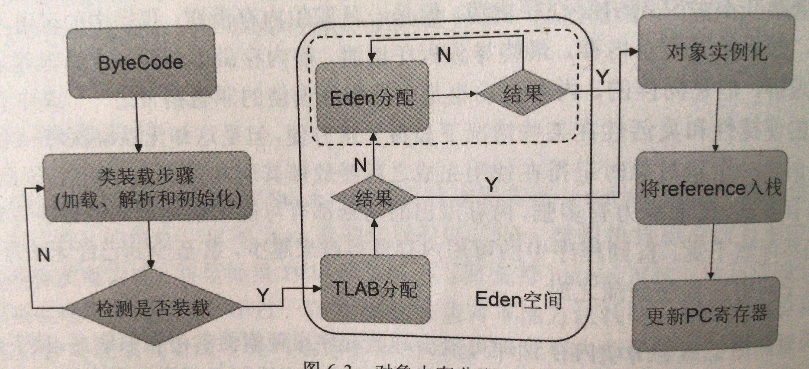
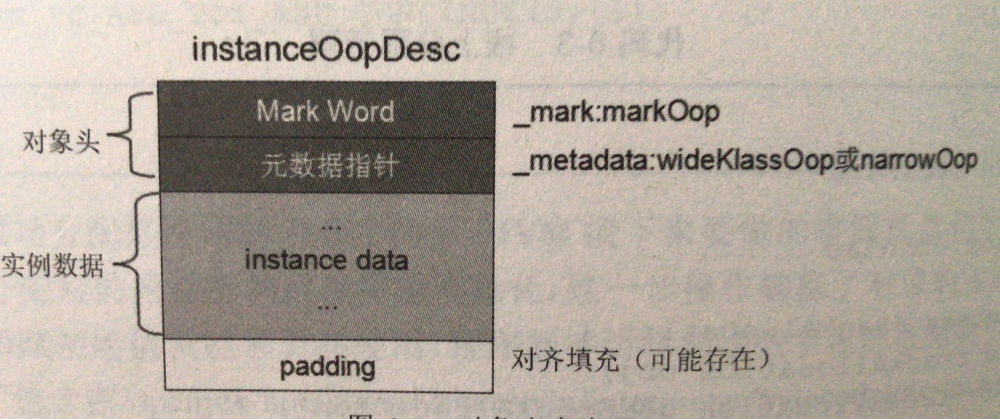
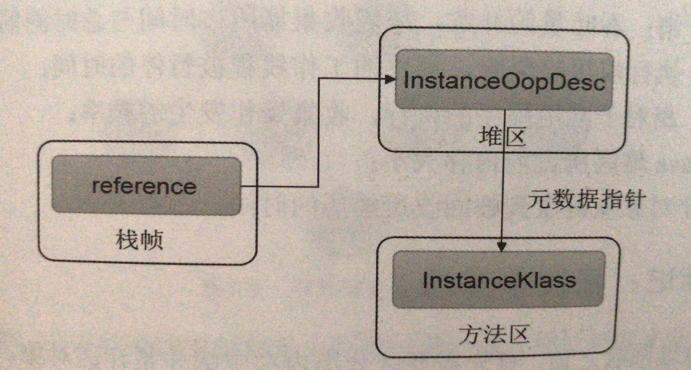

# JVM内存区域

先来个图大概看一下内存区域分布图:


如图所示，JVM分为多个不同的内存区域，之所以会这样分，是因为每一个独立的内存区都有各自的用途，都会负责存储各自的数据类型。其中一些内存区的生命周期往往还会和JVM的生命周期保持一致，也就说，会伴随着JVM的启动而创建，伴随着JVM的退出而销毁。而另一部分内存区则是与线程的生命周期保持一致，会伴随着线程的开始而创建，伴随着线程的消亡而销毁。尽管不同的内存区在存储类型和生命周期上有一定区别，却都拥有一个本质，那就是存储程序的运行时数据。

## 线程共享区域

### java堆区

Java堆区在JVM启动的时候被创建，并且它在实际的内存空间中可以是不连续的。Java堆是一块用于存储对象实例的内存区，同时也是GC执行垃圾回收的重点区域。存储在JVM中的JVM对象可以被划分为两类：1.一类是生命周期比较短的瞬时对象，这类对象的创建和消亡都非常迅速；2.另外一类是生命周期比较长的对象，子啊某些极端的情况下，还能够与JVM的生命收起保持一致。因此对于这些不同生命周期的Java对象，应用采取不同的垃圾回收策略，分代收集由此诞生。目前几乎所有的GC都是使用分代收集算法，故Java堆进一步细分，***可以划分为新生代(YoungGen)和老年代(Old Gen)，其中新生代还可以细分为Eden空间，From Survivor空间和To Survivor空间***。

可以通过选项 -Xmx，-Xms手动设置堆大小。

### 方法区

方法区和堆区一样，同样是被允许所有线程共享访问的。方法区中存储了每一个Java类的结构信息，如：***运行时常量池，字段和方法数据，构造函数和普通方法的字节码内容以及类，实例，接口初始化时需要用到的特殊方法等数据。***在HotSpot中，方法区仅仅是逻辑上的独立，实际上还是包含在堆区，也就是说，方法区在物理上当然属于Java堆区的一部分。

方法区在JVM启动的时候被创建，并且它在实际的内存空间中和Java堆区一样是可以不连续的。方法区是一块比较特殊的运行时内存区，有一些Java开发人员似乎更愿意将它称为永久代(Permanent Generation)。**主要是因为方法区除了可以通过选项 -XX:MaxPermSize 设置内存大小进行动态扩展外，并不会像Java堆区那样频繁的被GC执行回收。甚至还可以显示的指定是否需要在程序运行时回收方法区中的数据，这就是方法区被称为永久代的原因。** 虽然方法区并不会像Java堆区那么频繁的执行内存回收，但是这似乎并不代表方法区中的数据永远就不会被回收，**如果没有显示要求不对方法区内存回收的情况下，GC的回收目标仅针对方法区中的常量池和类型卸载。**

### 运行时常量池

运行时常量池属于方法区的一部分，一个有效的字节码文件中除了包含类的版本信息，字段，方法以及接口等描述信息外，还包含一项信息那就是常量池表(Constant Pool Table)，那么运行时常量池就是字节码文件中常量池表的运行时表达形式。

当类装载器成功将一个类或者接口装载进JVM后，就会创建与之对应的运行时常量池。

## 线程私有内存去

### PC寄存器

由于JVM是基于栈的架构，任何的操作都是需要经过入栈和出栈来完成的。JVM中的PC计数器是对物理PC寄存器的一种抽象模拟，它是线程私有的生命周期与线程的生命周期一致。如果当前线程所执行的方法是一个Java方法，那么PC计数器就会存储正在执行的字节码的指令地址，反之如果是native方法，这时PC计数器的值就是空。

但PC计数器为什么被设定为线程私有呢？了解了其作用，就可以猜出个大概了。大家都知道所谓的多线程在一个特定的时间段内只会执行其中某个线程方法，CPU会不停的做任务切换，那么为了能够准确记录各个线程正在执行的当前字节码指令地址，最好方法自然是为每一个线程都分配一个PC计数器，这样各个线程之间便可以独立计算。JVM的字节码解释器就是需要通过改变PC的值来明确下一条应该执行什么样的字节码指令。而且PC是JVM内存区中唯一一个没有规定需要抛出oom异常的运行时内存区。

### java栈

在Java虚拟机规范中，Java栈也可以被称为Java虚拟机栈，同PC一样都是线程私有，并且生命周期与线程的生命周期保持一致。Java栈用于存储栈帧(Stack Frame)，而栈帧中所存储的就是局部变量表，操作数栈，以及方法出口等信息。Java堆中存储的都是对象实例，Java栈中的局部变量表就是用于存储各类原始数据类型，对象引用和returnAddress类型。

Java栈允许被实现成固定大小的内存或者是可动态扩展的内存大小，如果Java栈被设定为固定大小，一旦线程请求分配的栈容量超过JVM所允许的最大值，JVM抛出一个StackOverFlowError异常，反之抛出oom。

### 本地方法栈

本地方法栈(Native method stack)用于支持本地方法(如C/C++)的执行，和Java栈的作用类似。Java虚拟机规范也没有明确要求本地方法栈的具体实现方式，甚至如果JVM产品并不打算支持native方法，也不依赖与传统栈，则可以无需实现。不过一旦JVM中实现有本地方法栈时，那么它将会和Java栈一样，允许被实现成固定或者可以可动态扩展的内存大小。


## 内存分配原理

1. 当语法使用new创建一个对象时，JVM首先会检查换个new对象参数能否在常量池中定位到一个类的符号引用，然后检查与这个符号引用相对应的类是否已经加载，解析和初始化。
2. 当类装载步骤后，就已经完全可以确定出创建对象实例时所需要的内存空间大小，接下来JVM将会对其进行内存分配，以存储所生成的对象实例
3. 当已用内存和未用内存以规整有序方式分布，即已用和未用都各自一边，就可以使用指针碰撞的方式分配内存；否则只能使用空闲列表方式进行分配
4. 由于对象实例创建在JVM中非常频繁，因此在并发环境下从堆区中划分内存对象时非线程安全的，所以务必需要保证数据操作的原子性。基于线程安全的考虑，如果一个类在分配内存之前已经完成类装载步骤之后，JVM会优先选择在TLAB中未对象实例分配内存，TLAB在Java堆中是一块线程私有区域，包含在eden区域，避免了一系列的非线程安全问题，同时能够提升内存分配的吞吐量，因此可以将这种方式称为**快速分配策略。**
5. 一旦在TLAB分配内存失败，JVM就会尝试通过使用加锁机制确保数据操作原子性，从而直接在eden空间中分配内存，如果eden也无法分配内存，就会引发Minor GC，直至在Eden中分配内存为止（如果是大对象则直接在老年代中分配）。
6. 为对象分配好所需内存后，JVM接下来要做的事情就是初始化对象实例，JVM会首先对分配后的内存进行零值初始化。确保了Java对象的实例字段在Java代码中不用赋初值就能够使用。
7. 零值初始化后，JVM就会初始化对象头和实例数据，最后将对象引用栈，再更新PC值。经过这一系列操作步骤后，Java对象实例才算是真正的创建成功。

可以使用选项 -XX:UseTLAB 设置是否开启TLAB，默认TLAB占这个eden区的1%，使用 -XX:TLABWasteTargetPercent 设置TLAB空间占据Eden空间的百分比大小。

来个图，看一下：



## 逃逸分析和栈上分配

JVM堆区已经不再是对象内存分配的唯一选择，如果希望减低GC发生的频率和提升GC回收效率，那么则可以使用堆外存储技术。目前最常见的堆外存储技术就是利用逃逸分析筛选出未发生逃逸的对象，然后避开堆区而直接选择在栈帧中分配内存空间。

逃逸分析(Escape Analysis)是JVM在执行性能优化前的一种分析技术，它具体目标就是分析出对象的作用域。简单来说，当一个对象被定义在方法体内部之后，它的受访权限仅限于方法体内，一旦其引用被外部成员引用后，这个对象就因此发生了逃逸，反之如果定义在方法体内的对象并没有被任何的外部成员引用时，JVM就会为其在栈帧中分配内存空间。

```java
public class StackAllocation{
    public StackAllocation obj;
    public StackAllocation getInstance(){
        // 方法返回StaclAllocation对象实例，发生了逃逸
        return null==obj?new StackAllocation():obj;
    }
    
    public void setStackAllocation(){
        // 发生逃逸
        obj = new StackAllocation();
    }
    
    public void useStackAllocation(){
        // 被外部引用，发生逃逸
        StackAllocation obj = getInstance();
    }
    
    public void useStackAllocation1(){
        // 对象仅用于方法内，没有逃逸
        StackAllocation obj = new StackAllocation();
    }
    
}
```


## 对象内存布局和 OOP-Klass模型

当成功堆分配后的内存空间执行了零值初始化后，JVM接下来就会堆对象进行实例化。在HotSpot中，对象实例化无非就是初始化对象头和实例数据，而且存储对象实例信息的内存布局也主要有这两个部分组成。如图：



*其中对象头主要用于存储Mark World和元数据指针等数，其中Mark World主要用于存储对象运行时的数据信息，如：HashCode，GC分代年龄，锁状态标志，线程持有的锁，偏向线程ID，偏向时间戳等。而元数据指针则是用于指向方法区中目标类的类型信息，也就是说通过元数据指针可以准确定位到当前对象的具体目标类型。*

除了对象头外，内存布局的另一部分就是实例数据。实例数据主要用于存储定义在当前对象中各种类型的字段信息（包括超类的字段信息），存储在实例对象中的字段顺序除了会与字段在Java类中定义的顺序有关外，还会收到JVM分配策略参数(FieldAllocationStyle)影响，开发人员可以通过 -XX:FieldsAllocationStyle 设置JVM的分配策略。HotSpot默认会按照 long/double，int,short/chars，bytes/booleans，oops的分配策略顺序进行分配，可以发现二进制位数相同的字段总是放在一起。注意：在满足这个前提的情况下，在超类中定义的变量很有可能会出现在派生类之前。

那接下来看看JVM究竟是如何表达Java类以及对象实例的，毕竟Java语言只是一个中间语言，运行在JVM中还是需要一套完整的底层内部对象表示机制。OOP-Klass模型就是用于表达Java类以及对象实例的一种数据结构。其中OOP（Ordinary Object Pointer，普通对象指针）用于描述对象的实例信息，而Klass则用于描述对象实例的目标类型，也就是说Klass其实是一个与Java类相对应的JVM中的内部对等体，可以称之为C++对等体。

那OOP-Klass模型与对象的内存布局有什么关系呢？

在JVM中对象头就是由OOP对象instanceOopDesc来表示的(数组类型使用ArrayOopDesc表示)，而对象头中的元数据指针所指向的当前对象的目标类型则是由Klass中的instanceKlass对象表示的(数组则使用arrayKlass表示)，用于在JVM中表示后一个Java类的对等体。

那么JVM是如何通过栈帧的对象引用访问到其内部的对象实例的呢？

如图：



JVM可以通过对象引用准确定位到Java堆中的instanceOopDesc对象，这样既可成功访问到对象的实例信息，当需要访问目标对象的具体类型是，JVM则会通过存储在instanceOopDesc中的元数据指针定位到存储在方法区中的instanceKlass对象上。