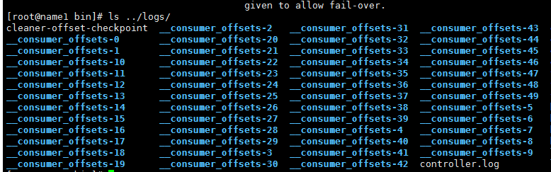

# 记录一次增加副本数的操作

操作前：

```shell
[root@name1 bin]# ./kafka-topics.sh --bootstrap-server name1:9092 --topic __consumer_offsets --describe 
Topic:__consumer_offsets	PartitionCount:50	ReplicationFactor:1	Configs:compression.type=producer,cleanup.policy=compact,segment.bytes=104857600
	Topic: __consumer_offsets	Partition: 0	Leader: 0	Replicas: 0	Isr: 0
	Topic: __consumer_offsets	Partition: 1	Leader: 0	Replicas: 0	Isr: 0
	Topic: __consumer_offsets	Partition: 2	Leader: 0	Replicas: 0	Isr: 0
	Topic: __consumer_offsets	Partition: 3	Leader: 0	Replicas: 0	Isr: 0
	Topic: __consumer_offsets	Partition: 4	Leader: 0	Replicas: 0	Isr: 0
	Topic: __consumer_offsets	Partition: 5	Leader: 0	Replicas: 0	Isr: 0
	Topic: __consumer_offsets	Partition: 6	Leader: 0	Replicas: 0	Isr: 0
	Topic: __consumer_offsets	Partition: 7	Leader: 0	Replicas: 0	Isr: 0
	Topic: __consumer_offsets	Partition: 8	Leader: 0	Replicas: 0	Isr: 0
	Topic: __consumer_offsets	Partition: 9	Leader: 0	Replicas: 0	Isr: 0
	Topic: __consumer_offsets	Partition: 10	Leader: 0	Replicas: 0	Isr: 0
	Topic: __consumer_offsets	Partition: 11	Leader: 0	Replicas: 0	Isr: 0
	Topic: __consumer_offsets	Partition: 12	Leader: 0	Replicas: 0	Isr: 0
	Topic: __consumer_offsets	Partition: 13	Leader: 0	Replicas: 0	Isr: 0
	Topic: __consumer_offsets	Partition: 14	Leader: 0	Replicas: 0	Isr: 0
	Topic: __consumer_offsets	Partition: 15	Leader: 0	Replicas: 0	Isr: 0
	Topic: __consumer_offsets	Partition: 16	Leader: 0	Replicas: 0	Isr: 0
	Topic: __consumer_offsets	Partition: 17	Leader: 0	Replicas: 0	Isr: 0
	Topic: __consumer_offsets	Partition: 18	Leader: 0	Replicas: 0	Isr: 0
	Topic: __consumer_offsets	Partition: 19	Leader: 0	Replicas: 0	Isr: 0
	Topic: __consumer_offsets	Partition: 20	Leader: 0	Replicas: 0	Isr: 0
	Topic: __consumer_offsets	Partition: 21	Leader: 0	Replicas: 0	Isr: 0
	Topic: __consumer_offsets	Partition: 22	Leader: 0	Replicas: 0	Isr: 0
	Topic: __consumer_offsets	Partition: 23	Leader: 0	Replicas: 0	Isr: 0
	Topic: __consumer_offsets	Partition: 24	Leader: 0	Replicas: 0	Isr: 0
	Topic: __consumer_offsets	Partition: 25	Leader: 0	Replicas: 0	Isr: 0
	Topic: __consumer_offsets	Partition: 26	Leader: 0	Replicas: 0	Isr: 0
	Topic: __consumer_offsets	Partition: 27	Leader: 0	Replicas: 0	Isr: 0
	Topic: __consumer_offsets	Partition: 28	Leader: 0	Replicas: 0	Isr: 0
	Topic: __consumer_offsets	Partition: 29	Leader: 0	Replicas: 0	Isr: 0
	Topic: __consumer_offsets	Partition: 30	Leader: 0	Replicas: 0	Isr: 0
	Topic: __consumer_offsets	Partition: 31	Leader: 0	Replicas: 0	Isr: 0
	Topic: __consumer_offsets	Partition: 32	Leader: 0	Replicas: 0	Isr: 0
	Topic: __consumer_offsets	Partition: 33	Leader: 0	Replicas: 0	Isr: 0
	Topic: __consumer_offsets	Partition: 34	Leader: 0	Replicas: 0	Isr: 0
	Topic: __consumer_offsets	Partition: 35	Leader: 0	Replicas: 0	Isr: 0
	Topic: __consumer_offsets	Partition: 36	Leader: 0	Replicas: 0	Isr: 0
	Topic: __consumer_offsets	Partition: 37	Leader: 0	Replicas: 0	Isr: 0
	Topic: __consumer_offsets	Partition: 38	Leader: 0	Replicas: 0	Isr: 0
	Topic: __consumer_offsets	Partition: 39	Leader: 0	Replicas: 0	Isr: 0
	Topic: __consumer_offsets	Partition: 40	Leader: 0	Replicas: 0	Isr: 0
	Topic: __consumer_offsets	Partition: 41	Leader: 0	Replicas: 0	Isr: 0
	Topic: __consumer_offsets	Partition: 42	Leader: 0	Replicas: 0	Isr: 0
	Topic: __consumer_offsets	Partition: 43	Leader: 0	Replicas: 0	Isr: 0
	Topic: __consumer_offsets	Partition: 44	Leader: 0	Replicas: 0	Isr: 0
	Topic: __consumer_offsets	Partition: 45	Leader: 0	Replicas: 0	Isr: 0
	Topic: __consumer_offsets	Partition: 46	Leader: 0	Replicas: 0	Isr: 0
	Topic: __consumer_offsets	Partition: 47	Leader: 0	Replicas: 0	Isr: 0
	Topic: __consumer_offsets	Partition: 48	Leader: 0	Replicas: 0	Isr: 0
	Topic: __consumer_offsets	Partition: 49	Leader: 0	Replicas: 0	Isr: 0
```

可以看到目前 __consumer_offsets 此topic的副本全部在broker 0上，现在想把此topic的副本增加到所有机器上，仍然是先生成建议的转移json字符串，并进行修改：

```json
{
	"version": 1,
	"partitions": [{
		"topic": "__consumer_offsets",
		"partition": 49,
		"replicas": [0,1,2],
		"log_dirs": ["any"]
	}, {
		"topic": "__consumer_offsets",
		"partition": 38,
		"replicas": [0,1,2],
		"log_dirs": ["any"]
	}, {
		"topic": "__consumer_offsets",
		"partition": 16,
		"replicas": [0,1,2],
		"log_dirs": ["any"]
	}, {
		"topic": "__consumer_offsets",
		"partition": 27,
		"replicas": [0,1,2],
		"log_dirs": ["any"]
	}, {
		"topic": "__consumer_offsets",
		"partition": 8,
		"replicas": [0,1,2],
		"log_dirs": ["any"]
	}, {
		"topic": "__consumer_offsets",
		"partition": 19,
		"replicas": [0,1,2],
		"log_dirs": ["any"]
	}, {
		"topic": "__consumer_offsets",
		"partition": 13,
		"replicas": [0,1,2],
		"log_dirs": ["any"]
	}, {
		"topic": "__consumer_offsets",
		"partition": 2,
		"replicas": [0,1,2],
		"log_dirs": ["any"]
	}, {
		"topic": "__consumer_offsets",
		"partition": 46,
		"replicas": [0,1,2],
		"log_dirs": ["any"]
	}, {
		"topic": "__consumer_offsets",
		"partition": 35,
		"replicas": [0,1,2],
		"log_dirs": ["any"]
	}, {
		"topic": "__consumer_offsets",
		"partition": 24,
		"replicas": [0,1,2],
		"log_dirs": ["any"]
	}, {
		"topic": "__consumer_offsets",
		"partition": 5,
		"replicas": [0,1,2],
		"log_dirs": ["any"]
	}, {
		"topic": "__consumer_offsets",
		"partition": 43,
		"replicas": [0,1,2],
		"log_dirs": ["any"]
	}, {
		"topic": "__consumer_offsets",
		"partition": 21,
		"replicas": [0,1,2],
		"log_dirs": ["any"]
	}, {
		"topic": "__consumer_offsets",
		"partition": 32,
		"replicas": [0,1,2],
		"log_dirs": ["any"]
	}, {
		"topic": "__consumer_offsets",
		"partition": 10,
		"replicas": [0,1,2],
		"log_dirs": ["any"]
	}, {
		"topic": "__consumer_offsets",
		"partition": 37,
		"replicas": [0,1,2],
		"log_dirs": ["any"]
	}, {
		"topic": "__consumer_offsets",
		"partition": 48,
		"replicas": [0,1,2],
		"log_dirs": ["any"]
	}, {
		"topic": "__consumer_offsets",
		"partition": 40,
		"replicas": [0,1,2],
		"log_dirs": ["any"]
	}, {
		"topic": "__consumer_offsets",
		"partition": 18,
		"replicas": [0,1,2],
		"log_dirs": ["any"]
	}, {
		"topic": "__consumer_offsets",
		"partition": 29,
		"replicas": [0,1,2],
		"log_dirs": ["any"]
	}, {
		"topic": "__consumer_offsets",
		"partition": 7,
		"replicas": [0,1,2],
		"log_dirs": ["any"]
	}, {
		"topic": "__consumer_offsets",
		"partition": 23,
		"replicas": [0,1,2],
		"log_dirs": ["any"]
	}, {
		"topic": "__consumer_offsets",
		"partition": 45,
		"replicas": [0,1,2],
		"log_dirs": ["any"]
	}, {
		"topic": "__consumer_offsets",
		"partition": 34,
		"replicas": [0,1,2],
		"log_dirs": ["any"]
	}, {
		"topic": "__consumer_offsets",
		"partition": 26,
		"replicas": [0,1,2],
		"log_dirs": ["any"]
	}, {
		"topic": "__consumer_offsets",
		"partition": 15,
		"replicas": [0,1,2],
		"log_dirs": ["any"]
	}, {
		"topic": "__consumer_offsets",
		"partition": 4,
		"replicas": [0,1,2],
		"log_dirs": ["any"]
	}, {
		"topic": "__consumer_offsets",
		"partition": 42,
		"replicas": [0,1,2],
		"log_dirs": ["any"]
	}, {
		"topic": "__consumer_offsets",
		"partition": 31,
		"replicas": [0,1,2],
		"log_dirs": ["any"]
	}, {
		"topic": "__consumer_offsets",
		"partition": 9,
		"replicas": [0,1,2],
		"log_dirs": ["any"]
	}, {
		"topic": "__consumer_offsets",
		"partition": 20,
		"replicas": [0,1,2],
		"log_dirs": ["any"]
	}, {
		"topic": "__consumer_offsets",
		"partition": 12,
		"replicas": [0,1,2],
		"log_dirs": ["any"]
	}, {
		"topic": "__consumer_offsets",
		"partition": 1,
		"replicas": [0,1,2],
		"log_dirs": ["any"]
	}, {
		"topic": "__consumer_offsets",
		"partition": 28,
		"replicas": [0,1,2],
		"log_dirs": ["any"]
	}, {
		"topic": "__consumer_offsets",
		"partition": 17,
		"replicas": [0,1,2],
		"log_dirs": ["any"]
	}, {
		"topic": "__consumer_offsets",
		"partition": 6,
		"replicas": [0,1,2],
		"log_dirs": ["any"]
	}, {
		"topic": "__consumer_offsets",
		"partition": 39,
		"replicas": [0,1,2],
		"log_dirs": ["any"]
	}, {
		"topic": "__consumer_offsets",
		"partition": 44,
		"replicas": [0,1,2],
		"log_dirs": ["any"]
	}, {
		"topic": "__consumer_offsets",
		"partition": 36,
		"replicas": [0,1,2],
		"log_dirs": ["any"]
	}, {
		"topic": "__consumer_offsets",
		"partition": 47,
		"replicas": [0,1,2],
		"log_dirs": ["any"]
	}, {
		"topic": "__consumer_offsets",
		"partition": 3,
		"replicas": [0,1,2],
		"log_dirs": ["any"]
	}, {
		"topic": "__consumer_offsets",
		"partition": 25,
		"replicas": [0,1,2],
		"log_dirs": ["any"]
	}, {
		"topic": "__consumer_offsets",
		"partition": 14,
		"replicas": [0,1,2],
		"log_dirs": ["any"]
	}, {
		"topic": "__consumer_offsets",
		"partition": 30,
		"replicas": [0,1,2],
		"log_dirs": ["any"]
	}, {
		"topic": "__consumer_offsets",
		"partition": 41,
		"replicas": [0,1,2],
		"log_dirs": ["any"]
	}, {
		"topic": "__consumer_offsets",
		"partition": 22,
		"replicas": [0,1,2],
		"log_dirs": ["any"]
	}, {
		"topic": "__consumer_offsets",
		"partition": 33,
		"replicas": [0,1,2],
		"log_dirs": ["any"]
	}, {
		"topic": "__consumer_offsets",
		"partition": 11,
		"replicas": [0,1,2],
		"log_dirs": ["any"]
	}, {
		"topic": "__consumer_offsets",
		"partition": 0,
		"replicas": [0,1,2],
		"log_dirs": ["any"]
	}]
}
```

使用上面的json文件会导致出错，错误如下：

```shell
[root@name1 bin]# ./kafka-reassign-partitions.sh --zookeeper name1:2181 --reassignment-json-file reas2.json  --execute 
Partitions reassignment failed due to Size of replicas list Vector(0, 1, 2) is different from size of log dirs list Vector(any) for partition __consumer_offsets-49
kafka.common.AdminCommandFailedException: Size of replicas list Vector(0, 1, 2) is different from size of log dirs list Vector(any) for partition __consumer_offsets-49
at kafka.admin.ReassignPartitionsCommand$$anonfun$parsePartitionReassignmentData$1$$anonfun$apply$5.apply(ReassignPartitionsCommand.scala:304)
at kafka.admin.ReassignPartitionsCommand$$anonfun$parsePartitionReassignmentData$1$$anonfun$apply$5.apply(ReassignPartitionsCommand.scala:293)
at scala.collection.Iterator$class.foreach(Iterator.scala:891)
at scala.collection.AbstractIterator.foreach(Iterator.scala:1334)
at kafka.admin.ReassignPartitionsCommand$$anonfun$parsePartitionReassignmentData$1.apply(ReassignPartitionsCommand.scala:293)
at kafka.admin.ReassignPartitionsCommand$$anonfun$parsePartitionReassignmentData$1.apply(ReassignPartitionsCommand.scala:292)
at scala.collection.immutable.List.foreach(List.scala:392)
at kafka.admin.ReassignPartitionsCommand$.parsePartitionReassignmentData(ReassignPartitionsCommand.scala:292)
at kafka.admin.ReassignPartitionsCommand$.parsePartitionReassignmentData(ReassignPartitionsCommand.scala:280)
at kafka.admin.ReassignPartitionsCommand$.parseAndValidate(ReassignPartitionsCommand.scala:317)
at kafka.admin.ReassignPartitionsCommand$.executeAssignment(ReassignPartitionsCommand.scala:209)
at kafka.admin.ReassignPartitionsCommand$.executeAssignment(ReassignPartitionsCommand.scala:205)
at kafka.admin.ReassignPartitionsCommand$.main(ReassignPartitionsCommand.scala:65)
at kafka.admin.ReassignPartitionsCommand.main(ReassignPartitionsCommand.scala)

```

把log_dirs 此item去除调，修改后如下：

```json
{
	"version": 1,
	"partitions": [{
		"topic": "__consumer_offsets",
		"partition": 49,
		"replicas": [0, 1, 2]
	}, {
		"topic": "__consumer_offsets",
		"partition": 38,
		"replicas": [0, 1, 2]
	}, {
		"topic": "__consumer_offsets",
		"partition": 16,
		"replicas": [0, 1, 2]
	}, {
		"topic": "__consumer_offsets",
		"partition": 27,
		"replicas": [0, 1, 2]
	}, {
		"topic": "__consumer_offsets",
		"partition": 8,
		"replicas": [0, 1, 2]
	}, {
		"topic": "__consumer_offsets",
		"partition": 19,
		"replicas": [0, 1, 2]
	}, {
		"topic": "__consumer_offsets",
		"partition": 13,
		"replicas": [0, 1, 2]
	}, {
		"topic": "__consumer_offsets",
		"partition": 2,
		"replicas": [0, 1, 2]
	}, {
		"topic": "__consumer_offsets",
		"partition": 46,
		"replicas": [0, 1, 2]
	}, {
		"topic": "__consumer_offsets",
		"partition": 35,
		"replicas": [0, 1, 2]
	}, {
		"topic": "__consumer_offsets",
		"partition": 24,
		"replicas": [0, 1, 2]
	}, {
		"topic": "__consumer_offsets",
		"partition": 5,
		"replicas": [0, 1, 2]
	}, {
		"topic": "__consumer_offsets",
		"partition": 43,
		"replicas": [0, 1, 2]
	}, {
		"topic": "__consumer_offsets",
		"partition": 21,
		"replicas": [0, 1, 2]
	}, {
		"topic": "__consumer_offsets",
		"partition": 32,
		"replicas": [0, 1, 2]
	}, {
		"topic": "__consumer_offsets",
		"partition": 10,
		"replicas": [0, 1, 2]
	}, {
		"topic": "__consumer_offsets",
		"partition": 37,
		"replicas": [0, 1, 2]
	}, {
		"topic": "__consumer_offsets",
		"partition": 48,
		"replicas": [0, 1, 2]
	}, {
		"topic": "__consumer_offsets",
		"partition": 40,
		"replicas": [0, 1, 2]
	}, {
		"topic": "__consumer_offsets",
		"partition": 18,
		"replicas": [0, 1, 2]
	}, {
		"topic": "__consumer_offsets",
		"partition": 29,
		"replicas": [0, 1, 2]
	}, {
		"topic": "__consumer_offsets",
		"partition": 7,
		"replicas": [0, 1, 2]
	}, {
		"topic": "__consumer_offsets",
		"partition": 23,
		"replicas": [0, 1, 2]
	}, {
		"topic": "__consumer_offsets",
		"partition": 45,
		"replicas": [0, 1, 2]
	}, {
		"topic": "__consumer_offsets",
		"partition": 34,
		"replicas": [0, 1, 2]
	}, {
		"topic": "__consumer_offsets",
		"partition": 26,
		"replicas": [0, 1, 2]
	}, {
		"topic": "__consumer_offsets",
		"partition": 15,
		"replicas": [0, 1, 2]
	}, {
		"topic": "__consumer_offsets",
		"partition": 4,
		"replicas": [0, 1, 2]
	}, {
		"topic": "__consumer_offsets",
		"partition": 42,
		"replicas": [0, 1, 2]
	}, {
		"topic": "__consumer_offsets",
		"partition": 31,
		"replicas": [0, 1, 2]
	}, {
		"topic": "__consumer_offsets",
		"partition": 9,
		"replicas": [0, 1, 2]
	}, {
		"topic": "__consumer_offsets",
		"partition": 20,
		"replicas": [0, 1, 2]
	}, {
		"topic": "__consumer_offsets",
		"partition": 12,
		"replicas": [0, 1, 2]
	}, {
		"topic": "__consumer_offsets",
		"partition": 1,
		"replicas": [0, 1, 2]
	}, {
		"topic": "__consumer_offsets",
		"partition": 28,
		"replicas": [0, 1, 2]
	}, {
		"topic": "__consumer_offsets",
		"partition": 17,
		"replicas": [0, 1, 2]
	}, {
		"topic": "__consumer_offsets",
		"partition": 6,
		"replicas": [0, 1, 2]
	}, {
		"topic": "__consumer_offsets",
		"partition": 39,
		"replicas": [0, 1, 2]
	}, {
		"topic": "__consumer_offsets",
		"partition": 44,
		"replicas": [0, 1, 2]
	}, {
		"topic": "__consumer_offsets",
		"partition": 36,
		"replicas": [0, 1, 2]
	}, {
		"topic": "__consumer_offsets",
		"partition": 47,
		"replicas": [0, 1, 2]
	}, {
		"topic": "__consumer_offsets",
		"partition": 3,
		"replicas": [0, 1, 2]
	}, {
		"topic": "__consumer_offsets",
		"partition": 25,
		"replicas": [0, 1, 2]
	}, {
		"topic": "__consumer_offsets",
		"partition": 14,
		"replicas": [0, 1, 2]
	}, {
		"topic": "__consumer_offsets",
		"partition": 30,
		"replicas": [0, 1, 2]
	}, {
		"topic": "__consumer_offsets",
		"partition": 41,
		"replicas": [0, 1, 2]
	}, {
		"topic": "__consumer_offsets",
		"partition": 22,
		"replicas": [0, 1, 2]
	}, {
		"topic": "__consumer_offsets",
		"partition": 33,
		"replicas": [0, 1, 2]
	}, {
		"topic": "__consumer_offsets",
		"partition": 11,
		"replicas": [0, 1, 2]
	}, {
		"topic": "__consumer_offsets",
		"partition": 0,
		"replicas": [0, 1, 2]
	}]
}
```

执行：

```shell
[root@name1 bin]# ./kafka-reassign-partitions.sh --zookeeper name1:2181 --reassignment-json-file reas2.json --executeCurrent partition replica assignment
{"version":1,"partitions":[{"topic":"__consumer_offsets","partition":22,"replicas":[0],"log_dirs":["any"]},{"topic":"__consumer_offsets","partition":30,"replicas":[0],"log_dirs":["any"]},{"topic":"__consumer_offsets","partition":8,"replicas":[0],"log_dirs":["any"]},{"topic":"__consumer_offsets","partition":21,"replicas":[0],"log_dirs":["any"]},{"topic":"__consumer_offsets","partition":4,"replicas":[0],"log_dirs":["any"]},{"topic":"__consumer_offsets","partition":27,"replicas":[0],"log_dirs":["any"]},{"topic":"__consumer_offsets","partition":7,"replicas":[0],"log_dirs":["any"]},{"topic":"__consumer_offsets","partition":9,"replicas":[0],"log_dirs":["any"]},{"topic":"__consumer_offsets","partition":46,"replicas":[0],"log_dirs":["any"]},{"topic":"__consumer_offsets","partition":25,"replicas":[0],"log_dirs":["any"]},{"topic":"__consumer_offsets","partition":35,"replicas":[0],"log_dirs":["any"]},{"topic":"__consumer_offsets","partition":41,"replicas":[0],"log_dirs":["any"]},{"topic":"__consumer_offsets","partition":33,"replicas":[0],"log_dirs":["any"]},{"topic":"__consumer_offsets","partition":23,"replicas":[0],"log_dirs":["any"]},{"topic":"__consumer_offsets","partition":49,"replicas":[0],"log_dirs":["any"]},{"topic":"__consumer_offsets","partition":47,"replicas":[0],"log_dirs":["any"]},{"topic":"__consumer_offsets","partition":16,"replicas":[0],"log_dirs":["any"]},{"topic":"__consumer_offsets","partition":28,"replicas":[0],"log_dirs":["any"]},{"topic":"__consumer_offsets","partition":31,"replicas":[0],"log_dirs":["any"]},{"topic":"__consumer_offsets","partition":36,"replicas":[0],"log_dirs":["any"]},{"topic":"__consumer_offsets","partition":42,"replicas":[0],"log_dirs":["any"]},{"topic":"__consumer_offsets","partition":3,"replicas":[0],"log_dirs":["any"]},{"topic":"__consumer_offsets","partition":18,"replicas":[0],"log_dirs":["any"]},{"topic":"__consumer_offsets","partition":37,"replicas":[0],"log_dirs":["any"]},{"topic":"__consumer_offsets","partition":15,"replicas":[0],"log_dirs":["any"]},{"topic":"__consumer_offsets","partition":24,"replicas":[0],"log_dirs":["any"]},{"topic":"__consumer_offsets","partition":38,"replicas":[0],"log_dirs":["any"]},{"topic":"__consumer_offsets","partition":17,"replicas":[0],"log_dirs":["any"]},{"topic":"__consumer_offsets","partition":48,"replicas":[0],"log_dirs":["any"]},{"topic":"__consumer_offsets","partition":19,"replicas":[0],"log_dirs":["any"]},{"topic":"__consumer_offsets","partition":11,"replicas":[0],"log_dirs":["any"]},{"topic":"__consumer_offsets","partition":13,"replicas":[0],"log_dirs":["any"]},{"topic":"__consumer_offsets","partition":2,"replicas":[0],"log_dirs":["any"]},{"topic":"__consumer_offsets","partition":43,"replicas":[0],"log_dirs":["any"]},{"topic":"__consumer_offsets","partition":6,"replicas":[0],"log_dirs":["any"]},{"topic":"__consumer_offsets","partition":14,"replicas":[0],"log_dirs":["any"]},{"topic":"__consumer_offsets","partition":20,"replicas":[0],"log_dirs":["any"]},{"topic":"__consumer_offsets","partition":0,"replicas":[0],"log_dirs":["any"]},{"topic":"__consumer_offsets","partition":44,"replicas":[0],"log_dirs":["any"]},{"topic":"__consumer_offsets","partition":39,"replicas":[0],"log_dirs":["any"]},{"topic":"__consumer_offsets","partition":12,"replicas":[0],"log_dirs":["any"]},{"topic":"__consumer_offsets","partition":45,"replicas":[0],"log_dirs":["any"]},{"topic":"__consumer_offsets","partition":1,"replicas":[0],"log_dirs":["any"]},{"topic":"__consumer_offsets","partition":5,"replicas":[0],"log_dirs":["any"]},{"topic":"__consumer_offsets","partition":26,"replicas":[0],"log_dirs":["any"]},{"topic":"__consumer_offsets","partition":29,"replicas":[0],"log_dirs":["any"]},{"topic":"__consumer_offsets","partition":34,"replicas":[0],"log_dirs":["any"]},{"topic":"__consumer_offsets","partition":10,"replicas":[0],"log_dirs":["any"]},{"topic":"__consumer_offsets","partition":32,"replicas":[0],"log_dirs":["any"]},{"topic":"__consumer_offsets","partition":40,"replicas":[0],"log_dirs":["any"]}]}

Save this to use as the --reassignment-json-file option during rollback
Successfully started reassignment of partitions.
```

验证：

```shell
[root@name1 bin]# ./kafka-reassign-partitions.sh --zookeeper name1:2181 --reassignment-json-file reas2.json  --verify
Status of partition reassignment: 
Reassignment of partition __consumer_offsets-22 completed successfully
Reassignment of partition __consumer_offsets-30 completed successfully
Reassignment of partition __consumer_offsets-8 completed successfully
Reassignment of partition __consumer_offsets-21 completed successfully
Reassignment of partition __consumer_offsets-4 completed successfully
Reassignment of partition __consumer_offsets-27 completed successfully
Reassignment of partition __consumer_offsets-7 completed successfully
Reassignment of partition __consumer_offsets-9 completed successfully
Reassignment of partition __consumer_offsets-46 completed successfully
Reassignment of partition __consumer_offsets-25 completed successfully
Reassignment of partition __consumer_offsets-35 completed successfully
Reassignment of partition __consumer_offsets-41 completed successfully
Reassignment of partition __consumer_offsets-33 completed successfully
Reassignment of partition __consumer_offsets-23 completed successfully
Reassignment of partition __consumer_offsets-49 completed successfully
Reassignment of partition __consumer_offsets-47 completed successfully
Reassignment of partition __consumer_offsets-16 completed successfully
Reassignment of partition __consumer_offsets-28 completed successfully
Reassignment of partition __consumer_offsets-31 completed successfully
Reassignment of partition __consumer_offsets-36 completed successfully
Reassignment of partition __consumer_offsets-42 completed successfully
Reassignment of partition __consumer_offsets-3 completed successfully
Reassignment of partition __consumer_offsets-18 completed successfully
Reassignment of partition __consumer_offsets-37 completed successfully
Reassignment of partition __consumer_offsets-15 completed successfully
Reassignment of partition __consumer_offsets-24 completed successfully
Reassignment of partition __consumer_offsets-38 completed successfully
Reassignment of partition __consumer_offsets-17 completed successfully
Reassignment of partition __consumer_offsets-48 completed successfully
Reassignment of partition __consumer_offsets-19 completed successfully
Reassignment of partition __consumer_offsets-11 completed successfully
Reassignment of partition __consumer_offsets-13 completed successfully
Reassignment of partition __consumer_offsets-2 completed successfully
Reassignment of partition __consumer_offsets-43 completed successfully
Reassignment of partition __consumer_offsets-6 completed successfully
Reassignment of partition __consumer_offsets-14 completed successfully
Reassignment of partition __consumer_offsets-20 completed successfully
Reassignment of partition __consumer_offsets-0 completed successfully
Reassignment of partition __consumer_offsets-44 completed successfully
Reassignment of partition __consumer_offsets-39 completed successfully
Reassignment of partition __consumer_offsets-12 completed successfully
Reassignment of partition __consumer_offsets-45 completed successfully
Reassignment of partition __consumer_offsets-1 completed successfully
Reassignment of partition __consumer_offsets-5 completed successfully
Reassignment of partition __consumer_offsets-26 completed successfully
Reassignment of partition __consumer_offsets-29 completed successfully
Reassignment of partition __consumer_offsets-34 completed successfully
Reassignment of partition __consumer_offsets-10 completed successfully
Reassignment of partition __consumer_offsets-32 completed successfully
Reassignment of partition __consumer_offsets-40 completed successfully
```

同样可以从具体的logs验证看到所有的broker 上都有了(因为目前集群就三台机器).



可以看到如上的，此topic默认是0-49 一共50个分区。