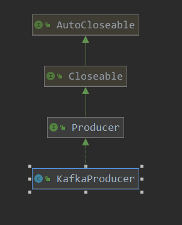

[TOC]

# producer发送(1)

本篇使用一个producer实例来分析一下客户端发送数据的实现.

```java
public static Properties initConfig(){
    Properties prop = new Properties();
    //prop.put(ProducerConfig.KEY_SERIALIZER_CLASS_CONFIG,"org.apache.kafka.common.serialization.StringSerializer");
    //prop.put(ProducerConfig.VALUE_SERIALIZER_CLASS_CONFIG,"org.apache.kafka.common.serialization.StringSerializer");
    prop.put(ProducerConfig.KEY_SERIALIZER_CLASS_CONFIG, StringSerializer.class.getName());
    prop.put(ProducerConfig.VALUE_SERIALIZER_CLASS_CONFIG,StringSerializer.class.getName());
    prop.put(ProducerConfig.ACKS_CONFIG,0);
    prop.put(ProducerConfig.BOOTSTRAP_SERVERS_CONFIG,brokers);
    // 设置分区器
    prop.put(ProducerConfig.PARTITIONER_CLASS_CONFIG,DemoPartitioner.class.getName());
    // 设置拦截器
    prop.put(ProducerConfig.INTERCEPTOR_CLASSES_CONFIG,DemoProducerInterceptor.class.getName());
    return prop;
}

public static void main(String[] args) throws ExecutionException, InterruptedException {
    Properties prop = initConfig();
    KafkaProducer<String, String> producer = new KafkaProducer<>(prop);
    ProducerRecord<String, String> record = new ProducerRecord<>(topic, "key", "value");
    // 同步发送消息
    Future<RecordMetadata> future = producer.send(record);
    RecordMetadata recordMetadata = future.get();
    recordMetadata.offset();  // 获取偏移量

    // 有回调函数的发送
    producer.send(record, new Callback() {
        @Override
        public void onCompletion(RecordMetadata recordMetadata, Exception e) {
            // 发送完后的回调函数
        }
    });
}
```

1. 先构建配置
2. 使用配置创建KafkaProducer，之后调用send进行发送。

下面就从KakfaProducer的构建方法和send方法入手，看一下其发送数据的真实实现。



```java
// 构造函数
public KafkaProducer(Properties properties) {
    this(propsToMap(properties), null, null, null, null, null, Time.SYSTEM);
}
```

```java
// 相当于是 主初始化函数
@SuppressWarnings("unchecked")
KafkaProducer(Map<String, Object> configs,
              Serializer<K> keySerializer,
              Serializer<V> valueSerializer,
              Metadata metadata,
              KafkaClient kafkaClient,
              ProducerInterceptors interceptors,
              Time time) {
    // 创建 producerConfig配置类,记录设置的配置
    ProducerConfig config = new ProducerConfig(ProducerConfig.addSerializerToConfig(configs, keySerializer,
                                                                                    valueSerializer));
    try {
        // 用户的配置
        Map<String, Object> userProvidedConfigs = config.originals();
        this.producerConfig = config;
        this.time = time;
        // client id
        String clientId = config.getString(ProducerConfig.CLIENT_ID_CONFIG);
        // 如果没有设置,则设置一个默认的
        if (clientId.length() <= 0)
            clientId = "producer-" + PRODUCER_CLIENT_ID_SEQUENCE.getAndIncrement();
        // 记录的 clientId
        this.clientId = clientId;
        // 记录事务ID
        String transactionalId = userProvidedConfigs.containsKey(ProducerConfig.TRANSACTIONAL_ID_CONFIG) ?
            (String) userProvidedConfigs.get(ProducerConfig.TRANSACTIONAL_ID_CONFIG) : null;
        // 日志配置
        LogContext logContext;
        if (transactionalId == null)
            logContext = new LogContext(String.format("[Producer clientId=%s] ", clientId));
        else
            logContext = new LogContext(String.format("[Producer clientId=%s, transactionalId=%s] ", clientId, transactionalId));
        // 记录日志
        log = logContext.logger(KafkaProducer.class);
        log.trace("Starting the Kafka producer");
        // 用于监测 信息记录
        Map<String, String> metricTags = Collections.singletonMap("client-id", clientId);
        MetricConfig metricConfig = new MetricConfig().samples(config.getInt(ProducerConfig.METRICS_NUM_SAMPLES_CONFIG))
            .timeWindow(config.getLong(ProducerConfig.METRICS_SAMPLE_WINDOW_MS_CONFIG), TimeUnit.MILLISECONDS)
            .recordLevel(Sensor.RecordingLevel.forName(config.getString(ProducerConfig.METRICS_RECORDING_LEVEL_CONFIG)))
            .tags(metricTags);
        List<MetricsReporter> reporters = config.getConfiguredInstances(ProducerConfig.METRIC_REPORTER_CLASSES_CONFIG,
                                                                        MetricsReporter.class,
                                                                        Collections.singletonMap(ProducerConfig.CLIENT_ID_CONFIG, clientId));
        reporters.add(new JmxReporter(JMX_PREFIX));
        this.metrics = new Metrics(metricConfig, reporters, time);
        // 分区器
        this.partitioner = config.getConfiguredInstance(ProducerConfig.PARTITIONER_CLASS_CONFIG, Partitioner.class);
        // 设置 重试间隔
        long retryBackoffMs = config.getLong(ProducerConfig.RETRY_BACKOFF_MS_CONFIG);
        // 序列化 器
        if (keySerializer == null) {
            this.keySerializer = config.getConfiguredInstance(ProducerConfig.KEY_SERIALIZER_CLASS_CONFIG,
                                                              Serializer.class);
            this.keySerializer.configure(config.originals(), true);
        } else {
            config.ignore(ProducerConfig.KEY_SERIALIZER_CLASS_CONFIG);
            this.keySerializer = keySerializer;
        }
        // value 序列化器
        if (valueSerializer == null) {
            this.valueSerializer = config.getConfiguredInstance(ProducerConfig.VALUE_SERIALIZER_CLASS_CONFIG,
                                                                Serializer.class);
            this.valueSerializer.configure(config.originals(), false);
        } else {
            config.ignore(ProducerConfig.VALUE_SERIALIZER_CLASS_CONFIG);
            this.valueSerializer = valueSerializer;
        }

        // load interceptors and make sure they get clientId
        userProvidedConfigs.put(ProducerConfig.CLIENT_ID_CONFIG, clientId);
        ProducerConfig configWithClientId = new ProducerConfig(userProvidedConfigs, false);
        // 记录拦截器
        List<ProducerInterceptor<K, V>> interceptorList = (List) configWithClientId.getConfiguredInstances(
            ProducerConfig.INTERCEPTOR_CLASSES_CONFIG, ProducerInterceptor.class);
        // 记录拦截器
        if (interceptors != null)
            this.interceptors = interceptors;
        else
            this.interceptors = new ProducerInterceptors<>(interceptorList);
        // 集群资源的监听器
        ClusterResourceListeners clusterResourceListeners = configureClusterResourceListeners(keySerializer,
                                                                                              valueSerializer, interceptorList, reporters);
        // 最大请求 大小
        this.maxRequestSize = config.getInt(ProducerConfig.MAX_REQUEST_SIZE_CONFIG);
        // 总的内存大小
        this.totalMemorySize = config.getLong(ProducerConfig.BUFFER_MEMORY_CONFIG);
        // 压缩类型
        this.compressionType = CompressionType.forName(config.getString(ProducerConfig.COMPRESSION_TYPE_CONFIG));
        // 最大 block 阻塞时间
        this.maxBlockTimeMs = config.getLong(ProducerConfig.MAX_BLOCK_MS_CONFIG);
        // 事务 管理器
        this.transactionManager = configureTransactionState(config, logContext, log);
        int deliveryTimeoutMs = configureDeliveryTimeout(config, log);
        // 版本信息
        this.apiVersions = new ApiVersions();
        //
        this.accumulator = new RecordAccumulator(logContext,
                                                 config.getInt(ProducerConfig.BATCH_SIZE_CONFIG),
                                                 this.compressionType,
                                                 lingerMs(config),
                                                 retryBackoffMs,
                                                 deliveryTimeoutMs,
                                                 metrics,
                                                 PRODUCER_METRIC_GROUP_NAME,
                                                 time,
                                                 apiVersions,
                                                 transactionManager,
                                                 new BufferPool(this.totalMemorySize, config.getInt(ProducerConfig.BATCH_SIZE_CONFIG), metrics, time, PRODUCER_METRIC_GROUP_NAME));
        // 获取配置的 bootstrap.servers 的地址
        List<InetSocketAddress> addresses = ClientUtils.parseAndValidateAddresses(
            config.getList(ProducerConfig.BOOTSTRAP_SERVERS_CONFIG),
            config.getString(ProducerConfig.CLIENT_DNS_LOOKUP_CONFIG));
        // 元数据
        if (metadata != null) {
            this.metadata = metadata;
        } else {
            this.metadata = new Metadata(retryBackoffMs, config.getLong(ProducerConfig.METADATA_MAX_AGE_CONFIG),
                                         true, true, clusterResourceListeners);
            this.metadata.bootstrap(addresses, time.milliseconds());
        }
        this.errors = this.metrics.sensor("errors");
        // 创建 发送器, 创建的此sender 是一个 runnable, 在一个线程中运行
        // -- 重点 ----
        this.sender = newSender(logContext, kafkaClient, this.metadata);
        // 配置一个 io线程的名字
        String ioThreadName = NETWORK_THREAD_PREFIX + " | " + clientId;
        // 创建一个线程,后天 daemon 运行,用于发送数据
        this.ioThread = new KafkaThread(ioThreadName, this.sender, true);
        // 线程开始运行了
        // 运行内容就是 sender
        this.ioThread.start();
        config.logUnused();
        AppInfoParser.registerAppInfo(JMX_PREFIX, clientId, metrics);
        log.debug("Kafka producer started");
    } catch (Throwable t) {
        // call close methods if internal objects are already constructed this is to prevent resource leak. see KAFKA-2121
        close(Duration.ofMillis(0), true);
        // now propagate the exception
        throw new KafkaException("Failed to construct kafka producer", t);
    }
}
```

此构造同样是比较长，大体分为以下几个部分：

1. 解析配置
2. 创建 RecordAccumulator，当producer发送数据时，并不是马上就发送了，而是先把数据暂存在Accumulator中
3.  常见sender，此是真正进行发送的操作类
4.  创建KafkaThread ，此是一个后台运行的线程，调用sender来周期性的进行数据的发送

首先看一下Accumulator的构造：

```java
// 累加器, 暂存要发送的数据
this.accumulator = new RecordAccumulator(logContext,
                                         config.getInt(ProducerConfig.BATCH_SIZE_CONFIG),
                                         this.compressionType,
                                         lingerMs(config),
                                         retryBackoffMs,
                                         deliveryTimeoutMs,
                                         metrics,
                                         PRODUCER_METRIC_GROUP_NAME,
                                         time,
                                         apiVersions,
                                         transactionManager,
                                         new BufferPool(this.totalMemorySize, config.getInt(ProducerConfig.BATCH_SIZE_CONFIG), metrics, time, PRODUCER_METRIC_GROUP_NAME));
```

```java
public BufferPool(long memory, int poolableSize, Metrics metrics, Time time, String metricGrpName) {
    // batch.size  就是 poolableSize
    this.poolableSize = poolableSize;
    this.lock = new ReentrantLock();
    // 空闲可用的 已分配的缓存
    this.free = new ArrayDeque<>();
    // 等待分配缓存的 condition
    this.waiters = new ArrayDeque<>();
    // 总的内存大小
    this.totalMemory = memory;
    // nonPooledAvailableMemory = 总的内存 - free的大小
    this.nonPooledAvailableMemory = memory;
    this.metrics = metrics;
    this.time = time;
    this.waitTime = this.metrics.sensor(WAIT_TIME_SENSOR_NAME);
    MetricName rateMetricName = metrics.metricName("bufferpool-wait-ratio",
                                                   metricGrpName,
                                                   "The fraction of time an appender waits for space allocation.");
    MetricName totalMetricName = metrics.metricName("bufferpool-wait-time-total",
                                                    metricGrpName,
                                                    "The total time an appender waits for space allocation.");
    this.waitTime.add(new Meter(TimeUnit.NANOSECONDS, rateMetricName, totalMetricName));
}
```

```java
public RecordAccumulator(LogContext logContext,
                         int batchSize,
                         CompressionType compression,
                         int lingerMs,
                         long retryBackoffMs,
                         int deliveryTimeoutMs,
                         Metrics metrics,
                         String metricGrpName,
                         Time time,
                         ApiVersions apiVersions,
                         TransactionManager transactionManager,
                         BufferPool bufferPool) {
    this.log = logContext.logger(RecordAccumulator.class);
    this.drainIndex = 0;
    this.closed = false;
    this.flushesInProgress = new AtomicInteger(0);
    this.appendsInProgress = new AtomicInteger(0);
    // 每个batch的大小 batch.size
    this.batchSize = batchSize;
    //  compression.type  压缩类型
    this.compression = compression;
    this.lingerMs = lingerMs;
    this.retryBackoffMs = retryBackoffMs;
    this.deliveryTimeoutMs = deliveryTimeoutMs;
    this.batches = new CopyOnWriteMap<>();
    // 内存池
    this.free = bufferPool;
    this.incomplete = new IncompleteBatches();
    this.muted = new HashMap<>();
    this.time = time;
    this.apiVersions = apiVersions;
    // 事务管理
    this.transactionManager = transactionManager;
    registerMetrics(metrics, metricGrpName);
}
```

创建client的操作:

```java
// 创建发送器
Sender newSender(LogContext logContext, KafkaClient kafkaClient, Metadata metadata) {
    // 最大 正在请求的 数量
    int maxInflightRequests = configureInflightRequests(producerConfig, transactionManager != null);
    // 请求超时时间
    int requestTimeoutMs = producerConfig.getInt(ProducerConfig.REQUEST_TIMEOUT_MS_CONFIG);
    // 创建 builder 工厂类
    ChannelBuilder channelBuilder = ClientUtils.createChannelBuilder(producerConfig, time);
    ProducerMetrics metricsRegistry = new ProducerMetrics(this.metrics);
    // 限流控制
    Sensor throttleTimeSensor = Sender.throttleTimeSensor(metricsRegistry.senderMetrics);
    // 网络IO 层
    // 这里呢,如果用户设置了,则使用用户设置的,没有设置,则创建使用默认的 NetworkClient
    KafkaClient client = kafkaClient != null ? kafkaClient : new NetworkClient(
        new Selector(producerConfig.getLong(ProducerConfig.CONNECTIONS_MAX_IDLE_MS_CONFIG),
                     this.metrics, time, "producer", channelBuilder, logContext),
        metadata,
        clientId,
        maxInflightRequests,
        producerConfig.getLong(ProducerConfig.RECONNECT_BACKOFF_MS_CONFIG),
        producerConfig.getLong(ProducerConfig.RECONNECT_BACKOFF_MAX_MS_CONFIG),
        producerConfig.getInt(ProducerConfig.SEND_BUFFER_CONFIG),
        producerConfig.getInt(ProducerConfig.RECEIVE_BUFFER_CONFIG),
        requestTimeoutMs,
        ClientDnsLookup.forConfig(producerConfig.getString(ProducerConfig.CLIENT_DNS_LOOKUP_CONFIG)),
        time,
        true,
        apiVersions,
        throttleTimeSensor,
        logContext);
    int retries = configureRetries(producerConfig, transactionManager != null, log);
    short acks = configureAcks(producerConfig, transactionManager != null, log);
    // 发送器
    // 此包装了 networkClient,实现了发送的真实业务逻辑
    return new Sender(logContext,
                      client,
                      metadata,
                      this.accumulator,
                      maxInflightRequests == 1,
                      producerConfig.getInt(ProducerConfig.MAX_REQUEST_SIZE_CONFIG),
                      acks,
                      retries,
                      metricsRegistry.senderMetrics,
                      time,
                      requestTimeoutMs,
                      producerConfig.getLong(ProducerConfig.RETRY_BACKOFF_MS_CONFIG),
                      this.transactionManager,
                      apiVersions);
}
```

现在看一下发送操作:

> org.apache.kafka.clients.producer.KafkaProducer#send(org.apache.kafka.clients.producer.ProducerRecord<K,V>)

```java
// 发送数据
@Override
public Future<RecordMetadata> send(ProducerRecord<K, V> record) {
    return send(record, null);
}
```

```java
// 数据发送
@Override
public Future<RecordMetadata> send(ProducerRecord<K, V> record, Callback callback) {
    // intercept the record, which can be potentially modified; this method does not throw exceptions
    // 先调用 拦截器 对 record 进行一些处理
    ProducerRecord<K, V> interceptedRecord = this.interceptors.onSend(record);
    // 只有再进行发送
    return doSend(interceptedRecord, callback);
}
```

> 

```java
// 实现的异步发送数据
private Future<RecordMetadata> doSend(ProducerRecord<K, V> record, Callback callback) {
    TopicPartition tp = null;
    try {
        // 如果已经关闭, 则抛出异常
        throwIfProducerClosed();
        // first make sure the metadata for the topic is available
        ClusterAndWaitTime clusterAndWaitTime;
        try {
            //1. 获取集群信息
            // 在这里会阻塞 等待
            clusterAndWaitTime = waitOnMetadata(record.topic(), record.partition(), maxBlockTimeMs);
        } catch (KafkaException e) {
            if (metadata.isClosed())
                throw new KafkaException("Producer closed while send in progress", e);
            throw e;
        }
        long remainingWaitMs = Math.max(0, maxBlockTimeMs - clusterAndWaitTime.waitedOnMetadataMs);
        Cluster cluster = clusterAndWaitTime.cluster;
        byte[] serializedKey;
        try {
            // 2.序列化 record中的 key
            serializedKey = keySerializer.serialize(record.topic(), record.headers(), record.key());
        } catch (ClassCastException cce) {
            throw new SerializationException("Can't convert key of class " + record.key().getClass().getName() +" to class " + producerConfig.getClass(ProducerConfig.KEY_SERIALIZER_CLASS_CONFIG).getName() + " specified in key.serializer", cce);
        }
        byte[] serializedValue;
        try {
            // 3. 序列化 record中的 value
            serializedValue = valueSerializer.serialize(record.topic(), record.headers(), record.value());
        } catch (ClassCastException cce) {
            throw new SerializationException("Can't convert value of class " + record.value().getClass().getName() +" to class " + producerConfig.getClass(ProducerConfig.VALUE_SERIALIZER_CLASS_CONFIG).getName() + " specified in value.serializer", cce);
        }
        // 4.获取分区
        int partition = partition(record, serializedKey, serializedValue, cluster);
        // 包装 topic 和partition
        tp = new TopicPartition(record.topic(), partition);
        // record header 是只读的
        setReadOnly(record.headers());
        // 获取请求头
        Header[] headers = record.headers().toArray();
        // 5.计算记录的大小
        int serializedSize = AbstractRecords.estimateSizeInBytesUpperBound(apiVersions.maxUsableProduceMagic(),compressionType, serializedKey, serializedValue, headers);
        ensureValidRecordSize(serializedSize);
        long timestamp = record.timestamp() == null ? time.milliseconds() : record.timestamp();
        log.trace("Sending record {} with callback {} to topic {} partition {}", record, callback, record.topic(), partition);
        // producer callback will make sure to call both 'callback' and interceptor callback
        Callback interceptCallback = new InterceptorCallback<>(callback, this.interceptors, tp);

        if (transactionManager != null && transactionManager.isTransactional())
            transactionManager.maybeAddPartitionToTransaction(tp);
        // 6.把要发送的数据 添加到 accumulator 中
        // -- 重点 ---
        RecordAccumulator.RecordAppendResult result = accumulator.append(tp, timestamp, serializedKey,serializedValue, headers, interceptCallback, remainingWaitMs);
        if (result.batchIsFull || result.newBatchCreated) {
            log.trace("Waking up the sender since topic {} partition {} is either full or getting a new batch", record.topic(), partition);
            this.sender.wakeup();
        }
        return result.future;
    }
```

看一下这里producer的发送操作:

1. 获取集群信息
2. 序列化 record中的key
3. 序列化record中的value
4. 获取分区，并包装topic和partition的信息
5. 计算序列化后的大小
6. 发送数据到 accumulator中

这里看一下1，4，6的操作。

获取集群信息：

> org.apache.kafka.clients.producer.KafkaProducer#waitOnMetadata

```java
// 等待集群 metadata
private ClusterAndWaitTime waitOnMetadata(String topic, Integer partition, long maxWaitMs) throws InterruptedException {
    // add topic to metadata topic list if it is not there already and reset expiry
    // 获取当前的集群信息
    // 其中很多都是默认的,node是根据bootstrap-server配置的到,其他topics都是空集合
    Cluster cluster = metadata.fetch();
    // 集群无效 topics 包含了此次使用的 topic,抛出错误
    if (cluster.invalidTopics().contains(topic))
        throw new InvalidTopicException(topic);
    // 记录 此topic
    metadata.add(topic);
    // 此 topic对应的 分区数
    Integer partitionsCount = cluster.partitionCountForTopic(topic);
    // Return cached metadata if we have it, and if the record's partition is either undefined
    // or within the known partition range
    if (partitionsCount != null && (partition == null || partition < partitionsCount))
        return new ClusterAndWaitTime(cluster, 0);
    // 开始时间
    long begin = time.milliseconds();
    long remainingWaitMs = maxWaitMs;
    long elapsed;
    // Issue metadata requests until we have metadata for the topic and the requested partition,
    // or until maxWaitTimeMs is exceeded. This is necessary in case the metadata
    // is stale and the number of partitions for this topic has increased in the meantime.
    do {
        if (partition != null) {
            log.trace("Requesting metadata update for partition {} of topic {}.", partition, topic);
        } else {
            log.trace("Requesting metadata update for topic {}.", topic);
        }
        metadata.add(topic);
        // -- ??????? ---
        // 这里进行了一个 请求,之后就唤醒 进行网络IO, 没看明白是如何发送请求的
        int version = metadata.requestUpdate();
        sender.wakeup();
        try {
            // 一个等待
            metadata.awaitUpdate(version, remainingWaitMs);
        } catch (TimeoutException ex) {
            // Rethrow with original maxWaitMs to prevent logging exception with remainingWaitMs
            throw new TimeoutException(
                String.format("Topic %s not present in metadata after %d ms.",
                              topic, maxWaitMs));
        }
        // 再次获取集群信息
        cluster = metadata.fetch();
        // 获取消耗的时间
        elapsed = time.milliseconds() - begin;
        // 大于最大时间, 抛出异常
        if (elapsed >= maxWaitMs) {
            throw new TimeoutException(partitionsCount == null ?String.format("Topic %s not present in metadata after %d ms.",topic, maxWaitMs) :String.format("Partition %d of topic %s with partition count %d is not present in metadata after %d ms.",partition, topic, partitionsCount, maxWaitMs));
        }
        if (cluster.unauthorizedTopics().contains(topic))
            throw new TopicAuthorizationException(topic);
        if (cluster.invalidTopics().contains(topic))
            throw new InvalidTopicException(topic);
        remainingWaitMs = maxWaitMs - elapsed;
        partitionsCount = cluster.partitionCountForTopic(topic);
    } while (partitionsCount == null || (partition != null && partition >= partitionsCount));

    return new ClusterAndWaitTime(cluster, elapsed);
}
```

这里是发送一个集群更新的requet到负载最小的node，用来更新集群信息，当然发送请求后也会进行等待。

> org.apache.kafka.clients.producer.KafkaProducer#partition

```java
// 默认的分区
private int partition(ProducerRecord<K, V> record, byte[] serializedKey, byte[] serializedValue, Cluster cluster) {
    // 如果 record中指定了 分区,那么就使用record中的分区
    Integer partition = record.partition();
    // 如果没有指定,则使用默认的分区策略 进行分区
    return partition != null ?
        partition :
    partitioner.partition(
        record.topic(), record.key(), serializedKey, record.value(), serializedValue, cluster);
}
```

> org.apache.kafka.clients.producer.internals.DefaultPartitioner#partition

```java
// 默认的分区策略
public int partition(String topic, Object key, byte[] keyBytes, Object value, byte[] valueBytes, Cluster cluster) {
    // 集群中 关于此 topic的分区信息
    List<PartitionInfo> partitions = cluster.partitionsForTopic(topic);
    // 分区数
    int numPartitions = partitions.size();
    if (keyBytes == null) {
        int nextValue = nextValue(topic);
        // 可用的分区数
        List<PartitionInfo> availablePartitions = cluster.availablePartitionsForTopic(topic);
        if (availablePartitions.size() > 0) {
            // 可用的分区数大于0, 则使用一个计数器 和 分区数取余, 相当于是 轮询发送
            int part = Utils.toPositive(nextValue) % availablePartitions.size();
            return availablePartitions.get(part).partition();
        } else {
            // no partitions are available, give a non-available partition
            // 没有可用的分区,则使用给定的分区数
            // 此同样是使用 累加器 取余, 效果类似于 轮询
            return Utils.toPositive(nextValue) % numPartitions;
        }
    } else {
        // hash the keyBytes to choose a partition
        return Utils.toPositive(Utils.murmur2(keyBytes)) % numPartitions;
    }
}
```

分区数也得到了，下面看下追加到累加器的操作：

> org.apache.kafka.clients.producer.internals.RecordAccumulator#append

```java
// 追加消息到 accumlator中
public RecordAppendResult append(TopicPartition tp,
                                 long timestamp,
                                 byte[] key,
                                 byte[] value,
                                 Header[] headers,
                                 Callback callback,
                                 long maxTimeToBlock) throws InterruptedException {
    // We keep track of the number of appending thread to make sure we do not miss batches in
    // abortIncompleteBatches().
    // 等待处理的个数
    appendsInProgress.incrementAndGet();
    ByteBuffer buffer = null;
    if (headers == null) headers = Record.EMPTY_HEADERS;
    try {
        // check if we have an in-progress batch
        // 1. 获取 tp 对应的队列,此队列用于存储要发送的数据
        Deque<ProducerBatch> dq = getOrCreateDeque(tp);
        synchronized (dq) {
            // 如果关闭了,则抛出异常
            if (closed)
                throw new KafkaException("Producer closed while send in progress");
            // 2.尝试追加数据到 dq 队列中
            // 第一次一般是队列为null,故而第一次应该是在下面执行的
         RecordAppendResult appendResult = tryAppend(timestamp, key, value, headers, callback, dq);
            // 返回追加的结果
            if (appendResult != null)
                return appendResult;
        }

        // we don't have an in-progress record batch try to allocate a new batch
        byte maxUsableMagic = apiVersions.maxUsableProduceMagic();
        int size = Math.max(this.batchSize, AbstractRecords.estimateSizeInBytesUpperBound(maxUsableMagic, compression, key, value, headers));
        log.trace("Allocating a new {} byte message buffer for topic {} partition {}", size, tp.topic(), tp.partition());
        // 3. 内存分配
        // --- 重点 ---
        buffer = free.allocate(size, maxTimeToBlock);
        synchronized (dq) {
            // Need to check if producer is closed again after grabbing the dequeue lock.
            if (closed)
                throw new KafkaException("Producer closed while send in progress");
            // 再次尝试添加,添加成功后,就直接返回了
          RecordAppendResult appendResult = tryAppend(timestamp, key, value, headers, callback, dq);
            if (appendResult != null) {
                return appendResult;
            }
            // 4. 内存记录建造起   memoryRecordBuilder
            // 最终是使用此 builder 来把record 写入到  producerBatch 中的
            MemoryRecordsBuilder recordsBuilder = recordsBuilder(buffer, maxUsableMagic);
            // 5. 创建一个 ProducerBatch
            // 此producerBatch 主要就是用来存储一批的 record
            ProducerBatch batch = new ProducerBatch(tp, recordsBuilder, time.milliseconds());
            // 6.添加记录到  此创建的 producerBatch 中
            FutureRecordMetadata future = Utils.notNull(batch.tryAppend(timestamp, key, value, headers, callback, time.milliseconds()));
            // 7.记录此 producerBatch
            dq.addLast(batch);
            // 记录此batch到 未完成 容器中
            incomplete.add(batch);
            buffer = null;
            return new RecordAppendResult(future, dq.size() > 1 || batch.isFull(), true);
        }
    } finally {
        if (buffer != null)
            free.deallocate(buffer);
        appendsInProgress.decrementAndGet();
    }
}
```

这里操作主要还是把record记录追加到一个ProducerBatch中，并把此batch添加到一个 topicPartition对应的DelayQueue中，主要操作如下：

1. 先尝试获取topicPartition对应的队列，此队列主要是存储要发送到此topic分区的数据
2. 尝试添加数据到此队列中，不过第一次一般队列为null
3. 分配内存，此内存是真实存储数据的，类型为byteBuffer
4.  创建MemoryRecordsBuilder， 此主要是实现了把数据记录到buffer的功能
5. 创建producerBathc
6. 添加数据到此 刚创建的 produceBatch
7. 记录此刚创建的 produceBatch

限于篇幅，新开一篇继续分析。


