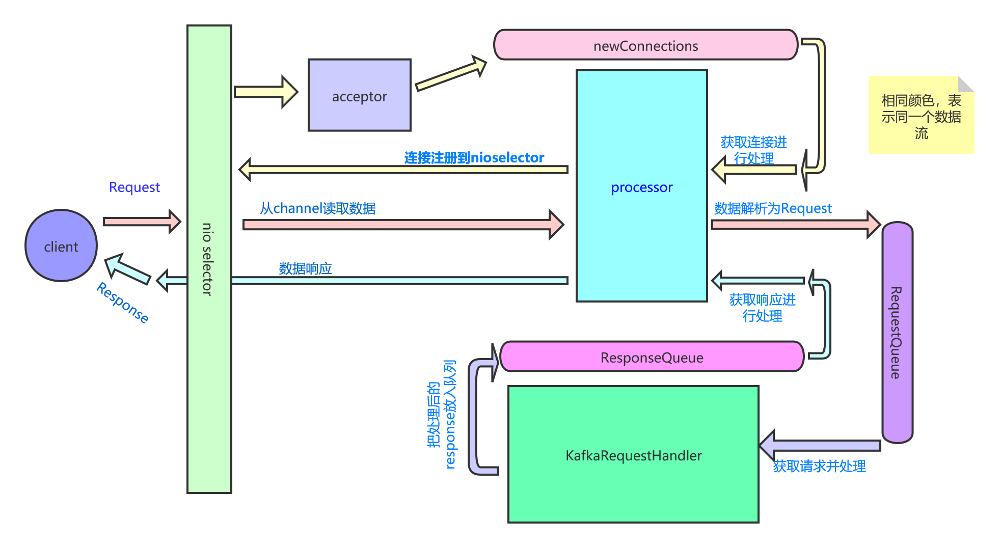

[TOC]

# kafka-server端的网络IO总览

本篇咱们来看一下高效，稳定的kafka-server端是如何实现的？其总体的网络IO架构是怎样的。本篇对涉及到kafka相关的协议处理不会展开说明，后续会有专门的文章来说，本篇主要是总览一下kafka是如何使用java nio来达到高效的。

直接从main类开始入手吧。

> kafka.Kafka#main

```scala
def main(args: Array[String]): Unit = {
    try {
        // 解析 args中的参数
        val serverProps = getPropsFromArgs(args)
        // 使用解析的配置 创建 kafkaServerStartable
        val kafkaServerStartable = KafkaServerStartable.fromProps(serverProps)

        try {
            if (!OperatingSystem.IS_WINDOWS && !Java.isIbmJdk)
            new LoggingSignalHandler().register()
        } catch {
            case e: ReflectiveOperationException =>
            warn("Failed to register optional signal handler that logs a message when the process is terminated " +
                 s"by a signal. Reason for registration failure is: $e", e)
        }
        // 注册回调方法
        Runtime.getRuntime().addShutdownHook(new Thread("kafka-shutdown-hook") {
            override def run(): Unit = kafkaServerStartable.shutdown()
        })
        //  启动
        kafkaServerStartable.startup()
        kafkaServerStartable.awaitShutdown()
    }
```

> kafka.server.KafkaServerStartable#startup

```scala
// server类
// 构造函数
private val server = new KafkaServer(staticServerConfig, kafkaMetricsReporters = reporters)

// server 端的 启动
def startup() {
    try server.startup()
    catch {
        case _: Throwable =>
        fatal("Exiting Kafka.")
        Exit.exit(1)
    }
}
```

到这里服务就启动了，可以看到服务是通过调用KafkaServer.startUp 来真正运行的，下面先来看一下此KafkaServer类的初始化函数和startup方法的实现。

初始化：

> kafka.server.KafkaServer

```scala
class KafkaServer(val config: KafkaConfig, time: Time = Time.SYSTEM, threadNamePrefix: Option[String] = None,
                  kafkaMetricsReporters: Seq[KafkaMetricsReporter] = List()) extends Logging with KafkaMetricsGroup {
    // 构造函数
    // 是否完全启动
    private val startupComplete = new AtomicBoolean(false)
    // 是否正在关闭
    private val isShuttingDown = new AtomicBoolean(false)
    // 是否正在启动
    private val isStartingUp = new AtomicBoolean(false)
    // 关闭 latch
    private var shutdownLatch = new CountDownLatch(1)
    // jmx 前缀
    private val jmxPrefix: String = "kafka.server"

    private var logContext: LogContext = null

    var metrics: Metrics = null
    // broker state 状态
    val brokerState: BrokerState = new BrokerState
    // 数据--请求处理器
    var dataPlaneRequestProcessor: KafkaApis = null
    // 控制器 -- 请求处理器
    var controlPlaneRequestProcessor: KafkaApis = null
    // 授权 权限验证
    var authorizer: Option[Authorizer] = None
    // sockerServer
    var socketServer: SocketServer = null
    // 数据 - 请求处理 线程池
    var dataPlaneRequestHandlerPool: KafkaRequestHandlerPool = null
    // 控制 -- 请求 处理线程池
    var controlPlaneRequestHandlerPool: KafkaRequestHandlerPool = null

    var logDirFailureChannel: LogDirFailureChannel = null
    // 对log的管理
    var logManager: LogManager = null
    // 备份管理
    var replicaManager: ReplicaManager = null
    //
    var adminManager: AdminManager = null
    // token 管理 ??
    var tokenManager: DelegationTokenManager = null
    // 动态配置 处理
    var dynamicConfigHandlers: Map[String, ConfigHandler] = null
    // 动态配置 管理
    var dynamicConfigManager: DynamicConfigManager = null
    var credentialProvider: CredentialProvider = null
    var tokenCache: DelegationTokenCache = null
    // 组协调器
    var groupCoordinator: GroupCoordinator = null
    /// 事务协调器
    var transactionCoordinator: TransactionCoordinator = null
    // 控制器
    var kafkaController: KafkaController = null
    // 调度器, 此是一个线程池,其中运行了各种任务:
    // 1. 日志 flush retain delete 线程
    // 2. replica 中 isr 改变 线程
    var kafkaScheduler: KafkaScheduler = null

    var metadataCache: MetadataCache = null
    //
    var quotaManagers: QuotaFactory.QuotaManagers = null
    /// zk 客户端
    private var _zkClient: KafkaZkClient = null
    // 相关性 id
    val correlationId: AtomicInteger = new AtomicInteger(0)
    // broker 的源数据
    val brokerMetaPropsFile = "meta.properties"
    // 
    val brokerMetadataCheckpoints = config.logDirs.map(logDir => (logDir, new BrokerMetadataCheckpoint(new File(logDir + File.separator + brokerMetaPropsFile)))).toMap

    private var _clusterId: String = null
    private var _brokerTopicStats: BrokerTopicStats = null
 	... // 省略其他非关键代码   
}
```

> kafka.server.KafkaServer#startup

startup方法的实现，此函数体比较长，做了很多的工作，这里就不全贴出来，看主要代码：

```scala
    // 开始启动
  def startup() {
    try {
      info("starting")
     // 如果正在关闭中,则不能再次启动
      if (isShuttingDown.get)
        throw new IllegalStateException("Kafka server is still shutting down, cannot re-start!")
      // 如果已经启动,则不能再次启动
      if (startupComplete.get)
        return

      val canStartup = isStartingUp.compareAndSet(false, true)
      // 设置当前broker 状态为 starting
      if (canStartup) {
        brokerState.newState(Starting)

        /* setup zookeeper */
        // 初始化和 zk 的连接
        // 并递归创建 zk上层节点信息
        initZkClient(time)

        /* Get or create cluster_id */
        // 集群id 信息, uuid值的base64
        _clusterId = getOrGenerateClusterId(zkClient)
        info(s"Cluster ID = $clusterId")

        /* generate brokerId */
        // 读取 log 目录下的 meta.properties 文件内容
        val (brokerId, initialOfflineDirs) = getBrokerIdAndOfflineDirs
        config.brokerId = brokerId
        logContext = new LogContext(s"[KafkaServer id=${config.brokerId}] ")
        // log 前缀
        this.logIdent = logContext.logPrefix

        // initialize dynamic broker configs from ZooKeeper. Any updates made after this will be
        // applied after DynamicConfigManager starts.
        // 读取 zk中的配置
        config.dynamicConfig.initialize(zkClient)

        /* start scheduler */
        kafkaScheduler = new KafkaScheduler(config.backgroundThreads)
        // 初始化 kafkaScheduler ,创建线程池
        kafkaScheduler.startup()

        /* start log manager */
        // logmanager
        // 初始化 会加载 log
        logManager = LogManager(config, initialOfflineDirs, zkClient, brokerState, kafkaScheduler, time, brokerTopicStats, logDirFailureChannel)
        // 开启后台 日志 flush 保留 日志清理 等线程
        logManager.startup()

		// ---- 重点 -----
          // 这里创建了 nioselector即acceptor 和 processor处理器
        socketServer = new SocketServer(config, metrics, time, credentialProvider)
        socketServer.startup(startupProcessors = false)

        /* start replica manager */
        replicaManager = createReplicaManager(isShuttingDown)
        replicaManager.startup()

        /* start kafka controller */
        // 创建 控制器  并进行启动
        kafkaController = new KafkaController(config, zkClient, time, metrics, brokerInfo, brokerEpoch, tokenManager, threadNamePrefix)
        // 启动时  竞选 controller
        kafkaController.startup()

        // fetch 管理器
        val fetchManager = new FetchManager(Time.SYSTEM,
          new FetchSessionCache(config.maxIncrementalFetchSessionCacheSlots,
            KafkaServer.MIN_INCREMENTAL_FETCH_SESSION_EVICTION_MS))

        /* start processing requests */
          // kafkaApis 如果类比的话: 和spring中的 dispatcherservlet 很相似, 路由各种request到真正的处理器
        dataPlaneRequestProcessor = new KafkaApis(socketServer.dataPlaneRequestChannel, replicaManager, adminManager, groupCoordinator, transactionCoordinator, kafkaController, zkClient, config.brokerId, config, metadataCache, metrics, authorizer, quotaManagers,
          fetchManager, brokerTopicStats, clusterId, time, tokenManager)
        // 线程数 num.io.threads
          // 此创建了多个处理线程, 对接收到的数据 调用KafkaApis 来进行处理
        dataPlaneRequestHandlerPool = new KafkaRequestHandlerPool(config.brokerId, socketServer.dataPlaneRequestChannel, dataPlaneRequestProcessor, time,config.numIoThreads, s"${SocketServer.DataPlaneMetricPrefix}RequestHandlerAvgIdlePercent", SocketServer.DataPlaneThreadPrefix)
		
          // 控制器 的处理
        socketServer.controlPlaneRequestChannelOpt.foreach { controlPlaneRequestChannel =>
          controlPlaneRequestProcessor = new KafkaApis(controlPlaneRequestChannel, replicaManager, adminManager, groupCoordinator, transactionCoordinator, kafkaController, zkClient, config.brokerId, config, metadataCache, metrics, authorizer, quotaManagers,
            fetchManager, brokerTopicStats, clusterId, time, tokenManager)

          controlPlaneRequestHandlerPool = new KafkaRequestHandlerPool(config.brokerId, socketServer.controlPlaneRequestChannelOpt.get, controlPlaneRequestProcessor, time,
1, s"${SocketServer.ControlPlaneMetricPrefix}RequestHandlerAvgIdlePercent", SocketServer.ControlPlaneThreadPrefix)
        }
		// 省略非非必要code
      }
```

这里涉及到的几个类就是server端的网络IO架构的各个组件，下面对各个组件一一讲述，了解其作用。

## SocketServer 的创建及启动

> kafka.network.SocketServer#startup

```scala
socketServer.startup(startupProcessors = false)

def startup(startupProcessors: Boolean = true) {
    this.synchronized {
      // 每个ip的连接限制
      connectionQuotas = new ConnectionQuotas(config.maxConnectionsPerIp, config.maxConnectionsPerIpOverrides)
      // control.plane.listener.name 的值
      // 此是 创建  控制器相关的 acceptor 和 processor
      createControlPlaneAcceptorAndProcessor(config.controlPlaneListener)
      // 此是 创建 data plane 即 数据处理相关的
      createDataPlaneAcceptorsAndProcessors(config.numNetworkThreads, config.dataPlaneListeners)
        //  这里没有启动
      if (startupProcessors) {
        startControlPlaneProcessor()
        startDataPlaneProcessors()
      }
    }
      // ...  省略 非关键code
  }
```

这里短短的三行代码，主要关键的是createControlPlaneAcceptorAndProcessor  和  createDataPlaneAcceptorsAndProcessors；createControlPlaneAcceptorAndProcessor函数创建了针对controller的nioselector 线程用于接收连接和对连接的处理processor；createDataPlaneAcceptorsAndProcessors是创建了针对数据处理相关的nioselector和processor。此两个函数执行完成后，就可以接收相关对controller的连接和数据请求的连接。

具体看一下处理：

> kafka.network.SocketServer#createControlPlaneAcceptorAndProcessor

```scala
  // 创建控制器相关的 端口监听  和 处理器 processor
  private def createControlPlaneAcceptorAndProcessor(endpointOpt: Option[EndPoint]): Unit = synchronized {
    endpointOpt.foreach { endpoint =>
      // 1.创建 nio selector  serverSocketChannel
      val controlPlaneAcceptor = createAcceptor(endpoint, ControlPlaneMetricPrefix)
      // 2.创建 selector 对新接入的连接 处理
      val controlPlaneProcessor = newProcessor(nextProcessorId, controlPlaneRequestChannelOpt.get, connectionQuotas, endpoint.listenerName, endpoint.securityProtocol, memoryPool)
        // 信息记录
      controlPlaneAcceptorOpt = Some(controlPlaneAcceptor)
      controlPlaneProcessorOpt = Some(controlPlaneProcessor)
      val listenerProcessors = new ArrayBuffer[Processor]()
      listenerProcessors += controlPlaneProcessor
        // 添加 controller processor
      controlPlaneRequestChannelOpt.foreach(_.addProcessor(controlPlaneProcessor))
      nextProcessorId += 1
        // 添加此 processor 到 acceptor
        // 此添加操作,就会启动对应的processor
      controlPlaneAcceptor.addProcessors(listenerProcessors, ControlPlaneThreadPrefix)
      // 3.nio selector 启动
      KafkaThread.nonDaemon(s"${ControlPlaneThreadPrefix}-kafka-socket-acceptor-${endpoint.listenerName}-${endpoint.securityProtocol}-${endpoint.port}", controlPlaneAcceptor).start()
      // 防止线程 退出
      controlPlaneAcceptor.awaitStartup()
      info(s"Created control-plane acceptor and processor for endpoint : $endpoint")
    }
  }
```

> kafka.network.SocketServer#createAcceptor

```scala
// 连接器
private def createAcceptor(endPoint: EndPoint, metricPrefix: String) : Acceptor = synchronized {
    val sendBufferSize = config.socketSendBufferBytes
    val recvBufferSize = config.socketReceiveBufferBytes
    val brokerId = config.brokerId
    // 创建nioselector 以及 serverSocketChannel
    new Acceptor(endPoint, sendBufferSize, recvBufferSize, brokerId, connectionQuotas, metricPrefix)
}
```

```scala
// 连接器  接收连接
private[kafka] class Acceptor(val endPoint: EndPoint,
                              val sendBufferSize: Int,
                              val recvBufferSize: Int,
                              brokerId: Int,
                              connectionQuotas: ConnectionQuotas,
                              metricPrefix: String) extends AbstractServerThread(connectionQuotas) with KafkaMetricsGroup {
    // nio selector 实例
    // 其中重点主要这里, 这里创建了 nioselector
    private val nioSelector = NSelector.open()
    val serverChannel = openServerSocket(endPoint.host, endPoint.port)
    // 处理器 数组
    private val processors = new ArrayBuffer[Processor]()
    private val processorsStarted = new AtomicBoolean
    private val blockedPercentMeter = newMeter(s"${metricPrefix}AcceptorBlockedPercent",
                                               "blocked time", TimeUnit.NANOSECONDS, Map(ListenerMetricTag -> endPoint.listenerName.value))
 	// 略 code   
}
```

> kafka.network.SocketServer#newProcessor

```scala
// `protected` for test usage
protected[network] def newProcessor(id: Int, requestChannel: RequestChannel, connectionQuotas: ConnectionQuotas, listenerName: ListenerName,
                                    securityProtocol: SecurityProtocol, memoryPool: MemoryPool): Processor = {
    new Processor(id,
                  time,
                  config.socketRequestMaxBytes,
                  requestChannel,
                  connectionQuotas,
                  config.connectionsMaxIdleMs,
                  config.failedAuthenticationDelayMs,
                  listenerName,
                  securityProtocol,
                  config,
                  metrics,
                  credentialProvider,
                  memoryPool,
                  logContext
                 )
}
```

把创建的processor添加到acceptor时，就会启动一个线程来运行processor:

> kafka.network.Acceptor#addProcessors

```scala
  // 添加处理器到 acceptor中
  private[network] def addProcessors(newProcessors: Buffer[Processor], processorThreadPrefix: String): Unit = synchronized {
    processors ++= newProcessors
    if (processorsStarted.get)
      startProcessors(newProcessors, processorThreadPrefix)
  }
 

  //  启动 processor
  private def startProcessors(processors: Seq[Processor], processorThreadPrefix: String): Unit = synchronized {
    processors.foreach { processor =>
      KafkaThread.nonDaemon(s"${processorThreadPrefix}-kafka-network-thread-$brokerId-${endPoint.listenerName}-${endPoint.securityProtocol}-${processor.id}",
        processor).start()
    }
  }
```

> org.apache.kafka.common.utils.KafkaThread#nonDaemon

```scala
// 创建线程 运行 runnable
public static KafkaThread nonDaemon(final String name, Runnable runnable) {
    return new KafkaThread(name, runnable, false);
}
```

下面createDataPlaneAcceptorsAndProcessors对 数据请求的acceptor和processor的创建类似。既然创建了acceptor又创建了processor，那么对于新连接是如何处理的，其具体又做了什么工作呢？下面就看一下acceptor和 processor具体内容，直接看一下其run 方法。

> kafka.network.Acceptor#run

```scala
  def run() {
    // 注册 serverSocketChannel 到 nioselector中
    serverChannel.register(nioSelector, SelectionKey.OP_ACCEPT)
    startupComplete()
    try {
      var currentProcessorIndex = 0
      while (isRunning) {
        try {
          val ready = nioSelector.select(500)
          if (ready > 0) {
            val keys = nioSelector.selectedKeys()
            val iter = keys.iterator()
            while (iter.hasNext && isRunning) {
              try {
                val key = iter.next
                iter.remove()
                if (key.isAcceptable) {
                  // 1. 接收 新的连接
                  accept(key).foreach { socketChannel =>
                    var retriesLeft = synchronized(processors.length)
                    var processor: Processor = null
                    do {
                      retriesLeft -= 1
                      processor = synchronized {
                        currentProcessorIndex = currentProcessorIndex % processors.length
                        // 2.从acceptor注册的processor中获取一个
                        processors(currentProcessorIndex)
                      }
                      currentProcessorIndex += 1
                      // 3. assignNewConnection 分配新连接
                    } while (!assignNewConnection(socketChannel, processor, retriesLeft == 0))
                  }
                } else
                  throw new IllegalStateException("Unrecognized key state for acceptor thread.")
              } catch {
                case e: Throwable => error("Error while accepting connection", e)
              }
            }
          }
        }
        catch {
          // 
        }
      }
    } finally {
      CoreUtils.swallow(serverChannel.close(), this, Level.ERROR)
      CoreUtils.swallow(nioSelector.close(), this, Level.ERROR)
      shutdownComplete()
    }
  }
```

看到通过nioselector来获取就绪的key，通过accept函数来接收连接，之后从注册的processor中获取一个然后通过assignNewConnection调用processor对连接进一步处理。

看那一下连接的接收：

> kafka.network.Acceptor#accept

```scala
  private def accept(key: SelectionKey): Option[SocketChannel] = {
    // 接收操作
    val serverSocketChannel = key.channel().asInstanceOf[ServerSocketChannel]
    val socketChannel = serverSocketChannel.accept()
    try {
      connectionQuotas.inc(socketChannel.socket().getInetAddress)
      // 接收后, 并对接收到的 socket 进行一些 配置
      socketChannel.configureBlocking(false)
      socketChannel.socket().setTcpNoDelay(true)
      socketChannel.socket().setKeepAlive(true)
      if (sendBufferSize != Selectable.USE_DEFAULT_BUFFER_SIZE)
        socketChannel.socket().setSendBufferSize(sendBufferSize)
      Some(socketChannel)
    } catch {
      case e: TooManyConnectionsException =>
        // .....
        None
    }
  }
```

经典的nio接收操作，增加了一些对接收到达额socket的配置。

> kafka.network.Acceptor#assignNewConnection

```scala
  // 主要是调用 processor 来对连接进行进一步的处理
  private def assignNewConnection(socketChannel: SocketChannel, processor: Processor, mayBlock: Boolean): Boolean = {
    if (processor.accept(socketChannel, mayBlock, blockedPercentMeter)) {
      debug(s"Accepted connection from ${socketChannel.socket.getRemoteSocketAddress} on" +
        s" ${socketChannel.socket.getLocalSocketAddress} and assigned it to processor ${processor.id}," +
        s" sendBufferSize [actual|requested]: [${socketChannel.socket.getSendBufferSize}|$sendBufferSize]" +
        s" recvBufferSize [actual|requested]: [${socketChannel.socket.getReceiveBufferSize}|$recvBufferSize]")
      true
    } else
      false
  }
```

> kafka.network.Processor#accept

```scala
// 存储一个新的连接到队列中
def accept(socketChannel: SocketChannel,
           mayBlock: Boolean,
           acceptorIdlePercentMeter: com.yammer.metrics.core.Meter): Boolean = {
    // 这里放入队列使用了两种方式
    // 1. 第一个直接放入,不会阻塞,有可能失败
    // 2. 如果队列满了,则阻塞,直到队列空闲成功放入
    val accepted = {
        if (newConnections.offer(socketChannel))
        true
        else if (mayBlock) {
            val startNs = time.nanoseconds
            newConnections.put(socketChannel)
            acceptorIdlePercentMeter.mark(time.nanoseconds() - startNs)
            true
        } else
        false
    }
    if (accepted)
    wakeup()
    accepted
}
```

看到，这里对于新连接的处理，主要是存储到newConnections队列中，到此此部分对连接的处理就完成了。

接着看一下processor线程的处理:

> kafka.network.Processor#run

```scala
override def run() {
    // 开始运行
    startupComplete()
    try {
        while (isRunning) {
            try {
                // setup any new connections that have been queued up
                // 把newConnections 中的连接 注册到nioselector上, 事件为SelectionKey.OP_READ
                configureNewConnections()
                // register any new responses for writing
                // 处理等待处理的response, 需要发送的响应则发送到对应kafkaChannel的 send字段,准备发送
                // closeReponse,则关闭对应的channel 等
                processNewResponses()
                // 对channel进行读写操作
                // 1. 如果有写操作,则把数据写出
                // 2. 如果有读操作,则把数据读出,并读取到 networkReceive,并记录下来
                poll()
                // 处理记录读取到的数据
                processCompletedReceives()
                // 处理那些已经发送完成的 sends
                processCompletedSends()
                // 对失联连接的处理
                processDisconnected()
            } catch {
			// ...
            }
        }
    } finally {
        debug(s"Closing selector - processor $id")
        CoreUtils.swallow(closeAll(), this, Level.ERROR)
        shutdownComplete()
    }
}
```

此操作中主要调用了6个函数，这6个函数，每一个都很重要，由此可见此函数处理逻辑同样是很重要。上面的注释都大概解析了每个函数的大体功能，由于每个函数都很重要，下面就挨个看一下：

> kafka.network.Processor#configureNewConnections

```scala
    // 配置新连接
    // 1. 把newConnections中的新连接 封装到 kafkakChannel中
    // 2. 并把新连接注册到 nioselector中, 感兴趣事件为 SelectionKey.OP_READ
    // 3. 注册channel 到 idleExpireManager
  private def configureNewConnections() {
    var connectionsProcessed = 0
    // 把newConnections 队列中接收的socketChannel 注册到 nioselector中
    while (connectionsProcessed < connectionQueueSize && !newConnections.isEmpty) {
      val channel = newConnections.poll()
      try {
        // 把channel 注册到 nioselector 中
        selector.register(connectionId(channel.socket), channel)
        connectionsProcessed += 1
      } catch {
        case e: Throwable =>
          val remoteAddress = channel.socket.getRemoteSocketAddress
          close(channel)
          processException(s"Processor $id closed connection from $remoteAddress", e)
      }
    }
  }
```

此操作主要是把acceptor中接收的连接注册到 nioselector中，看一下：

> org.apache.kafka.common.network.Selector#register

```scala
// 注册 nio 连接到 nioselector 上
public void register(String id, SocketChannel socketChannel) throws IOException {
    // 保证此id 对应的socketChannel 没有注册过
    ensureNotRegistered(id);
    // 注册channel到 nioselector中
    // 注册这里感兴趣的事件是 SelectionKey.OP_READ
    registerChannel(id, socketChannel, SelectionKey.OP_READ);
    this.sensors.connectionCreated.record();
}

// 注册 socketChannel到 selector的操作
protected SelectionKey registerChannel(String id, SocketChannel socketChannel, int interestedOps) throws IOException {
    // 注册 socketChannel 到 nioselector
    // 真正的注册操作
    SelectionKey key = socketChannel.register(nioSelector, interestedOps);
    // 1.创建kafkaChannel,进一步封装 socketChannel
    // 2.把创建的 kafkaChannel attach到 selectKey上
    KafkaChannel channel = buildAndAttachKafkaChannel(socketChannel, id, key);
    // 记录创建的channel
    this.channels.put(id, channel);
    // 如果有 idle 管理器,则更新此 channel的 时间
    // 由此可见,注册channel时, 就已经把channel放入到了 idleExpireManager中的 lru中,并记录了对应的时间
    if (idleExpiryManager != null)
    idleExpiryManager.update(channel.id(), time.nanoseconds());
    return key;
}
```

这里看到把接收到的socketChannel注册到 nioselector中，并且注册事件为SelectionKey.OP_READ。这里使用kafkaChannel包装了socketChannel，如果使用了idleExpireManger则把kafkaChannel也注册到 idleExpireManager中的lru中。重点就是那些经典的Nio操作。

> kafka.network.Processor#processNewResponses

```scala
  // 处理新的response,即把处理好的 response 传输出去
  private def processNewResponses() {
    var currentResponse: RequestChannel.Response = null
    // 从responseQueue队列中 获取 待处理的响应
    while ({currentResponse = dequeueResponse(); currentResponse != null}) {
      val channelId = currentResponse.request.context.connectionId
      try {
        currentResponse match {
          case response: NoOpResponse =>
            updateRequestMetrics(response)
            trace(s"Socket server received empty response to send, registering for read: $response")
            handleChannelMuteEvent(channelId, ChannelMuteEvent.RESPONSE_SENT)
            // 把channel  unmute
            tryUnmuteChannel(channelId)

          case response: SendResponse =>
            sendResponse(response, response.responseSend)
          case response: CloseConnectionResponse =>
            updateRequestMetrics(response)
            trace("Closing socket connection actively according to the response code.")
            // 如果是关闭的 response,则把对应的channel 进行关闭
            close(channelId)
          case _: StartThrottlingResponse =>
            // 开始限流
            handleChannelMuteEvent(channelId, ChannelMuteEvent.THROTTLE_STARTED)
          case _: EndThrottlingResponse =>
            // 结束 限流
            handleChannelMuteEvent(channelId, ChannelMuteEvent.THROTTLE_ENDED)
            tryUnmuteChannel(channelId)
          case _ =>
            throw new IllegalArgumentException(s"Unknown response type: ${currentResponse.getClass}")
        }
      } catch {
          // 
      }
    }
  }


  private def dequeueResponse(): RequestChannel.Response = {
    // 从队列中获取 响应
    val response = responseQueue.poll()
    if (response != null)
      response.request.responseDequeueTimeNanos = Time.SYSTEM.nanoseconds
    response
  }
```

此函数要是对responseQueue队列中的response响应进行处理，继续看处理方法：

> kafka.network.Processor#sendResponse

```scala
  protected[network] def sendResponse(response: RequestChannel.Response, responseSend: Send) {
    // 获取到 connectionId
    val connectionId = response.request.context.connectionId
    trace(s"Socket server received response to send to $connectionId, registering for write and sending data: $response")
    if (channel(connectionId).isEmpty) {
      warn(s"Attempting to send response via channel for which there is no open connection, connection id $connectionId")
      response.request.updateRequestMetrics(0L, response)
    }
    if (openOrClosingChannel(connectionId).isDefined) {
      // 把responseSend 设置到 kafkaChannel上, 准备发送
      selector.send(responseSend)
      // 记录正在路上的响应
      inflightResponses += (connectionId -> response)
    }
  }
```

可以看到，此和producer中的相似，针对sendResponse处理方式为 把responseSend 设置到kafkaChannel中的send字段，等待下次网络io时发送。

> kafka.network.Processor#poll

```scala
  //  对channel的处理,包括写数据 读数据
  private def poll() {
    val pollTimeout = if (newConnections.isEmpty) 300 else 0
    try selector.poll(pollTimeout)
    catch {
      case e @ (_: IllegalStateException | _: IOException) =>
        // The exception is not re-thrown and any completed sends/receives/connections/disconnections
        // from this poll will be processed.
        error(s"Processor $id poll failed", e)
    }
  }
```

这里调用org.apache.kafka.common.network.Selector#poll函数，来记性具体的网络IO操作，此和producer的真正网络IO就一样了，就不展开了。

> 

```scala
  // 处理 那些接收完成的 buffer
  private def processCompletedReceives() {
    // 遍历所有读取的数据
    selector.completedReceives.asScala.foreach { receive =>
      try {
        // 获取 对应的kafkaChannel
        openOrClosingChannel(receive.source) match {
          case Some(channel) =>
            // 获取解析到的 请求头
            val header = RequestHeader.parse(receive.payload)
            if (header.apiKey() == ApiKeys.SASL_HANDSHAKE && channel.maybeBeginServerReauthentication(receive, nowNanosSupplier))
              trace(s"Begin re-authentication: $channel")
            else {
              val nowNanos = time.nanoseconds()
              if (channel.serverAuthenticationSessionExpired(nowNanos)) {
                // be sure to decrease connection count and drop any in-flight responses
                debug(s"Disconnecting expired channel: $channel : $header")
                // 关闭过期的 channel
                close(channel.id)
                expiredConnectionsKilledCount.record(null, 1, 0)
              } else {
                val connectionId = receive.source
                // 请求上下文
                val context = new RequestContext(header, connectionId, channel.socketAddress,
                  channel.principal, listenerName, securityProtocol)
                // 解析请求
                val req = new RequestChannel.Request(processor = id, context = context,
                  startTimeNanos = nowNanos, memoryPool, receive.payload, requestChannel.metrics)
                // 记录下来此请求
                // 即把 事件放入到 一个queue中
                  // --- 重点-----
                requestChannel.sendRequest(req)
                // 获取connectionId 对应的channel并mute
                selector.mute(connectionId)
                // 调用 connectionId 对应的kafkaChannel 进行事件的处理
                handleChannelMuteEvent(connectionId, ChannelMuteEvent.REQUEST_RECEIVED)
              }
            }
          case None =>
            // This should never happen since completed receives are processed immediately after `poll()`
            throw new IllegalStateException(s"Channel ${receive.source} removed from selector before processing completed receive")
        }
      } catch {
        // note that even though we got an exception, we can assume that receive.source is valid.
        // Issues with constructing a valid receive object were handled earlier
        case e: Throwable =>
          processChannelException(receive.source, s"Exception while processing request from ${receive.source}", e)
      }
    }
  }


    // 把一个 事件 放入到 queue中 等待处理
  def sendRequest(request: RequestChannel.Request) {
    requestQueue.put(request)
  }
```

进行过网络IO后，有就绪的read channel就进行读取，并把读取的数据存储到completedReceives中，如果有write事件，则把响应的数据进行写出。这里主要就是对completedReceives中接收到的数据进行处理，把其内容解析为对应的Request，之后吧解析完成的request放入到requestQueue队列中，供后续处理。

> kafka.network.Processor#processCompletedSends

```scala
  // 对于已经完成发送的 send 进行处理
  private def processCompletedSends() {
    selector.completedSends.asScala.foreach { send =>
      try {
        // 对于已经发送完成的 sends从 inflightResponses 中移除其 记录
        val response = inflightResponses.remove(send.destination).getOrElse {
          throw new IllegalStateException(s"Send for ${send.destination} completed, but not in `inflightResponses`")
        }
        updateRequestMetrics(response)

        // Invoke send completion callback
        // 调用对调方法
        response.onComplete.foreach(onComplete => onComplete(send))
          
        handleChannelMuteEvent(send.destination, ChannelMuteEvent.RESPONSE_SENT)
        tryUnmuteChannel(send.destination)
      } catch {
        case e: Throwable => processChannelException(send.destination,
          s"Exception while processing completed send to ${send.destination}", e)
      }
    }
  }
```

这里主要是对 selector中的completedSends进行处理，completedSends中记录了已经完成发送的send信息，针对已经完成发送的send需要从inflightResponses中移除，并调用响应的回调方法，更新响应的监控信息，unmute对应的channel。

> kafka.network.Processor#processDisconnected

```scala
  // 处理失去连接的channel
  private def processDisconnected() {
    selector.disconnected.keySet.asScala.foreach { connectionId =>
      try {
        // 获取失联的主机
        val remoteHost = ConnectionId.fromString(connectionId).getOrElse {
          throw new IllegalStateException(s"connectionId has unexpected format: $connectionId")
        }.remoteHost
        // 移除connectionId对应的 请求
        inflightResponses.remove(connectionId).foreach(updateRequestMetrics)
        // the channel has been closed by the selector but the quotas still need to be updated
        connectionQuotas.dec(InetAddress.getByName(remoteHost))
      } catch {
        case e: Throwable => processException(s"Exception while processing disconnection of $connectionId", e)
      }
    }
  }
```

此针对selector中disconnected记录的失联的channel的处理。


## KafkaRequestHandlerPool的创建

直接看一下构造函数吧：

```scala
class KafkaRequestHandlerPool(val brokerId: Int,
                              val requestChannel: RequestChannel,
                              val apis: KafkaApis,
                              time: Time,
                              numThreads: Int,
                              requestHandlerAvgIdleMetricName: String,
                              logAndThreadNamePrefix : String) extends Logging with KafkaMetricsGroup {
  //  线程池数量
  private val threadPoolSize: AtomicInteger = new AtomicInteger(numThreads)
  /* a meter to track the average free capacity of the request handlers */
  private val aggregateIdleMeter = newMeter(requestHandlerAvgIdleMetricName, "percent", TimeUnit.NANOSECONDS)

  this.logIdent = "[" + logAndThreadNamePrefix + " Kafka Request Handler on Broker " + brokerId + "], "
  // 记录 handler 线程
  val runnables = new mutable.ArrayBuffer[KafkaRequestHandler](numThreads)
  // 遍历创建了多个后台线程
  for (i <- 0 until numThreads) {
    createHandler(i)
  }
  // 创建 后台运行的 handler
  def createHandler(id: Int): Unit = synchronized {
    // 创建了handler 线程
    runnables += new KafkaRequestHandler(id, brokerId, aggregateIdleMeter, threadPoolSize, requestChannel, apis, time)
    // 后台运行线程
    KafkaThread.daemon(logAndThreadNamePrefix + "-kafka-request-handler-" + id, runnables(id)).start()
  }
```

注意这里哦，此函数在构造函数中，调用了numThreads次函数createHandler，最终创建了numThreads 个KafkaRequestHandler，并且此KafkaRequestHandler是放在一个后台线程中运行。

> org.apache.kafka.common.utils.KafkaThread#daemon

```scala
public static KafkaThread daemon(final String name, Runnable runnable) {
    return new KafkaThread(name, runnable, true);
}

public KafkaThread(final String name, Runnable runnable, boolean daemon) {
    super(runnable, name);
    // 对此线程的一个配置
    configureThread(name, daemon);
}
// 对线程的配置
private void configureThread(final String name, boolean daemon) {
    // 设置是否是 daemon 线程
    setDaemon(daemon);
    // 设置 未捕获异常处理
    setUncaughtExceptionHandler(new UncaughtExceptionHandler() {
        public void uncaughtException(Thread t, Throwable e) {
            log.error("Uncaught exception in thread '{}':", name, e);
        }
    });
}
```

后台运行线程的创建，下面看一下KafkaRequestHandler类的功能。

构造函数:

```scala
class KafkaRequestHandler(id: Int,
                          brokerId: Int,
                          val aggregateIdleMeter: Meter,
                          val totalHandlerThreads: AtomicInteger,
                          val requestChannel: RequestChannel,
                          apis: KafkaApis,
                          time: Time) extends Runnable with Logging {
  this.logIdent = "[Kafka Request Handler " + id + " on Broker " + brokerId + "], "
  private val shutdownComplete = new CountDownLatch(1)
  @volatile private var stopped = false
 // ......   
}
```

可以看到此类继承了Runnable接口，看起在run函数中实现了业务逻辑：

> kafka.server.KafkaRequestHandler#run

```scala
def run() {
    while (!stopped) {
      // 开始时间
      val startSelectTime = time.nanoseconds
      // 获取请求
      // ---- ------
      val req = requestChannel.receiveRequest(300)
      // 结束时间
      val endTime = time.nanoseconds
      // idle时间
      val idleTime = endTime - startSelectTime
      aggregateIdleMeter.mark(idleTime / totalHandlerThreads.get)

      req match {
        case RequestChannel.ShutdownRequest =>
          debug(s"Kafka request handler $id on broker $brokerId received shut down command")
          shutdownComplete.countDown()
          return

        case request: RequestChannel.Request =>
          try {
            request.requestDequeueTimeNanos = endTime
            trace(s"Kafka request handler $id on broker $brokerId handling request $request")
            // 处理请求
             // -- 重点 ----
            apis.handle(request)
          } catch {
            case e: FatalExitError =>
              shutdownComplete.countDown()
              Exit.exit(e.statusCode)
            case e: Throwable => error("Exception when handling request", e)
          } finally {
            request.releaseBuffer()
          }

        case null => // continue
      }
    }
    shutdownComplete.countDown()
  }


    // 阻塞获取请求
  def receiveRequest(timeout: Long): RequestChannel.BaseRequest =
    requestQueue.poll(timeout, TimeUnit.MILLISECONDS)
```

这里主要是从requestQueue中获取待处理的请求，之后调用apis.handle 对具体的请求记性处理。到此是否不是有些眉目了，回顾一下这些处理。读者可以先回顾，这里继续分析，最后会做下总结。

> kafka.server.KafkaApis#handle

```scala
    // 处理请求
    // 针对不同的请求,有具体不同的处理方法
  def handle(request: RequestChannel.Request) {
    try {
      trace(s"Handling request:${request.requestDesc(true)} from connection ${request.context.connectionId};" +
        s"securityProtocol:${request.context.securityProtocol},principal:${request.context.principal}")
      request.header.apiKey match {
        case ApiKeys.PRODUCE => handleProduceRequest(request)
        case ApiKeys.FETCH => handleFetchRequest(request)
        case ApiKeys.LIST_OFFSETS => handleListOffsetRequest(request)
        case ApiKeys.METADATA => handleTopicMetadataRequest(request)
        case ApiKeys.LEADER_AND_ISR => handleLeaderAndIsrRequest(request)
        case ApiKeys.STOP_REPLICA => handleStopReplicaRequest(request)
        case ApiKeys.UPDATE_METADATA => handleUpdateMetadataRequest(request)
        case ApiKeys.CONTROLLED_SHUTDOWN => handleControlledShutdownRequest(request)
        case ApiKeys.OFFSET_COMMIT => handleOffsetCommitRequest(request)
        case ApiKeys.OFFSET_FETCH => handleOffsetFetchRequest(request)
        case ApiKeys.FIND_COORDINATOR => handleFindCoordinatorRequest(request)
        case ApiKeys.JOIN_GROUP => handleJoinGroupRequest(request)
        case ApiKeys.HEARTBEAT => handleHeartbeatRequest(request)
        case ApiKeys.LEAVE_GROUP => handleLeaveGroupRequest(request)
        case ApiKeys.SYNC_GROUP => handleSyncGroupRequest(request)
        case ApiKeys.DESCRIBE_GROUPS => handleDescribeGroupRequest(request)
        case ApiKeys.LIST_GROUPS => handleListGroupsRequest(request)
        case ApiKeys.SASL_HANDSHAKE => handleSaslHandshakeRequest(request)
        case ApiKeys.API_VERSIONS => handleApiVersionsRequest(request)
        case ApiKeys.CREATE_TOPICS => handleCreateTopicsRequest(request)
        case ApiKeys.DELETE_TOPICS => handleDeleteTopicsRequest(request)
        case ApiKeys.DELETE_RECORDS => handleDeleteRecordsRequest(request)
        case ApiKeys.INIT_PRODUCER_ID => handleInitProducerIdRequest(request)
        case ApiKeys.OFFSET_FOR_LEADER_EPOCH => handleOffsetForLeaderEpochRequest(request)
        case ApiKeys.ADD_PARTITIONS_TO_TXN => handleAddPartitionToTxnRequest(request)
        case ApiKeys.ADD_OFFSETS_TO_TXN => handleAddOffsetsToTxnRequest(request)
        case ApiKeys.END_TXN => handleEndTxnRequest(request)
        case ApiKeys.WRITE_TXN_MARKERS => handleWriteTxnMarkersRequest(request)
        case ApiKeys.TXN_OFFSET_COMMIT => handleTxnOffsetCommitRequest(request)
        case ApiKeys.DESCRIBE_ACLS => handleDescribeAcls(request)
        case ApiKeys.CREATE_ACLS => handleCreateAcls(request)
        case ApiKeys.DELETE_ACLS => handleDeleteAcls(request)
        case ApiKeys.ALTER_CONFIGS => handleAlterConfigsRequest(request)
        case ApiKeys.DESCRIBE_CONFIGS => handleDescribeConfigsRequest(request)
        case ApiKeys.ALTER_REPLICA_LOG_DIRS => handleAlterReplicaLogDirsRequest(request)
        case ApiKeys.DESCRIBE_LOG_DIRS => handleDescribeLogDirsRequest(request)
        case ApiKeys.SASL_AUTHENTICATE => handleSaslAuthenticateRequest(request)
        case ApiKeys.CREATE_PARTITIONS => handleCreatePartitionsRequest(request)
        case ApiKeys.CREATE_DELEGATION_TOKEN => handleCreateTokenRequest(request)
        case ApiKeys.RENEW_DELEGATION_TOKEN => handleRenewTokenRequest(request)
        case ApiKeys.EXPIRE_DELEGATION_TOKEN => handleExpireTokenRequest(request)
        case ApiKeys.DESCRIBE_DELEGATION_TOKEN => handleDescribeTokensRequest(request)
        case ApiKeys.DELETE_GROUPS => handleDeleteGroupsRequest(request)
        case ApiKeys.ELECT_PREFERRED_LEADERS => handleElectPreferredReplicaLeader(request)
      }
    } catch {
        // 
    } finally {
      request.apiLocalCompleteTimeNanos = time.nanoseconds
    }
  }
```

这里针对不同的请求，会调用不同的handler来进行处理。这里不会展开，随便分析一个请求的处理(主要是为了形成处理闭环)。

> kafka.server.KafkaApis#handleOffsetFetchRequest

```scala
  def handleOffsetFetchRequest(request: RequestChannel.Request) {
    val header = request.header
    val offsetFetchRequest = request.body[OffsetFetchRequest]

    def authorizeTopicDescribe(partition: TopicPartition) =
      authorize(request.session, Describe, Resource(Topic, partition.topic, LITERAL))

    def createResponse(requestThrottleMs: Int): AbstractResponse = {
      val offsetFetchResponse =
        // reject the request if not authorized to the group
        if (!authorize(request.session, Describe, Resource(Group, offsetFetchRequest.groupId, LITERAL)))
          offsetFetchRequest.getErrorResponse(requestThrottleMs, Errors.GROUP_AUTHORIZATION_FAILED)
        else {
          if (header.apiVersion == 0) {
            val (authorizedPartitions, unauthorizedPartitions) = offsetFetchRequest.partitions.asScala
              .partition(authorizeTopicDescribe)

            // version 0 reads offsets from ZK
            val authorizedPartitionData = authorizedPartitions.map { topicPartition =>
              try {
                if (!metadataCache.contains(topicPartition))
                  (topicPartition, OffsetFetchResponse.UNKNOWN_PARTITION)
                else {
                  val payloadOpt = zkClient.getConsumerOffset(offsetFetchRequest.groupId, topicPartition)
                  payloadOpt match {
                    case Some(payload) =>
                      (topicPartition, new OffsetFetchResponse.PartitionData(payload.toLong,
                        Optional.empty(), OffsetFetchResponse.NO_METADATA, Errors.NONE))
                    case None =>
                      (topicPartition, OffsetFetchResponse.UNKNOWN_PARTITION)
                  }
                }
              } catch {
                case e: Throwable =>
                  (topicPartition, new OffsetFetchResponse.PartitionData(OffsetFetchResponse.INVALID_OFFSET,
                    Optional.empty(), OffsetFetchResponse.NO_METADATA, Errors.forException(e)))
              }
            }.toMap

            val unauthorizedPartitionData = unauthorizedPartitions.map(_ -> OffsetFetchResponse.UNAUTHORIZED_PARTITION).toMap
            new OffsetFetchResponse(requestThrottleMs, Errors.NONE, (authorizedPartitionData ++ unauthorizedPartitionData).asJava)
          } else {
            // versions 1 and above read offsets from Kafka
            if (offsetFetchRequest.isAllPartitions) {
              val (error, allPartitionData) = groupCoordinator.handleFetchOffsets(offsetFetchRequest.groupId)
              if (error != Errors.NONE)
                offsetFetchRequest.getErrorResponse(requestThrottleMs, error)
              else {
                // clients are not allowed to see offsets for topics that are not authorized for Describe
                val authorizedPartitionData = allPartitionData.filter { case (topicPartition, _) => authorizeTopicDescribe(topicPartition) }
                new OffsetFetchResponse(requestThrottleMs, Errors.NONE, authorizedPartitionData.asJava)
              }
            } else {
              val (authorizedPartitions, unauthorizedPartitions) = offsetFetchRequest.partitions.asScala
                .partition(authorizeTopicDescribe)
              val (error, authorizedPartitionData) = groupCoordinator.handleFetchOffsets(offsetFetchRequest.groupId,
                Some(authorizedPartitions))
              if (error != Errors.NONE)
                offsetFetchRequest.getErrorResponse(requestThrottleMs, error)
              else {
                val unauthorizedPartitionData = unauthorizedPartitions.map(_ -> OffsetFetchResponse.UNAUTHORIZED_PARTITION).toMap
                new OffsetFetchResponse(requestThrottleMs, Errors.NONE, (authorizedPartitionData ++ unauthorizedPartitionData).asJava)
              }
            }
          }
        }

      trace(s"Sending offset fetch response $offsetFetchResponse for correlation id ${header.correlationId} to client ${header.clientId}.")
      offsetFetchResponse
    }
    //  创建response,并发送
    sendResponseMaybeThrottle(request, createResponse)
  }
```

这里前面先不用看，不去分析，主要是最后一行：其调用createResponse创建了response，之后调用sendResponseMaybeThrottle把此response发送出去。

> kafka.server.KafkaApis#sendResponseMaybeThrottle

```scala
  private def sendResponseMaybeThrottle(request: RequestChannel.Request,
                                        createResponse: Int => AbstractResponse,
                                        onComplete: Option[Send => Unit] = None): Unit = {
    val throttleTimeMs = quotas.request.maybeRecordAndGetThrottleTimeMs(request)
    quotas.request.throttle(request, throttleTimeMs, sendResponse)
    // 发送response
    sendResponse(request, Some(createResponse(throttleTimeMs)), onComplete)
  }
```

> kafka.server.KafkaApis#sendResponse

```scala
  // 发送响应
  private def sendResponse(request: RequestChannel.Request,
                           responseOpt: Option[AbstractResponse],
                           onComplete: Option[Send => Unit]): Unit = {
    // Update error metrics for each error code in the response including Errors.NONE
    responseOpt.foreach(response => requestChannel.updateErrorMetrics(request.header.apiKey, response.errorCounts.asScala))
    // 得到响应
    val response = responseOpt match {
      case Some(response) =>
        val responseSend = request.context.buildResponse(response)
        val responseString =
          if (RequestChannel.isRequestLoggingEnabled) Some(response.toString(request.context.apiVersion))
          else None
        new RequestChannel.SendResponse(request, responseSend, responseString, onComplete)
      case None =>
        new RequestChannel.NoOpResponse(request)
    }
    // 发送响应
    sendResponse(response)
  }
```

> kafka.server.KafkaApis#sendResponse

```scala
  // 发送响应,即 把响应 response 记录到 responseQueue中
  private def sendResponse(response: RequestChannel.Response): Unit = {
    requestChannel.sendResponse(response)
  }
```

> kafka.network.RequestChannel#sendResponse

```scala
    // 返回响应
  def sendResponse(response: RequestChannel.Response) {
    if (isTraceEnabled) {
      val requestHeader = response.request.header
      val message = response match {
        case sendResponse: SendResponse =>
          s"Sending ${requestHeader.apiKey} response to client ${requestHeader.clientId} of ${sendResponse.responseSend.size} bytes."
        case _: NoOpResponse =>
          s"Not sending ${requestHeader.apiKey} response to client ${requestHeader.clientId} as it's not required."
        case _: CloseConnectionResponse =>
          s"Closing connection for client ${requestHeader.clientId} due to error during ${requestHeader.apiKey}."
        case _: StartThrottlingResponse =>
          s"Notifying channel throttling has started for client ${requestHeader.clientId} for ${requestHeader.apiKey}"
        case _: EndThrottlingResponse =>
          s"Notifying channel throttling has ended for client ${requestHeader.clientId} for ${requestHeader.apiKey}"
      }
      trace(message)
    }
    // 获取到对应的 处理器
    val processor = processors.get(response.processor)
      // 把响应结果  记录到 responseQueue 中,等待网络IO时  发送出去
    if (processor != null) {
      processor.enqueueResponse(response)
    }
  }
```

> kafka.network.Processor#enqueueResponse

```scala
  // 记录响应到 responseQueue, 并唤醒selector,使其立即进行一次 查询
  private[network] def enqueueResponse(response: RequestChannel.Response): Unit = {
    // 记录响应
    responseQueue.put(response)
    wakeup()
  }
```

这里就分析完了，KafkaRequestHandler主要的处理就是从requestQueue中获取请求，之后路由请求到对应的handler中进行处理，最后把处理完成的response放到responseQueue中。

在这里大家再回忆一下总体的处理流程：

1. acceptor接收请求，并把请求记录到 newConnections中
2. processor呢，有6个工作
   1. 把newConnections中的socketChannel注册到 nioselector中，感兴趣事件为 read
   2. 处理待处理的response，把其设置到 kafkachannel中的send字段
   3. 进行一次真正的网络IO操作
   4. 对接收到 networkReceive进行处理，解析器内容，封装为request，并放到requestQeueu中
   5. 处理发送完成的send
   6. 处理断开的 channel
3. KafkaRequestHandler主要工作呢，就是从requestQueue中获取请求，并路由请求到具体的handler进行处理，生成对应的response，把response放入到responseQueue中。

看一个图：




