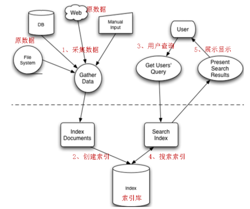
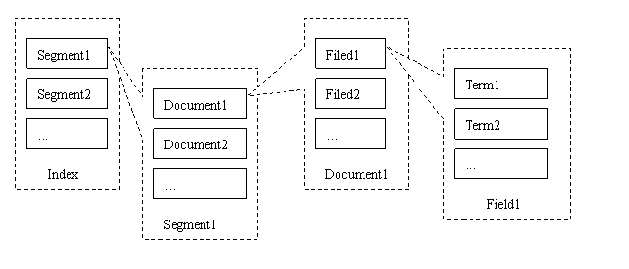
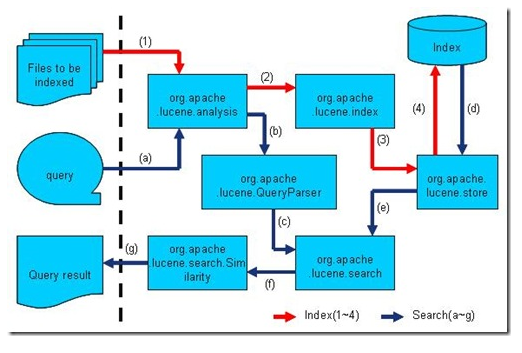
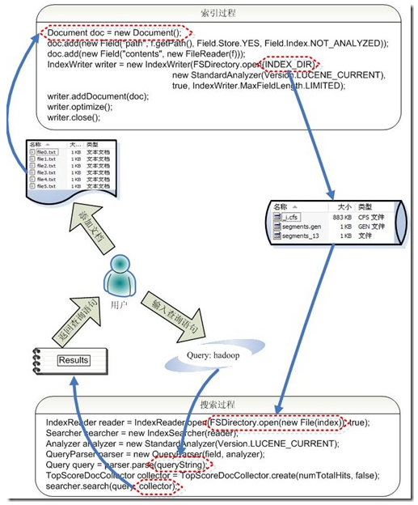

[TOC]

# Lucene base

## 1.start

Lucene和搜索引擎不是一回事，lucene是一个工具包，不能单独对外提供服务，搜索引擎可以独立运行对外提供搜索服务。

**全文检索：**全文搜索首先对要搜索的文档进行分词，然后形成索引，通过查询索引来查询文档，全文索引就是先创建索引，然后根据索引来进行搜索的过程，就叫做全文见搜。

lucene全文检索的过程：



### 1.1 索引结构



| name        | description                                                  |
| ----------- | ------------------------------------------------------------ |
| Docuemnt    | 用来对需要进行索引的文档进行描述，这里文档可以是来自HTML，database，PDF |
| Field       | 用来对document进行描述，表示document的一个域，可以理解为一个对象的一个属性 |
| Analyser    | 对于需要进行索引的document来说，需要按照一定的规则将内容进行切分，这样才能被索引。Analyser的作用就是用来进行切词。 |
| IndexWriter | 它是document和索引之间的桥梁，用来将document加载到索引中     |
| Directory   | 用来描述索引的存放位置                                       |
| Query       | 它可以将需要查询的内容封装成索引可以理解的内容               |
| indexSearch | 用来依据query在索引检索符合条件的内容                        |

### 1.2 lucene API



* Lucene的analysis模块主要负责词法分析和语言处理而形成的Term
* Lucene的index模块主要负责索引的创建,里面有IndexWriter
* Lucene的store模块主要负责索引的读写
* Lucene的QueryParser主要负责语法分析，用于查询
* Lucene的seach模块负责对索引进行搜索
* Lucene的similarity模块主要负责相关性打分的实现

### 1.3 创建索引，检索索引



索引创建过程：

1. 常见一个IndexWriter用来写索引文件，它有几个参数，INDEX_DIR就是索引文件所存放的位置，Alalyzer便是用来对文档进行词法分析和语言处理
2. 创建一个Document代表我们要索引的文档。
3. 将不同的Field加入到文档中。我们知道，一篇文档有多种信息，如题目，作者，修改时间，内容等。不同类型的信息用不同的Field来表示。
4. IndexWriter调用函数addDocument，将索引写到索引文件夹中。

搜索过程：

1. IndexReader将磁盘上的索引信息读入到内存中，INDEX_DIR就是索引文件存放的位置
2. 创建IndexSearcher准备进行搜索
3. 创建Analyer用来对查询语言进行词法分析和语言处理
4. 创建QueryParser用来对查询语言进行语法分析
5. QueryParser调用parser进行语法分析, 形成查询语法数,放到Query中
6. IndexSearcher调用search对查询语法树Query进行搜索, 得到结果TopScoreDocCollector.

### 1.4 Field对象

#### 1.4.1 field属性

* 是否分词

  **分词的目的就是为了索引.** 如：商品名称，商品描述，商品价格

  不需要对field存储的内容进行分词，不分词，不代表不索引，而是将整个内容进行索引。如：商品ID。

* 是否索引

  **索引的目的就是为了搜索。** 如: 商品名称，商品描述

  不索引，也就是不对该field域进行搜索

* 是否存储

  将field域中的内容存储到文档域中。**存储的目的，就是为了搜索页面显示取值用的**。如：商品名称，商品价格。

  不将field域中的内容存储到文档中。不存储，则搜索页面中没法获取该field域的值。

#### 1.4.2 Field常用类型

| Field类                                                      | 数据类型              | Alalyzed是否分词 | Indexed是否索引 | Stored是否存储 | 说明                                                         |
| ------------------------------------------------------------ | --------------------- | ---------------- | --------------- | -------------- | ------------------------------------------------------------ |
| StringField(FieldName,Store.YES)                             | 字符串                | N                | Y               | Y \| N         | 这个field用来创建一个字符串field,但是不会进行分词,会将整个存储在索引中,比如:订单号,身份证号。是否存储在文档中用Store.YES或Store.No决定 |
| LongField(fieldname,Store.YES)                               | Long型                | Y                | Y               | Y \| N         | 这个Field用来创建一个Long数字型FIeld, 进行分词和索引,比如:价格。是否存储在文档中用Store.YES或Store.No决定 |
| StoredField(fieldName,FieldValue)                            | 重载方法,支持多种类型 | N                | N               | Y              | 这个Field用来创建不同类型Field不分析，不索引，但是Field存储在文档中 |
| TextField(fieldName, Store.YES)--TextField(fieldName,Reader) | 字符串或流            | Y                | Y               | Y \| N         | 如果一个Reader，lucene猜测内容比较多，会采用Unstored策略。   |

### 1.5 分词器

#### 1.5.1 标准分词器

```java
@Test
public void StandardAnalyzer() throws IOException{
    String txt = "我是中国人";
    Analyzer analyzer1 = new StandardAnalyzer(VERSION);// 标准分词器
    TokenStream tokenstream = analyzer1.tokenStream("content",new StringReader(txt));// 生成一个分词流
    printKey(tokenstream);
}

结果：
//我  是  中  国  人  
```


#### 1.5.2 简单分词器

```java
@Test
public void SimpleAnalyzer() throws IOException{
    String txt = "中华人民共和国";
    Analyzer analyzer1 = new SimpleAnalyzer(VERSION);// 标准分词器
    TokenStream tokenstream = analyzer1.tokenStream("content",    new StringReader(txt));// 生成一个分词流
    printKey(tokenstream);
}

结果：//中华人民共和国  
```


#### 1.5.3 二元切分分词器

```java
@Test
public void CJKAnalyzer() throws IOException{
    String txt = "中华人民共和国";
    Analyzer analyzer1 = new CJKAnalyzer(VERSION);// 标准分词器
    TokenStream tokenstream = analyzer1.tokenStream("content",    new StringReader(txt));// 生成一个分词流
    printKey(tokenstream);
}

结果：中华  华人  人民  民共  共和  和国  
```


#### 1.5.4 智能中文分词器

```java
@Test
public void CJKAnalyzer() throws IOException{
    String txt = "中华人民共和国";
    Analyzer analyzer1 = new SmartChineseAnalyzer(VERSION);
    TokenStream tokenstream = analyzer1.tokenStream("content",    new StringReader(txt));// 生成一个分词流
    printKey(tokenstream);
}

结果：中华  华人  人民  民共  共和  和国  
```


#### 1.5.5 IK分词器

```java
@Test
public void IKAnalyzer() throws IOException{
    String txt = "焦学理和李克强出访欧洲：哪些“相遇”值得期待";
    Analyzer analyzer1 = new IKAnalyzer();// 标准分词器
    TokenStream tokenstream = analyzer1.tokenStream("content",new StringReader(txt));// 生成一个分词流
    printKey(tokenstream);
}

结果：
李克强  克强  出访  欧洲  哪些  相遇  值得  期待
```

