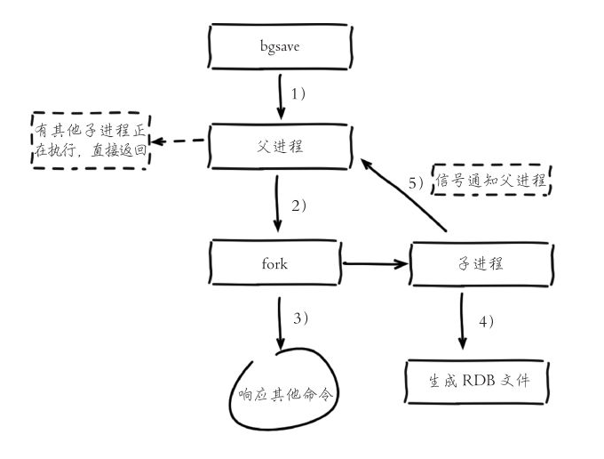

# RDB

## 1.配置

```shell

################################ SNAPSHOTTING  ################################
#
# Save the DB on disk:
#
#   save <seconds> <changes>
#
#   Will save the DB if both the given number of seconds and the given
#   number of write operations against the DB occurred.
#
#   In the example below the behaviour will be to save:
#   after 900 sec (15 min) if at least 1 key changed
#   after 300 sec (5 min) if at least 10 keys changed
#   after 60 sec if at least 10000 keys changed
#
#   Note: you can disable saving completely by commenting out all "save" lines.
#
#   It is also possible to remove all the previously configured save
#   points by adding a save directive with a single empty string argument
#   like in the following example:
#
#   save ""
## 配置save的条件. save 900 1: 表示15分钟至少有1个key的改变才会进行备份
## save 300 10 ,5分钟至少有10个key的改变才会进行备份
## save备份时,会没有响应,也就是最暂停响应
save 900 1
save 300 10
save 60 10000

# By default Redis will stop accepting writes if RDB snapshots are enabled
# (at least one save point) and the latest background save failed.
# This will make the user aware (in a hard way) that data is not persisting
# on disk properly, otherwise chances are that no one will notice and some
# disaster will happen.
#
# If the background saving process will start working again Redis will
# automatically allow writes again.
#
# However if you have setup your proper monitoring of the Redis server
# and persistence, you may want to disable this feature so that Redis will
# continue to work as usual even if there are problems with disk,
# permissions, and so forth.
### bgsave出错时,就停止
stop-writes-on-bgsave-error yes

# Compress string objects using LZF when dump .rdb databases?
# For default that's set to 'yes' as it's almost always a win.
# If you want to save some CPU in the saving child set it to 'no' but
# the dataset will likely be bigger if you have compressible values or keys.
## 备份时,是否使用压缩
rdbcompression yes

# Since version 5 of RDB a CRC64 checksum is placed at the end of the file.
# This makes the format more resistant to corruption but there is a performance
# hit to pay (around 10%) when saving and loading RDB files, so you can disable it
# for maximum performances.
#
# RDB files created with checksum disabled have a checksum of zero that will
# tell the loading code to skip the check.
### 使用似乎用CRC64校验
rdbchecksum yes

# The filename where to dump the DB
### db的文件名字
dbfilename dump.rdb

# The working directory.
#
# The DB will be written inside this directory, with the filename specified
# above using the 'dbfilename' configuration directive.
#
# The Append Only File will also be created inside this directory.
#
# Note that you must specify a directory here, not a file name.
### 备份的文件会放到此目录
dir /mnt/redis/redis-5.0/redis-cluster/9001/data

```


## 2.备份

```shell
## 后台开一个线程去进行备份,不会导致不响应
$ bgsave

## 也可以使用此进行备份
$ save

##上次备份成功的时间
$lastsave
```

校验文件是否正在：

```java
$ redis-check-rdb 9001/data/dump.rdb

[root@name1 redis-cluster]# ./redis-check-rdb 9001/data/dump.rdb 
[offset 0] Checking RDB file 9001/data/dump.rdb
[offset 26] AUX FIELD redis-ver = '5.0.0'
[offset 40] AUX FIELD redis-bits = '64'
[offset 52] AUX FIELD ctime = '1573702261'
[offset 67] AUX FIELD used-mem = '2593024'
[offset 85] AUX FIELD repl-stream-db = '0'
[offset 135] AUX FIELD repl-id = '8317a3b7fac3650854ccad93d04b39cd97ed233f'
[offset 151] AUX FIELD repl-offset = '1385'
[offset 167] AUX FIELD aof-preamble = '0'
[offset 169] Selecting DB ID 0
[offset 233] Checksum OK
[offset 233] \o/ RDB looks OK! \o/
[info] 2 keys read
[info] 2 expires
[info] 0 already expired
```

工作流程：



## 3.恢复

只需要把备份的文件，拷贝到对应的目录下，重新启动实例，就会把备份的数据读取进来。

