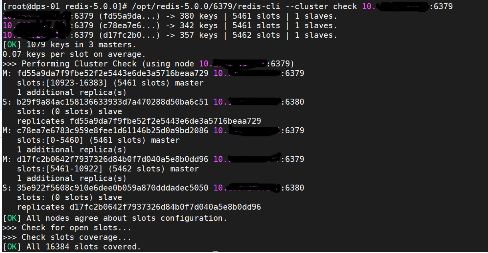
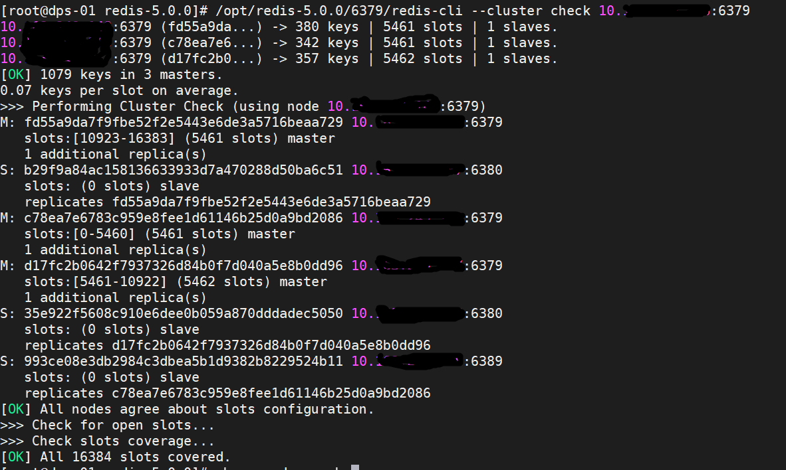

[TOC]

# 节点信息不一致

在线上使用redis集群时，发现节点B和其他节点的集群信息不一致，经过检测发现节点B所在机器的防火墙没有打开节点B的端口，导致B不能和集群正常交流(这里 比较奇怪，如果端口没有打开的话，那第一次创建集群时就不能成功，此处猜测是后面对节点B的端口进行了修改)，后来打开防火墙端口后，仍然集群信息不一致：

如：正常的集群信息:

敏感信息去除了，反正就是看到这里少了一个节点，即没有节点B的信息；

看一下节点B的信息

可以看到，节点B包含了自身的信息，但是其他节点又没有节点B的信息，针对这种情况如何恢复呢？

我是这样恢复的：节点B这里作为是一个slave节点(其不能喝其他节点通信，自然也做不了Master)，这样就不涉及到备份数据了。

1. 停止节点B节点进程
2. 删除节点B中保存的集群信息文件
3. 登录集群中其他各个节点，执行 cluster forget  node-B-id，让节点忘记节点B的信息；这里可以使用脚本来完成
4. 操作完所有节点后，再次重新使用命令把节点B添加到集群

如何集群就恢复完成了。

