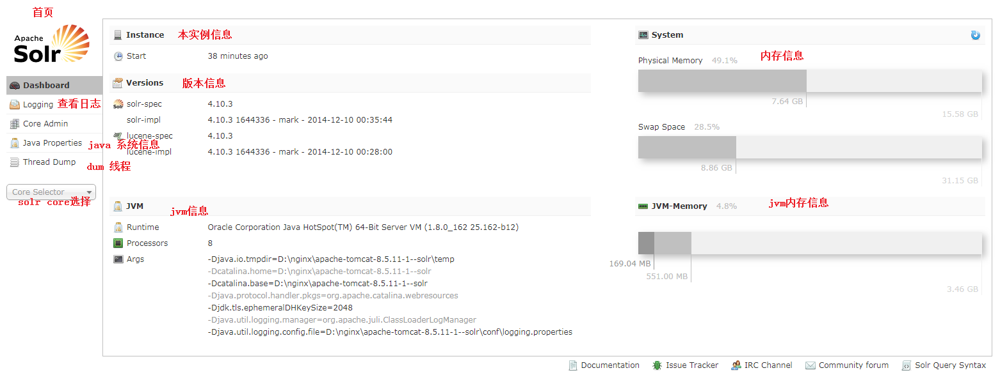
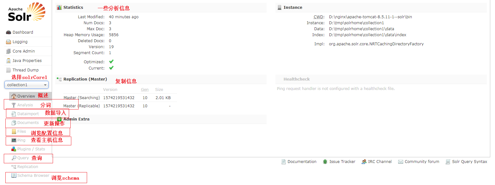
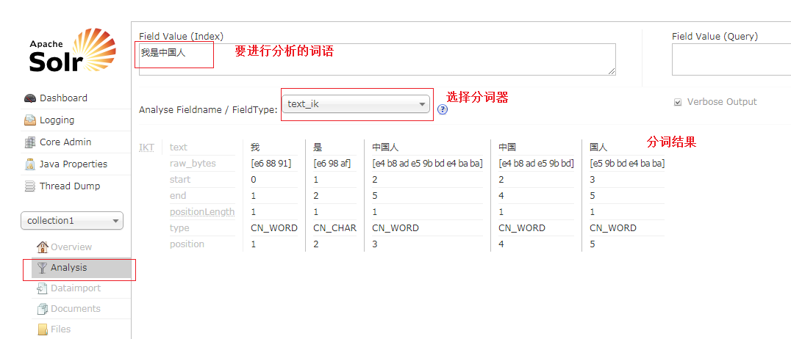
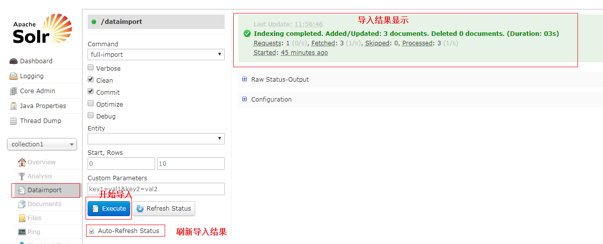
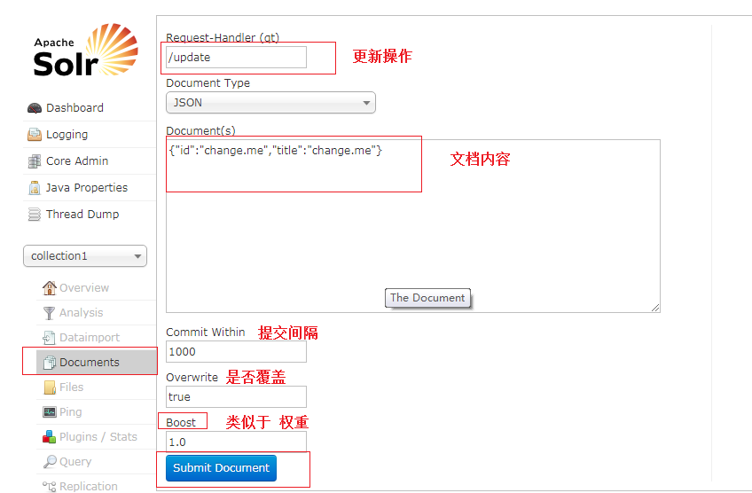
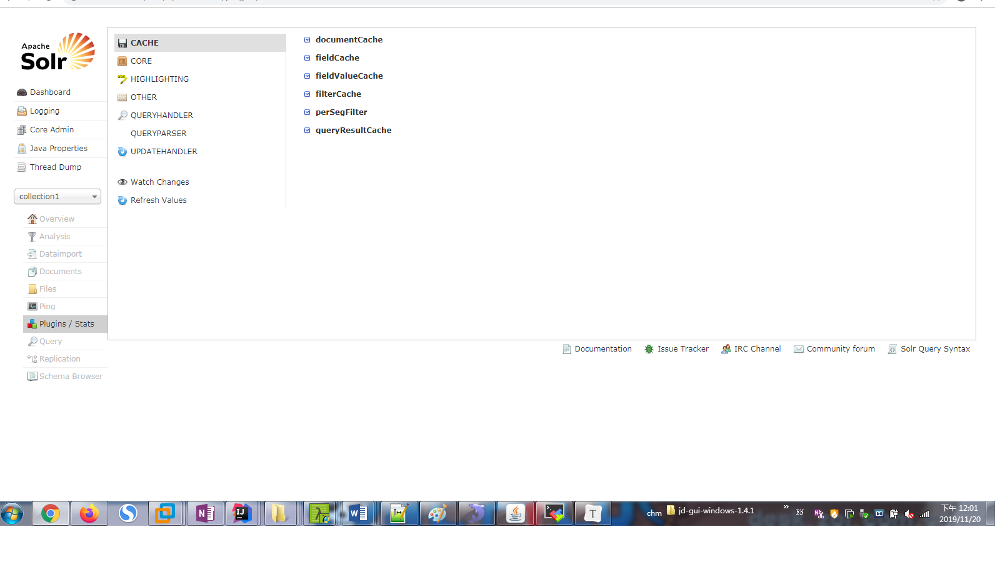
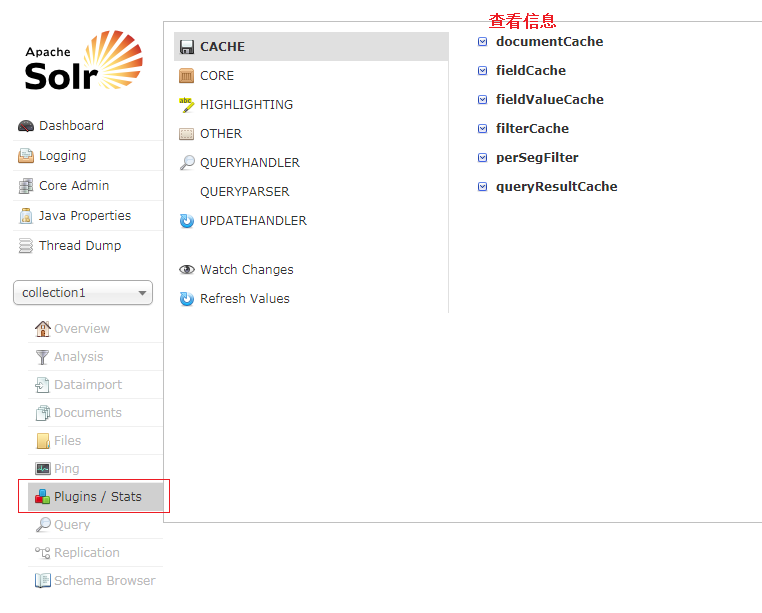
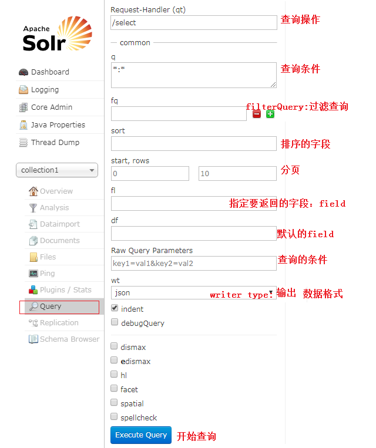
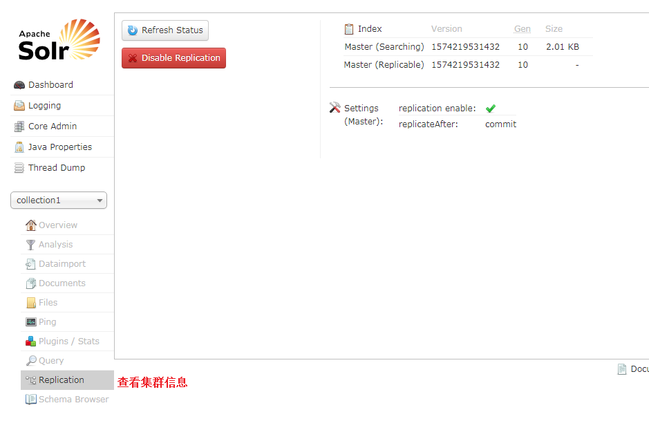

[TOC]

# DashBoard

## 1. 首页

## 2. 分开查看每个SolrCore中的各个模块

### 2.1 Analysis

### 2.2 dataImport

### 2.3 document

### 2.4 files

### 2.5 plugins

### 2.6 query

query模块很是灵活，不过底层仍然逃不开lucene。关于查询的语法，要多多注意。

### 2.7 replication

### 2.8 schema

