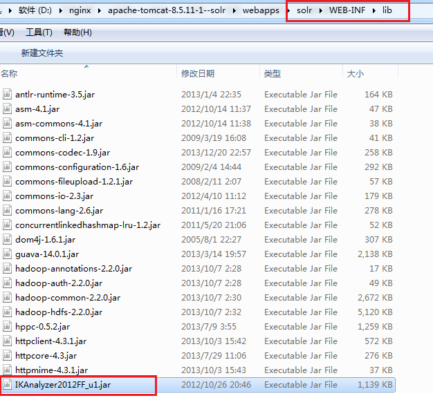
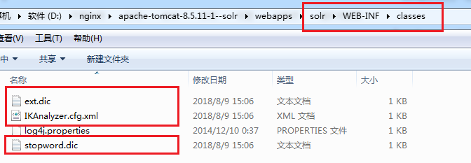

[TOC]

# 添加分词器

本次添加IK中文分词器。

## 1.拷贝依赖



把依赖包拷贝到指定的lib目录下。

## 2.拷贝配置文件



配置文件也要拷贝到classes目录。

## 3.在schema中添加约束

```xml
<fieldType name="text_ik" class="solr.TextField">
    <analyzer class="org.wltea.analyzer.lucene.IKAnalyzer"></analyzer>
</fieldType>
```

到此，分词器就添加好了，可以在schema中添加field，直接使用了。

使用示例:

```xml
<field name="content_ik" type="text_ik" indexed="true" stored="true"/>
```

