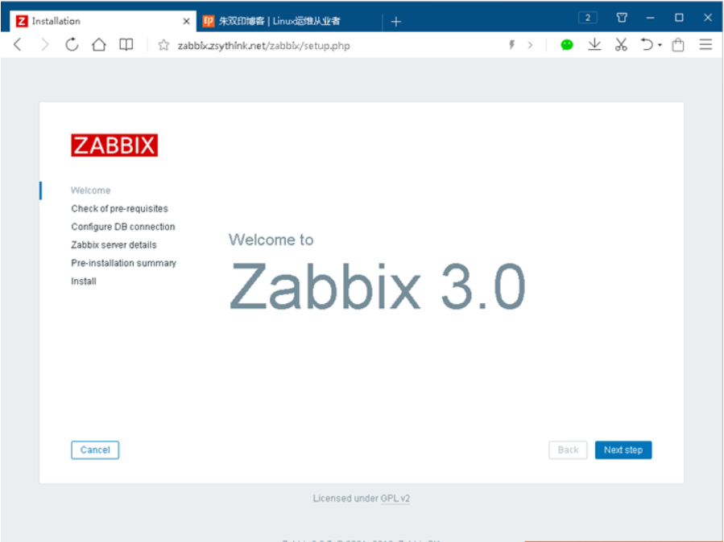
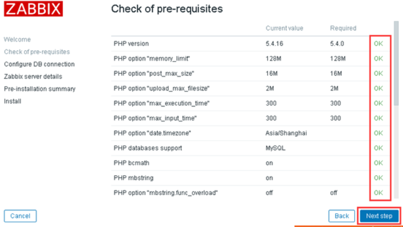
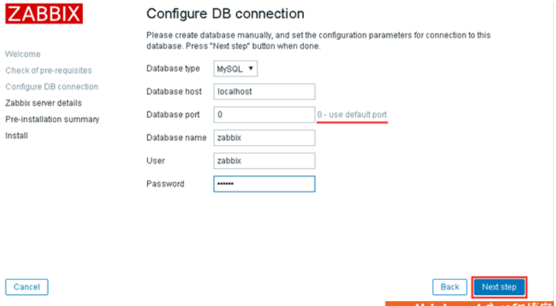
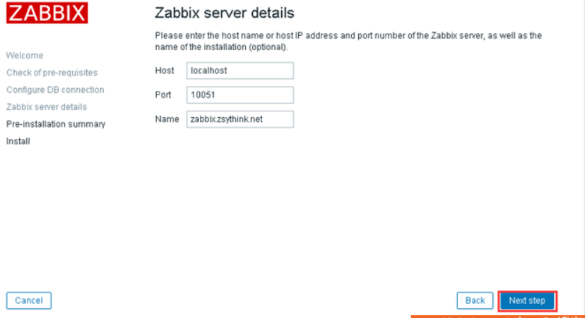
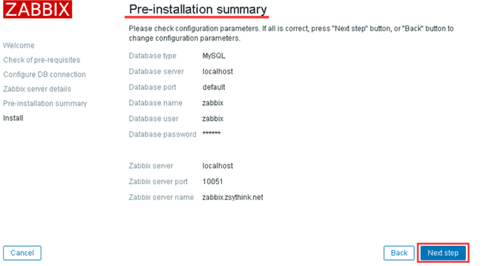
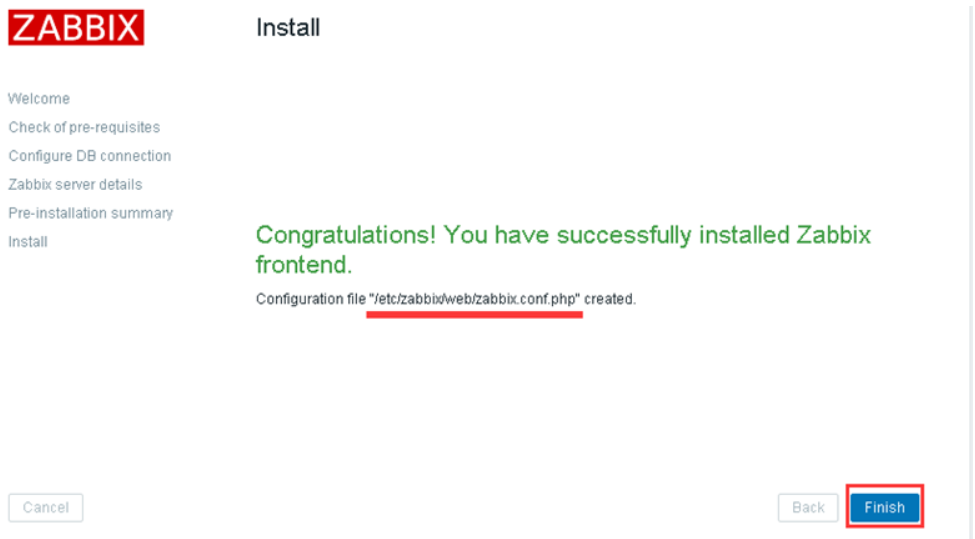
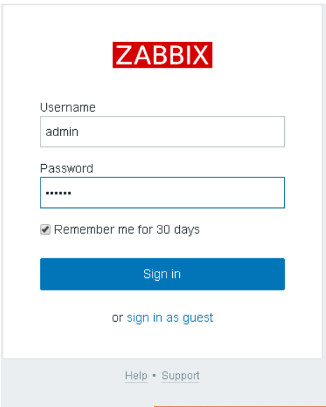
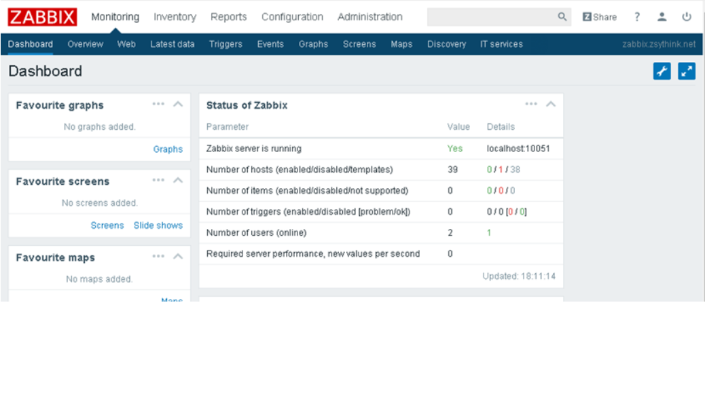
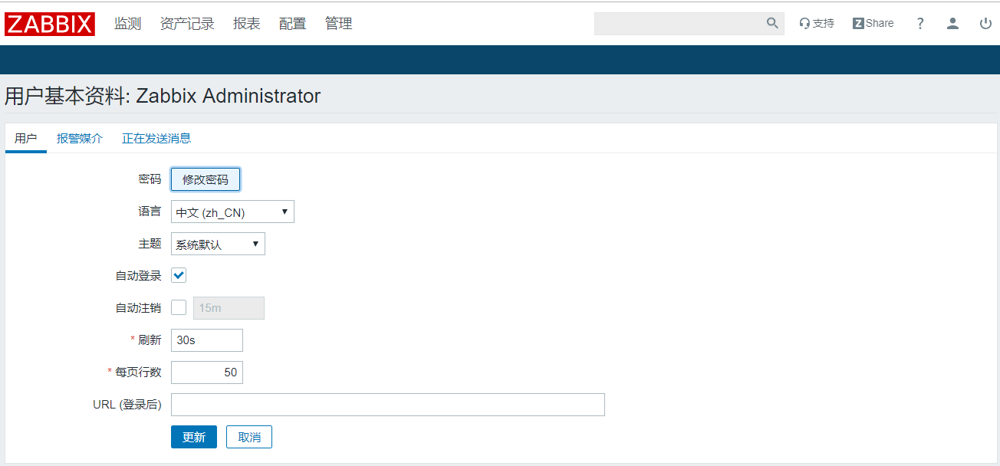

# zabbix -安装

本次安装环境:

linux : CentOS Linux release 7.6.1810 (Core) 

zabbix : 4.0

httpd: Apache/2.4.6 (CentOS)

DB: mariadb 5.5

说一下本次安装时的小插曲； 第一次尝试安装时使用的是 centos6.4，进行安装的，zabbix仍然使用的是4.0版本。安装过程是挺顺利的，而且官方也有相关相关的安装介绍，并且配置又httpd 2.2版本的配置文件，不过启动访问就会报错，报错的就是PHP相关的文件(自己又不懂PHP，真的是搞得手足无措)。很长时间都没有解决，当然很多网友也只是说原因是 httpd版本过低导致的。好吧，重新编译安装，整理了一套，发现仍然有报错，时间过去了一天多，果断放弃了。原因有一下几条：

1.因为业务需要，所以去安装zabbix环境了解并使用

2.本身对php，zabbix都是入门，升级导致的其他问题不能保证不会出错，容易放弃，感觉门槛很高(其实一点也没有)

3.发现官方使用centos7推荐时间centos7安装的，就先使用官方的推荐，降低门槛，先了解使用。

希望对大家也能有个帮助，对于新技术，本人是会同步官方推荐的，毕竟是经过官方测试的，相对出错概率很小，随着了解深入，在进行定制。

好了，说了这么多，下面就说一下安装把。(其实大多步骤跟官方同步，一路傻瓜式安装完成)

## 1.配置软件仓库

```shell
# rpm -ivh http://repo.zabbix.com/zabbix/4.0/rhel/7/x86_64/zabbix-release-4.0-1.el7.noarch.rpm
```

## 2.安装数据库

这里就不细说了，自行百度把。当然了centos7自带的mariadb 5.5版本的，直接安装也可以使用的(我就是使用的自带的)

```shell
yum install mariadb mariadb-server
```

## 3.安装zabbix-server

```shell
yum install zabbix-server-mysql
```

```shell
# 文件 位置
/etc/zabbix/zabbix_server.conf

# server端配置
ListenPort=10051			# 监听的端口
SourceIP=192.168.30.15		 # 绑定IP
LogType=file				# 日志格式，此处设置为文件
LogFile=/var/log/zabbix/zabbix_server.log	# 日志文件位置
LogFileSize=50				# 日志50M滚动一次
PidFile=/var/run/zabbix/zabbix_server.pid  # pid文件位置
SocketDir=/var/run/zabbix			# socket文件句柄
DBHost=192.168.30.15				# 数据库ip
DBName=zabbix						# 数据库
DBUser=zabbix						# 数据库用户
DBPassword=admin					# 数据库密码
DBSocket=/var/lib/mysql/mysql.sock	  # 如果数据库和server在同一台机器,可以配置数据库的socket句柄
DBPort=3306			# 数据库端口
SNMPTrapperFile=/var/log/snmptrap/snmptrap.log
Timeout=4
AlertScriptsPath=/usr/lib/zabbix/alertscripts # 脚本位置
ExternalScripts=/usr/lib/zabbix/externalscripts # 扩展脚本位置
LogSlowQueries=3000			# 满查询阈值
```

当然了还有一些其他的扩展配置，此处先介绍基本配置。

```shell
# 配置server端的数据库
[root@name2 conf.d]# rpm -ql zabbix-server-mysql | grep create
/usr/share/doc/zabbix-server-mysql-4.0.12/create.sql.gz

1. 登陆mysql 创建zabbix数据库
	create database zabbix default charset 'UTF8';
2. 创建用户zabbix
    create user zabbix
3. 把zabbix数据库权限赋值给zabbix用户
 grant all on zabbix.* to zabbix@'%' identified by 'admin';

4. 使用create.sql.gz 创建需要的表
 zcat /usr/share/doc/zabbix-server-mysql*/create.sql.gz | mysql -uzabbix -p zabbix
```

```shell
# 启动server端
systemctl start zabbix-server
```


## 4.安装httpd

```shell
yum install httpd php  php-mysql php-mbstring php-gd php-bcmath php-ldap php-xml
```

## 5.安装zabbix-web

```shell
yum install zabbix-web  zabbix-web-mysql

# 查询自带配置(默认安装后，会放到/etc/httpd下面)
[root@name2 conf.d]# rpm -ql zabbix-web | grep zabbix.conf
/etc/httpd/conf.d/zabbix.conf   # 已经放置好,修改此文件即可
/etc/zabbix/web/zabbix.conf.php
/usr/share/zabbix/conf
/usr/share/zabbix/conf.import.php
/usr/share/zabbix/conf/zabbix.conf.php.example  # 自带的示例文件
```

```shell
# web 配置
# 此配置是zabbix自带的
Alias /zabbix /usr/share/zabbix
<Directory "/usr/share/zabbix">
    Options FollowSymLinks
    AllowOverride None
    Require all granted
    <IfModule mod_php5.c>
        php_value max_execution_time 300
        php_value memory_limit 128M
        php_value post_max_size 16M
        php_value upload_max_filesize 2M
        php_value max_input_time 300
        php_value max_input_vars 10000
        php_value always_populate_raw_post_data -1
        # php_value date.timezone Europe/Riga
        php_value date.timezone Asia/Shanghai
    </IfModule>
</Directory>
<Directory "/usr/share/zabbix/conf">
    Require all denied
</Directory>
<Directory "/usr/share/zabbix/app">
    Require all denied
</Directory>
<Directory "/usr/share/zabbix/include">
    Require all denied
</Directory>
<Directory "/usr/share/zabbix/local">
    Require all denied
</Directory>
```

```shell
# 启动httpd
systemctl start httpd
```


## 6.安装zabbix-agent

```shell
yum install zabbix-agent
```

agent 是具体采集数据并和server端做交互的。既然是把和server进行数据交互，那就分为主动发送和server来拉取数据，两种方式；没错，agent支持此两种方式。

看一下agent的配置:

```shell
############# 通用配置
############ GENERAL PARAMETERS #################
PidFile=/var/run/zabbix/zabbix_agentd.pid   # pid
LogType=file						# log方式，使用文件方式
LogFile=/var/log/zabbix/zabbix_agentd.log # 日志文件位置
LogFileSize=50			# 日志文件大小
DebugLevel=3			# 日志debug级别
SourceIP=				# 绑定的源ip
EnableRemoteCommands=1	# 是否允许远程执行命令
LogRemoteCommands=0		# Enable logging of executed shell commands as warnings


############# 被动配置
##### Passive checks related
Server=192.168.30.15  # server ip
ListenPort=10050		# 监听的端口
ListenIP=0.0.0.0    # agent监听的端口
StartAgents=3     # 子agent实例处理请求

############# 主动配置
##### Active checks related
ServerActive=192.168.30.15  # 主动上报的server端IP
Hostname=name2		# 此配置要和前台PHP配置的agent主机名一致
# HostnameItem=system.hostname   # 如果没有配置HostName 会使用此主机名

### Option: HostMetadata
#	Optional parameter that defines host metadata.
#	Host metadata is used at host auto-registration process.
#	An agent will issue an error and not start if the value is over limit of 255 characters.
#	If not defined, value will be acquired from HostMetadataItem.
#
# Mandatory: no
# Range: 0-255 characters
# Default:
# HostMetadata=

### Option: HostMetadataItem
#	Optional parameter that defines an item used for getting host metadata.
#	Host metadata is used at host auto-registration process.
#	During an auto-registration request an agent will log a warning message if
#	the value returned by specified item is over limit of 255 characters.
#	This option is only used when HostMetadata is not defined.
#
# Mandatory: no
# Default:
# HostMetadataItem=

RefreshActiveChecks=120 #How often list of active checks is refreshed, in seconds.
BufferSend=5  #Do not keep data longer than N seconds in buffer.
BufferSize=100  #Maximum number of values in a memory buffer
MaxLinesPerSecond=20 #Maximum number of new lines the agent will send per second to Zabbix Server or Proxy processing 'log' and 'logrt' active checks

############# 其他高级配置 包括tls等，先不看
```

可以同时配置主动和被动。

## 7.工具

```shell
yum install zabbix-get   # server从agent拉取数据
yum install zabbix-sender # agent发送数据到server端
```

第一次登陆，并进行部分初始化:



一些依赖的php组件:



数据库配置：



server主机信息配置：



信息小结：



此处表明信息存放的位置:



登陆：初始用户名为admin，密码为zabbix





切换为中文:


