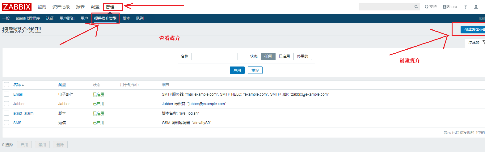
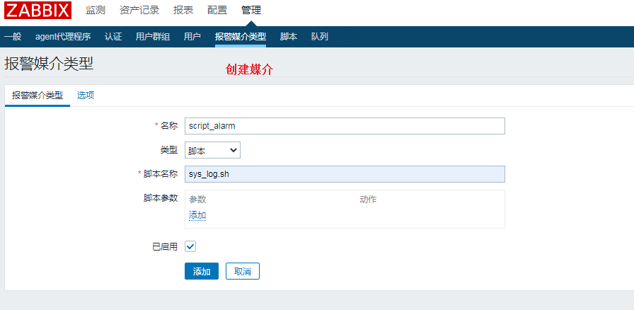
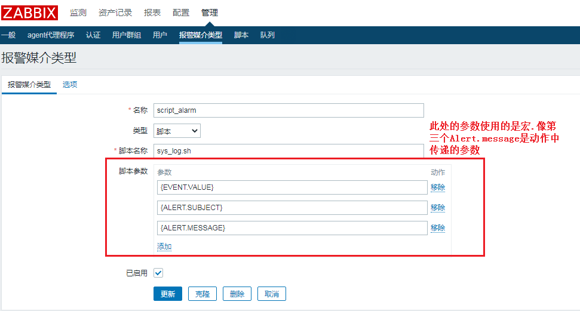
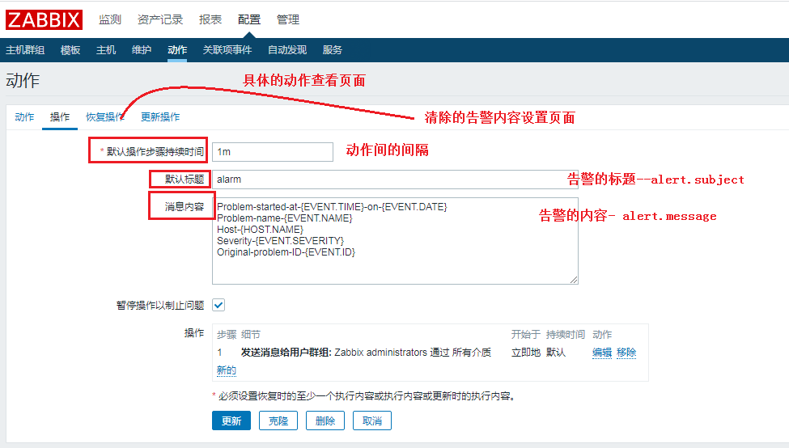

[TOC]

# 给媒介传递参数

zabbix中默认定义了很多的宏，在一些配置的地方可以直接使用已经定义好的宏；当然后在媒介中也可以把这些宏作为参数传递到脚本中。

脚本内容：

```shell
#!/bin/bash
# 记录消息的文件
LogFile=/tmp/test.txt
# 打印消息
log(){
echo $1 >> ${LogFile}
}
# 每次打印前，先打印一次时间
log "begin time: $(date '+%T %F')"
# 把传递的参数都进行打印
for i in $@
do
log $i
done

```

## 媒介的设置

步骤: 管理 -->  报警媒介类型 --> 创建媒体类型  --> 自定义脚本类型的媒介









动作中的 -- 消息内容 字段 ， 就是宏  ALERT.MESSAGE 的内容； 默认标题就是宏  ALERT.SUBJECT 的内容。