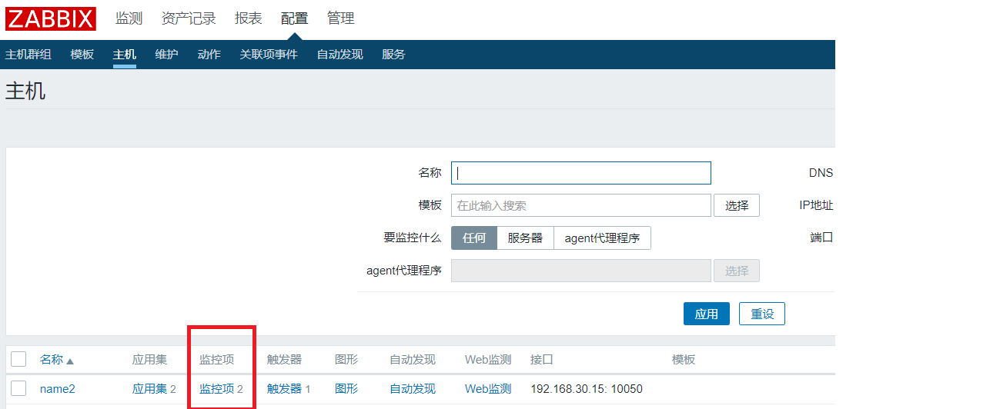
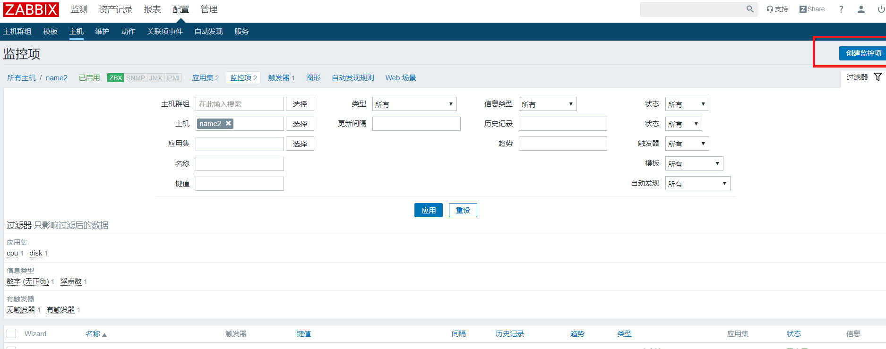
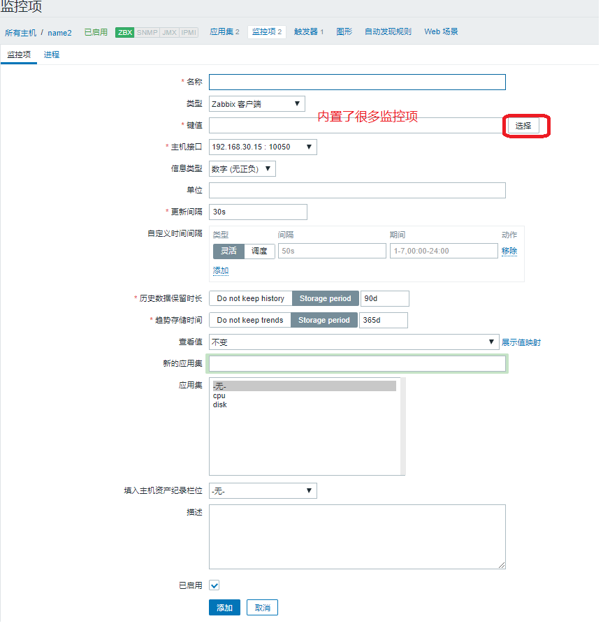
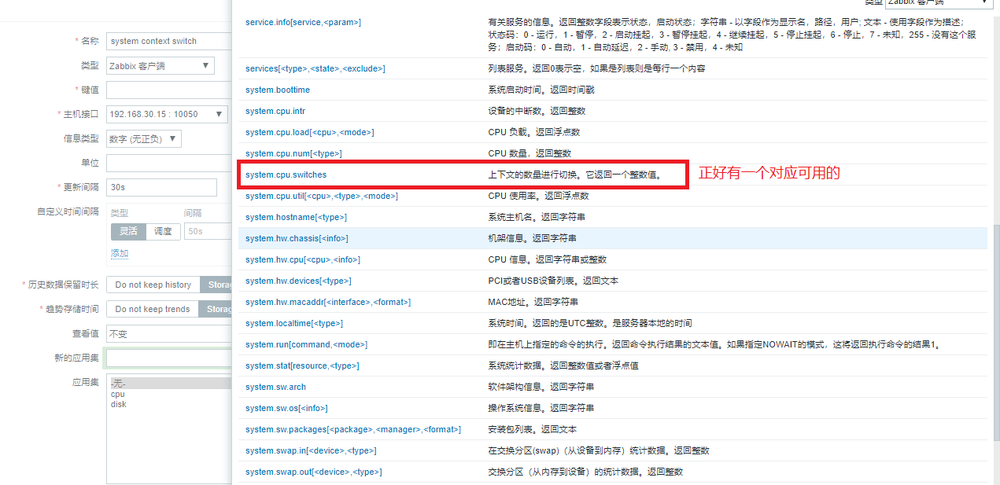
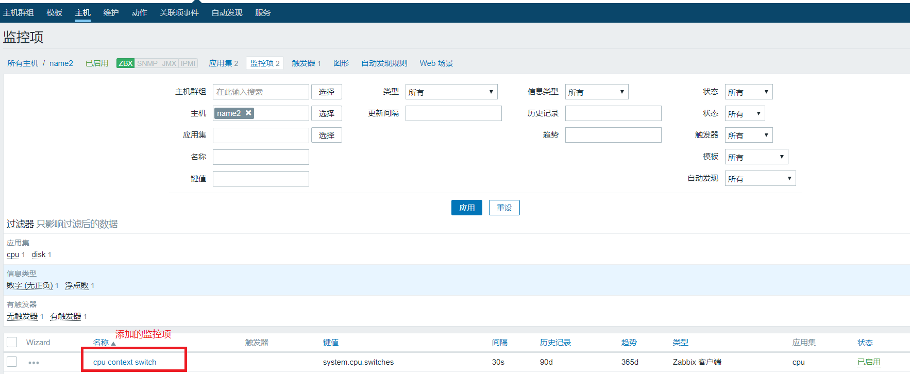
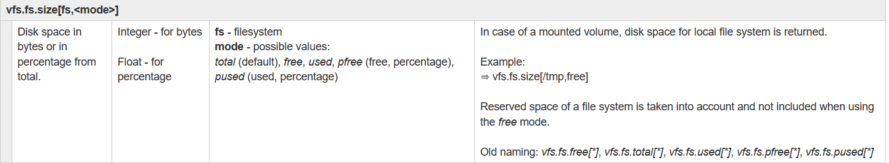
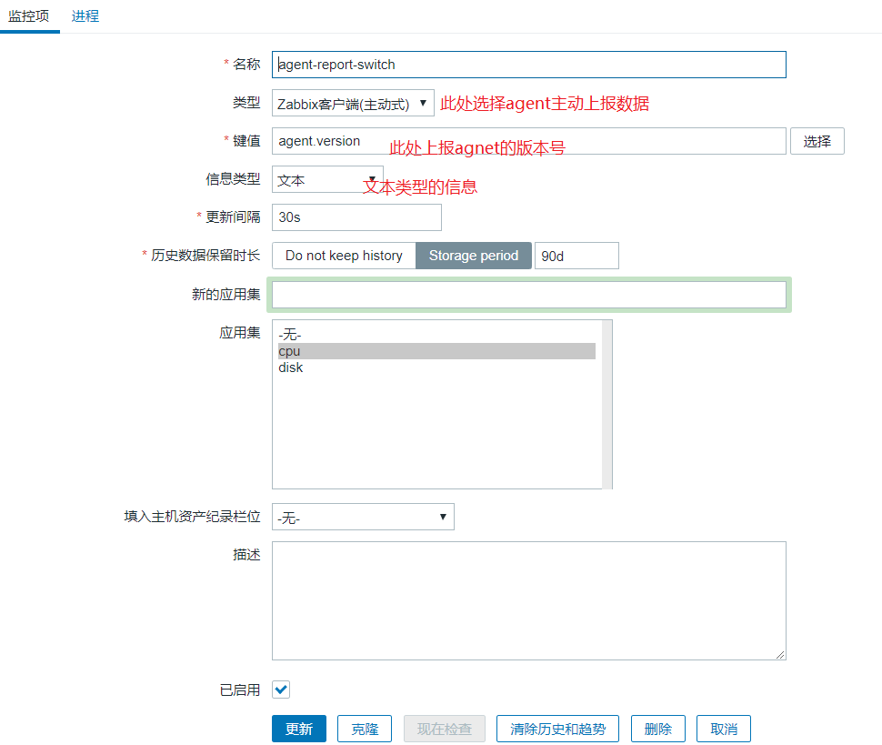
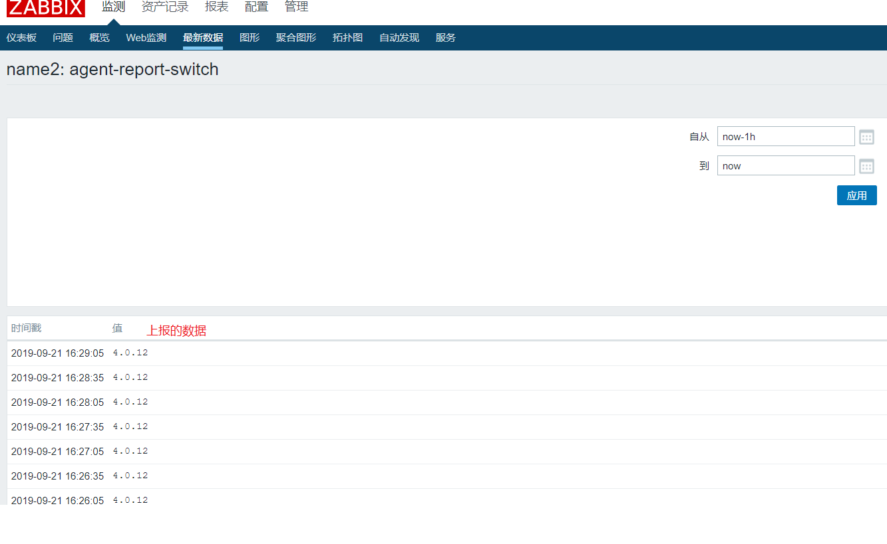

# 添加监控项以及zabbx-get的使用

zabbix作为一个出色的监控产品，内置了很多的监控项(Item)，已经添加了一台主机，下面就演示一下添加具体的监控.

## 1. 添加一个server主动拉取数据的监控项

添加上下文切换的item:











这样就创建好了一个监控项。

那哪个zabbix-get如何使用呢?

```shell
# 查看帮助如下，具体用法就是从agent获取消息使用的
usage:
  zabbix_get -s host-name-or-IP [-p port-number] [-I IP-address] -k item-key
  zabbix_get -s host-name-or-IP [-p port-number] [-I IP-address]
                --tls-connect cert --tls-ca-file CA-file
                [--tls-crl-file CRL-file] [--tls-agent-cert-issuer cert-issuer]
                [--tls-agent-cert-subject cert-subject]
                --tls-cert-file cert-file --tls-key-file key-file -k item-key
  zabbix_get -s host-name-or-IP [-p port-number] [-I IP-address]
                --tls-connect psk --tls-psk-identity PSK-identity
                --tls-psk-file PSK-file -k item-key
  zabbix_get -h
  zabbix_get -V

Get data from Zabbix agent.

General options:
  -s --host host-name-or-IP  Specify host name or IP address of a host
  -p --port port-number      Specify port number of agent running on the host
                             (default: 10050)
  -I --source-address IP-address   Specify source IP address

  -k --key item-key          Specify key of the item to retrieve value for

  -h --help                  Display this help message
  -V --version               Display version number
```

那大概用处了解了，实验一下把：

```shell
# 指定agent主机 端口  以及要 查询的key  就可以得到对应key的值了
[root@name2 zabbix]# zabbix_get  -s 192.168.30.15 -p 10050 -k system.cpu.switches
2778592

# 获取一个带参数的key
[root@name2 zabbix]# zabbix_get -s 192.168.30.15 -p 10050 -k vfs.fs.size[/,pused]
24.303678
```

vfs.fs.size 此key的官方介绍:



具体每个key的意思可以查看官方文档:

```shell
https://www.zabbix.com/documentation/3.0/manual/config/items/itemtypes/zabbix_agent
```

添加完监控项之后，主机就会自动从agent获取数据。

## 2.创建一个agent自动上报数据的监控项





