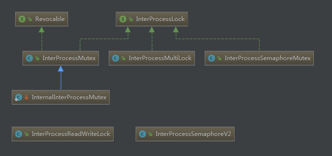
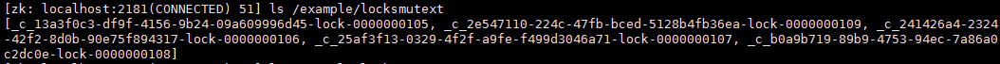

# zk分布式锁 InterProcessMutex实现


从图中的包名可以看到其利用zk实现了分布式锁，计数器，队列等操作。本篇咱们解析一下分布式锁的实现。

看一下提供的锁的diagram:



可以看到提供了多种锁的实现，向InterProcessMutex 和 ImterProcessSemphoreMutex 以及InterProcessReadWriteLock 以及 InterProcessSemphoreV2这几种锁使用起来和JDK中的锁使用起来很类似。

本篇文章咱们介绍一下InterProcessMutex锁的使用以及其原理：

使用：

```java
@Slf4j
public class FakeLimitedResources {
    private final AtomicBoolean inUse = new AtomicBoolean(false);
    private int count = 0;	// 多线程计数
    public void use(){
        if(!inUse.compareAndSet(false,true)){
       throw new IllegalStateException("needs to be use by one client at a time");
        }
        try {
            log.info("*********fakeLimiteResources in use****");
            log.info("value : {}",inUse.toString());
            log.info("*****fakeLimiteResources in use*******");
            Thread.sleep((long) (3*Math.random()));
        } catch (InterruptedException e) {
            e.printStackTrace();
        }finally {
            inUse.set(false);
            count++;
            log.info("****fakeLimiteResources finally ******count = {}",count);
        }
    }
}
```

```java
@Slf4j
public class ExampleClientThatLocks {
    // 可重入锁
    private InterProcessMutex lock;
    private FakeLimitedResources resources;
    private String clientName;

    public ExampleClientThatLocks(CuratorFramework framework,String path,FakeLimitedResources resources,String clientName){
        this.lock = new InterProcessMutex(framework,path);
        this.resources = resources;
        this.clientName = clientName;
    }

    public void doWork(long time, TimeUnit timeUnit) throws Exception {
        // 每次对共享资源进行访问时,先进行获取锁的操作
        if(!lock.acquire(time,timeUnit)){
        throw new IllegalStateException(clientName+" could not acquire a lock");
        }
        log.info(clientName + " has a lock");
        try{
            resources.use();
        }finally {
            log.info(clientName+" releasing the lock");
            lock.release();
        }
    }
    /**
     *  可重入锁演示
     * @param args
     */
    public static void main(String[] args) {
        int QTY = 5;
        int REPETITIONS = QTY * 5;
        String PATH = "/example/locksmutext";
        String CONNECT_ADDR = "192.168.72.11:2181";
        FakeLimitedResources fakeLimitedResources = new FakeLimitedResources();
        ExecutorService executorService = Executors.newFixedThreadPool(QTY);
            for (int i = 0; i < 5; i++) {
                final int index = i;
                Runnable runnable = new Runnable() {	// 多线程访问
                    @Override
                    public void run() {
                        CuratorFramework curator = CuratorFrameworkFactory.newClient(CONNECT_ADDR,
                                new RetryNTimes(3, 10000));
                        curator.start();
                        try {
                            ExampleClientThatLocks exampleClientThatLocks = new ExampleClientThatLocks(curator, PATH,
                                    fakeLimitedResources,"Client#" + index);

                            for (int j = 0; j < REPETITIONS; j++) {
                                exampleClientThatLocks.doWork(10, TimeUnit.SECONDS);
                                Thread.sleep(5000);
                            }
                        } catch (Exception e) {
                            e.printStackTrace();
                        } finally {
                            CloseableUtils.closeQuietly(curator);
                        }
                    }
                };
                executorService.execute(runnable);
            }
        try {
            executorService.shutdown();
            executorService.awaitTermination(Long.MAX_VALUE,TimeUnit.SECONDS);
        } catch (InterruptedException e) {
            e.printStackTrace();
        }
    }
}
```

锁的接口：InterProcessLock

```java
public interface InterProcessLock
{
    public void acquire() throws Exception;

    public boolean acquire(long time, TimeUnit unit) throws Exception;

    public void release() throws Exception;

    boolean isAcquiredInThisProcess();
}
```

获取锁操作：

先看一下一些关键参数的初始化，很多的变量是在构造函数中实例化的:

```java
    public InterProcessMutex(CuratorFramework client, String path)
    {
        this(client, path, new StandardLockInternalsDriver());
    }
```

```java
    public InterProcessMutex(CuratorFramework client, String path, LockInternalsDriver driver)
    {
        this(client, path, LOCK_NAME, 1, driver);
    }
```


```java
    InterProcessMutex(CuratorFramework client, String path, String lockName, int maxLeases, LockInternalsDriver driver)
    {
        basePath = PathUtils.validatePath(path);
        // 内部锁的操作
        internals = new LockInternals(client, driver, path, lockName, maxLeases);
    }
```

由此可以看到以下变量的实例化：（这些变量都是后面直接获取锁的操作函数）

```java
LockInternalsDriver driver = new StandardLockInternalsDriver();
internals = new LockInternals(client, driver, path, lockName, maxLeases);
```


```java
    public boolean acquire(long time, TimeUnit unit) throws Exception
    {
        return internalLock(time, unit);
    }
```

那接着看一些具体的内部获取锁的操作:

保存线程的锁信息

```java
// 每个线程对应自己的路径
private final ConcurrentMap<Thread, LockData> threadData = Maps.newConcurrentMap();
	
// 内部类记录每个路径对应的 信息
    private static class LockData
    {
        final Thread owningThread;	// 记录线程
        final String lockPath;	// 路径
       final AtomicInteger lockCount = new AtomicInteger(1);// 重入锁,记录获取多少次锁

        private LockData(Thread owningThread, String lockPath)
        {
            this.owningThread = owningThread;
            this.lockPath = lockPath;
        }
    }
```


```java
    private boolean internalLock(long time, TimeUnit unit) throws Exception
    {
		// 获取当前线程
        Thread currentThread = Thread.currentThread();
		// 获取当前线程是否已经持有锁
        LockData lockData = threadData.get(currentThread);
        if ( lockData != null )
        {
            // re-entering
            // 如果当前线程已经有锁，那么增加获取锁的次数，也就是可重入
            lockData.lockCount.incrementAndGet();
            return true;
        }
		// 尝试获取锁
        String lockPath = internals.attemptLock(time, unit, getLockNodeBytes());
        if ( lockPath != null ) // 获取到了锁
        {	// 把获取到的锁信息 放入到容器中
            LockData newLockData = new LockData(currentThread, lockPath);
            threadData.put(currentThread, newLockData);
            return true;
        }
        return false;
    }
```

尝试获取所有锁:

```java
String attemptLock(long time, TimeUnit unit, byte[] lockNodeBytes) throws Exception
    {
        final long      startMillis = System.currentTimeMillis();
        final Long      millisToWait = (unit != null) ? unit.toMillis(time) : null;
        final byte[]    localLockNodeBytes = (revocable.get() != null) ? new byte[0] : lockNodeBytes;
        int             retryCount = 0;
        String          ourPath = null;
        boolean         hasTheLock = false;
        boolean         isDone = false;
        while ( !isDone )
        {
            isDone = true;
            try
            {	// 创始创建路径
                ourPath = driver.createsTheLock(client, path, localLockNodeBytes);
                // 获取锁,如果没有获取到则设置监听器，并进行休眠
                hasTheLock = internalLockLoop(startMillis, millisToWait, ourPath);
            }
            catch ( KeeperException.NoNodeException e )
            {
// 根据设置的重试策略 进行重试操作
 if ( client.getZookeeperClient().getRetryPolicy().allowRetry(retryCount++, System.currentTimeMillis() - startMillis, RetryLoop.getDefaultRetrySleeper()) )
                {
                    isDone = false;
                }
                else
                {
                    throw e;
                }
            }
        }

        if ( hasTheLock )	// 获取到了锁，则返回创建的路径
        {
            return ourPath;
        }

        return null;
    }
```

创建节点操作:

```java
public String createsTheLock(CuratorFramework client, String path, byte[] lockNodeBytes) throws Exception
    {
        String ourPath;
        if ( lockNodeBytes != null )
        { // 根据节点中是否有数据  来创建节点
            ourPath = client.create().creatingParentContainersIfNeeded().withProtection().withMode(CreateMode.EPHEMERAL_SEQUENTIAL).forPath(path, lockNodeBytes);
        }
        else
        {
            ourPath = client.create().creatingParentContainersIfNeeded().withProtection().withMode(CreateMode.EPHEMERAL_SEQUENTIAL).forPath(path);
        }
        return ourPath;
    }
```

获取锁操作:

```java
private boolean internalLockLoop(long startMillis, Long millisToWait, String ourPath) throws Exception
    {
        boolean     haveTheLock = false;
        boolean     doDelete = false;
        try
        {
            if ( revocable.get() != null )	// 如果设置了监听器，则添加监听器
            {
                client.getData().usingWatcher(revocableWatcher).forPath(ourPath);
            }
			// 循环直到获取到锁
            while ( (client.getState() == CuratorFrameworkState.STARTED) && !haveTheLock )
            {	// 获取到子节点
            	// 此处的节点就会安装序列号大小进行排序
                List<String>        children = getSortedChildren();	
                // 获取自动创建的序列节点
                String              sequenceNodeName = ourPath.substring(basePath.length() + 1);
			// 获取锁
                PredicateResults    predicateResults = driver.getsTheLock(client, children, sequenceNodeName, maxLeases);
                if ( predicateResults.getsTheLock() ) // 如果获取到锁, 则返回true
                {
                    haveTheLock = true;
                }
                else
                {	
         // 获取要监听的节点
         String  previousSequencePath = basePath + "/" + predicateResults.getPathToWatch();
                    synchronized(this)
                    {
                        try 
                        {  // 对要监听的节点添加 监听器
                            client.getData().usingWatcher(watcher).forPath(previousSequencePath);
                            if ( millisToWait != null ) // 如果设置了等待时间
                            {
                                millisToWait -= (System.currentTimeMillis() - startMillis);
                                startMillis = System.currentTimeMillis();
                                if ( millisToWait <= 0 )
                                {
                                    doDelete = true;    // timed out - delete our node
                                    break;
                                }
                                wait(millisToWait);	// 则休眠指定的等待时间
                            }
                            else
                            {
                                wait();	// 没有设定时间,则一直进行等待
                            }
                        }
                        catch ( KeeperException.NoNodeException e ) 
                        {
                            // it has been deleted (i.e. lock released). Try to acquire again
                        }
                    }
                }
            }
        }
        catch ( Exception e )	// 捕获异常
        {
            ThreadUtils.checkInterrupted(e);	// 判断是否是中断异常
            doDelete = true;
            throw e;
        }
        finally
        {
            if ( doDelete )	// 如果出现了异常,  那么就把节点进行删除
            {
                deleteOurPath(ourPath);	// 删除节点
            }
        }
        return haveTheLock;
    }
```

获取锁:

```java
    public PredicateResults getsTheLock(CuratorFramework client, List<String> children, String sequenceNodeName, int maxLeases) throws Exception
    {
    	// 得到要要获取的序列在 子节点中的 索引
        int   ourIndex = children.indexOf(sequenceNodeName);
        // 验证索引号 是否是有效的
        validateOurIndex(sequenceNodeName, ourIndex);
        // maxLeases 为1,
        // 如果所在的 位置 小于1, 则表示能够获取到锁
        boolean         getsTheLock = ourIndex < maxLeases;
        // 不然 获取此节点之前的节点
        String          pathToWatch = getsTheLock ? null : children.get(ourIndex - maxLeases);

        return new PredicateResults(pathToWatch, getsTheLock);
    }
```

创建的序列号如下：



创建的节点类似如下：

```java
_c_13a3f0c3-df9f-4156-9b24-09a609996d45-lock-0000000105, 
_c_2e547110-224c-47fb-bced-5128b4fb36ea-lock-0000000109,
_c_241426a4-2324-42f2-8d0b-90e75f894317-lock-0000000106, 
_c_25af3f13-0329-4f2f-a9fe-f499d3046a71-lock-0000000107, 
_c_b0a9b719-89b9-4753-94ec-7a86a0c2dc0e-lock-0000000108
```

上面的监控 example：

```shell
创建的序列号节点如上：排序后则为：
_c_13a3f0c3-df9f-4156-9b24-09a609996d45-lock-0000000105, 
_c_241426a4-2324-42f2-8d0b-90e75f894317-lock-0000000106, 
_c_25af3f13-0329-4f2f-a9fe-f499d3046a71-lock-0000000107, 
_c_b0a9b719-89b9-4753-94ec-7a86a0c2dc0e-lock-0000000108,
_c_2e547110-224c-47fb-bced-5128b4fb36ea-lock-0000000109

第一步：此时获取的节点为：_c_241426a4-2324-42f2-8d0b-90e75f894317-lock-0000000106, 
第二步：那么此节点在 int ourIndex = children.indexOf(sequenceNodeName) 获取的index为1，
第三步：因为 1 不小于 maxLeases（1），那么表示没能获取到锁
第四步：获取要监控的节点：(pathToWatch = getsTheLock ? null : children.get(ourIndex - maxLeases))， 那么此处获取到的节点就是:_c_13a3f0c3-df9f-4156-9b24-09a609996d45-lock-0000000105, 
第五步：进行休眠
第六步：当前一个节点发生变化时，那么就会唤醒所有监控此节点的线程，那么会再次进行锁的抢占
```

此处的重试策略，即在一个while循环中，捕获异常，异常表示没有获取到，那么就会休眠一段时间，并再次进行锁的抢占，这个是可以借鉴的。

再有就是关于锁的抢占，没有抢占到则进行休眠，并监听节点，如果节点发生变化，那么就唤醒其他等待的线程，进行锁的抢占。