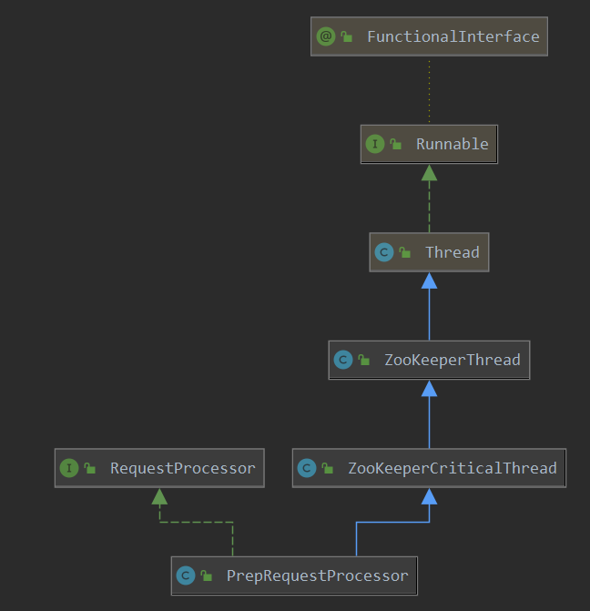

# PrepRequestProcessor 处理器




`PrepRequestProcessor`处理器, 作为请求过来时, 第一个进行处理的处理器,  先看一下其做了什么工作.

> org.apache.zookeeper.server.PrepRequestProcessor#PrepRequestProcessor

```java
public PrepRequestProcessor(ZooKeeperServer zks,
                            RequestProcessor nextProcessor) {
    super("ProcessThread(sid:" + zks.getServerId() + " cport:"
          + zks.getClientPort() + "):", zks.getZooKeeperServerListener());
    this.nextProcessor = nextProcessor;
    this.zks = zks;
}
```

> org.apache.zookeeper.server.PrepRequestProcessor#processRequest

```java
LinkedBlockingQueue<Request> submittedRequests = new LinkedBlockingQueue<Request>();    

// 可以看到 PrepRequestProcessor 处理器只是把请求缓存起来
// 之后缓存的请求 会在 PrepRequestProcessor 线程处理函数run中统一处理
public void processRequest(Request request) {
    // request.addRQRec(">prep="+zks.outstandingChanges.size());
    submittedRequests.add(request);
}
```

可以看到PrepRequestProcessor对于请求过来后, 处理时, 只是缓存起来. 而PrepRequestProcessor又是一个运行的线程, 其作为一个单独的线程又做了什么工作呢?

> org.apache.zookeeper.server.PrepRequestProcessor#run

```java
@Override
public void run() {
    try {
        while (true) {
            // 获取请求
            Request request = submittedRequests.take();
            long traceMask = ZooTrace.CLIENT_REQUEST_TRACE_MASK;
            if (request.type == OpCode.ping) {
                traceMask = ZooTrace.CLIENT_PING_TRACE_MASK;
            }
            if (Request.requestOfDeath == request) {
                break;
            }
            // 请求处理
            pRequest(request);
        }
    } catch (Exception e) {
        handleException(this.getName(), e);
    }
}
```

这下就明了了, 作为一个处理器,其把请求 缓存起来, 作为一个线程, 其获取那些缓存的请求, 进行异步的处理. 

> org.apache.zookeeper.server.PrepRequestProcessor#pRequest

```java
   @SuppressWarnings("unchecked")
    protected void pRequest(Request request) throws RequestProcessorException {
        request.hdr = null;
        request.txn = null;
        try {
            switch (request.type) {
                case OpCode.create:
                CreateRequest createRequest = new CreateRequest();
                pRequest2Txn(request.type, zks.getNextZxid(), request, createRequest, true);
                break;
            case OpCode.delete:
                DeleteRequest deleteRequest = new DeleteRequest();               
                pRequest2Txn(request.type, zks.getNextZxid(), request, deleteRequest, true);
                break;
            case OpCode.setData:
                SetDataRequest setDataRequest = new SetDataRequest();                
                pRequest2Txn(request.type, zks.getNextZxid(), request, setDataRequest, true);
                break;
            case OpCode.setACL:
                SetACLRequest setAclRequest = new SetACLRequest();                
                pRequest2Txn(request.type, zks.getNextZxid(), request, setAclRequest, true);
                break;
            case OpCode.check:
                CheckVersionRequest checkRequest = new CheckVersionRequest();              
                pRequest2Txn(request.type, zks.getNextZxid(), request, checkRequest, true);
                break;
            case OpCode.multi:
                MultiTransactionRecord multiRequest = new MultiTransactionRecord();
              	// .....
                break;
            //create/close session don't require request record
            case OpCode.createSession:
            case OpCode.closeSession:
                pRequest2Txn(request.type, zks.getNextZxid(), request, null, true);
                break;
 
            //All the rest don't need to create a Txn - just verify session
            case OpCode.sync:
            case OpCode.exists:
            case OpCode.getData:
            case OpCode.getACL:
            case OpCode.getChildren:
            case OpCode.getChildren2:
            case OpCode.ping:
            case OpCode.setWatches:
                zks.sessionTracker.checkSession(request.sessionId,
                        request.getOwner());
                break;
            default:
                break;
            }
        }catch (Exception e) {
            if (request.hdr != null) {
                request.hdr.setType(OpCode.error);
                request.txn = new ErrorTxn(Code.MARSHALLINGERROR.intValue());
            }
        }
        request.zxid = zks.getZxid();
        // 使用下一个处理器进行处理
        nextProcessor.processRequest(request);
    }
```

这里那看到, 针对不同的请求类型, 会进行  不同的请求, 之后`nextProcessor.processRequest(request)` 调用下一个处理器继续进行处理. 

下面来看一下CREATE请求的一个处理:

> org.apache.zookeeper.server.PrepRequestProcessor#pRequest2Txn

```java
   @SuppressWarnings("unchecked")
    protected void pRequest2Txn(int type, long zxid, Request request, Record record, boolean deserialize)
        throws KeeperException, IOException, RequestProcessorException
    {
        request.hdr = new TxnHeader(request.sessionId, request.cxid, zxid,
                                    Time.currentWallTime(), type);

        switch (type) {
            case OpCode.create:
                // session的检测
                zks.sessionTracker.checkSession(request.sessionId, request.getOwner());
                CreateRequest createRequest = (CreateRequest)record;   
                if(deserialize)
                    ByteBufferInputStream.byteBuffer2Record(request.request, createRequest);
                // 请求的路径
                String path = createRequest.getPath();
                // 最后的一个路径
                int lastSlash = path.lastIndexOf('/');
                if (lastSlash == -1 || path.indexOf('\0') != -1 || failCreate) {
                    LOG.info("Invalid path " + path + " with session 0x" +
                            Long.toHexString(request.sessionId));
                    throw new KeeperException.BadArgumentsException(path);
                }
                // 移除重复的 ACL
                List<ACL> listACL = removeDuplicates(createRequest.getAcl());
                if (!fixupACL(request.authInfo, listACL)) {
                    throw new KeeperException.InvalidACLException(path);
                }
                // 父节点的路径
                String parentPath = path.substring(0, lastSlash);
                // 获取父节点 的  record
                ChangeRecord parentRecord = getRecordForPath(parentPath);
                // 检测 ACL, 权限检测
                checkACL(zks, parentRecord.acl, ZooDefs.Perms.CREATE,
                        request.authInfo);
                // 父节点的  Cversion
                int parentCVersion = parentRecord.stat.getCversion();
                //
                CreateMode createMode =
                    CreateMode.fromFlag(createRequest.getFlags());
                if (createMode.isSequential()) {
                    path = path + String.format(Locale.ENGLISH, "%010d", parentCVersion);
                }
                // path校验
                validatePath(path, request.sessionId);
                try {
                    // 如果存在此 path的 changeRecord 那么报错
                    if (getRecordForPath(path) != null) {
                        throw new KeeperException.NodeExistsException(path);
                    }
                } catch (KeeperException.NoNodeException e) {
                    // ignore this one
                }
                // 父节点的 sessionId
                boolean ephemeralParent = parentRecord.stat.getEphemeralOwner() != 0;
                if (ephemeralParent) {
                    throw new KeeperException.NoChildrenForEphemeralsException(path);
                }
                // newCversion
                // 更新父节点的 Cversion
                int newCversion = parentRecord.stat.getCversion()+1;
                // 创建事务 header
                request.txn = new CreateTxn(path, createRequest.getData(),
                        listACL,
                        createMode.isEphemeral(), newCversion);
                // 节点要序列化的 信息
                StatPersisted s = new StatPersisted();
                if (createMode.isEphemeral()) {
                    s.setEphemeralOwner(request.sessionId);
                }
                parentRecord = parentRecord.duplicate(request.hdr.getZxid());
                // 父节点的 child数量增加
                parentRecord.childCount++;
                // 父节点的额 Cversion 更新
                parentRecord.stat.setCversion(newCversion);
                // 记录这个两个  record
                addChangeRecord(parentRecord);
                addChangeRecord(new ChangeRecord(request.hdr.getZxid(), path, s,
                        0, listACL));
                break;
             case OpCode.delete:
                break;
            case OpCode.setData:
                break;
            case OpCode.createSession:
                break;
            case OpCode.closeSession:
                break;
            case OpCode.check:
                break;
            default:
                
        }
    }
```

> org.apache.zookeeper.server.PrepRequestProcessor#addChangeRecord

```java
void addChangeRecord(ChangeRecord c) {
    synchronized (zks.outstandingChanges) {
        // 记录这个请求
        zks.outstandingChanges.add(c);
        // 记录这个 请求 和 path的映射关系
        zks.outstandingChangesForPath.put(c.path, c);
    }
}
```

可以看到这里对父节点的信息进行了更新, 把为outstandingChanges添加了一个缓存; 当然了outstandingChanges中的数据会在最后一个 处理器中才会进行处理. 

`个人感觉缓存是为了快速失败, 避免重复请求`.

总结下PrepRequestProcessor的处理:

1. 缓存请求
2. 对缓存请求处理, 如: CREATE时, 更新对应parent的信息
3. 把此path的请求缓存到outstandingChanges中


