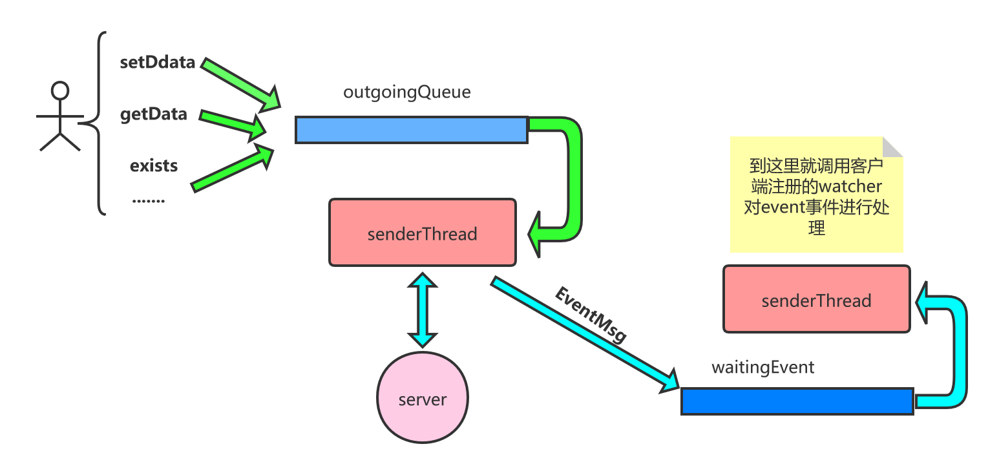

[TOC]

# zk client NIO 模型分析

分析入口点:

使用zk客户端时，直接创建一个ZooKeeper对象，就可以直接和server端进行通信，所以按照平时的使用为入口，看一下此类是如何和server端通信的。

构造函数:

> org.apache.zookeeper.ZooKeeper#ZooKeeper(java.lang.String, int, org.apache.zookeeper.Watcher)

```java
// zk客户端的构造函数
// connectStr=192.168.254.135:2181,192.168.254.136:2181,192.168.254.137:2181
public ZooKeeper(String connectString, int sessionTimeout, Watcher watcher)
    throws IOException
{
    this(connectString, sessionTimeout, watcher, false);
}
```

```java
// connectStr=192.168.254.135:2181,192.168.254.136:2181,192.168.254.137:2181
public ZooKeeper(String connectString, int sessionTimeout, Watcher watcher,
                 boolean canBeReadOnly) throws IOException {
    this(connectString, sessionTimeout, watcher, canBeReadOnly,
         createDefaultHostProvider(connectString));
}
```

```java
//// connectStr=192.168.254.135:2181,192.168.254.136:2181,192.168.254.137:2181
public ZooKeeper(String connectString, int sessionTimeout, Watcher watcher,
                 boolean canBeReadOnly, HostProvider aHostProvider)
    throws IOException {
    this(connectString, sessionTimeout, watcher, canBeReadOnly,
         aHostProvider, null);
}
```

```java
public ZooKeeper(String connectString, int sessionTimeout, Watcher watcher,
                 boolean canBeReadOnly, HostProvider aHostProvider,
                 ZKClientConfig clientConfig) throws IOException {
    LOG.info("Initiating client connection, connectString=" + connectString
             + " sessionTimeout=" + sessionTimeout + " watcher=" + watcher);

    if (clientConfig == null) {
        clientConfig = new ZKClientConfig();
    }
    this.clientConfig = clientConfig;
    // 客户端创建  watcher 管理器
    watchManager = defaultWatchManager();
    // 创建zk时传递watcher 最终作为 defaultWatcher
    watchManager.defaultWatcher = watcher;
    // connectStr=192.168.254.135:2181,192.168.254.136:2181,192.168.254.137:2181
    ConnectStringParser connectStringParser = new ConnectStringParser(
        connectString);
    hostProvider = aHostProvider;
    // getClientCnxnSocket 得到一个nio 客户端
    // createConnection 创建 连接
    cnxn = createConnection(connectStringParser.getChrootPath(),
                            hostProvider, sessionTimeout, this, watchManager,
                            getClientCnxnSocket(), canBeReadOnly);
    // 客户端开始运行
    // 开启发送packet线程
    // 开启处理事件(对watcher的处理)线程
    cnxn.start();
}
```

这里最后创建了几个对象，了解一下其作用:

1. WatcherManager 客户端对watcher的存储, 用于回调使用
2. 构造函数中传递的watcher设置为了 watcherManger中的defaultWatcher
3. 通过createConnection创建ClientCnxn, 其实 ClientCnxn就是客户端和server端的一个连接
4. 启动 ClientCnxn

先看一下客户端的WatcherManager, 其主要作用就是存储客户端注册的watcher:

> org.apache.zookeeper.ZooKeeper#defaultWatchManager

```java
/* Useful for testing watch handling behavior */
protected ZKWatchManager defaultWatchManager() {
    return new ZKWatchManager(getClientConfig().getBoolean(ZKClientConfig.DISABLE_AUTO_WATCH_RESET));
}
```

> org.apache.zookeeper.ZooKeeper.ZKWatchManager#ZKWatchManager

```java
// 可以看到最后注册的监听器都会存储到这三个 map中
//key为path,value为对应的注册的watcher
private final Map<String, Set<Watcher>> dataWatches =
    new HashMap<String, Set<Watcher>>();
// 监测节点 exists
private final Map<String, Set<Watcher>> existWatches =
    new HashMap<String, Set<Watcher>>();
// 监听器
private final Map<String, Set<Watcher>> childWatches =
    new HashMap<String, Set<Watcher>>();
private boolean disableAutoWatchReset;

ZKWatchManager(boolean disableAutoWatchReset) {
    this.disableAutoWatchReset = disableAutoWatchReset;
}
```

可以看大WatcherManager中有三个map，主要就是存储从客户端注册的 watcher。

分析完了watcherManger，下面看一下ClientCnxn的创建。

> org.apache.zookeeper.ZooKeeper#getClientCnxnSocket

```java
// 创建客户端socket
private ClientCnxnSocket getClientCnxnSocket() throws IOException {
    String clientCnxnSocketName = getClientConfig().getProperty(
        ZKClientConfig.ZOOKEEPER_CLIENT_CNXN_SOCKET);
    if (clientCnxnSocketName == null) {
        clientCnxnSocketName = ClientCnxnSocketNIO.class.getName();
    }
    // 通过反射创建客户端，默认创建ClientCnxnSocketNIO
    // 不过咱们这里 主要分析 基于netty的实现
    try {
        // 获取ClientCnxnSocket的构造器
        Constructor<?> clientCxnConstructor = Class.forName(clientCnxnSocketName).getDeclaredConstructor(ZKClientConfig.class);
        // 创建实例, 即得到一个NIO 客户端
        ClientCnxnSocket clientCxnSocket = (ClientCnxnSocket) clientCxnConstructor.newInstance(getClientConfig());
        return clientCxnSocket;
    } catch (Exception e) {
        IOException ioe = new IOException("Couldn't instantiate "
                                          + clientCnxnSocketName);
        ioe.initCause(e);
        throw ioe;
    }
}
```

> org.apache.zookeeper.ZooKeeper#createConnection

```java
// @VisibleForTesting
protected ClientCnxn createConnection(String chrootPath,
                                      HostProvider hostProvider, int sessionTimeout, ZooKeeper zooKeeper,
                                      ClientWatchManager watcher, ClientCnxnSocket clientCnxnSocket,
                                      boolean canBeReadOnly) throws IOException {
    return new ClientCnxn(chrootPath, hostProvider, sessionTimeout, this,
                          watchManager, clientCnxnSocket, canBeReadOnly);
}
```

> org.apache.zookeeper.ClientCnxn#ClientCnxn(java.lang.String, org.apache.zookeeper.client.HostProvider, int, org.apache.zookeeper.ZooKeeper, org.apache.zookeeper.ClientWatchManager, org.apache.zookeeper.ClientCnxnSocket, boolean)

```java
public ClientCnxn(String chrootPath, HostProvider hostProvider, int sessionTimeout, ZooKeeper zooKeeper,
                  ClientWatchManager watcher, ClientCnxnSocket clientCnxnSocket, boolean canBeReadOnly)
    throws IOException {
    this(chrootPath, hostProvider, sessionTimeout, zooKeeper, watcher,
         clientCnxnSocket, 0, new byte[16], canBeReadOnly);
}

```

```java
public ClientCnxn(String chrootPath, HostProvider hostProvider, int sessionTimeout, ZooKeeper zooKeeper,
                  ClientWatchManager watcher, ClientCnxnSocket clientCnxnSocket,
                  long sessionId, byte[] sessionPasswd, boolean canBeReadOnly) {
    // zk客户端
    this.zooKeeper = zooKeeper;
    // 客户端的zkWatcherManager
    this.watcher = watcher;
    // sessionid
    this.sessionId = sessionId;
    this.sessionPasswd = sessionPasswd;
    // session超时时间
    this.sessionTimeout = sessionTimeout;
    this.hostProvider = hostProvider;
    // 一般情况下为null
    this.chrootPath = chrootPath;
    // 连接超时
    connectTimeout = sessionTimeout / hostProvider.size();
    // 读取超时
    readTimeout = sessionTimeout * 2 / 3;
    readOnly = canBeReadOnly;
    // 发送线程
    sendThread = new SendThread(clientCnxnSocket);
    // 事件线程
    eventThread = new EventThread();
    // 客户端配置
    this.clientConfig=zooKeeper.getClientConfig();
    // 得到 request超时时间
    initRequestTimeout();
}
```

这里可以看到创建了两个线程，一个是发送线程，一个是事件线程，作用分别是发送请求到server端，以及处理server端返回的event事件。

> org.apache.zookeeper.ClientCnxn#start

```java
// 开启packet发送线程
// 开启事件处理线程
public void start() {
    sendThread.start();
    eventThread.start();
}
```

启动操作更简单了, 简单启动一下创建的线程. 

下面就分别看一下发送线程和event线程的工作内容。

> org.apache.zookeeper.ClientCnxn.SendThread#SendThread

```java
// 设置下 线程名字，记录 socket客户端
SendThread(ClientCnxnSocket clientCnxnSocket) {
    // 设置发送线程的 名字
    super(makeThreadName("-SendThread()"));
    // 更新状态
    state = States.CONNECTING;
    // 记录socket客户端
    this.clientCnxnSocket = clientCnxnSocket;
    // 设置精灵线程
    setDaemon(true);
}
```

> org.apache.zookeeper.ClientCnxn.SendThread#run

```java
public void run() {
    // 记录发送线程  sessionID,和发送队列
    clientCnxnSocket.introduce(this, sessionId, outgoingQueue);
    // 时间戳更新
    clientCnxnSocket.updateNow();
    // 更新时间戳
    clientCnxnSocket.updateLastSendAndHeard();
    int to;
    long lastPingRwServer = Time.currentElapsedTime();
    //ping 间隔
    final int MAX_SEND_PING_INTERVAL = 10000; //10 seconds
    InetSocketAddress serverAddress = null;
    while (state.isAlive()) {
        try {
            // 是否连接
            if (!clientCnxnSocket.isConnected()) {
                // don't re-establish connection if we are closing
                if (closing) {
                    break;
                }
                if (rwServerAddress != null) {
                    serverAddress = rwServerAddress;
                    rwServerAddress = null;
                } else {
                    serverAddress = hostProvider.next(1000);
                }
                // 开始连接
                startConnect(serverAddress);
                clientCnxnSocket.updateLastSendAndHeard();
            }

            if (state.isConnected()) {
                // determine whether we need to send an AuthFailed event.
                if (zooKeeperSaslClient != null) {
                    boolean sendAuthEvent = false;
                    if (zooKeeperSaslClient.getSaslState() == ZooKeeperSaslClient.SaslState.INITIAL) {
                        try {
                            // sasl 初始化  
                            zooKeeperSaslClient.initialize(ClientCnxn.this);
                        } catch (SaslException e) {
                            LOG.error("SASL authentication with Zookeeper Quorum member failed: " + e);
                            state = States.AUTH_FAILED;
                            sendAuthEvent = true;
                        }
                    }
                    KeeperState authState = zooKeeperSaslClient.getKeeperState();
                    if (authState != null) {
                        if (authState == KeeperState.AuthFailed) {
                            // An authentication error occurred during authentication with the Zookeeper Server.
                            state = States.AUTH_FAILED;
                            sendAuthEvent = true;
                        } else {
                            if (authState == KeeperState.SaslAuthenticated) {
                                sendAuthEvent = true;
                            }
                        }
                    }
				 // 发送 auth 事件
                    if (sendAuthEvent) {
                        eventThread.queueEvent(new WatchedEvent(
                            Watcher.Event.EventType.None,
                            authState,null));
                        if (state == States.AUTH_FAILED) {
                            // 验证失败,则发送一个 EventOfDeath的事件
                            eventThread.queueEventOfDeath();
                        }
                    }
                }
                to = readTimeout - clientCnxnSocket.getIdleRecv();
            } else {
                to = connectTimeout - clientCnxnSocket.getIdleRecv();
            }
            if (state.isConnected()) {
                //1000(1 second) is to prevent race condition missing to send the second ping
                //also make sure not to send too many pings when readTimeout is small 
                int timeToNextPing = readTimeout / 2 - clientCnxnSocket.getIdleSend() - 
                    ((clientCnxnSocket.getIdleSend() > 1000) ? 1000 : 0);
                //send a ping request either time is due or no packet sent out within MAX_SEND_PING_INTERVAL
                if (timeToNextPing <= 0 || clientCnxnSocket.getIdleSend() > MAX_SEND_PING_INTERVAL) {
                    // 发送ping,即发送一个空包,只有请求header,指明操作类型为 ping
                    sendPing();
                    clientCnxnSocket.updateLastSend();
                } else {
                    if (timeToNextPing < to) {
                        to = timeToNextPing;
                    }
                }
            }

            // If we are in read-only mode, seek for read/write server
            if (state == States.CONNECTEDREADONLY) {
                long now = Time.currentElapsedTime();
                int idlePingRwServer = (int) (now - lastPingRwServer);
                if (idlePingRwServer >= pingRwTimeout) {
                    lastPingRwServer = now;
                    idlePingRwServer = 0;
                    pingRwTimeout =
                        Math.min(2*pingRwTimeout, maxPingRwTimeout);
                    pingRwServer();
                }
                to = Math.min(to, pingRwTimeout - idlePingRwServer);
            }
            // 真实发送packet *************************
            clientCnxnSocket.doTransport(to, pendingQueue, ClientCnxn.this);
        } catch (Throwable e) {
           ....
    }
    synchronized (state) {
    }
    clientCnxnSocket.close();
    if (state.isAlive()) {
        eventThread.queueEvent(new WatchedEvent(Event.EventType.None,
                                                Event.KeeperState.Disconnected, null));
    }
    eventThread.queueEvent(new WatchedEvent(Event.EventType.None,
                                            Event.KeeperState.Closed, null));
}
```

> org.apache.zookeeper.ClientCnxnSocketNetty#doTransport

```java
@Override
void doTransport(int waitTimeOut,
                 List<Packet> pendingQueue,
                 ClientCnxn cnxn)
    throws IOException, InterruptedException {
    try {
        if (!firstConnect.await(waitTimeOut, TimeUnit.MILLISECONDS)) {
            return;
        }
        Packet head = null;
        if (needSasl.get()) {
            if (!waitSasl.tryAcquire(waitTimeOut, TimeUnit.MILLISECONDS)) {
                return;
            }
        } else {
            // 从队列中 超时获取一个 packet
            head = outgoingQueue.poll(waitTimeOut, TimeUnit.MILLISECONDS);
        }
        // check if being waken up on closing.
        // 如果当前sendThread出现问题,则再次把获取到的 packet 重新放入到 outgoingQueue 中
        if (!sendThread.getZkState().isAlive()) {
            // adding back the packet to notify of failure in conLossPacket().
            addBack(head);
            return;
        }
        // channel disconnection happened
        if (disconnected.get()) {
            // 断连了,则同样再次 把获取到的packet 放入到 outgoingQueue
            addBack(head);
            throw new EndOfStreamException("channel for sessionid 0x"
                                           + Long.toHexString(sessionId)
                                           + " is lost");
        }
        if (head != null) {
            // 真实发送
            // *******************************
            doWrite(pendingQueue, head, cnxn);
        }
    } finally {
        updateNow();
    }
}
```

发送动作其实就是从outgoingQueue中获取要发送的数据，然后发送出去

> org.apache.zookeeper.ClientCnxnSocketNetty#doWrite

```java
// 真实发送packet
private void doWrite(List<Packet> pendingQueue, Packet p, ClientCnxn cnxn) {
    updateNow();
    boolean anyPacketsSent = false;
    while (true) {
        if (p != WakeupPacket.getInstance()) {
            if ((p.requestHeader != null) &&
                (p.requestHeader.getType() != ZooDefs.OpCode.ping) &&
                (p.requestHeader.getType() != ZooDefs.OpCode.auth)) {
                // 设置 Xid
                p.requestHeader.setXid(cnxn.getXid());
                synchronized (pendingQueue) {
                    // 把发送的packet 记录到 pendingQueue
                    pendingQueue.add(p);
                }
            }
            // 发送packet
            // *********************
            sendPktOnly(p);
            anyPacketsSent = true;
        }
        if (outgoingQueue.isEmpty()) {
            break;
        }
        // 再次从待发送列表中获取一个待发送的packet
        p = outgoingQueue.remove();
    }
    // TODO: maybe we should flush in the loop above every N packets/bytes?
    // But, how do we determine the right value for N ...
    // 如果上面真实发送了packet,则在这里进行一次 flush
    if (anyPacketsSent) {
        channel.flush();
    }
}
```

> org.apache.zookeeper.ClientCnxnSocketNetty#sendPktOnly

```java
private ChannelFuture sendPktOnly(Packet p) {
    return sendPkt(p, false);
}
```

> org.apache.zookeeper.ClientCnxnSocketNetty#sendPkt

```java
private ChannelFuture sendPkt(Packet p, boolean doFlush) {
    // Assuming the packet will be sent out successfully. Because if it fails,
    // the channel will close and clean up queues.
    // 把数据转换为 byteBuffer
    p.createBB();
    // 更新发送时间
    updateLastSend();
    final ByteBuf writeBuffer = Unpooled.wrappedBuffer(p.bb);
    // 写数据到channel
    final ChannelFuture result = doFlush
        ? channel.writeAndFlush(writeBuffer)
        : channel.write(writeBuffer);
    // 添加一个回调函数 记录发送的数量
    result.addListener(onSendPktDoneListener);
    return result;
}
```

到此客户端就把数据写出到服务端了.

数据发送出去了,那么怎么读取server端的返回呢? 熟悉的netty的同学可能知道,netty的使用需要自己编写对应的处理函数的.  前面发送数据时有一次开始连接的操作:   org.apache.zookeeper.ClientCnxn.SendThread#run -- > startConnect  , 看一下netty是如何连接的.

> org.apache.zookeeper.ClientCnxn.SendThread#startConnect

```java
private void startConnect(InetSocketAddress addr) throws IOException {
    // initializing it for new connection
    saslLoginFailed = false;
    if(!isFirstConnect){
        try {
            Thread.sleep(r.nextInt(1000));
        } catch (InterruptedException e) {
            LOG.warn("Unexpected exception", e);
        }
    }
    state = States.CONNECTING;

    String hostPort = addr.getHostString() + ":" + addr.getPort();
    MDC.put("myid", hostPort);
    setName(getName().replaceAll("\\(.*\\)", "(" + hostPort + ")"));
    if (clientConfig.isSaslClientEnabled()) {
        try {
            if (zooKeeperSaslClient != null) {
                zooKeeperSaslClient.shutdown();
            }
            zooKeeperSaslClient = new ZooKeeperSaslClient(SaslServerPrincipal.getServerPrincipal(addr, clientConfig),
                                                          clientConfig);
        } catch (LoginException e) {
			....
        }
    }
    // 日志
    logStartConnect(addr);
    // 开始连接
    // ****************
    clientCnxnSocket.connect(addr);
}
```

> org.apache.zookeeper.ClientCnxnSocketNetty#connect

```java
// 连接操作
@Override
void connect(InetSocketAddress addr) throws IOException {
    firstConnect = new CountDownLatch(1);

    Bootstrap bootstrap = new Bootstrap()
        .group(eventLoopGroup)
        .channel(NettyUtils.nioOrEpollSocketChannel())
        .option(ChannelOption.SO_LINGER, -1)
        .option(ChannelOption.TCP_NODELAY, true)
        // 初始化handler
        .handler(new ZKClientPipelineFactory(addr.getHostString(), addr.getPort()));
    bootstrap = configureBootstrapAllocator(bootstrap);
    bootstrap.validate();

    connectLock.lock();
    try {
        // 连接操作
        connectFuture = bootstrap.connect(addr);
        // 对连接添加回调函数
        connectFuture.addListener(new ChannelFutureListener() {
            @Override
            public void operationComplete(ChannelFuture channelFuture) throws Exception {
                // this lock guarantees that channel won't be assigned after cleanup().
                boolean connected = false;
                connectLock.lock();
                try {
                    // 没有成功直接返回
                    if (!channelFuture.isSuccess()) {
                        LOG.info("future isn't success, cause:", channelFuture.cause());
                        return;
                        // 参数为null,则关闭channel
                    } else if (connectFuture == null) {
                        LOG.info("connect attempt cancelled");
                        // If the connect attempt was cancelled but succeeded
                        // anyway, make sure to close the channel, otherwise
                        // we may leak a file descriptor.
                        channelFuture.channel().close();
                        return;
                    }
                    // setup channel, variables, connection, etc.
                    // 获取对应的channel
                    channel = channelFuture.channel();
                    //
                    disconnected.set(false);
                    initialized = false;
                    lenBuffer.clear();
                    incomingBuffer = lenBuffer;

                    sendThread.primeConnection();
                    updateNow();
                    updateLastSendAndHeard();

                    if (sendThread.tunnelAuthInProgress()) {
                        waitSasl.drainPermits();
                        needSasl.set(true);
                        // 发送信息
                        sendPrimePacket();
                    } else {
                        needSasl.set(false);
                    }
                    connected = true;
                } finally {
                    connectFuture = null;
                    connectLock.unlock();
                    if (connected) {
                        LOG.info("channel is connected: {}", channelFuture.channel());
                    }
                    // need to wake on connect success or failure to avoid
                    // timing out ClientCnxn.SendThread which may be
                    // blocked waiting for first connect in doTransport().
                    wakeupCnxn();
                    firstConnect.countDown();
                }
            }
        });
    } finally {
        connectLock.unlock();
    }
}
```

这里就看到netty的经典使用了, 并且注册了对应的连接成功回调函数, 会发一些认证信息到server端.

> org.apache.zookeeper.ClientCnxnSocketNetty.ZKClientPipelineFactory#initChannel

```java
@Override
protected void initChannel(SocketChannel ch) throws Exception {
    ChannelPipeline pipeline = ch.pipeline();
    if (clientConfig.getBoolean(ZKClientConfig.SECURE_CLIENT)) {
        initSSL(pipeline);
    }
    // 添加 handler
    pipeline.addLast("handler", new ZKClientHandler());
}
```

这里看到注册了ZKClientHandler处理函数, 具体的读写都在此函数了:

> org.apache.zookeeper.ClientCnxnSocketNetty.ZKClientHandler#channelRead0

```java
// 读取操作
@Override
protected void channelRead0(ChannelHandlerContext ctx, ByteBuf buf) throws Exception {
    updateNow();
    while (buf.isReadable()) {
        // 数据可读数量少,则等待
        if (incomingBuffer.remaining() > buf.readableBytes()) {
            int newLimit = incomingBuffer.position()
                + buf.readableBytes();
            incomingBuffer.limit(newLimit);
        }
        // 读取数据到 incomingBuffer
        buf.readBytes(incomingBuffer);
        incomingBuffer.limit(incomingBuffer.capacity());
        // 是否读取到数据
        if (!incomingBuffer.hasRemaining()) {
            incomingBuffer.flip();
            if (incomingBuffer == lenBuffer) {
                // 增加接收量
                recvCount.getAndIncrement();
                // 读取发送的长度
                // 先读取server发送的数据的长度
                readLength();
            } else if (!initialized) {
                readConnectResult();
                lenBuffer.clear();
                incomingBuffer = lenBuffer;
                initialized = true;
                updateLastHeard();
            } else {
                // 读取数据
                // ****************** 读取server端点的响应
                sendThread.readResponse(incomingBuffer);
                lenBuffer.clear();
                incomingBuffer = lenBuffer;
                updateLastHeard();
            }
        }
    }
    wakeupCnxn();
    // Note: SimpleChannelInboundHandler releases the ByteBuf for us
    // so we don't need to do it.
}
```

> org.apache.zookeeper.ClientCnxn.SendThread#readResponse

```java
// 客户端读取server端的数据
void readResponse(ByteBuffer incomingBuffer) throws IOException {
    ByteBufferInputStream bbis = new ByteBufferInputStream(
        incomingBuffer);
    BinaryInputArchive bbia = BinaryInputArchive.getArchive(bbis);
    ReplyHeader replyHdr = new ReplyHeader();
    // 先反序列化 响应头
    replyHdr.deserialize(bbia, "header");
    // 如果xid是-2, 则只是 ping操作
    if (replyHdr.getXid() == -2) {
        // -2 is the xid for pings
        if (LOG.isDebugEnabled()) {
            LOG.debug("Got ping response for sessionid: 0x"
                      + Long.toHexString(sessionId)
                      + " after "
                      + ((System.nanoTime() - lastPingSentNs) / 1000000)
                      + "ms");
        }
        return;
    }
    // 如果是 xid=-4, 则表示 是 auth 相关的
    if (replyHdr.getXid() == -4) {
        // -4 is the xid for AuthPacket               
        if(replyHdr.getErr() == KeeperException.Code.AUTHFAILED.intValue()) {
            state = States.AUTH_FAILED;                    
            eventThread.queueEvent( new WatchedEvent(Watcher.Event.EventType.None, 
                                                     Watcher.Event.KeeperState.AuthFailed, null) );
            eventThread.queueEventOfDeath();
        }
        if (LOG.isDebugEnabled()) {
            LOG.debug("Got auth sessionid:0x"
                      + Long.toHexString(sessionId));
        }
        return;
    }
    // 如果xid是-1,则表示是 server端响应的事件
    if (replyHdr.getXid() == -1) {
        // -1 means notification
        if (LOG.isDebugEnabled()) {
            LOG.debug("Got notification sessionid:0x"
                      + Long.toHexString(sessionId));
        }
        // 创建事件
        WatcherEvent event = new WatcherEvent();
        // 反序列化 事件
        event.deserialize(bbia, "response");

        // convert from a server path to a client path
        if (chrootPath != null) {
            String serverPath = event.getPath();
            if(serverPath.compareTo(chrootPath)==0)
                event.setPath("/");
            else if (serverPath.length() > chrootPath.length())
                event.setPath(serverPath.substring(chrootPath.length()));
            else {
                LOG.warn("Got server path " + event.getPath()
                         + " which is too short for chroot path "
                         + chrootPath);
            }
        }
        // 封装返回的事件
        WatchedEvent we = new WatchedEvent(event);
        if (LOG.isDebugEnabled()) {
            LOG.debug("Got " + we + " for sessionid 0x"
                      + Long.toHexString(sessionId));
        }
        // 把server返回的事件 放入到waitingEvents 缓存起来
        eventThread.queueEvent( we );
        return;
    }
    Packet packet;
    synchronized (pendingQueue) {
        if (pendingQueue.size() == 0) {
            throw new IOException("Nothing in the queue, but got "
                                  + replyHdr.getXid());
        }
        packet = pendingQueue.remove();
    }
    try {
        // 请求头 和响应头的xid不一致, 则出错
        if (packet.requestHeader.getXid() != replyHdr.getXid()) {
            packet.replyHeader.setErr(
                KeeperException.Code.CONNECTIONLOSS.intValue());
            throw new IOException("Xid out of order. Got Xid "
                                  + replyHdr.getXid() + " with err " +
                                  + replyHdr.getErr() +
                                  " expected Xid "
                                  + packet.requestHeader.getXid()
                                  + " for a packet with details: "
                                  + packet );
        }
        // 设置响应header的数据
        packet.replyHeader.setXid(replyHdr.getXid());
        packet.replyHeader.setErr(replyHdr.getErr());
        packet.replyHeader.setZxid(replyHdr.getZxid());
        if (replyHdr.getZxid() > 0) {
            lastZxid = replyHdr.getZxid();
        }
        // 反序列化 响应的数据
        if (packet.response != null && replyHdr.getErr() == 0) {
            packet.response.deserialize(bbia, "response");
        }

        if (LOG.isDebugEnabled()) {
            LOG.debug("Reading reply sessionid:0x"
                      + Long.toHexString(sessionId) + ", packet:: " + packet);
        }
    } finally {
        // 在这里根据响应的结果,来进行watcher的是否注册
        // ***************** 注册 watcher的操作
        finishPacket(packet);
    }
}
```

可以看到这里对server返回的数据反序列，针对ping  event事件  以及其他请求进行处理。

到这里客户端的 NIO 模型就比较清楚了，客户端的数据会放入到 outgoingQueue 队列中，senderThread从此队列中获取对应的packet，然后发送；之后读取server端的返回: 1. 如果是ping则不作处理  2, 如果是event事件,则放入外waitingevent队列  3. 其他响应则反序列化对应的数据到packet中.

最后 finishPacket 对针对响应的结果，来判断是否把客户端的watcher进行注册。 如果响应成功，则注册。

> org.apache.zookeeper.ClientCnxn#finishPacket

```java
protected void finishPacket(Packet p) {
    int err = p.replyHeader.getErr();
    if (p.watchRegistration != null) {
        // 根据响应头去进行注册
        // 如果响应头不是0,即有错误,则不进行watcher的注册
        p.watchRegistration.register(err);
    }
	.... 
}
```

如果成功,则注册

> org.apache.zookeeper.ZooKeeper.WatchRegistration#register

```java
// 注册操作
public void register(int rc) {
    if (shouldAddWatch(rc)) {
        // 这里会根据不同类型的watcher注册器 dateWatcherRegister  existWatcherRegister childWatcherRegister
        // 返回对应的watcherManger对应的map容器
        Map<String, Set<Watcher>> watches = getWatches(rc);
        synchronized(watches) {
            Set<Watcher> watchers = watches.get(clientPath);
            if (watchers == null) {
                watchers = new HashSet<Watcher>();
                watches.put(clientPath, watchers);
            }
            // 把watcher放入到 watcherManager中 对应的map
            watchers.add(watcher);
        }
    }
}
// org.apache.zookeeper.ZooKeeper.ChildWatchRegistration#getWatches
@Override
protected Map<String, Set<Watcher>> getWatches(int rc) {
    return watchManager.childWatches;
}
```

下面看一下对应的发送数据时的操作，这里以getDate操作为例:

> org.apache.zookeeper.ZooKeeper#getData(java.lang.String, org.apache.zookeeper.Watcher, org.apache.zookeeper.data.Stat)

```java
// 以此为入口 来分析一下 watcher的注册流程
public byte[] getData(final String path, Watcher watcher, Stat stat)
    throws KeeperException, InterruptedException
{
    // 要获取数据的 path 地址
    final String clientPath = path;
    PathUtils.validatePath(clientPath);

    // the watch contains the un-chroot path
    WatchRegistration wcb = null;
    if (watcher != null) {
        // 如果设置了watcher,则再一次包装为 DataWatchRegistration
        wcb = new DataWatchRegistration(watcher, clientPath);
    }

    final String serverPath = prependChroot(clientPath);
    // 创建 请求头
    RequestHeader h = new RequestHeader();
    // 设置 请求的操作类型
    h.setType(ZooDefs.OpCode.getData);
    // 创建getDateRequest
    GetDataRequest request = new GetDataRequest();
    // 设置请求的地址
    request.setPath(serverPath);
    // 设置是否注册了 watcher
    request.setWatch(watcher != null);
    // 创建getDateResponse,记录具体的响应
    GetDataResponse response = new GetDataResponse();
    // 由cnxn 进行数据的发送
    // r即server返回的响应头
    // 这里提交后,会调用wait函数,等待对应的数据返回; 当数据返回后,会调用notifyAll进行唤醒
    ReplyHeader r = cnxn.submitRequest(h, request, response, wcb);
    if (r.getErr() != 0) {
        throw KeeperException.create(KeeperException.Code.get(r.getErr()),
                                     clientPath);
    }
    // 参数中的stat 记录 响应的stat值
    if (stat != null) {
        DataTree.copyStat(response.getStat(), stat);
    }
    // 返回响应的数据
    return response.getData();
}
```

> org.apache.zookeeper.ClientCnxn#submitRequest(org.apache.zookeeper.proto.RequestHeader, org.apache.jute.Record, org.apache.jute.Record, org.apache.zookeeper.ZooKeeper.WatchRegistration)

```java
// 发送request
public ReplyHeader submitRequest(RequestHeader h, Record request,
                                 Record response, WatchRegistration watchRegistration,
                                 WatchDeregistration watchDeregistration)
    throws InterruptedException {
    // 创建一个 记录响应header的 ReplyHeader
    ReplyHeader r = new ReplyHeader();
    // 把要发送的数据 封装为packet 缓存起来(即放入到队列中)
    Packet packet = queuePacket(h, r, request, response, null, null, null,
                                null, watchRegistration, watchDeregistration);
    synchronized (packet) {
        if (requestTimeout > 0) {
            // Wait for request completion with timeout
            waitForPacketFinish(r, packet);
        } else {
            // Wait for request completion infinitely
            while (!packet.finished) {
                packet.wait();
            }
        }
    }
    // 如果发生了 TIMEOUT 异常,则进行一些 clean清除操作
    if (r.getErr() == Code.REQUESTTIMEOUT.intValue()) {
        sendThread.cleanAndNotifyState();
    }
    return r;
}
```

> org.apache.zookeeper.ClientCnxn#queuePacket

```java
// 把要发送的request 封装为 packet,并放入到队列中
public Packet queuePacket(RequestHeader h, ReplyHeader r, Record request,
                          Record response, AsyncCallback cb, String clientPath,
                          String serverPath, Object ctx, WatchRegistration watchRegistration,
                          WatchDeregistration watchDeregistration) {
    Packet packet = null;

    // Note that we do not generate the Xid for the packet yet. It is
    // generated later at send-time, by an implementation of ClientCnxnSocket::doIO(),
    // where the packet is actually sent.
    // 封装为 packet
    packet = new Packet(h, r, request, response, watchRegistration);
    // 异步回调
    packet.cb = cb;
    packet.ctx = ctx;
    // 客户端path
    packet.clientPath = clientPath;
    // server端path
    packet.serverPath = serverPath;
    // 要注册 watcher
    packet.watchDeregistration = watchDeregistration;
    // The synchronized block here is for two purpose:
    // 1. synchronize with the final cleanup() in SendThread.run() to avoid race
    // 2. synchronized against each packet. So if a closeSession packet is added,
    // later packet will be notified.
    synchronized (state) {
        if (!state.isAlive() || closing) {
            conLossPacket(packet);
        } else {
            // If the client is asking to close the session then
            // mark as closing
            if (h.getType() == OpCode.closeSession) {
                closing = true;
            }
            // 把packet 数据放入到 待发送队列中
            outgoingQueue.add(packet);
        }
    }
    // 如果客户端是nio,则立即唤醒一次 selector
    sendThread.getClientCnxnSocket().packetAdded();
    return packet;
}

```

可以最终的操作packet就是放入到了outgoingQueue队列中.


最后看一下eventThread的处理:

> org.apache.zookeeper.ClientCnxn.EventThread#run

```java
@Override
@SuppressFBWarnings("JLM_JSR166_UTILCONCURRENT_MONITORENTER")
public void run() {
    try {
        isRunning = true;
        while (true) {
            // 阻塞从队列中获取事件
            Object event = waitingEvents.take();
            if (event == eventOfDeath) {
                wasKilled = true;
            } else {
                // 对事件进行处理
                // ***********************
                processEvent(event);
            }
            if (wasKilled)
                synchronized (waitingEvents) {
                if (waitingEvents.isEmpty()) {
                    isRunning = false;
                    break;
                }
            }
        }
    } catch (InterruptedException e) {
        LOG.error("Event thread exiting due to interruption", e);
    }
    LOG.info("EventThread shut down for session: 0x{}",
             Long.toHexString(getSessionId()));
}
```

> org.apache.zookeeper.ClientCnxn.EventThread#processEvent

```java
// 调用watcher回调函数  来对事件进行处理
private void processEvent(Object event) {
    if (event instanceof WatcherSetEventPair) {
        // each watcher will process the event
        // 把获取到的 event转换为 Pair
        WatcherSetEventPair pair = (WatcherSetEventPair) event;
        // 遍历所有的watcher,并调用其process对 事件进行处理
        for (Watcher watcher : pair.watchers) {
            try {
                watcher.process(pair.event);
            } catch (Throwable t) {
                LOG.error("Error while calling watcher ", t);
            }
        }
    }
    ......
}
```

其实就是调用客户端注册的对应的watcher进行处理. 

最后来一个图小结一下:




