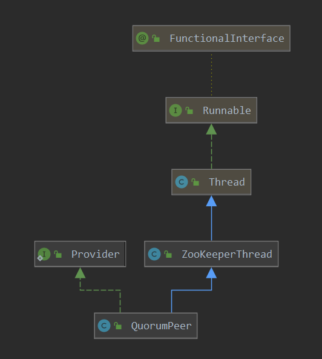
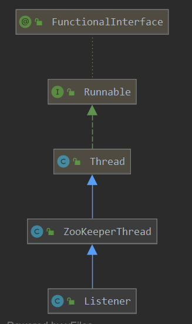
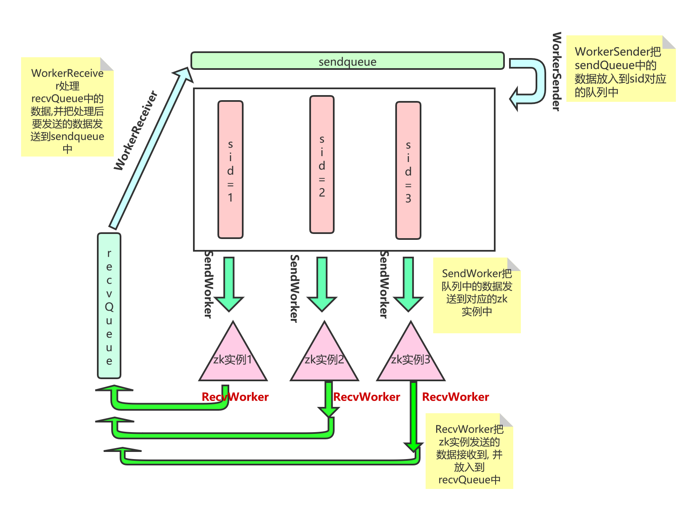

# 选举实现

本篇来分析一下zk的选举机制实现，其中跟选举有很大关系的一个类主要是：QuorumPeer，FastLeaderElection，QuorumCnxManager。

其中简单理解`QuorumPeer`表示当前zk实例的一个具体类，`FastLeaderElection`表示选举算法，`QuorumCnxManager`用于管理和其他zk实例的通信，下面就来看一下具体的选举流程。

## 1. QuorumPeer 实例启动

从zk的启动类来开始分析：

> org.apache.zookeeper.server.quorum.QuorumPeerMain#main

```java
    public static void main(String[] args) {
        // 创建一个 QuorumPeerMain
        QuorumPeerMain main = new QuorumPeerMain();
        try {
            // 根据传递进来的参数 进行初始化
            main.initializeAndRun(args);
        }
        ......
        System.exit(0);
    }
```

> org.apache.zookeeper.server.quorum.QuorumPeerMain#initializeAndRun

```java
protected void initializeAndRun(String[] args)
    throws ConfigException, IOException, AdminServerException
    {
        // 创建一个配置类,主要用来保存配置文件中的配置
        QuorumPeerConfig config = new QuorumPeerConfig();
        if (args.length == 1) {
            // 配置文件解析
            // 创建server机器信息
            config.parse(args[0]);
        }

        // Start and schedule the the purge task
        // 数据清理线程  snap 快照清理
        DatadirCleanupManager purgeMgr = new DatadirCleanupManager(config
                .getDataDir(), config.getDataLogDir(), config
                .getSnapRetainCount(), config.getPurgeInterval());
        purgeMgr.start();
        // 集群模式
        .....
        runFromConfig(config);
    }
```

> 

```java
 // 即从配置开始运行
    // 即把读取到的配置 设置到 QuorumPeer中,并开始了真正的运行
    public void runFromConfig(QuorumPeerConfig config)
            throws IOException, AdminServerException
    {
      LOG.info("Starting quorum peer");
      try {
          ServerCnxnFactory cnxnFactory = null;
          ServerCnxnFactory secureCnxnFactory = null;
            // getClientPortAddress 获取客户端登录时的地址
          if (config.getClientPortAddress() != null) {
              // 通过反射创建NIOServerCnxnFactory, NIO 通信
              // ***************************************************
              cnxnFactory = ServerCnxnFactory.createFactory();
              // 创建 NioServerSocket 以及 worker处理IO的线程
              // 对NioServer进行一些配置
              cnxnFactory.configure(config.getClientPortAddress(),
                      config.getMaxClientCnxns(),
                      false);
          }
            // 创建 quorumPeer
          quorumPeer = getQuorumPeer();
         // 下面就是把从配置文件中读取的内容配置到 quorumPeer中
         // quorumPeer其实就是当前zk实例的一个抽象
          // 选举算法
          // ElectionType 记录了具体的选举方式,也就是指定了选举算法
          quorumPeer.setElectionType(config.getElectionAlg());
          quorumPeer.setConfigFileName(config.getConfigFilename());
          // 数据树 除了在磁盘有一份保存外,还有一份在 内存中有一个信息树
          // 此处就是创建 内存中的数据树
          // *************************************
          quorumPeer.setZKDatabase(new ZKDatabase(quorumPeer.getTxnFactory()));
          // getQuorumVerifier此属性很重要,记录了集群中的其他节点的信息,以及各个节点的角色
          // 使用AddressTuple 记录地址
          quorumPeer.setQuorumVerifier(config.getQuorumVerifier(), false);
          if (config.getLastSeenQuorumVerifier()!=null) {
              quorumPeer.setLastSeenQuorumVerifier(config.getLastSeenQuorumVerifier(), false);
          }
          quorumPeer.initConfigInZKDatabase();
		...... // 省略非关键代码 
          // auth相关的配置
          quorumPeer.initialize();
          // 启动
          quorumPeer.start();
          // 等待线程结束
          quorumPeer.join();
      }
    }
```

> org.apache.zookeeper.server.quorum.QuorumPeer#start




```java
 @Override
    public synchronized void start() {
        if (!getView().containsKey(myid)) {
            throw new RuntimeException("My id " + myid + " not in the peer list");
         }
        // 加载磁盘数据
        loadDataBase();
        // selector 接收客户端请求 并进行处理
        // 一个selector 多个worker 和 netty 很像
        // ************************************服务端请求接收****************
        startServerCnxnFactory();
        try {
            adminServer.start();
        } catch (AdminServerException e) {
            LOG.warn("Problem starting AdminServer", e);
            System.out.println(e);
        }
        // 开始leader选举前的准备
        startLeaderElection();
        // 开始选举
        // 注意 QuorumPeer 也就是本class 也是一个线程
        // 也就是说,此处的start会运行本类的run方法
        super.start();
    }
```

> org.apache.zookeeper.server.quorum.QuorumPeer#start

```java
// zk实例的启动
@Override
public synchronized void start() {
    // 加载 内存数据库
    loadDataBase();
    // 对外服务端口 开始监听
    cnxnFactory.start();
    // 开始选举
    // 此会创建对其他实例的scoket连接, 以及运行相关的数据 收发线程,为leader竞争做准备
    startLeaderElection();
    // 当前 线程开始运行,当前线程 可以抽象的认为 代表当前的zk实例,会进行投票
    // 开始进行leader的竞争
    super.start();
}
```

在这里呢，四个函数，做了非常重要的四种工作：

1. loadDataBase  内存数据库的创建
2. cnxnFactory.start() 对外服务接口，即常见的2181的服务的创建
3. startLeaderElection() 准备好了选举操作
4. super.start()  开启当前线程，主要是做了(1) leader选举，(2) 如果是leader则创建了和follower的数据沟通server；如果是follower则尝试跟leader进行同步

本篇主要讲解leader选举，故从后面2个函数调用入手。

## 2. startLeaderElection

> org.apache.zookeeper.server.quorum.QuorumPeer#startLeaderElection

```java
// 开始leader的选举
synchronized public void startLeaderElection() {
    try {
        // 创建当前初始的选票
        // 即第一次选票是投票给自己
        currentVote = new Vote(myid, getLastLoggedZxid(), getCurrentEpoch());
    }
    // view其实就是 集群中的server信息(有参与权),从配置文件中解析的
    // 这里主要是获取自己的 地址
    for (QuorumServer p : getView().values()) {
        if (p.id == myid) {
            // 获取当前节点对应的通信地址
            myQuorumAddr = p.addr;
            break;
        }
    }
    // 根据指定的选举类型
    // 创建选举算法
    this.electionAlg = createElectionAlgorithm(electionType);
}
```

这里主要是:

1. 设置当前的选票为自己
2. 获取当前zk实例的地址
3. 创建选举算法

> org.apache.zookeeper.server.quorum.QuorumPeer#createElectionAlgorithm

```java
protected Election createElectionAlgorithm(int electionAlgorithm){
    Election le=null;
    // 其三种的选举算法  其实已经过期
    switch (electionAlgorithm) {
        case 0:
            le = new LeaderElection(this);
            break;
        case 1:
            le = new AuthFastLeaderElection(this);
            break;
        case 2:
            le = new AuthFastLeaderElection(this, true);
            break;
        case 3:
            // 此manager用于管理和其他zk的通信
            qcm = createCnxnManager();
            // 获取对应的接收 或 创建到其他zk实例连接的listener
            // 此listener会使用接收的socket创建到其他zk实例的 消息发送线程sendworker  消息接收线程recvWorker,并启动
            QuorumCnxManager.Listener listener = qcm.listener;
            if(listener != null){
                // 开始监听其他zk实例到当前实例监听地址的socket连接
                listener.start();
                // 选举的算法
                le = new FastLeaderElection(this, qcm);
            } else {
                LOG.error("Null listener when initializing cnx manager");
            }
            break;
        default:
            assert false;
    }
    return le;
}
```

这里最终使用的选举算法其实是FastLeaderElection，从代码中看前面三个算法其实已经不推荐使用了。

这里呢创建了几个对象，其实都是比较重量级的，大概说一下每个类的作用:

1. createCnxnManager  创建 CnxnManager 其主要功能就是管理和其他zk实例的socket连接，以及对应的选票数据发送的sendWork和选票的接收的 recvWorker
2. QuorumCnxManager.Listener  其实是一个ServerSocket，主要用于接收其他zk实例的socket连接；QuorumCnxManager.Listener其监听的端口其实是leader的选举端口
3. FastLeaderElection  这是实现leader选举的算法

下面去解析一下前两个类的功能。

### 2.1 CnxnManager 

> org.apache.zookeeper.server.quorum.QuorumPeer#createCnxnManager

```java
public QuorumCnxManager createCnxnManager() {
    // 创建QuorumCnxManager
    return new QuorumCnxManager(this.getId(),
                                this.getView(),
                                this.authServer,
                                this.authLearner,
                                this.tickTime * this.syncLimit,
                                this.getQuorumListenOnAllIPs(),
                                this.quorumCnxnThreadsSize,
                                this.isQuorumSaslAuthEnabled());
}
```

> org.apache.zookeeper.server.quorum.QuorumCnxManager#QuorumCnxManager

```java
public QuorumCnxManager(final long mySid,
                        Map<Long,QuorumPeer.QuorumServer> view,
                        QuorumAuthServer authServer,
                        QuorumAuthLearner authLearner,
                        int socketTimeout,
                        boolean listenOnAllIPs,
                        int quorumCnxnThreadsSize,
                        boolean quorumSaslAuthEnabled) {
    this(mySid, view, authServer, authLearner, socketTimeout, listenOnAllIPs,
         quorumCnxnThreadsSize, quorumSaslAuthEnabled, new ConcurrentHashMap<Long, SendWorker>());
}


public QuorumCnxManager(final long mySid,
                        Map<Long,QuorumPeer.QuorumServer> view,
                        QuorumAuthServer authServer,
                        QuorumAuthLearner authLearner,
                        int socketTimeout,
                        boolean listenOnAllIPs,
                        int quorumCnxnThreadsSize,
                        boolean quorumSaslAuthEnabled,
                        ConcurrentHashMap<Long, SendWorker> senderWorkerMap) {
    // 记录发送消息worker的容器
    this.senderWorkerMap = senderWorkerMap;
    // 接收队列
    this.recvQueue = new ArrayBlockingQueue<Message>(RECV_CAPACITY);
    // ***********这里的发送队列, 针对每一个zk实例都创建了一个对应的发送队列************
    // 每个server实例对应一个待发送的 队列,存储其中要发送的数据
    this.queueSendMap = new ConcurrentHashMap<Long, ArrayBlockingQueue<ByteBuffer>>();
    // 每个server上次发送的信息
    this.lastMessageSent = new ConcurrentHashMap<Long, ByteBuffer>();
    String cnxToValue = System.getProperty("zookeeper.cnxTimeout");
    if(cnxToValue != null){
        this.cnxTO = Integer.parseInt(cnxToValue);
    }

    this.mySid = mySid;
    this.socketTimeout = socketTimeout;
    // 集群中的server信息
    this.view = view;
    this.listenOnAllIPs = listenOnAllIPs;
    // 认证相关
    initializeAuth(mySid, authServer, authLearner, quorumCnxnThreadsSize,
                   quorumSaslAuthEnabled);

    // Starts listener thread that waits for connection requests
    // 此listener 会接收 或者 创建到其他zk实例的连接
    // 并利用创建的socket连接,创建具体的消息发送者 sendWorker  消息接收recvWorker 线程
    // 并启动对应的接收和发送线程
    // 这里创建好之后,就会leader选举 做好了准备(发送选票等信息)
    listener = new Listener();
}
```


### 2.2  QuorumCnxManager.Listener

Listener  其实就是一个线程并监听对应的




> org.apache.zookeeper.server.quorum.QuorumCnxManager.Listener#run

```java
@Override
        public void run() {
            int numRetries = 0;
            InetSocketAddress addr;
            while((!shutdown) && (numRetries < 3)){
                try {
                    // 创建server端实例
                    ss = new ServerSocket();
                    ss.setReuseAddress(true);
                    // 创建选举的地址
                    if (listenOnAllIPs) {
                        // 获取当前 zk实例的选举监听端口号
                        int port = view.get(QuorumCnxManager.this.mySid)
                            .electionAddr.getPort();
                        addr = new InetSocketAddress(port);
                    } else {
                        addr = view.get(QuorumCnxManager.this.mySid)
                            .electionAddr;
                    }
                    LOG.info("My election bind port: " + addr.toString());
                    // 设置线程名字
                    setName(view.get(QuorumCnxManager.this.mySid)
                            .electionAddr.toString());
                    // serverSocket的地址绑定
                    // 即 绑定到 选举地址
                    ss.bind(addr);
                    while (!shutdown) {
                        // 等待接收其他 zk实例的连接
                        // 这里会进行阻塞, 故不会占用太多资源
                        Socket client = ss.accept();
                        // 对接收到的连接进行一些配置
                        setSockOpts(client);
                        LOG.info("Received connection request "
                                + client.getRemoteSocketAddress());

                        // Receive and handle the connection request
                        // asynchronously if the quorum sasl authentication is
                        // enabled. This is required because sasl server
                        // authentication process may take few seconds to finish,
                        // this may delay next peer connection requests.
                        if (quorumSaslAuthEnabled) {
                            receiveConnectionAsync(client);
                        } else {
                            // 处理接收到的客户端
                            // 对接收到的连接进行处理
                            receiveConnection(client);
                        }

                        numRetries = 0;
                    }
                } catch (IOException e) {
                   	..//  一异常处理
                }
        }
```

这里可以看到就是创建了一个serverSocket的服务端, 等待接收其他的socket连接, 之后对接收到socket进行处理.  下面看一下对接收到的连接进行了什么处理.

> org.apache.zookeeper.server.quorum.QuorumCnxManager#receiveConnection

```java
public void receiveConnection(final Socket sock) {
        DataInputStream din = null;
        try {
            // 获取数据流
            din = new DataInputStream(
                    new BufferedInputStream(sock.getInputStream()));
            // 处理接收
            // 这里根据接收的socket 创建了 发送消息的sendWorker  接收消息的 RecvWorker线程 并启动
            // 并且 如果对端的 myId小于自己的myId,则关闭此连接
            // 即 连接时 是 MyId大的连接myId小的
            handleConnection(sock, din);
        } catch (IOException e) {
           // 异常处理
    }
```

> org.apache.zookeeper.server.quorum.QuorumCnxManager#handleConnection

```java
    // 处理接收
    // 这里根据接收的socket 创建了 发送消息的sendWorker  接收消息的 RecvWorker线程 并启动
    // 并且 如果对端的 myId小于自己的myId,则关闭此连接
    // 即 连接时 是 MyId大的连接myId小的
    private void handleConnection(Socket sock, DataInputStream din)
            throws IOException {
        Long sid = null;
        try {
            // Read server id
            sid = din.readLong();
            if (sid < 0) { 
                sid = din.readLong();
                int num_remaining_bytes = din.readInt();
                if (num_remaining_bytes < 0 || num_remaining_bytes > maxBuffer) {
                    LOG.error("Unreasonable buffer length: {}", num_remaining_bytes);
                    closeSocket(sock);
                    return;
                }
                byte[] b = new byte[num_remaining_bytes];
                int num_read = din.read(b);
                if (num_read != num_remaining_bytes) {
                    LOG.error("Read only " + num_read + " bytes out of " + num_remaining_bytes + " sent by server " + sid);
                }
            }
            if (sid == QuorumPeer.OBSERVER_ID) {
                /*
                 * Choose identifier at random. We need a value to identify
                 * the connection.
                 */
                sid = observerCounter.getAndDecrement();
                LOG.info("Setting arbitrary identifier to observer: " + sid);
            }
        } catch (IOException e) {
            // 异常处理
            closeSocket(sock);
            LOG.warn("Exception reading or writing challenge: " + e.toString());
            return;
        }

        // do authenticating learner
        LOG.debug("Authenticating learner server.id: {}", sid);
        authServer.authenticate(sock, din);

        //If wins the challenge, then close the new connection.
        if (sid < this.mySid) {
            // 查看是否有 此 myid对应的 发送worker
            // 如果有,则关闭,
            // 即 只允许 myid大的连接 myid小的 zk实例
            SendWorker sw = senderWorkerMap.get(sid);
            if (sw != null) {
                sw.finish();
            }

            /*
             * Now we start a new connection
             */
            LOG.debug("Create new connection to server: " + sid);
            // 关闭这个从小的sid创建的连接
            closeSocket(sock);
            // 从大的sid去连接小的sid
            connectOne(sid);

            // Otherwise start worker threads to receive data.
        } else {
            // 创建发送 SendWorker
            SendWorker sw = new SendWorker(sock, sid);
            // 创建具体接收消息的线程
            RecvWorker rw = new RecvWorker(sock, din, sid, sw);
            // 把接收worker 注入到 发送worker中
            sw.setRecv(rw);
            //
            SendWorker vsw = senderWorkerMap.get(sid);
            
            if(vsw != null)
                vsw.finish();
            // 记录 发送worker
            senderWorkerMap.put(sid, sw);
            // 创建 此myid实例对应的 消息队列
            queueSendMap.putIfAbsent(sid, new ArrayBlockingQueue<ByteBuffer>(SEND_CAPACITY));
            // 启动线程
            sw.start();
            rw.start();
            return;
        }
    }
```

简单说这里主要做了三件事:

1. 读取连接中发送过来的sid
2. 如果对端的sid小于自己, 那么就关闭这里连接, 自己则发出连接
3. 创建针对此socket的数据接收RecvWorker线程 和 数据发送SenderWorker 线程, 并启动

`对于leader选举来说,这里为leader选举时选票的发送,创建好了环境.`

#### 2.2.1 SendWorker 作用

> org.apache.zookeeper.server.quorum.QuorumCnxManager.SendWorker#run

```java
@Override
public void run() {
    threadCnt.incrementAndGet();
    try {
        // 获取此 sid对应的 待发送队列
        ArrayBlockingQueue<ByteBuffer> bq = queueSendMap.get(sid);
        if (bq == null || isSendQueueEmpty(bq)) {
            ByteBuffer b = lastMessageSent.get(sid);
            if (b != null) {
                LOG.debug("Attempting to send lastMessage to sid=" + sid);
                // 则进行发送
                send(b);
            }
        }
    } catch (IOException e) {
        LOG.error("Failed to send last message. Shutting down thread.", e);
        this.finish();
    }

    try {
        while (running && !shutdown && sock != null) {
            ByteBuffer b = null;
            try {
                // 获取到此 zk实例 对应的 发送队列
                ArrayBlockingQueue<ByteBuffer> bq = queueSendMap
                    .get(sid);
                if (bq != null) {
                    // 从队列中获取 要发送的数据
                    b = pollSendQueue(bq, 1000, TimeUnit.MILLISECONDS);
                } else {
                    break;
                }

                if(b != null){
                    // 记录本次发送的数据
                    lastMessageSent.put(sid, b);
                    // 数据发送
                    send(b);
                }
            } catch (InterruptedException e) {
                LOG.warn("Interrupted while waiting for message on queue",
                         e);
            }
        }
    } catch (Exception e) {
        LOG.warn("Exception when using channel: for id " + sid
                 + " my id = " + QuorumCnxManager.this.mySid
                 + " error = " + e);
    }
    this.finish();
    LOG.warn("Send worker leaving thread");
}
}
```

可以看到, sendworker 主要作用就是从待发送队列中获取数据, 然后把数据发送出去. 


#### 2.2.2 RecvWorker 作用

> org.apache.zookeeper.server.quorum.QuorumCnxManager.RecvWorker#run

```java
@Override
public void run() {
    threadCnt.incrementAndGet();
    try {
        while (running && !shutdown && sock != null) {
            // 从socket中读取数据长度
            int length = din.readInt();
            if (length <= 0 || length > PACKETMAXSIZE) {
                throw new IOException(
                    "Received packet with invalid packet: "
                    + length);
            }
            // 创建缓存, 准备缓存读取的数据
            byte[] msgArray = new byte[length];
            // 从socket中读取数据到 缓存中
            din.readFully(msgArray, 0, length);
            ByteBuffer message = ByteBuffer.wrap(msgArray);
            // 这里接收到数据后 统一放入到接收队列中, 没有分开处理
            addToRecvQueue(new Message(message.duplicate(), sid));
        }
    } catch (Exception e) {
        // 异常 .. 
    } finally {
        LOG.warn("Interrupting SendWorker");
        sw.finish();
        if (sock != null) {
            closeSocket(sock);
        }
    }
}
}
```

功能也很单一, 就是读取此worker对应的zk实例发送过来的数据, 并保存到接收队列中. 

`注意:` 这里的接收队列, 并没有根据sid来进行区分, 而是所有接收到的数据都会放到这里.

## 3. FastLeaderElection

> org.apache.zookeeper.server.quorum.FastLeaderElection#FastLeaderElection

```java
    // leader选举算法的构造
    public FastLeaderElection(QuorumPeer self, QuorumCnxManager manager){
        this.stop = false;
        // 管理到其他 zk实例的socket连接 以及 选票消息的发送和接收
        this.manager = manager;
        // 选举算法的启动
        // 创建了 messager,在 messager中创建了WorkerSender 对选票消息进行发送和 receiverWorker 来对选票消息进行接收并处理
        starter(self, manager);
    }
```

> org.apache.zookeeper.server.quorum.FastLeaderElection#starter

```java
 private void starter(QuorumPeer self, QuorumCnxManager manager) {
        // 此self表示当前的zk实例
        this.self = self;
        proposedLeader = -1;
        proposedZxid = -1;
        // 发送队列
        sendqueue = new LinkedBlockingQueue<ToSend>();
        // 接收队列
        recvqueue = new LinkedBlockingQueue<Notification>();
        // 此messager创建了 WorkerSender 和 receiverWorker 来对消息进行收发
        // 并把线程启动
        this.messenger = new Messenger(manager);
    }
```

> org.apache.zookeeper.server.quorum.FastLeaderElection.Messenger#Messenger

```java
Messenger(QuorumCnxManager manager) {
    // 上层的消息发送的  runnable
    this.ws = new WorkerSender(manager);
    // 创建消息发送的线程,并启动
    Thread t = new Thread(this.ws,
                          "WorkerSender[myid=" + self.getId() + "]");
    t.setDaemon(true);
    t.start();
    // 消息接收runnable
    this.wr = new WorkerReceiver(manager);
    // 消息接收线程的创建 并且启动
    t = new Thread(this.wr,
                   "WorkerReceiver[myid=" + self.getId() + "]");
    t.setDaemon(true);
    t.start();
}
```

这里呢看到 FastLeaderElection > Messenger 中再次创建了 两个线程: WorkerSender和WorkerReceiver.  上面已经有了对应的发送接收线程, 这里为什么还要创建两个线程呢? 

其实这里的线程, 就是把选举时的选票信息放入到对应zk实例的待发送队列中, 具体发送到对端的还是由上面创建的sendWorker和RecvWorker线程来做的.  这里相当于是做了两层抽象, 上层的信息发送,  就只是放到此处的 WorkerSender和WorkerReceiver,  再由WorkerSender和WorkerReceiver把数据放入到对应的zk实例的待发送队列中, 更加易于使用.

### 3.1 WorkerSender

> org.apache.zookeeper.server.quorum.FastLeaderElection.Messenger.WorkerSender#run

```java
public void run() {
    while (!stop) {
        try {
            // 获取到要发送的选票信息
            ToSend m = sendqueue.poll(3000, TimeUnit.MILLISECONDS);
            if(m == null) continue;
            // 处理选票信息
            // 此处会做连接的操作
            // 并创建对应的 sendWorker和recvWorker的创建和启动
            process(m);
        } catch (InterruptedException e) {
            break;
        }
    }
    LOG.info("WorkerSender is down");
}

void process(ToSend m) {
    // 把要发送的消息转换为 byteBuffer 等待发送
    ByteBuffer requestBuffer = buildMsg(m.state.ordinal(), 
                                        m.leader,
                                        m.zxid, 
                                        m.electionEpoch, 
                                        m.peerEpoch);
    // 发送选票信息
    // 这里会根据sid把这个消息发送到此 sid对应的发送队列中
    // 然后由 连接到此sid的socket发送线程 进行具体的发送
    // 在这里会检测是否创建了到此sid的连接以及 sendWorker和recvWorker的是否创建,如果没有则进行连接
    // 并在连接成功后,创建对应的 sendWorker和 recvWorker 线程来进行消息的收发
    manager.toSend(m.sid, requestBuffer);
}
```

> org.apache.zookeeper.server.quorum.QuorumCnxManager#toSend

```java
public void toSend(Long sid, ByteBuffer b) {
    // 如果目标的sid就是自己,则直接添加到 自己的接收队列中
    if (this.mySid == sid) {
        b.position(0);
        addToRecvQueue(new Message(b.duplicate(), sid));
    } else {
        ArrayBlockingQueue<ByteBuffer> bq = new ArrayBlockingQueue<ByteBuffer>(SEND_CAPACITY);
        ArrayBlockingQueue<ByteBuffer> bqExisting = queueSendMap.putIfAbsent(sid, bq);
        // 把消息放到 此sid对应的待发送队列
        if (bqExisting != null) {
            addToSendQueue(bqExisting, b);
        } else {
            addToSendQueue(bq, b);
        }
        // 开始连接此sid的实例
        connectOne(sid);
    }
}
```

可以看到Sender就是根据消息中的sid找到此sid对应的待发送队列,  然后把数据放入.

### 3.2 WorkerReceiver

> org.apache.zookeeper.server.quorum.FastLeaderElection.Messenger.WorkerReceiver#run

```java
public void run() {
    Message response;
    while (!stop) {
        // Sleeps on receive
        try{
            // 获取其他节点的 响应信息
            response = manager.pollRecvQueue(3000, TimeUnit.MILLISECONDS);
            if(response == null) continue;
            // 判断是否是 有效选票,即sid是 在配置文件中解析出来的
            // 如果不是有效选票,有可能是 observer,那就直接回复消息
            if(!validVoter(response.sid)){
                Vote current = self.getCurrentVote();
                ToSend notmsg = new ToSend(ToSend.mType.notification,
                                           current.getId(),
                                           current.getZxid(),
                                           logicalclock.get(),
                                           self.getPeerState(),
                                           response.sid,
                                           current.getPeerEpoch());
                // 把消息放入到 发送队列中
                sendqueue.offer(notmsg);
            } else {
                // Receive new message
                if (LOG.isDebugEnabled()) {
                    LOG.debug("Receive new notification message. My id = "
                              + self.getId());
                }

                /*
                             * We check for 28 bytes for backward compatibility
                             */
                // 判断长度, 即有效性 判断
                if (response.buffer.capacity() < 28) {
                    LOG.error("Got a short response: "
                              + response.buffer.capacity());
                    continue;
                }
                boolean backCompatibility = (response.buffer.capacity() == 28);
                response.buffer.clear();

                // Instantiate Notification and set its attributes
                // Notification 记录了选票中的状态
                Notification n = new Notification();

                // State of peer that sent this message
                QuorumPeer.ServerState ackstate = QuorumPeer.ServerState.LOOKING;
                // 根据详情 填充 Notification对象
                // 此处 是解析  对端的状态
                switch (response.buffer.getInt()) {
                    case 0:
                        ackstate = QuorumPeer.ServerState.LOOKING;
                        break;
                    case 1:
                        ackstate = QuorumPeer.ServerState.FOLLOWING;
                        break;
                    case 2:
                        ackstate = QuorumPeer.ServerState.LEADING;
                        break;
                    case 3:
                        ackstate = QuorumPeer.ServerState.OBSERVING;
                        break;
                    default:
                        continue;
                }
                // 记录选票中的 选举的 leader
                n.leader = response.buffer.getLong();
                // 记录选票中的 zxid
                n.zxid = response.buffer.getLong();
                // 记录选票中  epoch
                n.electionEpoch = response.buffer.getLong();
                // 记录选票中 的 状态
                n.state = ackstate;
                // 记录选票中的 sid
                n.sid = response.sid;
                // 这里是记录选票中的 peerEpoch
                if(!backCompatibility){
                    n.peerEpoch = response.buffer.getLong();
                } else {
                    if(LOG.isInfoEnabled()){
                        LOG.info("Backward compatibility mode, server id=" + n.sid);
                    }
                    n.peerEpoch = ZxidUtils.getEpochFromZxid(n.zxid);
                }
                // 记录选票中的  version
                n.version = (response.buffer.remaining() >= 4) ? 
                    response.buffer.getInt() : 0x0;
                // 打印选票信息
                if(LOG.isInfoEnabled()){
                    printNotification(n);
                }
                // 如果当前实例的状态时 LOOKING
                if(self.getPeerState() == QuorumPeer.ServerState.LOOKING){
                    // 把响应数据放入到 接收队列中
                    recvqueue.offer(n);
                    // 如果对端也是looking 且 对端的epoch 小于自己的epoch,则直接响应一个notification
                    if((ackstate == QuorumPeer.ServerState.LOOKING)
                       && (n.electionEpoch < logicalclock.get())){
                        Vote v = getVote();
                        // 对端的 epoch小于自己的epoch
                        // 那么就直接把自己的选票 作为响应发送出去
                        ToSend notmsg = new ToSend(ToSend.mType.notification,
                                                   v.getId(),
                                                   v.getZxid(),
                                                   logicalclock.get(),
                                                   self.getPeerState(),
                                                   response.sid,
                                                   v.getPeerEpoch());
                        sendqueue.offer(notmsg);
                    }
                } else { // 如果当前zk实例的状态不是 LOOKING
                    // 如果当前的 zk实例不是LOOKING 状态
                    // 并且接收到的选票消息时 LOOKING
                    // 则把自己的选票信息 发送回去
                    Vote current = self.getCurrentVote();
                    // 接收的消息时 LOOKING 状态
                    if(ackstate == QuorumPeer.ServerState.LOOKING){
                        if(LOG.isDebugEnabled()){
                            LOG.debug("Sending new notification. My id =  " +
                                      self.getId() + " recipient=" +
                                      response.sid + " zxid=0x" +
                                      Long.toHexString(current.getZxid()) +
                                      " leader=" + current.getId());
                        }

                        ToSend notmsg;
                        // 根据不同的版本来创建要发送的消息
                        // 其中的消息内容 是当前zk实例的 选票
                        if(n.version > 0x0) {
                            notmsg = new ToSend(
                                ToSend.mType.notification,
                                current.getId(),
                                current.getZxid(),
                                current.getElectionEpoch(),
                                self.getPeerState(),
                                response.sid,
                                current.getPeerEpoch());

                        } else {
                            Vote bcVote = self.getBCVote();
                            notmsg = new ToSend(
                                ToSend.mType.notification,
                                bcVote.getId(),
                                bcVote.getZxid(),
                                bcVote.getElectionEpoch(),
                                self.getPeerState(),
                                response.sid,
                                bcVote.getPeerEpoch());
                        }
                        // 把消息缓存到发送队列
                        sendqueue.offer(notmsg);
                    }
                }
            }
        } catch (InterruptedException e) {
            System.out.println("Interrupted Exception while waiting for new message" +
                               e.toString());
        }
    }
    LOG.info("WorkerReceiver is down");
}
}
```

这里的WorkerReceiver呢从接收队列中获取数据, 然后根据数据中的消息进行不同的处理,  之后要发送的消息放到sendqueue中, sendqueue中的数据由 WorkerSender发送到对应的队列中. 

大概看一下WorkerSender, WorkerReceiver, SendWorker, RecvWorker的 关系:



## QuorumPeer  run

> org.apache.zookeeper.server.quorum.QuorumPeer#run

```java
@Override
public void run() {
    setName("QuorumPeer" + "[myid=" + getId() + "]" +
            cnxnFactory.getLocalAddress());
    LOG.debug("Starting quorum peer");
    try {
        while (running) {
            // 初始状态为 LOOKING
            // 根据当前的 zk实例状态来进行处理
            switch (getPeerState()) {
                case LOOKING:
                    LOG.info("LOOKING");
                    // 只读模式的处理
                    // 先行略过
                    if (Boolean.getBoolean("readonlymode.enabled")) {
                       ..... 
                    } else {
                        try {
                            // 此是为了向前兼容处理
                            setBCVote(null);
                            // 选举出leader,并更新当前选票为 最终选票
                            // makeLEStrategy 得到leader的选举策略
                            // 调用具体策略的 lookForLeader 来查找leader
                            // setCurrentVote 记录最终的 选票信息
                            setCurrentVote(makeLEStrategy().lookForLeader());
                        } catch (Exception e) {
                            LOG.warn("Unexpected exception", e);
                            setPeerState(ServerState.LOOKING);
                        }
                    }
                    break;
                case OBSERVING:
                    try {
                        LOG.info("OBSERVING");
                        // 创建observer,并记录
                        setObserver(makeObserver(logFactory));
                        observer.observeLeader();
                    } catch (Exception e) {
                        LOG.warn("Unexpected exception",e );                        
                    } finally {
                        observer.shutdown();
                        setObserver(null);
                        setPeerState(ServerState.LOOKING);
                    }
                    break;
                case FOLLOWING:
                    try {
                        LOG.info("FOLLOWING");
                        // 创建follower并记录
                        setFollower(makeFollower(logFactory));
                        // follower和leader做同步的操作
                        follower.followLeader();
                    } catch (Exception e) {
                        LOG.warn("Unexpected exception",e);
                    } finally {
                        follower.shutdown();
                        setFollower(null);
                        setPeerState(ServerState.LOOKING);
                    }
                    break;
                case LEADING:
                    LOG.info("LEADING");
                    try {
                        // 创建leader 并 记录
                        setLeader(makeLeader(logFactory));
                        // leader开始工作,创建 zk实例数据交流的server端
                        // 用于follower和leader同步数据使用
                        // 以及其他的数据 信息交流
                        leader.lead();
                        // 如果退出了,说明出现问题了,则再次设置leader为null,重新进行选举
                        setLeader(null);
                    } catch (Exception e) {
                        LOG.warn("Unexpected exception",e);
                    } finally {
                        if (leader != null) {
                            leader.shutdown("Forcing shutdown");
                            setLeader(null);
                        }
                        setPeerState(ServerState.LOOKING);
                    }
                    break;
            }
        }
    } finally {
        LOG.warn("QuorumPeer main thread exited");
        try {
            MBeanRegistry.getInstance().unregisterAll();
        } catch (Exception e) {
            LOG.warn("Failed to unregister with JMX", e);
        }
        jmxQuorumBean = null;
        jmxLocalPeerBean = null;
    }
}
```

初始状态是LOOKING, 这里看一下LOOKING分支的处理.  这里直接就是调用选举方法的lookForLeader方法来选举leader. 

> org.apache.zookeeper.server.quorum.FastLeaderElection#lookForLeader

```java
// 真正开始leader选举的动作
public Vote lookForLeader() throws InterruptedException {
    // 记录 开始选举的时间
    if (self.start_fle == 0) {
        self.start_fle = Time.currentElapsedTime();
    }
    try {
        // 记录接收到的选票信息
        HashMap<Long, Vote> recvset = new HashMap<Long, Vote>();
        // 此记录的是比较特殊的选票
        // 此保存是集群中其他 follower和 leader发送过来的 选票信息
        HashMap<Long, Vote> outofelection = new HashMap<Long, Vote>();

        int notTimeout = finalizeWait;

        synchronized(this){
            logicalclock.incrementAndGet();
            // 更新 Proposal
            // 第一次都是使用的自己的信息
            // 也就是第一次投票时, 投自己
            updateProposal(getInitId(), getInitLastLoggedZxid(), getPeerEpoch());
        }

        LOG.info("New election. My id =  " + self.getId() +
                 ", proposed zxid=0x" + Long.toHexString(proposedZxid));
        // 发送通知出去
        // 把自己的投票信息发送出去, 默认第一次是投票给自己
        // 此时 其实是把消息放入到 sendqueue 队列中宏,由 workerSend来做发送
        sendNotifications();
        // 如果当前实例的状态一直是 LOOKING 且没有停止,则一直进行选举操作
        while ((self.getPeerState() == ServerState.LOOKING) &&
               (!stop)){
            /*
                 * Remove next notification from queue, times out after 2 times
                 * the termination time
                 */
            // 获取接收到的 其他节点发送的选票信息
            // recvqueue 就是存储其他 zk发送过来的消息
            Notification n = recvqueue.poll(notTimeout,
                                            TimeUnit.MILLISECONDS);
            if(n == null){
                // 此时检测 manager中的消息是否发送了
                // 如果发送完成,说明zk实例间的连接没有问题,如果没有发送完成
                // 说明连接可能还没有创建成功
                // 那么在这里就会走 else中,进行连接的创建
                if(manager.haveDelivered()){
                    // 如果已经发送完了,则再次发送notification消息
                    sendNotifications();
                } else {
                    // 如果没有发送完  则连接对端
                    manager.connectAll();
                }
                int tmpTimeOut = notTimeout*2;
                notTimeout = (tmpTimeOut < maxNotificationInterval?
                              tmpTimeOut : maxNotificationInterval);
                LOG.info("Notification time out: " + notTimeout);
            }
            else if(validVoter(n.sid) && validVoter(n.leader)) { // 验证投票的人 以及 选举出的leader是有效的
                // 这里就开始根据 接收到的选票中的 状态进行处理
                // 如果选票中的状态时 LOOKING,那么就从LOOKING 进行处理
                // 其他的状态类似
                switch (n.state) {
                    case LOOKING: // 对端同样也是 looking状态,说明大家是刚启动
                        // If notification > current, replace and send messages out
                        if (n.electionEpoch > logicalclock.get()) { // 比较epoch, 如果比自己大,则更新 epoch
                            logicalclock.set(n.electionEpoch);
                            // 清空接收到的选票
                            recvset.clear();
                            // totalOrderPredicate 真正的投票选举实现
                            // 即 把选票信息 和 自己信息进行对比
                            if(totalOrderPredicate(n.leader, n.zxid, n.peerEpoch,
                                                   getInitId(), getInitLastLoggedZxid(), getPeerEpoch())) {
                                // 接收的选票胜出,把自己选票更新为接收到选票中的信息
                                updateProposal(n.leader, n.zxid, n.peerEpoch);
                            } else {
                                // 自己胜出, 把自己的选票更新为自己
                                updateProposal(getInitId(),
                                               getInitLastLoggedZxid(),
                                               getPeerEpoch());
                            }
                            // 更新完信息后,再次发送信息到 其他实例
                            sendNotifications();
                        } else if (n.electionEpoch < logicalclock.get()) {
                            // 选票的epoch信息小于自己的,直接就放弃此选票了
                            if(LOG.isDebugEnabled()){
                                LOG.debug("Notification election epoch is smaller than logicalclock. n.electionEpoch = 0x"
                                          + Long.toHexString(n.electionEpoch)
                                          + ", logicalclock=0x" + Long.toHexString(logicalclock.get()));
                            }
                            break;
                            // 这里就是epoch和自己相同的
                        } else if (totalOrderPredicate(n.leader, n.zxid, n.peerEpoch,
                                                       proposedLeader, proposedZxid, proposedEpoch)) {
                            // 选票epoch和自己相等,且选票中的信息有效,则更新为选票信息,再次发送
                            updateProposal(n.leader, n.zxid, n.peerEpoch);
                            // 把消息发送出去
                            sendNotifications();
                        }
                        }
                        // 存储选票信息
                        recvset.put(n.sid, new Vote(n.leader, n.zxid, n.electionEpoch, n.peerEpoch));
                        // 检测有效票数是否大于 半数
                        if (termPredicate(recvset,
                                          new Vote(proposedLeader, proposedZxid,
                                                   logicalclock.get(), proposedEpoch))) {

                            // Verify if there is any change in the proposed leader
                            while((n = recvqueue.poll(finalizeWait,
                                                      TimeUnit.MILLISECONDS)) != null){
                                if(totalOrderPredicate(n.leader, n.zxid, n.peerEpoch,
                                                       proposedLeader, proposedZxid, proposedEpoch)){
                                    recvqueue.put(n);
                                    break;
                                }
                            }
                            if (n == null) {
                                // 如果自己不是选举出来的leader  则更新状态为 follower
                                // 如果自己就是选举出来的leader,则更新状态为 leader
                                self.setPeerState((proposedLeader == self.getId()) ?
                                                  ServerState.LEADING: learningState());
                                // 最终选票
                                Vote endVote = new Vote(proposedLeader,
                                                        proposedZxid,
                                                        logicalclock.get(),
                                                        proposedEpoch);
                                // 清空接收队列
                                leaveInstance(endVote);
                                return endVote;
                            }
                        }
                        break;
                    case OBSERVING:
                        // 如果状态时 OBSERVEING 那么就只是打印一下
                        LOG.debug("Notification from observer: " + n.sid);
                        break;
                        // 如果选票中的信息状态为 follower 或者 leader,则进行相同处理
                    case FOLLOWING:
                    case LEADING:
                        // epoch相等
                        // 选票中epoch和当前zk实例的epoch相等
                        if(n.electionEpoch == logicalclock.get()){
                            recvset.put(n.sid, new Vote(n.leader,
                                                        n.zxid,
                                                        n.electionEpoch,
                                                        n.peerEpoch));
                            // 则校验选票中选举的leader是否有效
                            if(ooePredicate(recvset, outofelection, n)) {
                                self.setPeerState((n.leader == self.getId()) ?
                                                  ServerState.LEADING: learningState());
                                // 如果有效,则返回
                                Vote endVote = new Vote(n.leader, 
                                                        n.zxid, 
                                                        n.electionEpoch, 
                                                        n.peerEpoch);
                                leaveInstance(endVote);
                                return endVote;
                            }
                        }
                        // 下面情况 处理 新实例 加入到已有集群中
                        outofelection.put(n.sid, new Vote(n.version,
                                                          n.leader,
                                                          n.zxid,
                                                          n.electionEpoch,
                                                          n.peerEpoch,
                                                          n.state));
                        // 校验
                        if(ooePredicate(outofelection, outofelection, n)) {
                            synchronized(this){
                                logicalclock.set(n.electionEpoch);
                                // 更新自己状态
                                self.setPeerState((n.leader == self.getId()) ?
                                                  ServerState.LEADING: learningState());
                            }
                            // 最终选票
                            Vote endVote = new Vote(n.leader,
                                                    n.zxid,
                                                    n.electionEpoch,
                                                    n.peerEpoch);
                            // 清空接收队列
                            leaveInstance(endVote);
                            // 返回最终选票
                            return endVote;
                        }
                        break;
                    default:
                        LOG.warn("Notification state unrecognized: {} (n.state), {} (n.sid)",
                                 n.state, n.sid);
                        break;
                }
            } else {
                if (!validVoter(n.leader)) {
                    LOG.warn("Ignoring notification for non-cluster member sid {} from sid {}", n.leader, n.sid);
                }
                if (!validVoter(n.sid)) {
                    LOG.warn("Ignoring notification for sid {} from non-quorum member sid {}", n.leader, n.sid);
                }
            }
        }
        return null;
    } finally {
        
    }
}
```

这里简单来说, 就是获取其他zk发送的选票信息, 之后和自己的对比,  按照规则进行对比.

直到有一个实例获得超 半数的选票,升级为leader, 其他节点升级为 follower.

选票对比规则:

```java
/*
         * We return true if one of the following three cases hold:
         * 1- New epoch is higher
         * 2- New epoch is the same as current epoch, but new zxid is higher
         * 3- New epoch is the same as current epoch, new zxid is the same
         *  as current zxid, but server id is higher.
         */

return ((newEpoch > curEpoch) || 
        ((newEpoch == curEpoch) &&
         ((newZxid > curZxid) || ((newZxid == curZxid) && (newId > curId)))));
```

这里选举就完成了.

选票完成后怎么办嗯?

> org.apache.zookeeper.server.quorum.QuorumPeer#run

```java
 @Override
    public void run() {
        setName("QuorumPeer" + "[myid=" + getId() + "]" +
                cnxnFactory.getLocalAddress());

        LOG.debug("Starting quorum peer");
        try {
            /*
             * Main loop
             */
            while (running) {
                // 初始状态为 LOOKING
                // 根据当前的 zk实例状态来进行处理
                switch (getPeerState()) {
                case LOOKING:
                  .....
                    break;
                        // OBSERVING 状态下的处理
                case OBSERVING:
                    try {
                        LOG.info("OBSERVING");
                        // 创建observer,并记录
                        setObserver(makeObserver(logFactory));
                        observer.observeLeader();
                    } catch (Exception e) {
                        LOG.warn("Unexpected exception",e );                        
                    } finally {
                        observer.shutdown();
                        setObserver(null);
                        setPeerState(ServerState.LOOKING);
                    }
                    break;
                        // follower 状态下的处理
                case FOLLOWING:
                    try {
                        LOG.info("FOLLOWING");
                        // 创建follower并记录
                        setFollower(makeFollower(logFactory));
                        // follower和leader做同步的操作
                        follower.followLeader();
                    } catch (Exception e) {
                        LOG.warn("Unexpected exception",e);
                    } finally {
                        follower.shutdown();
                        setFollower(null);
                        setPeerState(ServerState.LOOKING);
                    }
                    break;
                        // leader的处理
                case LEADING:
                    LOG.info("LEADING");
                    try {
                        // 创建leader 并 记录
                        setLeader(makeLeader(logFactory));
                        // leader开始工作,创建 zk实例数据交流的server端
                        // 用于follower和leader同步数据使用
                        // 以及其他的数据 信息交流
                        leader.lead();
                        // 如果退出了,说明出现问题了,则再次设置leader为null,重新进行选举
                        setLeader(null);
                    } catch (Exception e) {
                        LOG.warn("Unexpected exception",e);
                    } finally {
                        if (leader != null) {
                            leader.shutdown("Forcing shutdown");
                            setLeader(null);
                        }
                        setPeerState(ServerState.LOOKING);
                    }
                    break;
                }
            }
        } finally {
    }
```

从这里就可以看到,后面leader就开始接收follower的一些数据通信请求 和 客户端请求,  follower会和leader进行数据同步.  到此leader的选举就完成了.


