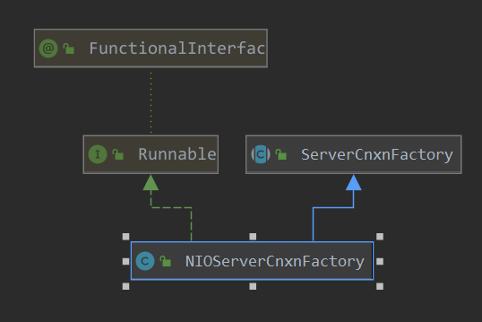

# 接收请求

zk在leader选举 成功后, 就可以处理来自2181的客户端请求.  这里接收客户端请求zk有两种实现方式: `1.NIO 2.netty`. 这里咱们来看一下zk基于netty实现的客户端请求的接收.

## netty 

### 1. netty的创建

> org.apache.zookeeper.server.quorum.QuorumPeerMain#runFromConfig

```java
    public void runFromConfig(QuorumPeerConfig config) throws IOException {
      LOG.info("Starting quorum peer");
      try {
          // 这里创建了对外服务的 socket 配置
          ServerCnxnFactory cnxnFactory = ServerCnxnFactory.createFactory();
          // 此时zk对外服务的连接 2181 端口
          cnxnFactory.configure(config.getClientPortAddress(),
                                config.getMaxClientCnxns());
          .... 
      }
    }
```

> org.apache.zookeeper.server.ServerCnxnFactory#createFactory()

```java
  // 创建连接器的factory实例
    static public ServerCnxnFactory createFactory() throws IOException {
        // ZOOKEEPER_SERVER_CNXN_FACTORY = "zookeeper.serverCnxnFactory"
        // 这里是从配置中获取配置的要实例化的类
        String serverCnxnFactoryName =
            System.getProperty(ZOOKEEPER_SERVER_CNXN_FACTORY);
        // 如果没有配置, 默认使用 NIO
        if (serverCnxnFactoryName == null) {
            serverCnxnFactoryName = NIOServerCnxnFactory.class.getName();
        }
        try {
            // 通过反射加载类 并实例化
            ServerCnxnFactory serverCnxnFactory = (ServerCnxnFactory) Class.forName(serverCnxnFactoryName)
                    .getDeclaredConstructor().newInstance();
            return serverCnxnFactory;
        } catch (Exception e) {
           ..... 
        }
    }
```

> org.apache.zookeeper.server.NettyServerCnxnFactory#configure

```java
@Override
public void configure(InetSocketAddress addr, int maxClientCnxns)
    throws IOException
{
    // 认证相关
    configureSaslLogin();
    // 本地地址
    localAddress = addr;
    // 最大连接数
    this.maxClientCnxns = maxClientCnxns;
}
```

nettyFactory的创建:

> org.apache.zookeeper.server.NettyServerCnxnFactory#NettyServerCnxnFactory

```java
   // 创建handler
    CnxnChannelHandler channelHandler = new CnxnChannelHandler();    
	// 初始化 netty server端
    NettyServerCnxnFactory() {
        bootstrap = new ServerBootstrap(
                new NioServerSocketChannelFactory(
                        Executors.newCachedThreadPool(),
                        Executors.newCachedThreadPool()));
        // parent channel
        bootstrap.setOption("reuseAddress", true);
        // child channels
        bootstrap.setOption("child.tcpNoDelay", true);
        /* set socket linger to off, so that socket close does not block */
        bootstrap.setOption("child.soLinger", -1);
        // 添加处理器
        bootstrap.getPipeline().addLast("servercnxnfactory", channelHandler);
    }
```

可见这里创建ServerBootstrap并进行了设置, 以及自定义的处理器也配置好了. 下面就准备好启动了:

> org.apache.zookeeper.server.quorum.QuorumPeer#start

```java
// zk实例的启动
@Override
public synchronized void start() {
    // 加载 内存数据库
    loadDataBase();
    // 对外服务端口 开始监听
    cnxnFactory.start();
    // 开始选举
    // 此会创建对其他实例的scoket连接, 以及运行相关的数据 收发线程,为leader竞争做准备
    startLeaderElection();
    // 当前 线程开始运行,当前线程 可以抽象的认为 代表当前的zk实例,会进行投票
    // 开始进行leader的竞争
    super.start();
}
```

> org.apache.zookeeper.server.NettyServerCnxnFactory#start

```java
@Override
public void start() {
    LOG.info("binding to port " + localAddress);
    // 地址绑定
    parentChannel = bootstrap.bind(localAddress);
}
```

此时就开启了对外的端口监听, 可以接收用户请求了.

 直接看处理器中对接收的消息是如何处理的:

> org.apache.zookeeper.server.NettyServerCnxnFactory.CnxnChannelHandler#messageReceived

```java
// 请求连接的处理
@Override
public void channelConnected(ChannelHandlerContext ctx,
                             ChannelStateEvent e) throws Exception
{
    // channel连接的处理
    allChannels.add(ctx.getChannel());
    // 这里可以看到针对每一个连接 会创建对应的  NettyServerCnxn
    // 具体的消息读取 是由NettyServerCnxn类负责的
    NettyServerCnxn cnxn = new NettyServerCnxn(ctx.getChannel(),zkServer, NettyServerCnxnFactory.this);
    ctx.setAttachment(cnxn);
    // 连接和 远端地址的对应关系 记录
    addCnxn(cnxn);
}


// 信息接收处理
@Override
public void messageReceived(ChannelHandlerContext ctx, MessageEvent e)
    throws Exception
{
    NettyServerCnxn cnxn = (NettyServerCnxn)ctx.getAttachment();
    synchronized(cnxn) {
        // 信息处理
        processMessage(e, cnxn);
    }
}
```


> org.apache.zookeeper.server.NettyServerCnxnFactory.CnxnChannelHandler#processMessage

```java
// 省略 非关键代码
// 对接收到的 消息 进行处理
private void processMessage(MessageEvent e, NettyServerCnxn cnxn) {
    ChannelBuffer buf = (ChannelBuffer)e.getMessage();
    if (cnxn.queuedBuffer != null) {
        cnxn.queuedBuffer.writeBytes(buf);
        // 接收消息
        // **************************
        cnxn.receiveMessage(cnxn.queuedBuffer);
    }
}
```

> org.apache.zookeeper.server.NettyServerCnxn#receiveMessage

```java
/// 接收信息
public void receiveMessage(ChannelBuffer message) {
    try {
        while(message.readable() && !throttled) {
            if (bb != null) {
                if (bb.remaining() > message.readableBytes()) {
                    int newLimit = bb.position() + message.readableBytes();
                    bb.limit(newLimit);
                }
                // 把message消息写入到  bb  中
                message.readBytes(bb);
                // 重制 limit
                bb.limit(bb.capacity());
                if (bb.remaining() == 0) {
                    packetReceived();
                    bb.flip();
                    ZooKeeperServer zks = this.zkServer;
                    if (zks == null || !zks.isRunning()) {
                        throw new IOException("ZK down");
                    }
                    // zkserver 开始处理 packet 信息
                    // *********************************
                    if (initialized) {
                        // 处理
                        zks.processPacket(this, bb);
						// 阈值 检测
                        if (zks.shouldThrottle(outstandingCount.incrementAndGet())) {
                            disableRecvNoWait();
                        }
                    } else {
						// 处理连接的请求
                        zks.processConnectRequest(this, bb);
                        initialized = true;
                    }
                    bb = null;
                }
            }
        }
    } catch(IOException e) {
    }
}
```

> org.apache.zookeeper.server.ZooKeeperServer#processPacket

```java
 // 开始处理接收到的 packet
    public void processPacket(ServerCnxn cnxn, ByteBuffer incomingBuffer) throws IOException {
        // 其他一般请求的处理
        Request si = new Request(cnxn, cnxn.getSessionId(), h.getXid(),
                                 h.getType(), incomingBuffer, cnxn.getAuthInfo());
        si.setOwner(ServerCnxn.me);
        // 提交信息 给处理器链 处理
        // 把接收到的packet提交到  实例进行处理
        submitRequest(si);
        cnxn.incrOutstandingRequests(h);
    }
```

> org.apache.zookeeper.server.ZooKeeperServer#submitRequest(org.apache.zookeeper.server.Request)

```java
     // 提交请求到 server
    public void submitRequest(Request si) {
        try {
            // 这里更新 session的超时时间
            touch(si.cnxn);
            // 对 request的类型进行校验
            boolean validpacket = Request.isValid(si.type);
            // request 有效
            // 则开始传递到 处理器链 进行request的处理
            if (validpacket) {
                firstProcessor.processRequest(si);
                if (si.cnxn != null) {
                    incInProcess();
                }
            } else {
                new UnimplementedRequestProcessor().processRequest(si);
            }
        } 
    }
```

还记得前面zk 的leader在 lead: `org.apache.zookeeper.server.quorum.Leader#lead` 中调用`startZkServer`,这里调用 `org.apache.zookeeper.server.ZooKeeperServer#startup` --> `org.apache.zookeeper.server.ZooKeeperServer#setupRequestProcessors` 为ZookeeperServer创建好了处理器链路; 到这里呢 就开始从第一个处理器链进行请求的处理了. 

针对不同的处理器, 其会有不同的处理, zookeeper的事务一致性, 也是通过这些处理器链 来配合实现的.  后面会具体分析leader端的处理器链. 

## NIO



这里简单看下 NIO的处理:

> org.apache.zookeeper.server.NIOServerCnxnFactory#NIOServerCnxnFactory

```java
public NIOServerCnxnFactory() throws IOException {
}
```

> org.apache.zookeeper.server.NIOServerCnxnFactory#configure

```java
// 配置
@Override
public void configure(InetSocketAddress addr, int maxcc) throws IOException {
    // 认证相关  先掠过
    configureSaslLogin();
	// 创建一个线程
    thread = new ZooKeeperThread(this, "NIOServerCxn.Factory:" + addr);
    thread.setDaemon(true);
    maxClientCnxns = maxcc;
    this.ss = ServerSocketChannel.open();
    ss.socket().setReuseAddress(true);
    LOG.info("binding to port " + addr);
    ss.socket().bind(addr);
    ss.configureBlocking(false);
    ss.register(selector, SelectionKey.OP_ACCEPT);
}
```

> org.apache.zookeeper.server.NIOServerCnxnFactory#start

```java
@Override
public void start() {
    // ensure thread is started once and only once
    if (thread.getState() == Thread.State.NEW) {
        thread.start();
    }
}
```

下面就看一下线程的工作内容把:

> org.apache.zookeeper.server.NIOServerCnxnFactory#run

```java
// 本NIO 具体的处理流程
public void run() {
    while (!ss.socket().isClosed()) {
        try {
            // 开始获取 就绪的连接
            selector.select(1000);
            Set<SelectionKey> selected;
            synchronized (this) {
                // 得到就绪的keys
                selected = selector.selectedKeys();
            }
            ArrayList<SelectionKey> selectedList = new ArrayList<SelectionKey>(
                selected);
            Collections.shuffle(selectedList);
            // 遍历就绪的keys 处理对应的事件
            for (SelectionKey k : selectedList) {
                // 处理连接事件
                if ((k.readyOps() & SelectionKey.OP_ACCEPT) != 0) {
                    // 接收对应 连接的socket
                    SocketChannel sc = ((ServerSocketChannel) k
                                        .channel()).accept();
                    // 获取对端地址
                    InetAddress ia = sc.socket().getInetAddress();
                    // 获取此地址对应 的 连接数
                    int cnxncount = getClientCnxnCount(ia);
                    // 如果此地址连接数 较大，则 关闭此连接
                    if (maxClientCnxns > 0 && cnxncount >= maxClientCnxns){
                        sc.close();
                    } else {
                        // 没有超过连接数  开始处理
                        // 配置为 非阻塞
                        sc.configureBlocking(false);
                        // 把此注册到 selector
                        SelectionKey sk = sc.register(selector,
                                                      SelectionKey.OP_READ);
                        // 根据此socket 创建对应的 NIOServerCnxn, 由 NIOServerCnxn来实现 对此socket的具体读写操作
                        NIOServerCnxn cnxn = createConnection(sc, sk);
                        sk.attach(cnxn);
                        // 记录此 NIOServerCnxn
                        // 用户对 连接数的限制
                        addCnxn(cnxn);
                    }
                } else if ((k.readyOps() & (SelectionKey.OP_READ | SelectionKey.OP_WRITE)) != 0) {
                    NIOServerCnxn c = (NIOServerCnxn) k.attachment();
                    // 处理具体的 读 或者 写 操作
                    // *****************************
                    c.doIO(k);
                } 
            }
            // 清除这些 处理过的key
            selected.clear();
        } catch (RuntimeException e) {
            .... 
        }
    }
}
```

> org.apache.zookeeper.server.NIOServerCnxn#doIO

```java
// 对NIO的连接 进行具体 IO操作的地方
void doIO(SelectionKey k) throws InterruptedException {
    try {
        // 读操作
        if (k.isReadable()) {
            // 这里读取 数据的长度值
            int rc = sock.read(incomingBuffer);
            if (incomingBuffer.remaining() == 0) {
                boolean isPayload;
                if (incomingBuffer == lenBuffer) { // start of next request
                    incomingBuffer.flip();
                    // 读取数据的长度
                    isPayload = readLength(k);
                    incomingBuffer.clear();
                } else {
                    isPayload = true;
                }
                if (isPayload) { // not the case for 4letterword
                    // 读取数据
                    //***************************
                    readPayload();
                }
                else {
                    return;
                }
            }
        }
        // 写操作
        if (k.isWritable()) {	// 写事件处理
            // 省略 非关键代码
            /// 写出 数据
            int sent = sock.write(directBuffer);
        }
    } catch (CancelledKeyException e) {
        //     	.....
    }
}
```

这里可以看到是针对read 或者 write事件进行处理.

> org.apache.zookeeper.server.NIOServerCnxn#readPayload

```java
// 对读取到的数据 具体处理
private void readPayload() throws IOException, InterruptedException {
    if (incomingBuffer.remaining() != 0) { // have we read length bytes?
        // 数据的读
        // ***** 这里真正读取到 发送过来的数据
        int rc = sock.read(incomingBuffer); // sock is non-blocking, so ok
    }

    if (incomingBuffer.remaining() == 0) { // have we read length bytes?
        // 更新packet的接收数量
        packetReceived();
        incomingBuffer.flip();
        if (!initialized) {
            // 开始处理 连接请求
            // **********************
            readConnectRequest();
        } else {
            // 开始处理 读取的request
            // **********************
            readRequest();
        }
        lenBuffer.clear();
        incomingBuffer = lenBuffer;
    }
}
```

> org.apache.zookeeper.server.NIOServerCnxn#readRequest

```java
    // 对读取的 packet 进行处理
    private void readRequest() throws IOException {
        zkServer.processPacket(this, incomingBuffer);
    }
```

> org.apache.zookeeper.server.ZooKeeperServer#processPacket

```java
// 开始处理接收到的 packet
public void processPacket(ServerCnxn cnxn, ByteBuffer incomingBuffer) throws IOException {

    // 其他一般请求的处理
    Request si = new Request(cnxn, cnxn.getSessionId(), h.getXid(),
                             h.getType(), incomingBuffer, cnxn.getAuthInfo());
    si.setOwner(ServerCnxn.me);
    // 提交信息 给处理器链 处理
    // 把接收到的packet提交到  实例进行处理
    submitRequest(si);
    cnxn.incrOutstandingRequests(h);
}

```

> org.apache.zookeeper.server.ZooKeeperServer#submitRequest(org.apache.zookeeper.server.Request)

```java
// 提交请求到 server
public void submitRequest(Request si) {
    try {
        // 这里更新 session的超时时间
        touch(si.cnxn);
        // 对 request的类型进行校验
        boolean validpacket = Request.isValid(si.type);
        // request 有效
        // 则开始传递到 处理器链 进行request的处理
        if (validpacket) {
            firstProcessor.processRequest(si);
            if (si.cnxn != null) {
                incInProcess();
            }
        } else {
          
            new UnimplementedRequestProcessor().processRequest(si);
        }
    } catch (MissingSessionException e) {
    }
}
```

这里同样是接收到数据后,  提交到server中继续进行处理. 


