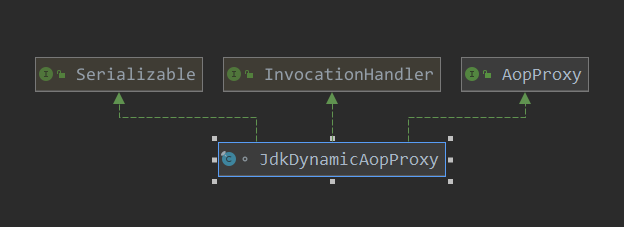
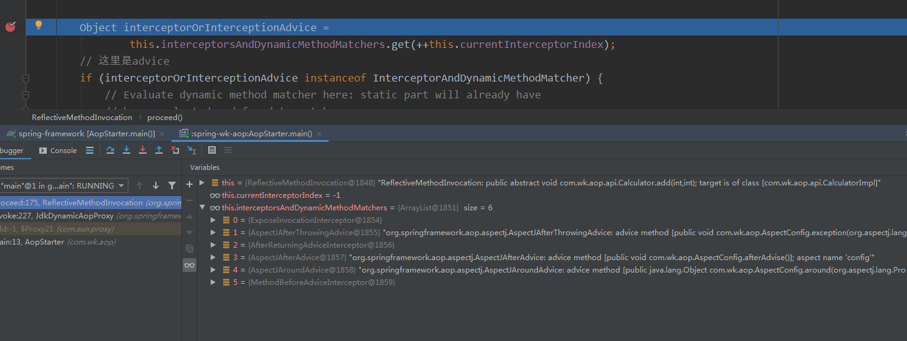

[TOC]

# Aop调用

Aop代理创建完之后，咱们接下来看一下其调用过程。当然了，这里仍然是分析一下JDK的调用过程。

对于JDK代理，大家都知道，其方法的入口函数为：InvocationHandler 接口的 invoke 函数。

 咱们看一下JdkDynamicAopProxy类图:



可以看到其本身实现了InvocationHandler接口，而其代理创建函数的此此参数传递的也是自己：

```java
	// 创建代理
	@Override
	public Object getProxy(@Nullable ClassLoader classLoader) {
		if (logger.isTraceEnabled()) {
			logger.trace("Creating JDK dynamic proxy: " + this.advised.getTargetSource());
		}
		// 得到所有需要实现的接口
		Class<?>[] proxiedInterfaces = AopProxyUtils.completeProxiedInterfaces(this.advised, true);
		// 是否重载 equals 和hasCode方法
		findDefinedEqualsAndHashCodeMethods(proxiedInterfaces);
		// 创建代理
		return Proxy.newProxyInstance(classLoader, proxiedInterfaces, this);
	}
```

那就是说代理类的入口函数为JdkDynamicAopProxy ->invoke.

> org.springframework.aop.framework.JdkDynamicAopProxy#invoke

```java
// 代理类具体的调用方法
@Override
@Nullable
public Object invoke(Object proxy, Method method, Object[] args) throws Throwable {
    MethodInvocation invocation;
    Object oldProxy = null;
    boolean setProxyContext = false;

    TargetSource targetSource = this.advised.targetSource;
    Object target = null;
    // 下面是对调用的方法进行判断, 针对不同的方法有不同的处理逻辑
    try {
        // 调用equals方法
        if (!this.equalsDefined && AopUtils.isEqualsMethod(method)) {
            // The target does not implement the equals(Object) method itself.
            return equals(args[0]);
        }
        // hashCode方法
        else if (!this.hashCodeDefined && AopUtils.isHashCodeMethod(method)) {
            // The target does not implement the hashCode() method itself.
            return hashCode();
        }
        else if (method.getDeclaringClass() == DecoratingProxy.class) {
            // There is only getDecoratedClass() declared -> dispatch to proxy config.
            return AopProxyUtils.ultimateTargetClass(this.advised);
        }
        else if (!this.advised.opaque && method.getDeclaringClass().isInterface() &&
                 method.getDeclaringClass().isAssignableFrom(Advised.class)) {
            // Service invocations on ProxyConfig with the proxy config...
            return AopUtils.invokeJoinpointUsingReflection(this.advised, method, args);
        }
        Object retVal;
        //  此就对应aop设置中的一个属性 exposeProxy
       // 在外面可以使用AopContext.currentProxy 来得到threadLocal中的代理对象,可以通过代理对象来嵌套调用方法
        // 这样每个方法都会被 aop代理,也就是都会进行方法增强
        // 重点 重点
        if (this.advised.exposeProxy) {
            // 把代理放入到threadLocal中
            // Make invocation available if necessary.
            oldProxy = AopContext.setCurrentProxy(proxy);
            setProxyContext = true;
        }

        // Get as late as possible to minimize the time we "own" the target,
        // in case it comes from a pool.
        target = targetSource.getTarget();
        Class<?> targetClass = (target != null ? target.getClass() : null);

        // Get the interception chain for this method.
        // 获取此要执行的方法的执行链
        List<Object> chain = this.advised.getInterceptorsAndDynamicInterceptionAdvice(method, targetClass);

        // Check whether we have any advice. If we don't, we can fallback on direct
        // reflective invocation of the target, and avoid creating a MethodInvocation.
        if (chain.isEmpty()) {
            // 如果执行链为空,那么就直接执行方法就好了
            Object[] argsToUse = AopProxyUtils.adaptArgumentsIfNecessary(method, args);
            retVal = AopUtils.invokeJoinpointUsingReflection(target, method, argsToUse);
        }
        else {
            // We need to create a method invocation...
            // 创建方法执行的调用链
      invocation = new ReflectiveMethodInvocation(proxy, target, method, args, targetClass, chain);
            // Proceed to the joinpoint through the interceptor chain.
            // 开始方法的调用
            // 入口点  重点
            retVal = invocation.proceed();
        }
        // Massage return value if necessary.
        // 方法的返回值 类型
        Class<?> returnType = method.getReturnType();
        if (retVal != null && retVal == target &&
            returnType != Object.class && returnType.isInstance(proxy) &&
            !RawTargetAccess.class.isAssignableFrom(method.getDeclaringClass())) {
            retVal = proxy;
        }
        else if (retVal == null && returnType != Void.TYPE && returnType.isPrimitive()) {
            throw new AopInvocationException(
                "Null return value from advice does not match primitive return type for: " + method);
        }
        return retVal;
    }
    finally {
        if (target != null && !targetSource.isStatic()) {
            // Must have come from TargetSource.
            targetSource.releaseTarget(target);
        }
        if (setProxyContext) {
            // Restore old proxy.
            AopContext.setCurrentProxy(oldProxy);
        }
    }
}
```

代理对象的方法调用：

> org.springframework.aop.framework.ReflectiveMethodInvocation#proceed

```java
/**
	 * 此方法要重点看看, 此处使用了一个递归的操作,来一层一层的调用advice 直到目标方法
	 */
@Override
@Nullable
public Object proceed() throws Throwable {
    //	We start with an index of -1 and increment early.
    if (this.currentInterceptorIndex == this.interceptorsAndDynamicMethodMatchers.size() - 1) {
        // 调用目标方法
        return invokeJoinpoint();
    }

    Object interceptorOrInterceptionAdvice =
        this.interceptorsAndDynamicMethodMatchers.get(++this.currentInterceptorIndex);
    // 这里是advice
    if (interceptorOrInterceptionAdvice instanceof InterceptorAndDynamicMethodMatcher) {
        // Evaluate dynamic method matcher here: static part will already have
        // been evaluated and found to match.
        InterceptorAndDynamicMethodMatcher dm =
            (InterceptorAndDynamicMethodMatcher) interceptorOrInterceptionAdvice;
        Class<?> targetClass = (this.targetClass != null ? this.targetClass : this.method.getDeclaringClass());
        // 动态匹配,匹配成功,则调用方法
        if (dm.methodMatcher.matches(this.method, targetClass, this.arguments)) {
            return dm.interceptor.invoke(this);
        }
        else {
            // 如果动态匹配失败了,则跳过此拦截器,直接调用下一个拦截器
            // Dynamic matching failed.
            // Skip this interceptor and invoke the next in the chain.
            return proceed();
        }
    }
    else {
        // It's an interceptor, so we just invoke it: The pointcut will have
        // been evaluated statically before this object was constructed.
        // 这里是拦截器的调用
        // 看这里
        return ((MethodInterceptor) interceptorOrInterceptionAdvice).invoke(this);
    }
}
```

这里具体的调用顺序: 



> org.springframework.aop.interceptor.ExposeInvocationInterceptor#invoke

```java
@Override
public Object invoke(MethodInvocation mi) throws Throwable {
    MethodInvocation oldInvocation = invocation.get();
    invocation.set(mi);
    try {
        return mi.proceed();
    }
    finally {
        invocation.set(oldInvocation);
    }
}
```

> org.springframework.aop.aspectj.AspectJAfterThrowingAdvice#invoke

```java
	@Override
	public Object invoke(MethodInvocation mi) throws Throwable {
		try {
			return mi.proceed();
		}
		catch (Throwable ex) {
			if (shouldInvokeOnThrowing(ex)) {
				invokeAdviceMethod(getJoinPointMatch(), null, ex);
			}
			throw ex;
		}
	}
```

> org.springframework.aop.framework.adapter.AfterReturningAdviceInterceptor#invoke

```java
	@Override
	public Object invoke(MethodInvocation mi) throws Throwable {
		Object retVal = mi.proceed();
		this.advice.afterReturning(retVal, mi.getMethod(), mi.getArguments(), mi.getThis());
		return retVal;
	}
```

> org.springframework.aop.aspectj.AspectJAfterAdvice#invoke

```java
@Override
public Object invoke(MethodInvocation mi) throws Throwable {
    try {
        return mi.proceed();
    }
    finally {
        invokeAdviceMethod(getJoinPointMatch(), null, null);
    }
}
```

> org.springframework.aop.aspectj.AspectJAroundAdvice#invoke

```java
@Override
public Object invoke(MethodInvocation mi) throws Throwable {
    if (!(mi instanceof ProxyMethodInvocation)) {
   throw new IllegalStateException("MethodInvocation is not a Spring ProxyMethodInvocation: " + mi);
    }
    ProxyMethodInvocation pmi = (ProxyMethodInvocation) mi;
    ProceedingJoinPoint pjp = lazyGetProceedingJoinPoint(pmi);
    JoinPointMatch jpm = getJoinPointMatch(pmi);
    return invokeAdviceMethod(pjp, jpm, null, null);
}
```

> org.springframework.aop.framework.adapter.MethodBeforeAdviceInterceptor#invoke

```java
@Override
public Object invoke(MethodInvocation mi) throws Throwable {
    this.advice.before(mi.getMethod(), mi.getArguments(), mi.getThis());
    return mi.proceed();
}
```

这个拦截方法调用的很是巧妙，以此来实现Aop的代理。


