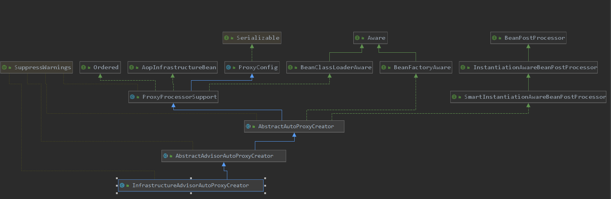
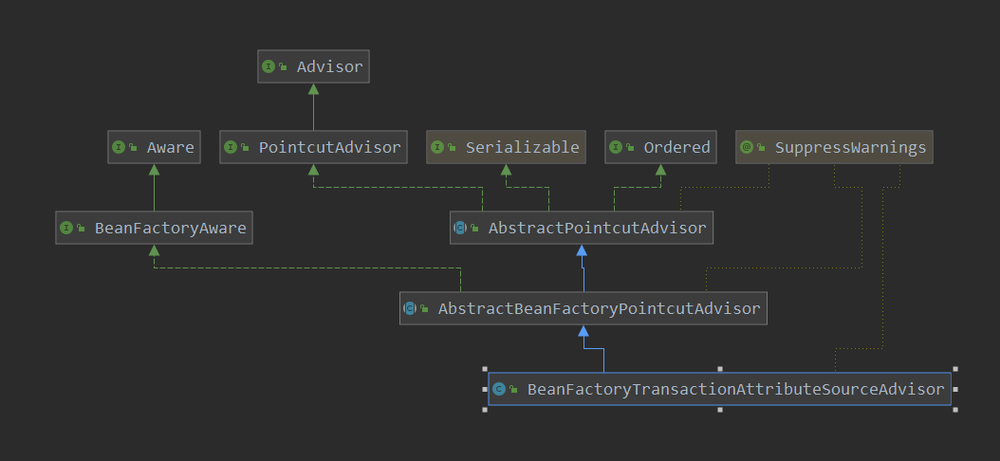
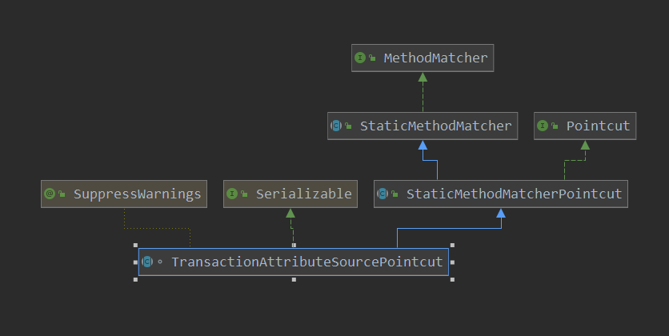
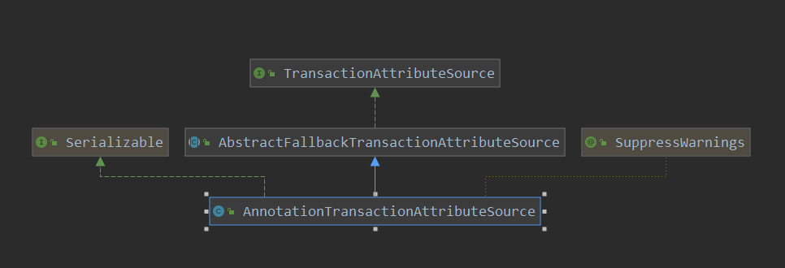

[TOC]

# 事务的创建

前面分析到，一个使能事务的注解，就把创建事务所需要的bean就准备齐全了，下面咱们就可以来看看创建事务Aop的操作了。

这里咱们从创建事务Aop的类作为入口点，先看一下其类图：



从起类图看起来，很多部分适合Aop的创建类是很接近的，同样都是BeanPostProcessor，也是InstantiationAwareBeanPostProcessor，也就是说其在bean实例化前后，bean初始化前后都有动作。按照先后，咱们先看其在bean实例化前后的动作：

bean实例化前的操作：

> org.springframework.aop.framework.autoproxy.AbstractAutoProxyCreator#postProcessBeforeInstantiation

```java
// 在bean实例化之前就判断那些bean需要被代理
@Override
public Object postProcessBeforeInstantiation(Class<?> beanClass, String beanName) {
    Object cacheKey = getCacheKey(beanClass, beanName);
    if (!StringUtils.hasLength(beanName) || !this.targetSourcedBeans.contains(beanName)) {
        if (this.advisedBeans.containsKey(cacheKey)) {
            return null;
        }
        // 重点 重点
        // 此解析advisor 只是针对 Aop的操作,当是事务的时候,就不是在这里了
        // 判读class是否是Infrastructure类型的  判断是否需要跳过(根据beanName进行判断)
        // shouldSkip AspectJAwareAdvisorAutoProxyCreator.shouldSkip的方法
        // 之后再 AspectJAwareAdvisorAutoProxyCreator.shouldSkip中就会对容器中的advisors 进行解析
        if (isInfrastructureClass(beanClass) || shouldSkip(beanClass, beanName)) {
            this.advisedBeans.put(cacheKey, Boolean.FALSE);
            return null;
        }
    }
    // Create proxy here if we have a custom TargetSource.
    // Suppresses unnecessary default instantiation of the target bean:
    // The TargetSource will handle target instances in a custom fashion.
    TargetSource targetSource = getCustomTargetSource(beanClass, beanName);
    if (targetSource != null) {
        if (StringUtils.hasLength(beanName)) {
            this.targetSourcedBeans.add(beanName);
        }
        // 获取容器中 advisors
        Object[] specificInterceptors = getAdvicesAndAdvisorsForBean(beanClass, beanName, targetSource);
        // 定义了 customTargetSourceCreators,在这里会创建代理
        Object proxy = createProxy(beanClass, beanName, specificInterceptors, targetSource);
        this.proxyTypes.put(cacheKey, proxy.getClass());
        return proxy;
    }
    return null;
}
```

基本上对于事务来说，只是记录了bean是否创建代理，其重要性远不如Aop时的重要。

实例化之后的操作：

> org.springframework.aop.framework.autoproxy.AbstractAutoProxyCreator#postProcessAfterInstantiation

```java
	@Override
	public boolean postProcessAfterInstantiation(Object bean, String beanName) {
		return true;
	}
```

bean初始化前:

> org.springframework.aop.framework.autoproxy.AbstractAutoProxyCreator#postProcessBeforeInitialization

```java
	@Override
	public Object postProcessBeforeInitialization(Object bean, String beanName) {
		return bean;
	}
```

可以看到，则实例化后，初始化前期没有做什么操作。创建事务的重点在bean实例化后：

> org.springframework.aop.framework.autoproxy.AbstractAutoProxyCreator#postProcessAfterInitialization

```java
// 在后置处理器这里, 进行代理点的设置
// 也就是在bean初始化后之后
@Override
public Object postProcessAfterInitialization(@Nullable Object bean, String beanName) {
    if (bean != null) {
        Object cacheKey = getCacheKey(bean.getClass(), beanName);
        if (!this.earlyProxyReferences.contains(cacheKey)) {
            // 如果需要创建代理，那在这里进行具体的创建动作
            return wrapIfNecessary(bean, beanName, cacheKey);
        }
    }
    return bean;
}
```

> org.springframework.aop.framework.autoproxy.AbstractAutoProxyCreator#wrapIfNecessary

```java
// 如果需要就创建代理
protected Object wrapIfNecessary(Object bean, String beanName, Object cacheKey) {
    if (StringUtils.hasLength(beanName) && this.targetSourcedBeans.contains(beanName)) {
        return bean;
    }
    if (Boolean.FALSE.equals(this.advisedBeans.get(cacheKey))) {
        return bean;
    }
    if (isInfrastructureClass(bean.getClass()) || shouldSkip(bean.getClass(), beanName)) {
        // 如果是指定bean   或者 应该跳过,就记录下来
        this.advisedBeans.put(cacheKey, Boolean.FALSE);
        return bean;
    }

    // Create proxy if we have advice.
    // 获取容器中此bean对应的advice
    // getAdvicesAndAdvisorsForBean此方法会吧容器中的bean遍历一遍,以此得到所有的advice方法以及pointcut也就是advisor
    // 深入看一下getAdvicesAndAdvisorsForBean
    // 重点 重点
    Object[] specificInterceptors = getAdvicesAndAdvisorsForBean(bean.getClass(), beanName, null);
    // 如果存在对应的advice,那么就把此bean放到advisedBeans容器中,并为此bean创建代理
    if (specificInterceptors != DO_NOT_PROXY) {
        // 记录其此bean 需要进行aop代理
        this.advisedBeans.put(cacheKey, Boolean.TRUE);
        // 具体创建代理的过程
        // 重点 重点 重点
        Object proxy = createProxy(
            bean.getClass(), beanName, specificInterceptors, new SingletonTargetSource(bean));
        // 缓存代理
        // 记录 创建好的代理
        this.proxyTypes.put(cacheKey, proxy.getClass());
        return proxy;
    }
    this.advisedBeans.put(cacheKey, Boolean.FALSE);
    return bean;
}
```

可以看到此函数就完成了事务代理的创建，继续看一下查找advisor的操作：

> org.springframework.aop.framework.autoproxy.AbstractAutoProxyCreator#getAdvicesAndAdvisorsForBean

```java
// 解析容器中是否有对应bean的Advisor
@Override
@Nullable
protected Object[] getAdvicesAndAdvisorsForBean(
    Class<?> beanClass, String beanName, @Nullable TargetSource targetSource) {
    // 查找合格的advisor
    // 重点 重点
    List<Advisor> advisors = findEligibleAdvisors(beanClass, beanName);
    if (advisors.isEmpty()) {
        return DO_NOT_PROXY;
    }
    return advisors.toArray();
}
```

> org.springframework.aop.framework.autoproxy.AbstractAdvisorAutoProxyCreator#findEligibleAdvisors

```java
// 从容器中查找合适于参数的advisor
protected List<Advisor> findEligibleAdvisors(Class<?> beanClass, String beanName) {
    // findCandidateAdvisors此会解析容器中所有的advisor
    List<Advisor> candidateAdvisors = findCandidateAdvisors();
    // findAdvisorsThatCanApply从获取到的bean实例中找到所有能应用到参数对应类型上的advisor
    List<Advisor> eligibleAdvisors = findAdvisorsThatCanApply(candidateAdvisors, beanClass, beanName);
    // 对advice调用链进行扩展; 如果调用链中不存在ExposeInvocationInterceptor则在index=0的位置添加一个
    extendAdvisors(eligibleAdvisors);
    if (!eligibleAdvisors.isEmpty()) {
        eligibleAdvisors = sortAdvisors(eligibleAdvisors);
    }
    return eligibleAdvisors;
}
```

> org.springframework.aop.framework.autoproxy.AbstractAdvisorAutoProxyCreator#findCandidateAdvisors

```java
	// Todo 解析容器中advisor
	protected List<Advisor> findCandidateAdvisors() {
		Assert.state(this.advisorRetrievalHelper != null, "No BeanFactoryAdvisorRetrievalHelper available");
		// 从容器中找到所有 Advisor 的实例
		return this.advisorRetrievalHelper.findAdvisorBeans();
	}
```

> org.springframework.aop.framework.autoproxy.BeanFactoryAdvisorRetrievalHelper#findAdvisorBeans

```java
// 查找容器中的Advisorbean
public List<Advisor> findAdvisorBeans() {
    // Determine list of advisor bean names, if not cached already.
    String[] advisorNames = this.cachedAdvisorBeanNames;
    if (advisorNames == null) {
        // Do not initialize FactoryBeans here: We need to leave all regular beans
        // uninitialized to let the auto-proxy creator apply to them!
        // toDo 从父子容器中获取所有的advisor
        advisorNames = BeanFactoryUtils.beanNamesForTypeIncludingAncestors(
            this.beanFactory, Advisor.class, true, false);
        // 把获取到的所有的advisorName缓存起来
        this.cachedAdvisorBeanNames = advisorNames;
    }
    // 如果没有找到合适的名字
    // 则返回一个空数组
    if (advisorNames.length == 0) {
        return new ArrayList<>();
    }
    // 保存所有解析到的advisor实例
    List<Advisor> advisors = new ArrayList<>();
    for (String name : advisorNames) {
        if (isEligibleBean(name)) {
            if (this.beanFactory.isCurrentlyInCreation(name)) {
                if (logger.isTraceEnabled()) {
                    logger.trace("Skipping currently created advisor '" + name + "'");
                }
            }
            else {
                try {
                    // 从容器中获取其advisor的实例
                    advisors.add(this.beanFactory.getBean(name, Advisor.class));
                }
                catch (BeanCreationException ex) {
                    Throwable rootCause = ex.getMostSpecificCause();
                    if (rootCause instanceof BeanCurrentlyInCreationException) {
                        BeanCreationException bce = (BeanCreationException) rootCause;
                        String bceBeanName = bce.getBeanName();
                        if (bceBeanName != null && this.beanFactory.isCurrentlyInCreation(bceBeanName)) {
                            if (logger.isTraceEnabled()) {
                                logger.trace("Skipping advisor '" + name +
              "' with dependency on currently created bean: " + ex.getMessage());
                            }
                            // Ignore: indicates a reference back to the bean we're trying to advise.
                            // We want to find advisors other than the currently created bean itself.
                            continue;
                        }
                    }
                    throw ex;
                }
            }
        }
    }
    return advisors;
}
```

此函数的重点就是从容器中获取Advisor类型的bean，并对bean进行实例化，初始化等操作。还记得前面说ProxyTransactionManagementConfiguration向容器中注入了事务的advisor吗？其注入了BeanFactoryTransactionAttributeSourceAdvisor类型的bean到容器中，咱们看一下此类的类图:



可以看到此类是advisor的子类，也就是说在查找advisor时，会查找到此类。

找到所有的合适的advisor时，在进行判断此advisor是否匹配当前的bean（不要忘了哦，当前的操作是bean初始化后的操作，也就是会对所有的bean进行此匹配的操作的）。

> org.springframework.aop.framework.autoproxy.AbstractAdvisorAutoProxyCreator#findAdvisorsThatCanApply

```java
protected List<Advisor> findAdvisorsThatCanApply(
    List<Advisor> candidateAdvisors, Class<?> beanClass, String beanName) {
    // 记录正在进行aop 的beanName
    ProxyCreationContext.setCurrentProxiedBeanName(beanName);
    try {
        // 从candidateAdvisors中找到适合于beanClass的advisor
        return AopUtils.findAdvisorsThatCanApply(candidateAdvisors, beanClass);
    }
    finally {
        ProxyCreationContext.setCurrentProxiedBeanName(null);
    }
}
```

> org.springframework.aop.support.AopUtils#findAdvisorsThatCanApply

```java
// 查到 对于 clazz 可用的 advisor
public static List<Advisor> findAdvisorsThatCanApply(List<Advisor> candidateAdvisors, Class<?> clazz) {
    // 没有候选的 advisor,直接返回空列表
    if (candidateAdvisors.isEmpty()) {
        return candidateAdvisors;
    }
    //
    List<Advisor> eligibleAdvisors = new ArrayList<>();
    for (Advisor candidate : candidateAdvisors) {
        // 条件: 首先候选的advisor必须是IntroductionAdvisor类型
        // canApply 根据pointcut是进行判断
        if (candidate instanceof IntroductionAdvisor && canApply(candidate, clazz)) {
            eligibleAdvisors.add(candidate);
        }
    }
    boolean hasIntroductions = !eligibleAdvisors.isEmpty();
    for (Advisor candidate : candidateAdvisors) {
        if (candidate instanceof IntroductionAdvisor) {
            // already processed
            continue;
        }
        if (canApply(candidate, clazz, hasIntroductions)) {
            eligibleAdvisors.add(candidate);
        }
    }
    return eligibleAdvisors;
}
```

> org.springframework.aop.support.AopUtils#canApply(org.springframework.aop.Advisor, java.lang.Class<?>)

```java
	// 判断advisor是否能应用到targetClass
	public static boolean canApply(Advisor advisor, Class<?> targetClass) {
		return canApply(advisor, targetClass, false);
	}
```

> org.springframework.aop.support.AopUtils#canApply(org.springframework.aop.Advisor, java.lang.Class<?>, boolean)

```java
// 检测advisor能否应用到targetClass
public static boolean canApply(Advisor advisor, Class<?> targetClass, boolean hasIntroductions) {
    // 过滤规则
    if (advisor instanceof IntroductionAdvisor) {
        return ((IntroductionAdvisor) advisor).getClassFilter().matches(targetClass);
    }
    // 根据pointCut是进行匹配
    // 注意此 pca.getPointcut(),当是事务的时候,其返回的是 TransactionAttributeSourcePointcut
    else if (advisor instanceof PointcutAdvisor) {
        PointcutAdvisor pca = (PointcutAdvisor) advisor;
        return canApply(pca.getPointcut(), targetClass, hasIntroductions);
    }
    // 如果没有pointCut那么就认为是可用的
    else {
        // It doesn't have a pointcut so we assume it applies.
        return true;
    }
}
```

可以看一次事务的advisor --> BeanFactoryTransactionAttributeSourceAdvisor ，可以看起进行 getPointcut()的返回值为：

> org.springframework.transaction.interceptor.BeanFactoryTransactionAttributeSourceAdvisor#getPointcut

```java
private final TransactionAttributeSourcePointcut pointcut = new TransactionAttributeSourcePointcut() {
    @Override
    @Nullable
    protected TransactionAttributeSource getTransactionAttributeSource() {
        return transactionAttributeSource;
    }
};	
// 可以看到其返回的值为 TransactionAttributeSourcePointcut
@Override
public Pointcut getPointcut() {
    return this.pointcut;
}
```

看一下TransactionAttributeSourcePointcut的类图：



> org.springframework.aop.support.AopUtils#canApply(org.springframework.aop.Pointcut, java.lang.Class<?>, boolean)

```java
public static boolean canApply(Pointcut pc, Class<?> targetClass, boolean hasIntroductions) {
    Assert.notNull(pc, "Pointcut must not be null");
    if (!pc.getClassFilter().matches(targetClass)) {
        return false;
    }
    // 如果pointcut为AnnotationMatchingPointcut,则其 matchet,就是MethodMatcher.TRUE
    MethodMatcher methodMatcher = pc.getMethodMatcher();
    if (methodMatcher == MethodMatcher.TRUE) {
        // No need to iterate the methods if we're matching any method anyway...
        return true;
    }
    IntroductionAwareMethodMatcher introductionAwareMethodMatcher = null;
    if (methodMatcher instanceof IntroductionAwareMethodMatcher) {
        introductionAwareMethodMatcher = (IntroductionAwareMethodMatcher) methodMatcher;
    }
    Set<Class<?>> classes = new LinkedHashSet<>();
    if (!Proxy.isProxyClass(targetClass)) {
        classes.add(ClassUtils.getUserClass(targetClass));
    }
    classes.addAll(ClassUtils.getAllInterfacesForClassAsSet(targetClass));

    for (Class<?> clazz : classes) {
        // 获取所有声明的方法
        Method[] methods = ReflectionUtils.getAllDeclaredMethods(clazz);
        for (Method method : methods) {
            // 如果是事务创建代理, 会走methodMatcher.matches这里,这个方法会解析方法的注解信息
            // introductionAwareMethodMatcher.matches 使用pointCut表达式调用AspectJ 来进行匹配操作
            // 主要看这里的match 就好
            if (introductionAwareMethodMatcher != null ?
                introductionAwareMethodMatcher.matches(method, targetClass, hasIntroductions) :
                methodMatcher.matches(method, targetClass)) {
                return true;
            }
        }
    }
    return false;
}

```

看一下TransactionAttributeSourcePointcut的getMethodMatcher操作：

> org.springframework.aop.support.StaticMethodMatcherPointcut#getMethodMatcher

```java
	@Override
	public final MethodMatcher getMethodMatcher() {
		return this;
	}
```

> org.springframework.transaction.interceptor.TransactionAttributeSourcePointcut#matches

```java
// 通过此方法来判断一个class或method是否需要进行事务的代理创建
@Override
public boolean matches(Method method, Class<?> targetClass) {
    // 如果是TransactionalProxy  PlatformTransactionManager  PersistenceExceptionTranslator类型,不需要
    if (TransactionalProxy.class.isAssignableFrom(targetClass) ||
        PlatformTransactionManager.class.isAssignableFrom(targetClass) ||
        PersistenceExceptionTranslator.class.isAssignableFrom(targetClass)) {
        return false;
    }
    // 获取TransactionAttributeSource
    // todo tas.getTransactionAttribute 重要  重要  重要
    // tas.getTransactionAttribute通过此方法类解析注解信息,以及判断方法或类是否需要进行代理创建
    TransactionAttributeSource tas = getTransactionAttributeSource();
    return (tas == null || tas.getTransactionAttribute(method, targetClass) != null);
}
```

看一下这个类其实是一个抽象类，有一个抽象方法：getTransactionAttributeSource，而在创建此类时：

```java
private final TransactionAttributeSourcePointcut pointcut = new TransactionAttributeSourcePointcut() {
    @Override
    @Nullable
    protected TransactionAttributeSource getTransactionAttributeSource() {
        return transactionAttributeSource;
    }
};	
```

此处返回的transactionAttributeSource其实就是AnnotationTransactionAttributeSource，前面在ProxyTransactionManagementConfiguration中定义，并配置到了BeanFactoryTransactionAttributeSourceAdvisor类中。

所以最终判断一个类是否需要创建事务代理，最终还是需要通过事务的pointcut来进行match，如果match成功，则进行事务的创建。下面看一下事务pointcut是如何进行match的。

先看一下事务pointcut的类图：



接着看一下tas.getTransactionAttribute(method, targetClass)的具体操作：

> org.springframework.transaction.interceptor.AbstractFallbackTransactionAttributeSource#getTransactionAttribute

```java
// 获取事务属性,以此来进行判断,一个bean是否需要创建事务代理
@Override
@Nullable
public TransactionAttribute getTransactionAttribute(Method method, @Nullable Class<?> targetClass) {
    if (method.getDeclaringClass() == Object.class) {
        return null;
    }

    // First, see if we have a cached value.
    // 首先先去缓存中获取
    Object cacheKey = getCacheKey(method, targetClass);
    TransactionAttribute cached = this.attributeCache.get(cacheKey);
    if (cached != null) {
        // Value will either be canonical value indicating there is no transaction attribute,
        // or an actual transaction attribute.
        if (cached == NULL_TRANSACTION_ATTRIBUTE) {
            return null;
        }
        else {
            return cached;
        }
    }
    else {
        // We need to work it out.
        // 如果缓存中不存在,则需要计算此targetClass的method方法的属性
        // 重点 重点 重点
        // 计算事务属性
        TransactionAttribute txAttr = computeTransactionAttribute(method, targetClass);
        // Put it in the cache.
        // 把找到的事务声明信息存放到缓存中
        if (txAttr == null) {
            this.attributeCache.put(cacheKey, NULL_TRANSACTION_ATTRIBUTE);
        }
        else {
            String methodIdentification = ClassUtils.getQualifiedMethodName(method, targetClass);
            if (txAttr instanceof DefaultTransactionAttribute) {
                ((DefaultTransactionAttribute) txAttr).setDescriptor(methodIdentification);
            }
            if (logger.isTraceEnabled()) {
                logger.trace("Adding transactional method '" + methodIdentification + "' with attribute: " + txAttr);
            }
            this.attributeCache.put(cacheKey, txAttr);
        }
        return txAttr;
    }
}
```

> org.springframework.transaction.interceptor.AbstractFallbackTransactionAttributeSource#computeTransactionAttribute

```java
// 获取事务的属性,也就是解析事务中注解中的信息; 或者解析xml文件中事务的信息
@Nullable
protected TransactionAttribute computeTransactionAttribute(Method method, @Nullable Class<?> targetClass) {
    // Don't allow no-public methods as required.
    if (allowPublicMethodsOnly() && !Modifier.isPublic(method.getModifiers())) {
        return null;
    }
    // The method may be on an interface, but we need attributes from the target class.
    // If the target class is null, the method will be unchanged.
    // method代表接口, specificMethod代表实现类中的方法
    Method specificMethod = AopUtils.getMostSpecificMethod(method, targetClass);

    // First try is the method in the target class.
    // todo 第一步: 首先解析特定方法上的有关事务声明相关属性信息
    TransactionAttribute txAttr = findTransactionAttribute(specificMethod);
    if (txAttr != null) {
        return txAttr;
    }
    // Second try is the transaction attribute on the target class.
    // todo 第二: 查看方法所在的类是否有事务声明的信息
    txAttr = findTransactionAttribute(specificMethod.getDeclaringClass());
    if (txAttr != null && ClassUtils.isUserLevelMethod(method)) {
        return txAttr;
    }
    // 如果存在接口
    if (specificMethod != method) {
        // Fallback is to look at the original method.
        // todo 首先去接口中的对应方法中查找事务相关的信息
        txAttr = findTransactionAttribute(method);
        if (txAttr != null) {
            return txAttr;
        }
        // Last fallback is the class of the original method.
        // todo 在查找接口类上的事务声明相关的信息
        txAttr = findTransactionAttribute(method.getDeclaringClass());
        if (txAttr != null && ClassUtils.isUserLevelMethod(method)) {
            return txAttr;
        }
    }
    return null;
}
```

> org.springframework.transaction.annotation.AnnotationTransactionAttributeSource#findTransactionAttribute(java.lang.reflect.Method)

```java
	// 获取特定方法的有关事务的属性信息
	@Override
	@Nullable
	protected TransactionAttribute findTransactionAttribute(Method method) {
		// 根据method上的注解 来判断是否对此方法创建事务
		return determineTransactionAttribute(method);
	}
```

> org.springframework.transaction.annotation.AnnotationTransactionAttributeSource#determineTransactionAttribute

```java
// 使用注册好的解析器去解析事务信息; 不同的解析器解析不同的配置,如:注解配置, xml配置
// 这里咱们分析注解配置
@Nullable
protected TransactionAttribute determineTransactionAttribute(AnnotatedElement element) {
    // 因为根据不同的属性,创建了多种解析器
    // 使用不同的解析器 来对method进行解析
    for (TransactionAnnotationParser annotationParser : this.annotationParsers) {
        // 使用解析器 对方法上的注解进行解析
        TransactionAttribute attr = annotationParser.parseTransactionAnnotation(element);
        if (attr != null) {
            return attr;
        }
    }
    return null;
}
```

> org.springframework.transaction.annotation.SpringTransactionAnnotationParser#parseTransactionAnnotation(java.lang.reflect.AnnotatedElement)

```java
// 解析 事务注解
@Override
@Nullable
public TransactionAttribute parseTransactionAnnotation(AnnotatedElement element) {
    // 查找方法上的 Transactional 注解信息 及其 属性
    AnnotationAttributes attributes = AnnotatedElementUtils.findMergedAnnotationAttributes(
        element, Transactional.class, false, false);
    if (attributes != null) {
        // 解析属性
        return parseTransactionAnnotation(attributes);
    }
    else {
        return null;
    }
}
```

> org.springframework.core.annotation.AnnotatedElementUtils#findMergedAnnotationAttributes

```java
@Nullable
public static AnnotationAttributes findMergedAnnotationAttributes(AnnotatedElement element,
                                                                  Class<? extends Annotation> annotationType, boolean classValuesAsString, boolean nestedAnnotationsAsMap) {
    // searchWithFindSemantics 搜寻方法上的注解信息
    AnnotationAttributes attributes = searchWithFindSemantics(element, annotationType, null,
 new MergedAnnotationAttributesProcessor(classValuesAsString, nestedAnnotationsAsMap));
    // 处理注解的 属性信息
    AnnotationUtils.postProcessAnnotationAttributes(element, attributes, classValuesAsString, nestedAnnotationsAsMap);
    return attributes;
}
```

> org.springframework.core.annotation.AnnotatedElementUtils#searchWithFindSemantics

```java
@Nullable
private static <T> T searchWithFindSemantics(AnnotatedElement element,
   @Nullable Class<? extends Annotation> annotationType,@Nullable String annotationName, Processor<T> processor) {
    // 搜寻方法上的注解 及其 信息
    // 查找自定的类的信息
    return searchWithFindSemantics(element,(annotationType != null ? Collections.singleton(annotationType) : Collections.emptySet()), annotationName, null, processor);
}
```

```java
// 找到指定的 注解信息
@Nullable
private static <T> T searchWithFindSemantics(AnnotatedElement element,
  Set<Class<? extends Annotation>> annotationTypes, @Nullable String annotationName,
   @Nullable Class<? extends Annotation> containerType, Processor<T> processor) {
    if (containerType != null && !processor.aggregates()) {
        throw new IllegalArgumentException(
            "Searches for repeatable annotations must supply an aggregating Processor");
    }
    try {
        // 分析类 或者 方法上的注解 以及注解上的属性信息
        // 1. 先分析方法本身的注解
        // 2. 分析方法所在类 的接口的信息
        // 3. 分析方法所在类的父类的注解信息
        // 4. 分析方法所在类的父类的接口的注解信息
        // 分析类时 :
        // 1. 分析类的注解信息
        // 2. 分析类的父类的注解信息
        return searchWithFindSemantics(
            element, annotationTypes, annotationName, containerType, processor, new HashSet<>(), 0);
    }
    catch (Throwable ex) {
        AnnotationUtils.rethrowAnnotationConfigurationException(ex);
        throw new IllegalStateException("Failed to introspect annotations on " + element, ex);
    }
}
```

```java
// 分析类 或者 方法上的注解 以及注解上的属性信息
// 1. 先分析方法本身的注解
// 2. 分析方法所在类 的接口的信息
// 3. 分析方法所在类的父类的注解信息
// 4. 分析方法所在类的父类的接口的注解信息
// 分析类时 :
// 1. 分析类的注解信息
// 2. 分析类的父类的注解信息
@Nullable
private static <T> T searchWithFindSemantics(AnnotatedElement element,
    Set<Class<? extends Annotation>> annotationTypes, @Nullable String annotationName,
    @Nullable Class<? extends Annotation> containerType, Processor<T> processor,
     Set<AnnotatedElement> visited, int metaDepth) {

    if (visited.add(element)) {
        try {
            // Locally declared annotations (ignoring @Inherited)
            // ****************: 先从分析本方法上的注解信息
            Annotation[] annotations = AnnotationUtils.getDeclaredAnnotations(element);
            if (annotations.length > 0) {
                List<T> aggregatedResults = (processor.aggregates() ? new ArrayList<>() : null);

                // Search in local annotations
                for (Annotation annotation : annotations) {
                    Class<? extends Annotation> currentAnnotationType = annotation.annotationType();
                    // AnnotationUtils.isInJavaLangAnnotationPackage 判断是否是java自带的注解
                    if (!AnnotationUtils.isInJavaLangAnnotationPackage(currentAnnotationType)) {
                        if (annotationTypes.contains(currentAnnotationType) ||
                            currentAnnotationType.getName().equals(annotationName) ||
                            processor.alwaysProcesses()) {
                            // 对注解 及其 属性进行处理
                            // 重点 重点
                            T result = processor.process(element, annotation, metaDepth);
                            if (result != null) {
                                if (aggregatedResults != null && metaDepth == 0) {
                                    aggregatedResults.add(result);
                                }
                                else {
                                    return result;
                                }
                            }
                        }
                        // Repeatable annotations in container?
                        else if (currentAnnotationType == containerType) {
                   for (Annotation contained : getRawAnnotationsFromContainer(element, annotation)) {
                                T result = processor.process(element, contained, metaDepth);
                                if (aggregatedResults != null && result != null) {
                                    // No need to post-process since repeatable annotations within a
                                    // container cannot be composed annotations.
                                    aggregatedResults.add(result);
                                }
                            }
                        }
                    }
                }

                // Recursively search in meta-annotations
                for (Annotation annotation : annotations) {
                    Class<? extends Annotation> currentAnnotationType = annotation.annotationType();
                    if (!AnnotationUtils.hasPlainJavaAnnotationsOnly(currentAnnotationType)) {
                        T result = searchWithFindSemantics(currentAnnotationType, annotationTypes, annotationName, containerType, processor, visited, metaDepth + 1);
                        if (result != null) {
                            processor.postProcess(currentAnnotationType, annotation, result);
                            if (aggregatedResults != null && metaDepth == 0) {
                                aggregatedResults.add(result);
                            }
                            else {
                                return result;
                            }
                        }
                    }
                }

                if (!CollectionUtils.isEmpty(aggregatedResults)) {
                    // Prepend to support top-down ordering within class hierarchies
                    processor.getAggregatedResults().addAll(0, aggregatedResults);
                }
            }

            if (element instanceof Method) {
                Method method = (Method) element;
                T result;

                // Search on possibly bridged method
                Method resolvedMethod = BridgeMethodResolver.findBridgedMethod(method);
                if (resolvedMethod != method) {
                    result = searchWithFindSemantics(resolvedMethod, annotationTypes, annotationName,
                                                     containerType, processor, visited, metaDepth);
                    if (result != null) {
                        return result;
                    }
                }

                // Search on methods in interfaces declared locally
                // ****************: 分析此方法对应的类的接口 上的 注解信息
                Class<?>[] ifcs = method.getDeclaringClass().getInterfaces();
                if (ifcs.length > 0) {
                    result = searchOnInterfaces(method, annotationTypes, annotationName,
                                                containerType, processor, visited, metaDepth, ifcs);
                    if (result != null) {
                        return result;
                    }
                }

                // Search on methods in class hierarchy and interface hierarchy
                Class<?> clazz = method.getDeclaringClass();
                // ****************: 分析此方法所在类的 父类 上的注解信息
                while (true) {
                    clazz = clazz.getSuperclass();
                    if (clazz == null || clazz == Object.class) {
                        break;
                    }
                    Set<Method> annotatedMethods = AnnotationUtils.getAnnotatedMethodsInBaseType(clazz);
                    if (!annotatedMethods.isEmpty()) {
                        for (Method annotatedMethod : annotatedMethods) {
                            if (AnnotationUtils.isOverride(method, annotatedMethod)) {
                                Method resolvedSuperMethod = BridgeMethodResolver.findBridgedMethod(annotatedMethod);
                                result = searchWithFindSemantics(resolvedSuperMethod, annotationTypes, annotationName, containerType, processor, visited, metaDepth);
                                if (result != null) {
                                    return result;
                                }
                            }
                        }
                    }
                    // Search on interfaces declared on superclass
                    // ****************: 分析此方法所在类的 父类的接口 上的注解信息
                    result = searchOnInterfaces(method, annotationTypes, annotationName,
                          containerType, processor, visited, metaDepth, clazz.getInterfaces());
                    if (result != null) {
                        return result;
                    }
                }
            }
            // ****************: 此时分析的元素原始 方法而是类
            else if (element instanceof Class) {
                Class<?> clazz = (Class<?>) element;
                if (!Annotation.class.isAssignableFrom(clazz)) {
                    // Search on interfaces
                    for (Class<?> ifc : clazz.getInterfaces()) {
                        T result = searchWithFindSemantics(ifc, annotationTypes, annotationName,
                       containerType, processor, visited, metaDepth);
                        if (result != null) {
                            return result;
                        }
                    }
                    // Search on superclass
                    // ****************: 此时分析的元素原始 父类的注解信息
                    Class<?> superclass = clazz.getSuperclass();
                    if (superclass != null && superclass != Object.class) {
                        T result = searchWithFindSemantics(superclass, annotationTypes, annotationName, containerType, processor, visited, metaDepth);
                        if (result != null) {
                            return result;
                        }
                    }
                }
            }
        }
        catch (Throwable ex) {
            AnnotationUtils.handleIntrospectionFailure(element, ex);
        }
    }
    return null;
}
```

由此可以看到解析事务属性时：

分析类 或者 方法上的注解 以及注解上的属性信息

1. 先分析方法本身的注解
2. 分析方法所在类 的接口的信息
3. 分析方法的父类的注解信息
4. 分析方法所在的类的父类的接口的注解信息

分析类时 :

1. 分析类的注解信息
2. 分析类的父类的注解信息

所以喽，如果事务注解添加在父类，或者接口上会生效吗？ 会的，不信的话大家可以测试一下啊。

往回拉一点，解析完属性后，需要对属性进行解析：

> org.springframework.transaction.annotation.SpringTransactionAnnotationParser#parseTransactionAnnotation

```java
// 解析事务的属性
// 回滚的exception   隔离的格式  事务传播的方式
protected TransactionAttribute parseTransactionAnnotation(AnnotationAttributes attributes) {
    RuleBasedTransactionAttribute rbta = new RuleBasedTransactionAttribute();

    Propagation propagation = attributes.getEnum("propagation");
    rbta.setPropagationBehavior(propagation.value());
    Isolation isolation = attributes.getEnum("isolation");
    rbta.setIsolationLevel(isolation.value());
    rbta.setTimeout(attributes.getNumber("timeout").intValue());
    rbta.setReadOnly(attributes.getBoolean("readOnly"));
    rbta.setQualifier(attributes.getString("value"));

    List<RollbackRuleAttribute> rollbackRules = new ArrayList<>();
    for (Class<?> rbRule : attributes.getClassArray("rollbackFor")) {
        rollbackRules.add(new RollbackRuleAttribute(rbRule));
    }
    for (String rbRule : attributes.getStringArray("rollbackForClassName")) {
        rollbackRules.add(new RollbackRuleAttribute(rbRule));
    }
    for (Class<?> rbRule : attributes.getClassArray("noRollbackFor")) {
        rollbackRules.add(new NoRollbackRuleAttribute(rbRule));
    }
    for (String rbRule : attributes.getStringArray("noRollbackForClassName")) {
        rollbackRules.add(new NoRollbackRuleAttribute(rbRule));
    }
    rbta.setRollbackRules(rollbackRules);
    return rbta;
}
```

解析完注解以及注解的属性后，如果不为空的话，进行一下缓存，之后就返回。根据语句

```java
return (tas == null || tas.getTransactionAttribute(method, targetClass) != null);
```

来判断，有属性则返回true，也就是说有事务注解的类，都会进行事务的创建。并且这里找到合适的advisor后，Aop会对拦截器链进行扩展，在第一个位置添加一个ExposeInvocationInterceptor，但是事务这里不会进行扩展。

根据pointCut判断完了，下面来进行一下事务的创建：

> org.springframework.aop.framework.autoproxy.AbstractAutoProxyCreator#createProxy

```java
// 创建代理; 也就是为给定的bean创建aop代理
protected Object createProxy(Class<?> beanClass, @Nullable String beanName,
                             @Nullable Object[] specificInterceptors, TargetSource targetSource) {

    if (this.beanFactory instanceof ConfigurableListableBeanFactory) {
        // 设置beanName对应的beanDefinition的originalTargetClass属性
        // 记录原来的beanclass
        AutoProxyUtils.exposeTargetClass((ConfigurableListableBeanFactory) this.beanFactory, beanName, beanClass);
    }
    // 创建一个ProxyFactory，此类用于对目标bean进行包装
    ProxyFactory proxyFactory = new ProxyFactory();
    proxyFactory.copyFrom(this);
    // 判断proxy-target-class 配置，如果为true,那么就使用cglib创建代理,如果没有设置默认为false
    if (!proxyFactory.isProxyTargetClass()) {
     // 判断是此bean对应的beanDefinition是否设置了preserveTargetClass属性为true;如果为true,那么也使用cglib
        if (shouldProxyTargetClass(beanClass, beanName)) {
            proxyFactory.setProxyTargetClass(true);
        }
        else {
            // 获取beanClass的接口类信息，如果有则添加到proxyFactory中;如果没有则也使用cglib生成代理
            evaluateProxyInterfaces(beanClass, proxyFactory);
        }
    }
    // 得到此beanName对应的advisor以及interceptor
    // 重点  重点
    Advisor[] advisors = buildAdvisors(beanName, specificInterceptors);
    // 设置proxyFactory的advisor 以及 保存原class
    proxyFactory.addAdvisors(advisors);
    proxyFactory.setTargetSource(targetSource);
    // 对proxyFactory进行一些定制化操作,此处主要是用于子类进行扩展
    customizeProxyFactory(proxyFactory);

    proxyFactory.setFrozen(this.freezeProxy);
    if (advisorsPreFiltered()) {
        proxyFactory.setPreFiltered(true);
    }
    // 使用proxyFactory来进行代理的创建
    // 重点  重点
    return proxyFactory.getProxy(getProxyClassLoader());
}
```

后面创建事务代理就和Aop是一样的，根据是否是接口，或者根据配置来创建JDK代理或者Cglib代理。如果创建的都是JDk代理的话，两者的入口是都JDk中的invoke函数。

不同点：Aop和事务的拦截器链不一样。


