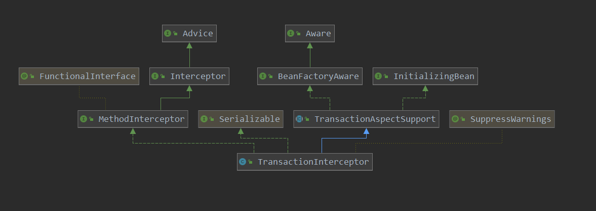

[TOC]

# 事务的调用


经过上面的分析，事务的创建就完成了，事务JDK代理的事务的入口仍然为JdkDynamicAopProxy#invoke 函数，之后就会调用到事务拦截器函数TransactionInterceptor。 本篇就从事务的拦截器函数作为入口点就行分析。

先看一下其类图：



在看一些spring和mybaits整合时的一些配置：

```java
@Configuration
// 扫描mapper的接口,并注册到容器中
@MapperScan(basePackages = {"com.wk.springdemo.mapper"})
@ComponentScan(value = {"com.wk.springdemo.service"})
@EnableTransactionManagement
public class MybatisConfig {
    //private String MapperLocation = "classpath: /*Mapper.xml";
    private String MapperLocation = "classpath:/mapper/*.xml";

    // 数据源
    @Bean
    public DataSource dataSource(){
        DriverManagerDataSource dataSource = new DriverManagerDataSource();
        dataSource.setDriverClassName("com.mysql.jdbc.Driver");
        dataSource.setUrl("jdbc:mysql://localhost:3306/ssm?useSSL=false&allowMultiQueries=true");
        dataSource.setUsername("root");
        dataSource.setPassword("admin");
        return dataSource;
    }

    // sqlsessionfactory
    @Bean("sqlSessionFactory")
    public SqlSessionFactory sqlSessionFactory() throws Exception {
        PathMatchingResourcePatternResolver patternResolver = new PathMatchingResourcePatternResolver();
        SqlSessionFactoryBean sessionFactoryBean = new SqlSessionFactoryBean();
        sessionFactoryBean.setDataSource(dataSource());
        sessionFactoryBean.setMapperLocations(patternResolver.getResources(MapperLocation));
        return sessionFactoryBean.getObject();
    }

    // 事务管理器
    // 记住这里的事务管理器是 DataSourceTransactionManager
    // 并设置了事务管理的 数据库连接池
    @Bean
    public PlatformTransactionManager transactionManager(){
        DataSourceTransactionManager transactionManager = new DataSourceTransactionManager();
        transactionManager.setDataSource(dataSource());
        return transactionManager;
    }
}
```


从其调用函数invoke开始入手：

> org.springframework.transaction.interceptor.TransactionInterceptor#invoke

```java
@Override
@Nullable
public Object invoke(MethodInvocation invocation) throws Throwable {
    // Work out the target class: may be {@code null}.
    // The TransactionAttributeSource should be passed the target class
    // as well as the method, which may be from an interface.
    Class<?> targetClass = (invocation.getThis() != null ? AopUtils.getTargetClass(invocation.getThis()) : null);

    // Adapt to TransactionAspectSupport's invokeWithinTransaction...
    // 调用事务的目标方法时, 会从这里开始
    return invokeWithinTransaction(invocation.getMethod(), targetClass, invocation::proceed);
}
```

> org.springframework.transaction.interceptor.TransactionAspectSupport#invokeWithinTransaction

```java
@Nullable
protected Object invokeWithinTransaction(Method method, @Nullable Class<?> targetClass,
                                         final InvocationCallback invocation) throws Throwable {

    // If the transaction attribute is null, the method is non-transactional.
    // 相当于获取 AnnotationTransactionAttributeSource,也就是事务的 pointcut
    TransactionAttributeSource tas = getTransactionAttributeSource();
    // 获取方法上事务的 属性
    final TransactionAttribute txAttr = (tas != null ? tas.getTransactionAttribute(method, targetClass) : null);
    // 获取事务管理器
    final PlatformTransactionManager tm = determineTransactionManager(txAttr);
    // 获取一个方法的 标识
    final String joinpointIdentification = methodIdentification(method, targetClass, txAttr);

    // 代理式事务管理
    if (txAttr == null || !(tm instanceof CallbackPreferringPlatformTransactionManager)) {
        // Standard transaction demarcation with getTransaction and commit/rollback calls.
        // todo createTransactionIfNecessary重要 重要 重要
        // todo 此方法创建了获取数据库连接,创建事务,以及保存事务信息到threadLocal中
        // 在开始调用目标方法前创建事务
        TransactionInfo txInfo = createTransactionIfNecessary(tm, txAttr, joinpointIdentification);
        Object retVal = null;
        try {
            // This is an around advice: Invoke the next interceptor in the chain.
            // This will normally result in a target object being invoked.
            // 目标方法的调用,如果还有其他的interceptor 那么先调用interceptor在调用目标方法
            // 如果还有其他的 拦截器则继续调用拦截器,否则调用目标方法
            retVal = invocation.proceedWithInvocation();
        }
        catch (Throwable ex) {
            // target invocation exception
            // 如果抛出异常, 对事务的处理 todo 重要 重要  重要
            completeTransactionAfterThrowing(txInfo, ex);
            throw ex;
        }
        finally {
            // 如果之前有oldTransactionInfo,那么就会在此处进行恢复
            cleanupTransactionInfo(txInfo);
        }
        // 提交事务 todo  对事务的提交动作  重要  重要  重要
        commitTransactionAfterReturning(txInfo);
        return retVal;
    }
    // 编程式事务管理
    else {
        final ThrowableHolder throwableHolder = new ThrowableHolder();

        // It's a CallbackPreferringPlatformTransactionManager: pass a TransactionCallback in.
        try {
            Object result = ((CallbackPreferringPlatformTransactionManager) tm).execute(txAttr, status -> {
                TransactionInfo txInfo = prepareTransactionInfo(tm, txAttr, joinpointIdentification, status);
                try {
                    return invocation.proceedWithInvocation();
                }
                catch (Throwable ex) {
                    if (txAttr.rollbackOn(ex)) {
                        // A RuntimeException: will lead to a rollback.
                        if (ex instanceof RuntimeException) {
                            throw (RuntimeException) ex;
                        }
                        else {
                            throw new ThrowableHolderException(ex);
                        }
                    }
                    else {
                        // A normal return value: will lead to a commit.
                        throwableHolder.throwable = ex;
                        return null;
                    }
                }
                finally {
                    cleanupTransactionInfo(txInfo);
                }
            });

            // Check result state: It might indicate a Throwable to rethrow.
            if (throwableHolder.throwable != null) {
                throw throwableHolder.throwable;
            }
            return result;
        }
        catch (ThrowableHolderException ex) {
            throw ex.getCause();
        }
        catch (TransactionSystemException ex2) {
            if (throwableHolder.throwable != null) {
                logger.error("Application exception overridden by commit exception", throwableHolder.throwable);
                ex2.initApplicationException(throwableHolder.throwable);
            }
            throw ex2;
        }
        catch (Throwable ex2) {
            if (throwableHolder.throwable != null) {
                logger.error("Application exception overridden by commit exception", throwableHolder.throwable);
            }
            throw ex2;
        }
    }
}
```

这里咱们先不看编程式事务的处理，可以看到正常的事务使用流程如上代码所示：

1. 在目标方法调用前，创建事务
2. 调用目标方法
3. 如果出现异常，处理事务对异常的处理
4. 如果没有异常，则提交事务

看一下事务的创建：

> org.springframework.transaction.interceptor.TransactionAspectSupport#createTransactionIfNecessary

```java
// 创建事务
@SuppressWarnings("serial")
protected TransactionInfo createTransactionIfNecessary(@Nullable PlatformTransactionManager tm,
@Nullable TransactionAttribute txAttr, final String joinpointIdentification) {

    // If no name specified, apply method identification as transaction name.
    // 如果事务中的name没有设定, 那么此处就设定为joinpointIdentification, 也就是全限定类名 + "." + 方法名
    if (txAttr != null && txAttr.getName() == null) {
        txAttr = new DelegatingTransactionAttribute(txAttr) {
            @Override
            public String getName() {
                return joinpointIdentification;
            }
        };
    }
    TransactionStatus status = null;
    if (txAttr != null) {
        if (tm != null) {
            // 获取TransactionStatus
            status = tm.getTransaction(txAttr);
        }
        else {
            if (logger.isDebugEnabled()) {
                logger.debug("Skipping transactional joinpoint [" + joinpointIdentification +
                             "] because no transaction manager has been configured");
            }
        }
    }
    // TransactionInfo保存了 transactionManager transactionAttribute transactionStatus transactionName(全限定名+"."+类名)
    // 并绑定到当前线程的threadLocal
    return prepareTransactionInfo(tm, txAttr, joinpointIdentification, status);
}
```

事务的创建:

> org.springframework.transaction.support.AbstractPlatformTransactionManager#getTransaction

```java
// 获取事务
// 此函数的参数definition,其实就是事务注解中配置的各个属性的值
@Override
public final TransactionStatus getTransaction(@Nullable TransactionDefinition definition) throws TransactionException {
    // 真正去获取 事务的 动作
    // 这里只是创建了一个事务,还没有数据库的连接
    Object transaction = doGetTransaction();

    // Cache debug flag to avoid repeated checks.
    boolean debugEnabled = logger.isDebugEnabled();
    // 如果TransactionDefinition 没有定义, 就使用默认的
    // 如果事务注解中没有配置属性,则使用默认的属性
    if (definition == null) {
        // Use defaults if no transaction definition given.
        definition = new DefaultTransactionDefinition();
    }
    // 如果已经存在事务, 那么到这里进行处理
    // 是否已经存在事务
    if (isExistingTransaction(transaction)) {
        // Existing transaction found -> check propagation behavior to find out how to behave.
        // TODO 已经存在事务的话, 就在这里进行处理
        return handleExistingTransaction(definition, transaction, debugEnabled);
    }

    // Check definition settings for new transaction.
    // 这里进行了timeout设置值得检查,也就是值不能小于-1
    if (definition.getTimeout() < TransactionDefinition.TIMEOUT_DEFAULT) {
        throw new InvalidTimeoutException("Invalid transaction timeout", definition.getTimeout());
    }

    // No existing transaction found -> check propagation behavior to find out how to proceed.
    // 运行到这里,说明不存在事务
    // 如果事务传播类型是PROPAGATION_MANDATORY, 那么就报错
    if (definition.getPropagationBehavior() == TransactionDefinition.PROPAGATION_MANDATORY) {
        throw new IllegalTransactionStateException(
            "No existing transaction found for transaction marked with propagation 'mandatory'");
    }
    // TODO 如果事务传播类型是PROPAGATION_REQUIRED  PROPAGATION_REQUIRES_NEW   PROPAGATION_NESTED
    // TODO 就创建新事务, 此处可见 suspend(null),也就是挂起事务为null
    else if (definition.getPropagationBehavior() == TransactionDefinition.PROPAGATION_REQUIRED ||
             definition.getPropagationBehavior() == TransactionDefinition.PROPAGATION_REQUIRES_NEW ||
             definition.getPropagationBehavior() == TransactionDefinition.PROPAGATION_NESTED) {
        SuspendedResourcesHolder suspendedResources = suspend(null);
        if (debugEnabled) {
            logger.debug("Creating new transaction with name [" + definition.getName() + "]: " + definition);
        }
        try {
            // newSynchronization标识是否是一个新事务, 此处值为true
            boolean newSynchronization = (getTransactionSynchronization() != SYNCHRONIZATION_NEVER);
            // 创建新的  TransactionStatus
            // definition 事务注解的属性值
            //transaction  事务
            //newTransaction 标识是否是新事物
            //actualNewSynchronization 是否是新事务
            //isReadOnly 是否是只读
            //debug  日志等级
            // suspendedResources 挂起的事务
            DefaultTransactionStatus status = newTransactionStatus(
                definition, transaction, true, newSynchronization, debugEnabled, suspendedResources);
            // todo 重要重要重要  一个事务的开始
            // 也是获取真正数据库连接的操作
            doBegin(transaction, definition);
            // 把当前事务的name 隔离级别 是否active等信息 存放到threadLocal中
            prepareSynchronization(status, definition);
            return status;
        }
        catch (RuntimeException | Error ex) {
            resume(null, suspendedResources);
            throw ex;
        }
    }
    else {
        // Create "empty" transaction: no actual transaction, but potentially synchronization.
        // 创建一个空事务
        if (definition.getIsolationLevel() != TransactionDefinition.ISOLATION_DEFAULT && logger.isWarnEnabled()) {
            logger.warn("Custom isolation level specified but no actual transaction initiated; " +
                        "isolation level will effectively be ignored: " + definition);
        }
        boolean newSynchronization = (getTransactionSynchronization() == SYNCHRONIZATION_ALWAYS);
        return prepareTransactionStatus(definition, null, true, newSynchronization, debugEnabled, null);
    }
}

```

这里有比较多种情况，根据事务的传播类型的不同，来创建不同的事务：

1. 当前创建的事务，已经存在事务的处理
2.  PROPAGATION_REQUIRED，PROPAGATION_REQUIRES_NEW，PROPAGATION_NESTED传播类型的处理
   1. 挂起一个空的事务
   2. 创建一个新的事务

看一下对已存在事务时创建新事务的处理：

> org.springframework.transaction.support.AbstractPlatformTransactionManager#handleExistingTransaction

```java
// 处理已存在事务时  创建新事务的操作
// definition,  事务注解的 属性值
// transaction,	 创建事务
// debugEnabled  日志是否是debug
private TransactionStatus handleExistingTransaction(
    TransactionDefinition definition, Object transaction, boolean debugEnabled)
    throws TransactionException {
    // 1. 如果当前的事务传播策略是 PROPAGATION_NEVER, 则报错
    if (definition.getPropagationBehavior() == TransactionDefinition.PROPAGATION_NEVER) {
        throw new IllegalTransactionStateException(
            "Existing transaction found for transaction marked with propagation 'never'");
    }
    // 2. 如果当前的事务传播策略是  PROPAGATION_NOT_SUPPORTED, 则挂起当前事务,进行处理
    // 不支持事务,则挂起当前事务
    if (definition.getPropagationBehavior() == TransactionDefinition.PROPAGATION_NOT_SUPPORTED) {
        if (debugEnabled) {
            logger.debug("Suspending current transaction");
        }
        // 挂起事务
        // 重点
        // suspendedResources 存储挂起的事务信息
        Object suspendedResources = suspend(transaction);
        boolean newSynchronization = (getTransactionSynchronization() == SYNCHRONIZATION_ALWAYS);
        // 此操作只是会创建DefaultTransactionStatus,并不会把事务信息绑定到 threadLocal中,
        // 因为这不是一个 newTransaction=false,表示这不是一个新事务
        return prepareTransactionStatus(
            definition, null, false, newSynchronization, debugEnabled, suspendedResources);
    }
    // 3. 如果当前事务传播策略是 PROPAGATION_REQUIRES_NEW, 则挂起当前事务,创建一个新的事务
    // 需求是新事务,则挂起当前事务,创建一个新事务
    if (definition.getPropagationBehavior() == TransactionDefinition.PROPAGATION_REQUIRES_NEW) {
        if (debugEnabled) {
            logger.debug("Suspending current transaction, creating new transaction with name [" +
                         definition.getName() + "]");
        }
        // 挂起事务的操作,也就是把事务的资源从threadLocal中删除
        // suspendedResources 为挂起的事务
        SuspendedResourcesHolder suspendedResources = suspend(transaction);
        try {
            boolean newSynchronization = (getTransactionSynchronization() != SYNCHRONIZATION_NEVER);
            // 创建一个新的事务
            // 此处看newTransactionStatus的第三个参数,newTransaction为true,表示这是一个新事务
            // 会把此新事务绑定到threadLocal中
            DefaultTransactionStatus status = newTransactionStatus(
                definition, transaction, true, newSynchronization, debugEnabled, suspendedResources);
            // 开始一个事务
            // 使用一个新的数据库连接,即开启了一个新的事务
            doBegin(transaction, definition);
            // 把新事务的信息绑定到threadLocal中
            prepareSynchronization(status, definition);
            return status;
        }
        catch (RuntimeException | Error beginEx) {
            resumeAfterBeginException(transaction, suspendedResources, beginEx);
            throw beginEx;
        }
    }
    // 4.如果当前事务的传播策略是 PROPAGATION_NESTED,
    // 4.1 不是jta事务, 则创建一个savePoint,加入当前事务
    // 4.2 是jta事务, 则使用jta事务
    if (definition.getPropagationBehavior() == TransactionDefinition.PROPAGATION_NESTED) {
        if (!isNestedTransactionAllowed()) {
            throw new NestedTransactionNotSupportedException(
                "Transaction manager does not allow nested transactions by default - " +
                "specify 'nestedTransactionAllowed' property with value 'true'");
        }
        if (debugEnabled) {
            logger.debug("Creating nested transaction with name [" + definition.getName() + "]");
        }
        // 正常的nest事务
        if (useSavepointForNestedTransaction()) {
            DefaultTransactionStatus status =
                prepareTransactionStatus(definition, transaction, false, false, debugEnabled, null);
            // 创建 savepoint
            status.createAndHoldSavepoint();
            return status;
        }
        // jta事务; 分布式事务,也就是分两步提交
        else {
            boolean newSynchronization = (getTransactionSynchronization() != SYNCHRONIZATION_NEVER);
            DefaultTransactionStatus status = newTransactionStatus(
                definition, transaction, true, newSynchronization, debugEnabled, null);
            doBegin(transaction, definition);
            prepareSynchronization(status, definition);
            return status;
        }
    }

    // Assumably PROPAGATION_SUPPORTS or PROPAGATION_REQUIRED.
    if (debugEnabled) {
        logger.debug("Participating in existing transaction");
    }
    if (isValidateExistingTransaction()) {
        if (definition.getIsolationLevel() != TransactionDefinition.ISOLATION_DEFAULT) {
            Integer currentIsolationLevel = TransactionSynchronizationManager.getCurrentTransactionIsolationLevel();
            if (currentIsolationLevel == null || currentIsolationLevel != definition.getIsolationLevel()) {
                Constants isoConstants = DefaultTransactionDefinition.constants;
                throw new IllegalTransactionStateException("Participating transaction with definition [" + definition + "] specifies isolation level which is incompatible with existing transaction: " +
  (currentIsolationLevel != null ? isoConstants.toCode(currentIsolationLevel, DefaultTransactionDefinition.PREFIX_ISOLATION) : "(unknown)"));
            }
        }
        if (!definition.isReadOnly()) {
            if (TransactionSynchronizationManager.isCurrentTransactionReadOnly()) {
                throw new IllegalTransactionStateException("Participating transaction with definition [" +definition + "] is not marked as read-only but existing transaction is");
            }
        }
    }
    // 5. 使用旧事务
    boolean newSynchronization = (getTransactionSynchronization() != SYNCHRONIZATION_NEVER);
    return prepareTransactionStatus(definition, transaction, false, newSynchronization, debugEnabled, null);
}
```

这里对已存在事务也会根据设置的事务传播类型的不同，来进行不同的处理:

1. 事务传播类型为PROPAGATION_NEVER，则报错，表示 永不使用事务
2.  事务传播类型为 PROPAGATION_NOT_SUPPORTED，表示不支持事务，则挂起当前事务，创建一个新的DefaultTransactionStatus，但是不会把新事务绑定到threadLocal中。其实挂起事务就是把当前线程的threadLocal中的事务资源删除。
3. 事务传播类型为PROPAGATION_REQUIRES_NEW，表示需要使用新的事务，则挂起当前的事务，创建一个新的事务，并绑定到threadLocal中
4. 事务传播类型为PROPAGATION_NESTED，嵌套型事务，表示在原来的事务中创建保存点savePoint。
5. 事务传播类型为其他，则使用原来的事务

这里看一下挂起事务的操作以及创建新事务的操作。

挂起事务:

> org.springframework.transaction.support.AbstractPlatformTransactionManager#suspend

```java
// 挂起一个事务的操作
// 重点
@Nullable
protected final SuspendedResourcesHolder suspend(@Nullable Object transaction) throws TransactionException {
    if (TransactionSynchronizationManager.isSynchronizationActive()) {
        // 挂起Synchronization的事务, 也就是把threadLocal中的Synchronization的事务从threadLocal中删除
        List<TransactionSynchronization> suspendedSynchronizations = doSuspendSynchronization();
        try {
            Object suspendedResources = null;
            if (transaction != null) {
                // 挂起当前事务的操作
                // 就是把DataSourceTransactionObject 从threadLocal中删除
                suspendedResources = doSuspend(transaction);
            }
            // 把当前事务的其他信息也从threadLocal中删除 并把信息封装到SuspendedResourcesHolder中
            String name = TransactionSynchronizationManager.getCurrentTransactionName();
            TransactionSynchronizationManager.setCurrentTransactionName(null);
            boolean readOnly = TransactionSynchronizationManager.isCurrentTransactionReadOnly();
            TransactionSynchronizationManager.setCurrentTransactionReadOnly(false);
            Integer isolationLevel = TransactionSynchronizationManager.getCurrentTransactionIsolationLevel();
            TransactionSynchronizationManager.setCurrentTransactionIsolationLevel(null);
            boolean wasActive = TransactionSynchronizationManager.isActualTransactionActive();
            TransactionSynchronizationManager.setActualTransactionActive(false);
            // 创建一个 SuspendedResourcesHolder,包装起来 挂起的事务信息
            return new SuspendedResourcesHolder(suspendedResources, suspendedSynchronizations, name, readOnly, isolationLevel, wasActive);
        }
        catch (RuntimeException | Error ex) {
            // doSuspend failed - original transaction is still active...
            // 如果挂起事务失败了, 那么就恢复之前的事务
            doResumeSynchronization(suspendedSynchronizations);
            throw ex;
        }
    }
    else if (transaction != null) {
        // Transaction active but no synchronization active.
        Object suspendedResources = doSuspend(transaction);
        return new SuspendedResourcesHolder(suspendedResources);
    }
    else {
        // Neither transaction nor synchronization active.
        return null;
    }
}
```

> org.springframework.jdbc.datasource.DataSourceTransactionManager#doSuspend

```java
	// 挂起当前事务
	@Override
	protected Object doSuspend(Object transaction) {
		DataSourceTransactionObject txObject = (DataSourceTransactionObject) transaction;
		txObject.setConnectionHolder(null);
		// 挂起事务,也就是把事务资源从threadLocal中删除
		return TransactionSynchronizationManager.unbindResource(obtainDataSource());
	}
```

> org.springframework.transaction.support.TransactionSynchronizationManager#unbindResource

```java
public static Object unbindResource(Object key) throws IllegalStateException {
    Object actualKey = TransactionSynchronizationUtils.unwrapResourceIfNecessary(key);
    // 把资源从当前线程的threadLocal中删除
    Object value = doUnbindResource(actualKey);
    if (value == null) {
        throw new IllegalStateException( "No value for key [" + actualKey + "] bound to thread [" + Thread.currentThread().getName() + "]");
    }
    return value;
}
```

> org.springframework.transaction.support.TransactionSynchronizationManager#doUnbindResource

```java
	/*  解绑资源, 也就是把资源从threadLocal中删除
    */
    @Nullable
    private static Object doUnbindResource(Object actualKey) {
    Map<Object, Object> map = resources.get();
    if (map == null) {
        return null;
    }
    Object value = map.remove(actualKey);
    // Remove entire ThreadLocal if empty...
    if (map.isEmpty()) {
        resources.remove();
    }
    // Transparently suppress a ResourceHolder that was marked as void...
    if (value instanceof ResourceHolder && ((ResourceHolder) value).isVoid()) {
        value = null;
    }
    if (value != null && logger.isTraceEnabled()) {
        logger.trace("Removed value [" + value + "] for key [" + actualKey + "] from thread [" +
                     Thread.currentThread().getName() + "]");
    }
    return value;
}
```

可见挂起事务主要是把threadLocal中的事务信息删除，并把删除的事务信息保存起来。

创建事务：

> org.springframework.transaction.support.AbstractPlatformTransactionManager#newTransactionStatus

```java
protected DefaultTransactionStatus newTransactionStatus(
    TransactionDefinition definition, @Nullable Object transaction, boolean newTransaction,
    boolean newSynchronization, boolean debug, @Nullable Object suspendedResources) {
    // actualNewSynchronization为true的情况, newSynchronization为true,
    // TransactionSynchronizationManager.isSynchronizationActive()为false,也就是当前线程没有持有事务
    boolean actualNewSynchronization = newSynchronization &&
        !TransactionSynchronizationManager.isSynchronizationActive();
    // 创建新的status
    //transaction  事务
    //newTransaction 标识是否是新事物
    //actualNewSynchronization 是否是新事务
    //isReadOnly 是否是只读
    //debug  日志等级
    // suspendedResources 挂起的事务
    return new DefaultTransactionStatus(
        transaction, newTransaction, actualNewSynchronization,
        definition.isReadOnly(), debug, suspendedResources);
}
```

> org.springframework.jdbc.datasource.DataSourceTransactionManager#doBegin

```java
@Override
protected void doBegin(Object transaction, TransactionDefinition definition) {
    DataSourceTransactionObject txObject = (DataSourceTransactionObject) transaction;
    Connection con = null;
    try {
        // 第一次进入,这里是null,也就是当前线程的threadLocal没有包含线程
        if (!txObject.hasConnectionHolder() ||
            txObject.getConnectionHolder().isSynchronizedWithTransaction()) {
            // 从线程池中获取一个新的连接
            Connection newCon = obtainDataSource().getConnection();
            if (logger.isDebugEnabled()) {
                logger.debug("Acquired Connection [" + newCon + "] for JDBC transaction");
            }
            // 创建一个新的ConnectionHolder到当前线程的threadLocal中
            txObject.setConnectionHolder(new ConnectionHolder(newCon), true);
        }
        // 设置是否进行同步
        txObject.getConnectionHolder().setSynchronizedWithTransaction(true);
        // 获取到当前的数据库连接
        con = txObject.getConnectionHolder().getConnection();
        // 设置是否是只读的,根据事务注解配置设置事务的隔离级别
        // 返回原来的事务隔离级别
        Integer previousIsolationLevel = DataSourceUtils.prepareConnectionForTransaction(con, definition);
        // 记录原来的事务隔离级别
        txObject.setPreviousIsolationLevel(previousIsolationLevel);

        // Switch to manual commit if necessary. This is very expensive in some JDBC drivers,
        // so we don't want to do it unnecessarily (for example if we've explicitly
        // configured the connection pool to set it already).
        // 如果数据库连接是自动提交, 那么设置为手动进行事务的提交
        if (con.getAutoCommit()) {
            txObject.setMustRestoreAutoCommit(true);
            if (logger.isDebugEnabled()) {
                logger.debug("Switching JDBC Connection [" + con + "] to manual commit");
            }
            con.setAutoCommit(false);
        }
        // 如果当前是只读的,那么就执行sql,设置当前的事务是只读的
        prepareTransactionalConnection(con, definition);
        // 更新当前事务的active属性, 标识事务已经开始
        // 设置事务 active为true
        txObject.getConnectionHolder().setTransactionActive(true);

        // 如果设置事务的超时属性,那么就更新事务的超时时间
        int timeout = determineTimeout(definition);
        if (timeout != TransactionDefinition.TIMEOUT_DEFAULT) {
            txObject.getConnectionHolder().setTimeoutInSeconds(timeout);
        }

        // Bind the connection holder to the thread.
        // 把当前事务绑定到当前线程, key为datasource, value为: ConnectionHolder
        if (txObject.isNewConnectionHolder()) {
            // 存储资源到 threadLocal中
            TransactionSynchronizationManager.bindResource(obtainDataSource(), txObject.getConnectionHolder());
        }
    }
    catch (Throwable ex) {
        if (txObject.isNewConnectionHolder()) {
            DataSourceUtils.releaseConnection(con, obtainDataSource());
            txObject.setConnectionHolder(null, false);
        }
   throw new CannotCreateTransactionException("Could not open JDBC Connection for transaction", ex);
    }
}
```

> org.springframework.transaction.support.TransactionSynchronizationManager#bindResource

```java
// 绑定资源到当前的线程中,也就是设置到 threadLocal中
public static void bindResource(Object key, Object value) throws IllegalStateException {
    Object actualKey = TransactionSynchronizationUtils.unwrapResourceIfNecessary(key);
    Assert.notNull(value, "Value must not be null");
    // 获取当前线程保存的数据库连接的map
    Map<Object, Object> map = resources.get();
    // set ThreadLocal Map if none found
    // 如果map为null, 则创建一个新的
    if (map == null) {
        map = new HashMap<>();
        resources.set(map);
    }
    // 把当前的连接放入
    Object oldValue = map.put(actualKey, value);
    // Transparently suppress a ResourceHolder that was marked as void...
    // isVoid 为true, 标识进行过unbound操作
    if (oldValue instanceof ResourceHolder && ((ResourceHolder) oldValue).isVoid()) {
        oldValue = null;
    }
    if (oldValue != null) {
        throw new IllegalStateException("Already value [" + oldValue + "] for key [" +
     actualKey + "] bound to thread [" + Thread.currentThread().getName() + "]");
    }
    if (logger.isTraceEnabled()) {
        logger.trace("Bound value [" + value + "] for key [" + actualKey + "] to thread [" +
                     Thread.currentThread().getName() + "]");
    }
}
```

> org.springframework.transaction.support.AbstractPlatformTransactionManager#prepareSynchronization

```java
// 准备一些同步操作
// 向threadLocal中存储多些信息
protected void prepareSynchronization(DefaultTransactionStatus status, TransactionDefinition definition) {
    // 如果isNewSynchronization 为true, 则把当前事务的信息存放到当前的线程的threadLocal中
    if (status.isNewSynchronization()) {
        TransactionSynchronizationManager.setActualTransactionActive(status.hasTransaction());
        TransactionSynchronizationManager.setCurrentTransactionIsolationLevel(
            definition.getIsolationLevel() != TransactionDefinition.ISOLATION_DEFAULT ?
            definition.getIsolationLevel() : null);
        TransactionSynchronizationManager.setCurrentTransactionReadOnly(definition.isReadOnly());
        TransactionSynchronizationManager.setCurrentTransactionName(definition.getName());
        // 嵌套事务的话  这里会存储多个连接
        TransactionSynchronizationManager.initSynchronization();
    }
}
```

可见创建一个新事务，主要就是：

1. 从数据库连接源中获取一个新的数据库连接
2. 根据注解当时的配置 设置数据库的隔离级别
3. 设置连接的非自动提交
4. 根据是否是可读，设置此事务是否是可读
5. 设置超时时间
6. 绑定此事务到threadLocal中

到此，对有事务创建新事务就完成了。

在回到主线中，回顾一下：

> org.springframework.transaction.support.AbstractPlatformTransactionManager#getTransaction

```java
// 获取事务
// 此函数的参数definition,其实就是事务注解中配置的各个属性的值
@Override
public final TransactionStatus getTransaction(@Nullable TransactionDefinition definition) throws TransactionException {
    // 真正去获取 事务的 动作
    // 这里只是创建了一个事务,还没有数据库的连接
    Object transaction = doGetTransaction();

    // Cache debug flag to avoid repeated checks.
    boolean debugEnabled = logger.isDebugEnabled();
    // 如果TransactionDefinition 没有定义, 就使用默认的
    // 如果事务注解中没有配置属性,则使用默认的属性
    if (definition == null) {
        // Use defaults if no transaction definition given.
        definition = new DefaultTransactionDefinition();
    }
    // 如果已经存在事务, 那么到这里进行处理
    // 是否已经存在事务
    if (isExistingTransaction(transaction)) {
        // Existing transaction found -> check propagation behavior to find out how to behave.
        // TODO 已经存在事务的话, 就在这里进行处理
        return handleExistingTransaction(definition, transaction, debugEnabled);
    }

    // Check definition settings for new transaction.
    // 这里进行了timeout设置值得检查,也就是值不能小于-1
    if (definition.getTimeout() < TransactionDefinition.TIMEOUT_DEFAULT) {
        throw new InvalidTimeoutException("Invalid transaction timeout", definition.getTimeout());
    }
	// 运行到这里，说明之前没有事务，那么就挂起一个空事务，并创建一个新事务
    // No existing transaction found -> check propagation behavior to find out how to proceed.
    // 运行到这里,说明不存在事务
    // 如果事务传播类型是PROPAGATION_MANDATORY, 那么就报错
    if (definition.getPropagationBehavior() == TransactionDefinition.PROPAGATION_MANDATORY) {
        throw new IllegalTransactionStateException(
            "No existing transaction found for transaction marked with propagation 'mandatory'");
    }
    // TODO 如果事务传播类型是PROPAGATION_REQUIRED  PROPAGATION_REQUIRES_NEW   PROPAGATION_NESTED
    // TODO 就创建新事务, 此处可见 suspend(null),也就是挂起事务为null
    else if (definition.getPropagationBehavior() == TransactionDefinition.PROPAGATION_REQUIRED ||
             definition.getPropagationBehavior() == TransactionDefinition.PROPAGATION_REQUIRES_NEW ||
             definition.getPropagationBehavior() == TransactionDefinition.PROPAGATION_NESTED) {
        SuspendedResourcesHolder suspendedResources = suspend(null);
        if (debugEnabled) {
            logger.debug("Creating new transaction with name [" + definition.getName() + "]: " + definition);
        }
        try {
            // newSynchronization标识是否是一个新事务, 此处值为true
            boolean newSynchronization = (getTransactionSynchronization() != SYNCHRONIZATION_NEVER);
            // 创建新的  TransactionStatus
            // definition 事务注解的属性值
            //transaction  事务
            //newTransaction 标识是否是新事物
            //actualNewSynchronization 是否是新事务
            //isReadOnly 是否是只读
            //debug  日志等级
            // suspendedResources 挂起的事务
            DefaultTransactionStatus status = newTransactionStatus(
                definition, transaction, true, newSynchronization, debugEnabled, suspendedResources);
            // todo 重要重要重要  一个事务的开始
            // 也是获取真正数据库连接的操作
            doBegin(transaction, definition);
            // 把当前事务的name 隔离级别 是否active等信息 存放到threadLocal中
            prepareSynchronization(status, definition);
            return status;
        }
        catch (RuntimeException | Error ex) {
            resume(null, suspendedResources);
            throw ex;
        }
    }
    else {
        // Create "empty" transaction: no actual transaction, but potentially synchronization.
        // 创建一个空事务
        if (definition.getIsolationLevel() != TransactionDefinition.ISOLATION_DEFAULT && logger.isWarnEnabled()) {
            logger.warn("Custom isolation level specified but no actual transaction initiated; " +
                        "isolation level will effectively be ignored: " + definition);
        }
        boolean newSynchronization = (getTransactionSynchronization() == SYNCHRONIZATION_ALWAYS);
        return prepareTransactionStatus(definition, null, true, newSynchronization, debugEnabled, null);
    }
}
```

处理完handleExistingTransaction后，向下分析，如果没有执行handleExistingTransaction，那么后面说明是之前没有事务的，则根据事务的传播机制，进行操作：

1. 如果事务传播机制是PROPAGATION_REQUIRED,PROPAGATION_REQUIRES_NEW,PROPAGATION_NESTED，则挂起一个空事务，并创建一个新事务，并绑定到threadLocal中
2. 是其他的传播机制(PROPAGATION_NEVER,PROPAGATION_NOT_SUPPORTED)，则创建一个空事务

到此在目标方法执行前，一个事务就创建完成了。

事务创建完成后，会执行目标方法，如果目标方法抛出异常，则要进行事务的异常处理。

> org.springframework.transaction.interceptor.TransactionAspectSupport#completeTransactionAfterThrowing

```java
// 对事务抛出异常的处理
protected void completeTransactionAfterThrowing(@Nullable TransactionInfo txInfo, Throwable ex) {
    if (txInfo != null && txInfo.getTransactionStatus() != null) {
        if (logger.isTraceEnabled()) {
            logger.trace("Completing transaction for [" + txInfo.getJoinpointIdentification() +
                         "] after exception: " + ex);
        }
        // todo txInfo.transactionAttribute.rollbackOn 此方法判断对此异常判断, 是否需要回滚
        // 默认情况下 只对 runtimeException Error  进行回滚
        if (txInfo.transactionAttribute != null && txInfo.transactionAttribute.rollbackOn(ex)) {
            try {
                // 具体的回滚动作
                txInfo.getTransactionManager().rollback(txInfo.getTransactionStatus());
            }
            catch (TransactionSystemException ex2) {
                logger.error("Application exception overridden by rollback exception", ex);
                ex2.initApplicationException(ex);
                throw ex2;
            }
            catch (RuntimeException | Error ex2) {
                logger.error("Application exception overridden by rollback exception", ex);
                throw ex2;
            }
        }
        else {
            // We don't roll back on this exception.
            // Will still roll back if TransactionStatus.isRollbackOnly() is true.
            try {
                // 如果发生的异常,并不是支持回滚的异常,那么仍然进行提交操作
                txInfo.getTransactionManager().commit(txInfo.getTransactionStatus());
            }
            catch (TransactionSystemException ex2) {
                logger.error("Application exception overridden by commit exception", ex);
                ex2.initApplicationException(ex);
                throw ex2;
            }
            catch (RuntimeException | Error ex2) {
                logger.error("Application exception overridden by commit exception", ex);
                throw ex2;
            }
        }
    }
}
```

可见当发生异常时，根据注解当时对回滚异常的也会进行不同的处理：

1. 如果设置了回滚异常，且目标方法抛出的异常就是设置的异常 或其 子类，则进行回滚
2. 如果此异常不支持，则还要进行提交

看一下事务的回滚，以及提交操作。

事务回滚：

> org.springframework.transaction.support.AbstractPlatformTransactionManager#rollback

```java
// 回滚动作
@Override
public final void rollback(TransactionStatus status) throws TransactionException {
    if (status.isCompleted()) {
        throw new IllegalTransactionStateException(
            "Transaction is already completed - do not call commit or rollback more than once per transaction");
    }
    DefaultTransactionStatus defStatus = (DefaultTransactionStatus) status;
    // 具体处理事务回滚的动作
    processRollback(defStatus, false);
}
```

> org.springframework.transaction.support.AbstractPlatformTransactionManager#processRollback

```java
// 处理事务的回滚操作
private void processRollback(DefaultTransactionStatus status, boolean unexpected) {
    try {
        boolean unexpectedRollback = unexpected;
        try {
            // 事务完成前的操作
            triggerBeforeCompletion(status);
            // 如果有保存点, 那么就回滚到保存点
            // nest 嵌入式事务
            if (status.hasSavepoint()) {
                if (status.isDebug()) {
                    logger.debug("Rolling back transaction to savepoint");
                }
                // 保存点的回滚
                status.rollbackToHeldSavepoint();
            }
            // 如果是新事务, 真正回滚  request_new 传播机制
            else if (status.isNewTransaction()) {
                if (status.isDebug()) {
                    logger.debug("Initiating transaction rollback");
                }
                // 真正回滚
                doRollback(status);
            }
            else {
                // Participating in larger transaction
                // 没有保存点,也不是新事务,则设置一个回滚标志, 此回滚标志在真正提交时进行处理
                // request  support manadory 传播机制
                if (status.hasTransaction()) {
                    if (status.isLocalRollbackOnly() || isGlobalRollbackOnParticipationFailure()) {
                        if (status.isDebug()) {
                            logger.debug("Participating transaction failed - marking existing transaction as rollback-only");
                        }
                        // 设置回滚标志
                        doSetRollbackOnly(status);
                    }
                    else {
                        if (status.isDebug()) {
                            logger.debug("Participating transaction failed - letting transaction originator decide on rollback");
                        }
                    }
                }
                // 没有事务, 也就是  not_support  never 类型的事务传播机制
                else {
                    logger.debug("Should roll back transaction but cannot - no transaction available");
                }
                // Unexpected rollback only matters here if we're asked to fail early
                if (!isFailEarlyOnGlobalRollbackOnly()) {
                    unexpectedRollback = false;
                }
            }
        }
        catch (RuntimeException | Error ex) {
            triggerAfterCompletion(status, TransactionSynchronization.STATUS_UNKNOWN);
            throw ex;
        }
        // 完成后的一些操作
        triggerAfterCompletion(status, TransactionSynchronization.STATUS_ROLLED_BACK);

        // Raise UnexpectedRollbackException if we had a global rollback-only marker
        if (unexpectedRollback) {
            throw new UnexpectedRollbackException(
                "Transaction rolled back because it has been marked as rollback-only");
        }
    }
    finally {
        // 如果是新事务, 则把事务从threadLocal中释放掉
        // 如果有旧事务,则还原旧事务
        cleanupAfterCompletion(status);
    }
}
```

回滚点的回滚：

> org.springframework.transaction.support.AbstractTransactionStatus#rollbackToHeldSavepoint

```java
// 对事务中的保存点的回滚
public void rollbackToHeldSavepoint() throws TransactionException {
    Object savepoint = getSavepoint();
    if (savepoint == null) {
        throw new TransactionUsageException(
            "Cannot roll back to savepoint - no savepoint associated with current transaction");
    }
    // 回滚到 保存点
    getSavepointManager().rollbackToSavepoint(savepoint);
    // 释放回滚点
    getSavepointManager().releaseSavepoint(savepoint);
    // 把保存的回滚点也进行释放
    setSavepoint(null);
}
```

真正的回滚：

> org.springframework.jdbc.datasource.DataSourceTransactionManager#doRollback

```java
// 真正进行事务回滚的操作
@Override
protected void doRollback(DefaultTransactionStatus status) {
    DataSourceTransactionObject txObject = (DataSourceTransactionObject) status.getTransaction();
    // 获取数据库连接
    Connection con = txObject.getConnectionHolder().getConnection();
    if (status.isDebug()) {
        logger.debug("Rolling back JDBC transaction on Connection [" + con + "]");
    }
    try {
        // 进行回滚
        con.rollback();
    }
    catch (SQLException ex) {
        throw new TransactionSystemException("Could not roll back JDBC transaction", ex);
    }
}
```


设置回滚的标志:

```java
// 设置事务的回滚标志
@Override
protected void doSetRollbackOnly(DefaultTransactionStatus status) {
    DataSourceTransactionObject txObject = (DataSourceTransactionObject) status.getTransaction();
    if (status.isDebug()) {
        logger.debug("Setting JDBC transaction [" + txObject.getConnectionHolder().getConnection() +
                     "] rollback-only");
    }
    // 设置回滚标志
    txObject.setRollbackOnly();
}

// 设置回滚标志
public void setRollbackOnly() {
    getConnectionHolder().setRollbackOnly();
}

// 设置回滚标志
public void setRollbackOnly() {
    this.rollbackOnly = true;
}
```

事务提交：

> org.springframework.transaction.support.AbstractPlatformTransactionManager#commit

```java
// 事务的提交动作
@Override
public final void commit(TransactionStatus status) throws TransactionException {
    if (status.isCompleted()) {
        throw new IllegalTransactionStateException(
            "Transaction is already completed - do not call commit or rollback more than once per transaction");
    }

    DefaultTransactionStatus defStatus = (DefaultTransactionStatus) status;
    // 是否设置了回滚动作  默认为false
    if (defStatus.isLocalRollbackOnly()) {
        if (defStatus.isDebug()) {
            logger.debug("Transactional code has requested rollback");
        }
        // 处理回滚动作
        processRollback(defStatus, false);
        return;
    }
    // 是否设置了全局的回滚标志
    if (!shouldCommitOnGlobalRollbackOnly() && defStatus.isGlobalRollbackOnly()) {
        if (defStatus.isDebug()) {
            logger.debug("Global transaction is marked as rollback-only but transactional code requested commit");
        }
        // 处理回滚标志
        processRollback(defStatus, true);
        return;
    }
    // 处理提交的动作
    processCommit(defStatus);
}
```


```java
// 事务的提交的动作
private void processCommit(DefaultTransactionStatus status) throws TransactionException {
    try {
        boolean beforeCompletionInvoked = false;

        try {
            boolean unexpectedRollback = false;
            // 提交前的一些回调方法
            prepareForCommit(status);
            triggerBeforeCommit(status);
            triggerBeforeCompletion(status);
            beforeCompletionInvoked = true;
            // 如果有保存点
            if (status.hasSavepoint()) {
                if (status.isDebug()) {
                    logger.debug("Releasing transaction savepoint");
                }
                // 是否有全局回滚的标志
                unexpectedRollback = status.isGlobalRollbackOnly();
                // 释放保存掉
                status.releaseHeldSavepoint();
            }
            //是否是新事务
            else if (status.isNewTransaction()) {
                if (status.isDebug()) {
                    logger.debug("Initiating transaction commit");
                }
                unexpectedRollback = status.isGlobalRollbackOnly();
                //todo  正在提交的动作
                doCommit(status);
            }
            else if (isFailEarlyOnGlobalRollbackOnly()) {
                unexpectedRollback = status.isGlobalRollbackOnly();
            }

            // Throw UnexpectedRollbackException if we have a global rollback-only
            // marker but still didn't get a corresponding exception from commit.
            // 如有有异常, 则进行抛出; 如 request_new, 嵌套事务 这些子事务会把异常抛出到上层事务
            if (unexpectedRollback) {
                throw new UnexpectedRollbackException(
                    "Transaction silently rolled back because it has been marked as rollback-only");
            }
        }
        catch (UnexpectedRollbackException ex) {
            // can only be caused by doCommit
            triggerAfterCompletion(status, TransactionSynchronization.STATUS_ROLLED_BACK);
            throw ex;
        }
        catch (TransactionException ex) {
            // can only be caused by doCommit
            if (isRollbackOnCommitFailure()) {
                // 对于提交过程中出现的异常的处理
                doRollbackOnCommitException(status, ex);
            }
            else {
                triggerAfterCompletion(status, TransactionSynchronization.STATUS_UNKNOWN);
            }
            throw ex;
        }
        catch (RuntimeException | Error ex) {
            if (!beforeCompletionInvoked) {
                triggerBeforeCompletion(status);
            }
            // 对于提交过程中出现异常的处理
            doRollbackOnCommitException(status, ex);
            throw ex;
        }

        // Trigger afterCommit callbacks, with an exception thrown there
        // propagated to callers but the transaction still considered as committed.
        try {
            // 提交后的动作
            triggerAfterCommit(status);
        }
        finally {
            // 完成后的动作
            triggerAfterCompletion(status, TransactionSynchronization.STATUS_COMMITTED);
        }

    }
    finally {
        // 完成后的动作
        // 清除threadLocal中的现有事务的信息, 如果有旧事务,则还原旧事务
        cleanupAfterCompletion(status);
    }
}
```

> org.springframework.jdbc.datasource.DataSourceTransactionManager#doCommit

```java
// 真正的提交动作
@Override
protected void doCommit(DefaultTransactionStatus status) {
    DataSourceTransactionObject txObject = (DataSourceTransactionObject) status.getTransaction();
    // 获取数据库连接
    Connection con = txObject.getConnectionHolder().getConnection();
    if (status.isDebug()) {
        logger.debug("Committing JDBC transaction on Connection [" + con + "]");
    }
    try {
        // 这里就很清除了, 获取数据库连接, 进行事务的提交操作
        con.commit();
    }
    catch (SQLException ex) {
        throw new TransactionSystemException("Could not commit JDBC transaction", ex);
    }
}
```


没有发生异常，则进行事务的提交，此提交和上面的提交是一样的操作。

到此一个事务的调用就完成了.

再补充一下事务的挂起操作:

> org.springframework.transaction.support.AbstractPlatformTransactionManager#suspend

```java
	// 挂起一个事务的操作
	// 重点
	@Nullable
	protected final SuspendedResourcesHolder suspend(@Nullable Object transaction) throws TransactionException {
		if (TransactionSynchronizationManager.isSynchronizationActive()) {
			// 挂起Synchronization的事务, 也就是把threadLocal中的Synchronization的事务从threadLocal中删除
            // 看一下这里的挂起
			List<TransactionSynchronization> suspendedSynchronizations = doSuspendSynchronization();
			try {
				Object suspendedResources = null;
				if (transaction != null) {
					// 挂起当前事务的操作
					// 就是把DataSourceTransactionObject 从threadLocal中删除
					suspendedResources = doSuspend(transaction);
				}
				// 把当前事务的其他信息也从threadLocal中删除 并把信息封装到SuspendedResourcesHolder中
				String name = TransactionSynchronizationManager.getCurrentTransactionName();
				TransactionSynchronizationManager.setCurrentTransactionName(null);
				boolean readOnly = TransactionSynchronizationManager.isCurrentTransactionReadOnly();
				TransactionSynchronizationManager.setCurrentTransactionReadOnly(false);
				Integer isolationLevel = TransactionSynchronizationManager.getCurrentTransactionIsolationLevel();
				TransactionSynchronizationManager.setCurrentTransactionIsolationLevel(null);
				boolean wasActive = TransactionSynchronizationManager.isActualTransactionActive();
				TransactionSynchronizationManager.setActualTransactionActive(false);
				// 创建一个 SuspendedResourcesHolder,包装起来 挂起的事务信息
				return new SuspendedResourcesHolder(
						suspendedResources, suspendedSynchronizations, name, readOnly, isolationLevel, wasActive);
			}
            .....
	}
```

> org.springframework.transaction.support.AbstractPlatformTransactionManager#doSuspendSynchronization

```java
	private List<TransactionSynchronization> doSuspendSynchronization() {
		// 获取当前线程正在同步的事务
		List<TransactionSynchronization> suspendedSynchronizations =
				TransactionSynchronizationManager.getSynchronizations();
		for (TransactionSynchronization synchronization : suspendedSynchronizations) {
			// 事务的挂起操作
			synchronization.suspend();
		}
		// 清空threadLocal  -> synchronizations
		TransactionSynchronizationManager.clearSynchronization();
		return suspendedSynchronizations;
	}
```

>org.springframework.transaction.support.ResourceHolderSynchronization#suspend

```java
	@Override
	public void suspend() {
		if (this.holderActive) {
			TransactionSynchronizationManager.unbindResource(this.resourceKey);
		}
	}


	public static Object unbindResource(Object key) throws IllegalStateException {
		Object actualKey = TransactionSynchronizationUtils.unwrapResourceIfNecessary(key);
		// 把资源从当前线程的threadLocal中删除
		Object value = doUnbindResource(actualKey);
		if (value == null) {
			throw new IllegalStateException(
					"No value for key [" + actualKey + "] bound to thread [" + Thread.currentThread().getName() + "]");
		}
		return value;
	}

	@Nullable
	private static Object doUnbindResource(Object actualKey) {
		Map<Object, Object> map = resources.get();
		if (map == null) {
			return null;
		}
		Object value = map.remove(actualKey);
		// Remove entire ThreadLocal if empty...
		if (map.isEmpty()) {
			resources.remove();
		}
		// Transparently suppress a ResourceHolder that was marked as void...
		if (value instanceof ResourceHolder && ((ResourceHolder) value).isVoid()) {
			value = null;
		}
		if (value != null && logger.isTraceEnabled()) {
			logger.trace("Removed value [" + value + "] for key [" + actualKey + "] from thread [" +
					Thread.currentThread().getName() + "]");
		}
		return value;
	}
```

可以看到这里的ResourceHolderSynchronization挂起事务时，只是把对应的资源信息从threadLocal中删除，并没有做释放等操作。

再看后面的事务恢复

> org.springframework.transaction.support.AbstractPlatformTransactionManager#resume

```java
protected final void resume(@Nullable Object transaction, @Nullable SuspendedResourcesHolder resourcesHolder)
    throws TransactionException {
    if (resourcesHolder != null) {
        Object suspendedResources = resourcesHolder.suspendedResources;
        if (suspendedResources != null) {
            // 真正的还原操作
            // 还原操作, 也就是把原来的事务绑定到threadLocal中
            doResume(transaction, suspendedResources);
        }
        List<TransactionSynchronization> suspendedSynchronizations = resourcesHolder.suspendedSynchronizations;
        if (suspendedSynchronizations != null) {
            TransactionSynchronizationManager.setActualTransactionActive(resourcesHolder.wasActive);
            TransactionSynchronizationManager.setCurrentTransactionIsolationLevel(resourcesHolder.isolationLevel);
            TransactionSynchronizationManager.setCurrentTransactionReadOnly(resourcesHolder.readOnly);
            TransactionSynchronizationManager.setCurrentTransactionName(resourcesHolder.name);
            doResumeSynchronization(suspendedSynchronizations);
        }
    }
}
```

> org.springframework.transaction.support.AbstractPlatformTransactionManager#doResumeSynchronization

```java
private void doResumeSynchronization(List<TransactionSynchronization> suspendedSynchronizations) {
    TransactionSynchronizationManager.initSynchronization();
    for (TransactionSynchronization synchronization : suspendedSynchronizations) {
        // 事务的恢复, 重新把事务的资源绑定到threadLocal中
        synchronization.resume();
        TransactionSynchronizationManager.registerSynchronization(synchronization);
    }
}

// org.springframework.transaction.support.ResourceHolderSynchronization#resume
	@Override
	public void resume() {
		if (this.holderActive) {
			TransactionSynchronizationManager.bindResource(this.resourceKey, this.resourceHolder);
		}
	}
```

可以看到这里的事务恢复时，只是把原来的resourceHolder再次绑定。


