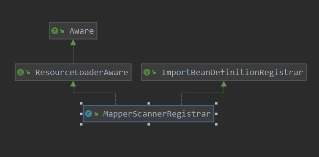
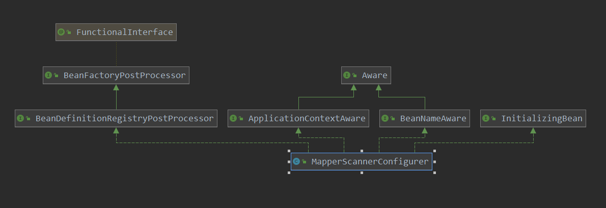
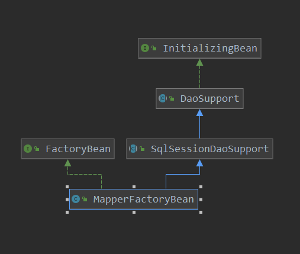
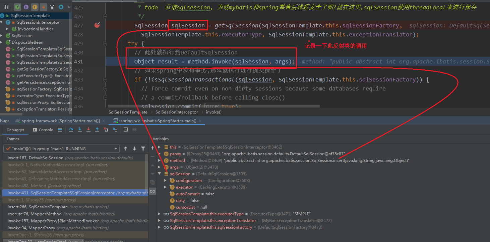

[TOC]

# MapperScan

上篇分析完了SqlFactorybean，本篇来看一下MapperScan注解都做了什么工作。

```java
@Retention(RetentionPolicy.RUNTIME)
@Target(ElementType.TYPE)
@Documented
@Import(MapperScannerRegistrar.class)
@Repeatable(MapperScans.class)
public @interface MapperScan {
    ....
}
```

可以看到此注解向容器中注入了MapperScannerRegistrar。再深入看一下此bean做了什么工作。



通过类图就了解到，此bean的功能主要也是向容器中注入beanDefinition。

> org.mybatis.spring.annotation.MapperScannerRegistrar#registerBeanDefinitions

```java
@Override
public void registerBeanDefinitions(AnnotationMetadata importingClassMetadata, BeanDefinitionRegistry registry) {
    // 获取MapperScan注解的属性
    AnnotationAttributes mapperScanAttrs = AnnotationAttributes
        .fromMap(importingClassMetadata.getAnnotationAttributes(MapperScan.class.getName()));
    if (mapperScanAttrs != null) {
        // 注册beanDefinition到容器中
        registerBeanDefinitions(importingClassMetadata, mapperScanAttrs, registry,
                                generateBaseBeanName(importingClassMetadata, 0));
    }
}
```

```java
void registerBeanDefinitions(AnnotationMetadata annoMeta, AnnotationAttributes annoAttrs,
      BeanDefinitionRegistry registry, String beanName) {
	// 创建一个BeanDefinitionBuilder来记录MapperScan注解的属性,最后生成beanDefinition
	  // todo MapperScannerConfigurer此bean是一个beanFactoryPostprocessor,用来置换mapper接口文件的beanClass,如此最终才导致了接口文件能初始化的假象
    BeanDefinitionBuilder builder = BeanDefinitionBuilder.genericBeanDefinition(MapperScannerConfigurer.class);
    builder.addPropertyValue("processPropertyPlaceHolders", true);

    // 下面都是对 MapperScan注解属性的解析
    Class<? extends Annotation> annotationClass = annoAttrs.getClass("annotationClass");
    if (!Annotation.class.equals(annotationClass)) {
      builder.addPropertyValue("annotationClass", annotationClass);
    }
    Class<?> markerInterface = annoAttrs.getClass("markerInterface");
    if (!Class.class.equals(markerInterface)) {
      builder.addPropertyValue("markerInterface", markerInterface);
    }
    Class<? extends BeanNameGenerator> generatorClass = annoAttrs.getClass("nameGenerator");
    if (!BeanNameGenerator.class.equals(generatorClass)) {
      builder.addPropertyValue("nameGenerator", BeanUtils.instantiateClass(generatorClass));
    }

    Class<? extends MapperFactoryBean> mapperFactoryBeanClass = annoAttrs.getClass("factoryBean");
    if (!MapperFactoryBean.class.equals(mapperFactoryBeanClass)) {
      builder.addPropertyValue("mapperFactoryBeanClass", mapperFactoryBeanClass);
    }

    String sqlSessionTemplateRef = annoAttrs.getString("sqlSessionTemplateRef");
    if (StringUtils.hasText(sqlSessionTemplateRef)) {
      builder.addPropertyValue("sqlSessionTemplateBeanName", annoAttrs.getString("sqlSessionTemplateRef"));
    }

    String sqlSessionFactoryRef = annoAttrs.getString("sqlSessionFactoryRef");
    if (StringUtils.hasText(sqlSessionFactoryRef)) {
      builder.addPropertyValue("sqlSessionFactoryBeanName", annoAttrs.getString("sqlSessionFactoryRef"));
    }
    List<String> basePackages = new ArrayList<>();
 basePackages.addAll(Arrays.stream(annoAttrs.getStringArray("value")).filter(StringUtils::hasText).collect(Collectors.toList())); basePackages.addAll(Arrays.stream(annoAttrs.getStringArray("basePackages")).filter(StringUtils::hasText) .collect(Collectors.toList())); basePackages.addAll(Arrays.stream(annoAttrs.getClassArray("basePackageClasses")).map(ClassUtils::getPackageName) .collect(Collectors.toList()));
    if (basePackages.isEmpty()) {
      basePackages.add(getDefaultBasePackage(annoMeta));
    }
    String lazyInitialization = annoAttrs.getString("lazyInitialization");
    if (StringUtils.hasText(lazyInitialization)) {
      builder.addPropertyValue("lazyInitialization", lazyInitialization);
    }
    builder.addPropertyValue("basePackage", StringUtils.collectionToCommaDelimitedString(basePackages));
    // 注入MapperScannerConfigurer 类到容器中
    registry.registerBeanDefinition(beanName, builder.getBeanDefinition());
  }
```

此操作呢，主要就是解析MapperScan注解的属性，并配置到MapperScannerConfigurer的beanDefinition中，最后把MapperScannerConfigurer的beanDefinition注入到容器中。

那下面就可以看看注入到容器中的此MapperScannerConfigurer的作用是啥：



可以看到到，此类是BeanFactoryPostProcessor以及InitializingBean的子类，所以按照这个类图，咱们看一下其具体的工作。

看到InitializingBean以及BeanFactoryPostProcessor的实现都没有什么操作。

> org.mybatis.spring.mapper.MapperScannerConfigurer#postProcessBeanDefinitionRegistry

```java
// 此函数就开始对mapperScan中设置的package中的bean进行动手了
public void postProcessBeanDefinitionRegistry(BeanDefinitionRegistry registry) {
    if (this.processPropertyPlaceHolders) {
        processPropertyPlaceHolders();
    }
    // 创建此ClassPathMapperScanner对象,来扫描对应包下面的文件,生成beanDefinition,并注册到容器中
    ClassPathMapperScanner scanner = new ClassPathMapperScanner(registry);
    scanner.setAddToConfig(this.addToConfig);
    scanner.setAnnotationClass(this.annotationClass);
    scanner.setMarkerInterface(this.markerInterface);
    scanner.setSqlSessionFactory(this.sqlSessionFactory);
    scanner.setSqlSessionTemplate(this.sqlSessionTemplate);
    scanner.setSqlSessionFactoryBeanName(this.sqlSessionFactoryBeanName);
    scanner.setSqlSessionTemplateBeanName(this.sqlSessionTemplateBeanName);
    scanner.setResourceLoader(this.applicationContext);
    scanner.setBeanNameGenerator(this.nameGenerator);
    scanner.setMapperFactoryBeanClass(this.mapperFactoryBeanClass);
    if (StringUtils.hasText(lazyInitialization)) {
        scanner.setLazyInitialization(Boolean.valueOf(lazyInitialization));
    }
    // 注册过滤器
    scanner.registerFilters();
    // 开始进行扫描
    scanner.scan(
        StringUtils.tokenizeToStringArray(this.basePackage, ConfigurableApplicationContext.CONFIG_LOCATION_DELIMITERS));
}
```

> org.springframework.context.annotation.ClassPathBeanDefinitionScanner#scan

```java
public int scan(String... basePackages) {
    // 获取已经注册的beanDefinition的数量
    int beanCountAtScanStart = this.registry.getBeanDefinitionCount();
    // 具体的扫描动作. todo 注意此处具体是执行 ClassPathBeanDefinitionScanner的子类ClassPathMapperScanner
    doScan(basePackages);
    // Register annotation config processors, if necessary.
    // 注册注解处理器
    if (this.includeAnnotationConfig) {
        AnnotationConfigUtils.registerAnnotationConfigProcessors(this.registry);
    }
    // 返回此操作 注册了的bean的个数
    return (this.registry.getBeanDefinitionCount() - beanCountAtScanStart);
}
```

> org.mybatis.spring.mapper.ClassPathMapperScanner#doScan

```java
// todo 扫描接口文件
@Override
public Set<BeanDefinitionHolder> doScan(String... basePackages) {
    // 调用父类的扫描器,进行扫描. 获取到对应package下的文件
    // 此会调用org.springframework.context.annotation.ClassPathBeanDefinitionScanner#doScan中的扫描
    // 其实此扫描就是 componentScan 的处理逻辑
    // 此处就不细说此操作了
    Set<BeanDefinitionHolder> beanDefinitions = super.doScan(basePackages);
    if (beanDefinitions.isEmpty()) {
        LOGGER.warn(() -> "No MyBatis mapper was found in '" + Arrays.toString(basePackages)
                    + "' package. Please check your configuration.");
    } else {
        // todo 重要 重要  重要
        /**
		 * 此processBeanDefinitions处理,把注册的接口文件的beanDefinition信息进行了修改,把beanClass修改为MapperFactoryBean.class,
		 * 并把原来的bean的全限定类名设置为了参数, 以此来达到了接口文件能进行初始化的假象
		 */
        processBeanDefinitions(beanDefinitions);
    }
    return beanDefinitions;
}
```

接下来对扫描到的beanDefinition进行进一步的处理:

> org.mybatis.spring.mapper.ClassPathMapperScanner#processBeanDefinitions

```java
	// todo 偷梁换柱大法.....
  private void processBeanDefinitions(Set<BeanDefinitionHolder> beanDefinitions) {
    GenericBeanDefinition definition;
    // 遍历package下的所有的mapper接口文件,来进行处理
    for (BeanDefinitionHolder holder : beanDefinitions) {
    	// 获取到此bean的beanDefinition
      definition = (GenericBeanDefinition) holder.getBeanDefinition();
      // 获取到bean的全限定类名
      String beanClassName = definition.getBeanClassName();
      LOGGER.debug(() -> "Creating MapperFactoryBean with name '" + holder.getBeanName() + "' and '" + beanClassName  + "' mapperInterface");

      // the mapper interface is the original class of the bean
      // but, the actual class of the bean is MapperFactoryBean
		// 添加一个构造器参数, 参数是原来的beanClass全限定类名
        // 也就是初始化时,为构造器添加一个参数,参数为此mapper的的真实全类名
      definition.getConstructorArgumentValues().addGenericArgumentValue(beanClassName); // issue #59
		// todo 重点  重点  重点------偷梁换柱的具体操作就是这句话
		// 真正创建类实例时,是对MapperFactoryBean的实例
        // 此才是重点哦
      definition.setBeanClass(this.mapperFactoryBeanClass);
		// 添加一个属性
      definition.getPropertyValues().add("addToConfig", this.addToConfig);
        // 是否判断是否在注解中 设置了  SqlSessionFactory的信息
      boolean explicitFactoryUsed = false;
      // 是否判断是否在注解中 设置了  SqlSessionFactory的信息
      if (StringUtils.hasText(this.sqlSessionFactoryBeanName)) {
        definition.getPropertyValues().add("sqlSessionFactory",
            new RuntimeBeanReference(this.sqlSessionFactoryBeanName));
        explicitFactoryUsed = true;
      } else if (this.sqlSessionFactory != null) {
        definition.getPropertyValues().add("sqlSessionFactory", this.sqlSessionFactory);
        explicitFactoryUsed = true;
      }

      if (StringUtils.hasText(this.sqlSessionTemplateBeanName)) {
        if (explicitFactoryUsed) {
          LOGGER.warn(
              () -> "Cannot use both: sqlSessionTemplate and sqlSessionFactory together. sqlSessionFactory is ignored.");
        }
        definition.getPropertyValues().add("sqlSessionTemplate",
            new RuntimeBeanReference(this.sqlSessionTemplateBeanName));
        explicitFactoryUsed = true;
      } else if (this.sqlSessionTemplate != null) {
        if (explicitFactoryUsed) {
          LOGGER.warn(
              () -> "Cannot use both: sqlSessionTemplate and sqlSessionFactory together. sqlSessionFactory is ignored.");
        }
        definition.getPropertyValues().add("sqlSessionTemplate", this.sqlSessionTemplate);
        explicitFactoryUsed = true;
      }
// 如果没有具体制定  sqlSessionFactory,那么设置自动注入模式为 按照类型注入
      if (!explicitFactoryUsed) {
        LOGGER.debug(() -> "Enabling autowire by type for MapperFactoryBean with name '" + holder.getBeanName() + "'.");
        definition.setAutowireMode(AbstractBeanDefinition.AUTOWIRE_BY_TYPE);
      }
      // 是否是 懒加载
      definition.setLazyInit(lazyInitialization);
    }
  }
```

这里的偷梁换柱，可谓是整合时的最大特点了，每一个mapper类beanDefinition真实的实例化的beanClass是MapperFactoryBean，而且为初始化添加了一个构造器参数，参数为此mapper的真实的全类名。

接下来看看此真实要初始化的类MapperFactoryBean。先看一下类图:



在看一下此MapperFactoryBean的创建。

```java
// 记录要创建的mapper接口的全类名
private Class<T> mapperInterface;

// 可以看到, 此 构造器从参数中 就指定了 要初始化的 mapper接口类
public MapperFactoryBean(Class<T> mapperInterface) {
    this.mapperInterface = mapperInterface;
}
```

可以看到此类其实是一个Factorybean，之后容器会调用其getObject来创建具体的实例，看一下：

> org.mybatis.spring.mapper.MapperFactoryBean#getObject

```java
// 创建bean的实例
@Override
public T getObject() throws Exception {
    return getSqlSession().getMapper(this.mapperInterface);
}

public SqlSession getSqlSession() {
    return this.sqlSessionTemplate;
}
```

这里又发现，创建具体的mapper时，是通过sqlSessionTemplate来进行创建的，那么此sqlSessionTemplate是什么时候创建的？

其实此MapperFactoryBean初始化后，会进行属性注入，这里有一个特点是在注入 SqlSessionFactory时，顺便创建了sqlSessionTemplate(这里注入SqlSessionFactory的时机，后面会进行分析)。

> org.mybatis.spring.support.SqlSessionDaoSupport#setSqlSessionFactory

```java
public void setSqlSessionFactory(SqlSessionFactory sqlSessionFactory) {
    if (this.sqlSessionTemplate == null || sqlSessionFactory != this.sqlSessionTemplate.getSqlSessionFactory()) {
        // 创建sqlSessionTemplate
        // 注入此 sqlSessionFactory 其实是从容器中获取的
        // 而容器中的 是由配置类中的@bean 类获得的
        this.sqlSessionTemplate = createSqlSessionTemplate(sqlSessionFactory);
    }
}
```

```java
// sqlsessionfactory
// mybatis  javaBean 的配置类
@Bean("sqlSessionFactory")
public SqlSessionFactory sqlSessionFactory() throws Exception {
    PathMatchingResourcePatternResolver patternResolver = new PathMatchingResourcePatternResolver();
    SqlSessionFactoryBean sessionFactoryBean = new SqlSessionFactoryBean();
    sessionFactoryBean.setDataSource(dataSource());
    sessionFactoryBean.setMapperLocations(patternResolver.getResources(MapperLocation));
    // 这里呢创建了DefaultSqlSessionFactory
    return sessionFactoryBean.getObject();
}
```


下面看一下此sqlSessionTemplate是何方神圣，以至于可以创建，mapper实例:

> org.mybatis.spring.support.SqlSessionDaoSupport#createSqlSessionTemplate

```java
protected SqlSessionTemplate createSqlSessionTemplate(SqlSessionFactory sqlSessionFactory) {
    // sqlSessiontemplate的创建
    return new SqlSessionTemplate(sqlSessionFactory);
}
```

sqlSessionTemplate的构造函数：

```java
public SqlSessionTemplate(SqlSessionFactory sqlSessionFactory) {
    this(sqlSessionFactory, sqlSessionFactory.getConfiguration().getDefaultExecutorType());
}

public SqlSessionTemplate(SqlSessionFactory sqlSessionFactory, ExecutorType executorType) {
    this(sqlSessionFactory, executorType,new MyBatisExceptionTranslator(sqlSessionFactory.getConfiguration().getEnvironment().getDataSource(), true));
}


public SqlSessionTemplate(SqlSessionFactory sqlSessionFactory, ExecutorType executorType,
                          PersistenceExceptionTranslator exceptionTranslator) {
    notNull(sqlSessionFactory, "Property 'sqlSessionFactory' is required");
    notNull(executorType, "Property 'executorType' is required");

    this.sqlSessionFactory = sqlSessionFactory;
    this.executorType = executorType;
    this.exceptionTranslator = exceptionTranslator;
    // todo 注意这里 注意 注意  这里为SqlSession类创建了一个代理类, 代理方法为SqlSessionInterceptor
    // 可以看到此SqlSessionTemplate的具体的select操作调用的都是sqlSessionProxy, 那就是说,最终调用的是SqlSessionInterceptor方法
    this.sqlSessionProxy = (SqlSession) newProxyInstance(SqlSessionFactory.class.getClassLoader(),
           new Class[] { SqlSession.class }, new SqlSessionInterceptor());
}
```

这里很特殊哦，创建了一个SqlSession的代理类，拦截函数为SqlSessionInterceptor，也就是说sqlSessionProxy中调用的所有的SqlSession中的函数都会执行 SqlSessionInterceptor.invoke 方法。

到此SqlSessionTemplate就完成创建完成了。

再看一下获取mapper的操作：

> org.mybatis.spring.SqlSessionTemplate#getMapper

```java
// 由此可以看到 获取mapper实例时  仍然是由 configuration来负责
public <T> T getMapper(Class<T> type) {
    // 注意点  注意点
    // 注意这里哦, 传递的sqlSession参数 为自己
    return getConfiguration().getMapper(type, this);
}
```

> org.apache.ibatis.session.Configuration#getMapper

```java
  public <T> T getMapper(Class<T> type, SqlSession sqlSession) {
    return mapperRegistry.getMapper(type, sqlSession);
  }
```


```java
// 可以看到 创建 mapper实例,其实就是创建 JDK代理
@SuppressWarnings("unchecked")
public <T> T getMapper(Class<T> type, SqlSession sqlSession) {
    final MapperProxyFactory<T> mapperProxyFactory = (MapperProxyFactory<T>) knownMappers.get(type);
    if (mapperProxyFactory == null) {
        throw new BindingException("Type " + type + " is not known to the MapperRegistry.");
    }
    try {
        // 代理创建
        return mapperProxyFactory.newInstance(sqlSession);
    } catch (Exception e) {
        throw new BindingException("Error getting mapper instance. Cause: " + e, e);
    }
}
```

> org.apache.ibatis.binding.MapperProxyFactory#newInstance(org.apache.ibatis.session.SqlSession)

```java
// MapperProxy是mapper代理的拦截器方法
// 也就是说,mapper接口执行时,会执行MapperProxy此类中的invoke方法
public T newInstance(SqlSession sqlSession) {
    final MapperProxy<T> mapperProxy = new MapperProxy<>(sqlSession, mapperInterface, methodCache);
    return newInstance(mapperProxy);
}


// 创建mapper文件的代理
@SuppressWarnings("unchecked")
protected T newInstance(MapperProxy<T> mapperProxy) {
    return (T) Proxy.newProxyInstance(mapperInterface.getClassLoader(), new Class[] { mapperInterface }, mapperProxy);
}
```

这里为mapper创建了JDK代理，也就说说每一个mapper接口都是一个JDK代理类MapperProxy。也就是每一个mapper调用，都会到 MapperProxy的invoke函数。

> org.apache.ibatis.binding.MapperProxy#invoke

```java
/**
	 * 当调用此mapper接口的方法时.会进入到此方法
	 */
@Override
public Object invoke(Object proxy, Method method, Object[] args) throws Throwable {
    try {
        if (Object.class.equals(method.getDeclaringClass())) {
            return method.invoke(this, args);
        } else {
            // cachedInvoker看一下此实现
            // 获取到PlainMethodInvoker, 然后调用此实例的invoke方法
            // 之后调用MapperMethod的execute方法
            return cachedInvoker(method).invoke(proxy, method, args, sqlSession);
        }
    } catch (Throwable t) {
        throw ExceptionUtil.unwrapThrowable(t);
    }
}
```

> org.apache.ibatis.binding.MapperProxy#cachedInvoker

```java
// 缓存方法的 invoker
private MapperMethodInvoker cachedInvoker(Method method) throws Throwable {
    try {
        // 先去缓存中去,不存在则计算
        // 之后 在缓存起来
        return methodCache.computeIfAbsent(method, m -> {
            if (m.isDefault()) {
                try {
                    if (privateLookupInMethod == null) {
                        return new DefaultMethodInvoker(getMethodHandleJava8(method));
                    } else {
                        return new DefaultMethodInvoker(getMethodHandleJava9(method));
                    }
                } catch (IllegalAccessException | InstantiationException | InvocationTargetException
                         | NoSuchMethodException e) {
                    throw new RuntimeException(e);
                }
            } else {
                // 走这里
                // MapperMethod来获取此方法对应的SqlCommand  以及  MethodSignature
                return new PlainMethodInvoker(new MapperMethod(mapperInterface, method, sqlSession.getConfiguration()));
            }
        });
    } catch (RuntimeException re) {
        Throwable cause = re.getCause();
        throw cause == null ? re : cause;
    }
}
```

> org.apache.ibatis.binding.MapperProxy.PlainMethodInvoker#invoke

```java
@Override
public Object invoke(Object proxy, Method method, Object[] args, SqlSession sqlSession) throws Throwable {
    return mapperMethod.execute(sqlSession, args);
}
```

> org.apache.ibatis.binding.MapperMethod#execute

```java
/**
	 * 第一种情况：和spring整合的情况
	 * 根据是sql的类型 insert update来执行不同的操作, 可以看到所有的操作是委托SqlSession来执行的
	 * 而此处的sqlsession就是sqlsessionTemplate,通过前面的代码了解到sqlSessionTemplate是委托sqlSession的代理类来执行具体的操作
	 * 也就是说,此处的sql语句的执行,最终还是委托到sqlSession的那个代理类来执行
	 *
	 * 第二种情况：
	 * mybatis自身执行
	 */
public Object execute(SqlSession sqlSession, Object[] args) {
    Object result;
    switch (command.getType()) {
        case INSERT: {
            // 把参数转换为sql中的参数
            Object param = method.convertArgsToSqlCommandParam(args);
            // 具体的sql执行，以及解析返回值
            result = rowCountResult(sqlSession.insert(command.getName(), param));
            break;
        }
        case UPDATE: {
            Object param = method.convertArgsToSqlCommandParam(args);
            result = rowCountResult(sqlSession.update(command.getName(), param));
            break;
        }
        case DELETE: {
            Object param = method.convertArgsToSqlCommandParam(args);
            result = rowCountResult(sqlSession.delete(command.getName(), param));
            break;
        }
        case SELECT:
            if (method.returnsVoid() && method.hasResultHandler()) {
                executeWithResultHandler(sqlSession, args);
                result = null;
                // 返回多个值
            } else if (method.returnsMany()) {
                result = executeForMany(sqlSession, args);
            } else if (method.returnsMap()) {
                result = executeForMap(sqlSession, args);
            } else if (method.returnsCursor()) {
                result = executeForCursor(sqlSession, args);
            } else {
                Object param = method.convertArgsToSqlCommandParam(args);
                // 这里看一下  查询一个的操作
                result = sqlSession.selectOne(command.getName(), param);
                if (method.returnsOptional()
                    && (result == null || !method.getReturnType().equals(result.getClass()))) {
                    result = Optional.ofNullable(result);
                }
            }
            break;
        case FLUSH:
            result = sqlSession.flushStatements();
            break;
        default:
            throw new BindingException("Unknown execution method for: " + command.getName());
    }
    if (result == null && method.getReturnType().isPrimitive() && !method.returnsVoid()) {
        throw new BindingException("Mapper method '" + command.getName()
                                   + " attempted to return null from a method with a primitive return type (" + method.getReturnType() + ").");
    }
    return result;
}
```

注意这里的sqlSession哦，这是从参数中传递过来的SqlSessionTemplate。所以这里的查询，就执行到SqlSessionTemplate中了。

> org.mybatis.spring.SqlSessionTemplate#selectOne(java.lang.String, java.lang.Object)

```java
  public <T> T selectOne(String statement, Object parameter) {
    return this.sqlSessionProxy.selectOne(statement, parameter);
  }
```

这里又委托到sqlSessionProxy这个代理类来进行，继续看这个代理类的invoke函数:

> org.mybatis.spring.SqlSessionTemplate.SqlSessionInterceptor#invoke

```java
/**
	 * todo 重要  重要  重要
	 * 所有的sql执行, 都会执行到此代理方法来执行
	 */
private class SqlSessionInterceptor implements InvocationHandler {
    @Override
    public Object invoke(Object proxy, Method method, Object[] args) throws Throwable {
        /**
* 获取sqlsession, 为啥mybatis和spring整合后线程安全了呢?就在这里,sqlSession使用threadLocal来进行保存
		 */
        SqlSession sqlSession = getSqlSession(SqlSessionTemplate.this.sqlSessionFactory,
 SqlSessionTemplate.this.executorType, SqlSessionTemplate.this.exceptionTranslator);
        try {
            // 此处就执行到DefaultSqlSession
            Object result = method.invoke(sqlSession, args);
            // 如果spring中没有事务,那么就执行进行提交操作了
            if (!isSqlSessionTransactional(sqlSession, SqlSessionTemplate.this.sqlSessionFactory)) {
                // force commit even on non-dirty sessions because some databases require
                // a commit/rollback before calling close()
                sqlSession.commit(true);
            }
            // 返回执行的结果
            return result;
        } catch (Throwable t) {
            Throwable unwrapped = unwrapThrowable(t);
            if (SqlSessionTemplate.this.exceptionTranslator != null && unwrapped instanceof PersistenceException) {
                closeSqlSession(sqlSession, SqlSessionTemplate.this.sqlSessionFactory);
                sqlSession = null;
                Throwable translated = SqlSessionTemplate.this.exceptionTranslator
                    .translateExceptionIfPossible((PersistenceException) unwrapped);
                if (translated != null) {
                    unwrapped = translated;
                }
            }
            throw unwrapped;
        } finally {
            if (sqlSession != null) {
                closeSqlSession(sqlSession, SqlSessionTemplate.this.sqlSessionFactory);
            }
        }
    }
```

看一下此类调用的一个debug:



> org.mybatis.spring.SqlSessionUtils#getSqlSession

```java
// 获取sqlSession,此处是从 threadLocal中获取
public static SqlSession getSqlSession(SqlSessionFactory sessionFactory, ExecutorType executorType,
                                       PersistenceExceptionTranslator exceptionTranslator) {
    notNull(sessionFactory, NO_SQL_SESSION_FACTORY_SPECIFIED);
    notNull(executorType, NO_EXECUTOR_TYPE_SPECIFIED);
  //TransactionSynchronizationManager.getResource此方法很熟悉了, spring的管理threadLocal中事务资源的方法
    SqlSessionHolder holder = (SqlSessionHolder) TransactionSynchronizationManager.getResource(sessionFactory);
    // 获取threadLocal中的sqlsession
    SqlSession session = sessionHolder(executorType, holder);
    if (session != null) {
        return session;
    }
    // 走到这里, 说明threadLocal中不存在
    // 那么就创建一个,并绑定到 threadLocal中
    LOGGER.debug(() -> "Creating a new SqlSession");
    // 此是创建了
    session = sessionFactory.openSession(executorType);
    // 此是绑定了,此绑定 是调用spring的util方法实现
    registerSessionHolder(sessionFactory, executorType, exceptionTranslator, session);
    return session;
}
```

创建的session：

```java
  @Override
  public SqlSession openSession(ExecutorType execType) {
    return openSessionFromDataSource(execType, null, false);
  }
```

> org.apache.ibatis.session.defaults.DefaultSqlSessionFactory#openSessionFromDataSource

```java
// 打开一个session来操作数据库
private SqlSession openSessionFromDataSource(ExecutorType execType, TransactionIsolationLevel level, boolean autoCommit) {
    Transaction tx = null;
    try {
        final Environment environment = configuration.getEnvironment();
        // 从enviroment中获取事务工厂
        final TransactionFactory transactionFactory = getTransactionFactoryFromEnvironment(environment);
        // 常见一个新的事务
        tx = transactionFactory.newTransaction(environment.getDataSource(), level, autoCommit);
        // 创建sql执行器
        final Executor executor = configuration.newExecutor(tx, execType);
        // 创建sqlSession
        return new DefaultSqlSession(configuration, executor, autoCommit);
    } catch (Exception e) {
        closeTransaction(tx); // may have fetched a connection so lets call close()
        throw ExceptionFactory.wrapException("Error opening session.  Cause: " + e, e);
    } finally {
        ErrorContext.instance().reset();
    }
}
```

session创建好，继续进行执行：

```java
// 此处就执行到DefaultSqlSession
Object result = method.invoke(sqlSession, args);
```

> org.apache.ibatis.session.defaults.DefaultSqlSession#selectOne(java.lang.String)

```java
// 查询一个
@Override
public <T> T selectOne(String statement) {
    return this.selectOne(statement, null);
} 

@Override
public <E> List<E> selectList(String statement) {
    return this.selectList(statement, null);
}

@Override
public <E> List<E> selectList(String statement, Object parameter) {
    return this.selectList(statement, parameter, RowBounds.DEFAULT);
}

@Override
public <E> List<E> selectList(String statement, Object parameter, RowBounds rowBounds) {
    try {
        // 获取方法对应的statement
        MappedStatement ms = configuration.getMappedStatement(statement);
        // 使用执行器进行具体的sql的执行
        return executor.query(ms, wrapCollection(parameter), rowBounds, Executor.NO_RESULT_HANDLER);
    } catch (Exception e) {
        throw ExceptionFactory.wrapException("Error querying database.  Cause: " + e, e);
    } finally {
        ErrorContext.instance().reset();
    }
}
```

下面就是mybatis的调用了，这里就不多分析了。

小结一下以mapperScan为入口的初始化，以及调用流程：

1. 向容器中注入了MapperScannerRegistrar
2. MapperScannerRegistrar向容器中注入了MapperScannerConfigurer
3. MapperScannerConfigurer 为所有的mapper修改其真实创建类为MapperFactoryBean，导致之后创建mapper实例时，是通过MapperFactoryBean来进行创建
4. MapperFactoryBean创建mapper实例时，其最终是通过SqlSessionTemplate
5. SqlSessionTemplate委托configuration 来创建
6. configuration创建mapper的实例，其实就是一个jdk代理类，调用如为MapperProxy的invoke函数
7. 之后执行时通过MapperProxy 的invoke调用到sqlSessionTemplate的sqlSessionProxy
8.  sqlSessionProxy调用到 SqlSessionInterceptor的invoke函数  
9. 在SqlSessionInterceptor的invoke函数中，会获取threadLocal中存储的session，如果没有，则创建一个，类型为DefaultSqlSession
10. 最后调用到 DefaultSqlSession 中的 crud 来进行增删改查。


