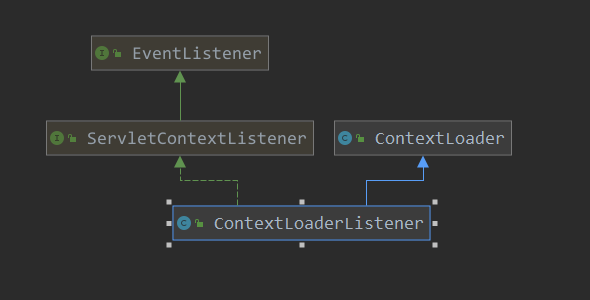

[TOC]

# spring整合springMVC使用的一些配置及初始化

本篇回顾一下在使用spring和springmvc时，需要做的配置都有哪些？

首先是web.xml的配置:

```xml
<!-- spring 容器的配置文件,其中一般写入了service dao的bean,事务 aop -->
<context-param>
    <param-name>contextConfigLocation</param-name>
    <param-value>classpath:spring.xml</param-value>
</context-param>
<!-- 配置一个监听器, 会主要分析此类的作用 -->
<listener>
    <listener-class>org.springframework.web.context.ContextLoaderListener</listener-class>
</listener>
<!-- 注册servlet -->
<servlet>
    <servlet-name>dispatcher</servlet-name>
    <servlet-class>org.springframework.web.servlet.DispatcherServlet</servlet-class>
    <init-param>
        <!-- springmvc的配置xml,其中一般配置controller以及和springmvc有关的其他bean -->
        <param-name>contextConfigLocation</param-name>
        <param-value>classpath:spring-mvc.xml</param-value>
    </init-param>
    <load-on-startup>1</load-on-startup>
</servlet>
<!-- dispatcherServlet的映射路径 -->
<servlet-mapping>
    <servlet-name>dispatcher</servlet-name>
    <url-pattern>/</url-pattern>
</servlet-mapping>
```

看到此配置是否很熟悉呢？ 当然我是使用了很久这样的配置，不知大家是否和我有一样的疑惑，注册的那个监听器是干啥的，为什么有设置了一个context-param后，还要给servlet设置一个参数，并且两个参数都是一些spring配置的xml文件？

如果大家没有此疑惑，或者清楚这些原理，那么就可以不用浪费使用看本篇了，本篇的就是要说一些上面的那些配置都是做什么了。

那首先来看一下这个监听器的作用，老规矩，看一下类图：



看到此类是一个tomcat中ServletContextListener的子类，而此类的调用呢，就在tomcat中standardContext的start阶段调用，调用的具体函数回顾一下：

> org.apache.catalina.core.StandardContext#listenerStart

```java
// 省略函数的部分主体  只看关键部分 
public boolean listenerStart() {
		........
        for (int i = 0; i < instances.length; i++) {
            if (!(instances[i] instanceof ServletContextListener))
                continue;
            ServletContextListener listener =
                (ServletContextListener) instances[i];
            try {
                fireContainerEvent("beforeContextInitialized", listener);
                if (noPluggabilityListeners.contains(listener)) {
                    // 在此处会调用监听器中的contextInitialized方法,
                 // 在springMVC和spring的整合中 web.xml中配置的监听器ContextLoaderListener 就在这里调用的
                    // 此监听器 ContextLoaderListener 创建了 XMLWebApplicationContext
                    listener.contextInitialized(tldEvent);
                } else {
                    listener.contextInitialized(event);
                }
                fireContainerEvent("afterContextInitialized", listener);
            } catch (Throwable t) {
			.......
            }
        }
        return ok;
    }
```

接下来，看一下此监听器的处理：

> org.springframework.web.context.ContextLoaderListener#contextInitialized

```java
/**
  * Initialize the root web application context.
*/
@Override
public void contextInitialized(ServletContextEvent event) {
    // 在监听器中创建root容器，也就是其他的业务bean存放
    // 正常情况下,没有controller相关的bean
    initWebApplicationContext(event.getServletContext());
}
```

具体的创建由ContextLoader来进行一些创建，看一下contextLoad的初始化代码

```java
// 默认策略存储在此文件中
private static final String DEFAULT_STRATEGIES_PATH = "ContextLoader.properties";

// 存储默认策略
private static final Properties defaultStrategies;

static {
    try {
        // 加载默认文档  ContextLoader.properties
        ClassPathResource resource = new ClassPathResource(DEFAULT_STRATEGIES_PATH, ContextLoader.class);
        // 把默认文档中的内容加载到  defaultStrategies
        defaultStrategies = PropertiesLoaderUtils.loadProperties(resource);
    }
    catch (IOException ex) {
        throw new IllegalStateException("Could not load 'ContextLoader.properties': " + ex.getMessage());
    }
}
```

ContextLoader.properties，记录了默认要创建的 applicationContext的类型：

```properties
org.springframework.web.context.WebApplicationContext=org.springframework.web.context.support.XmlWebApplicationContext
```

继续看一些此初始化context的操作：

```java
/**
	 * 1. 创建WebApplicationContext
	 * 2. 对容器进行刷新,也就是根据contextConfigLocation进行容器中bean的初始化
	 * 3. 把此容器记录到servletContext
	 */
public WebApplicationContext initWebApplicationContext(ServletContext servletContext) {
    // 先从servletContext获取一个root applicationContext,如果已经存在,则报错
    if (servletContext.getAttribute(WebApplicationContext.ROOT_WEB_APPLICATION_CONTEXT_ATTRIBUTE) != null) {
        throw new IllegalStateException(
            "Cannot initialize context because there is already a root application context present - " +"check whether you have multiple ContextLoader* definitions in your web.xml!");
    }

    servletContext.log("Initializing Spring root WebApplicationContext");
    Log logger = LogFactory.getLog(ContextLoader.class);
    if (logger.isInfoEnabled()) {
        logger.info("Root WebApplicationContext: initialization started");
    }
    // 记录开始时间
    long startTime = System.currentTimeMillis();

    try {
        // Store context in local instance variable, to guarantee that
        // it is available on ServletContext shutdown.
        if (this.context == null) {
            //  创建root context
            // 默认创建XmlWebApplicationContext
            this.context = createWebApplicationContext(servletContext);
        }
        if (this.context instanceof ConfigurableWebApplicationContext) {
            ConfigurableWebApplicationContext cwac = (ConfigurableWebApplicationContext) this.context;
            if (!cwac.isActive()) {
                // The context has not yet been refreshed -> provide services such as
                // setting the parent context, setting the application context id, etc
                if (cwac.getParent() == null) {
                    // The context instance was injected without an explicit parent ->
                    // determine parent for root web application context, if any.
                    // 设置父容器
                    // 第一次创建时,父容器为null
                    ApplicationContext parent = loadParentContext(servletContext);
                    cwac.setParent(parent);
                }
                // 对ApplicationContext进行配置
                // 1. wac.setServletContext(sc) 记录此容器对应的servletContext
                // 2. 设置contextConfigLocation
                // 3. wac.refresh()
                configureAndRefreshWebApplicationContext(cwac, servletContext);
            }
        }
        // 把容器记录到servletContext
        servletContext.setAttribute(WebApplicationContext.ROOT_WEB_APPLICATION_CONTEXT_ATTRIBUTE, this.context);

        ClassLoader ccl = Thread.currentThread().getContextClassLoader();
        if (ccl == ContextLoader.class.getClassLoader()) {
            currentContext = this.context;
        }
        else if (ccl != null) {
            currentContextPerThread.put(ccl, this.context);
        }

        if (logger.isInfoEnabled()) {
            long elapsedTime = System.currentTimeMillis() - startTime;
            logger.info("Root WebApplicationContext initialized in " + elapsedTime + " ms");
        }

        return this.context;
    }
    catch (RuntimeException | Error ex) {
        logger.error("Context initialization failed", ex);
      servletContext.setAttribute(WebApplicationContext.ROOT_WEB_APPLICATION_CONTEXT_ATTRIBUTE, ex);
        throw ex;
    }
}
```

> org.springframework.web.context.ContextLoader#createWebApplicationContext

```java
// 创建 webApplicationContext
protected WebApplicationContext createWebApplicationContext(ServletContext sc) {
    // 根据是否进行过配置,配置过则使用配置的
    // 没有配置的话,则使用ContextLoader.properties来进行配置,默认使用XmlWebApplicationContext
    Class<?> contextClass = determineContextClass(sc);
    if (!ConfigurableWebApplicationContext.class.isAssignableFrom(contextClass)) {
        throw new ApplicationContextException("Custom context class [" + contextClass.getName() +
        "] is not of type [" + ConfigurableWebApplicationContext.class.getName() + "]");
    }
    // 反射进行bean的创建
    return (ConfigurableWebApplicationContext) BeanUtils.instantiateClass(contextClass);
}
```

决定来创建哪一个webApplicationContext：

> org.springframework.web.context.ContextLoader#determineContextClass

```java
// 根据是否在web.xml中对contextClass进行了配置
// 如果没有开发过的话,就默认使用XmlWebApplicationContext此类
protected Class<?> determineContextClass(ServletContext servletContext) {
    // 查看servletContext中是否制定的context的类型
    // 如果contextClass指定了类,则使用指定的class
    String contextClassName = servletContext.getInitParameter(CONTEXT_CLASS_PARAM);
    if (contextClassName != null) {
        try {
            return ClassUtils.forName(contextClassName, ClassUtils.getDefaultClassLoader());
        }
        catch (ClassNotFoundException ex) {
            throw new ApplicationContextException(
                "Failed to load custom context class [" + contextClassName + "]", ex);
        }
    }
    else {
        // 如果没有指定,则使用ContextLoader.properties中指定的context,为XmlWebApplicationContext
        contextClassName = defaultStrategies.getProperty(WebApplicationContext.class.getName());
        try {
            return ClassUtils.forName(contextClassName, ContextLoader.class.getClassLoader());
        }
        catch (ClassNotFoundException ex) {
            throw new ApplicationContextException(
                "Failed to load default context class [" + contextClassName + "]", ex);
        }
    }
}
```

如果contextClass指定了类,则使用指定的class，否则就加载默认策略的class，默认策略由上面可知是XmlWebApplicationContext。当此创建完了applicationContext后，后面开始指定其父容器，此时的父容器应该是null，下面继续对此applicationContext进行配置：

> org.springframework.web.context.ContextLoader#configureAndRefreshWebApplicationContext

```java
// 对创建的applicationContext进行配置, 并刷新
protected void configureAndRefreshWebApplicationContext(ConfigurableWebApplicationContext wac, ServletContext sc) {
    if (ObjectUtils.identityToString(wac).equals(wac.getId())) {
        // The application context id is still set to its original default value
        // -> assign a more useful id based on available information
        String idParam = sc.getInitParameter(CONTEXT_ID_PARAM);
        if (idParam != null) {
            wac.setId(idParam);
        }
        else {
            // Generate default id...
            wac.setId(ConfigurableWebApplicationContext.APPLICATION_CONTEXT_ID_PREFIX +
                      ObjectUtils.getDisplayString(sc.getContextPath()));
        }
    }
    // 把servletContext 记录到 applicationContext中
    wac.setServletContext(sc);
    // 获取父容器的配置文件路径,contextConfigLocation 属性的值
    String configLocationParam = sc.getInitParameter(CONFIG_LOCATION_PARAM);
    if (configLocationParam != null) {
        // 记录配置文件路径
        wac.setConfigLocation(configLocationParam);
    }

    // The wac environment's #initPropertySources will be called in any case when the context
    // is refreshed; do it eagerly here to ensure servlet property sources are in place for
    // use in any post-processing or initialization that occurs below prior to #refresh
    // 配置  servletContextInitParams  servletConfigInitParams  的值到环境变量中
    ConfigurableEnvironment env = wac.getEnvironment();
    if (env instanceof ConfigurableWebEnvironment) {
        ((ConfigurableWebEnvironment) env).initPropertySources(sc, null);
    }
    // 执行ApplicationContextInitializer,进行一些初始化动作
    // 是由这些 globalInitializerClasses contextInitializerClasses 配置项中指定的初始化类
    customizeContext(sc, wac);
    // 刷新容器
    wac.refresh();
}
```


