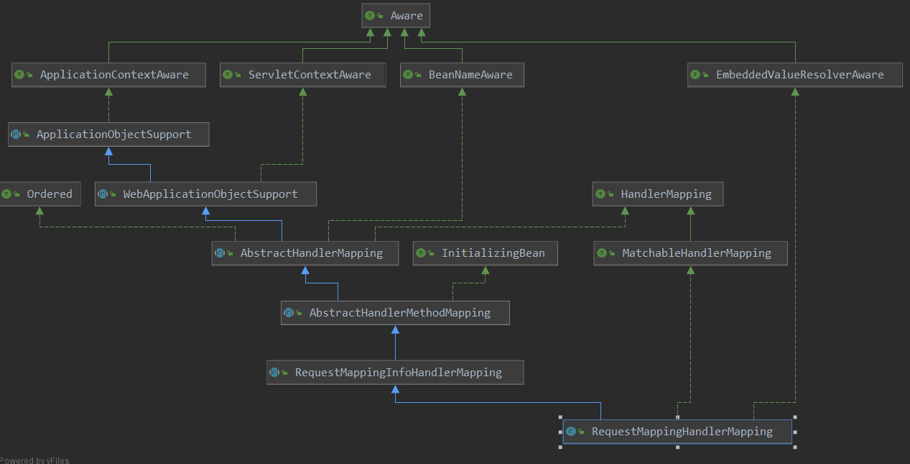

[TOC]

# RequestMappingHandlerMapping的初始化

上篇说道对于HandlerMapping的初始化使用到了默认策略中的bean，那么本篇说一个其中一个beanRequestMappingHandlerMapping的初始化。

先看一下其类图：



看到其有很多的Aware接口，而且是InitlalizingBean的子类，也就是说当此类RequestMappingHandlerMapping属性注入，且开始初始化时，会进行一些额外的操作，那就直接看一下此RequestMappingHandlerMapping的Initializing的动作。

> org.springframework.web.servlet.mvc.method.annotation.RequestMappingHandlerMapping#afterPropertiesSet

```java
// 此处先进行一些配置类信息的记录,之后就解析器  requestmapping的映射信息	
@Override
public void afterPropertiesSet() {
    this.config = new RequestMappingInfo.BuilderConfiguration();
    this.config.setUrlPathHelper(getUrlPathHelper());
    this.config.setPathMatcher(getPathMatcher());
    this.config.setSuffixPatternMatch(this.useSuffixPatternMatch);
    this.config.setTrailingSlashMatch(this.useTrailingSlashMatch);
    this.config.setRegisteredSuffixPatternMatch(this.useRegisteredSuffixPatternMatch);
    this.config.setContentNegotiationManager(getContentNegotiationManager());
    super.afterPropertiesSet();
}
org.springframework.web.servlet.mvc.method.annotation.RequestMappingHandlerMapping
private boolean useSuffixPatternMatch = true;
private boolean useRegisteredSuffixPatternMatch = false;
private boolean useTrailingSlashMatch = true;
private ContentNegotiationManager contentNegotiationManager = new ContentNegotiationManager();
public ContentNegotiationManager getContentNegotiationManager() {
    return this.contentNegotiationManager;
}


org.springframework.web.servlet.handler.AbstractHandlerMapping : 
private UrlPathHelper urlPathHelper = new UrlPathHelper();
private PathMatcher pathMatcher = new AntPathMatcher();
private final List<Object> interceptors = new ArrayList<>();
private final List<HandlerInterceptor> adaptedInterceptors = new ArrayList<>();
private CorsConfigurationSource corsConfigurationSource = new UrlBasedCorsConfigurationSource();
private CorsProcessor corsProcessor = new DefaultCorsProcessor();
private int order = Ordered.LOWEST_PRECEDENCE;  // default: same as non-Ordered


public UrlPathHelper getUrlPathHelper() {
    return this.urlPathHelper;
}

public PathMatcher getPathMatcher() {
    return this.pathMatcher;
}
```

这里可以看出只是对很多信息的记录，以及创建了一个BuilderConfiguration，那么看一下父类的一些操作：

```java
super.afterPropertiesSet();
```

> org.springframework.web.servlet.handler.AbstractHandlerMethodMapping#afterPropertiesSet

```java
@Override
public void afterPropertiesSet() {
    // 初始化容器中的handler,也就是@Controller  @RequestMapping注册的bean
    initHandlerMethods();
}
```

> org.springframework.web.servlet.handler.AbstractHandlerMethodMapping#initHandlerMethods

```java
// 解析容器中的 映射信息
protected void initHandlerMethods() {
    // getCandidateBeanNames 获取容器中所有的bean的name
    for (String beanName : getCandidateBeanNames()) {
        if (!beanName.startsWith(SCOPED_TARGET_NAME_PREFIX)) {
            // 对候选的bean进行处理
            // todo 重要 重要 此函数处理完后,就会把 handler 和mapping的关系建立完毕
            processCandidateBean(beanName);
        }
    }
    handlerMethodsInitialized(getHandlerMethods());
}
```

此就是对容器中的映射信息的解析，下面主要就是对此函数的一个分析，分为几部：

1. 获取容器中的候选bean
2. 对候选bean进行处理
3. handlerMethod的初始化

下面就按照这三个步骤去分析。

## 第一步： 获取容器中的候选bean

> org.springframework.web.servlet.handler.AbstractHandlerMethodMapping#getCandidateBeanNames

```java
private boolean detectHandlerMethodsInAncestorContexts = false;

protected String[] getCandidateBeanNames() {
    return (this.detectHandlerMethodsInAncestorContexts ?
            BeanFactoryUtils.beanNamesForTypeIncludingAncestors(obtainApplicationContext(), Object.class) :obtainApplicationContext().getBeanNamesForType(Object.class));
}
```

以此看来，会获取容器中所有 Object类型的bean，换句话说会获取容器中所有的bean。


## 第二步：对候选bean的处理

> org.springframework.web.servlet.handler.AbstractHandlerMethodMapping#processCandidateBean

```java
// 对容器中候选bean的处理, 获取 映射path 到method的对应关系
protected void processCandidateBean(String beanName) {
    Class<?> beanType = null;
    try {
        // beanName对应的class类型
        beanType = obtainApplicationContext().getType(beanName);
    }
    catch (Throwable ex) {
        // An unresolvable bean type, probably from a lazy bean - let's ignore it.
        if (logger.isTraceEnabled()) {
            logger.trace("Could not resolve type for bean '" + beanName + "'", ex);
        }
    }
    // isHandler 是否是handler,也就是是否有controller  requestmapping 注解
    if (beanType != null && isHandler(beanType)) {
        // 如果此bean是handler,那么处理此bean对应的method
        detectHandlerMethods(beanName);
    }
}
```

判断此beanType是否是handler：

> org.springframework.web.servlet.mvc.method.annotation.RequestMappingHandlerMapping#isHandler

```java
// 如何判断是否是handler: 看bean是否有controlle或者requestmaping 注解
@Override
protected boolean isHandler(Class<?> beanType) {
    return (AnnotatedElementUtils.hasAnnotation(beanType, Controller.class) ||
            AnnotatedElementUtils.hasAnnotation(beanType, RequestMapping.class));
}
```

可以看到就是查看是否存在 Controller 和 RequestMapping的注解信息。如果是handler呢，那么就去此handler中detect其中具体的映射关系：

> org.springframework.web.servlet.handler.AbstractHandlerMethodMapping#detectHandlerMethods

```java
	// 从一个handler类中获取具体的处理method
	protected void detectHandlerMethods(Object handler) {
		// 如果handler参数给出的只是一个字符串,则从容器中获取此字符串对应的bean的类型
		Class<?> handlerType = (handler instanceof String ?
				obtainApplicationContext().getType((String) handler) : handler.getClass());
		// 如果获取到了类型
		if (handlerType != null) {
			// 获取到 class
            // 如果此类是cglib代理,则获取此代理类 对应的 被代理类
			Class<?> userType = ClassUtils.getUserClass(handlerType);
			// 查找合适的方法
			Map<Method, T> methods = MethodIntrospector.selectMethods(userType,
					(MethodIntrospector.MetadataLookup<T>) method -> {
						try {
							// 此是 根据注解来生成映射的方法
							// 1. 解析method 和 class上的注解信息,如果都有则进行合并
							// 		1) 合并是很多属性合并,如 name合并, 匹配路径的合并
							return getMappingForMethod(method, userType);
						}
						catch (Throwable ex) {
							throw new IllegalStateException("Invalid mapping on handler class [" +
									userType.getName() + "]: " + method, ex);
						}
					});
			if (logger.isTraceEnabled()) {
				logger.trace(formatMappings(userType, methods));
			}
			// 遍历所有方法,把 handler和mapping的映射关系保存起来
			methods.forEach((method, mapping) -> {
				// 选择可调用的方法
				Method invocableMethod = AopUtils.selectInvocableMethod(method, userType);
				// 把找到的方法 注册起来
				registerHandlerMethod(handler, invocableMethod, mapping);
			});
		}
	}
```

此方法虽然看起来不是很长，但是工作量还是很大的：

1. 查找此 userType中的所有的 handlerMethod
2. 遍历查找到的所有的 handlerMethod，查找可调用的方法，并把其信息注册起来

查找handerMethod的方法：

> org.springframework.core.MethodIntrospector#selectMethods(java.lang.Class<?>, org.springframework.core.MethodIntrospector.MetadataLookup<T>)

```java
// 从 targetType 中查找合适的方法
public static <T> Map<Method, T> selectMethods(Class<?> targetType, final MetadataLookup<T> metadataLookup) {
    final Map<Method, T> methodMap = new LinkedHashMap<>();
    Set<Class<?>> handlerTypes = new LinkedHashSet<>();
    Class<?> specificHandlerType = null;
    // 如果不是 JDK代理类
    if (!Proxy.isProxyClass(targetType)) {
        // 如果是cglib 代理类
        // ClassUtils.getUserClass 此主要是获取此cglib 代理的类
        specificHandlerType = ClassUtils.getUserClass(targetType);
        handlerTypes.add(specificHandlerType);
    }
    // 找到所有的接口
    handlerTypes.addAll(ClassUtils.getAllInterfacesForClassAsSet(targetType));
    // 遍历所有的类型, 获取方法
    // 可见查找时,会把接口的方法也不会遗漏
    for (Class<?> currentHandlerType : handlerTypes) {
        final Class<?> targetClass = (specificHandlerType != null ? specificHandlerType : currentHandlerType);
        // doWithMethods 会遍历 currentHandlerType 中所有声明的 方法
        ReflectionUtils.doWithMethods(currentHandlerType, method -> {
            // ClassUtils.getMostSpecificMethod 查找特定的方法; 如:方法在接口声明,找到的是实现类中的方法
            Method specificMethod = ClassUtils.getMostSpecificMethod(method, targetClass);
            // 这里就是调用特定的方法来 进行进一步的 操作
            // 此时此操作就是  getMappingForMethod
            T result = metadataLookup.inspect(specificMethod);
            if (result != null) {
                Method bridgedMethod = BridgeMethodResolver.findBridgedMethod(specificMethod);
              if (bridgedMethod == specificMethod || metadataLookup.inspect(bridgedMethod) == null) {
                    methodMap.put(specificMethod, result);
                }
            }
        }, ReflectionUtils.USER_DECLARED_METHODS);
    }
    return methodMap;
}
```

小结一下此处的操作：

1. 如果是代理类，则先获取代理类的 原来的类
2. 获取此类所对应的接口的所有的信息
3. 遍历所有的类，在遍历其中的所有方法，来进行处理

> org.springframework.util.ReflectionUtils#doWithMethods(java.lang.Class<?>, org.springframework.util.ReflectionUtils.MethodCallback, org.springframework.util.ReflectionUtils.MethodFilter)

```java
public static void doWithMethods(Class<?> clazz, MethodCallback mc, @Nullable MethodFilter mf) {
    // Keep backing up the inheritance hierarchy.
    // 获取类中 所有的声明的方法
    Method[] methods = getDeclaredMethods(clazz);
    // 遍历所有的方法, 调用参数中的函数,来进行进一步的操作
    for (Method method : methods) {
        if (mf != null && !mf.matches(method)) {
            continue;
        }
        try {
            mc.doWith(method);
        }
        catch (IllegalAccessException ex) {
  throw new IllegalStateException("Not allowed to access method '" + method.getName() + "': " + ex);
        }
    }
    if (clazz.getSuperclass() != null) {
        doWithMethods(clazz.getSuperclass(), mc, mf);
    }
    else if (clazz.isInterface()) {
        for (Class<?> superIfc : clazz.getInterfaces()) {
            doWithMethods(superIfc, mc, mf);
        }
    }
}
```

最终还是调用getMappingForMethod来进行操作，直接看一下此方法：

> org.springframework.web.servlet.mvc.method.annotation.RequestMappingHandlerMapping#getMappingForMethod

```java
// 查找有映射的method
@Override
@Nullable
protected RequestMappingInfo getMappingForMethod(Method method, Class<?> handlerType) {
    // 如果方法或者类上有requestMapping注解，那么就包装为RequestMappingInfo
    // 先查找方法上的  注解信息
    RequestMappingInfo info = createRequestMappingInfo(method);
    if (info != null) {
        // 在查找类上面的注解信心
        RequestMappingInfo typeInfo = createRequestMappingInfo(handlerType);
        // 方法 和 类上都有注解信息的话, 则进行合并
        if (typeInfo != null) {
            // 此合并,如:
            // 1. 名字合并 this.name + # + other.name
            // 2. 匹配路径的合并
            info = typeInfo.combine(info);
        }
        String prefix = getPathPrefix(handlerType);
        if (prefix != null) {
            info = RequestMappingInfo.paths(prefix).build().combine(info);
        }
    }
    return info;
}
```

此方法的结构更是清晰哦，先创建方法的RequestMappingInfo，在获取类的RequestMappingInfo，之后对这两个info进行合并的操作。

看一下对方法的创建操作：

> org.springframework.web.servlet.mvc.method.annotation.RequestMappingHandlerMapping#createRequestMappingInfo(java.lang.reflect.AnnotatedElement)

```java
// 根据方法上注解的信息,创建 RequestMappingInfo
// RequestMappingInfo 中保存了方法的路径,参数,请求方法,consumer,producer等信息
@Nullable
private RequestMappingInfo createRequestMappingInfo(AnnotatedElement element) {
    // 从元素上查找 RequestMapping 注解
    // 分析类 或者 方法上的注解 以及注解上的属性信息
    // 1. 先分析方法本身的注解
    // 2. 分析方法所在类 的接口的信息
    // 3. 分析方法的父类的注解信息
    // 4. 分析方法所在的类的父类的接口的注解信息
    // 分析类时 :
    // 1. 分析类的注解信息
    // 2. 分析类的父类的注解信息
    // Exhaustive retrieval of merged annotation attributes...
    RequestMapping requestMapping = AnnotatedElementUtils.findMergedAnnotation(element, RequestMapping.class);
    RequestCondition<?> condition = (element instanceof Class ?
                                     getCustomTypeCondition((Class<?>) element) : getCustomMethodCondition((Method) element));
    // 如果存在注解RequestMapping,则创建 ReqeustMappingInfo
    return (requestMapping != null ? createRequestMappingInfo(requestMapping, condition) : null);
}
```

具体的分析方法，这里就不展开说了，感兴趣可以进入看一下，使用到了递归。

具体的创建：

```java
protected RequestMappingInfo createRequestMappingInfo(
    RequestMapping requestMapping, @Nullable RequestCondition<?> customCondition) {
    RequestMappingInfo.Builder builder = RequestMappingInfo
        .paths(resolveEmbeddedValuesInPatterns(requestMapping.path()))
        .methods(requestMapping.method())
        .params(requestMapping.params())
        .headers(requestMapping.headers())
        .consumes(requestMapping.consumes())
        .produces(requestMapping.produces())
        .mappingName(requestMapping.name());
    if (customCondition != null) {
        builder.customCondition(customCondition);
    }
    return builder.options(this.config).build();
}


// 创建 requestMappingInfo
@Override
public RequestMappingInfo build() {
    ContentNegotiationManager manager = this.options.getContentNegotiationManager();

    PatternsRequestCondition patternsCondition = new PatternsRequestCondition(
        this.paths, this.options.getUrlPathHelper(), this.options.getPathMatcher(),
        this.options.useSuffixPatternMatch(), this.options.useTrailingSlashMatch(),
        this.options.getFileExtensions());
	// 这里封住了很多的 condition类,
    return new RequestMappingInfo(this.mappingName, patternsCondition,
                                  new RequestMethodsRequestCondition(this.methods),
                                  new ParamsRequestCondition(this.params),
                                  new HeadersRequestCondition(this.headers),
                                  new ConsumesRequestCondition(this.consumes, this.headers),
                                  new ProducesRequestCondition(this.produces, this.headers, manager),
                                  this.customCondition);
}
```

创建动作，主要就是对注解中的信息记性保存的操作。

创建完了下面就是注册操作了:

```java
// 遍历所有方法,把 handler和mapping的映射关系保存起来
methods.forEach((method, mapping) -> {
    // 选择可调用的方法
    Method invocableMethod = AopUtils.selectInvocableMethod(method, userType);
    // 把找到的方法 注册起来
    registerHandlerMethod(handler, invocableMethod, mapping);
});
```

> org.springframework.web.servlet.handler.AbstractHandlerMethodMapping#registerHandlerMethod

```java
// 存储 path -> method的映射,以及 目标类
// 这样方法通过反射就可以进行调用了
private final MappingRegistry mappingRegistry = new MappingRegistry();

// 注册 handleMethod到容器中
protected void registerHandlerMethod(Object handler, Method method, T mapping) {
    this.mappingRegistry.register(mapping, handler, method);
}
```

> org.springframework.web.servlet.handler.AbstractHandlerMethodMapping.MappingRegistry#register

```java
// 映射方法的注册
public void register(T mapping, Object handler, Method method) {
    this.readWriteLock.writeLock().lock();
    try {
        // 根据 handler 以及 method,创建 handlerMethod
        HandlerMethod handlerMethod = createHandlerMethod(handler, method);
        // 查看此是否是唯一的,如果不是唯一的,报错
        assertUniqueMethodMapping(handlerMethod, mapping);
        // 记录 映射path-> handerMethod
        this.mappingLookup.put(mapping, handlerMethod);
        // 记录直接映射
        List<String> directUrls = getDirectUrls(mapping);
        // 记录 directurl 到 mapping的映射关系
        for (String url : directUrls) {
            this.urlLookup.add(url, mapping);
        }

        String name = null;
        if (getNamingStrategy() != null) {
            // 1. 如果指定了名字，则使用指定的名字
            // 2. 此处的生成名字就是 大写的 方法所在类 simpleName + # + method.name
            name = getNamingStrategy().getName(handlerMethod, mapping);
            // 记录此 name到 handlerMethod的 映射
            addMappingName(name, handlerMethod);
        }
        // 对跨域的配置
        CorsConfiguration corsConfig = initCorsConfiguration(handler, method, mapping);
        if (corsConfig != null) {
            this.corsLookup.put(handlerMethod, corsConfig);
        }
        // 再次记录一个 mapping到 MappingRegistration中的映射关系
        this.registry.put(mapping, new MappingRegistration<>(mapping, handlerMethod, directUrls, name));
    }
    finally {
        this.readWriteLock.writeLock().unlock();
    }
}
```

此操作工作也是干货不少啊：

1. 创建 handlerMethod
2. 查看此 handlerMethod 是否是唯一的
3. 记录  mapping --> handlerMethod的映射关系
4. 获取 directUrl， 并记录 directUrl--> mapping 的映射关系
5. 根据策略生成名字
   1.  如果指定了名字，则使用指定的名字
   2.  此处的生成名字就是 大写的 方法所在类 simpleName + # + method.name
6. 记录 name --> handlerMethod 的映射关系
7. 跨域的一些配置，并记录  handlerMethod 对应的跨域信息
8. 最后记录  mapping -->MappingRegistration 的关系

这里咱们看一下1，7两个步骤，

> org.springframework.web.servlet.handler.AbstractHandlerMethodMapping#createHandlerMethod

```java
	// 创建  HandlerMethod
	protected HandlerMethod createHandlerMethod(Object handler, Method method) {
		HandlerMethod handlerMethod;
		// 如果handler 还是字符串,则使用此字符串从容器中 获取此 字符串对应的bean
		if (handler instanceof String) {
			String beanName = (String) handler;
			handlerMethod = new HandlerMethod(beanName,
					obtainApplicationContext().getAutowireCapableBeanFactory(), method);
		}
		else {
			// 如果handler 已经是实例,则直接创建HandlerMethod
			// 此 HandlerMethod中已经保存了 被解析方法的 参数类型
			handlerMethod = new HandlerMethod(handler, method);
		}
		return handlerMethod;
	}
```

```java
/**
	 * Create an instance from a bean instance and a method.
	 */
public HandlerMethod(Object bean, Method method) {
    Assert.notNull(bean, "Bean is required");
    Assert.notNull(method, "Method is required");
    this.bean = bean;
    this.beanFactory = null;
    this.beanType = ClassUtils.getUserClass(bean);
    this.method = method;
    this.bridgedMethod = BridgeMethodResolver.findBridgedMethod(method);
    // 存储方法的 方法参数
    this.parameters = initMethodParameters();
    evaluateResponseStatus();
}
```

> org.springframework.web.servlet.mvc.method.annotation.RequestMappingHandlerMapping#initCorsConfiguration

```java
// 对映射关系中的跨域的配置
@Override
protected CorsConfiguration initCorsConfiguration(Object handler, Method method, RequestMappingInfo mappingInfo) {
    // 先创建一个 HandlerMthod
    HandlerMethod handlerMethod = createHandlerMethod(handler, method);
    Class<?> beanType = handlerMethod.getBeanType();
    // 获取 类 以及 方法上的 CrossOrigin 注解的信息
    CrossOrigin typeAnnotation = AnnotatedElementUtils.findMergedAnnotation(beanType, CrossOrigin.class);
    CrossOrigin methodAnnotation = AnnotatedElementUtils.findMergedAnnotation(method, CrossOrigin.class);

    if (typeAnnotation == null && methodAnnotation == null) {
        return null;
    }
    // 创建一个 跨域的配置
    CorsConfiguration config = new CorsConfiguration();
    // 更新跨域的配置 信息
    updateCorsConfig(config, typeAnnotation);
    updateCorsConfig(config, methodAnnotation);

    if (CollectionUtils.isEmpty(config.getAllowedMethods())) {
        for (RequestMethod allowedMethod : mappingInfo.getMethodsCondition().getMethods()) {
            config.addAllowedMethod(allowedMethod.name());
        }
    }
    // 对跨域设置默认值
    return config.applyPermitDefaultValues();
}
```

可以看到跨域，是对方法和类上的CrossOrigin 注解信息进行解析，并记录到CorsConfiguration中。

> org.springframework.web.servlet.mvc.method.annotation.RequestMappingHandlerMapping#updateCorsConfig

```java
// 更新 跨域的配置信息
private void updateCorsConfig(CorsConfiguration config, @Nullable CrossOrigin annotation) {
    if (annotation == null) {
        return;
    }
    // 允许的 origin
    for (String origin : annotation.origins()) {
        config.addAllowedOrigin(resolveCorsAnnotationValue(origin));
    }
    // 允许的 method
    for (RequestMethod method : annotation.methods()) {
        config.addAllowedMethod(method.name());
    }
    // 允许的 header
    for (String header : annotation.allowedHeaders()) {
        config.addAllowedHeader(resolveCorsAnnotationValue(header));
    }
    // 允许的 expose header
    for (String header : annotation.exposedHeaders()) {
        config.addExposedHeader(resolveCorsAnnotationValue(header));
    }
    // 是否允许  allowCredentials
    String allowCredentials = resolveCorsAnnotationValue(annotation.allowCredentials());
    if ("true".equalsIgnoreCase(allowCredentials)) {
        config.setAllowCredentials(true);
    }
    else if ("false".equalsIgnoreCase(allowCredentials)) {
        config.setAllowCredentials(false);
    }
    else if (!allowCredentials.isEmpty()) {
        throw new IllegalStateException("@CrossOrigin's allowCredentials value must be \"true\", \"false\", " + "or an empty string (\"\"): current value is [" + allowCredentials + "]");
    }

    if (annotation.maxAge() >= 0 && config.getMaxAge() == null) {
        config.setMaxAge(annotation.maxAge());
    }
}
```

> org.springframework.web.cors.CorsConfiguration#applyPermitDefaultValues

```java
public CorsConfiguration applyPermitDefaultValues() {
    if (this.allowedOrigins == null) {
        this.allowedOrigins = DEFAULT_PERMIT_ALL;
    }
    if (this.allowedMethods == null) {
        this.allowedMethods = DEFAULT_PERMIT_METHODS;
        this.resolvedMethods = DEFAULT_PERMIT_METHODS
            .stream().map(HttpMethod::resolve).collect(Collectors.toList());
    }
    if (this.allowedHeaders == null) {
        this.allowedHeaders = DEFAULT_PERMIT_ALL;
    }
    if (this.maxAge == null) {
        this.maxAge = 1800L;
    }
    return this;
}
```

到此对候选bean的处理就结束了，主要工作还是：

1. 如果是handler，则查找此handler中的method信息
2. 解析method，handler的映射信息，进行合并，并记录起来
3. 解析方法 或者 handler上的跨域信息，同样记录下来


## handlerMethod的初始化

```java
protected void handlerMethodsInitialized(Map<T, HandlerMethod> handlerMethods) {
    // Total includes detected mappings + explicit registrations via registerMapping
    int total = handlerMethods.size();
    if ((logger.isTraceEnabled() && total == 0) || (logger.isDebugEnabled() && total > 0) ) {
        logger.debug(total + " mappings in " + formatMappingName());
    }
}
```

此方法内容就不多说了。

由此可见RequestMappingHandlerMapping 初始化中解析了容器中所有的 通过 RequestMapping的映射关系。


