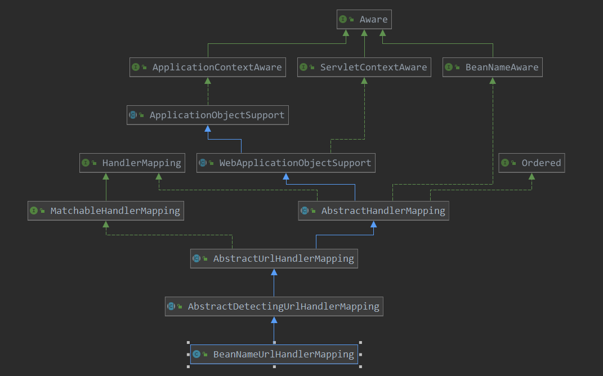

[TOC]

# BeanNameUrlHandlerMapping 初始化

本篇看一下HandlerMapping的另一个默认类BeanNameUrlHandlerMapping，了解一下其的初始化。

看一下其类图：



可以看到其为ApplicationContextAware的子类，也就是容器会为其注入applicationContext实例，此处以此为入口看一下其注入的动作:

> org.springframework.context.support.ApplicationObjectSupport#setApplicationContext

```java
// 当初始化此类时,容器向其注入 applicationContext 的实例
@Override
public final void setApplicationContext(@Nullable ApplicationContext context) throws BeansException {
    if (context == null && !isContextRequired()) {
        // Reset internal context state.
        this.applicationContext = null;
        this.messageSourceAccessor = null;
    }
    else if (this.applicationContext == null) {
        // Initialize with passed-in context.
        // 如果注入的不是MessageSourceAccessor, 则报错
        if (!requiredContextClass().isInstance(context)) {
            throw new ApplicationContextException(
                "Invalid application context: needs to be of type [" + requiredContextClass().getName() + "]");
        }
        // 真正的注入动作
        this.applicationContext = context;
        // 并创建了 MessageSourceAccessor
        this.messageSourceAccessor = new MessageSourceAccessor(context);
        // 并进行进一步的初始化操作
        initApplicationContext(context);
    }
    else {
        // Ignore reinitialization if same context passed in.
        if (this.applicationContext != context) {
            throw new ApplicationContextException(
                "Cannot reinitialize with different application context: current one is [" +
                this.applicationContext + "], passed-in one is [" + context + "]");
        }
    }
}
```

```java
// 进行初始化
protected void initApplicationContext(ApplicationContext context) throws BeansException {
    initApplicationContext();
}

// 函数为空,留作子类扩展
protected void initApplicationContext() throws BeansException {
}
```

这里看一下具体的子类的实现:

> org.springframework.web.servlet.handler.AbstractDetectingUrlHandlerMapping#initApplicationContext

```java
// 初始化 applicationContext,注册一个handler到 容器中
@Override
public void initApplicationContext() throws ApplicationContextException {
    super.initApplicationContext();
    detectHandlers();
}
```

这里就两个步骤，一个是调用父类的初始化，一个是探测容器中的handler。

先看一下父类的操作：

> org.springframework.web.servlet.handler.AbstractHandlerMapping#initApplicationContext

```java
@Override
protected void initApplicationContext() throws BeansException {
    extendInterceptors(this.interceptors);
    // 去容器中探测 拦截器,并添加到adaptedInterceptors 中
    detectMappedInterceptors(this.adaptedInterceptors);
    // 初始化拦截器
    initInterceptors();
}
```

```java
// 到容器中获取类型为 MappedInterceptor类型的bean,并添加到 mappedInterceptors 中
protected void detectMappedInterceptors(List<HandlerInterceptor> mappedInterceptors) {
    mappedInterceptors.addAll(
        BeanFactoryUtils.beansOfTypeIncludingAncestors(
            obtainApplicationContext(), MappedInterceptor.class, true, false).values());
}
```

```java
protected void initInterceptors() {
    if (!this.interceptors.isEmpty()) {
        for (int i = 0; i < this.interceptors.size(); i++) {
            Object interceptor = this.interceptors.get(i);
            if (interceptor == null) {
        throw new IllegalArgumentException("Entry number " + i + " in interceptors array is null");
            }
            // 把interceptors 中的拦截器添加到 adaptedInterceptors
            this.adaptedInterceptors.add(adaptInterceptor(interceptor));
        }
    }
}
```

父类主要是对拦截器的一些初始化，到此就完成了。

下面继续看去容器中探测handler的操作：

> org.springframework.web.servlet.handler.AbstractDetectingUrlHandlerMapping#detectHandlers

```java
// 从容器中 探测 handler
protected void detectHandlers() throws BeansException {
    // 获取容器
    ApplicationContext applicationContext = obtainApplicationContext();
    // 此获取容器中Object类型的bean, 即获取所有的 bean
    String[] beanNames = (this.detectHandlersInAncestorContexts ?
                          BeanFactoryUtils.beanNamesForTypeIncludingAncestors(applicationContext, Object.class) :applicationContext.getBeanNamesForType(Object.class));

    // Take any bean name that we can determine URLs for.
    // 遍历所有的bean, 对此bean判断有映射的 url
    // 如果有 映射的 url,则进行注册操作
    for (String beanName : beanNames) {
        // 查找此bean的 映射url
        String[] urls = determineUrlsForHandler(beanName);
        if (!ObjectUtils.isEmpty(urls)) {
            // URL paths found: Let's consider it a handler.
            // 如果存在url,则进行注册操作
            registerHandler(urls, beanName);
        }
    }

    if ((logger.isDebugEnabled() && !getHandlerMap().isEmpty()) || logger.isTraceEnabled()) {
        logger.debug("Detected " + getHandlerMap().size() + " mappings in " + formatMappingName());
    }
}
```

> org.springframework.web.servlet.handler.BeanNameUrlHandlerMapping#determineUrlsForHandler

```java
// 判断此bean是否有映射的 url
@Override
protected String[] determineUrlsForHandler(String beanName) {
    List<String> urls = new ArrayList<>();
    // 如果 beanName是以 / 开头的,则添加起来
    if (beanName.startsWith("/")) {
        urls.add(beanName);
    }
    // 获取此beanName对应的别名
    String[] aliases = obtainApplicationContext().getAliases(beanName);
    // 查看别名中是否有 / 开头的名字,有则记录下来
    for (String alias : aliases) {
        if (alias.startsWith("/")) {
            urls.add(alias);
        }
    }
    return StringUtils.toStringArray(urls);
}
```

> org.springframework.web.servlet.handler.AbstractUrlHandlerMapping#registerHandler(java.lang.String[], java.lang.String)

```java
// 注册handler
protected void registerHandler(String[] urlPaths, String beanName) throws BeansException, IllegalStateException {
    Assert.notNull(urlPaths, "URL path array must not be null");
    // 边路所有的url,注册其 映射关系
    for (String urlPath : urlPaths) {
        registerHandler(urlPath, beanName);
    }
}
```

> org.springframework.web.servlet.handler.AbstractUrlHandlerMapping#registerHandler(java.lang.String, java.lang.Object)

```java
protected void registerHandler(String urlPath, Object handler) throws BeansException, IllegalStateException {
    Assert.notNull(urlPath, "URL path must not be null");
    Assert.notNull(handler, "Handler object must not be null");
    Object resolvedHandler = handler;

    // Eagerly resolve handler if referencing singleton via name.
    // 如果handler 是字符串,且  不是懒加载
    // 则实例化此 handler对应的bena实例
    if (!this.lazyInitHandlers && handler instanceof String) {
        String handlerName = (String) handler;
        // 获取容器
        ApplicationContext applicationContext = obtainApplicationContext();
        if (applicationContext.isSingleton(handlerName)) {
            // 实例化bean
            resolvedHandler = applicationContext.getBean(handlerName);
        }
    }
    // 查看此urlPath是否已经注册过
    Object mappedHandler = this.handlerMap.get(urlPath);
    // 如果此  urlPath已经注册过,则报错
    if (mappedHandler != null) {
        if (mappedHandler != resolvedHandler) {
            throw new IllegalStateException(
                "Cannot map " + getHandlerDescription(handler) + " to URL path [" + urlPath +
                "]: There is already " + getHandlerDescription(mappedHandler) + " mapped.");
        }
    }
    else {
        // 如果 urlpath是 /, 则把此handler 注册为 rootHandler
        if (urlPath.equals("/")) {
            if (logger.isTraceEnabled()) {
                logger.trace("Root mapping to " + getHandlerDescription(handler));
            }
            setRootHandler(resolvedHandler);
        }
        // 如果 urlpath 是 /* ,则注册为 defaultHandler
        else if (urlPath.equals("/*")) {
            if (logger.isTraceEnabled()) {
                logger.trace("Default mapping to " + getHandlerDescription(handler));
            }
            setDefaultHandler(resolvedHandler);
        }
        else {
            // 保存 urlpath 和 handler的映射关系
            this.handlerMap.put(urlPath, resolvedHandler);
            if (logger.isTraceEnabled()) {
                logger.trace("Mapped [" + urlPath + "] onto " + getHandlerDescription(handler));
            }
        }
    }
}
```

可以看到此处注册映射时，主要是根据beanName来操作的，beanName 必须是以 / 为开头的才能作为handler，且名字为 / 就是rootHandler，  名字为 /*  就是defaultHandler。

到此beanNameUrlHandler初始化也就完成了。


