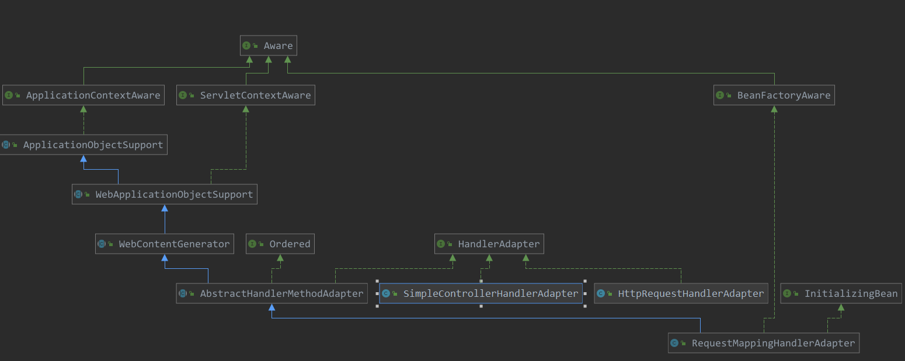

[TOC]

# RequestMappingHandlerAdapter 的初始化

HandlerAdapter在没有进行定制化操作时，会使用默认的三个类，那么在这里就分析一个其中的一个RequestMappingHandlerAdapter 的初始化。

先看一下其类图：



看一下其构造器：

```java
// 构造器
public RequestMappingHandlerAdapter() {
    StringHttpMessageConverter stringHttpMessageConverter = new StringHttpMessageConverter();
    stringHttpMessageConverter.setWriteAcceptCharset(false);  // see SPR-7316

    this.messageConverters = new ArrayList<>(4);
    this.messageConverters.add(new ByteArrayHttpMessageConverter());
    this.messageConverters.add(stringHttpMessageConverter);
    try {
        this.messageConverters.add(new SourceHttpMessageConverter<>());
    }
    catch (Error err) {
        // Ignore when no TransformerFactory implementation is available
    }
    this.messageConverters.add(new AllEncompassingFormHttpMessageConverter());
}
```


可以看到其是 InitializingBean的子类，也就是其会有特定的初始化方法，直接看一下其特定的初始化方法，看其做了什么工作：

> org.springframework.web.servlet.mvc.method.annotation.RequestMappingHandlerAdapter#afterPropertiesSet

```java
@Override
public void afterPropertiesSet() {
    // Do this first, it may add ResponseBody advice beans
    // 初始化 那些 controlerAdvice注解的bean
    initControllerAdviceCache();

    if (this.argumentResolvers == null) {
        // getDefaultArgumentResolvers 注册了各种处理器
        // 如 @RequestBody
        List<HandlerMethodArgumentResolver> resolvers = getDefaultArgumentResolvers();
        this.argumentResolvers = new HandlerMethodArgumentResolverComposite().addResolvers(resolvers);
    }
    if (this.initBinderArgumentResolvers == null) {
        // getDefaultInitBinderArgumentResolvers 各种参数绑定器
        // 如 @Pathvariable
        List<HandlerMethodArgumentResolver> resolvers = getDefaultInitBinderArgumentResolvers();
        this.initBinderArgumentResolvers = new HandlerMethodArgumentResolverComposite().addResolvers(resolvers);
    }
    if (this.returnValueHandlers == null) {
        // getDefaultReturnValueHandlers 参数返回值解析如 @Respnsebody的使用
        List<HandlerMethodReturnValueHandler> handlers = getDefaultReturnValueHandlers();
        this.returnValueHandlers = new HandlerMethodReturnValueHandlerComposite().addHandlers(handlers);
    }
}
```

这里分为4步，都是做一些初始化动作：

1. 初始化那些有 controllerAdvice 注解的bean
2. 初始化 许多 argumentResolvers，也就是参数解析器
3. 初始化许多的 initBinderAruemntResolvers，参数绑定器
4. 初始化许多的 returnValueHandlers，即对返回值的处理

> org.springframework.web.servlet.mvc.method.annotation.RequestMappingHandlerAdapter#initControllerAdviceCache

```java
private void initControllerAdviceCache() {
    if (getApplicationContext() == null) {
        return;
    }
    // 查找有ControllerAdvice注解的bean
    List<ControllerAdviceBean> adviceBeans = ControllerAdviceBean.findAnnotatedBeans(getApplicationContext());
    AnnotationAwareOrderComparator.sort(adviceBeans);

    List<Object> requestResponseBodyAdviceBeans = new ArrayList<>();

    for (ControllerAdviceBean adviceBean : adviceBeans) {
        Class<?> beanType = adviceBean.getBeanType();
        if (beanType == null) {
            throw new IllegalStateException("Unresolvable type for ControllerAdviceBean: " + adviceBean);
        }
        // 查找带有ModelAttribute 的方法
        Set<Method> attrMethods = MethodIntrospector.selectMethods(beanType, MODEL_ATTRIBUTE_METHODS);
        if (!attrMethods.isEmpty()) {
            this.modelAttributeAdviceCache.put(adviceBean, attrMethods);
        }
        // 查找带有InitBinder 注解的方法
        Set<Method> binderMethods = MethodIntrospector.selectMethods(beanType, INIT_BINDER_METHODS);
        if (!binderMethods.isEmpty()) {
            this.initBinderAdviceCache.put(adviceBean, binderMethods);
        }
        // 查看此bean 是否是  RequestBodyAdvice
        if (RequestBodyAdvice.class.isAssignableFrom(beanType)) {
            requestResponseBodyAdviceBeans.add(adviceBean);
        }
        // 查看此bean 是否是 ResponseBodyAdvice
        if (ResponseBodyAdvice.class.isAssignableFrom(beanType)) {
            requestResponseBodyAdviceBeans.add(adviceBean);
        }
    }
    if (!requestResponseBodyAdviceBeans.isEmpty()) {
        this.requestResponseBodyAdvice.addAll(0, requestResponseBodyAdviceBeans);
    }

    if (logger.isDebugEnabled()) {
        int modelSize = this.modelAttributeAdviceCache.size();
        int binderSize = this.initBinderAdviceCache.size();
        int reqCount = getBodyAdviceCount(RequestBodyAdvice.class);
        int resCount = getBodyAdviceCount(ResponseBodyAdvice.class);
        if (modelSize == 0 && binderSize == 0 && reqCount == 0 && resCount == 0) {
            logger.debug("ControllerAdvice beans: none");
        }
        else {
            logger.debug("ControllerAdvice beans: " + modelSize + " @ModelAttribute, " + binderSize +
                         " @InitBinder, " + reqCount + " RequestBodyAdvice, " + resCount + " ResponseBodyAdvice");
        }
    }
}

```

> org.springframework.web.servlet.mvc.method.annotation.RequestMappingHandlerAdapter#getDefaultArgumentResolvers

```java
	// 参数解析器
	private List<HandlerMethodArgumentResolver> getDefaultArgumentResolvers() {
		List<HandlerMethodArgumentResolver> resolvers = new ArrayList<>();

		// Annotation-based argument resolution
		resolvers.add(new RequestParamMethodArgumentResolver(getBeanFactory(), false));
		resolvers.add(new RequestParamMapMethodArgumentResolver());
		resolvers.add(new PathVariableMethodArgumentResolver());
		resolvers.add(new PathVariableMapMethodArgumentResolver());
		resolvers.add(new MatrixVariableMethodArgumentResolver());
		resolvers.add(new MatrixVariableMapMethodArgumentResolver());
		resolvers.add(new ServletModelAttributeMethodProcessor(false));
		resolvers.add(new RequestResponseBodyMethodProcessor(getMessageConverters(), this.requestResponseBodyAdvice));
		resolvers.add(new RequestPartMethodArgumentResolver(getMessageConverters(), this.requestResponseBodyAdvice));
		resolvers.add(new RequestHeaderMethodArgumentResolver(getBeanFactory()));
		resolvers.add(new RequestHeaderMapMethodArgumentResolver());
		resolvers.add(new ServletCookieValueMethodArgumentResolver(getBeanFactory()));
		resolvers.add(new ExpressionValueMethodArgumentResolver(getBeanFactory()));
		resolvers.add(new SessionAttributeMethodArgumentResolver());
		resolvers.add(new RequestAttributeMethodArgumentResolver());

		// Type-based argument resolution
		resolvers.add(new ServletRequestMethodArgumentResolver());
		resolvers.add(new ServletResponseMethodArgumentResolver());
		resolvers.add(new HttpEntityMethodProcessor(getMessageConverters(), this.requestResponseBodyAdvice));
		resolvers.add(new RedirectAttributesMethodArgumentResolver());
		resolvers.add(new ModelMethodProcessor());
		resolvers.add(new MapMethodProcessor());
		resolvers.add(new ErrorsMethodArgumentResolver());
		resolvers.add(new SessionStatusMethodArgumentResolver());
		resolvers.add(new UriComponentsBuilderMethodArgumentResolver());
		// Custom arguments
		if (getCustomArgumentResolvers() != null) {
			resolvers.addAll(getCustomArgumentResolvers());
		}
		// Catch-all
		resolvers.add(new RequestParamMethodArgumentResolver(getBeanFactory(), true));
		resolvers.add(new ServletModelAttributeMethodProcessor(true));
		return resolvers;
	}
```

一系列的参数解析器。

> org.springframework.web.servlet.mvc.method.annotation.RequestMappingHandlerAdapter#getDefaultInitBinderArgumentResolvers

```java
// 参数 binder
private List<HandlerMethodArgumentResolver> getDefaultInitBinderArgumentResolvers() {
    List<HandlerMethodArgumentResolver> resolvers = new ArrayList<>();

    // Annotation-based argument resolution
    resolvers.add(new RequestParamMethodArgumentResolver(getBeanFactory(), false));
    resolvers.add(new RequestParamMapMethodArgumentResolver());
    resolvers.add(new PathVariableMethodArgumentResolver());
    resolvers.add(new PathVariableMapMethodArgumentResolver());
    resolvers.add(new MatrixVariableMethodArgumentResolver());
    resolvers.add(new MatrixVariableMapMethodArgumentResolver());
    resolvers.add(new ExpressionValueMethodArgumentResolver(getBeanFactory()));
    resolvers.add(new SessionAttributeMethodArgumentResolver());
    resolvers.add(new RequestAttributeMethodArgumentResolver());

    // Type-based argument resolution
    resolvers.add(new ServletRequestMethodArgumentResolver());
    resolvers.add(new ServletResponseMethodArgumentResolver());
    // Custom arguments
    if (getCustomArgumentResolvers() != null) {
        resolvers.addAll(getCustomArgumentResolvers());
    }
    // Catch-all
    resolvers.add(new RequestParamMethodArgumentResolver(getBeanFactory(), true));
    return resolvers;
}
```

参数绑定器。

> org.springframework.web.servlet.mvc.method.annotation.RequestMappingHandlerAdapter#getDefaultReturnValueHandlers

```java
private List<HandlerMethodReturnValueHandler> getDefaultReturnValueHandlers() {
    List<HandlerMethodReturnValueHandler> handlers = new ArrayList<>();

    // Single-purpose return value types
    handlers.add(new ModelAndViewMethodReturnValueHandler());
    handlers.add(new ModelMethodProcessor());
    handlers.add(new ViewMethodReturnValueHandler());
    handlers.add(new ResponseBodyEmitterReturnValueHandler(getMessageConverters(),
                                                           this.reactiveAdapterRegistry, this.taskExecutor, this.contentNegotiationManager));
    handlers.add(new StreamingResponseBodyReturnValueHandler());
    handlers.add(new HttpEntityMethodProcessor(getMessageConverters(),
                                               this.contentNegotiationManager, this.requestResponseBodyAdvice));
    handlers.add(new HttpHeadersReturnValueHandler());
    handlers.add(new CallableMethodReturnValueHandler());
    handlers.add(new DeferredResultMethodReturnValueHandler());
    handlers.add(new AsyncTaskMethodReturnValueHandler(this.beanFactory));

    // Annotation-based return value types
    handlers.add(new ModelAttributeMethodProcessor(false));
    handlers.add(new RequestResponseBodyMethodProcessor(getMessageConverters(),this.contentNegotiationManager, this.requestResponseBodyAdvice));

    // Multi-purpose return value types
    handlers.add(new ViewNameMethodReturnValueHandler());
    handlers.add(new MapMethodProcessor());

    // Custom return value types
    if (getCustomReturnValueHandlers() != null) {
        handlers.addAll(getCustomReturnValueHandlers());
    }
    // Catch-all
    if (!CollectionUtils.isEmpty(getModelAndViewResolvers())) {
        handlers.add(new ModelAndViewResolverMethodReturnValueHandler(getModelAndViewResolvers()));
    }
    else {
        handlers.add(new ModelAttributeMethodProcessor(true));
    }
    return handlers;
}
```

返回值处理器。


