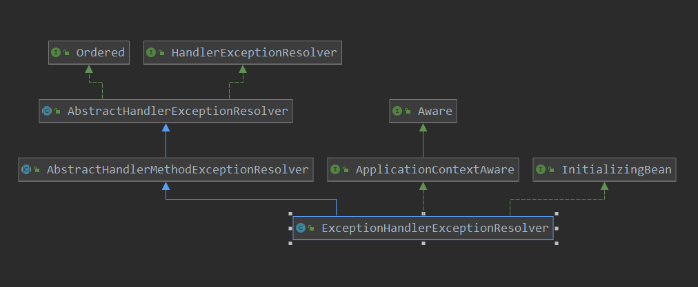

[TOC]

# ExceptionHandlerExceptionResolver 初始化

本篇咱们看一下ExceptionHandlerExceptionResolver的初始化，三个异常解析器中的一个。

看一下类图：



看到其是InitializingBean后代，说明定制了初始化操作，看一下其构造器函数，再看一下初始化函数：

```java
// 构造器
public ExceptionHandlerExceptionResolver() {
    StringHttpMessageConverter stringHttpMessageConverter = new StringHttpMessageConverter();
    stringHttpMessageConverter.setWriteAcceptCharset(false);  // see SPR-7316
    // 创建容器
    this.messageConverters = new ArrayList<>();
    // 添加具体的 信息转换器
    this.messageConverters.add(new ByteArrayHttpMessageConverter());
    this.messageConverters.add(stringHttpMessageConverter);
    try {
        this.messageConverters.add(new SourceHttpMessageConverter<>());
    }
    catch (Error err) {
        // Ignore when no TransformerFactory implementation is available
    }
    this.messageConverters.add(new AllEncompassingFormHttpMessageConverter());
}
```

> org.springframework.web.servlet.mvc.method.annotation.ExceptionHandlerExceptionResolver#afterPropertiesSet

```java
@Override
public void afterPropertiesSet() {
    // Do this first, it may add ResponseBodyAdvice beans
    // 初始化带有 controllerAdvice注解的类
    initExceptionHandlerAdviceCache();
    // 添加参数解析器
    if (this.argumentResolvers == null) {
        List<HandlerMethodArgumentResolver> resolvers = getDefaultArgumentResolvers();
        this.argumentResolvers = new HandlerMethodArgumentResolverComposite().addResolvers(resolvers);
    }
    // 添加返回值 处理器
    if (this.returnValueHandlers == null) {
        List<HandlerMethodReturnValueHandler> handlers = getDefaultReturnValueHandlers();
        this.returnValueHandlers = new HandlerMethodReturnValueHandlerComposite().addHandlers(handlers);
    }
}
```

这里主要做了三件事:

1. 解析带有 ControllerAdvice的类，并解析其带有 ExceptionHandler注解的方法
2. 添加 一系列的  参数解析器
3. 添加 一系列的 返回值 解析器

第2，3步没有什么特殊，这里主要看一下啊第一步，此步执行完之后，就建立了 异常-> 处理method 之间的映射关系。

> org.springframework.web.servlet.mvc.method.annotation.ExceptionHandlerExceptionResolver#initExceptionHandlerAdviceCache

```java
// 初始化 异常处理器 并 缓存起来
private void initExceptionHandlerAdviceCache() {
    if (getApplicationContext() == null) {
        return;
    }
    // 得到容器中所有ControllerAdvice注解的bean
    List<ControllerAdviceBean> adviceBeans = ControllerAdviceBean.findAnnotatedBeans(getApplicationContext());
    AnnotationAwareOrderComparator.sort(adviceBeans);
    // 遍历所有的controllerAdvice  bean
    for (ControllerAdviceBean adviceBean : adviceBeans) {
        Class<?> beanType = adviceBean.getBeanType();
        if (beanType == null) {
            throw new IllegalStateException("Unresolvable type for ControllerAdviceBean: " + adviceBean);
        }
        // ExceptionHandlerMethodResolver或解析class中有exceptionHandler注解的方法
        // 把exceptionHandler注解中value配置的execption和method的映射关系记录在 mappedmethod中
        ExceptionHandlerMethodResolver resolver = new ExceptionHandlerMethodResolver(beanType);
        // 如果此beanType中有exception和method的映射关系,那么记录下次 adviceBean和此ExceptionHandlerMethodResolver的关系
        if (resolver.hasExceptionMappings()) {
            this.exceptionHandlerAdviceCache.put(adviceBean, resolver);
        }
        // 对requestBody  responseBody进行的aop
        if (ResponseBodyAdvice.class.isAssignableFrom(beanType)) {
            this.responseBodyAdvice.add(adviceBean);
        }
    }
    if (logger.isDebugEnabled()) {
        int handlerSize = this.exceptionHandlerAdviceCache.size();
        int adviceSize = this.responseBodyAdvice.size();
        if (handlerSize == 0 && adviceSize == 0) {
            logger.debug("ControllerAdvice beans: none");
        }
        else {
            logger.debug("ControllerAdvice beans: " + handlerSize + " @ExceptionHandler, " + adviceSize + " ResponseBodyAdvice");
        }
    }
}
```

```java
// 查找带有 ControllerAdvice的class的name,并封装意味 ControllerAdviceBean
public static List<ControllerAdviceBean> findAnnotatedBeans(ApplicationContext context) {
    return Arrays.stream(BeanFactoryUtils.beanNamesForTypeIncludingAncestors(context, Object.class))
        .filter(name -> context.findAnnotationOnBean(name, ControllerAdvice.class) != null)
        .map(name -> new ControllerAdviceBean(name, context))
        .collect(Collectors.toList());
}
```

解析操作：

> org.springframework.web.method.annotation.ExceptionHandlerMethodResolver#ExceptionHandlerMethodResolver

```java
// 带有 ExceptionHandler 注解的方法
public static final MethodFilter EXCEPTION_HANDLER_METHODS = method ->
    AnnotatedElementUtils.hasAnnotation(method, ExceptionHandler.class);

// 解析 ExceptionHandler
public ExceptionHandlerMethodResolver(Class<?> handlerType) {
    // MethodIntrospector.selectMethods找到此class有ExceptionHandler注解的方法
    for (Method method : MethodIntrospector.selectMethods(handlerType, EXCEPTION_HANDLER_METHODS)) {
        // detectExceptionMappings 获取到方法中设置的全部的exception
        for (Class<? extends Throwable> exceptionType : detectExceptionMappings(method)) {
            // 添加exception到此method的映射关系,如果出现此异常,那么就执行此方法来进行处理
            // 记录在mappedMethods
            addExceptionMapping(exceptionType, method);
        }
    }
}
```

```java
private List<Class<? extends Throwable>> detectExceptionMappings(Method method) {
    List<Class<? extends Throwable>> result = new ArrayList<>();
    // 获取到ExceptionHandler注解中value的所有的值, 并存储到 result中
    // 父类,接口,都会去查找
    detectAnnotationExceptionMappings(method, result);
    if (result.isEmpty()) {
        for (Class<?> paramType : method.getParameterTypes()) {
            if (Throwable.class.isAssignableFrom(paramType)) {
                // 把所有的异常类型记录下来
                result.add((Class<? extends Throwable>) paramType);
            }
        }
    }
    if (result.isEmpty()) {
        throw new IllegalStateException("No exception types mapped to " + method);
    }
    return result;
}
```

之后记录异常映射:

> org.springframework.web.method.annotation.ExceptionHandlerMethodResolver#addExceptionMapping

```java
// 记录异常和 处理异常的 方法之间的映射
private final Map<Class<? extends Throwable>, Method> mappedMethods = new HashMap<>(16);

// 记录异常的映射值
private void addExceptionMapping(Class<? extends Throwable> exceptionType, Method method) {
    // 记录起来 异常 和 处理此异常的 方法之间的映射
    Method oldMethod = this.mappedMethods.put(exceptionType, method);
    // 如果多个方法处理同一个异常,则会报错
    if (oldMethod != null && !oldMethod.equals(method)) {
        throw new IllegalStateException("Ambiguous @ExceptionHandler method mapped for [" +
                                        exceptionType + "]: {" + oldMethod + ", " + method + "}");
    }
}
```

到此后，就处理完了异常和处理异常之间的映射关系。


