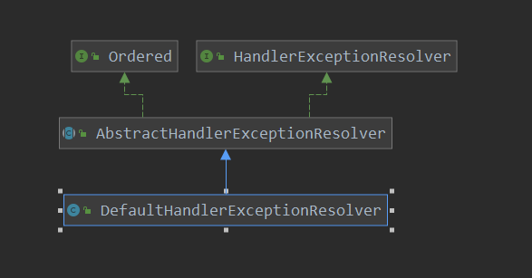

[TOC]

# DefaultHandlerExceptionResolver 初始化

本篇看一下DefaultHandlerExceptionResolver的初始化，也是先看一下类图把:



```java
public class DefaultHandlerExceptionResolver extends AbstractHandlerExceptionResolver {

    /**
	 * Log category to use when no mapped handler is found for a request.
	 * @see #pageNotFoundLogger
	 */
    public static final String PAGE_NOT_FOUND_LOG_CATEGORY = "org.springframework.web.servlet.PageNotFound";

    /**
	 * Additional logger to use when no mapped handler is found for a request.
	 * @see #PAGE_NOT_FOUND_LOG_CATEGORY
	 */
    protected static final Log pageNotFoundLogger = LogFactory.getLog(PAGE_NOT_FOUND_LOG_CATEGORY);


    /**
	 * Sets the {@linkplain #setOrder(int) order} to {@link #LOWEST_PRECEDENCE}.
	 */
    public DefaultHandlerExceptionResolver() {
        setOrder(Ordered.LOWEST_PRECEDENCE);
        setWarnLogCategory(getClass().getName());
    }

    // 对springmvc 内部的异常的一些处理
    @Override
    @Nullable
    protected ModelAndView doResolveException(
        HttpServletRequest request, HttpServletResponse response, @Nullable Object handler, Exception ex) {

        try {
            if (ex instanceof HttpRequestMethodNotSupportedException) {
                return handleHttpRequestMethodNotSupported(
                    (HttpRequestMethodNotSupportedException) ex, request, response, handler);
            }
            else if (ex instanceof HttpMediaTypeNotSupportedException) {
                return handleHttpMediaTypeNotSupported(
                    (HttpMediaTypeNotSupportedException) ex, request, response, handler);
            }
            else if (ex instanceof HttpMediaTypeNotAcceptableException) {
                return handleHttpMediaTypeNotAcceptable(
                    (HttpMediaTypeNotAcceptableException) ex, request, response, handler);
            }
            else if (ex instanceof MissingPathVariableException) {
                return handleMissingPathVariable(
                    (MissingPathVariableException) ex, request, response, handler);
            }
            else if (ex instanceof MissingServletRequestParameterException) {
                return handleMissingServletRequestParameter(
                    (MissingServletRequestParameterException) ex, request, response, handler);
            }
            else if (ex instanceof ServletRequestBindingException) {
                return handleServletRequestBindingException(
                    (ServletRequestBindingException) ex, request, response, handler);
            }
            else if (ex instanceof ConversionNotSupportedException) {
                return handleConversionNotSupported(
                    (ConversionNotSupportedException) ex, request, response, handler);
            }
            else if (ex instanceof TypeMismatchException) {
                return handleTypeMismatch(
                    (TypeMismatchException) ex, request, response, handler);
            }
            else if (ex instanceof HttpMessageNotReadableException) {
                return handleHttpMessageNotReadable(
                    (HttpMessageNotReadableException) ex, request, response, handler);
            }
            else if (ex instanceof HttpMessageNotWritableException) {
                return handleHttpMessageNotWritable(
                    (HttpMessageNotWritableException) ex, request, response, handler);
            }
            else if (ex instanceof MethodArgumentNotValidException) {
                return handleMethodArgumentNotValidException(
                    (MethodArgumentNotValidException) ex, request, response, handler);
            }
            else if (ex instanceof MissingServletRequestPartException) {
                return handleMissingServletRequestPartException(
                    (MissingServletRequestPartException) ex, request, response, handler);
            }
            else if (ex instanceof BindException) {
                return handleBindException((BindException) ex, request, response, handler);
            }
            else if (ex instanceof NoHandlerFoundException) {
                return handleNoHandlerFoundException(
                    (NoHandlerFoundException) ex, request, response, handler);
            }
            else if (ex instanceof AsyncRequestTimeoutException) {
                return handleAsyncRequestTimeoutException(
                    (AsyncRequestTimeoutException) ex, request, response, handler);
            }
        }
        catch (Exception handlerEx) {
            if (logger.isWarnEnabled()) {
                logger.warn("Failure while trying to resolve exception [" + ex.getClass().getName() + "]", handlerEx);
            }
        }
        return null;
    }

    /**
	 * Handle the case where no request handler method was found for the particular HTTP request method.
	 * <p>The default implementation logs a warning, sends an HTTP 405 error, sets the "Allow" header,
	 * and returns an empty {@code ModelAndView}. Alternatively, a fallback view could be chosen,
	 * or the HttpRequestMethodNotSupportedException could be rethrown as-is.
	 * @param ex the HttpRequestMethodNotSupportedException to be handled
	 * @param request current HTTP request
	 * @param response current HTTP response
	 * @param handler the executed handler, or {@code null} if none chosen
	 * at the time of the exception (for example, if multipart resolution failed)
	 * @return an empty ModelAndView indicating the exception was handled
	 * @throws IOException potentially thrown from {@link HttpServletResponse#sendError}
	 */
    protected ModelAndView handleHttpRequestMethodNotSupported(HttpRequestMethodNotSupportedException ex,
                                                               HttpServletRequest request, HttpServletResponse response, @Nullable Object handler) throws IOException {

        String[] supportedMethods = ex.getSupportedMethods();
        if (supportedMethods != null) {
            response.setHeader("Allow", StringUtils.arrayToDelimitedString(supportedMethods, ", "));
        }
        response.sendError(HttpServletResponse.SC_METHOD_NOT_ALLOWED, ex.getMessage());
        return new ModelAndView();
    }

    /**
	 * Handle the case where no {@linkplain org.springframework.http.converter.HttpMessageConverter message converters}
	 * were found for the PUT or POSTed content.
	 * <p>The default implementation sends an HTTP 415 error, sets the "Accept" header,
	 * and returns an empty {@code ModelAndView}. Alternatively, a fallback view could
	 * be chosen, or the HttpMediaTypeNotSupportedException could be rethrown as-is.
	 * @param ex the HttpMediaTypeNotSupportedException to be handled
	 * @param request current HTTP request
	 * @param response current HTTP response
	 * @param handler the executed handler
	 * @return an empty ModelAndView indicating the exception was handled
	 * @throws IOException potentially thrown from {@link HttpServletResponse#sendError}
	 */
    protected ModelAndView handleHttpMediaTypeNotSupported(HttpMediaTypeNotSupportedException ex,
                                                           HttpServletRequest request, HttpServletResponse response, @Nullable Object handler) throws IOException {

        response.sendError(HttpServletResponse.SC_UNSUPPORTED_MEDIA_TYPE);
        List<MediaType> mediaTypes = ex.getSupportedMediaTypes();
        if (!CollectionUtils.isEmpty(mediaTypes)) {
            response.setHeader("Accept", MediaType.toString(mediaTypes));
        }
        return new ModelAndView();
    }

    /**
	 * Handle the case where no {@linkplain org.springframework.http.converter.HttpMessageConverter message converters}
	 * were found that were acceptable for the client (expressed via the {@code Accept} header.
	 * <p>The default implementation sends an HTTP 406 error and returns an empty {@code ModelAndView}.
	 * Alternatively, a fallback view could be chosen, or the HttpMediaTypeNotAcceptableException
	 * could be rethrown as-is.
	 * @param ex the HttpMediaTypeNotAcceptableException to be handled
	 * @param request current HTTP request
	 * @param response current HTTP response
	 * @param handler the executed handler
	 * @return an empty ModelAndView indicating the exception was handled
	 * @throws IOException potentially thrown from {@link HttpServletResponse#sendError}
	 */
    protected ModelAndView handleHttpMediaTypeNotAcceptable(HttpMediaTypeNotAcceptableException ex,
                                                            HttpServletRequest request, HttpServletResponse response, @Nullable Object handler) throws IOException {

        response.sendError(HttpServletResponse.SC_NOT_ACCEPTABLE);
        return new ModelAndView();
    }

    /**
	 * Handle the case when a declared path variable does not match any extracted URI variable.
	 * <p>The default implementation sends an HTTP 500 error, and returns an empty {@code ModelAndView}.
	 * Alternatively, a fallback view could be chosen, or the MissingPathVariableException
	 * could be rethrown as-is.
	 * @param ex the MissingPathVariableException to be handled
	 * @param request current HTTP request
	 * @param response current HTTP response
	 * @param handler the executed handler
	 * @return an empty ModelAndView indicating the exception was handled
	 * @throws IOException potentially thrown from {@link HttpServletResponse#sendError}
	 * @since 4.2
	 */
    protected ModelAndView handleMissingPathVariable(MissingPathVariableException ex,
                                                     HttpServletRequest request, HttpServletResponse response, @Nullable Object handler) throws IOException {

        response.sendError(HttpServletResponse.SC_INTERNAL_SERVER_ERROR, ex.getMessage());
        return new ModelAndView();
    }

    /**
	 * Handle the case when a required parameter is missing.
	 * <p>The default implementation sends an HTTP 400 error, and returns an empty {@code ModelAndView}.
	 * Alternatively, a fallback view could be chosen, or the MissingServletRequestParameterException
	 * could be rethrown as-is.
	 * @param ex the MissingServletRequestParameterException to be handled
	 * @param request current HTTP request
	 * @param response current HTTP response
	 * @param handler the executed handler
	 * @return an empty ModelAndView indicating the exception was handled
	 * @throws IOException potentially thrown from {@link HttpServletResponse#sendError}
	 */
    protected ModelAndView handleMissingServletRequestParameter(MissingServletRequestParameterException ex,
                                                                HttpServletRequest request, HttpServletResponse response, @Nullable Object handler) throws IOException {

        response.sendError(HttpServletResponse.SC_BAD_REQUEST, ex.getMessage());
        return new ModelAndView();
    }

    /**
	 * Handle the case when an unrecoverable binding exception occurs - e.g. required header, required cookie.
	 * <p>The default implementation sends an HTTP 400 error, and returns an empty {@code ModelAndView}.
	 * Alternatively, a fallback view could be chosen, or the exception could be rethrown as-is.
	 * @param ex the exception to be handled
	 * @param request current HTTP request
	 * @param response current HTTP response
	 * @param handler the executed handler
	 * @return an empty ModelAndView indicating the exception was handled
	 * @throws IOException potentially thrown from {@link HttpServletResponse#sendError}
	 */
    protected ModelAndView handleServletRequestBindingException(ServletRequestBindingException ex,
                                                                HttpServletRequest request, HttpServletResponse response, @Nullable Object handler) throws IOException {

        response.sendError(HttpServletResponse.SC_BAD_REQUEST, ex.getMessage());
        return new ModelAndView();
    }

    /**
	 * Handle the case when a {@link org.springframework.web.bind.WebDataBinder} conversion cannot occur.
	 * <p>The default implementation sends an HTTP 500 error, and returns an empty {@code ModelAndView}.
	 * Alternatively, a fallback view could be chosen, or the ConversionNotSupportedException could be
	 * rethrown as-is.
	 * @param ex the ConversionNotSupportedException to be handled
	 * @param request current HTTP request
	 * @param response current HTTP response
	 * @param handler the executed handler
	 * @return an empty ModelAndView indicating the exception was handled
	 * @throws IOException potentially thrown from {@link HttpServletResponse#sendError}
	 */
    protected ModelAndView handleConversionNotSupported(ConversionNotSupportedException ex,
                                                        HttpServletRequest request, HttpServletResponse response, @Nullable Object handler) throws IOException {

        sendServerError(ex, request, response);
        return new ModelAndView();
    }

    /**
	 * Handle the case when a {@link org.springframework.web.bind.WebDataBinder} conversion error occurs.
	 * <p>The default implementation sends an HTTP 400 error, and returns an empty {@code ModelAndView}.
	 * Alternatively, a fallback view could be chosen, or the TypeMismatchException could be rethrown as-is.
	 * @param ex the TypeMismatchException to be handled
	 * @param request current HTTP request
	 * @param response current HTTP response
	 * @param handler the executed handler
	 * @return an empty ModelAndView indicating the exception was handled
	 * @throws IOException potentially thrown from {@link HttpServletResponse#sendError}
	 */
    protected ModelAndView handleTypeMismatch(TypeMismatchException ex,
                                              HttpServletRequest request, HttpServletResponse response, @Nullable Object handler) throws IOException {

        response.sendError(HttpServletResponse.SC_BAD_REQUEST);
        return new ModelAndView();
    }

    /**
	 * Handle the case where a {@linkplain org.springframework.http.converter.HttpMessageConverter message converter}
	 * cannot read from a HTTP request.
	 * <p>The default implementation sends an HTTP 400 error, and returns an empty {@code ModelAndView}.
	 * Alternatively, a fallback view could be chosen, or the HttpMessageNotReadableException could be
	 * rethrown as-is.
	 * @param ex the HttpMessageNotReadableException to be handled
	 * @param request current HTTP request
	 * @param response current HTTP response
	 * @param handler the executed handler
	 * @return an empty ModelAndView indicating the exception was handled
	 * @throws IOException potentially thrown from {@link HttpServletResponse#sendError}
	 */
    protected ModelAndView handleHttpMessageNotReadable(HttpMessageNotReadableException ex,
                                                        HttpServletRequest request, HttpServletResponse response, @Nullable Object handler) throws IOException {

        response.sendError(HttpServletResponse.SC_BAD_REQUEST);
        return new ModelAndView();
    }

    /**
	 * Handle the case where a
	 * {@linkplain org.springframework.http.converter.HttpMessageConverter message converter}
	 * cannot write to a HTTP request.
	 * <p>The default implementation sends an HTTP 500 error, and returns an empty {@code ModelAndView}.
	 * Alternatively, a fallback view could be chosen, or the HttpMessageNotWritableException could
	 * be rethrown as-is.
	 * @param ex the HttpMessageNotWritableException to be handled
	 * @param request current HTTP request
	 * @param response current HTTP response
	 * @param handler the executed handler
	 * @return an empty ModelAndView indicating the exception was handled
	 * @throws IOException potentially thrown from {@link HttpServletResponse#sendError}
	 */
    protected ModelAndView handleHttpMessageNotWritable(HttpMessageNotWritableException ex,
                                                        HttpServletRequest request, HttpServletResponse response, @Nullable Object handler) throws IOException {

        sendServerError(ex, request, response);
        return new ModelAndView();
    }

    /**
	 * Handle the case where an argument annotated with {@code @Valid} such as
	 * an {@link RequestBody} or {@link RequestPart} argument fails validation.
	 * <p>By default, an HTTP 400 error is sent back to the client.
	 * @param request current HTTP request
	 * @param response current HTTP response
	 * @param handler the executed handler
	 * @return an empty ModelAndView indicating the exception was handled
	 * @throws IOException potentially thrown from {@link HttpServletResponse#sendError}
	 */
    protected ModelAndView handleMethodArgumentNotValidException(MethodArgumentNotValidException ex,
                                                                 HttpServletRequest request, HttpServletResponse response, @Nullable Object handler) throws IOException {

        response.sendError(HttpServletResponse.SC_BAD_REQUEST);
        return new ModelAndView();
    }

    /**
	 * Handle the case where an {@linkplain RequestPart @RequestPart}, a {@link MultipartFile},
	 * or a {@code javax.servlet.http.Part} argument is required but is missing.
	 * <p>By default, an HTTP 400 error is sent back to the client.
	 * @param request current HTTP request
	 * @param response current HTTP response
	 * @param handler the executed handler
	 * @return an empty ModelAndView indicating the exception was handled
	 * @throws IOException potentially thrown from {@link HttpServletResponse#sendError}
	 */
    protected ModelAndView handleMissingServletRequestPartException(MissingServletRequestPartException ex,
                                                                    HttpServletRequest request, HttpServletResponse response, @Nullable Object handler) throws IOException {

        response.sendError(HttpServletResponse.SC_BAD_REQUEST, ex.getMessage());
        return new ModelAndView();
    }

    /**
	 * Handle the case where an {@linkplain ModelAttribute @ModelAttribute} method
	 * argument has binding or validation errors and is not followed by another
	 * method argument of type {@link BindingResult}.
	 * <p>By default, an HTTP 400 error is sent back to the client.
	 * @param request current HTTP request
	 * @param response current HTTP response
	 * @param handler the executed handler
	 * @return an empty ModelAndView indicating the exception was handled
	 * @throws IOException potentially thrown from {@link HttpServletResponse#sendError}
	 */
    protected ModelAndView handleBindException(BindException ex, HttpServletRequest request,
                                               HttpServletResponse response, @Nullable Object handler) throws IOException {

        response.sendError(HttpServletResponse.SC_BAD_REQUEST);
        return new ModelAndView();
    }

    /**
	 * Handle the case where no handler was found during the dispatch.
	 * <p>The default implementation sends an HTTP 404 error and returns an empty
	 * {@code ModelAndView}. Alternatively, a fallback view could be chosen,
	 * or the NoHandlerFoundException could be rethrown as-is.
	 * @param ex the NoHandlerFoundException to be handled
	 * @param request current HTTP request
	 * @param response current HTTP response
	 * @param handler the executed handler, or {@code null} if none chosen
	 * at the time of the exception (for example, if multipart resolution failed)
	 * @return an empty ModelAndView indicating the exception was handled
	 * @throws IOException potentially thrown from {@link HttpServletResponse#sendError}
	 * @since 4.0
	 */
    protected ModelAndView handleNoHandlerFoundException(NoHandlerFoundException ex,
                                                         HttpServletRequest request, HttpServletResponse response, @Nullable Object handler) throws IOException {

        pageNotFoundLogger.warn(ex.getMessage());
        response.sendError(HttpServletResponse.SC_NOT_FOUND);
        return new ModelAndView();
    }

    /**
	 * Handle the case where an async request timed out.
	 * <p>The default implementation sends an HTTP 503 error.
	 * @param ex the {@link AsyncRequestTimeoutException }to be handled
	 * @param request current HTTP request
	 * @param response current HTTP response
	 * @param handler the executed handler, or {@code null} if none chosen
	 * at the time of the exception (for example, if multipart resolution failed)
	 * @return an empty ModelAndView indicating the exception was handled
	 * @throws IOException potentially thrown from {@link HttpServletResponse#sendError}
	 * @since 4.2.8
	 */
    protected ModelAndView handleAsyncRequestTimeoutException(AsyncRequestTimeoutException ex,
                                                              HttpServletRequest request, HttpServletResponse response, @Nullable Object handler) throws IOException {

        if (!response.isCommitted()) {
            response.sendError(HttpServletResponse.SC_SERVICE_UNAVAILABLE);
        }
        else {
            logger.warn("Async request timed out");
        }
        return new ModelAndView();
    }

    /**
	 * Invoked to send a server error. Sets the status to 500 and also sets the
	 * request attribute "javax.servlet.error.exception" to the Exception.
	 */
    protected void sendServerError(Exception ex, HttpServletRequest request, HttpServletResponse response) throws IOException {

        request.setAttribute("javax.servlet.error.exception", ex);
        response.sendError(HttpServletResponse.SC_INTERNAL_SERVER_ERROR);
    }
}
```

同样也没有看到有什么特殊的操作，不过对异常的处理倒是很清晰，大多是springmvc 内部的一些处理。