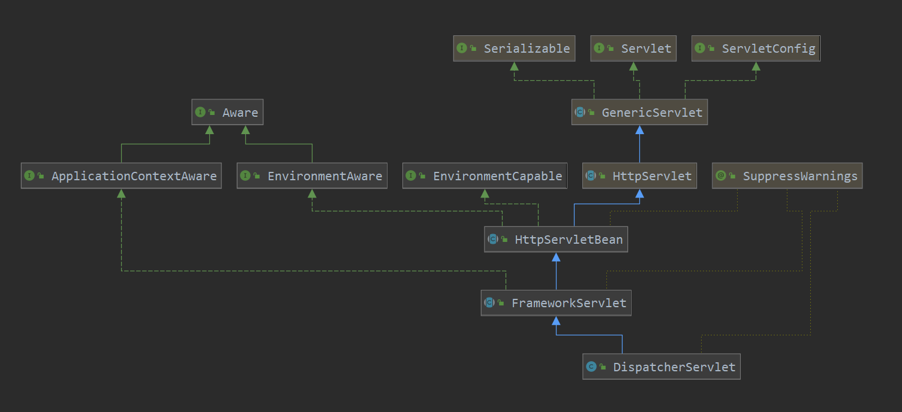

[TOC]

# 一次请求的处理

本篇看一下一个请求到springmvc即dispatcherServlet后，是如何进行处理的。在回顾一下其类图:



一个请求过来，肯定是先到servelt的service方法，这里就先看一下service方法：

> org.springframework.web.servlet.FrameworkServlet#service

```java
/**
	 * Override the parent class implementation in order to intercept PATCH requests.
	 * 处理http请求的入口
	 */
@Override
protected void service(HttpServletRequest request, HttpServletResponse response)
    throws ServletException, IOException {
	// 解析 httpMethod
    HttpMethod httpMethod = HttpMethod.resolve(request.getMethod());
    if (httpMethod == HttpMethod.PATCH || httpMethod == null) {
        // 如果没有解析出来,则使用 processRequest 来继续处理
        processRequest(request, response);
    }
    else {
        // 如父类进行处理
        // 到父类只是对不同的httpMethod的路由功能,如doGet,doPost等方法,还是调用到本类的doGet  doPost
        super.service(request, response);
    }
}
```

如果没有解析出具体的请求方法，则使用processRequest继续进行处理，解析出来后，调用父类的service方法，进行具体的处理， 父类的service方法：

> javax.servlet.http.HttpServlet#service(javax.servlet.http.HttpServletRequest, javax.servlet.http.HttpServletResponse)

```java
// 请求进来后的第一次处理
protected void service(HttpServletRequest req, HttpServletResponse resp)
    throws ServletException, IOException
{	
    // 获取请求的方法
    String method = req.getMethod();
	// 如果是GET方法,则调用doGet进行处理
    if (method.equals(METHOD_GET)) {
        long lastModified = getLastModified(req);
        if (lastModified == -1) {
            // servlet doesn't support if-modified-since, no reason
            // to go through further expensive logic
            doGet(req, resp);
        } else {
            long ifModifiedSince = req.getDateHeader(HEADER_IFMODSINCE);
            if (ifModifiedSince < lastModified) {
                // If the servlet mod time is later, call doGet()
                // Round down to the nearest second for a proper compare
                // A ifModifiedSince of -1 will always be less
                maybeSetLastModified(resp, lastModified);
                doGet(req, resp);
            } else {
                resp.setStatus(HttpServletResponse.SC_NOT_MODIFIED);
            }
        }
	// 是head方法,调用doHead处理
    } else if (method.equals(METHOD_HEAD)) {
        long lastModified = getLastModified(req);
        maybeSetLastModified(resp, lastModified);
        doHead(req, resp);
	// Post调用 doPost处理
    } else if (method.equals(METHOD_POST)) {
        doPost(req, resp);
	// doPut 处理
    } else if (method.equals(METHOD_PUT)) {
        doPut(req, resp);
	// doDelete 处理
    } else if (method.equals(METHOD_DELETE)) {
        doDelete(req, resp);
	// doOptions 处理
    } else if (method.equals(METHOD_OPTIONS)) {
        doOptions(req,resp);
	// doTracec 处理
    } else if (method.equals(METHOD_TRACE)) {
        doTrace(req,resp);
    } else {
        // Note that this means NO servlet supports whatever
        // method was requested, anywhere on this server.
        String errMsg = lStrings.getString("http.method_not_implemented");
        Object[] errArgs = new Object[1];
        errArgs[0] = method;
        errMsg = MessageFormat.format(errMsg, errArgs);
        resp.sendError(HttpServletResponse.SC_NOT_IMPLEMENTED, errMsg);
    }
}
```

可以看到，通过不同的请求方式来调用不同的方法进行处理。

继续处理processRequest：

> org.springframework.web.servlet.FrameworkServlet#processRequest

```java
// 具体处理请求
protected final void processRequest(HttpServletRequest request, HttpServletResponse response)
    throws ServletException, IOException {
    // 记录请求处理的开始时间
    long startTime = System.currentTimeMillis();
    Throwable failureCause = null;
    // 此和国际化有关系
    LocaleContext previousLocaleContext = LocaleContextHolder.getLocaleContext();
    LocaleContext localeContext = buildLocaleContext(request);
    // 获取当前线程中的 requestAttribute
    RequestAttributes previousAttributes = RequestContextHolder.getRequestAttributes();
    // 根据请求创建一个新的 ServletRequestAttributes
    ServletRequestAttributes requestAttributes = buildRequestAttributes(request, response, previousAttributes);
    // request的异步处理
    WebAsyncManager asyncManager = WebAsyncUtils.getAsyncManager(request);
    asyncManager.registerCallableInterceptor(FrameworkServlet.class.getName(), new RequestBindingInterceptor());
    // 把上面获取的locale 和 requestAttributes放到threadLocal中
    initContextHolders(request, localeContext, requestAttributes);

    try {
        // 继续处理
        // 在 DispatcherServlet 中继续处理
        doService(request, response);
    }
    catch (ServletException | IOException ex) {
        failureCause = ex;
        throw ex;
    }
    catch (Throwable ex) {
        failureCause = ex;
        throw new NestedServletException("Request processing failed", ex);
    }
    finally {
        resetContextHolders(request, previousLocaleContext, previousAttributes);
        if (requestAttributes != null) {
            requestAttributes.requestCompleted();
        }
        logResult(request, response, failureCause, asyncManager);
        publishRequestHandledEvent(request, response, startTime, failureCause);
    }
}
```

processRequest 中创建了根据请求创建了新的 requestAttribute并保存在threadLocal中，以及创建了 Locale同样保存在threadLocal中，之后调用 DispatcherServlet 进行进一步的处理。

这里看一下在 FrameworkSerlvet中重载的 doGet，doPost等方法的处理：

```java
// 看到对于各种方法的处理,都会有processRequest类进行具体的处理
// 那继续看此方法
@Override
protected final void doGet(HttpServletRequest request, HttpServletResponse response)
    throws ServletException, IOException {
    // 继续处理请求的方法
    processRequest(request, response);
}

@Override
protected final void doPost(HttpServletRequest request, HttpServletResponse response)
    throws ServletException, IOException {

    processRequest(request, response);
}

@Override
protected final void doPut(HttpServletRequest request, HttpServletResponse response)
    throws ServletException, IOException {

    processRequest(request, response);
}

@Override
protected final void doDelete(HttpServletRequest request, HttpServletResponse response)
    throws ServletException, IOException {

    processRequest(request, response);
}

@Override
protected void doOptions(HttpServletRequest request, HttpServletResponse response)
    throws ServletException, IOException {

    if (this.dispatchOptionsRequest || CorsUtils.isPreFlightRequest(request)) {
        processRequest(request, response);
        if (response.containsHeader("Allow")) {
            // Proper OPTIONS response coming from a handler - we're done.
            return;
        }
    }

    // Use response wrapper in order to always add PATCH to the allowed methods
    super.doOptions(request, new HttpServletResponseWrapper(response) {
        @Override
        public void setHeader(String name, String value) {
            if ("Allow".equals(name)) {
                value = (StringUtils.hasLength(value) ? value + ", " : "") + HttpMethod.PATCH.name();
            }
            super.setHeader(name, value);
        }
    });
}

@Override
protected void doTrace(HttpServletRequest request, HttpServletResponse response)
    throws ServletException, IOException {
    if (this.dispatchTraceRequest) {
        processRequest(request, response);
        if ("message/http".equals(response.getContentType())) {
            // Proper TRACE response coming from a handler - we're done.
            return;
        }
    }
    super.doTrace(request, response);
}

```

可以看到，重写的方法，同样是调用processRequest来进行进一步的处理，而processRequest只有调用DispatcherServlet来进一步处理，看一下dispatcherServlet的处理：

> org.springframework.web.servlet.DispatcherServlet#doService

```java
@Override
protected void doService(HttpServletRequest request, HttpServletResponse response) throws Exception {
    logRequest(request);

    // Keep a snapshot of the request attributes in case of an include,
    // to be able to restore the original attributes after the include.
    Map<String, Object> attributesSnapshot = null;
    // 获取reques中的 javax.servlet.include.request_uri 属性值
    if (WebUtils.isIncludeRequest(request)) {
        // 记录下 request中的属性信息
        attributesSnapshot = new HashMap<>();
        Enumeration<?> attrNames = request.getAttributeNames();
        while (attrNames.hasMoreElements()) {
            String attrName = (String) attrNames.nextElement();
            if (this.cleanupAfterInclude || attrName.startsWith(DEFAULT_STRATEGIES_PREFIX)) {
                attributesSnapshot.put(attrName, request.getAttribute(attrName));
            }
        }
    }

    // Make framework objects available to handlers and view objects.
    // 把webApplicaitonContext  locale theme 等信息放到request中, 后面处理时,就可以直接使用
    // DispatcherServlet.class.getName() + ".CONTEXT"  存放 applicationContext
    request.setAttribute(WEB_APPLICATION_CONTEXT_ATTRIBUTE, getWebApplicationContext());
    // DispatcherServlet.class.getName() + ".LOCALE_RESOLVER" 存放 localeResolver
    request.setAttribute(LOCALE_RESOLVER_ATTRIBUTE, this.localeResolver);
    // DispatcherServlet.class.getName() + ".THEME_RESOLVER" 存放 themResolver
    request.setAttribute(THEME_RESOLVER_ATTRIBUTE, this.themeResolver);
    // DispatcherServlet.class.getName() + ".THEME_SOURCE"  存放 ThemeSource
    request.setAttribute(THEME_SOURCE_ATTRIBUTE, getThemeSource());
    if (this.flashMapManager != null) {
        FlashMap inputFlashMap = this.flashMapManager.retrieveAndUpdate(request, response);
        if (inputFlashMap != null) {
            request.setAttribute(INPUT_FLASH_MAP_ATTRIBUTE, Collections.unmodifiableMap(inputFlashMap));
        }
        request.setAttribute(OUTPUT_FLASH_MAP_ATTRIBUTE, new FlashMap());
        request.setAttribute(FLASH_MAP_MANAGER_ATTRIBUTE, this.flashMapManager);
    }

    try {
        // 上面向request中添加了许多的属性,下面继续进行分析,进一步进行处理
        // 继续分发请求
        doDispatch(request, response);
    }
    finally {
        if (!WebAsyncUtils.getAsyncManager(request).isConcurrentHandlingStarted()) {
            // Restore the original attribute snapshot, in case of an include.
            if (attributesSnapshot != null) {
                restoreAttributesAfterInclude(request, attributesSnapshot);
            }
        }
    }
}
```

此方法向request中添加了许多的属性值，之后再次调用doDispatch继续进行处理。可以看到这里，其实springmvc 很多的东西是通过request的属性类传递的，也就是其本身就和servlet及其容器是融合在一起的。

> org.springframework.web.servlet.DispatcherServlet#doDispatch

```java
// 此处就会把请求分发到真实要处理的方法或者类上进行处理
protected void doDispatch(HttpServletRequest request, HttpServletResponse response) throws Exception {
    HttpServletRequest processedRequest = request;
    // 调用链
    HandlerExecutionChain mappedHandler = null;
    boolean multipartRequestParsed = false;
    // 异步处理  -- 先略过
    WebAsyncManager asyncManager = WebAsyncUtils.getAsyncManager(request);

    try {
        ModelAndView mv = null;
        // 处理中出现的异常
        Exception dispatchException = null;

        try {
            // 是否是文件上传
            processedRequest = checkMultipart(request);
            multipartRequestParsed = (processedRequest != request);

            // Determine handler for the current request.
            // 获取handler
            mappedHandler = getHandler(processedRequest);
            // 如果没有找到 handler
            if (mappedHandler == null) {
                noHandlerFound(processedRequest, response);
                return;
            }

            // Determine handler adapter for the current request.
            // 获取具体调用方法的handlerAdapter
            HandlerAdapter ha = getHandlerAdapter(mappedHandler.getHandler());

            // Process last-modified header, if supported by the handler.
            String method = request.getMethod();
            boolean isGet = "GET".equals(method);
            if (isGet || "HEAD".equals(method)) {
                long lastModified = ha.getLastModified(request, mappedHandler.getHandler());
              if (new ServletWebRequest(request, response).checkNotModified(lastModified) && isGet) {
                    return;
                }
            }
            // filter的preHandler
            if (!mappedHandler.applyPreHandle(processedRequest, response)) {
                return;
            }
            // Actually invoke the handler.
            // 真实方法调用
            // 通过 adaptor 适配器来进行调用
            mv = ha.handle(processedRequest, response, mappedHandler.getHandler());

            if (asyncManager.isConcurrentHandlingStarted()) {
                return;
            }
            // 应用默认的额 view name
            applyDefaultViewName(processedRequest, mv);
            // filter postHandler
            mappedHandler.applyPostHandle(processedRequest, response, mv);
        }
        catch (Exception ex) {
            dispatchException = ex;
        }
        catch (Throwable err) {
            // As of 4.3, we're processing Errors thrown from handler methods as well,
            // making them available for @ExceptionHandler methods and other scenarios.
            dispatchException = new NestedServletException("Handler dispatch failed", err);
        }
        // todo 对modalAndView进行返回 或者 异常进行统一处理
        processDispatchResult(processedRequest, response, mappedHandler, mv, dispatchException);
    }
    catch (Exception ex) {
        triggerAfterCompletion(processedRequest, response, mappedHandler, ex);
    }
    catch (Throwable err) {
        triggerAfterCompletion(processedRequest, response, mappedHandler,
                               new NestedServletException("Handler processing failed", err));
    }
    finally {
        if (asyncManager.isConcurrentHandlingStarted()) {
            // Instead of postHandle and afterCompletion
            if (mappedHandler != null) {
                mappedHandler.applyAfterConcurrentHandlingStarted(processedRequest, response);
            }
        }
        else {
            // Clean up any resources used by a multipart request.
            if (multipartRequestParsed) {
                cleanupMultipart(processedRequest);
            }
        }
    }
}
```

此方法不是很长，但是功能却是很重，小结一下：

1. 检测是否是文件上传
2. 获取方法调用链，其包含了 interceptor，和具体的handler
3. 获取方法的调用adaptor，即得到具体的适配器
4. 调用 interceptor的 preHandler方法
5. 通过adaptor（适配器）来调用具体的处理方法
6. 应用 modelAndView
7. 调用 interceptor 的postHandler 方法
8. 如果出现异常，则在这里进行异常的处理----统一异常处理

基本上dispatcherServlet整个的处理流程都在这里体现出现了。下面具体分析一下如何获取handler调用链，以及适配器的获取。

### handler的获取

handler调用链的获取：

> org.springframework.web.servlet.DispatcherServlet#getHandler

```java
// 此获取handler时, 会把对应的interceptor也获取到
// 创建一个对应的调用链
@Nullable
protected HandlerExecutionChain getHandler(HttpServletRequest request) throws Exception {
    if (this.handlerMappings != null) {
        for (HandlerMapping mapping : this.handlerMappings) {
            HandlerExecutionChain handler = mapping.getHandler(request);
            if (handler != null) {
                return handler;
            }
        }
    }
    return null;
}
```

这里需要回忆一下前面分析的HandlerMapping的初始化，其中使用默认策略初始化了两个类，ReqeustMappingHandlerMapping以及BeanNameUrlHandlerMapping，这就就是分别调用其getHandler方法来获取调用链。此编程方法可以借鉴。

> org.springframework.web.servlet.handler.AbstractHandlerMapping#getHandler

```java
// 获取handler 调用链
@Override
@Nullable
public final HandlerExecutionChain getHandler(HttpServletRequest request) throws Exception {
    // 根据request来找到对应的handler,也就是根据url去寻找 beanMatch的方法
    Object handler = getHandlerInternal(request);
    // 如果没有找到,则使用 defaultHandler
    if (handler == null) {
        handler = getDefaultHandler();
    }
    // 如果还没有找到,则返回null
    if (handler == null) {
        return null;
    }
    // Bean name or resolved handler?
    // 如果获取到的handler是字符串格式,则从容器中获取此字符串对应的bean实例
    if (handler instanceof String) {
        String handlerName = (String) handler;
        handler = obtainApplicationContext().getBean(handlerName);
    }
    // 如果找到了 handler, 那么也寻找适合此 handler的interceptor, 来创建此handler的调用链
    // 此主要是向调用链中 添加 interceptor 拦截器
    HandlerExecutionChain executionChain = getHandlerExecutionChain(handler, request);

    if (logger.isTraceEnabled()) {
        logger.trace("Mapped to " + handler);
    }
    else if (logger.isDebugEnabled() && !request.getDispatcherType().equals(DispatcherType.ASYNC)) {
        logger.debug("Mapped to " + executionChain.getHandler());
    }
    // 检测此request是否是跨域访问
    if (CorsUtils.isCorsRequest(request)) {
        // 先获取全局的跨域 配置
        CorsConfiguration globalConfig = this.corsConfigurationSource.getCorsConfiguration(request);
        // 再根据此handler  获取此handler的跨域信息
        CorsConfiguration handlerConfig = getCorsConfiguration(handler, request);
        // 如果有全局跨域信息,则进行 跨域配置的合并
        CorsConfiguration config = (globalConfig != null ? globalConfig.combine(handlerConfig) : handlerConfig);
        // 最后创建跨域的 方法调用链
        executionChain = getCorsHandlerExecutionChain(request, executionChain, config);
    }
    // 返回调用链
    return executionChain;
}
```

先看ReqeustMappingHandlerMapping的调用链的创建:

> org.springframework.web.servlet.handler.AbstractHandlerMethodMapping#getHandlerInternal

```java
// 根据request 查找handler
// todo 分析此解析路径的方法
@Override
protected HandlerMethod getHandlerInternal(HttpServletRequest request) throws Exception {
    // 获取request中的请求路径,
    String lookupPath = getUrlPathHelper().getLookupPathForRequest(request);
    this.mappingRegistry.acquireReadLock();
    try {
        // 根据request中的请求路径,获取具体的handlerMethod
        HandlerMethod handlerMethod = lookupHandlerMethod(lookupPath, request);
        // 此createWithResolvedBean操作,主要是初始化字符串对应的bean
        // 即:如果handlerMethod中的bean为字符串,则初始化此字符串对应的bean
        return (handlerMethod != null ? handlerMethod.createWithResolvedBean() : null);
    }
    finally {
        this.mappingRegistry.releaseReadLock();
    }
}
```

BeanNameUrlHandlerMapping的调用链创建：

> org.springframework.web.servlet.handler.AbstractUrlHandlerMapping#getHandlerInternal

```java
// 根据request的请求path 获取对应的handler
@Override
@Nullable
protected Object getHandlerInternal(HttpServletRequest request) throws Exception {
    // 获取request中的 lookuppath
    String lookupPath = getUrlPathHelper().getLookupPathForRequest(request);
    // 根据pookupPath 查找handler
    Object handler = lookupHandler(lookupPath, request);
    if (handler == null) {
        // We need to care for the default handler directly, since we need to
        // expose the PATH_WITHIN_HANDLER_MAPPING_ATTRIBUTE for it as well.
        Object rawHandler = null;
        if ("/".equals(lookupPath)) {
            rawHandler = getRootHandler();
        }
        if (rawHandler == null) {
            rawHandler = getDefaultHandler();
        }
        if (rawHandler != null) {
            // Bean name or resolved handler?
            if (rawHandler instanceof String) {
                String handlerName = (String) rawHandler;
                rawHandler = obtainApplicationContext().getBean(handlerName);
            }
            validateHandler(rawHandler, request);
            handler = buildPathExposingHandler(rawHandler, lookupPath, lookupPath, null);
        }
    }
    return handler;
}
```

> org.springframework.web.servlet.handler.AbstractUrlHandlerMapping#lookupHandler

```java
// 根据 urlPath 以及 request 查找handler
@Nullable
protected Object lookupHandler(String urlPath, HttpServletRequest request) throws Exception {
    // Direct match?
    // 直接根据此 urlPath 去查看是否有 对应的handler
    Object handler = this.handlerMap.get(urlPath);
    //如果找到了,则进行判断是否是 string
    if (handler != null) {
        // Bean name or resolved handler?
        //如果是 string呢,则对此 字符串对应的bean 进行初始化
        if (handler instanceof String) {
            String handlerName = (String) handler;
            // 实例化 handler对应的bean
            handler = obtainApplicationContext().getBean(handlerName);
        }
        // 校验,此时扩展方法
        validateHandler(handler, request);
        // 创建方法调用链
        return buildPathExposingHandler(handler, urlPath, urlPath, null);
    }

    // Pattern match?
    // 正则匹配的操作
    List<String> matchingPatterns = new ArrayList<>();
    for (String registeredPattern : this.handlerMap.keySet()) {
        // 进行 路径的匹配
        if (getPathMatcher().match(registeredPattern, urlPath)) {
            matchingPatterns.add(registeredPattern);
        }
        else if (useTrailingSlashMatch()) {
            if (!registeredPattern.endsWith("/") && getPathMatcher().match(registeredPattern + "/", urlPath)) {
                matchingPatterns.add(registeredPattern +"/");
            }
        }
    }
    String bestMatch = null;
    Comparator<String> patternComparator = getPathMatcher().getPatternComparator(urlPath);
    if (!matchingPatterns.isEmpty()) {
        matchingPatterns.sort(patternComparator);
        if (logger.isTraceEnabled() && matchingPatterns.size() > 1) {
            logger.trace("Matching patterns " + matchingPatterns);
        }
        bestMatch = matchingPatterns.get(0);
    }
    if (bestMatch != null) {
        handler = this.handlerMap.get(bestMatch);
        if (handler == null) {
            if (bestMatch.endsWith("/")) {
                handler = this.handlerMap.get(bestMatch.substring(0, bestMatch.length() - 1));
            }
            if (handler == null) {
                throw new IllegalStateException(
                    "Could not find handler for best pattern match [" + bestMatch + "]");
            }
        }
        // Bean name or resolved handler?
        // 如果 handler 还是beanName,则初始化
        if (handler instanceof String) {
            String handlerName = (String) handler;
            handler = obtainApplicationContext().getBean(handlerName);
        }
        validateHandler(handler, request);
        String pathWithinMapping = getPathMatcher().extractPathWithinPattern(bestMatch, urlPath);
// There might be multiple 'best patterns', let's make sure we have the correct URI template variables
        // for all of them
        Map<String, String> uriTemplateVariables = new LinkedHashMap<>();
        for (String matchingPattern : matchingPatterns) {
            if (patternComparator.compare(bestMatch, matchingPattern) == 0) {
                Map<String, String> vars = getPathMatcher().extractUriTemplateVariables(matchingPattern, urlPath);
           Map<String, String> decodedVars = getUrlPathHelper().decodePathVariables(request, vars);
                uriTemplateVariables.putAll(decodedVars);
            }
        }
        if (logger.isTraceEnabled() && uriTemplateVariables.size() > 0) {
            logger.trace("URI variables " + uriTemplateVariables);
        }
        // 创建 方法调用链
        return buildPathExposingHandler(handler, bestMatch, pathWithinMapping, uriTemplateVariables);
    }
    // No handler found...
    return null;
}
```

到这里两种的调用链就创建完了，看一下下面的拦截器的添加:

> org.springframework.web.servlet.handler.AbstractHandlerMapping#getHandlerExecutionChain

```java
// 获取方法调用链
protected HandlerExecutionChain getHandlerExecutionChain(Object handler, HttpServletRequest request) {
    // 创建一个方法调用链
    HandlerExecutionChain chain = (handler instanceof HandlerExecutionChain ?
   (HandlerExecutionChain) handler : new HandlerExecutionChain(handler));
    // 再次获取 request 中的  lookupPath
    String lookupPath = this.urlPathHelper.getLookupPathForRequest(request);
    // 遍历adaptedInterceptors中的 拦截器
    // 如果是MappedInterceptor 类型的拦截器,且 此拦截器和请求的path 匹配,则保存期拦截器
    for (HandlerInterceptor interceptor : this.adaptedInterceptors) {
        // 如果是MappedInterceptor类型的拦截,则 进行path的匹配,如果匹配成功,则保存
        if (interceptor instanceof MappedInterceptor) {
            MappedInterceptor mappedInterceptor = (MappedInterceptor) interceptor;
            if (mappedInterceptor.matches(lookupPath, this.pathMatcher)) {
                chain.addInterceptor(mappedInterceptor.getInterceptor());
            }
        }
        else {
            // 否则直接保存此 拦截器
            chain.addInterceptor(interceptor);
        }
    }
    return chain;
}
```

到此调用链就创建完成了，关于跨域的创建，后面在进行分析。

### adaptor的获取

> org.springframework.web.servlet.DispatcherServlet#getHandlerAdapter

```java
// 遍历所有的适配器,来查看是否支持此方法
protected HandlerAdapter getHandlerAdapter(Object handler) throws ServletException {
    if (this.handlerAdapters != null) {
        for (HandlerAdapter adapter : this.handlerAdapters) {
            if (adapter.supports(handler)) {
                return adapter;
            }
        }
    }
    throw new ServletException("No adapter for handler [" + handler +
                               "]: The DispatcherServlet configuration needs to include a HandlerAdapter that supports this handler");
}
```

前面分析三个适配器的初始化，这里主要看一下RequestMappingHandlerAdapter的，其他两个直接就是判断类型是否一致，就不看了。

> org.springframework.web.servlet.mvc.method.AbstractHandlerMethodAdapter#supports

```java
@Override
public final boolean supports(Object handler) {
    return (handler instanceof HandlerMethod && supportsInternal((HandlerMethod) handler));
}


org.springframework.web.servlet.mvc.method.annotation.RequestMappingHandlerAdapter#supportsInternal
    protected boolean supportsInternal(HandlerMethod handlerMethod) {
    return true;
}
```

很清晰的就能获取到对应的adapter。

### preHandler的调用

> org.springframework.web.servlet.HandlerExecutionChain#applyPreHandle

```java
// 调用 拦截器的 前置处理方法
boolean applyPreHandle(HttpServletRequest request, HttpServletResponse response) throws Exception {
    // 获取此调用链所有的拦截器
    HandlerInterceptor[] interceptors = getInterceptors();
    // 存在 拦截器
    if (!ObjectUtils.isEmpty(interceptors)) {
        // 调用所有拦截器的 preHandler
        for (int i = 0; i < interceptors.length; i++) {
            HandlerInterceptor interceptor = interceptors[i];
            // 如果 拦截器返回为false,则不会继续进行下去,直接触发 拦截器的 afterCompletion方法
            if (!interceptor.preHandle(request, response, this.handler)) {
                triggerAfterCompletion(request, response, null);
                return false;
            }
            this.interceptorIndex = i;
        }
    }
    return true;
}
```

### 目标handler的调用

```java
// Actually invoke the handler.
// 真实方法调用
// 通过 adaptor 适配器来进行调用
mv = ha.handle(processedRequest, response, mappedHandler.getHandler());
```

> org.springframework.web.servlet.mvc.method.AbstractHandlerMethodAdapter#handle

```java
// 调用目标方法 来进行处理
@Override
@Nullable
public final ModelAndView handle(HttpServletRequest request, HttpServletResponse response, Object handler)
    throws Exception {
	// 进行处理
    return handleInternal(request, response, (HandlerMethod) handler);
}
```

​	RequestMappingHandlerAdapter的处理:

> org.springframework.web.servlet.mvc.method.annotation.RequestMappingHandlerAdapter#handleInternal

```java
private boolean synchronizeOnSession = false;

// 真正调用requestMapping 方法
@Override
protected ModelAndView handleInternal(HttpServletRequest request,
    HttpServletResponse response, HandlerMethod handlerMethod) throws Exception {

    ModelAndView mav;
    // 进行检测
    // 1. 检测方法是否支持
    // 2. 如果要求session,则检测session是否存在
    checkRequest(request);

    // Execute invokeHandlerMethod in synchronized block if required.
    // 默认为 false
    if (this.synchronizeOnSession) {
        HttpSession session = request.getSession(false);
        if (session != null) {
            Object mutex = WebUtils.getSessionMutex(session);
            synchronized (mutex) {
                mav = invokeHandlerMethod(request, response, handlerMethod);
            }
        }
        else {
            // No HttpSession available -> no mutex necessary
            mav = invokeHandlerMethod(request, response, handlerMethod);
        }
    }
    else {
        // 调用方法
        // No synchronization on session demanded at all...
        mav = invokeHandlerMethod(request, response, handlerMethod);
    }
    if (!response.containsHeader(HEADER_CACHE_CONTROL)) {
        if (getSessionAttributesHandler(handlerMethod).hasSessionAttributes()) {
            applyCacheSeconds(response, this.cacheSecondsForSessionAttributeHandlers);
        }
        else {
            prepareResponse(response);
        }
    }
    return mav;
}
```

> org.springframework.web.servlet.mvc.method.annotation.RequestMappingHandlerAdapter#invokeHandlerMethod

```java
// 调用具体的handler 来对 请求进行处理
@Nullable
protected ModelAndView invokeHandlerMethod(HttpServletRequest request,
                                           HttpServletResponse response, HandlerMethod handlerMethod) throws Exception {
    //
    ServletWebRequest webRequest = new ServletWebRequest(request, response);
    try {
        // 获取 databinder, 获取顺序如下:
        // 1. initBinderCache 存储的
        // 2. InitBinder 注解的使用
        // 3. initBinderAdvice 的使用
        WebDataBinderFactory binderFactory = getDataBinderFactory(handlerMethod);
        // 1.modelAttributeCache 存储的
        // 2. ModelAttribute 注解的处理
        // 3.modelAttributeAdvice
        ModelFactory modelFactory = getModelFactory(handlerMethod, binderFactory);
        // 把httpMethod封装为ServletInvocableHandlerMethod
        ServletInvocableHandlerMethod invocableMethod = createInvocableHandlerMethod(handlerMethod);
        if (this.argumentResolvers != null) {
            // 设置参数解析器
            invocableMethod.setHandlerMethodArgumentResolvers(this.argumentResolvers);
        }
        if (this.returnValueHandlers != null) {
            // 设置返回值解析器
            invocableMethod.setHandlerMethodReturnValueHandlers(this.returnValueHandlers);
        }
        // 解析init-binder的工厂
        invocableMethod.setDataBinderFactory(binderFactory);
        invocableMethod.setParameterNameDiscoverer(this.parameterNameDiscoverer);
        // mvcContainer
        ModelAndViewContainer mavContainer = new ModelAndViewContainer();
        mavContainer.addAllAttributes(RequestContextUtils.getInputFlashMap(request));
        modelFactory.initModel(webRequest, mavContainer, invocableMethod);
        mavContainer.setIgnoreDefaultModelOnRedirect(this.ignoreDefaultModelOnRedirect);
        // 异步处理
        AsyncWebRequest asyncWebRequest = WebAsyncUtils.createAsyncWebRequest(request, response);
        // 异步处理超时时间
        asyncWebRequest.setTimeout(this.asyncRequestTimeout);
        // 移除处理时的一些初始化
        WebAsyncManager asyncManager = WebAsyncUtils.getAsyncManager(request);
        asyncManager.setTaskExecutor(this.taskExecutor);
        asyncManager.setAsyncWebRequest(asyncWebRequest);
        asyncManager.registerCallableInterceptors(this.callableInterceptors);
        asyncManager.registerDeferredResultInterceptors(this.deferredResultInterceptors);

        if (asyncManager.hasConcurrentResult()) {
            Object result = asyncManager.getConcurrentResult();
            mavContainer = (ModelAndViewContainer) asyncManager.getConcurrentResultContext()[0];
            asyncManager.clearConcurrentResult();
            LogFormatUtils.traceDebug(logger, traceOn -> {
                String formatted = LogFormatUtils.formatValue(result, !traceOn);
                return "Resume with async result [" + formatted + "]";
            });
            invocableMethod = invocableMethod.wrapConcurrentResult(result);
        }
        // 方法调用
        invocableMethod.invokeAndHandle(webRequest, mavContainer);
        if (asyncManager.isConcurrentHandlingStarted()) {
            return null;
        }
        // 返回值
        return getModelAndView(mavContainer, modelFactory, webRequest);
    }
    finally {
        webRequest.requestCompleted();
    }
}
```

此函数同样是，每一个操作都很中：

1. 设置binder
2. 设置 modelAttribute
3. 创建ServletInvocableHandlerMethod
4. 设置参数解析器
5. 设置 返回值解析器
6. 设置异步执行的 属性
7. 方法调用

> org.springframework.web.servlet.mvc.method.annotation.ServletInvocableHandlerMethod#invokeAndHandle

```java
// 调用requestMapping方法并使用HandlerMethodReturnValueHandler对返回值进行处理
public void invokeAndHandle(ServletWebRequest webRequest, ModelAndViewContainer mavContainer,
                            Object... providedArgs) throws Exception {
    // 1. 正常的http请求,调用controller方法
    // 2. 统一异常处理时,调用异常的方法来处理exception
    Object returnValue = invokeForRequest(webRequest, mavContainer, providedArgs);
    setResponseStatus(webRequest);

    if (returnValue == null) {
        if (isRequestNotModified(webRequest) || getResponseStatus() != null || mavContainer.isRequestHandled()) {
            mavContainer.setRequestHandled(true);
            return;
        }
    }
    else if (StringUtils.hasText(getResponseStatusReason())) {
        mavContainer.setRequestHandled(true);
        return;
    }
    mavContainer.setRequestHandled(false);
    Assert.state(this.returnValueHandlers != null, "No return value handlers");
    try {
        // 对方法的返回结果进行处理
        this.returnValueHandlers.handleReturnValue(
            returnValue, getReturnValueType(returnValue), mavContainer, webRequest);
    }
    catch (Exception ex) {
        if (logger.isTraceEnabled()) {
            logger.trace(formatErrorForReturnValue(returnValue), ex);
        }
        throw ex;
    }
}
```

以上有两个重点：

1. 方法调用
2. 返回值处理

> org.springframework.web.method.support.InvocableHandlerMethod#invokeForRequest

```java
public Object invokeForRequest(NativeWebRequest request, @Nullable ModelAndViewContainer mavContainer,Object... providedArgs) throws Exception {
    // 解析参数
    // 方法的参数注入 , 就是在这里实现的
    Object[] args = getMethodArgumentValues(request, mavContainer, providedArgs);
    if (logger.isTraceEnabled()) {
        logger.trace("Arguments: " + Arrays.toString(args));
    }
    // 真实调用方法
    return doInvoke(args);
}
```

> 

```java
// 解析方法执行时的参数
protected Object[] getMethodArgumentValues(NativeWebRequest request, @Nullable ModelAndViewContainer mavContainer,
                                           Object... providedArgs) throws Exception {

    if (ObjectUtils.isEmpty(getMethodParameters())) {
        return EMPTY_ARGS;
    }
    // 获取方法的参数,当初在解析方法时,已经解析其参数类型,并保存
    MethodParameter[] parameters = getMethodParameters();
    Object[] args = new Object[parameters.length];
    // 遍历所有的参数 来进行解析
    for (int i = 0; i < parameters.length; i++) {
        MethodParameter parameter = parameters[i];
        parameter.initParameterNameDiscovery(this.parameterNameDiscoverer);
        args[i] = findProvidedArgument(parameter, providedArgs);
        if (args[i] != null) {
            continue;
        }
        if (!this.resolvers.supportsParameter(parameter)) {
            throw new IllegalStateException(formatArgumentError(parameter, "No suitable resolver"));
        }
        try {
            // 方法参数解析器 解析参数
            args[i] = this.resolvers.resolveArgument(parameter, mavContainer, request, this.dataBinderFactory);
        }
        catch (Exception ex) {
            // Leave stack trace for later, exception may actually be resolved and handled..
            if (logger.isDebugEnabled()) {
                String error = ex.getMessage();
                if (error != null && !error.contains(parameter.getExecutable().toGenericString())) {
                    logger.debug(formatArgumentError(parameter, error));
                }
            }
            throw ex;
        }
    }
    return args;
}
```

方法参数解析完之后，就开始进行调用了：

> org.springframework.web.method.support.InvocableHandlerMethod#doInvoke

```java
// 反射调用 目标方法
	@Nullable
	protected Object doInvoke(Object... args) throws Exception {
		ReflectionUtils.makeAccessible(getBridgedMethod());
		try {
			// 反射 对方法进行调用
			return getBridgedMethod().invoke(getBean(), args);
		}
		catch (IllegalArgumentException ex) {
			assertTargetBean(getBridgedMethod(), getBean(), args);
			String text = (ex.getMessage() != null ? ex.getMessage() : "Illegal argument");
			throw new IllegalStateException(formatInvokeError(text, args), ex);
		}
		catch (InvocationTargetException ex) {
			// Unwrap for HandlerExceptionResolvers ...
			Throwable targetException = ex.getTargetException();
			if (targetException instanceof RuntimeException) {
				throw (RuntimeException) targetException;
			}
			else if (targetException instanceof Error) {
				throw (Error) targetException;
			}
			else if (targetException instanceof Exception) {
				throw (Exception) targetException;
			}
			else {
				throw new IllegalStateException(formatInvokeError("Invocation failure", args), targetException);
			}
		}
	}
```

方法调用完后，就开始对返回执行进行处理：

```java
// 对方法的返回结果进行处理
this.returnValueHandlers.handleReturnValue(
    returnValue, getReturnValueType(returnValue), mavContainer, webRequest);
```

> org.springframework.web.method.support.HandlerMethodReturnValueHandlerComposite#handleReturnValue

```java
// 方法处理完后,选择合适的处理器来对 返回值进行处理
@Override
public void handleReturnValue(@Nullable Object returnValue, MethodParameter returnType,
     ModelAndViewContainer mavContainer, NativeWebRequest webRequest) throws Exception {
    // 找到具体的 返回值 handler
    HandlerMethodReturnValueHandler handler = selectHandler(returnValue, returnType);
    if (handler == null) {
        throw new IllegalArgumentException("Unknown return value type: " + returnType.getParameterType().getName());
    }
    // 调用具体的handler 来进行调用
    handler.handleReturnValue(returnValue, returnType, mavContainer, webRequest);
}
```

到此方法就调用完成了。

### posthandler

方法调用完成后，开始执行interceptor的postHandler处理：

> org.springframework.web.servlet.HandlerExecutionChain#applyPostHandle

```java
void applyPostHandle(HttpServletRequest request, HttpServletResponse response, @Nullable ModelAndView mv)throws Exception {

    HandlerInterceptor[] interceptors = getInterceptors();
    if (!ObjectUtils.isEmpty(interceptors)) {
        for (int i = interceptors.length - 1; i >= 0; i--) {
            HandlerInterceptor interceptor = interceptors[i];
            interceptor.postHandle(request, response, this.handler, mv);
        }
    }
}
```

此完成后，一个处理就完成了，当前如果有任何可捕获异常出现，都会进入到processDispatchResult进行异常的处理，此就是springmvc的统一异常处理器。


