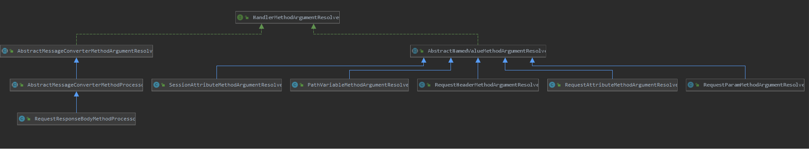
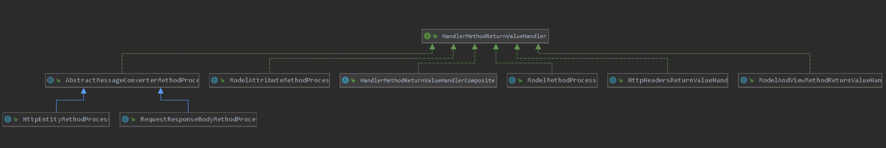
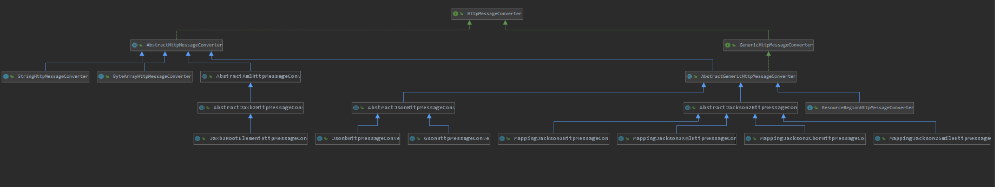

# @RequestBody  @ResponseBody实现

## 1. 参数解析

### 1.1 参数解析接口

spring中提供了一个顶级的参数解析接口，用于接口request中的参数到controller中。

> org.springframework.web.method.support.HandlerMethodArgumentResolver

```java
public interface HandlerMethodArgumentResolver {
	// 是否支持对 parameter的解析
	boolean supportsParameter(MethodParameter parameter);
	
    // 具体的解析
	@Nullable
	Object resolveArgument(MethodParameter parameter, @Nullable ModelAndViewContainer mavContainer,
			NativeWebRequest webRequest, @Nullable WebDataBinderFactory binderFactory) throws Exception;

}
```



可以看到此参数解析接口的实现类，包含了：path参数解析，session属性，requestHeader，cookie，requestBody等参数的解析

### 1.2 参数解析器的初始化

上面了解了参数解析器的整体轮廓，那这些解析器是什么是否初始化的呢？

在mvc namespace初始化时，会注册一个解析器:

> org.springframework.web.servlet.config.MvcNamespaceHandler#init

```java
	@Override
	public void init() {
		// 注册mvc namespace下的 xml node 节点的 handler
		registerBeanDefinitionParser("annotation-driven", new AnnotationDrivenBeanDefinitionParser());
        ....
    }
```

> org.springframework.web.servlet.config.AnnotationDrivenBeanDefinitionParser#parse

```java
	@Override
	@Nullable
	public BeanDefinition parse(Element element, ParserContext context) {
		.....
		// 消息转换器
		ManagedList<?> messageConverters = getMessageConverters(element, source, context);
		// 参数解析器
		ManagedList<?> argumentResolvers = getArgumentResolvers(element, context);
		// 返回值 处理器
		ManagedList<?> returnValueHandlers = getReturnValueHandlers(element, context);
		//RequestMappingHandlerAdapter 初始化了 springmvc的 参数解析器
		RootBeanDefinition handlerAdapterDef = new RootBeanDefinition(RequestMappingHandlerAdapter.class);
        handlerAdapterDef.setSource(source);
		handlerAdapterDef.setRole(BeanDefinition.ROLE_INFRASTRUCTURE);
		handlerAdapterDef.getPropertyValues().add("contentNegotiationManager", contentNegotiationManager);
		handlerAdapterDef.getPropertyValues().add("webBindingInitializer", bindingDef);
		handlerAdapterDef.getPropertyValues().add("messageConverters", messageConverters);
		addRequestBodyAdvice(handlerAdapterDef);
		addResponseBodyAdvice(handlerAdapterDef);
        ...
    }
```

而在RequestMappingHandlerAdapter此初始化时，会注册springmvc中的参数解析器:

> org.springframework.web.servlet.mvc.method.annotation.RequestMappingHandlerAdapter#afterPropertiesSet

```java
	public void afterPropertiesSet() {
		// Do this first, it may add ResponseBody advice beans
		// 初始化 那些 controlerAdvice注解的bean
		initControllerAdviceCache();

		if (this.argumentResolvers == null) {
			// getDefaultArgumentResolvers 注册了各种处理器
			// 如 @RequestBody
			List<HandlerMethodArgumentResolver> resolvers = getDefaultArgumentResolvers();
			this.argumentResolvers = new HandlerMethodArgumentResolverComposite().addResolvers(resolvers);
		}
		if (this.initBinderArgumentResolvers == null) {
			// getDefaultInitBinderArgumentResolvers 各种参数绑定器
			// 如 @Pathvariable
			List<HandlerMethodArgumentResolver> resolvers = getDefaultInitBinderArgumentResolvers();
			this.initBinderArgumentResolvers = new HandlerMethodArgumentResolverComposite().addResolvers(resolvers);
		}
		if (this.returnValueHandlers == null) {
			// getDefaultReturnValueHandlers 参数返回值解析如 @Respnsebody的使用
			List<HandlerMethodReturnValueHandler> handlers = getDefaultReturnValueHandlers();
			this.returnValueHandlers = new HandlerMethodReturnValueHandlerComposite().addHandlers(handlers);
		}
	}
```

可以看到这里注册了默认的参数解析器，initbinder参数解析器，以及返回值handler。

#### 1.2.1  注册参数解析器

> org.springframework.web.servlet.mvc.method.annotation.RequestMappingHandlerAdapter#getDefaultArgumentResolvers

```java
// 参数解析器
private List<HandlerMethodArgumentResolver> getDefaultArgumentResolvers() {
    List<HandlerMethodArgumentResolver> resolvers = new ArrayList<>();

    // Annotation-based argument resolution
    resolvers.add(new RequestParamMethodArgumentResolver(getBeanFactory(), false));
    resolvers.add(new RequestParamMapMethodArgumentResolver());
    // 路径参数
    resolvers.add(new PathVariableMethodArgumentResolver());
    resolvers.add(new PathVariableMapMethodArgumentResolver());
    resolvers.add(new MatrixVariableMethodArgumentResolver());
    resolvers.add(new MatrixVariableMapMethodArgumentResolver());
    resolvers.add(new ServletModelAttributeMethodProcessor(false));
    // requestBody  responseBody
    resolvers.add(new RequestResponseBodyMethodProcessor(getMessageConverters(), this.requestResponseBodyAdvice));
    resolvers.add(new RequestPartMethodArgumentResolver(getMessageConverters(), this.requestResponseBodyAdvice));
    // 请求 header
    resolvers.add(new RequestHeaderMethodArgumentResolver(getBeanFactory()));
    resolvers.add(new RequestHeaderMapMethodArgumentResolver());
    // cookie 处理
    resolvers.add(new ServletCookieValueMethodArgumentResolver(getBeanFactory()));
    // 表达式参数
    resolvers.add(new ExpressionValueMethodArgumentResolver(getBeanFactory()));
    // sessionAttribute
    resolvers.add(new SessionAttributeMethodArgumentResolver());
    // requestAttribute
    resolvers.add(new RequestAttributeMethodArgumentResolver());

    // Type-based argument resolution
    resolvers.add(new ServletRequestMethodArgumentResolver());
    resolvers.add(new ServletResponseMethodArgumentResolver());
    resolvers.add(new HttpEntityMethodProcessor(getMessageConverters(), this.requestResponseBodyAdvice));
    resolvers.add(new RedirectAttributesMethodArgumentResolver());
    resolvers.add(new ModelMethodProcessor());
    resolvers.add(new MapMethodProcessor());
    resolvers.add(new ErrorsMethodArgumentResolver());
    resolvers.add(new SessionStatusMethodArgumentResolver());
    resolvers.add(new UriComponentsBuilderMethodArgumentResolver());

    // Custom arguments
    if (getCustomArgumentResolvers() != null) {
        resolvers.addAll(getCustomArgumentResolvers());
    }

    // Catch-all
    resolvers.add(new RequestParamMethodArgumentResolver(getBeanFactory(), true));
    resolvers.add(new ServletModelAttributeMethodProcessor(true));

    return resolvers;
}
```


#### 1.2.2  注册initbinder解析器

> org.springframework.web.servlet.mvc.method.annotation.RequestMappingHandlerAdapter#getDefaultInitBinderArgumentResolvers

```java
// 参数 binder
private List<HandlerMethodArgumentResolver> getDefaultInitBinderArgumentResolvers() {
    List<HandlerMethodArgumentResolver> resolvers = new ArrayList<>();

    // Annotation-based argument resolution
    resolvers.add(new RequestParamMethodArgumentResolver(getBeanFactory(), false));
    resolvers.add(new RequestParamMapMethodArgumentResolver());
    resolvers.add(new PathVariableMethodArgumentResolver());
    resolvers.add(new PathVariableMapMethodArgumentResolver());
    resolvers.add(new MatrixVariableMethodArgumentResolver());
    resolvers.add(new MatrixVariableMapMethodArgumentResolver());
    resolvers.add(new ExpressionValueMethodArgumentResolver(getBeanFactory()));
    resolvers.add(new SessionAttributeMethodArgumentResolver());
    resolvers.add(new RequestAttributeMethodArgumentResolver());

    // Type-based argument resolution
    resolvers.add(new ServletRequestMethodArgumentResolver());
    resolvers.add(new ServletResponseMethodArgumentResolver());

    // Custom arguments
    if (getCustomArgumentResolvers() != null) {
        resolvers.addAll(getCustomArgumentResolvers());
    }

    // Catch-all
    resolvers.add(new RequestParamMethodArgumentResolver(getBeanFactory(), true));

    return resolvers;
}
```


#### 1.2.3 returnValue handler 注册

> org.springframework.web.servlet.mvc.method.annotation.RequestMappingHandlerAdapter#getDefaultReturnValueHandlers

```java
// 响应 处理器  responseHandler
private List<HandlerMethodReturnValueHandler> getDefaultReturnValueHandlers() {
    List<HandlerMethodReturnValueHandler> handlers = new ArrayList<>();

    // Single-purpose return value types
    handlers.add(new ModelAndViewMethodReturnValueHandler());
    handlers.add(new ModelMethodProcessor());
    //
    handlers.add(new ViewMethodReturnValueHandler());
    // responseBody 处理器
    handlers.add(new ResponseBodyEmitterReturnValueHandler(getMessageConverters(),
                                                           this.reactiveAdapterRegistry, this.taskExecutor, this.contentNegotiationManager));
    // streaming 流处理
    handlers.add(new StreamingResponseBodyReturnValueHandler());
    // httpEntity 处理
    handlers.add(new HttpEntityMethodProcessor(getMessageConverters(),
                                               this.contentNegotiationManager, this.requestResponseBodyAdvice));
    // responseHeader
    handlers.add(new HttpHeadersReturnValueHandler());
    // callable 方法
    handlers.add(new CallableMethodReturnValueHandler());
    // DeferredResult 处理
    handlers.add(new DeferredResultMethodReturnValueHandler());
    // asyncTask  处理
    handlers.add(new AsyncTaskMethodReturnValueHandler(this.beanFactory));

    // Annotation-based return value types
    handlers.add(new ModelAttributeMethodProcessor(false));
    handlers.add(new RequestResponseBodyMethodProcessor(getMessageConverters(),
                                                        this.contentNegotiationManager, this.requestResponseBodyAdvice));

    // Multi-purpose return value types
    handlers.add(new ViewNameMethodReturnValueHandler());
    handlers.add(new MapMethodProcessor());

    // Custom return value types
    if (getCustomReturnValueHandlers() != null) {
        handlers.addAll(getCustomReturnValueHandlers());
    }

    // Catch-all
    if (!CollectionUtils.isEmpty(getModelAndViewResolvers())) {
        handlers.add(new ModelAndViewResolverMethodReturnValueHandler(getModelAndViewResolvers()));
    }
    else {
        handlers.add(new ModelAttributeMethodProcessor(true));
    }

    return handlers;
}
```

通过这里就完成了request 参数解析器、initBinder 参数解析器以及 returnValue handler的注册。下面就看一下其在什么时候发挥作用。

### 1.3 参数解析器的调用点

方法的调用从dispatcherServlet进行请求的分发开始:

> org.springframework.web.servlet.DispatcherServlet#doDispatch   --->  
>
> org.springframework.web.servlet.HandlerAdapter#handle  ---> 
>
> org.springframework.web.servlet.mvc.method.annotation.RequestMappingHandlerAdapter#handleInternal  -->
>
> org.springframework.web.servlet.mvc.method.annotation.RequestMappingHandlerAdapter#invokeHandlerMethod  --->
>
> org.springframework.web.servlet.mvc.method.annotation.ServletInvocableHandlerMethod#invokeAndHandle

```java
// 调用requestMapping方法并使用HandlerMethodReturnValueHandler对返回值进行处理
public void invokeAndHandle(ServletWebRequest webRequest, ModelAndViewContainer mavContainer,
                            Object... providedArgs) throws Exception {
    // 1. 正常的http请求,调用controller方法
    // 2. 统一异常处理时,调用异常的方法来处理exception
    // 3. 此种保存了对各种请求参数的处理,其中包含了  @RequestBody注解
    Object returnValue = invokeForRequest(webRequest, mavContainer, providedArgs);
    setResponseStatus(webRequest);

    if (returnValue == null) {
        if (isRequestNotModified(webRequest) || getResponseStatus() != null || mavContainer.isRequestHandled()) {
            mavContainer.setRequestHandled(true);
            return;
        }
    }
    else if (StringUtils.hasText(getResponseStatusReason())) {
        mavContainer.setRequestHandled(true);
        return;
    }
    // 记录此 request 还没有处理完成
    mavContainer.setRequestHandled(false);
    Assert.state(this.returnValueHandlers != null, "No return value handlers");
    try {
        // 对方法的返回结果进行处理
        // 此中包含了对 responseBody的处理
        this.returnValueHandlers.handleReturnValue(
            returnValue, getReturnValueType(returnValue), mavContainer, webRequest);
    }
    catch (Exception ex) {
        if (logger.isTraceEnabled()) {
            logger.trace(formatErrorForReturnValue(returnValue), ex);
        }
        throw ex;
    }
}
```

在`invokeAndHandle -> invokeForRequest` 中进行了controller 方法的参数解析，以及具体方法的调用，而调用完成后，又在`invokeAndHandle ->this.returnValueHandlers.handleReturnValue` 中对返回值进行处理。

故，RequestBody的具体解析在`invokeAndHandle -> invokeForRequest`中调用。

> org.springframework.web.method.support.InvocableHandlerMethod#invokeForRequest

```java
// 先解析业务method的参数,之后调用 具体的业务函数,
@Nullable
public Object invokeForRequest(NativeWebRequest request, @Nullable ModelAndViewContainer mavContainer,
                               Object... providedArgs) throws Exception {
    // 解析参数
    // 方法调用的参数注入 就是在这里实现的
    Object[] args = getMethodArgumentValues(request, mavContainer, providedArgs);
    if (logger.isTraceEnabled()) {
        logger.trace("Arguments: " + Arrays.toString(args));
    }
    // 真实调用方法
    return doInvoke(args);
}
```

> org.springframework.web.method.support.InvocableHandlerMethod#getMethodArgumentValues

```java
// 解析方法执行时的参数
protected Object[] getMethodArgumentValues(NativeWebRequest request, @Nullable ModelAndViewContainer mavContainer,
                                           Object... providedArgs) throws Exception {

    // 获取方法的参数,当初在解析方法时,已经解析其参数类型,并保存
    MethodParameter[] parameters = getMethodParameters();
    Object[] args = new Object[parameters.length];
    // 遍历所有的参数 来进行解析
    for (int i = 0; i < parameters.length; i++) {
        MethodParameter parameter = parameters[i];
        parameter.initParameterNameDiscovery(this.parameterNameDiscoverer);
        args[i] = findProvidedArgument(parameter, providedArgs);
        if (args[i] != null) {
            continue;
        }
        // 获取参数解析器
        if (!this.resolvers.supportsParameter(parameter)) {
            throw new IllegalStateException(formatArgumentError(parameter, "No suitable resolver"));
        }
        try {
            // 方法参数解析器 解析参数
            args[i] = this.resolvers.resolveArgument(parameter, mavContainer, request, this.dataBinderFactory);
        }
        ...
    }
    return args;
}
```

#### 1.3.1 获取解析器

> org.springframework.web.method.support.HandlerMethodArgumentResolverComposite#supportsParameter

```java
// 判断是否有支持此参数的参数解析器
	@Override
	public boolean supportsParameter(MethodParameter parameter) {
		return getArgumentResolver(parameter) != null;
	}
```

> org.springframework.web.method.support.HandlerMethodArgumentResolverComposite#getArgumentResolver

```java
// 从注册的参数解析器中查找合适的解析器
@Nullable
private HandlerMethodArgumentResolver getArgumentResolver(MethodParameter parameter) {
    HandlerMethodArgumentResolver result = this.argumentResolverCache.get(parameter);
    if (result == null) {
        // 遍历所有的参数解析器 来进行查找
        for (HandlerMethodArgumentResolver methodArgumentResolver : this.argumentResolvers) {
            if (methodArgumentResolver.supportsParameter(parameter)) {
                result = methodArgumentResolver;
                this.argumentResolverCache.put(parameter, result);
                break;
            }
        }
    }
    return result;
}
```

> org.springframework.web.method.support.HandlerMethodArgumentResolverComposite#resolveArgument

```java
// 解析参数
@Override
@Nullable
public Object resolveArgument(MethodParameter parameter, @Nullable ModelAndViewContainer mavContainer,
                              NativeWebRequest webRequest, @Nullable WebDataBinderFactory binderFactory) throws Exception {
    // 获取对应的参数 解析器
    HandlerMethodArgumentResolver resolver = getArgumentResolver(parameter);
    if (resolver == null) {
        throw new IllegalArgumentException(
            "Unsupported parameter type [" + parameter.getParameterType().getName() + "]." +
            " supportsParameter should be called first.");
    }
    // 解析参数
    return resolver.resolveArgument(parameter, mavContainer, webRequest, binderFactory);
}
```

这里就是获取解析器，然后对参数进行解析。

### 1.4 requestBody的解析

> org.springframework.web.servlet.mvc.method.annotation.RequestResponseBodyMethodProcessor#supportsParameter

```java
// 对 requestBody 注解的处理
@Override
public boolean supportsParameter(MethodParameter parameter) {
    return parameter.hasParameterAnnotation(RequestBody.class);
}
```

由此可见此RequestResponseBodyMethodProcessor处理器是对有RequestBody的参数进行解析的。

具体的解析动作:

> org.springframework.web.servlet.mvc.method.annotation.RequestResponseBodyMethodProcessor#resolveArgument

```java
// 解析参数
@Override
public Object resolveArgument(MethodParameter parameter, @Nullable ModelAndViewContainer mavContainer,
                              NativeWebRequest webRequest, @Nullable WebDataBinderFactory binderFactory) throws Exception {

    parameter = parameter.nestedIfOptional();
    // 解析参数, 在这里就是对 RequestBody的 解析
    // 即解析 body 中的数据
    Object arg = readWithMessageConverters(webRequest, parameter, parameter.getNestedGenericParameterType());
    // 获取参数名字
    String name = Conventions.getVariableNameForParameter(parameter);
    // 把参数进行绑定
    if (binderFactory != null) {
        // 这里进行了参数和解析结果的绑定
        WebDataBinder binder = binderFactory.createBinder(webRequest, arg, name);
        if (arg != null) {
            validateIfApplicable(binder, parameter);
            if (binder.getBindingResult().hasErrors() && isBindExceptionRequired(binder, parameter)) {
                throw new MethodArgumentNotValidException(parameter, binder.getBindingResult());
            }
        }
        if (mavContainer != null) {
            // 这里记录 绑定的结果
            mavContainer.addAttribute(BindingResult.MODEL_KEY_PREFIX + name, binder.getBindingResult());
        }
    }

    return adaptArgumentIfNecessary(arg, parameter);
}
```

> org.springframework.web.servlet.mvc.method.annotation.RequestResponseBodyMethodProcessor#readWithMessageConverters

```java
	// 通过 convert对 body参数进行解析
	@Override
	protected <T> Object readWithMessageConverters(NativeWebRequest webRequest, MethodParameter parameter,
			Type paramType) throws IOException, HttpMediaTypeNotSupportedException, HttpMessageNotReadableException {
		HttpServletRequest servletRequest = webRequest.getNativeRequest(HttpServletRequest.class);
		// 封装 HttpServletRequest
		ServletServerHttpRequest inputMessage = new ServletServerHttpRequest(servletRequest);
		// 解析参数,可能是 json 或者是 直接就是字符串
		Object arg = readWithMessageConverters(inputMessage, parameter, paramType);
		return arg;
	}
```

> org.springframework.web.servlet.mvc.method.annotation.AbstractMessageConverterMethodArgumentResolver#readWithMessageConverters(org.springframework.http.HttpInputMessage, org.springframework.core.MethodParameter, java.lang.reflect.Type)

```java
// 本次分析的是 @RequestBody处理
// 此处会把 request body中的数据通过jackson 把json数据进行读取,或者封装到 bean中
@SuppressWarnings("unchecked")
@Nullable
protected <T> Object readWithMessageConverters(HttpInputMessage inputMessage, MethodParameter parameter,
                                               Type targetType) throws IOException, HttpMediaTypeNotSupportedException, HttpMessageNotReadableException {

    MediaType contentType;
    boolean noContentType = false;
    try {
        // 获取请求头中的 contentType
        contentType = inputMessage.getHeaders().getContentType();
    }
    //
    Class<?> contextClass = parameter.getContainingClass();
    // 参数的类型
    Class<T> targetClass = (targetType instanceof Class ? (Class<T>) targetType : null);
    if (targetClass == null) {
        ResolvableType resolvableType = ResolvableType.forMethodParameter(parameter);
        targetClass = (Class<T>) resolvableType.resolve();
    }
    // 请求方法
    HttpMethod httpMethod = (inputMessage instanceof HttpRequest ? ((HttpRequest) inputMessage).getMethod() : null);
    Object body = NO_VALUE;

    EmptyBodyCheckingHttpInputMessage message;
    try {
        message = new EmptyBodyCheckingHttpInputMessage(inputMessage);
        //  通过  messageConvert 对数据进行转换
        // 这里遍历的所有的  转换器,对数据进行转换
        for (HttpMessageConverter<?> converter : this.messageConverters) {
            Class<HttpMessageConverter<?>> converterType = (Class<HttpMessageConverter<?>>) converter.getClass();
            GenericHttpMessageConverter<?> genericConverter =
                (converter instanceof GenericHttpMessageConverter ? (GenericHttpMessageConverter<?>) converter : null);
            if (genericConverter != null ? genericConverter.canRead(targetType, contextClass, contentType) :
                (targetClass != null && converter.canRead(targetClass, contentType))) {
                if (message.hasBody()) {
                    HttpInputMessage msgToUse =
                        getAdvice().beforeBodyRead(message, parameter, targetType, converterType);
                    // 这里最终使用org.springframework.http.converter.json.GsonHttpMessageConverter 来解析json数据
						// 默认使用 HttpMessageConverter 来解析数据
                    body = (genericConverter != null ? genericConverter.read(targetType, contextClass, msgToUse) :
                            ((HttpMessageConverter<T>) converter).read(targetClass, msgToUse));
                    body = getAdvice().afterBodyRead(body, msgToUse, parameter, targetType, converterType);
                }
                else {
                    body = getAdvice().handleEmptyBody(null, message, parameter, targetType, converterType);
                }
                break;
            }
        }
    }

    return body;
}
```

可以看到，最终是使用各种的convertor转换器对数据进行转换。


## 2. 返回值解析

### 2.1 返回值解析接口

> org.springframework.web.method.support.HandlerMethodReturnValueHandler

```java
public interface HandlerMethodReturnValueHandler {
	// 是否支持此返回值
    boolean supportsReturnType(MethodParameter returnType);
    // 对返回值的解析
    void handleReturnValue(@Nullable Object returnValue, MethodParameter returnType,
                           ModelAndViewContainer mavContainer, NativeWebRequest webRequest) throws Exception;
}
```



可以看到起实现类(此图显示了部分)包括了对各种响应值的处理

###  2.2 返回值解析器初始化

见 上面 [1.2.3](#1.2.3 returnValue handler 注册)

### 2.3 返回值解析器的调用点

见 上面 [1.3](#1.3 参数解析器的调用点)

### 2.4 responseBody解析器的处理

> org.springframework.web.servlet.mvc.method.annotation.RequestResponseBodyMethodProcessor#supportsReturnType

```java
// 对 responseBody注解的处理
@Override
public boolean supportsReturnType(MethodParameter returnType) {
    return (AnnotatedElementUtils.hasAnnotation(returnType.getContainingClass(), ResponseBody.class) ||
            returnType.hasMethodAnnotation(ResponseBody.class));
}
```

> org.springframework.web.servlet.mvc.method.annotation.RequestResponseBodyMethodProcessor#handleReturnValue

```java
	// 针对 有responseBody注解的存在的,则直接把数据转换为 json写出
	@Override
	public void handleReturnValue(@Nullable Object returnValue, MethodParameter returnType,
			ModelAndViewContainer mavContainer, NativeWebRequest webRequest)
			throws IOException, HttpMediaTypeNotAcceptableException, HttpMessageNotWritableException {
			///  标记此 request 被处理
        // 这样到下面 render 渲染的是否，就不会再进行渲染的操作了
		mavContainer.setRequestHandled(true);
		ServletServerHttpRequest inputMessage = createInputMessage(webRequest);
		ServletServerHttpResponse outputMessage = createOutputMessage(webRequest);

		// Try even with null return value. ResponseBodyAdvice could get involved.
		// 把数据进行响应
		writeWithMessageConverters(returnValue, returnType, inputMessage, outputMessage);
	}
```

>org.springframework.web.servlet.mvc.method.annotation.AbstractMessageConverterMethodProcessor#writeWithMessageConverters(T, org.springframework.core.MethodParameter, org.springframework.http.server.ServletServerHttpRequest, org.springframework.http.server.ServletServerHttpResponse)

```java
// 对数据进行转换并响应
	@SuppressWarnings({"rawtypes", "unchecked"})
	protected <T> void writeWithMessageConverters(@Nullable T value, MethodParameter returnType,
			ServletServerHttpRequest inputMessage, ServletServerHttpResponse outputMessage)
			throws IOException, HttpMediaTypeNotAcceptableException, HttpMessageNotWritableException {
			... // 省略非关键代码
         // 遍历所有的转换器来进行数据的转换 并输出
		if (selectedMediaType != null) {
			selectedMediaType = selectedMediaType.removeQualityValue();
			// 在这里也会遍历所有的 转换器 来进行数据的转换
			// 转换完成后 再把数据写出
			for (HttpMessageConverter<?> converter : this.messageConverters) {
				GenericHttpMessageConverter genericConverter = (converter instanceof GenericHttpMessageConverter ?
						(GenericHttpMessageConverter<?>) converter : null);
				if (genericConverter != null ?
						((GenericHttpMessageConverter) converter).canWrite(targetType, valueType, selectedMediaType) :
						converter.canWrite(valueType, selectedMediaType)) {
					// 数据转换前的操作
					body = getAdvice().beforeBodyWrite(body, returnType, selectedMediaType,
							(Class<? extends HttpMessageConverter<?>>) converter.getClass(),
							inputMessage, outputMessage);
					if (body != null) {
						Object theBody = body;
						LogFormatUtils.traceDebug(logger, traceOn ->
								"Writing [" + LogFormatUtils.formatValue(theBody, traceOn) + "]");
						addContentDispositionHeader(inputMessage, outputMessage);
						if (genericConverter != null) {
							// 写出数据
							// 具体的写出点
							genericConverter.write(body, targetType, selectedMediaType, outputMessage);
						}
						else {
							// 如果没有找到合适的,则使用 默认的写出
							((HttpMessageConverter) converter).write(body, selectedMediaType, outputMessage);
						}
					}
					else {
						if (logger.isDebugEnabled()) {
							logger.debug("Nothing to write: null body");
						}
					}
					return;
				}
			}
		}
	}
```


## 3. 转换器

### 3.1 转换器接口

> org.springframework.http.converter.HttpMessageConverter

```java
// 数据转换
public interface HttpMessageConverter<T> {

    // 判断是否支持 此 mediaType的读
    boolean canRead(Class<?> clazz, @Nullable MediaType mediaType);

	// 判断是否支持此 MediaType数据的写
    boolean canWrite(Class<?> clazz, @Nullable MediaType mediaType);

	// 获取支持的 mediaType
    List<MediaType> getSupportedMediaTypes();

	// 进行数据的读  并转换
    T read(Class<? extends T> clazz, HttpInputMessage inputMessage)
        throws IOException, HttpMessageNotReadableException;

    // 把数据进行转换,并写出
    void write(T t, @Nullable MediaType contentType, HttpOutputMessage outputMessage)
        throws IOException, HttpMessageNotWritableException;
}

```



可以看到很多具体的转换器，包括json的数据转换。有需要的就看详细的具体类实现，在这里就不全部展开了。

到这里就对responseBody  requestBody以及一些其他的参数解析，响应解析有了一个大概的了解了，想了解具体哪个方式如何实现，就去查看具体的类实现就好。


