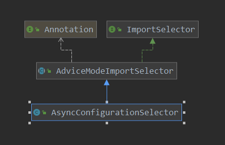
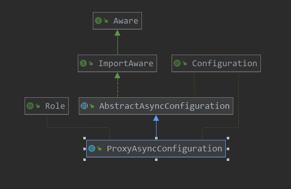
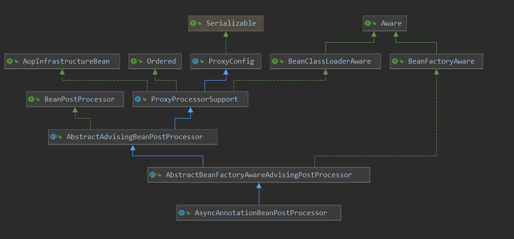
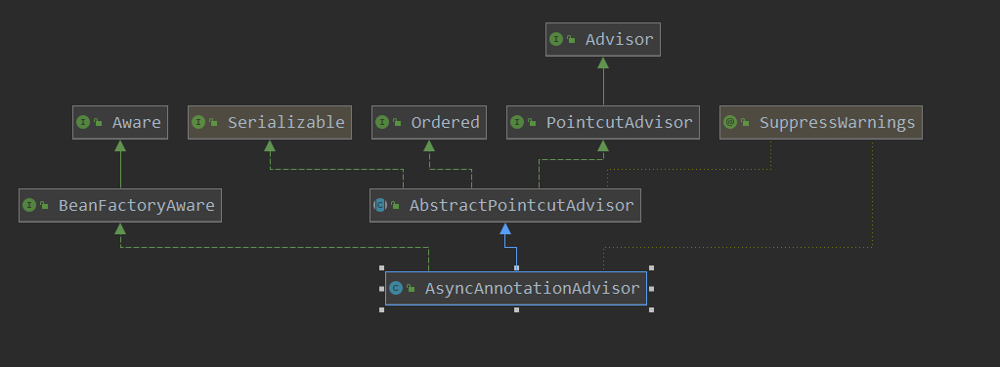
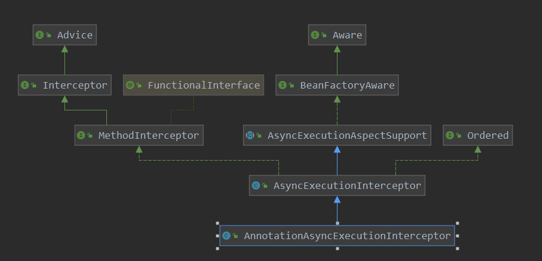
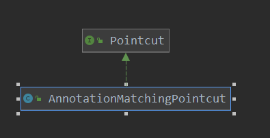

[TOC]

# Async的实现原理

看完了async的使用，这里来说明一下其实现的原理。 先从 EnableAsync注解入手把。

```java
@Target(ElementType.TYPE)
@Retention(RetentionPolicy.RUNTIME)
@Documented
@Import(AsyncConfigurationSelector.class)
public @interface EnableAsync {
	Class<? extends Annotation> annotation() default Annotation.class;
	boolean proxyTargetClass() default false;
	AdviceMode mode() default AdviceMode.PROXY;
	int order() default Ordered.LOWEST_PRECEDENCE;
}
```

这里注入了一个类，此方式就不感新奇了，springboot常用的方式。

看一下注入的那个类的类图：



看一下看到其主要还是向容器中进行bean的注入：

> org.springframework.context.annotation.AdviceModeImportSelector#selectImports

```java
@Override
public final String[] selectImports(AnnotationMetadata importingClassMetadata) {
    Class<?> annType = GenericTypeResolver.resolveTypeArgument(getClass(), AdviceModeImportSelector.class);
    Assert.state(annType != null, "Unresolvable type argument for AdviceModeImportSelector");

    AnnotationAttributes attributes = AnnotationConfigUtils.attributesFor(importingClassMetadata, annType);
    if (attributes == null) {
        throw new IllegalArgumentException(String.format(
            "@%s is not present on importing class '%s' as expected",
            annType.getSimpleName(), importingClassMetadata.getClassName()));
    }
    // 事务代理的模式
    // 事务的操作和此此类，同样是根据子类来创建要注入的类的 全类名
    // 这里对 async的处理,也使用了此方法,根据不同的子类来实现不同的功能
    // 模板模式哦
    AdviceMode adviceMode = attributes.getEnum(getAdviceModeAttributeName());
    // 根据模式的不同 来注入不同的bean到容器中
    String[] imports = selectImports(adviceMode);
    if (imports == null) {
        throw new IllegalArgumentException("Unknown AdviceMode: " + adviceMode);
    }
    return imports;
}
```

> org.springframework.scheduling.annotation.AsyncConfigurationSelector#selectImports

```java
@Override
@Nullable
public String[] selectImports(AdviceMode adviceMode) {
    switch (adviceMode) {
        case PROXY:
            return new String[] {ProxyAsyncConfiguration.class.getName()};
        case ASPECTJ:
            return new String[] {ASYNC_EXECUTION_ASPECT_CONFIGURATION_CLASS_NAME};
        default:
            return null;
    }
}
```

这里根据不同的注入模式，来注入不同的bean到容器中。这里咱们分析一下JDK的处理ProxyAsyncConfiguration。先来分析一下此注入的类的作用：



```java
@Configuration
public abstract class AbstractAsyncConfiguration implements ImportAware {
    // 存储 @Async注解的属性信息
    @Nullable
    protected AnnotationAttributes enableAsync;
    // 记录配置的线程池
    @Nullable
    protected Supplier<Executor> executor;
    // 记录配置的 未捕获异常的处理函数
    @Nullable
    protected Supplier<AsyncUncaughtExceptionHandler> exceptionHandler;

	// 获取注解的那些信息
    @Override
    public void setImportMetadata(AnnotationMetadata importMetadata) {
        this.enableAsync = AnnotationAttributes.fromMap(
            importMetadata.getAnnotationAttributes(EnableAsync.class.getName(), false));
        if (this.enableAsync == null) {
            throw new IllegalArgumentException( "@EnableAsync is not present on importing class " + importMetadata.getClassName());
        }
    }

    /**
	 * Collect any {@link AsyncConfigurer} beans through autowiring.
	 */
    // 这里就可以看到,通过实现 AsyncConfigurer, 继承AsyncConfigurerSupport实现的配置,就这里进行了解析
    @Autowired(required = false)
    void setConfigurers(Collection<AsyncConfigurer> configurers) {
        if (CollectionUtils.isEmpty(configurers)) {
            return;
        }
        if (configurers.size() > 1) {
            throw new IllegalStateException("Only one AsyncConfigurer may exist");
        }
        AsyncConfigurer configurer = configurers.iterator().next();
        // 获取通过 AsyncConfigurer 实现的async的配置的线程池
        this.executor = configurer::getAsyncExecutor;
        // 获取通过 AsyncConfigurer 实现的 未捕获异常的处理
        this.exceptionHandler = configurer::getAsyncUncaughtExceptionHandler;
    }
}
```

可以看到，这里是一个配置类，其中解析了解析了 EnableAsync注解的信息，以及解析了 AsynConfigurer这些配置类。

```java
@Configuration
@Role(BeanDefinition.ROLE_INFRASTRUCTURE)
public class ProxyAsyncConfiguration extends AbstractAsyncConfiguration {

    @Bean(name = TaskManagementConfigUtils.ASYNC_ANNOTATION_PROCESSOR_BEAN_NAME)
    @Role(BeanDefinition.ROLE_INFRASTRUCTURE)
    public AsyncAnnotationBeanPostProcessor asyncAdvisor() {
        Assert.notNull(this.enableAsync, "@EnableAsync annotation metadata was not injected");
        // 创建后置处理器
        AsyncAnnotationBeanPostProcessor bpp = new AsyncAnnotationBeanPostProcessor();
        // 记录线程池  未捕获异常处理
        bpp.configure(this.executor, this.exceptionHandler);
        Class<? extends Annotation> customAsyncAnnotation = this.enableAsync.getClass("annotation");
        if (customAsyncAnnotation != AnnotationUtils.getDefaultValue(EnableAsync.class, "annotation")) {
            // 默认情况下 asyncAnnotationType 就是 注解EnableAsync中的 annotation的 值
            bpp.setAsyncAnnotationType(customAsyncAnnotation);
        }
        bpp.setProxyTargetClass(this.enableAsync.getBoolean("proxyTargetClass"));
        bpp.setOrder(this.enableAsync.<Integer>getNumber("order"));
        return bpp;
    }
}
```

这里主要就是创建AsyncAnnotationBeanPostProcessor一个后置处理器到容器中。

看一下此的类图：



在看一下其AsyncAnnotationBeanPostProcessor的构造函数，以及beanFactoryAware的回调函数：

```java
// 把 beforeExistingAdvisors 属性设置为 true
public AsyncAnnotationBeanPostProcessor() {
    setBeforeExistingAdvisors(true);
}
// org.springframework.aop.framework.AbstractAdvisingBeanPostProcessor#setBeforeExistingAdvisors

// 在子类 AsyncAnnotationBeanPostProcessor 中设置为true
public void setBeforeExistingAdvisors(boolean beforeExistingAdvisors) {
    this.beforeExistingAdvisors = beforeExistingAdvisors;
}
```

> org.springframework.scheduling.annotation.AsyncAnnotationBeanPostProcessor#setBeanFactory

```java
// AsyncAnnotationAdvisor 此种包含了  advice 以及 pointcut
@Override
public void setBeanFactory(BeanFactory beanFactory) {
    super.setBeanFactory(beanFactory);
    // 在此中设置了 Advisor --> AsyncAnnotationAdvisor
    AsyncAnnotationAdvisor advisor = new AsyncAnnotationAdvisor(this.executor, this.exceptionHandler);
    if (this.asyncAnnotationType != null) {
        advisor.setAsyncAnnotationType(this.asyncAnnotationType);
    }
    advisor.setBeanFactory(beanFactory);
    // 此advisor是 AsyncAnnotationAdvisor类型
    this.advisor = advisor;
}
```

在回调注入 beanFactory时，创建了AsyncAnnotationAdvisor；AsyncAnnotationAdvisor是一个非常重要的类，其创建了Async代理函数的 advice 以及  pointcut。



看一下此class的创建：

> org.springframework.scheduling.annotation.AsyncAnnotationAdvisor#AsyncAnnotationAdvisor

```java
public AsyncAnnotationAdvisor(
    @Nullable Supplier<Executor> executor, @Nullable Supplier<AsyncUncaughtExceptionHandler> exceptionHandler) {

    Set<Class<? extends Annotation>> asyncAnnotationTypes = new LinkedHashSet<>(2);
    // 此中添加了 Async 和 Asynchronous 注解
    asyncAnnotationTypes.add(Async.class);
    try {
        asyncAnnotationTypes.add((Class<? extends Annotation>)ClassUtils.forName("javax.ejb.Asynchronous",AsyncAnnotationAdvisor.class.getClassLoader()));
    }
    catch (ClassNotFoundException ex) {
        // If EJB 3.1 API not present, simply ignore.
    }
    // 创建此 async的 advice
    this.advice = buildAdvice(executor, exceptionHandler);
    // 创建pointCut
    // 这里的pointcut 使用了上面创建的 asyncAnnotationTypes, 这里的asyncAnnotationTypes包含了 Async Asynchronous
    // 也就是使用此 pointcut去进行匹配时, 或使用 Async 和 Asynchronous 两个注解去进行匹配
    this.pointcut = buildPointcut(asyncAnnotationTypes);
}
```

> org.springframework.scheduling.annotation.AsyncAnnotationAdvisor#buildAdvice

```java
// 创建 advice
protected Advice buildAdvice(
    @Nullable Supplier<Executor> executor, @Nullable Supplier<AsyncUncaughtExceptionHandler> exceptionHandler) {
    // 在 advice中创建了  methodInterceptor
    AnnotationAsyncExecutionInterceptor interceptor = new AnnotationAsyncExecutionInterceptor(null);
    // 配置 线程池 和 未捕获异常处理方法
    interceptor.configure(executor, exceptionHandler);
    return interceptor;
}
```

看一下此拦截器的类图：



看一下AnnotationAsyncExecutionInterceptor的构建：

```java
public AnnotationAsyncExecutionInterceptor(@Nullable Executor defaultExecutor) {
    super(defaultExecutor);
}

public AsyncExecutionInterceptor(@Nullable Executor defaultExecutor) {
    super(defaultExecutor);
}
// 此中比较重要, 创建了默认的 执行线程池,以及未捕获异常 处理函数
public AsyncExecutionAspectSupport(@Nullable Executor defaultExecutor) {
    // 在构造函数中去获取 默认的 executor
    this.defaultExecutor = new SingletonSupplier<>(defaultExecutor, () -> getDefaultExecutor(this.beanFactory));
    // 创建的默认的 未捕获异常的 处理函数
    this.exceptionHandler = SingletonSupplier.of(SimpleAsyncUncaughtExceptionHandler::new);
}
```

> org.springframework.aop.interceptor.AsyncExecutionInterceptor#getDefaultExecutor

```java
@Override
@Nullable
protected Executor getDefaultExecutor(@Nullable BeanFactory beanFactory) {
    // 1. 先获取 TaskExecutor 类型的bean
    // 2. 获取名字为 TaskExecutor类型的bean
    // 3. 都没有,则使用默认的 SimpleAsyncTaskExecutor
    Executor defaultExecutor = super.getDefaultExecutor(beanFactory);
    return (defaultExecutor != null ? defaultExecutor : new SimpleAsyncTaskExecutor());
}
```

> org.springframework.aop.interceptor.AsyncExecutionAspectSupport#getDefaultExecutor

```java
// 默认的 要使用的线程池的 名字
public static final String DEFAULT_TASK_EXECUTOR_BEAN_NAME = "taskExecutor";

@Nullable
protected Executor getDefaultExecutor(@Nullable BeanFactory beanFactory) {
    if (beanFactory != null) {
        try {
            // 1. 首先获取 TaskExecutor 类型的bean
            return beanFactory.getBean(TaskExecutor.class);
        }
        catch (NoUniqueBeanDefinitionException ex) {
            logger.debug("Could not find unique TaskExecutor bean", ex);
            try {
                // 2. 如果没有TaskExecutor类型的bean,则获取 名字为 taskExecutor 的bean
                return beanFactory.getBean(DEFAULT_TASK_EXECUTOR_BEAN_NAME, Executor.class);
            }
            catch (NoSuchBeanDefinitionException ex2) {
                if (logger.isInfoEnabled()) {
                    logger.info("More than one TaskExecutor bean found within the context, and none is named " +"'taskExecutor'. Mark one of them as primary or name it 'taskExecutor' (possibly " +"as an alias) in order to use it for async processing: " + ex.getBeanNamesFound());
                }
            }
        }
        catch (NoSuchBeanDefinitionException ex) {
            logger.debug("Could not find default TaskExecutor bean", ex);
            try {
                return beanFactory.getBean(DEFAULT_TASK_EXECUTOR_BEAN_NAME, Executor.class);
            }
            catch (NoSuchBeanDefinitionException ex2) {
                logger.info("No task executor bean found for async processing: " +
                            "no bean of type TaskExecutor and no bean named 'taskExecutor' either");
            }
            // Giving up -> either using local default executor or none at all...
        }
    }
    return null;
}
```

到此就创建好了，默认的执行线程池，以及默认的未捕获异常处理函数。

> org.springframework.scheduling.annotation.AsyncAnnotationAdvisor#buildPointcut

```java
// 注意此处两个重要的 pointCut  AnnotationMatchingPointcut    AnnotationMatchingPointcut
// Async 和 Asynchronous 要匹配的注解
protected Pointcut buildPointcut(Set<Class<? extends Annotation>> asyncAnnotationTypes) {
    ComposablePointcut result = null;
    for (Class<? extends Annotation> asyncAnnotationType : asyncAnnotationTypes) {
        Pointcut cpc = new AnnotationMatchingPointcut(asyncAnnotationType, true);
        Pointcut mpc = new AnnotationMatchingPointcut(null, asyncAnnotationType, true);
        if (result == null) {
            result = new ComposablePointcut(cpc);
        }
        else {
            result.union(cpc);
        }
        result = result.union(mpc);
    }
    return (result != null ? result : Pointcut.TRUE);
}
```

 创建了AnnotationMatchingPointcut，及 pointcut，用于判断某个类是否需要创建对应的 async代理。



在看一下此处的pointcut：

```java
public AnnotationMatchingPointcut(Class<? extends Annotation> classAnnotationType, boolean checkInherited) {
    // 异常的 过滤
    // 这里的 AnnotationType 为 Async 或  Asynchronous
    // 因为上次 创建 pointcut时,创建了多个pointcut
    this.classFilter = new AnnotationClassFilter(classAnnotationType, checkInherited);
    // 方法 method, 默认为 true
    this.methodMatcher = MethodMatcher.TRUE;
}
```

> org.springframework.aop.support.annotation.AnnotationClassFilter#AnnotationClassFilter(java.lang.Class<? extends java.lang.annotation.Annotation>, boolean)

```java
public AnnotationClassFilter(Class<? extends Annotation> annotationType, boolean checkInherited) {
    Assert.notNull(annotationType, "Annotation type must not be null");
    // 此annotationtype的类型为 Async 或 Asynchronous
    // 此annotationType只能为其中之一,  因为会创建多个annotationClassFilter
    this.annotationType = annotationType;
    // 当进行 aync的匹配时, 此处设置的为true
    this.checkInherited = checkInherited;
}
```

pointcut实现:

```java
// org.springframework.aop.support.annotation.AnnotationMatchingPointcut

@Override
public ClassFilter getClassFilter() {
    return this.classFilter;
}
// 可见此处的 methodMatcher是 AnnotationClassFilter
@Override
public MethodMatcher getMethodMatcher() {
    return this.methodMatcher;
}
```

看一下AnnotationClassFilter的match方法:

> org.springframework.aop.support.annotation.AnnotationClassFilter#matches

```java
// pointcut进行匹配的方法
@Override
public boolean matches(Class<?> clazz) {
    // 如果设置了 checkInherited,则查找注解时,会从 类  接口  父类等去查找
    // 1. 先分析方法本身的注解
    // 2. 分析方法所在类 的接口的信息
    // 3. 分析方法的父类的注解信息
    // 4. 分析方法所在的类的父类的接口的注解信息
    // 分析类时 :
    // 1. 分析类的注解信息
    // 2. 分析类的父类的注解信息

    // 如果设置checkInherited 为false, 则只查找当前类
    return (this.checkInherited ? AnnotatedElementUtils.hasAnnotation(clazz, this.annotationType) :clazz.isAnnotationPresent(this.annotationType));
}
```

此处的匹配方式，注解的比较清楚了，就不展开代码再看一次了。

下面咱们往回拉一下，继续看一下AsyncAnnotationBeanPostProcessor的前后置处理方法的作用：

> org.springframework.aop.framework.AbstractAdvisingBeanPostProcessor#postProcessBeforeInitialization

```java

@Override
public Object postProcessBeforeInitialization(Object bean, String beanName) {
    return bean;
}

@Override
public Object postProcessAfterInitialization(Object bean, String beanName) {
    if (this.advisor == null || bean instanceof AopInfrastructureBean) {
        // Ignore AOP infrastructure such as scoped proxies.
        return bean;
    }
    if (bean instanceof Advised) {
        Advised advised = (Advised) bean;
        if (!advised.isFrozen() && isEligible(AopUtils.getTargetClass(bean))) {
            // Add our local Advisor to the existing proxy's Advisor chain...
            if (this.beforeExistingAdvisors) {
                advised.addAdvisor(0, this.advisor);
            }
            else {
                advised.addAdvisor(this.advisor);
            }
            return bean;
        }
    }
    if (isEligible(bean, beanName)) {
        ProxyFactory proxyFactory = prepareProxyFactory(bean, beanName);
        if (!proxyFactory.isProxyTargetClass()) {
            evaluateProxyInterfaces(bean.getClass(), proxyFactory);
        }
        // 此 advisor是 AsyncAnnotationAdvisor
        proxyFactory.addAdvisor(this.advisor);
        // 扩展 方法
        customizeProxyFactory(proxyFactory);
        // 创建方法的代理
        return proxyFactory.getProxy(getProxyClassLoader());
    }
    // No proxy needed.
    return bean;
}
```

此处重要的主要是后半段，先判断是否需要建立代理，之后就为其创建代理工厂，最后调用代理工厂类来创建代理类：

> org.springframework.aop.framework.autoproxy.AbstractBeanFactoryAwareAdvisingPostProcessor#isEligible

```java
@Override
protected boolean isEligible(Object bean, String beanName) {
    return (!AutoProxyUtils.isOriginalInstance(beanName, bean.getClass()) &&
            super.isEligible(bean, beanName));
}
```

> org.springframework.aop.framework.AbstractAdvisingBeanPostProcessor#isEligible(java.lang.Object, java.lang.String)

```java
protected boolean isEligible(Object bean, String beanName) {
    return isEligible(bean.getClass());
}
```

```java
protected boolean isEligible(Class<?> targetClass) {
    Boolean eligible = this.eligibleBeans.get(targetClass);
    if (eligible != null) {
        return eligible;
    }
    if (this.advisor == null) {
        return false;
    }
    // 使用AsyncAnnotationAdvisor 来判断此 class是否需要是需要创建 代理的
    eligible = AopUtils.canApply(this.advisor, targetClass);
    // eligibleBeans 记录对于此 PostProcessor 要进行创建aop代理的 class
    this.eligibleBeans.put(targetClass, eligible);
    return eligible;
}
```

> org.springframework.aop.support.AopUtils#canApply(org.springframework.aop.Advisor, java.lang.Class<?>)

```java
// 判断advisor是否能应用到targetClass
public static boolean canApply(Advisor advisor, Class<?> targetClass) {
    return canApply(advisor, targetClass, false);
}
```

```java
// 检测advisor能否应用到targetClass
public static boolean canApply(Advisor advisor, Class<?> targetClass, boolean hasIntroductions) {
    // 过滤规则
    if (advisor instanceof IntroductionAdvisor) {
        return ((IntroductionAdvisor) advisor).getClassFilter().matches(targetClass);
    }
    // 根据pointCut是进行匹配
    // 注意此 pca.getPointcut(),当是事务的时候,其返回的是 TransactionAttributeSourcePointcut
    // 当此处是 Async时,此处的 advisor是 AsyncAnnotationAdvisor
    else if (advisor instanceof PointcutAdvisor) {
        PointcutAdvisor pca = (PointcutAdvisor) advisor;
        return canApply(pca.getPointcut(), targetClass, hasIntroductions);
    }
    // 如果没有pointCut那么就认为是可用的
    else {
        // It doesn't have a pointcut so we assume it applies.
        return true;
    }
}
```

> org.springframework.aop.support.AopUtils#canApply(org.springframework.aop.Pointcut, java.lang.Class<?>, boolean)

```java
public static boolean canApply(Pointcut pc, Class<?> targetClass, boolean hasIntroductions) {
    Assert.notNull(pc, "Pointcut must not be null");
    if (!pc.getClassFilter().matches(targetClass)) {
        return false;
    }
    // 如果pointcut为AnnotationMatchingPointcut,则其 matchet,就是MethodMatcher.TRUE
    MethodMatcher methodMatcher = pc.getMethodMatcher();
    if (methodMatcher == MethodMatcher.TRUE) {
        // No need to iterate the methods if we're matching any method anyway...
        return true;
    }

    IntroductionAwareMethodMatcher introductionAwareMethodMatcher = null;
    if (methodMatcher instanceof IntroductionAwareMethodMatcher) {
        introductionAwareMethodMatcher = (IntroductionAwareMethodMatcher) methodMatcher;
    }
    Set<Class<?>> classes = new LinkedHashSet<>();
    if (!Proxy.isProxyClass(targetClass)) {
        classes.add(ClassUtils.getUserClass(targetClass));
    }
    classes.addAll(ClassUtils.getAllInterfacesForClassAsSet(targetClass));

    for (Class<?> clazz : classes) {
        // 获取所有声明的方法
        Method[] methods = ReflectionUtils.getAllDeclaredMethods(clazz);
        for (Method method : methods) {
        // 如果是事务创建代理, 会走methodMatcher.matches这里,这个方法会解析方法的注解信息 // introductionAwareMethodMatcher.matches 使用pointCut表达式调用AspectJ 来进行匹配操作
        // 如果是 async的匹配则是使用 AnnotationMatchingPointcut 来进行 match
            if (introductionAwareMethodMatcher != null ?
                introductionAwareMethodMatcher.matches(method, targetClass, hasIntroductions) :
                methodMatcher.matches(method, targetClass)) {
                return true;
            }
        }
    }
    return false;
}
```

这里简单说，就是获取pointcut的methodMatcher，调用其match方法来进行匹配，上面已经分析过pointcut的match方法，主要查找 Async , Asynchronous两个注解。

找到了呢，就会把此方法保存起来。

下面看一下对此方法创建代理的过程：

> org.springframework.aop.framework.autoproxy.AbstractBeanFactoryAwareAdvisingPostProcessor#prepareProxyFactory

```java
// 准备创建 针对 Async的 aop 工厂
@Override
protected ProxyFactory prepareProxyFactory(Object bean, String beanName) {
    if (this.beanFactory != null) {
        AutoProxyUtils.exposeTargetClass(this.beanFactory, beanName, bean.getClass());
    }
    // 创建的 ProxyFactory, 并使用其来创建代理类
    ProxyFactory proxyFactory = super.prepareProxyFactory(bean, beanName);
    if (!proxyFactory.isProxyTargetClass() && this.beanFactory != null &&
        AutoProxyUtils.shouldProxyTargetClass(this.beanFactory, beanName)) {
        proxyFactory.setProxyTargetClass(true);
    }
    return proxyFactory;
}
```

```java
protected ProxyFactory prepareProxyFactory(Object bean, String beanName) {
    ProxyFactory proxyFactory = new ProxyFactory();
    proxyFactory.copyFrom(this);
    proxyFactory.setTarget(bean);
    return proxyFactory;
}
```

> org.springframework.aop.framework.ProxyFactory#getProxy(java.lang.ClassLoader)

```java
// 创建代理
public Object getProxy(@Nullable ClassLoader classLoader) {
    // 先创建一个AopProxy类, 然后使用AopProxy进行具体的代理创建
    //
    return createAopProxy().getProxy(classLoader);
}

// 创建AopProxy实例
protected final synchronized AopProxy createAopProxy() {
    if (!this.active) {
        activate();
    }
    // 创建动作
    return getAopProxyFactory().createAopProxy(this);
}


// 具体创建AopProxy的动作
@Override
public AopProxy createAopProxy(AdvisedSupport config) throws AopConfigException {
    if (config.isOptimize() || config.isProxyTargetClass() || hasNoUserSuppliedProxyInterfaces(config)) {
        Class<?> targetClass = config.getTargetClass();
        if (targetClass == null) {
            throw new AopConfigException("TargetSource cannot determine target class: " +"Either an interface or a target is required for proxy creation.");
        }
        // 创建JDK动态代理
        if (targetClass.isInterface() || Proxy.isProxyClass(targetClass)) {
            return new JdkDynamicAopProxy(config);
        }
        // 创建cglib代理
        return new ObjenesisCglibAopProxy(config);
    }
    else {
        return new JdkDynamicAopProxy(config);
    }
}
```

> org.springframework.aop.framework.JdkDynamicAopProxy#getProxy(java.lang.ClassLoader)

```java
// 创建代理
@Override
public Object getProxy(@Nullable ClassLoader classLoader) {
    if (logger.isTraceEnabled()) {
        logger.trace("Creating JDK dynamic proxy: " + this.advised.getTargetSource());
    }
    // 得到所有需要实现的接口
    Class<?>[] proxiedInterfaces = AopProxyUtils.completeProxiedInterfaces(this.advised, true);
    // 是否重载 equals 和hasCode方法
    findDefinedEqualsAndHashCodeMethods(proxiedInterfaces);
    // 创建代理
    return Proxy.newProxyInstance(classLoader, proxiedInterfaces, this);
}
```

这样代理就创建好了，下面看一下方法的调用：

> 调用栈：
>
> org.springframework.aop.framework.JdkDynamicAopProxy#invoke
>
> org.springframework.aop.interceptor.AsyncExecutionInterceptor#invoke

> org.springframework.aop.interceptor.AsyncExecutionInterceptor#invoke

```java
@Override
@Nullable
public Object invoke(final MethodInvocation invocation) throws Throwable {
    Class<?> targetClass = (invocation.getThis() != null ? AopUtils.getTargetClass(invocation.getThis()) : null);
    Method specificMethod = ClassUtils.getMostSpecificMethod(invocation.getMethod(), targetClass);
    final Method userDeclaredMethod = BridgeMethodResolver.findBridgedMethod(specificMethod);
    // 决定要使用的 线程池
    // 1. 先获取 Async 注解上执行 的线程池
    // 2. 再获取 TaskExecutor 类型的bean
    // 3. 获取 taskExecutor 名字的bean
    // 4. 使用默认的线程池 SimpleAsyncTaskExecutor
    AsyncTaskExecutor executor = determineAsyncExecutor(userDeclaredMethod);
    if (executor == null) {
        throw new IllegalStateException(
            "No executor specified and no default executor set on AsyncExecutionInterceptor either");
    }
    // 如果有其他前置, 则先执行前置
    Callable<Object> task = () -> {
        try {
            Object result = invocation.proceed();
            if (result instanceof Future) {
                return ((Future<?>) result).get();
            }
        }
        catch (ExecutionException ex) {
            handleError(ex.getCause(), userDeclaredMethod, invocation.getArguments());
        }
        catch (Throwable ex) {
            handleError(ex, userDeclaredMethod, invocation.getArguments());
        }
        return null;
    };
    // 提交任务到  线程池中执行
    return doSubmit(task, executor, invocation.getMethod().getReturnType());
}
```

获取线程池，之后就提交任务到线程池中进行运行，看一下如何获取线程池：

> org.springframework.aop.interceptor.AsyncExecutionAspectSupport#determineAsyncExecutor

```java
// 执行 Async方法时,来决定具体使用的 线程池
@Nullable
protected AsyncTaskExecutor determineAsyncExecutor(Method method) {
    AsyncTaskExecutor executor = this.executors.get(method);
    if (executor == null) {
        Executor targetExecutor;
        // 先获取 Async 注解，获取 此Async注解指定的executor
        String qualifier = getExecutorQualifier(method);
        // 如果 Async 注解上有指定了 使用哪个线程池的名字
        // 则去容器中查找此 名字对应的bean
        if (StringUtils.hasLength(qualifier)) {
            targetExecutor = findQualifiedExecutor(this.beanFactory, qualifier);
        }
        else {
         // 最终使用默认的线程池,即TaskExecutor类型的线程池,和名字为 taskExecutor的线程池
            targetExecutor = this.defaultExecutor.get();
        }
        if (targetExecutor == null) {
            return null;
        }
        executor = (targetExecutor instanceof AsyncListenableTaskExecutor ?
                    (AsyncListenableTaskExecutor) targetExecutor : new TaskExecutorAdapter(targetExecutor));
        // 记录起来 方法和线程池之间的对应关系
        this.executors.put(method, executor);
    }
    return executor;
}
```

> org.springframework.scheduling.annotation.AnnotationAsyncExecutionInterceptor#getExecutorQualifier

```java
@Override
@Nullable
protected String getExecutorQualifier(Method method) {
    // Maintainer's note: changes made here should also be made in
    // AnnotationAsyncExecutionAspect#getExecutorQualifier
    // 获取 方法上的 @Async 注解信息
    Async async = AnnotatedElementUtils.findMergedAnnotation(method, Async.class);
    if (async == null) {
        async = AnnotatedElementUtils.findMergedAnnotation(method.getDeclaringClass(), Async.class);
    }
    // 如果有注解,则获取 注解上设置的 线程池名字
    return (async != null ? async.value() : null);
}

```

可以看大，此处是先获取Async注解指定的线程池，如果没有就使用defaultExecutor，即默认的线程池。回忆一下前面是如何初始化此defaultExecutor的，1.先获取TaskExecutor类型 ，2 在获取taskExecutor的名字的bean， 3. 使用默认的SimpleAsyncTaskExecutor。

这里就了解了获取线程池的过程。

获取了线程池，如果还有其他 advice方法，则继续执行，最后提交任务到线程池中运行：

> org.springframework.aop.interceptor.AsyncExecutionAspectSupport#doSubmit

```java
@Nullable
protected Object doSubmit(Callable<Object> task, AsyncTaskExecutor executor, Class<?> returnType) {
    if (CompletableFuture.class.isAssignableFrom(returnType)) {
        return CompletableFuture.supplyAsync(() -> {
            try {
                return task.call();
            }
            catch (Throwable ex) {
                throw new CompletionException(ex);
            }
        }, executor);
    }
    else if (ListenableFuture.class.isAssignableFrom(returnType)) {
        return ((AsyncListenableTaskExecutor) executor).submitListenable(task);
    }
    else if (Future.class.isAssignableFrom(returnType)) {
        return executor.submit(task);
    }
    else {
        // 提交任务到 线程池中
        executor.submit(task);
        return null;
    }
}
```

到此就async的原理就分析完了.

小结一下:

1. 注册Async的aop配置到容器
2. aop配置注册一个后置处理器到容器
3. 后置处理器创建了 Async的 advice 以及 pointcut，并使用创建的pointcut来匹配要创建代理的类，之后使用 proxyFactory 来创建代理。


