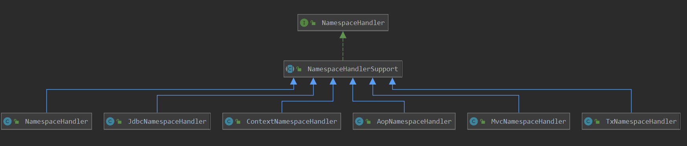

#  NamespaceHandler概述

## 1. 概述

在早期使用spring，spingMvc时会使用到大量的xml配置文件，那么这些配置文件是如何解析到spring容器中的呢？

简单说呢，针对不同xml配置中不同的namespace是由不同的handler去进行解析的，这些handler的配置放置在`META-INF/spring.handlers`中。

如，在springMvc源码的resources下有一个`META-INF/spring.handlers`文件，内容如下:

```properties
http\://www.springframework.org/schema/mvc=org.springframework.web.servlet.config.MvcNamespaceHandler
```

其配置了namespace为mvc的解析handler.

本篇就以mvc这个namespace来简单说一下namespace handler的一个大体轮廓.

## 2.社会关系

针对namespace 的handler，定义了一个顶级接口，内容如下：

```java
public interface NamespaceHandler {
	// 初始化
	void init();
	// 具体的解析功能
	@Nullable
	BeanDefinition parse(Element element, ParserContext parserContext);
	// 解析特定的element,并对BeanDefinitionHolder进行装饰
	@Nullable
	BeanDefinitionHolder decorate(Node source, BeanDefinitionHolder definition, ParserContext parserContext);
```

其中mvc handler的类图:



可以看到顶级接口就是NamespaceHandler，其下还有一个抽象类`NamespaceHandlerSupport`，下面了解一下此抽象类的功能。总体来说，此抽象类功能主要分为三种:

1. 注册对应的element的解析器 和 装饰器
2. 查找element对应的解析器 或 装饰器
3. 使用解析器或装饰器 进行解析或装饰

首先此`NamespaceHandlerSupport`实现了NamespaceHandler，并且实现了其parse解析的函数：

> org.springframework.beans.factory.xml.NamespaceHandlerSupport#parse

```java
@Override
@Nullable
public BeanDefinition parse(Element element, ParserContext parserContext) {
    // 为特定的 element查找特定的 解析器
    BeanDefinitionParser parser = findParserForElement(element, parserContext);
    // 如果找到解析器呢 就进行解析
    return (parser != null ? parser.parse(element, parserContext) : null);
}
```

其实就是查找对应的解析器，并进行解析。

在看起装饰函数:

> org.springframework.beans.factory.xml.NamespaceHandlerSupport#decorate

```java
@Override
@Nullable
public BeanDefinitionHolder decorate(
    Node node, BeanDefinitionHolder definition, ParserContext parserContext) {
    // 为 node查找对应的装饰器
    BeanDefinitionDecorator decorator = findDecoratorForNode(node, parserContext);
    // 如果存在装饰器, 则进行装饰
    return (decorator != null ? decorator.decorate(node, definition, parserContext) : null);
}
```

查找到对应的装饰器并进行解析。实现都是比较简单的，具体看一下其具体的查找工作：

> org.springframework.beans.factory.xml.NamespaceHandlerSupport#findParserForElement

```java
@Nullable
private BeanDefinitionParser findParserForElement(Element element, ParserContext parserContext) {
    // 获取 element的名字
    String localName = parserContext.getDelegate().getLocalName(element);
    // 找到对应的解析器
    BeanDefinitionParser parser = this.parsers.get(localName);
    if (parser == null) {
        parserContext.getReaderContext().fatal(
            "Cannot locate BeanDefinitionParser for element [" + localName + "]", element);
    }
    return parser;
}
```

> org.springframework.beans.factory.xml.NamespaceHandlerSupport#findDecoratorForNode

```java
@Nullable
private BeanDefinitionDecorator findDecoratorForNode(Node node, ParserContext parserContext) {
    BeanDefinitionDecorator decorator = null;
    // 获取 node的名字
    String localName = parserContext.getDelegate().getLocalName(node);
    if (node instanceof Element) {
        // 如果node是 element,则查找element对应的装饰器
        decorator = this.decorators.get(localName);
    }
    else if (node instanceof Attr) {
        // 如果是 属性,则查找属性装饰器
        decorator = this.attributeDecorators.get(localName);
    }
    else {
        parserContext.getReaderContext().fatal(
            "Cannot decorate based on Nodes of type [" + node.getClass().getName() + "]", node);
    }
    if (decorator == null) {
        parserContext.getReaderContext().fatal("Cannot locate BeanDefinitionDecorator for " +(node instanceof Element ? "element" : "attribute") + " [" + localName + "]", node);
    }
    // 返回装饰器
    return decorator;
}
```

可以看到查找动作都说是从本地的map中根据element  name来进行获取，由此可见其内部map就存储了每个element对应的handler:

```java

	// 存储 解析器和其要解析的 element的映射
	// 其中 key为element 的name, value为其对应的解析器
	private final Map<String, BeanDefinitionParser> parsers = new HashMap<>();

	// 存储 element对应的装饰器
	//  其中 key为element 的name, value为其对应的装饰器
	private final Map<String, BeanDefinitionDecorator> decorators = new HashMap<>();

	// 存储element的属性装饰器
	//  其中 key为element 的name, value为其对应的装饰器
	private final Map<String, BeanDefinitionDecorator> attributeDecorators = new HashMap<>();
```

其注册动作呢，就是把对应的handler放入到对应的map中:

> org.springframework.beans.factory.xml.NamespaceHandlerSupport#registerBeanDefinitionParser

```java
	// 注册解析器
	protected final void registerBeanDefinitionParser(String elementName, BeanDefinitionParser parser) {
		this.parsers.put(elementName, parser);
	}
```

> org.springframework.beans.factory.xml.NamespaceHandlerSupport#registerBeanDefinitionDecorator

```java
	// 注册装饰器
	protected final void registerBeanDefinitionDecorator(String elementName, BeanDefinitionDecorator dec) {
		this.decorators.put(elementName, dec);
	}
```

> org.springframework.beans.factory.xml.NamespaceHandlerSupport#registerBeanDefinitionDecoratorForAttribute

```java
	// 注册属性装饰器
	protected final void registerBeanDefinitionDecoratorForAttribute(String attrName, BeanDefinitionDecorator dec) {
		this.attributeDecorators.put(attrName, dec);
	}
```

可见此抽象类记录了具体的handler，并具有注册解析的功能，不过其并没有实现init方法，而此方法呢由具体的子类来实现。

### 2.1 MvcNamespaceHandler

> org.springframework.web.servlet.config.MvcNamespaceHandler#init

```java
@Override
public void init() {
    registerBeanDefinitionParser("annotation-driven", new AnnotationDrivenBeanDefinitionParser());
    registerBeanDefinitionParser("default-servlet-handler", new DefaultServletHandlerBeanDefinitionParser());
    registerBeanDefinitionParser("interceptors", new InterceptorsBeanDefinitionParser());
    registerBeanDefinitionParser("resources", new ResourcesBeanDefinitionParser());
    registerBeanDefinitionParser("view-controller", new ViewControllerBeanDefinitionParser());
    registerBeanDefinitionParser("redirect-view-controller", new ViewControllerBeanDefinitionParser());
    registerBeanDefinitionParser("status-controller", new ViewControllerBeanDefinitionParser());
    registerBeanDefinitionParser("view-resolvers", new ViewResolversBeanDefinitionParser());
    registerBeanDefinitionParser("tiles-configurer", new TilesConfigurerBeanDefinitionParser());
    registerBeanDefinitionParser("freemarker-configurer", new FreeMarkerConfigurerBeanDefinitionParser());
    registerBeanDefinitionParser("groovy-configurer", new GroovyMarkupConfigurerBeanDefinitionParser());
    registerBeanDefinitionParser("script-template-configurer", new ScriptTemplateConfigurerBeanDefinitionParser());
    registerBeanDefinitionParser("cors", new CorsBeanDefinitionParser());
}
```

可以看到具体的子类MvcNamespaceHandler只有一个init方法，其调用父类的注册方法，向其进行注册对应的element 的handler。

### 2.2 AopNamespaceHandler

> org.springframework.aop.config.AopNamespaceHandler#init

```java
	@Override
	public void init() {
		// In 2.0 XSD as well as in 2.1 XSD.
		registerBeanDefinitionParser("config", new ConfigBeanDefinitionParser());
		registerBeanDefinitionParser("aspectj-autoproxy", new AspectJAutoProxyBeanDefinitionParser());
		registerBeanDefinitionDecorator("scoped-proxy", new ScopedProxyBeanDefinitionDecorator());

		// Only in 2.0 XSD: moved to context namespace as of 2.1
		registerBeanDefinitionParser("spring-configured", new SpringConfiguredBeanDefinitionParser());
	}
```

其他的namespace也是类似，当要查看具体的 tag解析器时，可以再去看具体的类实现。


