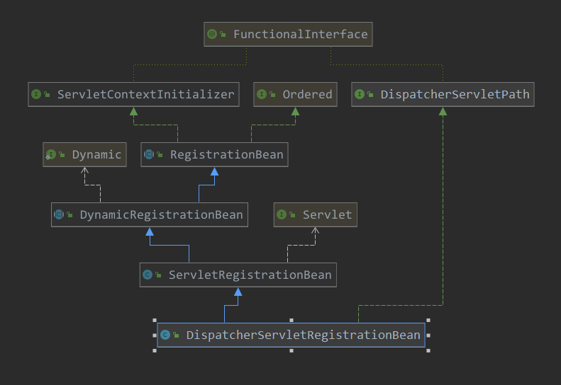

[TOC]

# springboot中 springMVC的配置

本篇看一下springboot对springmvc的一些配置，先从自动配置看起：

spring.factories:

```properties
org.springframework.boot.autoconfigure.EnableAutoConfiguration=\
org.springframework.boot.autoconfigure.web.servlet.DispatcherServletAutoConfiguration,\
```

看起注解：

```java
@AutoConfigureOrder(Ordered.HIGHEST_PRECEDENCE)
@Configuration
// 依赖于 webApplication
@ConditionalOnWebApplication(type = Type.SERVLET)
// 依赖于类 diapatcherServlet
@ConditionalOnClass(DispatcherServlet.class)
// 在 servlet容器配置后,在进行配置
@AutoConfigureAfter(ServletWebServerFactoryAutoConfiguration.class)
// dispatcherServlet 的自动配置
public class DispatcherServletAutoConfiguration {
 	....   
}
```

再看其内部的配置类：

```java
// 默认的dispatcherServlet 的servlet beanName
public static final String DEFAULT_DISPATCHER_SERVLET_BEAN_NAME = "dispatcherServlet";

// 注册 dispatcherServlet到tomcat 的 bean的beanName
public static final String DEFAULT_DISPATCHER_SERVLET_REGISTRATION_BEAN_NAME = "dispatcherServletRegistration";

@Configuration
@Conditional(DefaultDispatcherServletCondition.class)
@ConditionalOnClass(ServletRegistration.class)
@EnableConfigurationProperties({ HttpProperties.class, WebMvcProperties.class })
// 内部配置类
// 此是dispatcherServlet的配置类
protected static class DispatcherServletConfiguration {

    private final HttpProperties httpProperties;

    private final WebMvcProperties webMvcProperties;

    public DispatcherServletConfiguration(HttpProperties httpProperties, WebMvcProperties webMvcProperties) {
        this.httpProperties = httpProperties;
        this.webMvcProperties = webMvcProperties;
    }
    // 注入了一个bean到容器中,此bean是DispatcherServlet
    @Bean(name = DEFAULT_DISPATCHER_SERVLET_BEAN_NAME)
    public DispatcherServlet dispatcherServlet() {
        DispatcherServlet dispatcherServlet = new DispatcherServlet();
        dispatcherServlet.setDispatchOptionsRequest(this.webMvcProperties.isDispatchOptionsRequest());
        dispatcherServlet.setDispatchTraceRequest(this.webMvcProperties.isDispatchTraceRequest());
        dispatcherServlet
            .setThrowExceptionIfNoHandlerFound(this.webMvcProperties.isThrowExceptionIfNoHandlerFound());
        dispatcherServlet.setEnableLoggingRequestDetails(this.httpProperties.isLogRequestDetails());
        return dispatcherServlet;
    }

    @Bean
    @ConditionalOnBean(MultipartResolver.class)
    @ConditionalOnMissingBean(name = DispatcherServlet.MULTIPART_RESOLVER_BEAN_NAME)
    public MultipartResolver multipartResolver(MultipartResolver resolver) {
        // Detect if the user has created a MultipartResolver but named it incorrectly
        return resolver;
    }

}

@Configuration
@Conditional(DispatcherServletRegistrationCondition.class)
@ConditionalOnClass(ServletRegistration.class)
@EnableConfigurationProperties(WebMvcProperties.class)
@Import(DispatcherServletConfiguration.class)
// 注册 DispatcherServlet 到tomcat的 ServletRegistration的配置
protected static class DispatcherServletRegistrationConfiguration {

    private final WebMvcProperties webMvcProperties;
    private final MultipartConfigElement multipartConfig;
    public DispatcherServletRegistrationConfiguration(WebMvcProperties webMvcProperties,
     ObjectProvider<MultipartConfigElement> multipartConfigProvider) {
        this.webMvcProperties = webMvcProperties;
        this.multipartConfig = multipartConfigProvider.getIfAvailable();
    }

    @Bean(name = DEFAULT_DISPATCHER_SERVLET_REGISTRATION_BEAN_NAME)
    @ConditionalOnBean(value = DispatcherServlet.class, name = DEFAULT_DISPATCHER_SERVLET_BEAN_NAME)
    public DispatcherServletRegistrationBean dispatcherServletRegistration(DispatcherServlet dispatcherServlet) {
        // 创建了DispatcherServletRegistrationBean, 并在构造器中注入了dispatcherServlet,以及 dispatcherServlet的path
        DispatcherServletRegistrationBean registration = new DispatcherServletRegistrationBean(dispatcherServlet,this.webMvcProperties.getServlet().getPath());
        // 设置名字
        registration.setName(DEFAULT_DISPATCHER_SERVLET_BEAN_NAME);
        // 是否 立即加载启动
        registration.setLoadOnStartup(this.webMvcProperties.getServlet().getLoadOnStartup());
        if (this.multipartConfig != null) {
            registration.setMultipartConfig(this.multipartConfig);
        }
        return registration;
    }
}
```

可以看到最终，仍然是通过DispatcherServletRegistrationBean来注入到tomcat的，看一下其类图就清楚了：



经过前面分析，看到此处应该就了解后面是如何把dispatcherServlet注册到tomcat了。


