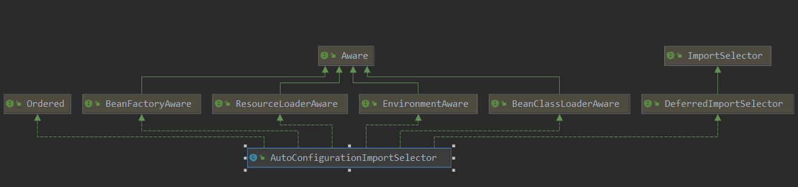
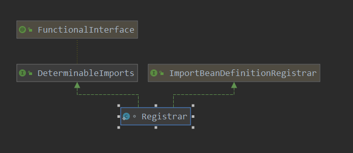

[TOC]

# 强大的SpringBootApplication注解

平时使用springboot开发的伙伴们肯定对SpringBootApplication此注解很熟悉了，在启动方法的类上添加此注解，之后就可以正常启动了。而在使用springBoot开发后，大家发现不需要特意指定组件扫描路径，但是大家肯定会发现只有在启动类子包中的组件才能被扫描到。说这么多呢，其实就想说，之所以这样，很多程度上，其实都跟SpringBootApplication注解有关系。

本篇呢，就来说说这个注解。

```java
@Target(ElementType.TYPE)
@Retention(RetentionPolicy.RUNTIME)
@Documented
@Inherited
// SpringBootConfiguration就是Configuration,表示启动类中也可以编写一些配置
@SpringBootConfiguration
// 自动配置的注解(springboot开箱即用的主要实现)
// 以此为入口,看一些开箱即用的实现
@EnableAutoConfiguration
// 组件扫描
@ComponentScan(excludeFilters = { @Filter(type = FilterType.CUSTOM, classes = TypeExcludeFilter.class),
		@Filter(type = FilterType.CUSTOM, classes = AutoConfigurationExcludeFilter.class) })
public @interface SpringBootApplication {
	@AliasFor(annotation = EnableAutoConfiguration.class)
	Class<?>[] exclude() default {};
	@AliasFor(annotation = EnableAutoConfiguration.class)
	String[] excludeName() default {};
	@AliasFor(annotation = ComponentScan.class, attribute = "basePackages")
	String[] scanBasePackages() default {};
	@AliasFor(annotation = ComponentScan.class, attribute = "basePackageClasses")
	Class<?>[] scanBasePackageClasses() default {};
}
```

在看一下此类上添加的其他注解：

```java
@Target(ElementType.TYPE)
@Retention(RetentionPolicy.RUNTIME)
@Documented
// 这表示 SpringBootApplication 本身也可以是一个配置类
@Configuration
public @interface SpringBootConfiguration {
}
```

本身是一个配置类什么意思呢？ 就是在启动类中使用@Bean 注解添加bean到容器中，这个都是可以的。

```java
@Target(ElementType.TYPE)
@Retention(RetentionPolicy.RUNTIME)
@Documented
@Inherited
// 此注解是实现注册启动类下面的package中的组件的
@AutoConfigurationPackage
// 可以看到,开启自动配置会注入一个类
// 注入AutoConfigurationImportSelector 到容器中
@Import(AutoConfigurationImportSelector.class)
public @interface EnableAutoConfiguration {
    String ENABLED_OVERRIDE_PROPERTY = "spring.boot.enableautoconfiguration";
    Class<?>[] exclude() default {};
    String[] excludeName() default {};
}

```

看一下AutoConfigurationImportSelector的类图:



可以看到此类功能同样是注入一些bean到容器中，看一下此bean的具体的工作：

> org.springframework.boot.autoconfigure.AutoConfigurationImportSelector#selectImports

```java
@Override
public String[] selectImports(AnnotationMetadata annotationMetadata) {
    if (!isEnabled(annotationMetadata)) {
        return NO_IMPORTS;
    }
    AutoConfigurationMetadata autoConfigurationMetadata = AutoConfigurationMetadataLoader
        .loadMetadata(this.beanClassLoader);
    // getAutoConfigurationEntry获取到要加载的类的全路径,此从spring.factory中加载
    // 具体是EnableAutoConfiguration对应的那些全部类
    AutoConfigurationEntry autoConfigurationEntry = getAutoConfigurationEntry(autoConfigurationMetadata,annotationMetadata);
    // 把要注入的类名,转换为  数组
    return StringUtils.toStringArray(autoConfigurationEntry.getConfigurations());
}
```

> org.springframework.boot.autoconfigure.AutoConfigurationImportSelector#getAutoConfigurationEntry

```java
protected AutoConfigurationEntry getAutoConfigurationEntry(AutoConfigurationMetadata autoConfigurationMetadata,AnnotationMetadata annotationMetadata) {
    if (!isEnabled(annotationMetadata)) {
        return EMPTY_ENTRY;
    }
    // 获取注解的属性
    AnnotationAttributes attributes = getAttributes(annotationMetadata);
    // 从META-INF/spring.factories中加载EnableAutoConfiguration此key对应的配置类到容器中
    // 获取候选的配置类
    List<String> configurations = getCandidateConfigurations(annotationMetadata, attributes);
    // 去重
    configurations = removeDuplicates(configurations);
    // 得到 注解上的exclusion
    Set<String> exclusions = getExclusions(annotationMetadata, attributes);
    // 利用exclusion条件, 去除满足exclusion的配置
    checkExcludedClasses(configurations, exclusions);
    configurations.removeAll(exclusions);
    //  从spring.factories中加载AutoConfigurationImportFilter过滤器,进行过滤
    configurations = filter(configurations, autoConfigurationMetadata);
    //从spring.factories中获取AutoConfigurationImportListener, 并通知其AutoConfigurationImportEvent 事件
    fireAutoConfigurationImportEvents(configurations, exclusions);
    // 包装一下合适的配置, 以及 exclude的配置类
    return new AutoConfigurationEntry(configurations, exclusions);
}
```

这里做了哪些事呢？

1. 获取EnableAutoConfiguration 注解的属性值
2.  从META-INF/spring.factories中加载EnableAutoConfiguration此key对应的配置类
3. 对加载的配置类去重，以及根据 exclude 来进行排除
4.   从spring.factories中加载AutoConfigurationImportFilter过滤器,并对要加载的配置类进行过滤
5.  从spring.factories中获取AutoConfigurationImportListener, 并通知其AutoConfigurationImportEvent 事件
6. 返回最终的合适的配置类

看一下EnableAutoConfiguration配置类的加载：

```java
protected List<String> getCandidateConfigurations(AnnotationMetadata metadata, AnnotationAttributes attributes) {
    /**
		 * 从META-INF/spring.factories中加载EnableAutoConfiguration这个key对应的项目
		 * 此EnableAutoConfiguration对应很多的配置类; 此配置类有大约100多个,来达到对对应的模块自动配置
		 */
    List<String> configurations = SpringFactoriesLoader.loadFactoryNames(getSpringFactoriesLoaderFactoryClass(),getBeanClassLoader());
    Assert.notEmpty(configurations, "No auto configuration classes found in META-INF/spring.factories. If you " + "are using a custom packaging, make sure that file is correct.");
    return configurations;
}
```

```java
protected Class<?> getSpringFactoriesLoaderFactoryClass() {
    return EnableAutoConfiguration.class;
}
```

这里的SpringFactoriesLoader.loadFactoryNames会被使用多次，主要都是从spring.factories中加载类名，此处说一下，后面涉及到的就不再分析了：

> org.springframework.core.io.support.SpringFactoriesLoader#loadFactoryNames

```java
public static List<String> loadFactoryNames(Class<?> factoryClass, @Nullable ClassLoader classLoader) {
    String factoryClassName = factoryClass.getName();
    // loadSpringFactories(classLoader) 先进行加载,返回结果是一个 properties
    // getOrDefault   返回factoryClassName 对应的value,如果没有,则返回一个空列表
    return loadSpringFactories(classLoader).getOrDefault(factoryClassName, Collections.emptyList());
}

public static final String FACTORIES_RESOURCE_LOCATION = "META-INF/spring.factories";
private static Map<String, List<String>> loadSpringFactories(@Nullable ClassLoader classLoader) {
    MultiValueMap<String, String> result = cache.get(classLoader);
    if (result != null) {
        return result;
    }
    try {
        // 加载 META-INF/spring.factories 文件
        Enumeration<URL> urls = (classLoader != null ?
                                 classLoader.getResources(FACTORIES_RESOURCE_LOCATION) :
                                 ClassLoader.getSystemResources(FACTORIES_RESOURCE_LOCATION));
        result = new LinkedMultiValueMap<>();
        // 如果spring.factories有多个,则循环添加
        while (urls.hasMoreElements()) {
            URL url = urls.nextElement();
            UrlResource resource = new UrlResource(url);
            // 把文件加载到 properties中
            Properties properties = PropertiesLoaderUtils.loadProperties(resource);
            // 遍历properties中的值
            for (Map.Entry<?, ?> entry : properties.entrySet()) {
                // 获取key,也就是对应的全类名
                // 例如: EnableAutoConfiguration的全类名
                String factoryClassName = ((String) entry.getKey()).trim();
                // 遍历key对应的value,并添加到 result中
                // key对应的value,可以使用逗号分隔
                for (String factoryName : StringUtils.commaDelimitedListToStringArray((String) entry.getValue())) {
                    result.add(factoryClassName, factoryName.trim());
                }
            }
        }
        // 缓存结果
        cache.put(classLoader, result);
        return result;
    }
    catch (IOException ex) {
        ...
    }
}
```


AutoConfigurationImportFilter 类的加载:

> org.springframework.boot.autoconfigure.AutoConfigurationImportSelector#filter

```java
// 从spring.factories中加载AutoConfigurationImportFilter过滤器,进行过滤
private List<String> filter(List<String> configurations, AutoConfigurationMetadata autoConfigurationMetadata) {
    long startTime = System.nanoTime();
    // 保存候选配置类
    String[] candidates = StringUtils.toStringArray(configurations);
    // 保存candidates对应位置上 配置类是否过滤
    boolean[] skip = new boolean[candidates.length];
    boolean skipped = false;
    // 从spring.factories 加载AutoConfigurationImportFilter对应的过滤器
    // 依次调用过滤器对候选的 配置类进行 过滤
    for (AutoConfigurationImportFilter filter : getAutoConfigurationImportFilters()) {
        // 对filter通过 aware接口,注入对应的属性值
        invokeAwareMethods(filter);
        // 过滤操作
        boolean[] match = filter.match(candidates, autoConfigurationMetadata);
        for (int i = 0; i < match.length; i++) {
            if (!match[i]) {
                // 对应位置过滤
                skip[i] = true;
                // 并把对应位置上的配置类 释放
                candidates[i] = null;
                skipped = true;
            }
        }
    }
    // 如果没有过滤,则直接返回
    if (!skipped) {
        return configurations;
    }
    // 创建一个容器,来记录 最终合适的配置类
    List<String> result = new ArrayList<>(candidates.length);
    // 遍历所有的配置列
    for (int i = 0; i < candidates.length; i++) {
        // 如果对应的位置为false,表示没有过滤,则记录起来
        if (!skip[i]) {
            result.add(candidates[i]);
        }
    }
    if (logger.isTraceEnabled()) {
        int numberFiltered = configurations.size() - result.size();
        logger.trace("Filtered " + numberFiltered + " auto configuration class in "
                     + TimeUnit.NANOSECONDS.toMillis(System.nanoTime() - startTime) + " ms");
    }
    return new ArrayList<>(result);
}
```

AutoConfigurationImportListener的加载

> org.springframework.boot.autoconfigure.AutoConfigurationImportSelector#fireAutoConfigurationImportEvents

```java
// 从spring.factories中获取AutoConfigurationImportListener, 并通知其AutoConfigurationImportEvent 事件
private void fireAutoConfigurationImportEvents(List<String> configurations, Set<String> exclusions) {
    // 从spring.factories中获取AutoConfigurationImportListener,
    List<AutoConfigurationImportListener> listeners = getAutoConfigurationImportListeners();
    // 如果存在listener呢,则会发送事件
    if (!listeners.isEmpty()) {
        // 创建事件
        AutoConfigurationImportEvent event = new AutoConfigurationImportEvent(this, configurations, exclusions);
        for (AutoConfigurationImportListener listener : listeners) {
            // 回调各种 Aware接口,来注入相应的field
            invokeAwareMethods(listener);
            // 调用监听器,对事件进行处理
            listener.onAutoConfigurationImportEvent(event);
        }
    }
}
```

由此可见EnableAutoConfiguration注解，向容器中注入了spirng.factories中EnableAutoConfiguration对应的很多个配置类，以此来达到了springboot的开箱即用。设计的很巧妙哈。

在看一下注解AutoConfigurationPackage： 

```java
@Target(ElementType.TYPE)
@Retention(RetentionPolicy.RUNTIME)
@Documented
@Inherited
// 看到 AutoConfigurationPackage 同样注入一个类到容器中
@Import(AutoConfigurationPackages.Registrar.class)
public @interface AutoConfigurationPackage {

}
```

可以看到，此类同样是向容器中注入了一个类，在看一下Registrar的类图：



可以看到这这个Registrar类，同样是向容器中进行bean的注册的。看一下此类的具体工作:

```java
// ImportBeanDefinitionRegistrar 此类就是注册beanDefinition到容器中
static class Registrar implements ImportBeanDefinitionRegistrar, DeterminableImports {
    //  注册动作
    @Override
    public void registerBeanDefinitions(AnnotationMetadata metadata, BeanDefinitionRegistry registry) {
        // 可以看到此处是创建一个PackageImport类
        // PackageImport会得到注解所在的package
        register(registry, new PackageImport(metadata).getPackageName());
    }

    @Override
    public Set<Object> determineImports(AnnotationMetadata metadata) {
        return Collections.singleton(new PackageImport(metadata));
    }
}
```

此类乍一看很小巧，仔细一看功能同样不容小觑啊。继续看下去：

```java
public static void register(BeanDefinitionRegistry registry, String... packageNames) {
    if (registry.containsBeanDefinition(BEAN)) {
        BeanDefinition beanDefinition = registry.getBeanDefinition(BEAN);
        ConstructorArgumentValues constructorArguments = beanDefinition.getConstructorArgumentValues();
        constructorArguments.addIndexedArgumentValue(0, addBasePackages(constructorArguments, packageNames));
    }
    else {
        /**
			 * 1. 可以看到此处创建一个beanDefinition,但是呢具体实例化的类是 BasePackages
			 * 2. 并且添加了一个构造函数的参数
			 * 3. BasePackages此类hold刚才那个package路径
			 */
        GenericBeanDefinition beanDefinition = new GenericBeanDefinition();
        beanDefinition.setBeanClass(BasePackages.class);
        beanDefinition.getConstructorArgumentValues().addIndexedArgumentValue(0, packageNames);
        beanDefinition.setRole(BeanDefinition.ROLE_INFRASTRUCTURE);
        // 注册到容器中
        registry.registerBeanDefinition(BEAN, beanDefinition);
    }
}
```

此操作向容器中注入了一个角色为ROLE_INFRASTRUCTURE的bean，此bean的beanClass为BasePackages，构造器参数为packageNames，也就是AutoConfigurationPackage注解的package路径，看起来此bean跟最后的扫描是有关系的，这也是为什么默认会扫描SpringBootApplication注解的子包。

在小结一下SpringBootApplication注解的工作：

1. 通过EnableAutoConfiguration 向容器中注册 很多的自动配置类
2. 通过AutoConfigurationPackage向容器中注册一个bean，此bean和SpringBootApplication扫描此注解的子包有关系。


