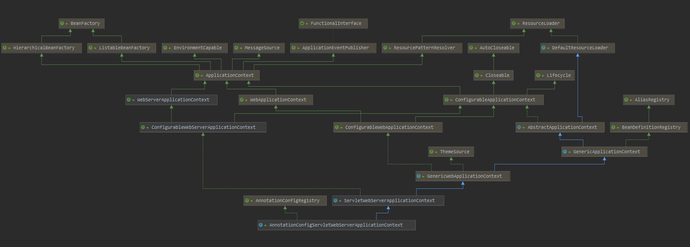
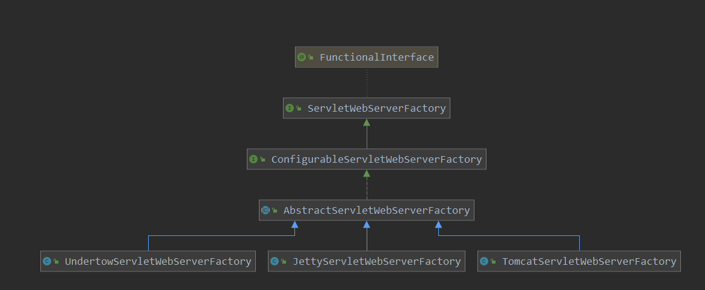

[TOC]

# springboot 容器的启动

本篇咱们看一下springboot的容器的启动，此处分析tomcat。先从spring.factories中找到关于tomcat的配置，以此为入口开始进行分析。

```properties
org.springframework.boot.autoconfigure.EnableAutoConfiguration=\
org.springframework.boot.autoconfigure.web.embedded.EmbeddedWebServerFactoryCustomizerAutoConfiguration,\
org.springframework.boot.autoconfigure.web.servlet.ServletWebServerFactoryAutoConfiguration,\
... 省略其他
```

```java
// springboot是如何启动servlet容器的呢?
// 就是在这里启动的了.
@Configuration
// 必须是一个web工程;
@ConditionalOnWebApplication
// 引入一个配置类 比如端口  contextPath等信息
@EnableConfigurationProperties(ServerProperties.class)
public class EmbeddedWebServerFactoryCustomizerAutoConfiguration {
    /**
	 * Nested configuration if Tomcat is being used.
	 */
    @Configuration
    @ConditionalOnClass({ Tomcat.class, UpgradeProtocol.class })
    public static class TomcatWebServerFactoryCustomizerConfiguration {
        // tomcat容器
        // 看一下这个吧
        @Bean
        public TomcatWebServerFactoryCustomizer tomcatWebServerFactoryCustomizer(Environment environment,ServerProperties serverProperties) {
            return new TomcatWebServerFactoryCustomizer(environment, serverProperties);
        }
    }

    @Configuration
    @ConditionalOnClass({ Server.class, Loader.class, WebAppContext.class })
    public static class JettyWebServerFactoryCustomizerConfiguration {
        // jetty容器
        @Bean
        public JettyWebServerFactoryCustomizer jettyWebServerFactoryCustomizer(Environment environment,ServerProperties serverProperties) {
            return new JettyWebServerFactoryCustomizer(environment, serverProperties);
        }
    }
    @Configuration
    @ConditionalOnClass({ Undertow.class, SslClientAuthMode.class })
    public static class UndertowWebServerFactoryCustomizerConfiguration {
        // undertom  容器
        @Bean
        public UndertowWebServerFactoryCustomizer undertowWebServerFactoryCustomizer(Environment environment,ServerProperties serverProperties) {
            return new UndertowWebServerFactoryCustomizer(environment, serverProperties);
        }
    }
    @Configuration
    @ConditionalOnClass(HttpServer.class)
    public static class NettyWebServerFactoryCustomizerConfiguration {
        @Bean
        public NettyWebServerFactoryCustomizer nettyWebServerFactoryCustomizer(Environment environment,ServerProperties serverProperties) {
            return new NettyWebServerFactoryCustomizer(environment, serverProperties);
        }
    }
}
```

此处可以看到根据条件来创建不同的servlet容器customer，有tomcat，jetty，undertom以及netty。此处咱们看一下tomcat-customizer的创建。

```java
//  记录下环境 以及  servelt配置
public TomcatWebServerFactoryCustomizer(Environment environment, ServerProperties serverProperties) {
    this.environment = environment;
    this.serverProperties = serverProperties;
}
```

此类是对tomcat容器的一些定制操作。

然后再看一下ServletWebServerFactoryAutoConfiguration此自动配置类:

```java
@Configuration
@AutoConfigureOrder(Ordered.HIGHEST_PRECEDENCE)
@ConditionalOnClass(ServletRequest.class)
// 必须是servlet类型
@ConditionalOnWebApplication(type = Type.SERVLET)
// servelt的配置
@EnableConfigurationProperties(ServerProperties.class)
/**
 * 此处注入了很多bean到容器中
 * 1. BeanPostProcessorsRegistrar为一个后置处理器
 * 2. EmbeddedTomcat  一个创建tomcat容器的工厂类
 * 3. EmbeddedJetty
 * BeanPostProcessorsRegistrar 后置处理器向容器注入bean WebServerFactoryCustomizerBeanPostProcessor 和
 * ErrorPageRegistrarBeanPostProcessor。其中WebServerFactoryCustomizerBeanPostProcessor 主要的工作就是调用customer对servlet容器
 * 进行定制化
 */
@Import({ ServletWebServerFactoryAutoConfiguration.BeanPostProcessorsRegistrar.class,
         ServletWebServerFactoryConfiguration.EmbeddedTomcat.class,	// Tomcat 容器
         ServletWebServerFactoryConfiguration.EmbeddedJetty.class,	// jetty容器
         ServletWebServerFactoryConfiguration.EmbeddedUndertow.class })
public class ServletWebServerFactoryAutoConfiguration {

    @Bean
    public ServletWebServerFactoryCustomizer servletWebServerFactoryCustomizer(ServerProperties serverProperties) {
        return new ServletWebServerFactoryCustomizer(serverProperties);
    }

    @Bean
    @ConditionalOnClass(name = "org.apache.catalina.startup.Tomcat")
    public TomcatServletWebServerFactoryCustomizer tomcatServletWebServerFactoryCustomizer(
        ServerProperties serverProperties) {
        return new TomcatServletWebServerFactoryCustomizer(serverProperties);
    }

    /**
	 * Registers a {@link WebServerFactoryCustomizerBeanPostProcessor}. Registered via
	 * {@link ImportBeanDefinitionRegistrar} for early registration.
	 */
    public static class BeanPostProcessorsRegistrar implements ImportBeanDefinitionRegistrar, BeanFactoryAware {

        private ConfigurableListableBeanFactory beanFactory;

        @Override
        public void setBeanFactory(BeanFactory beanFactory) throws BeansException {
            if (beanFactory instanceof ConfigurableListableBeanFactory) {
                this.beanFactory = (ConfigurableListableBeanFactory) beanFactory;
            }
        }
        @Override
        public void registerBeanDefinitions(AnnotationMetadata importingClassMetadata,
                                            BeanDefinitionRegistry registry) {
            if (this.beanFactory == null) {
                return;
            }
            // 向容器中注入 WebServerFactoryCustomizerBeanPostProcessor 后置处理器,用于调用各种customer对servlet容器进行定制
            registerSyntheticBeanIfMissing(registry, "webServerFactoryCustomizerBeanPostProcessor",
                                           WebServerFactoryCustomizerBeanPostProcessor.class);
            // ErrorPageRegistrarBeanPostProcessor 用于注册 errorpage
            // 有待再分析
            registerSyntheticBeanIfMissing(registry, "errorPageRegistrarBeanPostProcessor",
                                           ErrorPageRegistrarBeanPostProcessor.class);
        }

        private void registerSyntheticBeanIfMissing(BeanDefinitionRegistry registry, String name, Class<?> beanClass) {
            if (ObjectUtils.isEmpty(this.beanFactory.getBeanNamesForType(beanClass, true, false))) {
                RootBeanDefinition beanDefinition = new RootBeanDefinition(beanClass);
                // 记录此 bean是Synthetic(合成的)
                beanDefinition.setSynthetic(true);
                // 注册beanDefinition到容器
                registry.registerBeanDefinition(name, beanDefinition);
            }
        }

    }

}
```

此类导入了多个类:

1. BeanPostProcessorsRegistrar 后置处理器，注册后置处理器，用于对serlvet容器进行定制
2. 注册EmbeddedTomcat 容器的工厂类

看一下此工厂类：

> org.springframework.boot.autoconfigure.web.servlet.ServletWebServerFactoryConfiguration

```java
@Configuration
class ServletWebServerFactoryConfiguration {

	@Configuration
	@ConditionalOnClass({ Servlet.class, Tomcat.class, UpgradeProtocol.class })
	@ConditionalOnMissingBean(value = ServletWebServerFactory.class, search = SearchStrategy.CURRENT)
	static class EmbeddedTomcat {

		@Bean
		public TomcatServletWebServerFactory tomcatServletWebServerFactory() {
			// tomcat 容器
			return new TomcatServletWebServerFactory();
		}

	}

	@Configuration
	@ConditionalOnClass({ Servlet.class, Server.class, Loader.class, WebAppContext.class })
	@ConditionalOnMissingBean(value = ServletWebServerFactory.class, search = SearchStrategy.CURRENT)
	static class EmbeddedJetty {

		@Bean
		public JettyServletWebServerFactory JettyServletWebServerFactory() {
			return new JettyServletWebServerFactory();
		}

	}

	@Configuration
	@ConditionalOnClass({ Servlet.class, Undertow.class, SslClientAuthMode.class })
	@ConditionalOnMissingBean(value = ServletWebServerFactory.class, search = SearchStrategy.CURRENT)
	static class EmbeddedUndertow {

		@Bean
		public UndertowServletWebServerFactory undertowServletWebServerFactory() {
			return new UndertowServletWebServerFactory();
		}
	}
}
```


然后在回顾一下springboot的启动:

```java
public ConfigurableApplicationContext run(String... args) {
        // 6. 创建ApplicationContext
        // 对于web项目,应该会创建 AnnotationConfigServletWebServerApplicationContext
        // 注意:AnnotationConfigServletWebServerApplicationContext的父类 ServletWebServerApplicationContext
        // 重载了 onRefresh()方法, 当容器进行刷新操作是,会调用此方法, 此方法会创建 servlet容器
        context = createApplicationContext();
		.....
        // 7. 容器刷新  IOC AOP 核心
        refreshContext(context);
        // 用于子类功能扩展的函数  spring的老套路
        afterRefresh(context, applicationArguments);
    }
    .....
}
```

此处创建了applicationContext，此处创建的应该是AnnotationConfigServletWebServerApplicationContext，看一下此类图：



类图比较负责，也显示了其功能比较强大。其创建完之后，会进行刷新操作，在回顾一下其刷新操作：

```java
@Override
public void refresh() throws BeansException, IllegalStateException {
    synchronized (this.startupShutdownMonitor) {
		...
            // Initialize other special beans in specific context subclasses.
            onRefresh();
        }
        .....
    }
```

这是applicationContext进行刷新时的一个扩展函数，在这里呢，就对此扩展函数进行了实现，看一下此函数:

> org.springframework.boot.web.servlet.context.ServletWebServerApplicationContext#onRefresh

```java
@Override
protected void onRefresh() {
    super.onRefresh();
    try {
        // 创建webServer,也就是会创建容器
        createWebServer();
    }
    catch (Throwable ex) {
        throw new ApplicationContextException("Unable to start web server", ex);
    }
}
```

> org.springframework.boot.web.servlet.context.ServletWebServerApplicationContext#createWebServer

```java
// 创建webServer
private void createWebServer() {
    WebServer webServer = this.webServer;
    // 获取seveltContext
    // 不过第一次这里肯定是 null了
    ServletContext servletContext = getServletContext();
    if (webServer == null && servletContext == null) {
        // getWebServerFactory获取创建容器的工厂类
        ServletWebServerFactory factory = getWebServerFactory();
        // 调用其getWebServer进行创建
// getSelfInitializer() 获取容器中的ServletContextInitializer并调用其onStartUp方法,此操作会把servelt
        // filter listener 注册到context中
        // todo * * * * 重要
        // getSelfInitializer() 此函数在此处只是返回一个函数
        // getWebServer 函数比较特殊,此处参数接收到了一个 函数
        this.webServer = factory.getWebServer(getSelfInitializer());
    }
    else if (servletContext != null) {
        try {
            getSelfInitializer().onStartup(servletContext);
        }
        catch (ServletException ex) {
            throw new ApplicationContextException("Cannot initialize servlet context", ex);
        }
    }
    // 对servletConfigInitParams servletContextInitParams参数的获取
    initPropertySources();
    // 至此 servlet 容器就启动了
}
```

在这里就创建了容器，并进行了启动。

> org.springframework.boot.web.servlet.context.ServletWebServerApplicationContext#getWebServerFactory

```java
protected ServletWebServerFactory getWebServerFactory() {
    // Use bean names so that we don't consider the hierarchy
    // 从容器中获取ServletWebServerFactory类型的类
    String[] beanNames = getBeanFactory().getBeanNamesForType(ServletWebServerFactory.class);
    if (beanNames.length == 0) {
        throw new ApplicationContextException("Unable to start ServletWebServerApplicationContext due to missing "+ "ServletWebServerFactory bean.");
    }
    if (beanNames.length > 1) {
        throw new ApplicationContextException("Unable to start ServletWebServerApplicationContext due to multiple " + "ServletWebServerFactory beans : " + StringUtils.arrayToCommaDelimitedString(beanNames));
    }
    // 实例化ServletWebServerFactory类型的第一个类
    return getBeanFactory().getBean(beanNames[0], ServletWebServerFactory.class);
}
```

此操作主要就是从容器中获取ServletWebServerFactory类型的bean进行初始化，其实ServletWebServerFactory就是其他servlet容器工厂类的父类，看一下上面注册的servlet容器的工厂类类图：



可以看到，就是上面自动配置类ServletWebServerFactoryAutoConfiguration注册到容器中的工厂类TomcatServletWebServerFactory。

继续向下：

> org.springframework.boot.web.servlet.context.ServletWebServerApplicationContext#getSelfInitializer

```java
// 注意此处哦,此处返回一个函数,后面会调用函数来进行 进一步的初始化
private org.springframework.boot.web.servlet.ServletContextInitializer getSelfInitializer() {
    return this::selfInitialize;
}

// 这只是向tomcat中添加一个 ServletContextInitializer, 在context的start中执行
// 后面会看到,此操作是向 context注册 servlet的操作
private void selfInitialize(ServletContext servletContext) throws ServletException {
    // 1. 先尝试从servletContext中获取rootContext(即根容器),如果存在则报错
    // 2. 把当前的 applicationContext注册到  ServletContext
    // 3. 记录当前的servletContext
    prepareWebApplicationContext(servletContext);
    // 1. 注册 servlerScope 到容器中
    // 2  添加此scope到servletContext中
    registerApplicationScope(servletContext);
    WebApplicationContextUtils.registerEnvironmentBeans(getBeanFactory(), servletContext);
    // 获取容器中ServletContextInitializer
    // servletContextInitializer的onstartup方法调用其子类ServletRegistrationBean FilterRegistrationBean等的方法
    // 把servelt filter listener注册到了 tomcat中的context上
    for (ServletContextInitializer beans : getServletContextInitializerBeans()) {
        // 1. 此步骤会把servlet filter listener 注册到context上
        // 2.
        beans.onStartup(servletContext);
    }
}
```

获取了ServletContextInitializer之后，现在就要开始真正的创建tomcat容器了：

> org.springframework.boot.web.embedded.tomcat.TomcatServletWebServerFactory#getWebServer

```java
/**
	 * todo 真正创建 tomcat的地方
	 *  创建servlet容器
	 *  此函数 被调用时,参数给定的是一个 函数
	 */
@Override
public WebServer getWebServer(ServletContextInitializer... initializers) {
    // 创建 Tomcat
    Tomcat tomcat = new Tomcat();
    // 创建baseDir, 默认是 tomcat
    File baseDir = (this.baseDirectory != null) ? this.baseDirectory : createTempDir("tomcat");
    // 记录baseDir
    tomcat.setBaseDir(baseDir.getAbsolutePath());
    // 连接器
    Connector connector = new Connector(this.protocol);
    // 添加连接器到 service
    tomcat.getService().addConnector(connector);
    // 对连接器的一些配置,如端口, urlencode, 是否开始ssl
    customizeConnector(connector);
    // 记录 connector
    tomcat.setConnector(connector);
    tomcat.getHost().setAutoDeploy(false);
    // 配置 engine
    configureEngine(tomcat.getEngine());
    // 添加额外的  connector 到tomcat 容器中
    for (Connector additionalConnector : this.additionalTomcatConnectors) {
        tomcat.getService().addConnector(additionalConnector);
    }
    // 对context进行了很多的 custom操作
    prepareContext(tomcat.getHost(), initializers);
    // 根据创建的tomcat进行启动操作
    return getTomcatWebServer(tomcat);
}
```

此函数的工作还是比较多的，小结一下：

1. 创建Tomcat
2. 创建 baseDir，并记录下来
3. 创建连接器，并添加到service中
4. 配置连接器的端口等信息
5. 配置engine
6. 添加额外的connecotor到容器中
7. 准备context，此context是tomcat中的
8. 创建tomcatServer

前面的创建及配置就先不看了，了解一下最后两步：

> org.springframework.boot.web.embedded.tomcat.TomcatServletWebServerFactory#prepareContext

```java
// 对tomcat standardContext的配置
protected void prepareContext(Host host, ServletContextInitializer[] initializers) {
    File documentRoot = getValidDocumentRoot();
    // 创建TomcatEmbeddedContext ,此时standardContext的子类,主要就是 代表此应用了
    TomcatEmbeddedContext context = new TomcatEmbeddedContext();
    if (documentRoot != null) {
        context.setResources(new LoaderHidingResourceRoot(context));
    }
    // 设置context的name 以及context的path
    context.setName(getContextPath());
    context.setDisplayName(getDisplayName());
    // 配置context的映射路径
    context.setPath(getContextPath());
    // 配置  tomcat docbase
    File docBase = (documentRoot != null) ? documentRoot : createTempDir("tomcat-docbase");
    context.setDocBase(docBase.getAbsolutePath());
    // 添加一个监听器, 此监听器功能很多..
    // 1. 处理server listener filter的注解
    context.addLifecycleListener(new FixContextListener());
    context.setParentClassLoader((this.resourceLoader != null) ? this.resourceLoader.getClassLoader()
                                 : ClassUtils.getDefaultClassLoader());
    resetDefaultLocaleMapping(context);
    // 配置locale的映射,此和编码有关
    addLocaleMappings(context);
    context.setUseRelativeRedirects(false);
    try {
        context.setCreateUploadTargets(true);
    }
    catch (NoSuchMethodError ex) {
        // Tomcat is < 8.5.39. Continue.
    }
    // 配置扫描jar时的过滤规则
    configureTldSkipPatterns(context);
    WebappLoader loader = new WebappLoader(context.getParentClassLoader());
    // 设置类加载器
    loader.setLoaderClass(TomcatEmbeddedWebappClassLoader.class.getName());
    loader.setDelegate(true);
    context.setLoader(loader);
    // 记录一个defaultServlet到容器中
    if (isRegisterDefaultServlet()) {
        addDefaultServlet(context);
    }
    // 注册jsp的解析器
    if (shouldRegisterJspServlet()) {
        addJspServlet(context);
        addJasperInitializer(context);
    }
    context.addLifecycleListener(new StaticResourceConfigurer(context));
    // 合并这些 ServletContextInitializer
    ServletContextInitializer[] initializersToUse = mergeInitializers(initializers);
    // 把此 context 添加到host中
    host.addChild(context);
    // 1. 注册ServletContextInitializer到tomcat中
    // 2. 注册监听器
    // 3. 配置sesison
    // 4. 对context调用TomcatContextCustomizer.customize 再次进行配置
    configureContext(context, initializersToUse);
    // 子类扩展
    postProcessContext(context);
}
```

这里注释还是比较清晰的，可见做了不少工作，在小结一下此函数的工作：

1. 创建TomcatEmbeddedContext ,此时standardContext的子类,主要就是 代表此应用了
2. 设置context的name，以及contextPath； 可见contextName和contextPath是一样的，值都为contextPath
3. 设置docbase
4. 给context添加一个监听器
5. 配置扫描jar时的过滤规则
6. 设置类加载器
7. 设置一个 默认的servelt到容器，即defaultServlet
8. 注册jsp的解析器
9. 再添加一个静态资源的监听器
10. 合并ServletContextInitializer，并添加到 context中
11. 对context的配置

这里就看一下最后一步，对context的配置：

```java
protected void configureContext(Context context, ServletContextInitializer[] initializers) {
    // TomcatStarter 此是调用ServletContextInitializer onStartUp方法的地址
    TomcatStarter starter = new TomcatStarter(initializers);
    if (context instanceof TomcatEmbeddedContext) {
        TomcatEmbeddedContext embeddedContext = (TomcatEmbeddedContext) context;
        embeddedContext.setStarter(starter);
        embeddedContext.setFailCtxIfServletStartFails(true);
    }
    // 记录 ServletContextInitializer 到tomcat的 standardContext中
    context.addServletContainerInitializer(starter, NO_CLASSES);
    // 添加监听器到  context
    for (LifecycleListener lifecycleListener : this.contextLifecycleListeners) {
        context.addLifecycleListener(lifecycleListener);
    }
    // 添加 contextValue 到  context的 pipeline中
    for (Valve valve : this.contextValves) {
        context.getPipeline().addValve(valve);
    }
    // errorpage 的设置
    for (ErrorPage errorPage : getErrorPages()) {
        new TomcatErrorPage(errorPage).addToContext(context);
    }
    for (MimeMappings.Mapping mapping : getMimeMappings()) {
        context.addMimeMapping(mapping.getExtension(), mapping.getMimeType());
    }
    // 1. 配置session 的超时时间
    // 2. 如果设置了session的超时时间,则配置一下超时时间
    configureSession(context);
    // 进行一些配置
    new DisableReferenceClearingContextCustomizer().customize(context);
    // 使用注册的 TomcatContextCustomizer 对context再次进行 custom 操作
    for (TomcatContextCustomizer customizer : this.tomcatContextCustomizers) {
        customizer.customize(context);
    }
}
```

此时对standardContext的准备就完成了，不过这里使用的是其子类TomcatEmbeddedContext。

继续向下看：

```java
// 10. 根据创建的tomcat进行启动操作
return getTomcatWebServer(tomcat);
```

> org.springframework.boot.web.embedded.tomcat.TomcatServletWebServerFactory#getTomcatWebServer

```java
protected TomcatWebServer getTomcatWebServer(Tomcat tomcat) {
    // 创建tomcatServer
    return new TomcatWebServer(tomcat, getPort() >= 0);
}
```

> org.springframework.boot.web.embedded.tomcat.TomcatWebServer#TomcatWebServer(org.apache.catalina.startup.Tomcat, boolean)

```java
public TomcatWebServer(Tomcat tomcat, boolean autoStart) {
    Assert.notNull(tomcat, "Tomcat Server must not be null");
    this.tomcat = tomcat;
    this.autoStart = autoStart;
    // 初始化
    initialize();
}
```

```java
private void initialize() throws WebServerException {
    logger.info("Tomcat initialized with port(s): " + getPortsDescription(false));
    synchronized (this.monitor) {
        try {
            // 配置engine的name
            addInstanceIdToEngineName();
            // 查找standardContext
            Context context = findContext();
            context.addLifecycleListener((event) -> {
                if (context.equals(event.getSource()) && Lifecycle.START_EVENT.equals(event.getType())) {
                    removeServiceConnectors();
                }
            });
            // 启动
            // Start the server to trigger initialization listeners
            this.tomcat.start();

            // We can re-throw failure exception directly in the main thread
            rethrowDeferredStartupExceptions();

            try {
                ContextBindings.bindClassLoader(context, context.getNamingToken(), getClass().getClassLoader());
            }
            catch (NamingException ex) {
                // Naming is not enabled. Continue
            }
            // 防止tomcat容器退出
            startDaemonAwaitThread();
        }
        catch (Exception ex) {
            stopSilently();
            destroySilently();
            throw new WebServerException("Unable to start embedded Tomcat", ex);
        }
    }
}
```

可以看到此处就启动了tomcat，到此servlet容器就启动完成了，不过了解过tomcat源码的，应该会知道，在standardContext的start过程中，会调用ServletContextInitializer的onstartUp方法，而前面咱们注册了一个ServletContextInitializer到容器中，在回顾一下：

```java
// 这只是向tomcat中添加一个 ServletContextInitializer, 在context的start中执行
// 后面会看到,此操作是向 context注册 servlet的操作
private void selfInitialize(ServletContext servletContext) throws ServletException {
    // 1. 先尝试从servletContext中获取rootContext(即根容器),如果存在则报错
    // 2. 把当前的 applicationContext注册到  ServletContext
    // 3. 记录当前的servletContext
    prepareWebApplicationContext(servletContext);
    // 1. 注册 servlerScope 到容器中
    // 2  添加此scope到servletContext中
    registerApplicationScope(servletContext);
    WebApplicationContextUtils.registerEnvironmentBeans(getBeanFactory(), servletContext);
    // 获取容器中ServletContextInitializer
    // servletContextInitializer的onstartup方法调用其子类ServletRegistrationBean FilterRegistrationBean等的方法
    // 把servelt filter listener注册到了 tomcat中的context上
    for (ServletContextInitializer beans : getServletContextInitializerBeans()) {
        // 1. 此步骤会把servlet filter listener 注册到context上
        // 2.
        beans.onStartup(servletContext);
    }
}
```

此函数最大的作用，就是把servlet注册到了tomcat容器中。springboot的tomcat容器启动就分析到此了，至于ServletContextInitializer如何注册servlet到容器中，后面咱们再分析。


