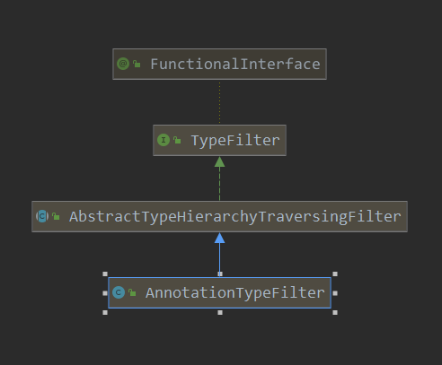

[TOC]

# ClassPathScanningCandidateComponentProvider 的扫描

接着上篇咱们说一下在扫描servlet，filter，listener的组件时，ClassPathScanningCandidateComponentProvider是如何做的。

回顾一下上篇:

```java
// 创建ClassPathScanningCandidateComponentProvider, 并把 初始化的处理器 记录到其中
private ClassPathScanningCandidateComponentProvider createComponentProvider() {
    // 创建动作
    ClassPathScanningCandidateComponentProvider componentProvider = new ClassPathScanningCandidateComponentProvider(false);
    // 记录 environment
    componentProvider.setEnvironment(this.applicationContext.getEnvironment());
    // 记录 resourceLoader
    componentProvider.setResourceLoader(this.applicationContext);
    // 添加 过滤类型
    for (ServletComponentHandler handler : HANDLERS) {
        // 其实这里的类型,在handler创建时就指定了
        // 如WebServletHandler 的typeFilter为 WebServlet 注解
        // 这里添加这些 filter, 那么在classpath中查找  潜在的候选者时,就会使用这些filter进行过滤
        // 符合的,才是候选组件
        componentProvider.addIncludeFilter(handler.getTypeFilter());
    }
    return componentProvider;
}
```

```java
// 对路径进行扫描动作
private void scanPackage(ClassPathScanningCandidateComponentProvider componentProvider, String packageToScan) {
    // 查找路径中潜在的  component
    // findCandidateComponents此处查找候选者,主要是根据上面添加的那些 TypeFilter来进行过滤的
    // 也就是扫描那些 带有 WebServlet  WebFilter WebListener注解的bean
    for (BeanDefinition candidate : componentProvider.findCandidateComponents(packageToScan)) {
        if (candidate instanceof AnnotatedBeanDefinition) {
            // 然后所有的候选者，进行处理
            for (ServletComponentHandler handler : HANDLERS) {
                // 处理候选者
                handler.handle(((AnnotatedBeanDefinition) candidate),
                               (BeanDefinitionRegistry) this.applicationContext);
            }
        }
    }
}
```

可以清晰的看出，先创建了ClassPathScanningCandidateComponentProvider，配置，之后调用其findCandidateComponents来进行扫描。这里主要讲解的就是findCandidateComponents这个扫描过程。

不过看扫描前，先看看其配置都做了什么：

1. 设置environment
2. 设置resourceLoader
3. 配置IncludeFilter

前两步就不多说了，这里主要看一下第三步，看一下这里的配置：

HENDLERS的初始化：

```java
// 记录一些处理器
private static final List<ServletComponentHandler> HANDLERS;

static {
    // 在静态代码块中添加一些 handler
    List<ServletComponentHandler> servletComponentHandlers = new ArrayList<>();
    servletComponentHandlers.add(new WebServletHandler());
    servletComponentHandlers.add(new WebFilterHandler());
    servletComponentHandlers.add(new WebListenerHandler());
    // 并记录到  HANDLERS
    HANDLERS = Collections.unmodifiableList(servletComponentHandlers);
}
```

在看一下添加的各个handler的初始化

```java
WebServletHandler() {
    super(WebServlet.class);
}
// 父类的初始化
protected ServletComponentHandler(Class<? extends Annotation> annotationType) {
    // 可见这里创建了 AnnotationTypeFilter 这种注解类型的过滤器
    this.typeFilter = new AnnotationTypeFilter(annotationType);
    this.annotationType = annotationType;
}
```

其他连个handler处理类似，只是类型不一样。这样就清楚了，向ClassPathScanningCandidateComponentProvider中添加的过滤器是AnnotationTypeFilter， 那么看一下这种过滤器的初始化，及类图把:

> org.springframework.core.type.filter.AnnotationTypeFilter#AnnotationTypeFilter(java.lang.Class<? extends java.lang.annotation.Annotation

```java
public AnnotationTypeFilter(Class<? extends Annotation> annotationType) {
    this(annotationType, true, false);
}

public AnnotationTypeFilter(Class<? extends Annotation> annotationType, boolean considerMetaAnnotations, boolean considerInterfaces) {
    super(annotationType.isAnnotationPresent(Inherited.class), considerInterfaces);
    this.annotationType = annotationType;
    this.considerMetaAnnotations = considerMetaAnnotations;
}

// 父类构造器
protected AbstractTypeHierarchyTraversingFilter(boolean considerInherited, boolean considerInterfaces) {
    this.considerInherited = considerInherited;
    this.considerInterfaces = considerInterfaces;
}
```



这里就了解了添加的过滤器类型了，下面咱们看一下具体的查找：

> org.springframework.context.annotation.ClassPathScanningCandidateComponentProvider#findCandidateComponents

```java
public Set<BeanDefinition> findCandidateComponents(String basePackage) {
    if (this.componentsIndex != null && indexSupportsIncludeFilters()) {
        return addCandidateComponentsFromIndex(this.componentsIndex, basePackage);
    }
    else {
        return scanCandidateComponents(basePackage);
    }
}
```

> org.springframework.context.annotation.ClassPathScanningCandidateComponentProvider#scanCandidateComponents

```java
// 查找时的前缀  后缀匹配
String CLASSPATH_ALL_URL_PREFIX = "classpath*:";
static final String DEFAULT_RESOURCE_PATTERN = "**/*.class";
private String resourcePattern = DEFAULT_RESOURCE_PATTERN;

// 具体的扫描动作
private Set<BeanDefinition> scanCandidateComponents(String basePackage) {
    Set<BeanDefinition> candidates = new LinkedHashSet<>();
    try {
        // 得到查找的路径
        String packageSearchPath = ResourcePatternResolver.CLASSPATH_ALL_URL_PREFIX +
            resolveBasePackage(basePackage) + '/' + this.resourcePattern;
        // 只要符合上述的bean,都被扫描到
        Resource[] resources = getResourcePatternResolver().getResources(packageSearchPath);
        // 日志 级别
        boolean traceEnabled = logger.isTraceEnabled();
        boolean debugEnabled = logger.isDebugEnabled();
        // 遍历所有扫描到的 资源
        for (Resource resource : resources) {
            if (resource.isReadable()) {
                try {
                    // 读取 资源的 源信息
                    MetadataReader metadataReader = getMetadataReaderFactory().getMetadataReader(resource);
                    // 判断是否是 候选的组件
                    // 在判断是否是组件时, 主要就是使用注册 includefilter来进行判断,符合则说明是
                    // 不符合,则不是                
                    if (isCandidateComponent(metadataReader)) {
                        ScannedGenericBeanDefinition sbd = new ScannedGenericBeanDefinition(metadataReader);
                        sbd.setSource(resource);
                        // 再次判断此 beanDefinition是否是候选组件
                        // 如果是候选 组件,则保存起来
	// 此处,主要是根据 bean是否是 independ,以及 lookup注解等来判断
                        if (isCandidateComponent(sbd)) {
                            if (debugEnabled) {
                                logger.debug("Identified candidate component class: " + resource);
                            }
                            candidates.add(sbd);
                        }
                        else {
                            if (debugEnabled) {
                        logger.debug("Ignored because not a concrete top-level class: " + resource);
                            }
                        }
                    }
                    else {
                        if (traceEnabled) {
                            logger.trace("Ignored because not matching any filter: " + resource);
                        }
                    }
                }
                catch (Throwable ex) {
                    throw new BeanDefinitionStoreException(
                        "Failed to read candidate component class: " + resource, ex);
                }
            }
            else {
                if (traceEnabled) {
                    logger.trace("Ignored because not readable: " + resource);
                }
            }
        }
    }
    catch (IOException ex) {
        throw new BeanDefinitionStoreException("I/O failure during classpath scanning", ex);
    }
    return candidates;
}
```

第一个：

> org.springframework.context.annotation.ClassPathScanningCandidateComponentProvider#isCandidateComponent(org.springframework.core.type.classreading.MetadataReader)

```java
protected boolean isCandidateComponent(MetadataReader metadataReader) throws IOException {
    // 可以看到, 先进行 exclude的过滤
    for (TypeFilter tf : this.excludeFilters) {
        if (tf.match(metadataReader, getMetadataReaderFactory())) {
            return false;
        }
    }
    // 在进行 includeFilter的过滤,符合则 表示true
    for (TypeFilter tf : this.includeFilters) {
        if (tf.match(metadataReader, getMetadataReaderFactory())) {
            return isConditionMatch(metadataReader);
        }
    }
    return false;
}
```

第二个判断逻辑

> org.springframework.context.annotation.ClassPathScanningCandidateComponentProvider#isCandidateComponent(org.springframework.beans.factory.annotation.AnnotatedBeanDefinition)

```java
	protected boolean isCandidateComponent(AnnotatedBeanDefinition beanDefinition) {
		AnnotationMetadata metadata = beanDefinition.getMetadata();
		return (metadata.isIndependent() && (metadata.isConcrete() ||
				(metadata.isAbstract() && metadata.hasAnnotatedMethods(Lookup.class.getName()))));
	}
```

具体的对比动作:

> org.springframework.core.type.filter.AbstractTypeHierarchyTraversingFilter#match

```java
@Override
public boolean match(MetadataReader metadataReader, MetadataReaderFactory metadataReaderFactory)
    throws IOException {

    // This method optimizes avoiding unnecessary creation of ClassReaders
    // as well as visiting over those readers.
    // 先和自己匹配
    if (matchSelf(metadataReader)) {
        return true;
    }
    ClassMetadata metadata = metadataReader.getClassMetadata();
    // 和注解的类匹配
    if (matchClassName(metadata.getClassName())) {
        return true;
    }
    // 如果考虑继承,则查看 父类 是否有指定类型的注解
    if (this.considerInherited) {
        // 获取父类
        String superClassName = metadata.getSuperClassName();
        if (superClassName != null) {
            // Optimization to avoid creating ClassReader for super class.
            // 存在父类,则查看父类是否有指定注解
            Boolean superClassMatch = matchSuperClass(superClassName);
            if (superClassMatch != null) {
                if (superClassMatch.booleanValue()) {
                    return true;
                }
            }
            else {
                // Need to read super class to determine a match...
                try {
                    // 读取 父类的 源信息, 再次调用此match函数进行匹配, 此相当于是 递归操作
                    if (match(metadata.getSuperClassName(), metadataReaderFactory)) {
                        return true;
                    }
                }
                catch (IOException ex) {
                    if (logger.isDebugEnabled()) {
                        logger.debug("Could not read super class [" + metadata.getSuperClassName() +
                                     "] of type-filtered class [" + metadata.getClassName() + "]");
                    }
                }
            }
        }
    }
    // 如果考虑接口
    if (this.considerInterfaces) {
        // 则遍历所有的接口 name
        for (String ifc : metadata.getInterfaceNames()) {
            // Optimization to avoid creating ClassReader for super class
            // 并和接口 进行match, 就是查看接口是否有指定的 注解
            Boolean interfaceMatch = matchInterface(ifc);
            if (interfaceMatch != null) {
                if (interfaceMatch.booleanValue()) {
                    return true;
                }
            }
            else {
                // Need to read interface to determine a match...
                try {
                    // 读取接口的源信息 再次调用此match 递归进行匹配
                    if (match(ifc, metadataReaderFactory)) {
                        return true;
                    }
                }
                catch (IOException ex) {
                    if (logger.isDebugEnabled()) {
                    logger.debug("Could not read interface [" + ifc + "] for type-filtered class [" +
                                     metadata.getClassName() + "]");
                    }
                }
            }
        }
    }
    return false;
}

```

> org.springframework.core.type.filter.AnnotationTypeFilter#matchSelf

```java
// 此在 构造函数中赋值  为  true
private final boolean considerMetaAnnotations;
public AnnotationTypeFilter(Class<? extends Annotation> annotationType) {
    // 第二个 值
    this(annotationType, true, false);
}

// 和自己 比对
@Override
protected boolean matchSelf(MetadataReader metadataReader) {
    // 获取注解的信息
    AnnotationMetadata metadata = metadataReader.getAnnotationMetadata();
    // 是否有指定的注解
    // 此处注解为: WebServlet,WebFilter,WebListener
    return metadata.hasAnnotation(this.annotationType.getName()) ||
        (this.considerMetaAnnotations && metadata.hasMetaAnnotation(this.annotationType.getName()));
}

@Override
@Nullable
protected Boolean matchSuperClass(String superClassName) {
    // 和父类对比
    // 父类是否有指定 注解
    return hasAnnotation(superClassName);
}

@Override
@Nullable
protected Boolean matchInterface(String interfaceName) {
    // 和接口匹配
    // 查看接口是否有自定的注解
    return hasAnnotation(interfaceName);
}

@Nullable
protected Boolean hasAnnotation(String typeName) {
    // typeName是 object,则返回false
    if (Object.class.getName().equals(typeName)) {
        return false;
    }
    // typeName是java的类,则false
    else if (typeName.startsWith("java")) {
        if (!this.annotationType.getName().startsWith("java")) {
            // Standard Java types do not have non-standard annotations on them ->
            // skip any load attempt, in particular for Java language interfaces.
            return false;
        }
        try {
            // 加载指定的类,查看其是否有指定的注解
            Class<?> clazz = ClassUtils.forName(typeName, getClass().getClassLoader());
            return ((this.considerMetaAnnotations ? AnnotationUtils.getAnnotation(clazz, this.annotationType) : clazz.getAnnotation(this.annotationType)) != null);
        }
        catch (Throwable ex) {
            // Class not regularly loadable - can't determine a match that way.
        }
    }
    return null;
}
```

到此这个查找组件的动作就完成了，主要动作还是查看是否有某些注解来判断。


