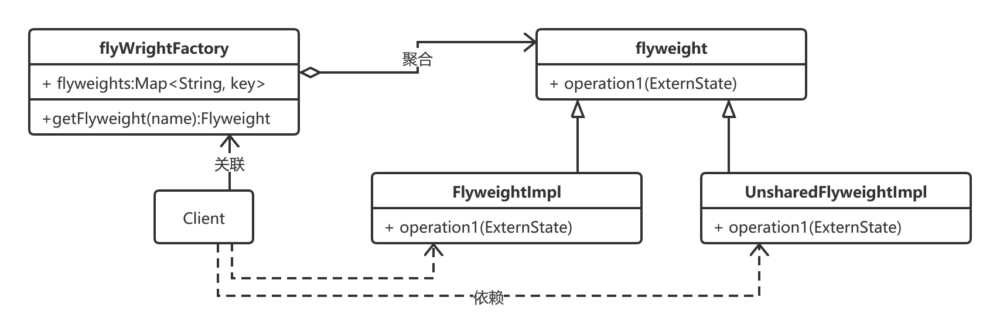

# 享元模式

## 什么是享元模式

>Use  sharing  to  support  large  numbers  of  fine-grained  objects  efficiently.
>
>使用共享技术来支持大量细粒度对象的复用.

`享元模式(Flyweight pattern)`: 要求能够共享的对象必须是轻量级对象, 也就是细粒度对象, 因此享元模式又称为轻量级模式.

享元模式以共享的方式高效的支持大量的细粒度对象,享元对象能做到共享的关键是区分内部状态和外部状态.

`内部状态:`是存储在享元对象内部并且不会随环境改变而改变的状态, 因此内部状态是可以共享的状态, 如颜料的颜色就是Pigment对象的内部状态

`外部状态:`是随环境改变而改变的,不可以共享的状态. 享元对象的外部状态必须由客户端保存, 并在享元对象被创建后, 在需要使用的时候再传入享元对象内部, 如颜料的使用者就是外部状态.

## 优缺点

> 优点
>
> 1. 可以极大减少内存中对象的数量, 使得相同对象或相似对象(内部状态相同的对象)在内存中只保存一份.
> 2. 享元模式外部状态相对独立, 而且不会影响其内部状态, 从而使得享元对象可以在不同的环境中被共享

> 缺点
>
> 1. 享元对象使得系统更加复杂, 需要分离出内部状态和外部状态, 者使得程序的逻辑复杂化
> 2. 享元对象的内部状态一经创建不能随意改变.  要解决这个问题, 需要使用对象池技术, 即享元模式的升级版.

> 应用场景
>
> 1. 一个系统有大量相同或者相似的对象, 由于这类对象的大量使用, 造成内存的大量消耗
> 2. 对象的大部分状态都可以外部化, 可以将这些外部状态传入对象中

