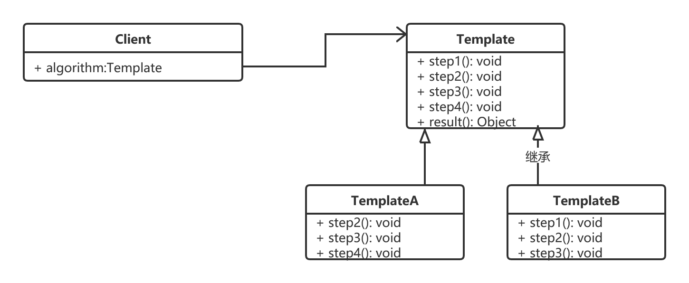

# 模板模式

## 什么是模板模式

> Define  the  skeleton  of   an  algorithm  in    an  operation,  deferring  some steps   to  client  subclasses.  Template  method lets subclasses  redefine  certain  steps  of  an  algorithm  without   changing   the  algorithm's  structure.
>
> 定义一个操作算法的框(骨)架, 而将算法中用到的某些具体步骤放到子类中实现, 使得子类可以在不改变算法结构的情况下重新定义该算法的某些特定步骤.  这个定义算法骨架的方法就叫做`模板方法模式, 简称 模板模式`.

## 优缺点

> 优点

> 缺点

> 应用场景
>
> 1. 对一些复杂算法进行分割, 将算法中固定不变的部分设计为模板方法和父类具体方法,  而一些可以改变的细节由其子类来实现. 即一次性实现一个算法的不变部分, 将可变的行为留给子类来实现
> 2. 各个子类中公共的行为应该被提取出来并集中到一个公共父类中以避免代码重复.
> 3. 需要通过子类来决定父类算法中某个步骤是否执行, 实现子类对父类的反向控制.