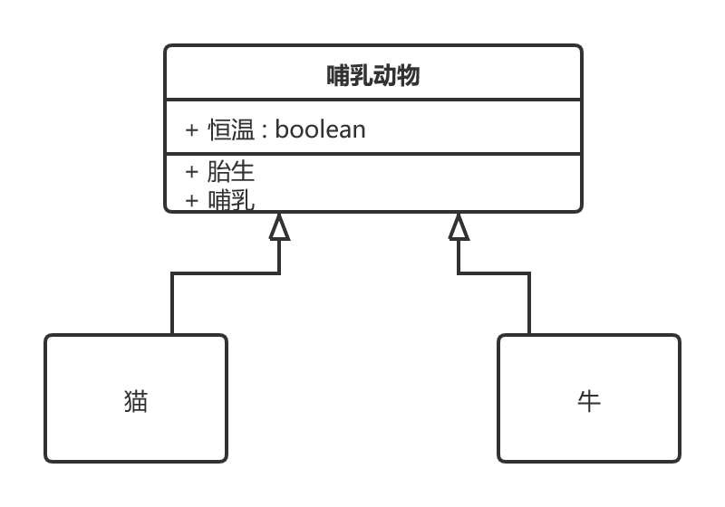
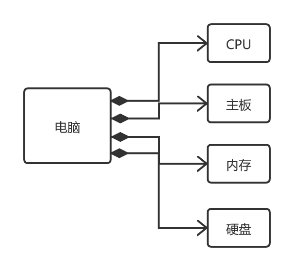
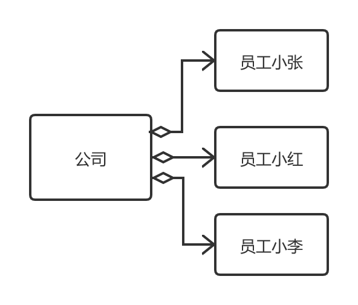
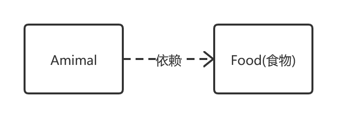

# UML 类图

UML的一整套图分为两类：一组叫结构性图,包含类图,组件图, 部署图, 对象图, 包图, 组合结构图,轮廓图;

一组叫行为性图, 包含用例图, 活动图(也叫流程图), 状态机图, 序列图, 通信图, 交互图, 时序图.

**类图**用于表示不同的实体(人, 事务和数据),以及它们彼此之间的关系. 该图描述了系统中对象的类型以及它们之间存在的各种静态关系, 是一种面向对象方法的核心建模工具.

> UML中常见的几种关系:泛化(Generalization), 实现(Realization), 组合(Composition), 聚合(Aggregation), 关联(Association), 依赖(Dependency). 这些关系的强弱顺序为: 泛化=实现 > 组合 > 聚合 > 关联 > 依赖

## 1. 泛化(Generalization)

> 泛化(Generalization)是一种继承关系,表示一般与特殊的关系, 它指定了子类如何特化父类的所有特征和行为.
>
> 如: 哺乳动物具有恒温, 胎生, 哺乳等生理特征, 猫和牛属于哺乳动物, 也都具有这些特征.

## 2.实现(Realization)

> 实现是一种类与接口的关系,表示类是接口所有特征和行为的实现.

## 3. 组合(Composition)

> 组合表示整体与部分的关系, 但部分离开整体后无法单独存在. 组合和聚合相比是一种更强的关系.
>
> 如: 电脑有CPU, 主板, 硬盘, 内存组成.  电脑与

## 4.聚合(Aggregation)

> 聚合是整体和部分的关系, 部分可以离开整体而单独存在. 
>
> 如: 一个公司有很多员工, 但员工可以离开公司单独存在.

## 5. 关联(Association)

> 关联是一种拥有关系, 它使一个类知道另一个类的属性和方法. 关联可以是双向的, 也可以是单向的.
>
> 如: 一本书会有多个读者, 一个读者也可能会有多本书, 书和读者是一种双向关系(也就是多对多); 但一本书通常只有一个作者, 是一种单向关系.

## 6.依赖(Dependency)

> 依赖是一种使用的关系, 即一个类的实现需要另一个类的协助, 所以尽量不要使用双向的互相依赖.
>
> 如: 所有的动物都需要吃东西才可以活着, 动物与食物就是一种依赖关系.

