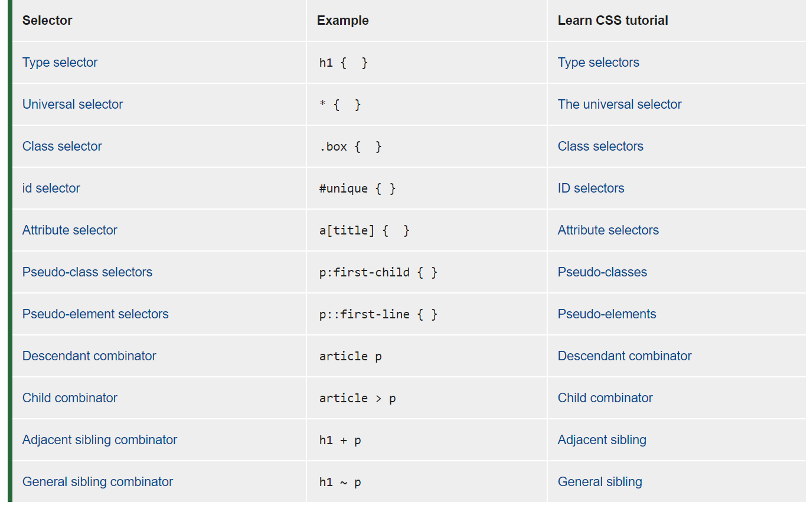
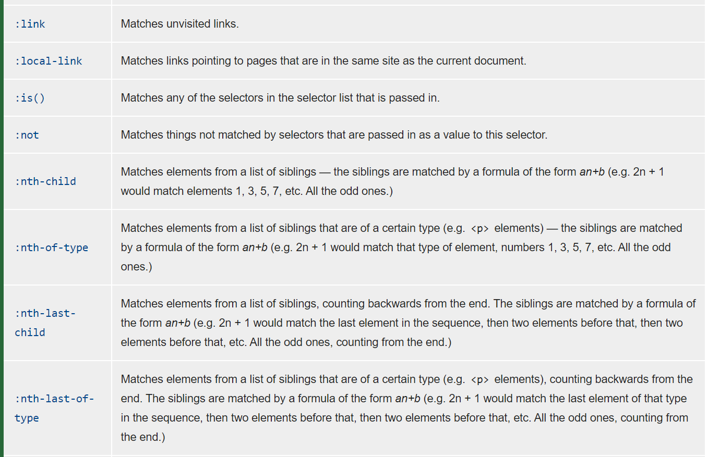
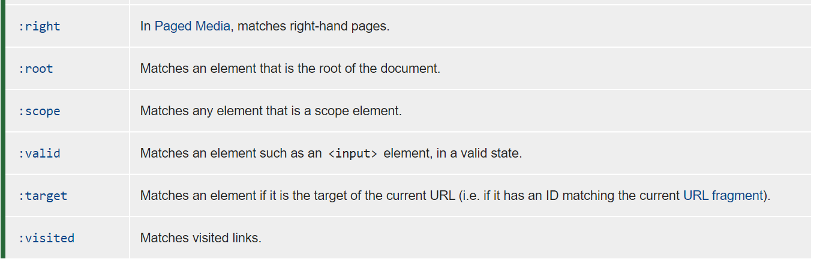

---
tags:
  - css
  - html
---

# 选择器

## 1. 选择器种类



### 属性选择器


### 伪类选择器(pseudo-class)







### 伪元素选择器(pseudo-element)


### 选择器权重

```shell
选择器                  权重
继承 或者 *             0,0,0,0
元素选择器              0,0,0,1
类选择器,伪类选择器      0,0,1,0
ID选择器                0,1,0,0
行内样式                1,0,0,0
!important             无穷大
```


