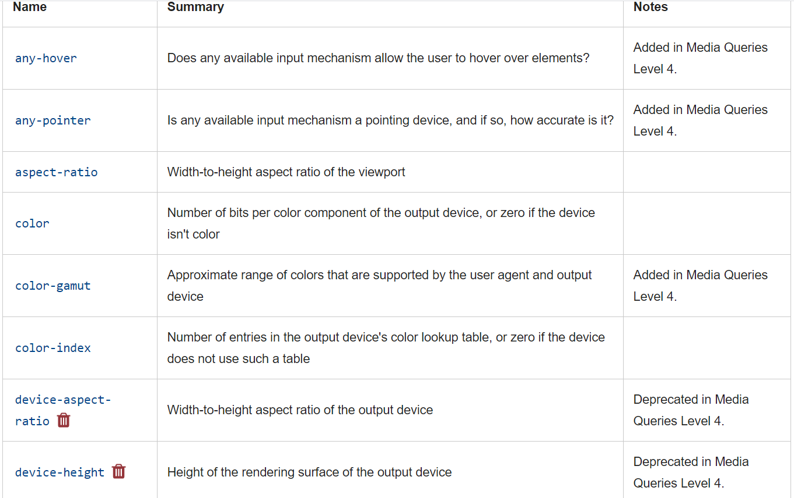
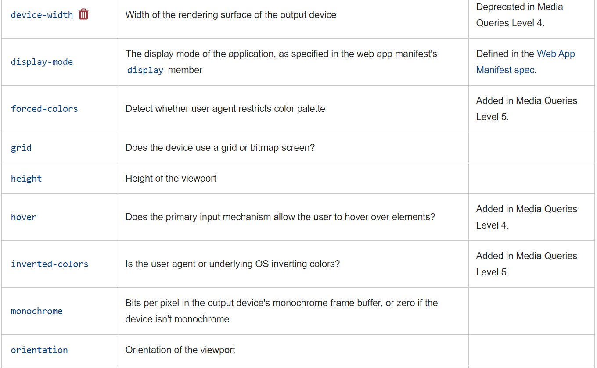
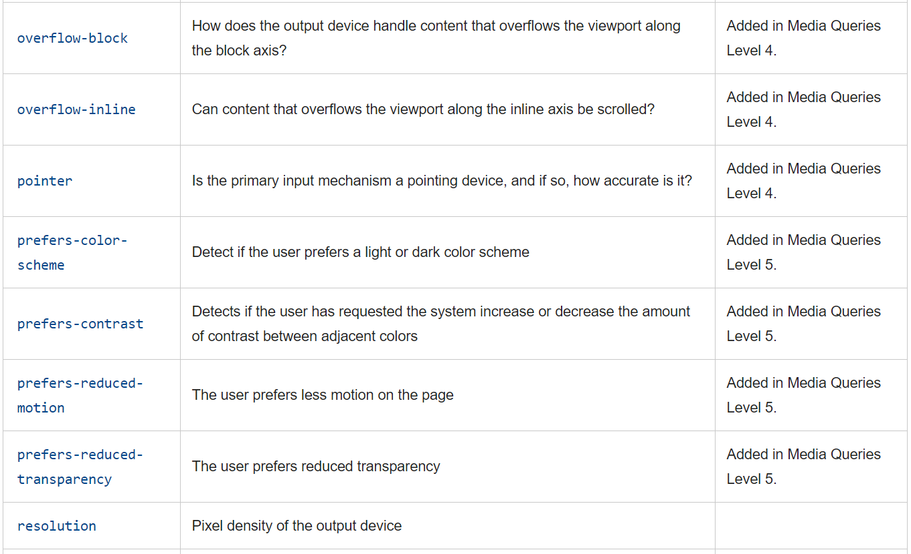

---
tags:
  - css
  - html
---

# media query

## 1. media query的类型

```css
/*
查询类型:
all		所有设备类型
print	打印设备
screen	屏幕
speech  用于语音合成器
*/
```

## 2. 可查询的feature








## 3.  查询实例

```css
/* height 大于600px*/
@media screen(height >600px) {
    body{
        line-height: 1.4;
    }
}

/*width 宽度的范围*/
@media screen(400px <= width <= 700px){
    body{line-height:1.4;}
}

/* and 逻辑*/
@media screen and (min-width: 600px) and (max-width <= 1400px){
    body {
        color: blue;
    }
}
/* or 逻辑*/
@media screen and (min-width: 600px), screen and (max-width: 1400px){
    body{
        color: red;
    }
}

/* not 逻辑*/
@media not screen and(width <= 1300px){
    body {
        color: green;
    }
}

```


